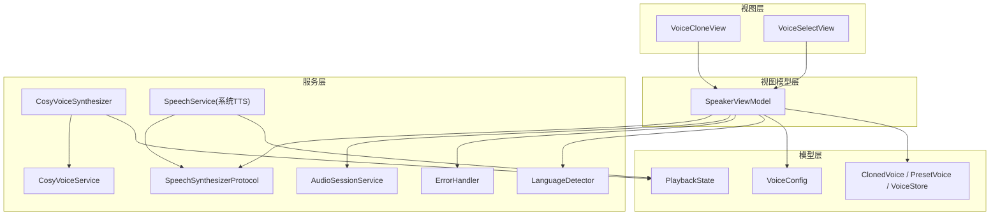
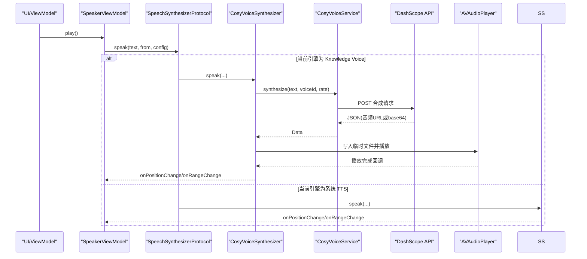
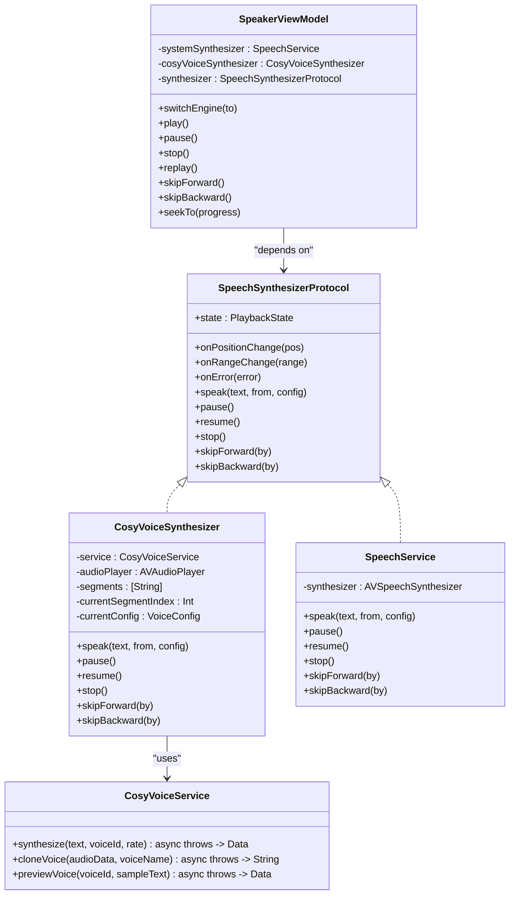

# CosyVoice 语音合成服务

<cite>
**本文引用的文件**   
- [CosyVoiceService.swift](file://Services/CosyVoiceService.swift)
- [CosyVoiceSynthesizer.swift](file://Services/CosyVoiceSynthesizer.swift)
- [SpeechSynthesizerProtocol.swift](file://Services/SpeechSynthesizerProtocol.swift)
- [SpeechService.swift](file://Services/SpeechService.swift)
- [SpeakerViewModel.swift](file://ViewModels/SpeakerViewModel.swift)
- [VoiceConfig.swift](file://Models/VoiceConfig.swift)
- [ClonedVoice.swift](file://Models/ClonedVoice.swift)
- [PlaybackState.swift](file://Models/PlaybackState.swift)
- [AudioSessionService.swift](file://Services/AudioSessionService.swift)
- [ErrorHandler.swift](file://Services/ErrorHandler.swift)
- [LanguageDetector.swift](file://Services/LanguageDetector.swift)
- [VoiceCloneView.swift](file://Views/VoiceCloneView.swift)
- [VoiceSelectView.swift](file://Views/VoiceSelectView.swift)
</cite>

## 目录
1. [简介](#简介)
2. [项目结构](#项目结构)
3. [核心组件](#核心组件)
4. [架构总览](#架构总览)
5. [详细组件分析](#详细组件分析)
6. [依赖关系分析](#依赖关系分析)
7. [性能与稳定性](#性能与稳定性)
8. [故障排查与调试](#故障排查与调试)
9. [结论](#结论)
10. [附录：API 使用示例](#附录api-使用示例)

## 简介
本文件面向集成与二次开发，系统性梳理 CosyVoice 语音合成服务的架构设计与实现细节。重点覆盖以下方面：
- CosyVoiceService（阿里云 DashScope HTTP 客户端）与 CosyVoiceSynthesizer（引擎适配器）的职责边界、数据流与控制流
- 语音合成配置项、音频参数调节与音色选择机制
- 与系统 TTS 的切换逻辑与优先级管理
- 语音克隆功能的原理与使用方法
- 完整的 API 调用示例（配置、播放控制、错误处理）

## 项目结构
围绕语音合成能力的相关代码主要分布在 Services、Models、ViewModels 与 Views 四个层次：
- Services：网络请求封装、TTS 引擎适配、系统 TTS 实现、音频会话与错误处理
- Models：配置模型、状态枚举、音色数据模型与持久化
- ViewModels：对外统一门面，负责引擎切换、播放控制、进度同步与降级策略
- Views：音色选择与克隆录音界面

图表来源
- [SpeakerViewModel.swift:1-314](file://ViewModels/SpeakerViewModel.swift#L1-L314)
- [CosyVoiceSynthesizer.swift:1-258](file://Services/CosyVoiceSynthesizer.swift#L1-L258)
- [CosyVoiceService.swift:1-219](file://Services/CosyVoiceService.swift#L1-L219)
- [SpeechService.swift:1-155](file://Services/SpeechService.swift#L1-L155)
- [SpeechSynthesizerProtocol.swift:1-20](file://Services/SpeechSynthesizerProtocol.swift#L1-L20)
- [AudioSessionService.swift:1-46](file://Services/AudioSessionService.swift#L1-L46)
- [ErrorHandler.swift:1-53](file://Services/ErrorHandler.swift#L1-L53)
- [LanguageDetector.swift:1-83](file://Services/LanguageDetector.swift#L1-L83)
- [VoiceConfig.swift:1-52](file://Models/VoiceConfig.swift#L1-L52)
- [ClonedVoice.swift:1-118](file://Models/ClonedVoice.swift#L1-L118)
- [PlaybackState.swift:1-9](file://Models/PlaybackState.swift#L1-L9)
- [VoiceCloneView.swift:1-404](file://Views/VoiceCloneView.swift#L1-L404)
- [VoiceSelectView.swift:1-215](file://Views/VoiceSelectView.swift#L1-L215)

章节来源
- [SpeakerViewModel.swift:1-314](file://ViewModels/SpeakerViewModel.swift#L1-L314)
- [CosyVoiceSynthesizer.swift:1-258](file://Services/CosyVoiceSynthesizer.swift#L1-L258)
- [CosyVoiceService.swift:1-219](file://Services/CosyVoiceService.swift#L1-L219)
- [SpeechService.swift:1-155](file://Services/SpeechService.swift#L1-L155)
- [SpeechSynthesizerProtocol.swift:1-20](file://Services/SpeechSynthesizerProtocol.swift#L1-L20)
- [AudioSessionService.swift:1-46](file://Services/AudioSessionService.swift#L1-L46)
- [ErrorHandler.swift:1-53](file://Services/ErrorHandler.swift#L1-L53)
- [LanguageDetector.swift:1-83](file://Services/LanguageDetector.swift#L1-L83)
- [VoiceConfig.swift:1-52](file://Models/VoiceConfig.swift#L1-L52)
- [ClonedVoice.swift:1-118](file://Models/ClonedVoice.swift#L1-L118)
- [PlaybackState.swift:1-9](file://Models/PlaybackState.swift#L1-L9)
- [VoiceCloneView.swift:1-404](file://Views/VoiceCloneView.swift#L1-L404)
- [VoiceSelectView.swift:1-215](file://Views/VoiceSelectView.swift#L1-L215)

## 核心组件
- CosyVoiceService：封装阿里云 DashScope CosyVoice 的 HTTP 接口，提供文本转语音、语音克隆与音色试听能力，并定义统一的错误类型。
- CosyVoiceSynthesizer：实现 SpeechSynthesizerProtocol，将 CosyVoiceService 的异步合成结果通过 AVAudioPlayer 分段播放，维护播放状态、位置与范围回调，并在出错时触发上层降级。
- SpeechService：系统 TTS 实现，同样遵循 SpeechSynthesizerProtocol，用于离线或降级场景。
- SpeakerViewModel：对外门面，负责引擎切换、播放控制、进度同步、自动语言检测与错误降级。
- VoiceConfig：语音合成配置（语速、音高、音量、语言、引擎、预设/克隆音色 ID）。
- ClonedVoice/PresetVoice/VoiceStore：音色数据模型与本地持久化。
- AudioSessionService：统一管理 AVAudioSession 的配置、激活与停用。
- ErrorHandler：全局错误日志与提示。
- LanguageDetector：基于 NSLinguisticTagger 的语言检测与系统语音匹配。

章节来源
- [CosyVoiceService.swift:1-219](file://Services/CosyVoiceService.swift#L1-L219)
- [CosyVoiceSynthesizer.swift:1-258](file://Services/CosyVoiceSynthesizer.swift#L1-L258)
- [SpeechService.swift:1-155](file://Services/SpeechService.swift#L1-L155)
- [SpeakerViewModel.swift:1-314](file://ViewModels/SpeakerViewModel.swift#L1-L314)
- [VoiceConfig.swift:1-52](file://Models/VoiceConfig.swift#L1-L52)
- [ClonedVoice.swift:1-118](file://Models/ClonedVoice.swift#L1-L118)
- [AudioSessionService.swift:1-46](file://Services/AudioSessionService.swift#L1-L46)
- [ErrorHandler.swift:1-53](file://Services/ErrorHandler.swift#L1-L53)
- [LanguageDetector.swift:1-83](file://Services/LanguageDetector.swift#L1-L83)

## 架构总览
整体采用“协议抽象 + 多引擎实现 + 门面调度”的分层设计：
- 上层仅依赖 SpeechSynthesizerProtocol，不感知具体引擎
- SpeakerViewModel 作为门面，根据配置在系统 TTS 与 CosyVoice 之间切换
- CosyVoiceSynthesizer 内部组合 CosyVoiceService 进行网络合成，并通过 AVAudioPlayer 播放
- 当网络或鉴权失败时，自动降级到系统 TTS，保证可用性

图表来源
- [SpeakerViewModel.swift:100-170](file://ViewModels/SpeakerViewModel.swift#L100-L170)
- [CosyVoiceSynthesizer.swift:28-90](file://Services/CosyVoiceSynthesizer.swift#L28-L90)
- [CosyVoiceService.swift:27-88](file://Services/CosyVoiceService.swift#L27-L88)
- [SpeechService.swift:30-72](file://Services/SpeechService.swift#L30-L72)

## 详细组件分析

### CosyVoiceService（HTTP 客户端）
职责
- 构造带鉴权的 HTTP 请求，调用 DashScope CosyVoice 的文本合成与语音克隆接口
- 解析响应：支持返回音频 URL 或 base64 两种形式
- 提供分段合成辅助方法，便于长文本拼接
- 定义结构化错误类型，便于上层统一处理

关键流程
- 文本合成：校验 API Key → 构建请求体 → 发送请求 → 解析 JSON → 下载或直接解码音频 → 返回 Data
- 语音克隆：上传参考音频 base64 → 返回 voice_id → 持久化到本地
- 分段合成：循环调用单段合成，追加 Data，并提供进度回调

错误处理
- 未配置/无效 API Key、非 200 状态码、响应格式异常、无音频数据、网络错误等均有明确错误类型

章节来源
- [CosyVoiceService.swift:27-88](file://Services/CosyVoiceService.swift#L27-L88)
- [CosyVoiceService.swift:97-144](file://Services/CosyVoiceService.swift#L97-L144)
- [CosyVoiceService.swift:167-186](file://Services/CosyVoiceService.swift#L167-L186)
- [CosyVoiceService.swift:191-218](file://Services/CosyVoiceService.swift#L191-L218)

### CosyVoiceSynthesizer（引擎适配器）
职责
- 实现 SpeechSynthesizerProtocol，将 CosyVoiceService 的异步合成结果以段落为单位播放
- 维护播放状态、当前位置与字符范围，定时更新位置
- 自动按自然断点切分文本，避免单次过长导致超时
- 在合成或播放出错时，回调 onError，由上层执行降级

关键流程
- 初始化：保存配置、计算分段与起始位置、设置 state=playing
- 合成与播放：逐段调用 service.synthesize → 写临时文件 → AVAudioPlayer 播放 → 定时器推送位置
- 自动续播：播放完成后继续下一段，直到结束
- 跳过与回退：基于播放器时间估算字符位置并回调

章节来源
- [CosyVoiceSynthesizer.swift:28-90](file://Services/CosyVoiceSynthesizer.swift#L28-L90)
- [CosyVoiceSynthesizer.swift:148-192](file://Services/CosyVoiceSynthesizer.swift#L148-L192)
- [CosyVoiceSynthesizer.swift:194-236](file://Services/CosyVoiceSynthesizer.swift#L194-L236)
- [CosyVoiceSynthesizer.swift:240-257](file://Services/CosyVoiceSynthesizer.swift#L240-L257)

### SpeechService（系统 TTS）
职责
- 基于 AVSpeechSynthesizer 的系统级 TTS 实现
- 支持断句、跳转、暂停/恢复、停止
- 通过回调上报位置与范围，供 UI 高亮与进度条使用

章节来源
- [SpeechService.swift:30-72](file://Services/SpeechService.swift#L30-L72)
- [SpeechService.swift:92-114](file://Services/SpeechService.swift#L92-L114)
- [SpeechService.swift:118-143](file://Services/SpeechService.swift#L118-L143)

### SpeakerViewModel（门面与调度）
职责
- 暴露统一的播放控制接口（play/pause/stop/replay/skip/seek）
- 根据 VoiceConfig.engine 动态切换系统 TTS 与 CosyVoice 引擎
- 监听引擎状态变化，同步进度与高亮范围
- 在引擎报错时自动降级到系统 TTS，并持久化配置

关键流程
- 切换引擎：根据 TTSEngine 选择对应实例，若正在播放则用新引擎从当前位置继续
- 播放控制：激活音频会话 → 调用引擎 speak → 绑定 onPositionChange/onRangeChange
- 错误降级：捕获 onError → 切换 engine 为 system → 重新 setupBindings

章节来源
- [SpeakerViewModel.swift:57-77](file://ViewModels/SpeakerViewModel.swift#L57-L77)
- [SpeakerViewModel.swift:100-170](file://ViewModels/SpeakerViewModel.swift#L100-L170)
- [SpeakerViewModel.swift:215-266](file://ViewModels/SpeakerViewModel.swift#L215-L266)

### 配置与音色选择
- VoiceConfig：包含语速、音高、音量、语言、引擎、预设/克隆音色 ID；提供常用语速档位
- 音色选择：
  - 预设音色：内置多组中文/英文音色，按分类展示
  - 克隆音色：用户录制后生成 voice_id，持久化并可复用
- 选择优先级：克隆音色 > 预设音色 > 默认音色（如 longxiaochun）

章节来源
- [VoiceConfig.swift:24-51](file://Models/VoiceConfig.swift#L24-L51)
- [ClonedVoice.swift:95-108](file://Models/ClonedVoice.swift#L95-L108)
- [VoiceSelectView.swift:143-163](file://Views/VoiceSelectView.swift#L143-L163)
- [CosyVoiceSynthesizer.swift:90-99](file://Services/CosyVoiceSynthesizer.swift#L90-L99)

### 语音克隆功能
- 录音：VoiceCloneView 引导朗读，使用 AVAudioRecorder 录制 PCM/WAV，限制最短时长
- 上传：调用 CosyVoiceService.cloneVoice 上传音频 base64，获取 voice_id
- 持久化：保存到本地列表，并标记为选中
- 使用：后续合成时优先使用该 voice_id

章节来源
- [VoiceCloneView.swift:283-322](file://Views/VoiceCloneView.swift#L283-L322)
- [CosyVoiceService.swift:97-144](file://Services/CosyVoiceService.swift#L97-L144)
- [ClonedVoice.swift:53-90](file://Models/ClonedVoice.swift#L53-L90)

### 自动语言检测
- 加载文档时，基于 NSLinguisticTagger 检测主导语言
- 映射到系统语音可用语言，优先选择高质量语音标识符
- 若不支持或不可用，保持当前配置不变

章节来源
- [LanguageDetector.swift:32-76](file://Services/LanguageDetector.swift#L32-L76)
- [SpeakerViewModel.swift:81-96](file://ViewModels/SpeakerViewModel.swift#L81-L96)

## 依赖关系分析
- 耦合与内聚
  - CosyVoiceSynthesizer 仅依赖 CosyVoiceService 与 AVFoundation，职责单一
  - SpeakerViewModel 聚合多个服务，但通过协议隔离引擎实现，降低耦合
- 外部依赖
  - 阿里云 DashScope API（鉴权、网络、限流）
  - AVFoundation（录音、播放、系统 TTS）
  - UserDefaults（配置与音色持久化）
- 潜在环依赖
  - 未见直接循环引用；通过弱引用与回调避免强持有

图表来源
- [SpeechSynthesizerProtocol.swift:1-20](file://Services/SpeechSynthesizerProtocol.swift#L1-L20)
- [CosyVoiceSynthesizer.swift:1-258](file://Services/CosyVoiceSynthesizer.swift#L1-L258)
- [SpeechService.swift:1-155](file://Services/SpeechService.swift#L1-L155)
- [CosyVoiceService.swift:1-219](file://Services/CosyVoiceService.swift#L1-L219)
- [SpeakerViewModel.swift:1-314](file://ViewModels/SpeakerViewModel.swift#L1-L314)

章节来源
- [SpeechSynthesizerProtocol.swift:1-20](file://Services/SpeechSynthesizerProtocol.swift#L1-L20)
- [CosyVoiceSynthesizer.swift:1-258](file://Services/CosyVoiceSynthesizer.swift#L1-L258)
- [SpeechService.swift:1-155](file://Services/SpeechService.swift#L1-L155)
- [CosyVoiceService.swift:1-219](file://Services/CosyVoiceService.swift#L1-L219)
- [SpeakerViewModel.swift:1-314](file://ViewModels/SpeakerViewModel.swift#L1-L314)

## 性能与稳定性
- 分段合成与播放
  - 长文本按自然断点切分，避免单次请求过大
  - 每段合成后写入临时文件再播放，减少内存峰值
- 并发与节流
  - 分段合成串行执行，段间加入短延迟，避免请求过快
- 资源管理
  - 停止时取消任务、释放播放器、清理临时文件
- 网络与鉴权
  - 对 401/403 快速失败，避免重试风暴
  - 非 200 状态码携带错误信息，便于定位
- 音频会话
  - 统一配置 playback/spokenAudio，支持蓝牙与 AirPlay

章节来源
- [CosyVoiceService.swift:167-186](file://Services/CosyVoiceService.swift#L167-L186)
- [CosyVoiceSynthesizer.swift:148-192](file://Services/CosyVoiceSynthesizer.swift#L148-L192)
- [AudioSessionService.swift:14-44](file://Services/AudioSessionService.swift#L14-L44)

## 故障排查与调试
常见问题与定位要点
- 未配置或无效 API Key
  - 现象：立即抛出鉴权相关错误
  - 处理：检查设置中是否已配置 dashscope_api_key
- 网络错误或服务端异常
  - 现象：非 200 状态码或网络异常
  - 处理：查看错误消息中的状态码与详情
- 音频数据缺失
  - 现象：响应中无 audio_url 或 audio base64
  - 处理：确认服务端返回结构与字段名
- 录音时长不足
  - 现象：克隆阶段提示时长不足
  - 处理：确保录音至少 5 秒
- 自动降级
  - 现象：Knowledge Voice 出错后自动切换到系统 TTS
  - 处理：观察 ViewModel 的错误回调与引擎切换日志

调试技巧
- 启用全局错误日志：通过 ErrorHandler.log 输出上下文信息
- 打印引擎状态与位置：监听 onPositionChange/onRangeChange 与 state 变化
- 分段合成进度：利用 synthesizeSegments 的进度回调观察合成进度
- 回放预览：使用 previewVoice 验证音色效果

章节来源
- [CosyVoiceService.swift:191-218](file://Services/CosyVoiceService.swift#L191-L218)
- [ErrorHandler.swift:21-47](file://Services/ErrorHandler.swift#L21-L47)
- [SpeakerViewModel.swift:234-247](file://ViewModels/SpeakerViewModel.swift#L234-L247)
- [VoiceCloneView.swift:273-310](file://Views/VoiceCloneView.swift#L273-L310)

## 结论
该方案通过协议抽象与门面模式，实现了系统 TTS 与 CosyVoice 的统一接入与无缝切换。CosyVoiceService 专注网络与数据解析，CosyVoiceSynthesizer 专注播放与状态管理，SpeakerViewModel 负责编排与降级策略。配合完善的错误处理与调试手段，可在保障用户体验的同时提升系统的可维护性与可扩展性。

## 附录：API 使用示例

- 基础文本合成
  - 步骤：准备 VoiceConfig（engine=knowledgeVoice，presetVoiceId 或 clonedVoiceId），调用 SpeakerViewModel.play()
  - 说明：自动激活音频会话，按配置选择引擎与音色，开始播放
  - 参考路径
    - [SpeakerViewModel.swift:108-117](file://ViewModels/SpeakerViewModel.swift#L108-L117)
    - [CosyVoiceSynthesizer.swift:28-51](file://Services/CosyVoiceSynthesizer.swift#L28-L51)

- 切换引擎与音色
  - 步骤：更新 VoiceConfig.engine 与 presetVoiceId/clonedVoiceId，调用 switchEngine(to:)
  - 说明：若正在播放，将以新引擎从当前位置继续
  - 参考路径
    - [SpeakerViewModel.swift:57-77](file://ViewModels/SpeakerViewModel.swift#L57-L77)
    - [VoiceSelectView.swift:143-163](file://Views/VoiceSelectView.swift#L143-L163)

- 语音克隆
  - 步骤：打开 VoiceCloneView → 录制音频（≥5 秒）→ 上传 → 保存 voice_id → 选择为新音色
  - 参考路径
    - [VoiceCloneView.swift:283-322](file://Views/VoiceCloneView.swift#L283-L322)
    - [CosyVoiceService.swift:97-144](file://Services/CosyVoiceService.swift#L97-L144)

- 音色试听
  - 步骤：调用 previewVoice(voiceId)，得到 MP3 数据后使用 AVAudioPlayer 播放
  - 参考路径
    - [CosyVoiceService.swift:153-155](file://Services/CosyVoiceService.swift#L153-L155)
    - [VoiceSelectView.swift:175-203](file://Views/VoiceSelectView.swift#L175-L203)

- 播放控制
  - 播放/暂停/停止/重播/快进/快退/跳转
  - 参考路径
    - [SpeakerViewModel.swift:100-156](file://ViewModels/SpeakerViewModel.swift#L100-L156)

- 错误处理与降级
  - 步骤：订阅 onError → 记录日志 → 若当前为 Knowledge Voice，则切换至系统 TTS
  - 参考路径
    - [SpeakerViewModel.swift:234-247](file://ViewModels/SpeakerViewModel.swift#L234-L247)
    - [CosyVoiceService.swift:191-218](file://Services/CosyVoiceService.swift#L191-L218)