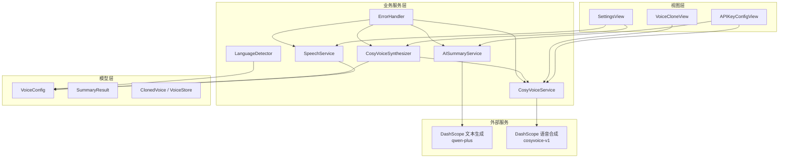
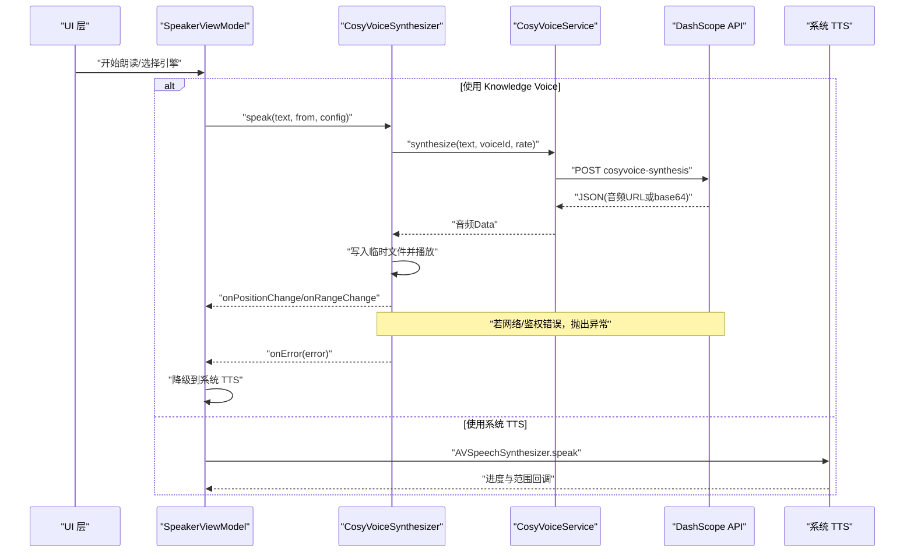
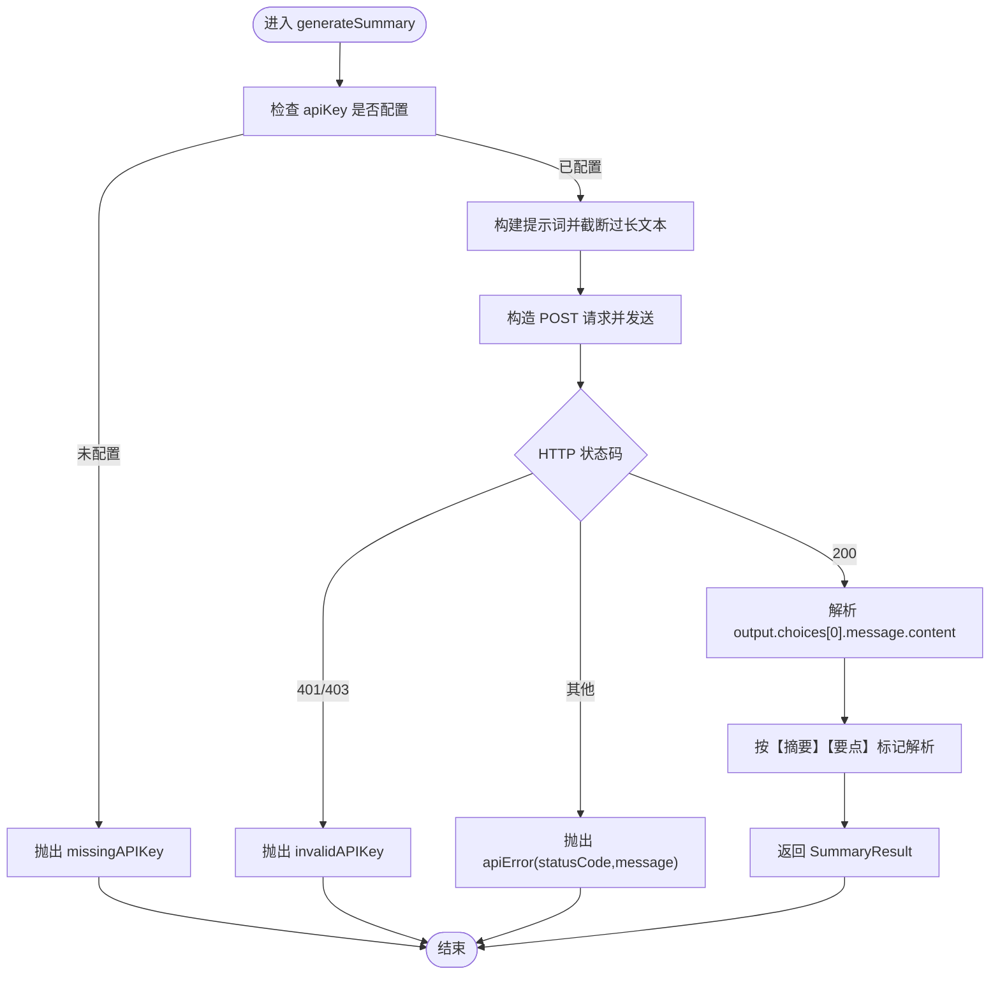
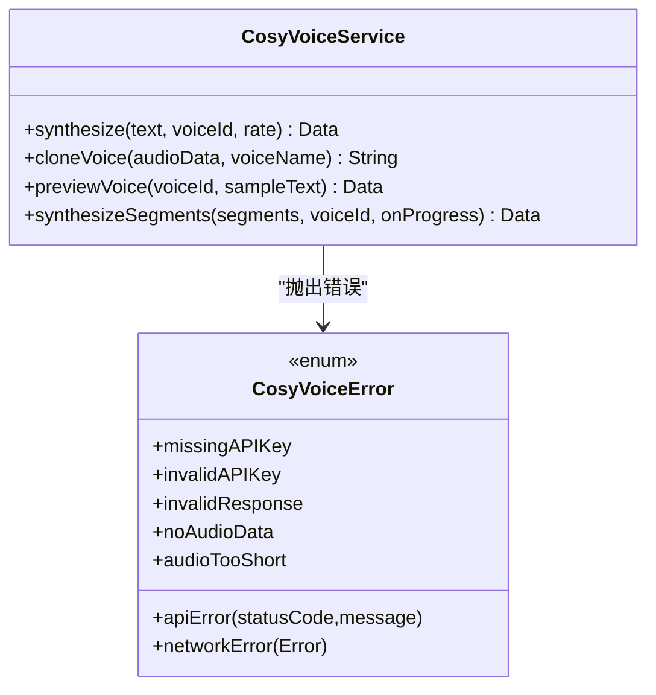
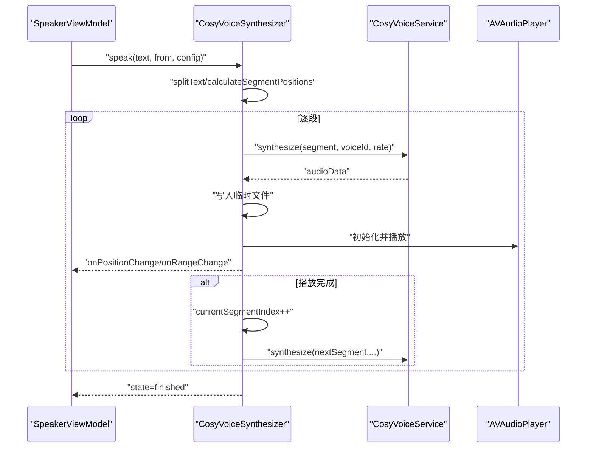
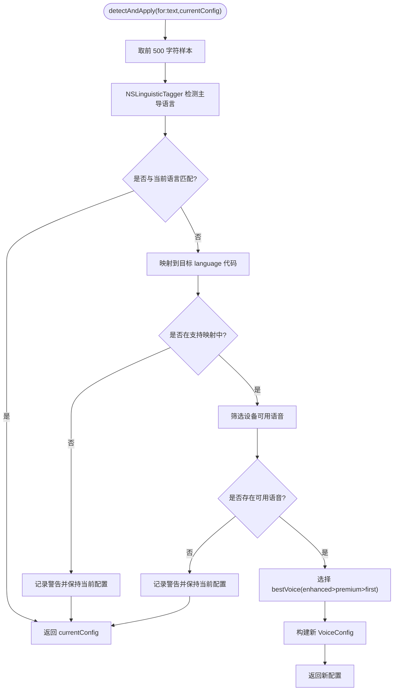
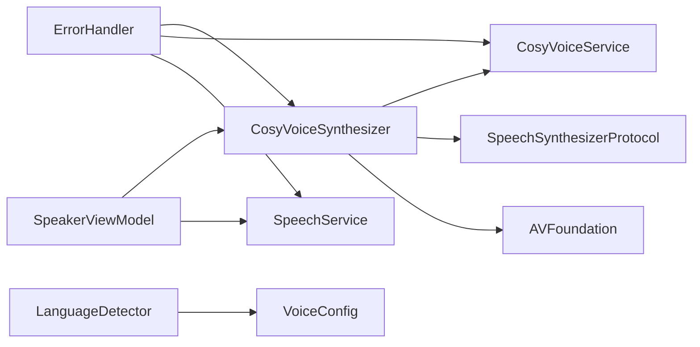

# 外部服务集成

<cite>
**本文引用的文件**   
- [AISummaryService.swift](file://Services/AISummaryService.swift)
- [CosyVoiceService.swift](file://Services/CosyVoiceService.swift)
- [CosyVoiceSynthesizer.swift](file://Services/CosyVoiceSynthesizer.swift)
- [LanguageDetector.swift](file://Services/LanguageDetector.swift)
- [ErrorHandler.swift](file://Services/ErrorHandler.swift)
- [SpeechService.swift](file://Services/SpeechService.swift)
- [SpeechSynthesizerProtocol.swift](file://Services/SpeechSynthesizerProtocol.swift)
- [VoiceConfig.swift](file://Models/VoiceConfig.swift)
- [SummaryResult.swift](file://Models/SummaryResult.swift)
- [ClonedVoice.swift](file://Models/ClonedVoice.swift)
- [APIKeyConfigView.swift](file://Views/APIKeyConfigView.swift)
- [SettingsView.swift](file://Views/SettingsView.swift)
- [SpeakerViewModel.swift](file://ViewModels/SpeakerViewModel.swift)
</cite>

## 目录
1. [简介](#简介)
2. [项目结构](#项目结构)
3. [核心组件](#核心组件)
4. [架构总览](#架构总览)
5. [详细组件分析](#详细组件分析)
6. [依赖关系分析](#依赖关系分析)
7. [性能与稳定性](#性能与稳定性)
8. [故障排除指南](#故障排除指南)
9. [结论](#结论)
10. [附录](#附录)

## 简介
本文件面向 Knowledge 应用的外部服务集成，重点覆盖阿里云 DashScope API 的 AI 摘要服务与 CosyVoice 语音合成（含语音克隆）实现。文档将说明：
- 网络请求的错误处理、重试策略与超时管理
- 语言检测服务的实现原理
- API 密钥的安全管理与配置入口
- 第三方服务集成的最佳实践与排障建议

## 项目结构
围绕外部服务集成，关键代码分布在 Services、Models、Views 与 ViewModels 中：
- Services：AI 摘要、CosyVoice 服务、语音合成引擎适配、语言检测、错误处理
- Models：语音配置、摘要结果、音色模型与持久化
- Views：API Key 配置、设置页、语音克隆界面
- ViewModels：TTS 引擎切换与状态同步

图表来源
- [AISummaryService.swift:1-180](file://Services/AISummaryService.swift#L1-L180)
- [CosyVoiceService.swift:1-219](file://Services/CosyVoiceService.swift#L1-L219)
- [CosyVoiceSynthesizer.swift:1-258](file://Services/CosyVoiceSynthesizer.swift#L1-L258)
- [LanguageDetector.swift:1-83](file://Services/LanguageDetector.swift#L1-L83)
- [ErrorHandler.swift:1-53](file://Services/ErrorHandler.swift#L1-L53)
- [SpeechService.swift:1-155](file://Services/SpeechService.swift#L1-L155)
- [VoiceConfig.swift:1-52](file://Models/VoiceConfig.swift#L1-L52)
- [SummaryResult.swift:1-33](file://Models/SummaryResult.swift#L1-L33)
- [ClonedVoice.swift:1-118](file://Models/ClonedVoice.swift#L1-L118)
- [APIKeyConfigView.swift:1-71](file://Views/APIKeyConfigView.swift#L1-L71)
- [SettingsView.swift:1-194](file://Views/SettingsView.swift#L1-L194)

章节来源
- [AISummaryService.swift:1-180](file://Services/AISummaryService.swift#L1-L180)
- [CosyVoiceService.swift:1-219](file://Services/CosyVoiceService.swift#L1-L219)
- [CosyVoiceSynthesizer.swift:1-258](file://Services/CosyVoiceSynthesizer.swift#L1-L258)
- [LanguageDetector.swift:1-83](file://Services/LanguageDetector.swift#L1-L83)
- [ErrorHandler.swift:1-53](file://Services/ErrorHandler.swift#L1-L53)
- [SpeechService.swift:1-155](file://Services/SpeechService.swift#L1-L155)
- [VoiceConfig.swift:1-52](file://Models/VoiceConfig.swift#L1-L52)
- [SummaryResult.swift:1-33](file://Models/SummaryResult.swift#L1-L33)
- [ClonedVoice.swift:1-118](file://Models/ClonedVoice.swift#L1-L118)
- [APIKeyConfigView.swift:1-71](file://Views/APIKeyConfigView.swift#L1-L71)
- [SettingsView.swift:1-194](file://Views/SettingsView.swift#L1-L194)

## 核心组件
- AI 摘要服务（DashScope 文本生成）
  - 负责构建提示词、发起 HTTP 请求、解析响应并返回结构化摘要结果。
  - 使用 Bearer Token 鉴权，支持超时控制与错误分类。
- CosyVoice 语音合成服务
  - 提供文本转音频、语音克隆、分段合成等能力。
  - 支持直接返回 base64 或返回音频 URL 再下载两种模式。
- CosyVoice 合成器适配器
  - 将 HTTP 服务封装为 SpeechSynthesizerProtocol，实现分段朗读、位置跟踪、自动播放下一段。
  - 出错时回调上层进行降级处理。
- 系统 TTS 引擎
  - 基于 AVSpeechSynthesizer 的系统内置 TTS，作为默认与降级方案。
- 语言检测服务
  - 基于 NSLinguisticTagger 检测主导语言，映射到合适的 VoiceConfig 语言与可用语音。
- 全局错误处理
  - 统一日志与弹窗提示，便于跨模块一致的用户反馈。

章节来源
- [AISummaryService.swift:1-180](file://Services/AISummaryService.swift#L1-L180)
- [CosyVoiceService.swift:1-219](file://Services/CosyVoiceService.swift#L1-L219)
- [CosyVoiceSynthesizer.swift:1-258](file://Services/CosyVoiceSynthesizer.swift#L1-L258)
- [SpeechService.swift:1-155](file://Services/SpeechService.swift#L1-L155)
- [LanguageDetector.swift:1-83](file://Services/LanguageDetector.swift#L1-L83)
- [ErrorHandler.swift:1-53](file://Services/ErrorHandler.swift#L1-L53)

## 架构总览
下图展示了从 UI 到外部服务的调用链路与数据流，包括失败路径与降级策略。

图表来源
- [CosyVoiceSynthesizer.swift:28-192](file://Services/CosyVoiceSynthesizer.swift#L28-L192)
- [CosyVoiceService.swift:27-88](file://Services/CosyVoiceService.swift#L27-L88)
- [SpeechService.swift:30-132](file://Services/SpeechService.swift#L30-L132)
- [SpeakerViewModel.swift:226-260](file://ViewModels/SpeakerViewModel.swift#L226-L260)

## 详细组件分析

### AI 摘要服务（DashScope 文本生成）
- 功能要点
  - 构建提示词，限制输入长度，调用 qwen-plus 模型生成摘要与要点。
  - 解析 JSON 响应，提取 content 字段，按固定标记拆分“摘要”和“要点”。
- 安全与鉴权
  - 通过 Authorization: Bearer <apiKey> 头传递密钥；密钥从 UserDefaults 读取。
- 超时与错误
  - 请求超时设置为 60 秒；对 401/403 识别为无效密钥；其他非 200 状态码包装为 apiError。
- 数据结构
  - 返回 SummaryResult，包含 content 与 keyPoints。

图表来源
- [AISummaryService.swift:25-107](file://Services/AISummaryService.swift#L25-L107)
- [AISummaryService.swift:109-153](file://Services/AISummaryService.swift#L109-L153)
- [AISummaryService.swift:158-179](file://Services/AISummaryService.swift#L158-L179)
- [SummaryResult.swift:1-33](file://Models/SummaryResult.swift#L1-L33)

章节来源
- [AISummaryService.swift:1-180](file://Services/AISummaryService.swift#L1-L180)
- [SummaryResult.swift:1-33](file://Models/SummaryResult.swift#L1-L33)

### CosyVoice 语音合成服务
- 功能要点
  - 文本转音频：支持预设/克隆 voiceId，返回 MP3 数据（base64 或先获取 URL 再下载）。
  - 语音克隆：上传参考音频（WAV/MP3），返回 voice_id。
  - 分段合成：对长文本分片并发请求，拼接音频，并提供进度回调。
- 安全与鉴权
  - 同样使用 Bearer Token；401/403 视为无效密钥。
- 超时与错误
  - 合成接口 30 秒，克隆接口 60 秒；非 200 状态码包装为 apiError。
- 数据结构
  - 输出 JSON 中的 output.audio_url 或 output.audio 字段用于获取音频。

图表来源
- [CosyVoiceService.swift:27-144](file://Services/CosyVoiceService.swift#L27-L144)
- [CosyVoiceService.swift:167-186](file://Services/CosyVoiceService.swift#L167-L186)
- [CosyVoiceService.swift:191-218](file://Services/CosyVoiceService.swift#L191-L218)

章节来源
- [CosyVoiceService.swift:1-219](file://Services/CosyVoiceService.swift#L1-L219)

### CosyVoice 合成器适配器（SpeechSynthesizerProtocol）
- 职责
  - 将 CosyVoiceService 的能力适配为统一的语音合成协议，屏蔽底层差异。
  - 负责文本分段、段落播放顺序、位置估算与范围高亮更新。
  - 在发生错误时回调 onError，供上层执行降级策略。
- 关键流程
  - speak 时根据 position 定位起始段落，逐段合成并播放，完成后自动推进至下一段。
  - 每段合成后写入临时文件并通过 AVAudioPlayer 播放，定时更新位置。

图表来源
- [CosyVoiceSynthesizer.swift:28-192](file://Services/CosyVoiceSynthesizer.swift#L28-L192)
- [CosyVoiceSynthesizer.swift:240-257](file://Services/CosyVoiceSynthesizer.swift#L240-L257)
- [SpeechSynthesizerProtocol.swift:1-20](file://Services/SpeechSynthesizerProtocol.swift#L1-L20)

章节来源
- [CosyVoiceSynthesizer.swift:1-258](file://Services/CosyVoiceSynthesizer.swift#L1-L258)
- [SpeechSynthesizerProtocol.swift:1-20](file://Services/SpeechSynthesizerProtocol.swift#L1-L20)

### 系统 TTS 引擎（SpeechService）
- 职责
  - 基于 AVSpeechSynthesizer 实现系统级朗读，支持语速、音高、音量与多语言语音选择。
  - 提供 skipForward/skipBackward 跳转与分段朗读逻辑。
- 与外部服务的关系
  - 作为默认与降级方案，当 Knowledge Voice 不可用时自动回退。

章节来源
- [SpeechService.swift:1-155](file://Services/SpeechService.swift#L1-L155)

### 语言检测服务（LanguageDetector）
- 实现原理
  - 使用 NSLinguisticTagger 检测主导语言，映射到支持的 VoiceConfig.language。
  - 在设备可用语音中选择质量最优的 voiceIdentifier（优先 enhanced，其次 premium，最后默认）。
- 行为
  - 若检测到语言不在支持列表或设备无对应语音，保持当前配置不变。

图表来源
- [LanguageDetector.swift:32-76](file://Services/LanguageDetector.swift#L32-L76)
- [LanguageDetector.swift:78-81](file://Services/LanguageDetector.swift#L78-L81)

章节来源
- [LanguageDetector.swift:1-83](file://Services/LanguageDetector.swift#L1-L83)

### API 密钥安全管理与配置
- 存储位置
  - API Key 以明文形式存储在 UserDefaults 的指定键中，由各服务在初始化时读取。
- 配置入口
  - 提供专用页面用于输入与保存 API Key，并在保存后关闭页面。
- 鉴权方式
  - 所有外部请求均通过 Authorization: Bearer <apiKey> 头传递。
- 安全建议
  - 生产环境建议使用钥匙串（Keychain）替代 UserDefaults 存储敏感信息。
  - 增加密钥有效性校验与过期刷新机制。
  - 避免在日志中打印完整密钥。

章节来源
- [APIKeyConfigView.swift:1-71](file://Views/APIKeyConfigView.swift#L1-L71)
- [AISummaryService.swift:12-16](file://Services/AISummaryService.swift#L12-L16)
- [CosyVoiceService.swift:14-17](file://Services/CosyVoiceService.swift#L14-L17)

### 错误处理与用户提示
- 统一错误处理
  - ErrorHandler 提供 handle/log 方法，集中记录错误并弹出提示。
- 服务层错误类型
  - AIServiceError 与 CosyVoiceError 定义明确的错误场景（缺失/无效密钥、网络错误、响应异常等）。
- 用户可见性
  - 错误信息通过 @Published AlertInfo 推送给 UI 展示。

章节来源
- [ErrorHandler.swift:1-53](file://Services/ErrorHandler.swift#L1-L53)
- [AISummaryService.swift:158-179](file://Services/AISummaryService.swift#L158-L179)
- [CosyVoiceService.swift:191-218](file://Services/CosyVoiceService.swift#L191-L218)

## 依赖关系分析
- 组件耦合
  - CosyVoiceSynthesizer 依赖 CosyVoiceService 与 AVFoundation；同时遵循 SpeechSynthesizerProtocol，便于替换实现。
  - SpeakerViewModel 监听合成器状态与错误，实现引擎切换与降级。
- 外部依赖
  - 仅依赖 Apple 框架（Foundation、AVFoundation）与阿里云 DashScope HTTP API。
- 潜在循环依赖
  - 当前未见循环引用；服务层单向依赖模型与工具类。

图表来源
- [CosyVoiceSynthesizer.swift:1-258](file://Services/CosyVoiceSynthesizer.swift#L1-L258)
- [CosyVoiceService.swift:1-219](file://Services/CosyVoiceService.swift#L1-L219)
- [SpeechService.swift:1-155](file://Services/SpeechService.swift#L1-L155)
- [LanguageDetector.swift:1-83](file://Services/LanguageDetector.swift#L1-L83)
- [ErrorHandler.swift:1-53](file://Services/ErrorHandler.swift#L1-L53)
- [SpeakerViewModel.swift:226-260](file://ViewModels/SpeakerViewModel.swift#L226-L260)

章节来源
- [CosyVoiceSynthesizer.swift:1-258](file://Services/CosyVoiceSynthesizer.swift#L1-L258)
- [CosyVoiceService.swift:1-219](file://Services/CosyVoiceService.swift#L1-L219)
- [SpeechService.swift:1-155](file://Services/SpeechService.swift#L1-L155)
- [LanguageDetector.swift:1-83](file://Services/LanguageDetector.swift#L1-L83)
- [ErrorHandler.swift:1-53](file://Services/ErrorHandler.swift#L1-L53)
- [SpeakerViewModel.swift:226-260](file://ViewModels/SpeakerViewModel.swift#L226-L260)

## 性能与稳定性
- 超时管理
  - 摘要接口 60 秒，语音合成 30 秒，语音克隆 60 秒。可根据实际网络状况调整。
- 重试策略
  - 当前未实现自动重试。建议在网络层或服务层引入指数退避重试，针对可恢复错误（如 429、5xx）进行有限次重试。
- 速率限制
  - 分段合成在段间加入 200ms 延迟，降低瞬时请求压力。可结合服务端限频策略动态调整。
- 内存与 IO
  - 合成音频写入临时文件后再播放，避免大对象驻留内存。注意及时清理临时文件。
- 降级与容错
  - Knowledge Voice 出错时自动降级到系统 TTS，保证基本可用性。

章节来源
- [AISummaryService.swift:60-107](file://Services/AISummaryService.swift#L60-L107)
- [CosyVoiceService.swift:27-88](file://Services/CosyVoiceService.swift#L27-L88)
- [CosyVoiceService.swift:167-186](file://Services/CosyVoiceService.swift#L167-L186)
- [CosyVoiceSynthesizer.swift:148-192](file://Services/CosyVoiceSynthesizer.swift#L148-L192)
- [SpeakerViewModel.swift:234-247](file://ViewModels/SpeakerViewModel.swift#L234-L247)

## 故障排除指南
- 无法生成摘要
  - 检查 API Key 是否正确配置；确认网络可达；查看错误描述是否为 invalidAPIKey 或 apiError。
- 语音合成失败
  - 确认 voiceId 有效；检查音频格式与时长（克隆需 10-30 秒）；关注 noAudioData 或 apiError。
- 语言检测未生效
  - 确认设备支持该语言语音；查看日志中是否有“不在支持列表”或“没有对应语音”的警告。
- 播放位置不同步
  - 检查 onPositionChange/onRangeChange 回调是否正常触发；确认估算逻辑与文本分段是否合理。
- 降级到系统 TTS
  - 观察 ViewModel 的 onError 回调是否触发；确认引擎切换与配置保存逻辑。

章节来源
- [ErrorHandler.swift:21-47](file://Services/ErrorHandler.swift#L21-L47)
- [AISummaryService.swift:158-179](file://Services/AISummaryService.swift#L158-L179)
- [CosyVoiceService.swift:191-218](file://Services/CosyVoiceService.swift#L191-L218)
- [LanguageDetector.swift:39-67](file://Services/LanguageDetector.swift#L39-L67)
- [SpeakerViewModel.swift:234-247](file://ViewModels/SpeakerViewModel.swift#L234-L247)

## 结论
Knowledge 应用的外部服务集成采用清晰的分层设计：服务层封装 DashScope API，适配器层统一语音合成协议，模型层承载配置与结果，视图层提供配置与交互入口。当前实现具备基本的鉴权、超时与错误分类能力，并实现了 Knowledge Voice 到系统 TTS 的降级策略。后续可在重试、限频、密钥安全等方面进一步增强，以提升鲁棒性与用户体验。

## 附录
- 相关模型与配置
  - VoiceConfig：语速、音高、音量、语言、语音标识、引擎选择、克隆/预设音色 ID。
  - SummaryResult：摘要正文与关键要点。
  - ClonedVoice/PresetVoice：音色模型与持久化管理。

章节来源
- [VoiceConfig.swift:1-52](file://Models/VoiceConfig.swift#L1-L52)
- [SummaryResult.swift:1-33](file://Models/SummaryResult.swift#L1-L33)
- [ClonedVoice.swift:1-118](file://Models/ClonedVoice.swift#L1-L118)