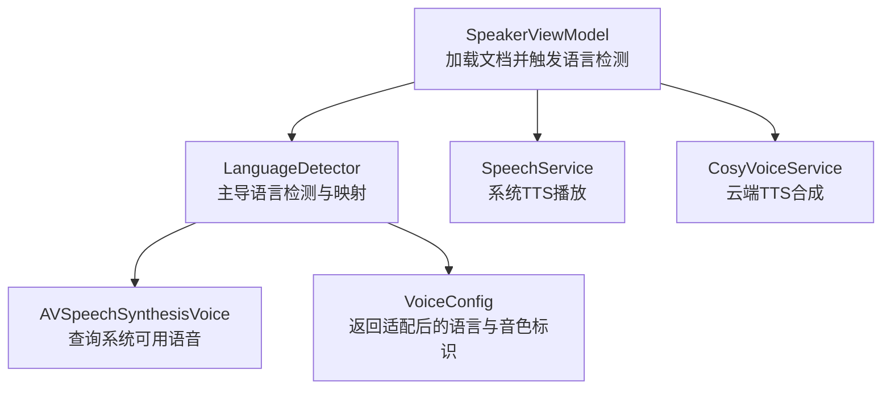
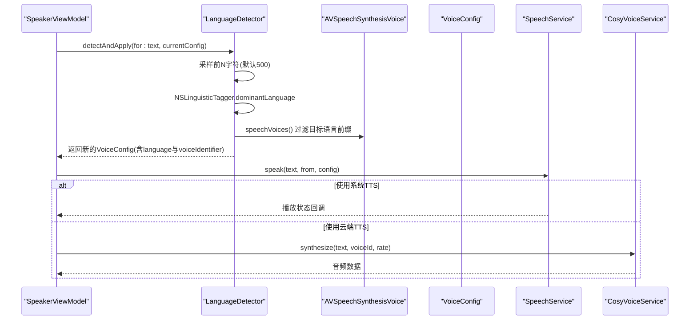
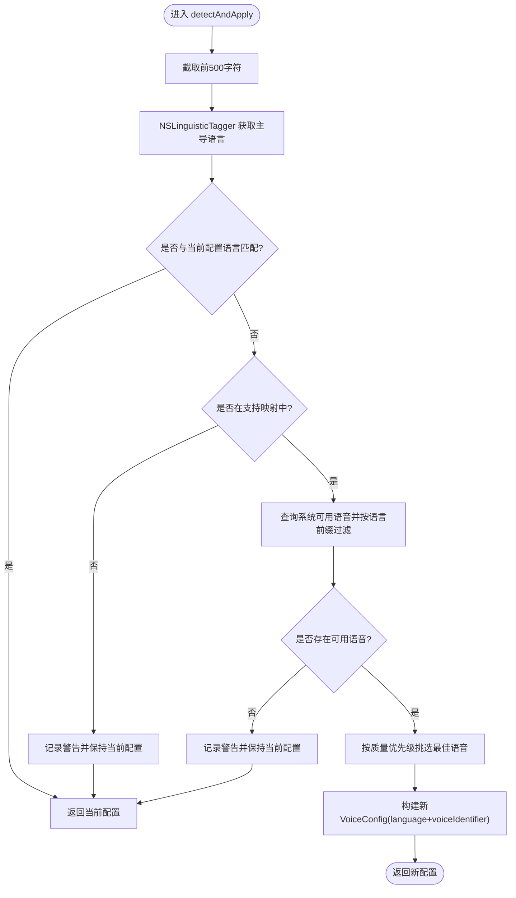
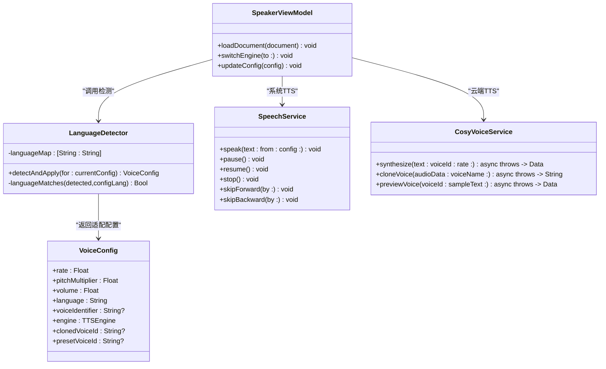
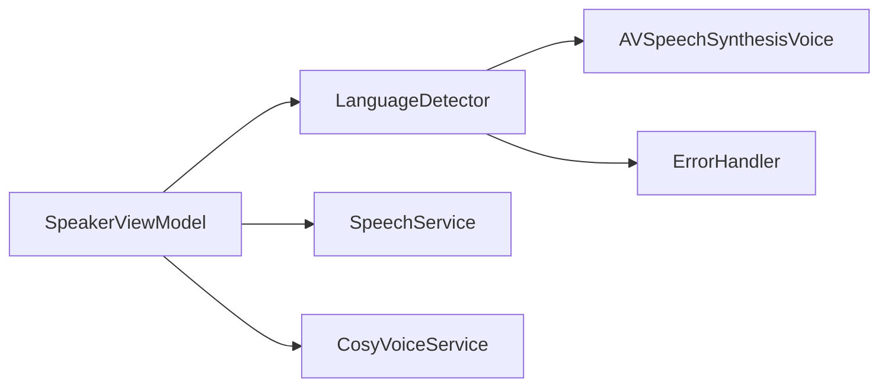

# 语言检测服务

<cite>
**本文引用的文件**
- [LanguageDetector.swift](file://Services/LanguageDetector.swift)
- [VoiceConfig.swift](file://Models/VoiceConfig.swift)
- [SpeechService.swift](file://Services/SpeechService.swift)
- [CosyVoiceService.swift](file://Services/CosyVoiceService.swift)
- [SpeakerViewModel.swift](file://ViewModels/SpeakerViewModel.swift)
- [ErrorHandler.swift](file://Services/ErrorHandler.swift)
</cite>

## 目录
1. [简介](#简介)
2. [项目结构](#项目结构)
3. [核心组件](#核心组件)
4. [架构总览](#架构总览)
5. [详细组件分析](#详细组件分析)
6. [依赖关系分析](#依赖关系分析)
7. [性能与准确率优化](#性能与准确率优化)
8. [使用示例](#使用示例)
9. [故障排查指南](#故障排查指南)
10. [结论](#结论)
11. [附录：扩展新语言支持](#附录扩展新语言支持)

## 简介
本文件面向“语言检测服务”的完整说明，聚焦 LanguageDetector 的实现原理、算法选择、多语言文本检测机制与准确率优化策略；解释支持的语种范围与检测阈值配置（当前实现中的行为）；阐述与语音合成服务的集成方式及自动语言适配逻辑；并提供使用示例、性能调优建议、常见问题解决方案以及扩展新语言支持的方法。

## 项目结构
语言检测能力位于 Services 层，作为独立工具枚举对外暴露，被 ViewModel 在加载文档时调用，以自动匹配系统 TTS 语音或云端 TTS 引擎所需的语言参数。

图表来源
- [SpeakerViewModel.swift:81-96](file://ViewModels/SpeakerViewModel.swift#L81-L96)
- [LanguageDetector.swift:30-76](file://Services/LanguageDetector.swift#L30-L76)
- [SpeechService.swift:30-72](file://Services/SpeechService.swift#L30-L72)
- [CosyVoiceService.swift:27-88](file://Services/CosyVoiceService.swift#L27-L88)

章节来源
- [SpeakerViewModel.swift:81-96](file://ViewModels/SpeakerViewModel.swift#L81-L96)
- [LanguageDetector.swift:1-82](file://Services/LanguageDetector.swift#L1-L82)

## 核心组件
- LanguageDetector：基于 NSLinguisticTagger 的主导语言检测，结合 AVSpeechSynthesisVoice 的系统语音可用性，将检测结果映射到 VoiceConfig.language 与 voiceIdentifier，完成自动语言适配。
- VoiceConfig：承载语速、音高、音量、语言代码、具体语音标识、TTS 引擎类型等配置项。
- SpeechService：系统 TTS 播放服务，根据 VoiceConfig 设置语音与参数进行分段朗读。
- CosyVoiceService：阿里云 DashScope CosyVoice 云端 TTS 服务，提供预设音色与语音克隆能力。
- SpeakerViewModel：统一编排入口，在加载文档时调用 LanguageDetector 自动适配语言，并在切换引擎或更新配置后重新应用。

章节来源
- [LanguageDetector.swift:1-82](file://Services/LanguageDetector.swift#L1-L82)
- [VoiceConfig.swift:24-51](file://Models/VoiceConfig.swift#L24-L51)
- [SpeechService.swift:30-72](file://Services/SpeechService.swift#L30-L72)
- [CosyVoiceService.swift:27-88](file://Services/CosyVoiceService.swift#L27-L88)
- [SpeakerViewModel.swift:81-96](file://ViewModels/SpeakerViewModel.swift#L81-L96)

## 架构总览
语言检测与语音合成的协作流程如下：

图表来源
- [SpeakerViewModel.swift:81-96](file://ViewModels/SpeakerViewModel.swift#L81-L96)
- [LanguageDetector.swift:30-76](file://Services/LanguageDetector.swift#L30-L76)
- [SpeechService.swift:30-72](file://Services/SpeechService.swift#L30-L72)
- [CosyVoiceService.swift:27-88](file://Services/CosyVoiceService.swift#L27-L88)

## 详细组件分析

### LanguageDetector 实现原理与算法选择
- 算法选择：采用系统级 NSLinguisticTagger 的语言标签方案，直接获取 dominantLanguage，避免引入第三方 NLP 库，降低包体积与启动开销。
- 文本采样：仅对文本前 500 个字符进行分析，兼顾首段代表性与时延控制。
- 语言映射：维护 languageMap，将 BCP-47 风格语言标签映射为 VoiceConfig.language 的目标区域化代码（如 zh-Hans → zh-CN）。
- 语音可用性校验：通过 AVSpeechSynthesisVoice.speechVoices() 筛选出与目标语言前缀匹配的可用语音，若无则回退保持当前配置。
- 最佳语音选择：优先 enhanced，其次 premium，最后取首个可用语音，确保音质与兼容性平衡。
- 日志记录：通过 ErrorHandler.log 输出关键决策路径，便于定位问题。

图表来源
- [LanguageDetector.swift:30-76](file://Services/LanguageDetector.swift#L30-L76)
- [ErrorHandler.swift:38-47](file://Services/ErrorHandler.swift#L38-L47)

章节来源
- [LanguageDetector.swift:1-82](file://Services/LanguageDetector.swift#L1-L82)
- [ErrorHandler.swift:38-47](file://Services/ErrorHandler.swift#L38-L47)

### 多语言文本的检测机制与准确率优化策略
- 主导语言判定：NSLinguisticTagger 基于系统语言模型给出 dominantLanguage，适用于常见拉丁、中日韩、阿拉伯等脚本。
- 样本长度权衡：500 字符可覆盖大多数文章开头段落，提升识别稳定性；若需更高精度，可在上层传入更长的上下文片段。
- 语言匹配容错：内部 languageMatches 对中文简繁体做特殊处理，避免误切换；同时允许双向前缀匹配，增强鲁棒性。
- 语音可用性兜底：当系统未安装对应语言包或无可用语音时，自动回退至当前配置，避免异常体验。
- 日志与可观测性：关键分支均记录日志，便于复现与优化。

章节来源
- [LanguageDetector.swift:30-76](file://Services/LanguageDetector.swift#L30-L76)
- [LanguageDetector.swift:78-81](file://Services/LanguageDetector.swift#L78-L81)

### 支持的语种范围与检测阈值配置
- 支持映射：当前 languageMap 包含简体中文、繁体中文、英语、日语、韩语、法语、德语、西班牙语、葡萄牙语、意大利语、俄语、阿拉伯语、泰语、越南语、印尼语、土耳其语、荷兰语、波兰语等。
- 检测阈值：当前实现未暴露显式阈值参数；主导语言由系统 tagger 决定。如需阈值控制，可在上层封装时增加置信度判断与重试策略。

章节来源
- [LanguageDetector.swift:9-28](file://Services/LanguageDetector.swift#L9-L28)

### 与其他服务（语音合成）的集成与自动语言适配
- 系统 TTS：SpeechService 依据 VoiceConfig 的 language 与 voiceIdentifier 设置 AVSpeechUtterance.voice，实现即时播放。
- 云端 TTS：CosyVoiceService 通过 API Key 与请求体参数（voice、format、sample_rate、speech_rate）合成音频，适合高品质音色与克隆场景。
- 自动适配：SpeakerViewModel 在 loadDocument 时调用 LanguageDetector.detectAndApply，得到新的 VoiceConfig 后用于后续播放。

图表来源
- [LanguageDetector.swift:1-82](file://Services/LanguageDetector.swift#L1-L82)
- [VoiceConfig.swift:24-51](file://Models/VoiceConfig.swift#L24-L51)
- [SpeechService.swift:30-72](file://Services/SpeechService.swift#L30-L72)
- [CosyVoiceService.swift:27-88](file://Services/CosyVoiceService.swift#L27-L88)
- [SpeakerViewModel.swift:81-96](file://ViewModels/SpeakerViewModel.swift#L81-L96)

章节来源
- [SpeechService.swift:30-72](file://Services/SpeechService.swift#L30-L72)
- [CosyVoiceService.swift:27-88](file://Services/CosyVoiceService.swift#L27-L88)
- [SpeakerViewModel.swift:81-96](file://ViewModels/SpeakerViewModel.swift#L81-L96)

## 依赖关系分析
- LanguageDetector 依赖：
  - Foundation：字符串操作、集合。
  - AVFoundation：AVSpeechSynthesisVoice 查询系统语音。
  - ErrorHandler：日志输出。
- 外部耦合点：
  - 系统语言包：AVSpeechSynthesisVoice 的可用性取决于设备已下载的语言资源。
  - 云端 TTS：CosyVoiceService 依赖网络与 API Key 有效性。

图表来源
- [LanguageDetector.swift:1-82](file://Services/LanguageDetector.swift#L1-L82)
- [SpeakerViewModel.swift:81-96](file://ViewModels/SpeakerViewModel.swift#L81-L96)
- [SpeechService.swift:30-72](file://Services/SpeechService.swift#L30-L72)
- [CosyVoiceService.swift:27-88](file://Services/CosyVoiceService.swift#L27-L88)

章节来源
- [LanguageDetector.swift:1-82](file://Services/LanguageDetector.swift#L1-L82)
- [SpeakerViewModel.swift:81-96](file://ViewModels/SpeakerViewModel.swift#L81-L96)

## 性能与准确率优化
- 文本采样长度：当前固定 500 字符。对于长文或混合语言文本，可在上层提供更长的代表性片段以提升准确率，但会轻微增加 CPU 与 I/O 开销。
- 语言映射缓存：languageMap 为静态常量，命中 O(1)，无需额外缓存。
- 语音查询频率：仅在需要切换语言时查询系统语音，避免频繁扫描。
- 降级策略：当系统无对应语音或不在映射表内，保持当前配置，减少不必要的切换与重建成本。
- 云端 TTS 限流：CosyVoiceService 的分段合成方法内置 200ms 延迟，避免请求过快导致服务端拒绝。

[本节为通用性能建议，不直接分析具体文件]

## 使用示例
- 在加载文档时自动适配语言：
  - 调用位置：SpeakerViewModel.loadDocument 中，当 document.extractedText 非空时，调用 LanguageDetector.detectAndApply 并将结果应用到 voiceConfig。
  - 效果：若检测到语言与当前配置不同且系统有对应语音，则自动切换语言与语音标识；否则保持原配置。
- 手动更新配置后生效：
  - 调用位置：SpeakerViewModel.updateConfig 会在运行时停止当前播放并以新配置继续，确保语言变更立即生效。

章节来源
- [SpeakerViewModel.swift:81-96](file://ViewModels/SpeakerViewModel.swift#L81-L96)
- [SpeakerViewModel.swift:160-170](file://ViewModels/SpeakerViewModel.swift#L160-L170)

## 故障排查指南
- 检测到的语言不在支持列表：
  - 现象：日志提示“语言 xxx 不在支持列表中，保持当前配置”。
  - 原因：detectedLang 未在 languageMap 中定义。
  - 解决：在 languageMap 中添加映射条目，或在业务层提供自定义映射策略。
- 系统没有目标语言的语音：
  - 现象：日志提示“系统没有 xxx 的语音，保持当前配置”。
  - 原因：设备未下载对应语言包或该语言无可用语音。
  - 解决：引导用户下载系统语言包，或切换到云端 TTS（CosyVoiceService）以获得更广的语言覆盖。
- 中文简繁体误判：
  - 现象：zh-Hans/zh-Hant 与 zh-CN/zh-HK 之间切换不稳定。
  - 原因：语言匹配逻辑对中文做了特殊处理，但仍可能因文本内容偏向而误判。
  - 解决：在上层提供更明确的语言偏好或强制指定语言，避免频繁切换。
- 云端 TTS 错误：
  - 现象：API Key 无效、响应异常、无音频数据等。
  - 解决：检查 API Key 配置、网络连通性与服务端返回格式；必要时降级到系统 TTS。

章节来源
- [LanguageDetector.swift:46-57](file://Services/LanguageDetector.swift#L46-L57)
- [ErrorHandler.swift:38-47](file://Services/ErrorHandler.swift#L38-L47)
- [CosyVoiceService.swift:191-218](file://Services/CosyVoiceService.swift#L191-L218)

## 结论
LanguageDetector 以轻量、稳定的系统能力为核心，结合 AVSpeechSynthesisVoice 的可用性校验，实现了跨语言文档的自动语言适配。其设计在准确率与性能之间取得良好平衡，并通过日志与降级策略保障用户体验。配合 SpeakerViewModel 的统一编排，可与系统 TTS 与云端 TTS 无缝集成，满足多语言阅读与听读需求。

[本节为总结性内容，不直接分析具体文件]

## 附录：扩展新语言支持
- 新增语言映射：
  - 在 LanguageDetector.languageMap 中添加“源语言标签 → VoiceConfig.language”的映射条目。
  - 示例：添加 “hi” → “hi-IN”，以便印地语自动适配。
- 验证系统语音可用性：
  - 运行后观察日志是否出现“系统没有 xxx 的语音”的警告；若无，确认设备已下载对应语言包。
- 调整检测阈值与采样长度（可选）：
  - 若需更高准确率，可在上层封装时传入更长文本片段，或在 LanguageDetector 中增加置信度判断与重试逻辑。
- 云端 TTS 语言覆盖：
  - 若系统语言包缺失，可通过 CosyVoiceService 使用云端 TTS 获得更广泛的语言支持。

章节来源
- [LanguageDetector.swift:9-28](file://Services/LanguageDetector.swift#L9-L28)
- [LanguageDetector.swift:51-57](file://Services/LanguageDetector.swift#L51-L57)
- [CosyVoiceService.swift:27-88](file://Services/CosyVoiceService.swift#L27-L88)