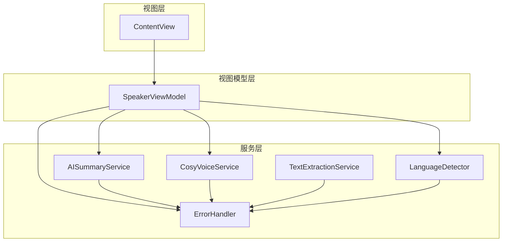
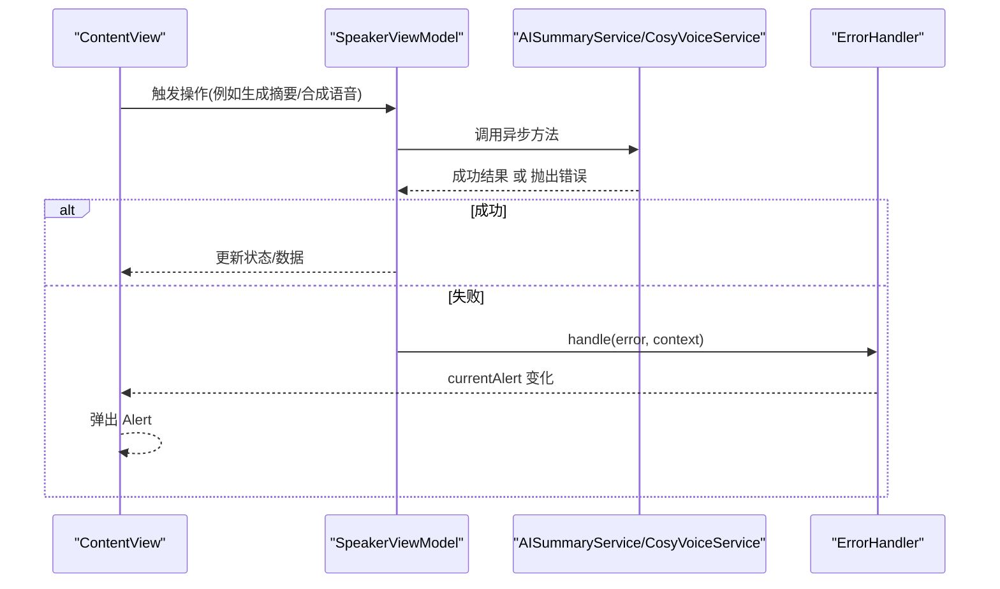
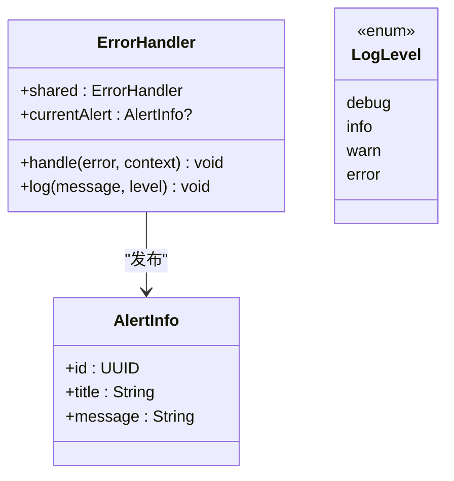
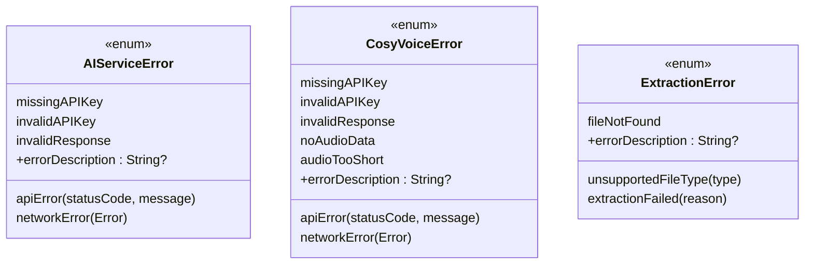
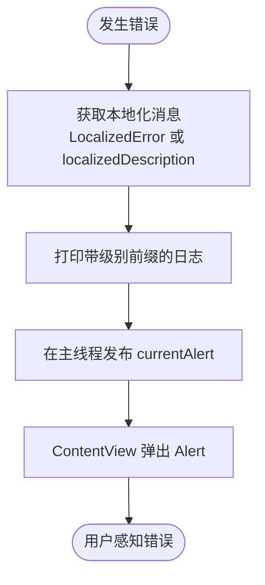
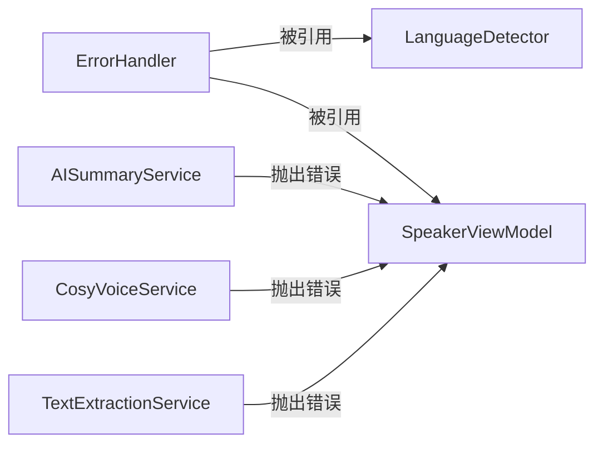

# 错误处理系统

<cite>
**本文引用的文件**   
- [Services/ErrorHandler.swift](file://Services/ErrorHandler.swift)
- [Services/AISummaryService.swift](file://Services/AISummaryService.swift)
- [Services/CosyVoiceService.swift](file://Services/CosyVoiceService.swift)
- [Services/LanguageDetector.swift](file://Services/LanguageDetector.swift)
- [Services/TextExtractionService.swift](file://Services/TextExtractionService.swift)
- [ViewModels/SpeakerViewModel.swift](file://ViewModels/SpeakerViewModel.swift)
- [Views/ContentView.swift](file://Views/ContentView.swift)
</cite>

## 目录
1. [简介](#简介)
2. [项目结构](#项目结构)
3. [核心组件](#核心组件)
4. [架构总览](#架构总览)
5. [详细组件分析](#详细组件分析)
6. [依赖关系分析](#依赖关系分析)
7. [性能与可靠性考虑](#性能与可靠性考虑)
8. [故障排除指南](#故障排除指南)
9. [结论](#结论)
10. [附录：最佳实践清单](#附录最佳实践清单)

## 简介
本文件围绕应用中的统一错误处理机制，系统化梳理 ErrorHandler 的设计模式、错误分类、捕获与处理策略，以及用户友好的提示生成与反馈流程。文档覆盖网络请求、API 响应、文件操作等常见场景的错误处理方案，并给出日志记录、监控与上报的实现建议与最佳实践。

## 项目结构
错误处理相关代码主要分布在 Services、ViewModels 和 Views 三层：
- Services 层定义领域错误类型（如 AIServiceError、CosyVoiceError、ExtractionError），并提供统一的日志与弹窗能力（ErrorHandler）。
- ViewModels 层负责业务编排与错误传播，必要时进行降级或重试。
- Views 层订阅全局错误状态，展示用户可理解的提示。

图表来源
- [Views/ContentView.swift:1-98](file://Views/ContentView.swift#L1-L98)
- [ViewModels/SpeakerViewModel.swift:1-314](file://ViewModels/SpeakerViewModel.swift#L1-L314)
- [Services/AISummaryService.swift:1-180](file://Services/AISummaryService.swift#L1-L180)
- [Services/CosyVoiceService.swift:1-219](file://Services/CosyVoiceService.swift#L1-L219)
- [Services/TextExtractionService.swift:1-200](file://Services/TextExtractionService.swift#L1-L200)
- [Services/LanguageDetector.swift:1-83](file://Services/LanguageDetector.swift#L1-L83)
- [Services/ErrorHandler.swift:1-53](file://Services/ErrorHandler.swift#L1-L53)

章节来源
- [Views/ContentView.swift:1-98](file://Views/ContentView.swift#L1-L98)
- [ViewModels/SpeakerViewModel.swift:1-314](file://ViewModels/SpeakerViewModel.swift#L1-L314)
- [Services/ErrorHandler.swift:1-53](file://Services/ErrorHandler.swift#L1-L53)

## 核心组件
- ErrorHandler：全局单例，提供统一错误日志与用户提示发布；支持按上下文前缀打印日志，并在主线程发布 AlertInfo 供 UI 展示。
- 领域错误枚举：AIServiceError、CosyVoiceError、ExtractionError 均遵循 LocalizedError，提供面向用户的中文描述。
- 调用方集成：
  - LanguageDetector 使用 ErrorHandler.log 输出运行期诊断信息。
  - AISummaryService 与 CosyVoiceService 抛出结构化错误，上层可据此做差异化处理。
  - TextExtractionService 对文件和网络提取失败返回具体错误原因。
  - SpeakerViewModel 在异步任务中捕获错误，更新 UI 状态或触发降级逻辑。
  - ContentView 订阅 ErrorHandler.currentAlert，统一弹出用户提示。

章节来源
- [Services/ErrorHandler.swift:1-53](file://Services/ErrorHandler.swift#L1-L53)
- [Services/AISummaryService.swift:157-180](file://Services/AISummaryService.swift#L157-L180)
- [Services/CosyVoiceService.swift:191-219](file://Services/CosyVoiceService.swift#L191-L219)
- [Services/TextExtractionService.swift:10-25](file://Services/TextExtractionService.swift#L10-L25)
- [Services/LanguageDetector.swift:32-83](file://Services/LanguageDetector.swift#L32-L83)
- [ViewModels/SpeakerViewModel.swift:175-203](file://ViewModels/SpeakerViewModel.swift#L175-L203)
- [Views/ContentView.swift:26-28](file://Views/ContentView.swift#L26-L28)

## 架构总览
错误处理采用“集中式错误入口 + 领域化错误类型 + 用户态提示”的分层设计：
- 领域服务抛出强类型的 LocalizedError，便于上层区分处理。
- ErrorHandler 作为统一入口，负责日志与用户提示的解耦。
- UI 通过 @Published 属性绑定，自动呈现错误提示。

图表来源
- [ViewModels/SpeakerViewModel.swift:175-203](file://ViewModels/SpeakerViewModel.swift#L175-L203)
- [Services/AISummaryService.swift:24-34](file://Services/AISummaryService.swift#L24-L34)
- [Services/CosyVoiceService.swift:27-88](file://Services/CosyVoiceService.swift#L27-L88)
- [Services/ErrorHandler.swift:20-35](file://Services/ErrorHandler.swift#L20-L35)
- [Views/ContentView.swift:26-28](file://Views/ContentView.swift#L26-L28)

## 详细组件分析

### ErrorHandler 设计与职责
- 职责
  - 统一错误日志：带级别前缀的 print 输出，便于调试与定位。
  - 统一用户提示：将错误转换为 AlertInfo，并通过 @Published 暴露给 SwiftUI。
  - 上下文增强：handle 支持 context 参数，便于在日志中附加模块名或操作名。
- 关键行为
  - 优先使用 LocalizedError.errorDescription，否则回退到 error.localizedDescription。
  - 在主线程发布 currentAlert，确保 UI 安全更新。
- 扩展点
  - 可扩展为接入外部日志/监控系统（如替换 print 为结构化日志库）。
  - 可扩展为根据错误类型决定提示样式（警告、致命、重试引导等）。

图表来源
- [Services/ErrorHandler.swift:6-48](file://Services/ErrorHandler.swift#L6-L48)
- [Services/ErrorHandler.swift:50-52](file://Services/ErrorHandler.swift#L50-L52)

章节来源
- [Services/ErrorHandler.swift:1-53](file://Services/ErrorHandler.swift#L1-L53)

### 领域错误类型与分类
- AIServiceError（AI 总结）
  - 缺失 API Key、无效 API Key、非 2xx 响应、响应结构异常、网络错误等。
- CosyVoiceError（语音合成/克隆）
  - 缺失/无效 API Key、响应异常、无音频数据、录音时长不足、网络错误等。
- ExtractionError（文本提取）
  - 不支持的文件类型、文件未找到、提取失败（含具体原因）。

这些错误均实现 LocalizedError，提供面向用户的中文描述，便于 ErrorHandler 直接展示。

图表来源
- [Services/AISummaryService.swift:157-180](file://Services/AISummaryService.swift#L157-L180)
- [Services/CosyVoiceService.swift:191-219](file://Services/CosyVoiceService.swift#L191-L219)
- [Services/TextExtractionService.swift:10-25](file://Services/TextExtractionService.swift#L10-L25)

章节来源
- [Services/AISummaryService.swift:157-180](file://Services/AISummaryService.swift#L157-L180)
- [Services/CosyVoiceService.swift:191-219](file://Services/CosyVoiceService.swift#L191-L219)
- [Services/TextExtractionService.swift:10-25](file://Services/TextExtractionService.swift#L10-L25)

### 用户友好提示与反馈机制
- 统一弹窗：ContentView 订阅 ErrorHandler.currentAlert，当有错误时弹出 Alert。
- 上下文日志：LanguageDetector 使用 ErrorHandler.log 输出语言检测、语音切换等信息，便于问题追踪。
- 业务内反馈：SpeakerViewModel 在生成摘要失败时设置 summaryError，用于局部 UI 显示错误详情与重试入口。

图表来源
- [Services/ErrorHandler.swift:20-35](file://Services/ErrorHandler.swift#L20-L35)
- [Views/ContentView.swift:26-28](file://Views/ContentView.swift#L26-L28)
- [Services/LanguageDetector.swift:38-68](file://Services/LanguageDetector.swift#L38-L68)
- [ViewModels/SpeakerViewModel.swift:196-201](file://ViewModels/SpeakerViewModel.swift#L196-L201)

章节来源
- [Views/ContentView.swift:26-28](file://Views/ContentView.swift#L26-L28)
- [Services/LanguageDetector.swift:38-68](file://Services/LanguageDetector.swift#L38-L68)
- [ViewModels/SpeakerViewModel.swift:196-201](file://ViewModels/SpeakerViewModel.swift#L196-L201)

### 典型场景处理方案

#### 网络错误与超时
- 现象：URLSession 抛出网络错误或服务端非 2xx 响应。
- 处理：
  - 服务层封装为 AIServiceError.networkError / CosyVoiceError.apiError。
  - 上层可选择重试（指数退避）、降级（切换到系统 TTS）或提示用户检查网络。
- 参考路径：
  - [Services/AISummaryService.swift:83-96](file://Services/AISummaryService.swift#L83-L96)
  - [Services/CosyVoiceService.swift:53-66](file://Services/CosyVoiceService.swift#L53-L66)

#### API 鉴权与权限错误
- 现象：HTTP 401/403。
- 处理：
  - 服务层抛出 invalidAPIKey。
  - 上层可引导用户重新配置 API Key，或清空缓存后重试。
- 参考路径：
  - [Services/AISummaryService.swift:89-91](file://Services/AISummaryService.swift#L89-L91)
  - [Services/CosyVoiceService.swift:59-61](file://Services/CosyVoiceService.swift#L59-L61)

#### 响应解析失败
- 现象：JSON 结构不符合预期或缺少必要字段。
- 处理：
  - 服务层抛出 invalidResponse。
  - 上层提示“服务器返回数据异常”，并允许重试。
- 参考路径：
  - [Services/AISummaryService.swift:98-104](file://Services/AISummaryService.swift#L98-L104)
  - [Services/CosyVoiceService.swift:69-72](file://Services/CosyVoiceService.swift#L69-L72)

#### 文件操作与文本提取错误
- 现象：不支持的文件类型、文件不存在、ZIP/EPUB 解析失败、Office 文档为空等。
- 处理：
  - 服务层抛出 ExtractionError.unsupportedFileType/fileNotFound/extractionFailed。
  - 上层提示具体失败原因，并引导用户更换文件或格式。
- 参考路径：
  - [Services/TextExtractionService.swift:27-53](file://Services/TextExtractionService.swift#L27-L53)
  - [Services/TextExtractionService.swift:712-732](file://Services/TextExtractionService.swift#L712-L732)

#### 语音合成与克隆错误
- 现象：缺少音频数据、录音过短、网络错误等。
- 处理：
  - 服务层抛出相应错误，上层提示用户调整输入或重试。
- 参考路径：
  - [Services/CosyVoiceService.swift:87-88](file://Services/CosyVoiceService.swift#L87-L88)
  - [Services/CosyVoiceService.swift:191-219](file://Services/CosyVoiceService.swift#L191-L219)

章节来源
- [Services/AISummaryService.swift:83-104](file://Services/AISummaryService.swift#L83-L104)
- [Services/CosyVoiceService.swift:53-88](file://Services/CosyVoiceService.swift#L53-L88)
- [Services/TextExtractionService.swift:27-53](file://Services/TextExtractionService.swift#L27-L53)
- [Services/TextExtractionService.swift:712-732](file://Services/TextExtractionService.swift#L712-L732)

### 错误日志、监控与上报
- 当前实现
  - ErrorHandler.log 使用 print 输出，带级别前缀，便于控制台查看。
  - ErrorHandler.handle 同时记录错误日志并弹出用户提示。
- 扩展建议
  - 日志：替换为结构化日志库（如 os_log），支持分级、过滤、持久化。
  - 监控：将错误事件上报至后端或第三方监控平台，附带上下文（context、设备信息、时间戳）。
  - 告警：对高频错误（如鉴权失败、网络不可用）触发告警。
  - 隐私：上报前脱敏敏感信息（如 URL、文件名、内容片段）。

章节来源
- [Services/ErrorHandler.swift:37-47](file://Services/ErrorHandler.swift#L37-L47)

## 依赖关系分析
- 耦合与内聚
  - ErrorHandler 低耦合，仅依赖 Foundation 与 Combine，被多处引用。
  - 领域服务各自维护错误类型，内聚性强，易于扩展与维护。
- 直接依赖
  - LanguageDetector 依赖 ErrorHandler.log。
  - AISummaryService、CosyVoiceService 抛出结构化错误，由上层统一处理。
  - TextExtractionService 抛出 ExtractionError，上层可据此提示用户。
- 潜在循环依赖
  - 当前未发现循环依赖；ErrorHandler 不反向依赖任何服务。

图表来源
- [Services/LanguageDetector.swift:38-68](file://Services/LanguageDetector.swift#L38-L68)
- [ViewModels/SpeakerViewModel.swift:175-203](file://ViewModels/SpeakerViewModel.swift#L175-L203)
- [Services/AISummaryService.swift:24-34](file://Services/AISummaryService.swift#L24-L34)
- [Services/CosyVoiceService.swift:27-88](file://Services/CosyVoiceService.swift#L27-L88)
- [Services/TextExtractionService.swift:27-53](file://Services/TextExtractionService.swift#L27-L53)

章节来源
- [Services/LanguageDetector.swift:38-68](file://Services/LanguageDetector.swift#L38-L68)
- [ViewModels/SpeakerViewModel.swift:175-203](file://ViewModels/SpeakerViewModel.swift#L175-L203)
- [Services/AISummaryService.swift:24-34](file://Services/AISummaryService.swift#L24-L34)
- [Services/CosyVoiceService.swift:27-88](file://Services/CosyVoiceService.swift#L27-L88)
- [Services/TextExtractionService.swift:27-53](file://Services/TextExtractionService.swift#L27-L53)

## 性能与可靠性考虑
- 避免频繁弹窗：ErrorHandler.currentAlert 每次赋值会触发一次 Alert，建议在业务层合并多次错误或使用防抖策略。
- 主线程安全：所有 UI 更新均在 MainActor 或主线程执行，避免竞态条件。
- 网络重试与退避：对临时性错误（网络抖动、服务端限流）实施指数退避与最大重试次数限制。
- 资源释放：长时间任务应支持取消与超时，避免内存泄漏与后台阻塞。
- 降级策略：如 SpeakerViewModel 在 Knowledge Voice 出错时自动降级到系统 TTS，提升可用性。

[本节为通用指导，无需列出具体文件来源]

## 故障排除指南
- 常见问题
  - 未配置 API Key：提示“请先在设置中配置阿里云 API Key”。
  - API Key 无效：提示“API Key 无效，请检查后重试”。
  - 网络错误：提示“网络错误：...”，需检查网络与代理。
  - 服务器异常：提示“服务器返回数据异常，请稍后重试”。
  - 文件无法读取：提示“文件未找到/不支持的文件类型/提取失败：...”。
- 排查步骤
  - 查看控制台日志：搜索 ❌、⚠️、ℹ️、🔍 前缀，定位错误上下文。
  - 确认配置：检查 UserDefaults 中的 API Key 是否有效。
  - 复现最小用例：隔离问题模块（如单独测试文本提取或语音合成）。
  - 增加上下文：在 handle 调用时传入更详细的 context，便于定位。
  - 启用更细粒度日志：将 log 级别提升至 debug，收集更多运行期信息。

章节来源
- [Services/AISummaryService.swift:165-178](file://Services/AISummaryService.swift#L165-L178)
- [Services/CosyVoiceService.swift:200-217](file://Services/CosyVoiceService.swift#L200-L217)
- [Services/TextExtractionService.swift:15-24](file://Services/TextExtractionService.swift#L15-L24)
- [Services/ErrorHandler.swift:37-47](file://Services/ErrorHandler.swift#L37-L47)

## 结论
该错误处理系统以 ErrorHandler 为核心，结合领域化的 LocalizedError 与 SwiftUI 的状态驱动 UI，实现了“统一入口、清晰分类、友好提示”的目标。通过分层设计与可扩展的日志/上报接口，既能满足当前需求，也为后续监控与运维提供了良好基础。

[本节为总结性内容，无需列出具体文件来源]

## 附录：最佳实践清单
- 始终使用 LocalizedError 提供用户可读的错误描述。
- 在服务层抛出结构化错误，在 ViewModel 层统一处理与降级。
- 使用 ErrorHandler.handle 集中记录错误与提示，避免分散的 print/alert。
- 为关键路径添加 context 参数，便于日志定位。
- 对网络与 I/O 操作实施超时、重试与退避策略。
- 在 UI 层避免重复弹窗，必要时合并或延迟提示。
- 逐步引入结构化日志与错误上报，完善监控与告警。

[本节为通用指导，无需列出具体文件来源]