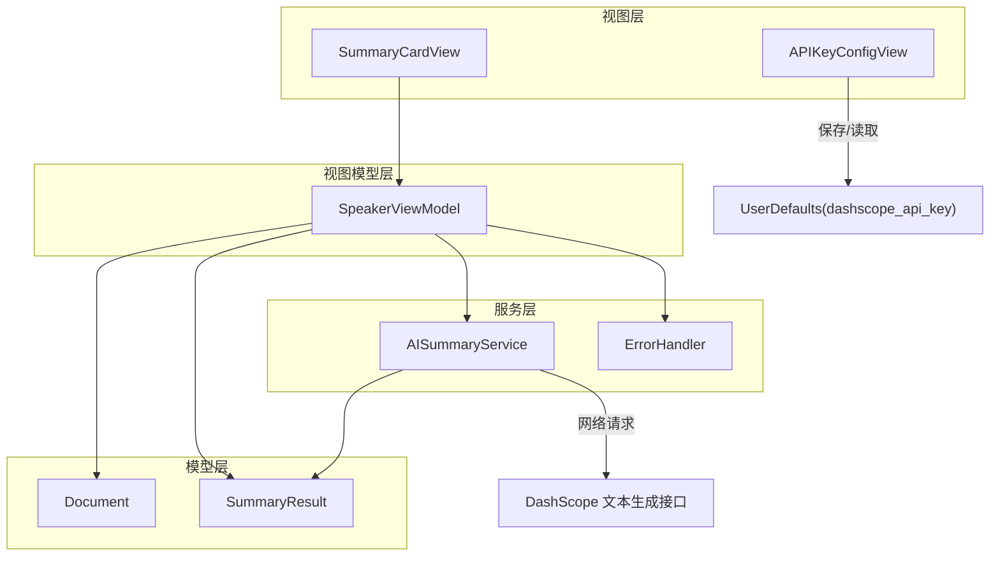
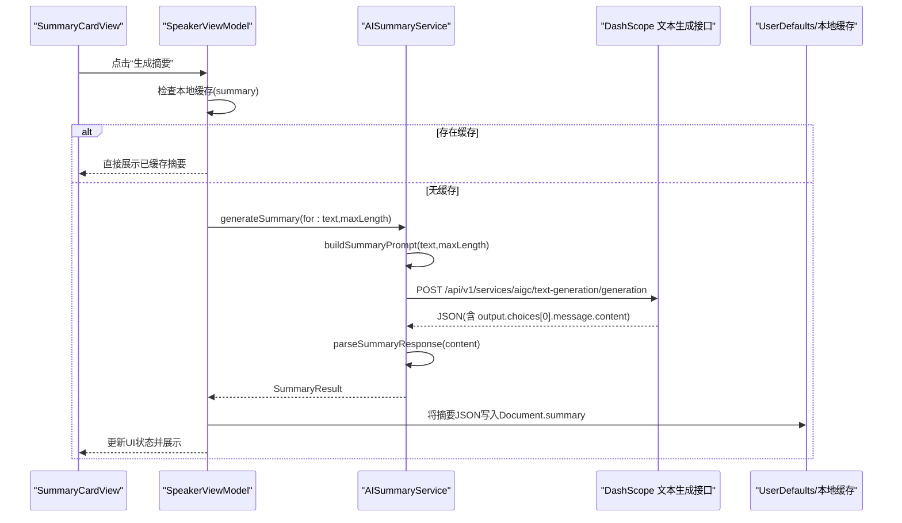
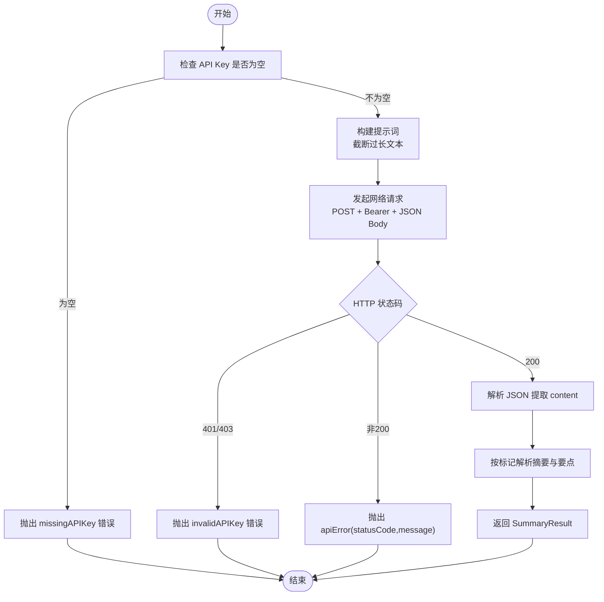
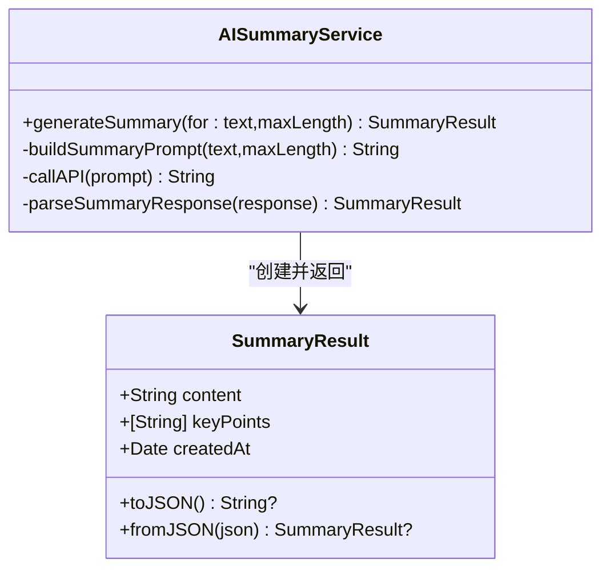
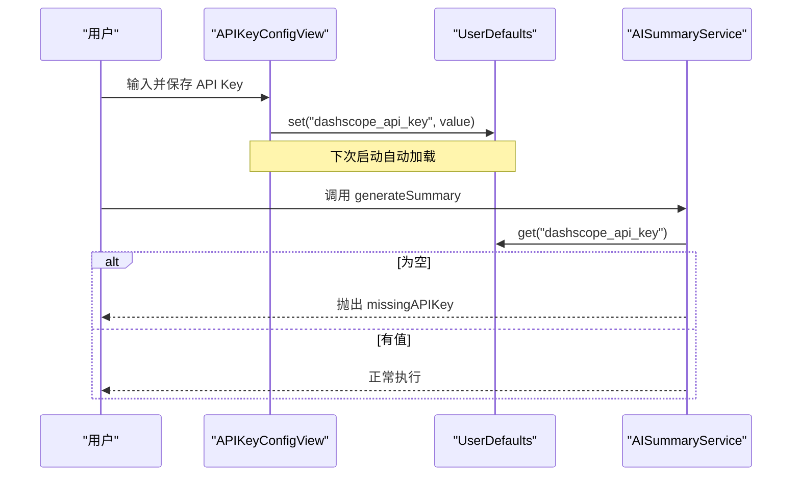
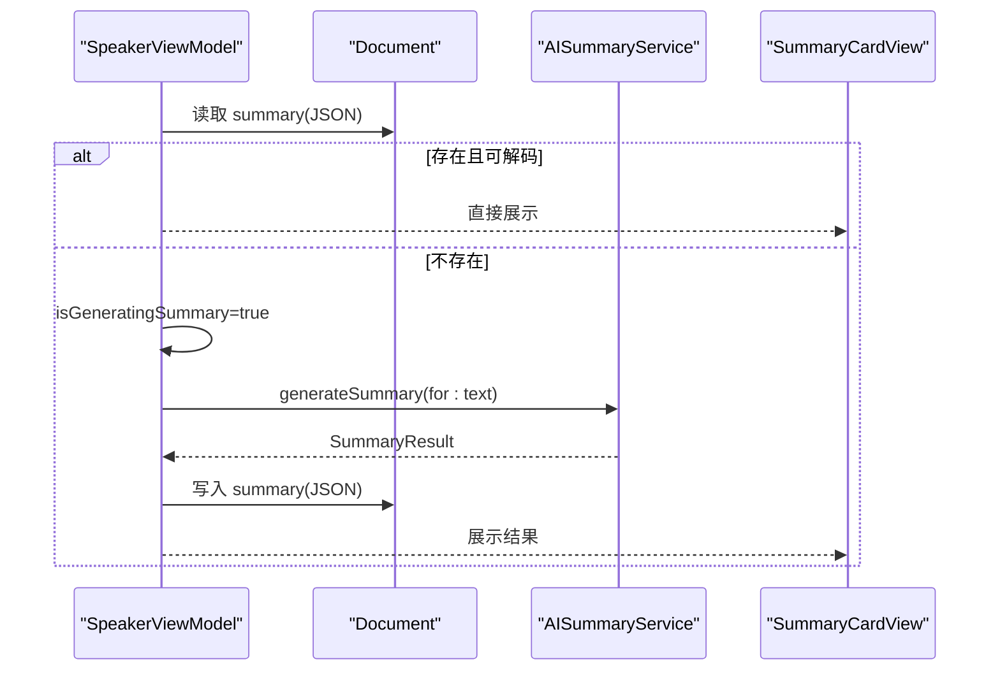
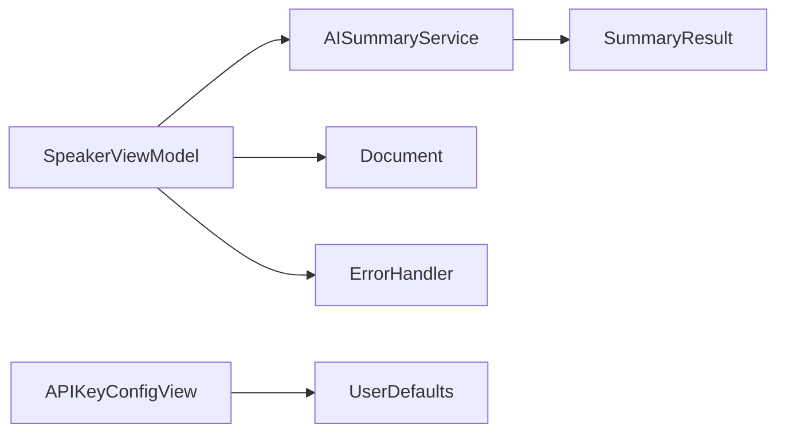

# 阿里云 DashScope API 集成

<cite>
**本文引用的文件**
- [AISummaryService.swift](file://Services/AISummaryService.swift)
- [SummaryResult.swift](file://Models/SummaryResult.swift)
- [APIKeyConfigView.swift](file://Views/APIKeyConfigView.swift)
- [ErrorHandler.swift](file://Services/ErrorHandler.swift)
- [SpeakerViewModel.swift](file://ViewModels/SpeakerViewModel.swift)
- [Document.swift](file://Models/Document.swift)
- [SummaryCardView.swift](file://Views/SummaryCardView.swift)
</cite>

## 目录
1. [简介](#简介)
2. [项目结构](#项目结构)
3. [核心组件](#核心组件)
4. [架构总览](#架构总览)
5. [详细组件分析](#详细组件分析)
6. [依赖关系分析](#依赖关系分析)
7. [性能与优化建议](#性能与优化建议)
8. [故障排查指南](#故障排查指南)
9. [结论](#结论)
10. [附录：使用示例与最佳实践](#附录使用示例与最佳实践)

## 简介
本文件面向开发者，系统化说明在 iOS 应用中集成阿里云 DashScope（通义千问）文本生成能力的实现方案。重点围绕 AISummaryService 的调用流程、请求参数配置、响应解析策略、API Key 安全管理、网络错误处理与超时设置，以及摘要提示词构建与结果解析算法进行深度解读，并提供完整的调用示例路径与最佳实践建议。

## 项目结构
本项目采用分层组织方式：
- Services：服务层封装外部能力（如 AI 摘要、语音合成、错误处理等）
- Models：数据模型（文档、摘要结果等）
- ViewModels：业务编排与状态管理
- Views：UI 展示与交互

图表来源
- [AISummaryService.swift:1-180](file://Services/AISummaryService.swift#L1-L180)
- [APIKeyConfigView.swift:1-71](file://Views/APIKeyConfigView.swift#L1-L71)
- [SpeakerViewModel.swift:172-211](file://ViewModels/SpeakerViewModel.swift#L172-L211)
- [Document.swift:54-115](file://Models/Document.swift#L54-L115)
- [SummaryResult.swift:1-33](file://Models/SummaryResult.swift#L1-L33)

章节来源
- [AISummaryService.swift:1-180](file://Services/AISummaryService.swift#L1-L180)
- [APIKeyConfigView.swift:1-71](file://Views/APIKeyConfigView.swift#L1-L71)
- [SpeakerViewModel.swift:1-314](file://ViewModels/SpeakerViewModel.swift#L1-L314)
- [Document.swift:1-115](file://Models/Document.swift#L1-L115)
- [SummaryResult.swift:1-33](file://Models/SummaryResult.swift#L1-L33)

## 核心组件
- AISummaryService：封装对 DashScope 文本生成接口的调用、提示词构建、响应解析与错误映射。
- SummaryResult：摘要结果的数据载体，支持 JSON 序列化用于缓存。
- SpeakerViewModel：业务编排器，负责触发摘要生成、异步任务调度、结果缓存与 UI 状态更新。
- APIKeyConfigView：提供用户输入并持久化存储 API Key。
- ErrorHandler：统一错误日志与弹窗提示。
- Document：文档实体，包含摘要缓存字段。

章节来源
- [AISummaryService.swift:1-180](file://Services/AISummaryService.swift#L1-L180)
- [SummaryResult.swift:1-33](file://Models/SummaryResult.swift#L1-L33)
- [SpeakerViewModel.swift:172-211](file://ViewModels/SpeakerViewModel.swift#L172-L211)
- [APIKeyConfigView.swift:1-71](file://Views/APIKeyConfigView.swift#L1-L71)
- [ErrorHandler.swift:1-53](file://Services/ErrorHandler.swift#L1-L53)
- [Document.swift:54-115](file://Models/Document.swift#L54-L115)

## 架构总览
整体调用链路从 UI 触发到服务层完成网络请求与解析，再回写 ViewModel 状态并持久化摘要。

图表来源
- [AISummaryService.swift:25-107](file://Services/AISummaryService.swift#L25-L107)
- [AISummaryService.swift:109-153](file://Services/AISummaryService.swift#L109-L153)
- [SpeakerViewModel.swift:175-203](file://ViewModels/SpeakerViewModel.swift#L175-L203)
- [Document.swift:65-66](file://Models/Document.swift#L65-L66)

## 详细组件分析

### AISummaryService 实现原理
- 单例模式：通过 shared 暴露全局实例，避免重复初始化 URLSession。
- API Key 获取：优先从 UserDefaults 中读取 key，若为空则抛出缺失错误。
- 提示词构建：对超长文本进行截断，构造结构化提示词，要求返回“摘要正文 + 关键要点”，并以固定标记分隔。
- 网络请求：
  - 基础 URL：DashScope 文本生成接口地址。
  - 请求头：Content-Type 为 application/json；Authorization 使用 Bearer Token。
  - 超时：请求超时设置为 60 秒。
  - 请求体：model 指定为 qwen-plus；parameters 包含 result_format、max_tokens、temperature。
- 响应解析：
  - 校验 HTTP 状态码：401/403 视为无效 Key；非 200 抛出自定义错误；200 继续解析 JSON。
  - JSON 路径：output -> choices -> message -> content。
  - 文本解析：按“【摘要】”和“【要点】”分割内容，支持多种要点列表格式（“- ”、“• ”、“· ”或“数字.”）。
- 错误映射：将网络与业务异常映射为 LocalizedError，便于上层统一处理。

图表来源
- [AISummaryService.swift:25-107](file://Services/AISummaryService.swift#L25-L107)
- [AISummaryService.swift:109-153](file://Services/AISummaryService.swift#L109-L153)
- [AISummaryService.swift:158-179](file://Services/AISummaryService.swift#L158-L179)

章节来源
- [AISummaryService.swift:1-180](file://Services/AISummaryService.swift#L1-L180)

### 请求参数配置与模型选择
- 模型：qwen-plus
- 参数：
  - result_format：message
  - max_tokens：1024
  - temperature：0.7
- 请求体结构：
  - model
  - input.messages（role=user, content=prompt）
  - parameters（result_format、max_tokens、temperature）

章节来源
- [AISummaryService.swift:67-79](file://Services/AISummaryService.swift#L67-L79)

### 响应解析逻辑与数据结构
- 输出路径：output.choices[0].message.content
- 文本解析规则：
  - 以“【摘要】”定位摘要正文，直到“【要点】”前。
  - 以“【要点】”定位要点列表，支持多种前缀与编号格式。
  - 若未解析到任何内容，则将整段回复作为摘要。
- 结果模型：
  - SummaryResult：content（摘要正文）、keyPoints（要点数组）、createdAt（时间戳），支持 toJSON/fromJSON 用于持久化。

图表来源
- [AISummaryService.swift:25-107](file://Services/AISummaryService.swift#L25-L107)
- [AISummaryService.swift:109-153](file://Services/AISummaryService.swift#L109-L153)
- [SummaryResult.swift:1-33](file://Models/SummaryResult.swift#L1-L33)

章节来源
- [AISummaryService.swift:109-153](file://Services/AISummaryService.swift#L109-L153)
- [SummaryResult.swift:1-33](file://Models/SummaryResult.swift#L1-L33)

### API Key 的安全管理与配置
- 存储位置：UserDefaults 键名为 dashscope_api_key。
- 配置界面：APIKeyConfigView 提供安全输入框与保存按钮，并在 onAppear 时加载已有值。
- 使用方式：AISummaryService 在初始化时读取该值，若为空则在生成摘要时抛出缺失错误。

图表来源
- [APIKeyConfigView.swift:55-65](file://Views/APIKeyConfigView.swift#L55-L65)
- [AISummaryService.swift:12-16](file://Services/AISummaryService.swift#L12-L16)
- [AISummaryService.swift:25-28](file://Services/AISummaryService.swift#L25-L28)

章节来源
- [APIKeyConfigView.swift:1-71](file://Views/APIKeyConfigView.swift#L1-L71)
- [AISummaryService.swift:12-16](file://Services/AISummaryService.swift#L12-L16)
- [AISummaryService.swift:25-28](file://Services/AISummaryService.swift#L25-L28)

### 网络请求的错误处理机制与超时设置
- 超时：请求超时设置为 60 秒。
- 错误分类：
  - missingAPIKey：未配置 API Key。
  - invalidAPIKey：401/403 返回。
  - invalidResponse：响应结构不符合预期。
  - apiError：非 200 状态码及消息。
  - networkError：底层网络错误（预留类型）。
- 上层处理：SpeakerViewModel 捕获异常并更新 summaryError；ErrorHandler 可统一打印日志与弹窗提示。

章节来源
- [AISummaryService.swift:65-96](file://Services/AISummaryService.swift#L65-L96)
- [AISummaryService.swift:158-179](file://Services/AISummaryService.swift#L158-L179)
- [SpeakerViewModel.swift:187-202](file://ViewModels/SpeakerViewModel.swift#L187-L202)
- [ErrorHandler.swift:21-35](file://Services/ErrorHandler.swift#L21-L35)

### 摘要生成的提示词构建策略
- 文本截断：超过 8000 字符的文本仅取前 8000 字符，避免超出模型上下文限制。
- 结构化指令：明确要求输出“摘要正文”和“关键要点”，并使用固定标记分隔，便于后续解析。
- 要点数量：建议 3-5 条，提升可读性与信息密度。

章节来源
- [AISummaryService.swift:38-58](file://Services/AISummaryService.swift#L38-L58)

### 结果解析算法
- 摘要正文：截取“【摘要】”之后至“【要点】”之前的内容，去除首尾空白。
- 关键要点：
  - 支持前缀“- ”、“• ”、“· ”。
  - 支持编号格式“1. ”、“2. ”等。
  - 过滤空行与无效条目。
- 兜底策略：若未解析到任何内容，将整段回复作为摘要正文。

章节来源
- [AISummaryService.swift:109-153](file://Services/AISummaryService.swift#L109-L153)

### 调用示例与异步处理
- 触发入口：SpeakerViewModel.generateSummary()
- 异步流程：
  - 检查本地缓存（Document.summary）
  - 若无缓存，开启 Task 异步调用 AISummaryService
  - 成功：更新 summaryResult、关闭 isGeneratingSummary、将结果 JSON 写入 Document.summary
  - 失败：记录 summaryError、关闭 isGeneratingSummary
- UI 展示：SummaryCardView 根据状态显示加载中、错误或结果卡片。

图表来源
- [SpeakerViewModel.swift:175-203](file://ViewModels/SpeakerViewModel.swift#L175-L203)
- [Document.swift:65-66](file://Models/Document.swift#L65-L66)
- [SummaryCardView.swift:1-91](file://Views/SummaryCardView.swift#L1-L91)

章节来源
- [SpeakerViewModel.swift:175-203](file://ViewModels/SpeakerViewModel.swift#L175-L203)
- [SummaryCardView.swift:1-91](file://Views/SummaryCardView.swift#L1-L91)

## 依赖关系分析
- AISummaryService 依赖：
  - Foundation（URLSession、JSONSerialization）
  - SummaryResult（结果模型）
- SpeakerViewModel 依赖：
  - AISummaryService（摘要生成）
  - Document（摘要缓存）
  - ErrorHandler（错误处理）
- APIKeyConfigView 依赖：
  - UserDefaults（持久化 API Key）

图表来源
- [AISummaryService.swift:1-180](file://Services/AISummaryService.swift#L1-L180)
- [SpeakerViewModel.swift:172-211](file://ViewModels/SpeakerViewModel.swift#L172-L211)
- [APIKeyConfigView.swift:55-65](file://Views/APIKeyConfigView.swift#L55-L65)

章节来源
- [AISummaryService.swift:1-180](file://Services/AISummaryService.swift#L1-L180)
- [SpeakerViewModel.swift:172-211](file://ViewModels/SpeakerViewModel.swift#L172-L211)
- [APIKeyConfigView.swift:55-65](file://Views/APIKeyConfigView.swift#L55-L65)

## 性能与优化建议
- 文本截断策略：当前实现截断至 8000 字符，建议在更高层面对超长文档进行分段摘要或分块处理，以降低单次请求成本与延迟。
- 并发控制：避免同时发起多个摘要请求，可通过队列或信号量限制并发度，防止资源争用。
- 缓存命中：充分利用 Document.summary 缓存，减少不必要的网络请求。
- 参数调优：
  - max_tokens：根据文档长度动态调整，避免过大导致响应缓慢。
  - temperature：保持较低温度以获得更稳定的摘要质量。
- 重试与退避：对网络错误实施指数退避重试，提高鲁棒性。
- 连接复用：使用共享 URLSession 已具备连接复用优势，无需额外配置。

[本节为通用指导，不直接分析具体文件]

## 故障排查指南
- 常见错误与定位：
  - missingAPIKey：检查 APIKeyConfigView 是否正确保存，确认 UserDefaults 键名一致。
  - invalidAPIKey：确认阿里云控制台中的 API Key 有效且未被禁用。
  - apiError：查看返回的状态码与消息，核对接口权限与配额。
  - invalidResponse：检查服务端返回结构是否符合预期。
- 日志与提示：
  - ErrorHandler 提供统一日志与弹窗，便于快速定位问题。
  - 可在调用处增加上下文标签，帮助区分不同业务场景的错误来源。

章节来源
- [AISummaryService.swift:158-179](file://Services/AISummaryService.swift#L158-L179)
- [ErrorHandler.swift:21-35](file://Services/ErrorHandler.swift#L21-L35)

## 结论
本集成方案通过 AISummaryService 将 DashScope 文本生成能力封装为简洁的异步接口，结合结构化提示词与稳健的解析算法，实现了高质量的文档摘要生成。配合完善的错误处理、超时设置与缓存策略，系统在可用性与性能方面达到良好平衡。建议在生产环境中进一步引入重试、限流与监控，以提升稳定性与可观测性。

[本节为总结，不直接分析具体文件]

## 附录：使用示例与最佳实践

- 基本调用示例（路径引用）
  - 触发摘要生成：[SpeakerViewModel.generateSummary:175-203](file://ViewModels/SpeakerViewModel.swift#L175-L203)
  - 服务层接口：[AISummaryService.generateSummary:25-34](file://Services/AISummaryService.swift#L25-L34)
  - 结果展示：[SummaryCardView:1-91](file://Views/SummaryCardView.swift#L1-L91)

- 异步请求与错误处理（路径引用）
  - 异步任务与状态更新：[SpeakerViewModel.Task 调用:187-202](file://ViewModels/SpeakerViewModel.swift#L187-L202)
  - 错误映射与描述：[AIServiceError:158-179](file://Services/AISummaryService.swift#L158-L179)
  - 统一错误处理：[ErrorHandler.handle:21-35](file://Services/ErrorHandler.swift#L21-L35)

- 提示词构建与解析（路径引用）
  - 提示词模板：[buildSummaryPrompt:38-58](file://Services/AISummaryService.swift#L38-58)
  - 响应解析算法：[parseSummaryResponse:109-153](file://Services/AISummaryService.swift#L109-153)

- 配置与缓存（路径引用）
  - API Key 配置界面：[APIKeyConfigView:1-71](file://Views/APIKeyConfigView.swift#L1-71)
  - 摘要缓存读写：[Document.summary:65-66](file://Models/Document.swift#L65-66)、[SummaryResult.toJSON/fromJSON:21-31](file://Models/SummaryResult.swift#L21-31)

- 最佳实践清单
  - 始终检查 API Key 是否配置，避免运行时崩溃。
  - 合理设置 max_tokens 与 temperature，兼顾质量与性能。
  - 对网络错误实施重试与退避，提升用户体验。
  - 利用本地缓存减少重复请求，降低延迟与成本。
  - 对超长文档进行分块或分段处理，避免上下文溢出。
  - 使用统一错误处理与日志记录，便于问题追踪与复盘。

[本节为使用指引，不直接分析具体文件]