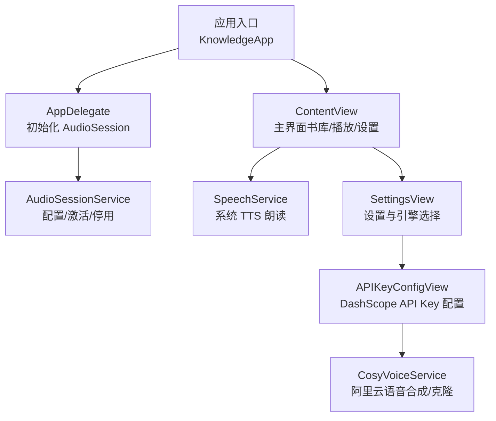
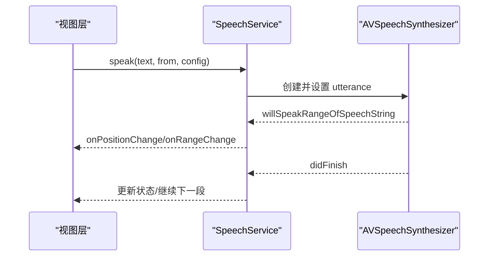
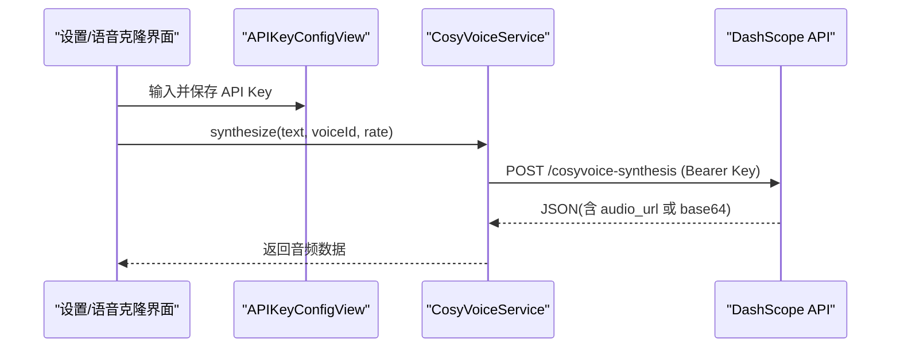
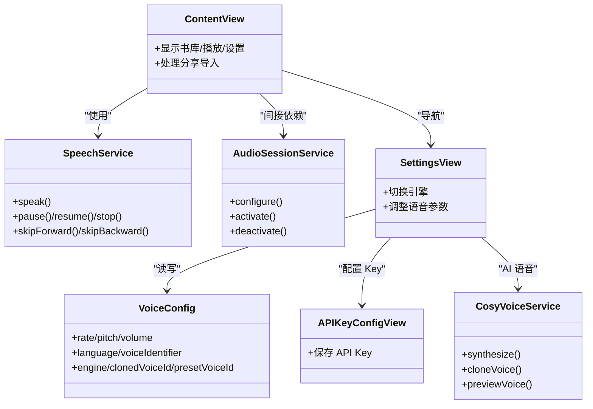

# 快速开始

<cite>
**本文引用的文件**
- [KnowledgeApp.swift](file://App/KnowledgeApp.swift)
- [AppDelegate.swift](file://App/AppDelegate.swift)
- [Info.plist](file://Resources/Info.plist)
- [APIKeyConfigView.swift](file://Views/APIKeyConfigView.swift)
- [SettingsView.swift](file://Views/SettingsView.swift)
- [CosyVoiceService.swift](file://Services/CosyVoiceService.swift)
- [AudioSessionService.swift](file://Services/AudioSessionService.swift)
- [SpeechService.swift](file://Services/SpeechService.swift)
- [VoiceConfig.swift](file://Models/VoiceConfig.swift)
- [ContentView.swift](file://Views/ContentView.swift)
</cite>

## 目录
1. [简介](#简介)
2. [环境要求](#环境要求)
3. [项目克隆与依赖安装](#项目克隆与依赖安装)
4. [首次启动与必要设置](#首次启动与必要设置)
5. [基本运行与核心功能体验](#基本运行与核心功能体验)
6. [常见问题与故障排除](#常见问题与故障排除)
7. [架构概览](#架构概览)
8. [详细组件分析](#详细组件分析)
9. [依赖关系分析](#依赖关系分析)
10. [性能与稳定性建议](#性能与稳定性建议)
11. [结论](#结论)

## 简介
本指南面向首次接触 Knowledge 应用的开发者与用户，帮助你在最短时间内完成环境准备、项目配置与运行，并顺利体验文档阅读、系统 TTS 朗读以及阿里云 DashScope CosyVoice 语音合成等核心能力。

## 环境要求
- Xcode：建议使用最新稳定版（支持 SwiftUI + SwiftData）
- iOS 最低版本：iOS 15+（SwiftData 在 iOS 15 起可用；如需更稳定的 SwiftData 行为，建议 iOS 16+）
- Apple ID：用于签名与调试（真机或模拟器均可）
- 网络：访问阿里云 DashScope API 需要联网
- 设备权限：应用已声明后台音频模式，无需额外手动开启

说明要点
- 应用通过 Info.plist 声明了后台音频模式，确保可在后台播放音频。
- 应用入口使用 SwiftUI App 生命周期，并在 AppDelegate 中初始化音频会话类别。

章节来源
- [Info.plist:1-44](file://Resources/Info.plist#L1-L44)
- [KnowledgeApp.swift:1-29](file://App/KnowledgeApp.swift#L1-L29)
- [AppDelegate.swift:1-14](file://App/AppDelegate.swift#L1-L14)

## 项目克隆与依赖安装
- 克隆仓库到本地
- 打开项目根目录中的 .xcodeproj 或 .xcworkspace（若存在）
- 选择目标设备（模拟器或真机）
- 选择你的开发团队并完成签名
- 构建并运行

注意
- 本项目未包含外部包管理器配置文件，依赖为系统框架（SwiftUI、SwiftData、AVFoundation、Foundation）。
- 如遇到编译错误，请检查 Xcode 版本与 iOS 部署目标是否满足要求。

章节来源
- [KnowledgeApp.swift:1-29](file://App/KnowledgeApp.swift#L1-L29)

## 首次启动与必要设置
首次启动后，请按以下步骤完成关键配置：

1) 配置阿里云 DashScope API Key
- 进入“设置”页面，找到“外观/语音引擎/朗读设置”等区域附近，点击“API Key”入口（或在设置页内寻找“API Key”相关按钮）
- 输入从阿里云控制台获取的 DashScope API Key
- 保存后返回

说明
- API Key 将保存在本地，供语音合成与语音克隆服务调用。
- 若未配置或 Key 无效，调用语音合成时会提示相应错误。

章节来源
- [APIKeyConfigView.swift:1-71](file://Views/APIKeyConfigView.swift#L1-L71)
- [CosyVoiceService.swift:1-219](file://Services/CosyVoiceService.swift#L1-L219)

2) 授权与音频会话
- 应用会在启动时配置 AVAudioSession 为播放模式，支持蓝牙与 AirPlay
- 首次运行时系统可能弹出麦克风/媒体权限提示（取决于具体功能），按提示允许即可

章节来源
- [AppDelegate.swift:1-14](file://App/AppDelegate.swift#L1-L14)
- [AudioSessionService.swift:1-46](file://Services/AudioSessionService.swift#L1-L46)

3) 语言与声音选择（可选）
- 在“设置 > 朗读设置”中选择语言与声音
- 可调整语速、音高、音量，并切换系统 TTS 引擎

章节来源
- [SettingsView.swift:1-194](file://Views/SettingsView.swift#L1-L194)
- [VoiceConfig.swift:1-52](file://Models/VoiceConfig.swift#L1-L52)

## 基本运行与核心功能体验
- 书库：导入网页链接或文本，生成文档条目
- 正在播放：使用系统 TTS 朗读当前文档，支持暂停、继续、快进/后退
- 设置：切换主题、选择语音引擎与参数、配置 API Key

章节来源
- [ContentView.swift:1-98](file://Views/ContentView.swift#L1-L98)
- [SpeechService.swift:1-155](file://Services/SpeechService.swift#L1-L155)

## 常见问题与故障排除
- 无法合成语音或提示“请先配置 API Key”
  - 请在“设置”中正确填写阿里云 DashScope API Key
  - 确认网络可达且 Key 有效
- 401/403 错误
  - 表示 Key 无效或被禁用，请重新获取并更新
- 服务器返回异常或无音频数据
  - 检查请求参数（文本长度、格式等）与服务端状态
- 后台播放无声
  - 确认 Info.plist 已启用后台音频模式
  - 检查设备静音开关与音量设置
- 分享导入失败
  - 检查网络连接与目标网页可访问性
  - 查看弹窗提示的错误信息

章节来源
- [CosyVoiceService.swift:1-219](file://Services/CosyVoiceService.swift#L1-L219)
- [Info.plist:1-44](file://Resources/Info.plist#L1-L44)
- [ContentView.swift:1-98](file://Views/ContentView.swift#L1-L98)

## 架构概览
下图展示了应用启动、音频会话初始化与主要模块之间的关系。

图表来源
- [KnowledgeApp.swift:1-29](file://App/KnowledgeApp.swift#L1-L29)
- [AppDelegate.swift:1-14](file://App/AppDelegate.swift#L1-L14)
- [AudioSessionService.swift:1-46](file://Services/AudioSessionService.swift#L1-L46)
- [ContentView.swift:1-98](file://Views/ContentView.swift#L1-L98)
- [SpeechService.swift:1-155](file://Services/SpeechService.swift#L1-L155)
- [SettingsView.swift:1-194](file://Views/SettingsView.swift#L1-L194)
- [APIKeyConfigView.swift:1-71](file://Views/APIKeyConfigView.swift#L1-L71)
- [CosyVoiceService.swift:1-219](file://Services/CosyVoiceService.swift#L1-L219)

## 详细组件分析

### 应用启动与数据容器
- 应用入口创建 ModelContainer 并注入 ContentView
- 在 AppDelegate 中仅配置 AudioSession 类别，避免过早占用资源

章节来源
- [KnowledgeApp.swift:1-29](file://App/KnowledgeApp.swift#L1-L29)
- [AppDelegate.swift:1-14](file://App/AppDelegate.swift#L1-L14)

### 音频会话管理
- 统一封装 AVAudioSession 的配置、激活与停用
- 支持蓝牙与 AirPlay，适配后台播放场景

章节来源
- [AudioSessionService.swift:1-46](file://Services/AudioSessionService.swift#L1-L46)

### 系统 TTS 朗读流程
- 基于 AVSpeechSynthesizer 实现分段朗读、进度回调与跳转控制
- 提供暂停、继续、停止、快进/后退等操作

图表来源
- [SpeechService.swift:1-155](file://Services/SpeechService.swift#L1-L155)

### 阿里云 DashScope 语音合成
- 通过 CosyVoiceService 发起 HTTP 请求进行 TTS 合成与语音克隆
- 支持预设音色与自定义克隆音色，返回 MP3 音频数据

图表来源
- [APIKeyConfigView.swift:1-71](file://Views/APIKeyConfigView.swift#L1-L71)
- [CosyVoiceService.swift:1-219](file://Services/CosyVoiceService.swift#L1-L219)

### 设置与引擎切换
- 支持系统 TTS 与 Knowledge Voice（AI 语音）两种引擎
- 可配置语速、音高、音量、语言与具体声音
- 当切换到 AI 语音时，需先配置 API Key

章节来源
- [SettingsView.swift:1-194](file://Views/SettingsView.swift#L1-L194)
- [VoiceConfig.swift:1-52](file://Models/VoiceConfig.swift#L1-L52)

## 依赖关系分析
- 应用层：ContentView 组织主界面与共享逻辑
- 服务层：SpeechService（系统 TTS）、CosyVoiceService（云端 TTS）、AudioSessionService（音频会话）
- 配置层：APIKeyConfigView 负责持久化 API Key；SettingsView 负责语音参数与引擎选择
- 模型层：VoiceConfig 描述语音合成参数与引擎类型

图表来源
- [ContentView.swift:1-98](file://Views/ContentView.swift#L1-L98)
- [SpeechService.swift:1-155](file://Services/SpeechService.swift#L1-L155)
- [CosyVoiceService.swift:1-219](file://Services/CosyVoiceService.swift#L1-L219)
- [AudioSessionService.swift:1-46](file://Services/AudioSessionService.swift#L1-L46)
- [SettingsView.swift:1-194](file://Views/SettingsView.swift#L1-L194)
- [APIKeyConfigView.swift:1-71](file://Views/APIKeyConfigView.swift#L1-L71)
- [VoiceConfig.swift:1-52](file://Models/VoiceConfig.swift#L1-L52)

## 性能与稳定性建议
- 长文本朗读：系统 TTS 已内置分段策略，避免一次性过长导致卡顿
- 云端 TTS：对长文本建议分片合成，避免单次请求过大
- 网络重试：对 401/403 等鉴权错误应引导用户重新配置 Key；其他错误建议指数退避重试
- 音频会话：仅在需要时激活会话，减少资源占用

[本节为通用建议，不直接分析具体文件]

## 结论
按照本指南完成环境准备、API Key 配置与基础设置后，即可在设备上成功运行 Knowledge 应用，体验文档朗读与高质量 AI 语音合成。如遇问题，请参考“常见问题与故障排除”章节定位并解决。