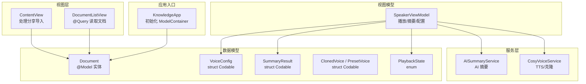
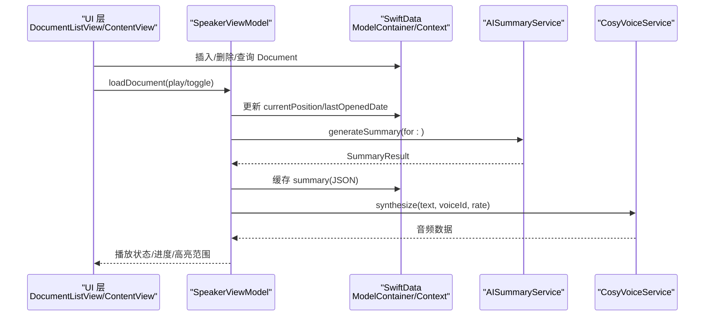
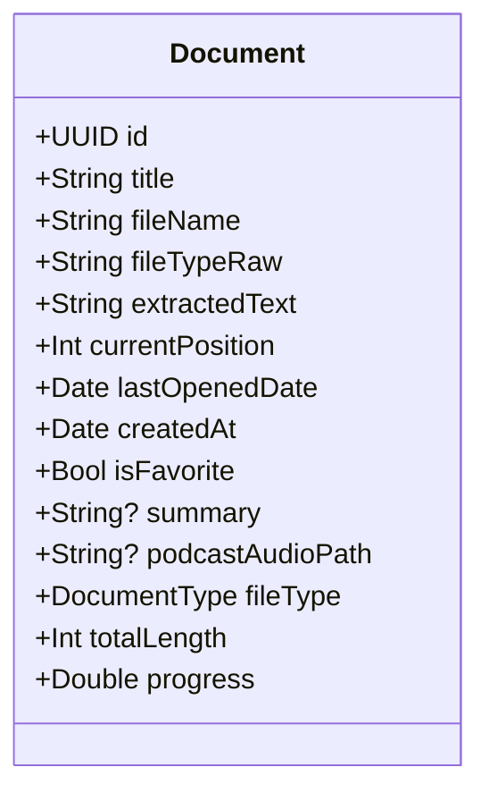
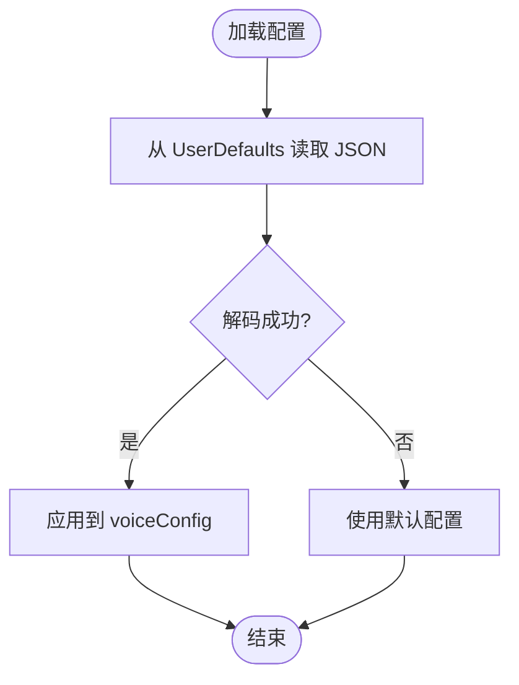
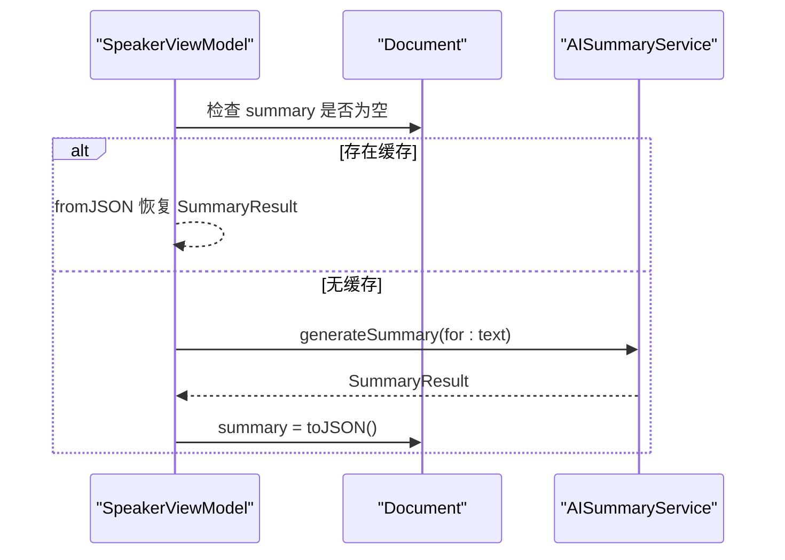
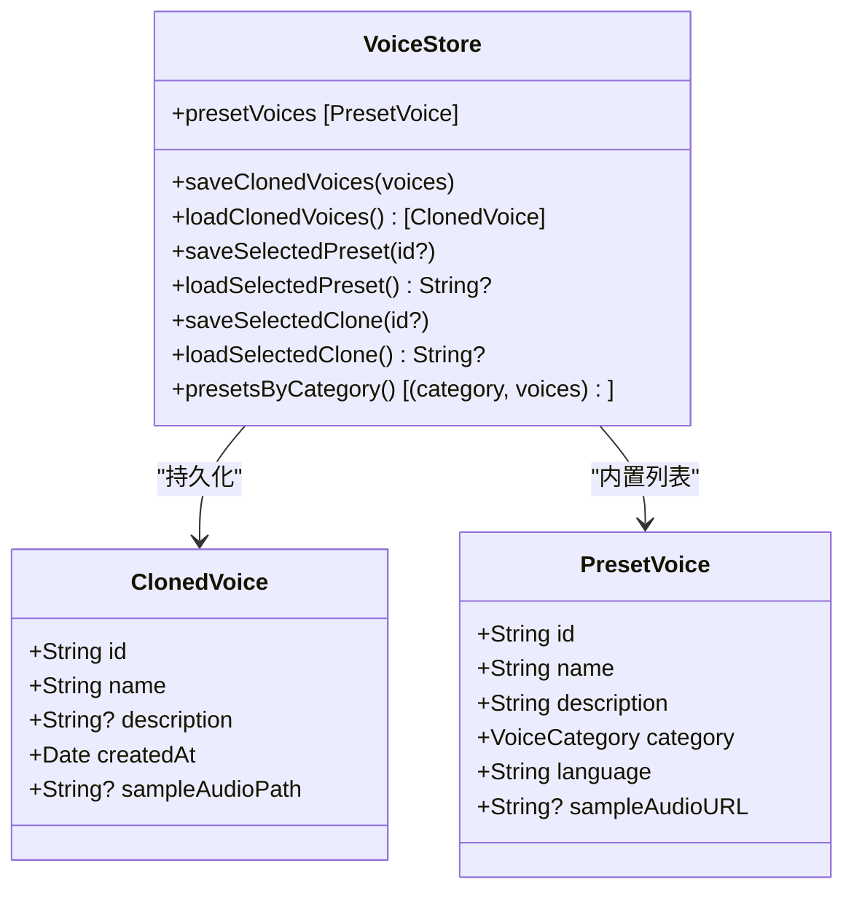
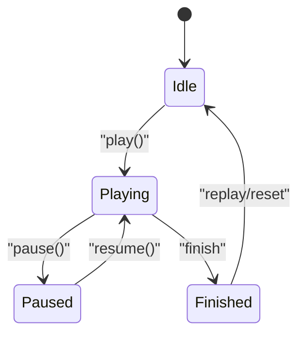
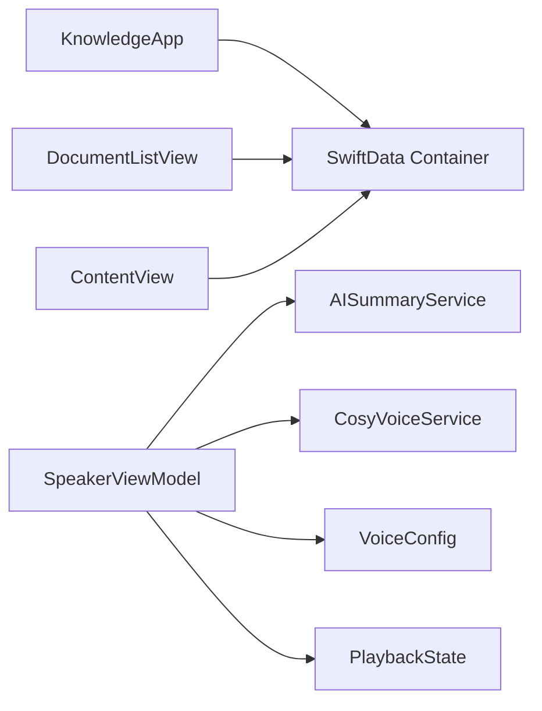
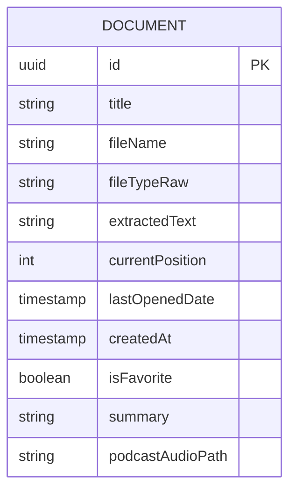

# 数据模型设计

<cite>
**本文引用的文件**
- [KnowledgeApp.swift](file://App/KnowledgeApp.swift)
- [Document.swift](file://Models/Document.swift)
- [VoiceConfig.swift](file://Models/VoiceConfig.swift)
- [SummaryResult.swift](file://Models/SummaryResult.swift)
- [ClonedVoice.swift](file://Models/ClonedVoice.swift)
- [PlaybackState.swift](file://Models/PlaybackState.swift)
- [AISummaryService.swift](file://Services/AISummaryService.swift)
- [CosyVoiceService.swift](file://Services/CosyVoiceService.swift)
- [SpeakerViewModel.swift](file://ViewModels/SpeakerViewModel.swift)
- [DocumentListView.swift](file://Views/DocumentListView.swift)
- [ContentView.swift](file://Views/ContentView.swift)
</cite>

## 目录
1. [简介](#简介)
2. [项目结构](#项目结构)
3. [核心组件](#核心组件)
4. [架构总览](#架构总览)
5. [详细组件分析](#详细组件分析)
6. [依赖关系分析](#依赖关系分析)
7. [性能与缓存策略](#性能与缓存策略)
8. [故障排查指南](#故障排查指南)
9. [结论](#结论)
10. [附录](#附录)

## 简介
本文件面向 Knowledge 应用的数据模型，系统性梳理基于 SwiftData 的持久化方案与相关配置。重点覆盖以下方面：
- 核心实体与数据结构：Document、VoiceConfig、SummaryResult、ClonedVoice、PlaybackState 等
- 字段定义、关系映射与约束规则
- 数据验证逻辑与业务规则实现
- 数据迁移策略与版本管理现状
- 数据库 Schema 图与样例数据
- 数据访问模式与缓存策略最佳实践
- 数据完整性、一致性与安全性保障建议

## 项目结构
当前仓库采用按功能域组织的方式，数据模型集中在 Models 目录；SwiftData 容器在应用入口初始化；视图层通过 @Query/@ModelContext 进行数据读写；服务层负责外部 API 调用与结果解析；ViewModel 作为门面协调播放、摘要生成与配置持久化。

图表来源
- [KnowledgeApp.swift:10-18](file://App/KnowledgeApp.swift#L10-L18)
- [Document.swift:54-114](file://Models/Document.swift#L54-L114)
- [VoiceConfig.swift:24-51](file://Models/VoiceConfig.swift#L24-L51)
- [SummaryResult.swift:5-32](file://Models/SummaryResult.swift#L5-L32)
- [ClonedVoice.swift:33-117](file://Models/ClonedVoice.swift#L33-L117)
- [PlaybackState.swift:3-8](file://Models/PlaybackState.swift#L3-L8)
- [DocumentListView.swift:9-106](file://Views/DocumentListView.swift#L9-L106)
- [ContentView.swift:58-96](file://Views/ContentView.swift#L58-L96)
- [SpeakerViewModel.swift:8-54](file://ViewModels/SpeakerViewModel.swift#L8-L54)
- [AISummaryService.swift:5-34](file://Services/AISummaryService.swift#L5-L34)
- [CosyVoiceService.swift:6-27](file://Services/CosyVoiceService.swift#L6-L27)

章节来源
- [KnowledgeApp.swift:10-18](file://App/KnowledgeApp.swift#L10-L18)
- [Document.swift:54-114](file://Models/Document.swift#L54-L114)
- [DocumentListView.swift:9-106](file://Views/DocumentListView.swift#L9-L106)
- [ContentView.swift:58-96](file://Views/ContentView.swift#L58-L96)

## 核心组件
本节聚焦于数据模型的定义、用途与约束。

- Document（SwiftData 实体）
  - 标识与元信息：id、title、fileName、fileTypeRaw（持久化用）、fileType（计算属性）
  - 内容：extractedText（文本正文）
  - 阅读状态：currentPosition、totalLength（计算属性）、progress（计算属性）
  - 时间戳：lastOpenedDate、createdAt
  - 偏好：isFavorite
  - AI 摘要：summary（JSON 字符串缓存）
  - 音频路径：podcastAudioPath（V3.0 扩展）
  - 约束与建议：
    - title、fileName 应非空且长度合理
    - extractedText 可为空但需校验后再参与进度计算
    - currentPosition 应在 [0, totalLength] 范围内
    - summary 为 JSON 字符串，需保证可解码为 SummaryResult

- VoiceConfig（配置对象）
  - 引擎选择：engine（系统 TTS 或 Knowledge Voice）
  - 语音参数：rate、pitchMultiplier、volume、language、voiceIdentifier
  - 音色 ID：clonedVoiceId、presetVoiceId
  - 默认值与预设档位：defaultConfig、speedPresets
  - 约束与建议：
    - rate 范围 0.1~2.0，超出需裁剪
    - volume/pitchMultiplier 需在合理区间
    - language 使用 IETF BCP 47 格式

- SummaryResult（AI 摘要结果）
  - content：摘要正文
  - keyPoints：关键要点数组
  - createdAt：生成时间
  - 序列化：toJSON/fromJSON 用于持久化到 Document.summary

- ClonedVoice / PresetVoice（音色模型）
  - ClonedVoice：用户克隆音色的 id、name、description、createdAt、sampleAudioPath
  - PresetVoice：内置预设音色 id、name、description、category、language、sampleAudioURL
  - 持久化：VoiceStore 使用 UserDefaults 保存列表与选中项

- PlaybackState（播放状态）
  - idle、playing、paused、finished

章节来源
- [Document.swift:54-114](file://Models/Document.swift#L54-L114)
- [VoiceConfig.swift:24-51](file://Models/VoiceConfig.swift#L24-L51)
- [SummaryResult.swift:5-32](file://Models/SummaryResult.swift#L5-L32)
- [ClonedVoice.swift:33-117](file://Models/ClonedVoice.swift#L33-L117)
- [PlaybackState.swift:3-8](file://Models/PlaybackState.swift#L3-L8)

## 架构总览
下图展示从 UI 到数据层的整体流程，包括文档导入、查询、播放控制、AI 摘要生成与缓存、以及语音合成服务的集成。

图表来源
- [DocumentListView.swift:99-145](file://Views/DocumentListView.swift#L99-L145)
- [ContentView.swift:58-96](file://Views/ContentView.swift#L58-L96)
- [SpeakerViewModel.swift:81-106](file://ViewModels/SpeakerViewModel.swift#L81-L106)
- [SpeakerViewModel.swift:175-203](file://ViewModels/SpeakerViewModel.swift#L175-L203)
- [AISummaryService.swift:25-34](file://Services/AISummaryService.swift#L25-L34)
- [CosyVoiceService.swift:27-88](file://Services/CosyVoiceService.swift#L27-L88)

## 详细组件分析

### Document 实体与 SwiftData 集成
- 实体定义与计算属性
  - fileType 由 fileTypeRaw 派生，便于枚举类型与持久化兼容
  - totalLength 与 progress 提供阅读进度计算
- 生命周期与约束
  - 建议在创建时确保 title、fileName 非空
  - 对 extractedText 做长度限制与编码校验
  - currentPosition 写入前需归一化至 [0, totalLength]
- 与视图交互
  - DocumentListView 使用 @Query 排序并渲染列表
  - 通过 modelContext.insert/save/delete 完成增删改查

图表来源
- [Document.swift:54-114](file://Models/Document.swift#L54-L114)

章节来源
- [Document.swift:54-114](file://Models/Document.swift#L54-L114)
- [DocumentListView.swift:9-106](file://Views/DocumentListView.swift#L9-L106)

### VoiceConfig 配置与持久化
- 配置项说明
  - engine：系统 TTS 或 Knowledge Voice
  - rate、pitchMultiplier、volume、language、voiceIdentifier
  - clonedVoiceId、presetVoiceId
- 持久化策略
  - SpeakerViewModel 将 VoiceConfig 序列化为 JSON 存入 UserDefaults
  - 切换引擎后自动保存并重新绑定回调
- 约束与校验
  - 对 rate/volume/pitchMultiplier 设置边界检查
  - language 使用标准语言标签

图表来源
- [SpeakerViewModel.swift:302-312](file://ViewModels/SpeakerViewModel.swift#L302-L312)
- [VoiceConfig.swift:24-51](file://Models/VoiceConfig.swift#L24-L51)

章节来源
- [SpeakerViewModel.swift:302-312](file://ViewModels/SpeakerViewModel.swift#L302-L312)
- [VoiceConfig.swift:24-51](file://Models/VoiceConfig.swift#L24-L51)

### SummaryResult 与 AI 摘要缓存
- 生成流程
  - 若已有缓存（Document.summary），直接返回
  - 否则调用 AISummaryService.generateSummary，解析响应为 SummaryResult
  - 将 SummaryResult.toJSON() 缓存回 Document.summary
- 错误处理
  - 网络/鉴权/响应异常均抛出结构化错误
  - ViewModel 捕获并更新 UI 错误提示

图表来源
- [SpeakerViewModel.swift:175-203](file://ViewModels/SpeakerViewModel.swift#L175-L203)
- [AISummaryService.swift:25-34](file://Services/AISummaryService.swift#L25-L34)
- [SummaryResult.swift:20-32](file://Models/SummaryResult.swift#L20-L32)

章节来源
- [SpeakerViewModel.swift:175-203](file://ViewModels/SpeakerViewModel.swift#L175-L203)
- [AISummaryService.swift:25-34](file://Services/AISummaryService.swift#L25-L34)
- [SummaryResult.swift:20-32](file://Models/SummaryResult.swift#L20-L32)

### ClonedVoice / PresetVoice 与 VoiceStore
- 数据模型
  - ClonedVoice：用户克隆音色，包含本地 sampleAudioPath
  - PresetVoice：内置预设音色，含分类与语言
- 持久化
  - VoiceStore 使用 UserDefaults 保存克隆列表与选中项
- 使用场景
  - CosyVoiceService 支持预设音色与克隆音色合成
  - SpeakerViewModel 根据 engine 选择对应合成器

图表来源
- [ClonedVoice.swift:33-117](file://Models/ClonedVoice.swift#L33-L117)

章节来源
- [ClonedVoice.swift:33-117](file://Models/ClonedVoice.swift#L33-L117)

### PlaybackState 状态机
- 状态转换
  - idle → playing：开始播放
  - playing → paused：暂停
  - paused → playing：继续
  - playing → finished：播放结束
  - finished → idle：重置
- 与 ViewModel 同步
  - Timer 轮询合成器状态，驱动 state 变化
  - 结束时保存位置

图表来源
- [PlaybackState.swift:3-8](file://Models/PlaybackState.swift#L3-L8)
- [SpeakerViewModel.swift:249-260](file://ViewModels/SpeakerViewModel.swift#L249-L260)

章节来源
- [PlaybackState.swift:3-8](file://Models/PlaybackState.swift#L3-L8)
- [SpeakerViewModel.swift:249-260](file://ViewModels/SpeakerViewModel.swift#L249-L260)

## 依赖关系分析
- 应用入口
  - KnowledgeApp 初始化 ModelContainer，注册 Document 实体
- 视图层
  - DocumentListView 使用 @Query 读取并按 lastOpenedDate 倒序显示
  - ContentView 处理分享导入，构造 Document 并插入
- 视图模型
  - SpeakerViewModel 协调播放、摘要生成、配置持久化
- 服务层
  - AISummaryService 调用阿里云 DashScope 文本生成接口
  - CosyVoiceService 调用 TTS/克隆接口

图表来源
- [KnowledgeApp.swift:10-18](file://App/KnowledgeApp.swift#L10-L18)
- [DocumentListView.swift:9-106](file://Views/DocumentListView.swift#L9-L106)
- [ContentView.swift:58-96](file://Views/ContentView.swift#L58-L96)
- [SpeakerViewModel.swift:8-54](file://ViewModels/SpeakerViewModel.swift#L8-L54)
- [AISummaryService.swift:5-34](file://Services/AISummaryService.swift#L5-L34)
- [CosyVoiceService.swift:6-27](file://Services/CosyVoiceService.swift#L6-L27)

章节来源
- [KnowledgeApp.swift:10-18](file://App/KnowledgeApp.swift#L10-L18)
- [DocumentListView.swift:9-106](file://Views/DocumentListView.swift#L9-L106)
- [ContentView.swift:58-96](file://Views/ContentView.swift#L58-L96)
- [SpeakerViewModel.swift:8-54](file://ViewModels/SpeakerViewModel.swift#L8-L54)

## 性能与缓存策略
- 文档列表查询
  - 使用 @Query 排序减少内存排序开销
  - 分页与懒加载可通过 SwiftUI 列表特性自然实现
- 摘要缓存
  - 优先读取 Document.summary，避免重复请求
  - 失败重试与退避策略可在 ViewModel 中实现
- 语音合成
  - 长文本分段合成，段间延迟避免限流
  - 本地缓存已合成的音频片段（可选）
- 配置与偏好
  - VoiceConfig 与主题模式使用 UserDefaults 轻量存储
  - 大对象（如音色列表）考虑 CoreData 或 SQLite 替代

[本节为通用指导，不直接分析具体文件]

## 故障排查指南
- API Key 缺失或无效
  - AISummaryService/CosyVoiceService 会抛出鉴权错误
  - 建议在设置页校验并提示用户
- 网络异常
  - 统一包装为 LocalizedError，便于 UI 展示
- 解析失败
  - SummaryResult.fromJSON 返回 nil 时需降级处理
- 播放状态不同步
  - 检查 onPositionChange/onRangeChange 回调是否在主线程更新

章节来源
- [AISummaryService.swift:158-179](file://Services/AISummaryService.swift#L158-L179)
- [CosyVoiceService.swift:191-218](file://Services/CosyVoiceService.swift#L191-L218)
- [SummaryResult.swift:20-32](file://Models/SummaryResult.swift#L20-L32)
- [SpeakerViewModel.swift:215-266](file://ViewModels/SpeakerViewModel.swift#L215-L266)

## 结论
Knowledge 应用以 SwiftData 为核心持久化方案，围绕 Document 实体构建文档管理与朗读体验；VoiceConfig 与 SummaryResult 分别承担配置与摘要缓存职责；ClonedVoice/PresetVoice 配合 CosyVoiceService 提供高质量语音合成能力。当前版本未显式实现 SwiftData 迁移，后续可按需引入迁移策略以支持模型演进。

[本节为总结性内容，不直接分析具体文件]

## 附录

### 数据库 Schema 图（概念映射）
以下为概念性 Schema 映射，便于理解实体字段与关系。注意：当前仅注册了 Document 实体，其他结构多为 struct 并通过 UserDefaults 或内存缓存管理。

图表来源
- [Document.swift:54-114](file://Models/Document.swift#L54-L114)
- [KnowledgeApp.swift:10-18](file://App/KnowledgeApp.swift#L10-L18)

### 样例数据
- Document
  - id: UUID
  - title: "示例文档"
  - fileName: "example.pdf"
  - fileTypeRaw: "pdf"
  - extractedText: "这是一段示例文本..."
  - currentPosition: 0
  - lastOpenedDate: Date.now
  - createdAt: Date.now
  - isFavorite: false
  - summary: null
  - podcastAudioPath: null
- VoiceConfig
  - engine: system
  - rate: 0.5
  - pitchMultiplier: 1.0
  - volume: 1.0
  - language: "zh-CN"
  - voiceIdentifier: null
  - clonedVoiceId: null
  - presetVoiceId: null
- SummaryResult
  - content: "这是摘要正文"
  - keyPoints: ["要点1", "要点2", "要点3"]
  - createdAt: Date.now
- ClonedVoice
  - id: "clone_001"
  - name: "我的音色"
  - description: "自定义描述"
  - createdAt: Date.now
  - sampleAudioPath: "/path/to/sample.wav"
- PresetVoice
  - id: "longxiaochun"
  - name: "龙小春"
  - description: "沉稳大气的男声"
  - category: male
  - language: "zh-CN"
  - sampleAudioURL: null

[本节为概念性示例，不直接分析具体文件]

### 数据迁移策略与版本管理（建议）
- 现状
  - 当前仅注册 Document 实体，未显式配置迁移
- 建议方案
  - 使用 SwiftData 的迁移 API（如 schema 版本与迁移闭包）
  - 针对新增字段（如 podcastAudioPath）提供向后兼容默认值
  - 在应用启动时检测版本并执行增量迁移
  - 对不可逆变更（如重命名字段）提供数据转换脚本

[本节为通用指导，不直接分析具体文件]