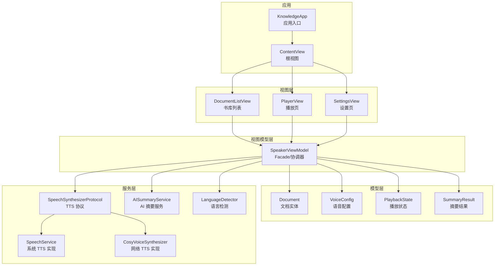
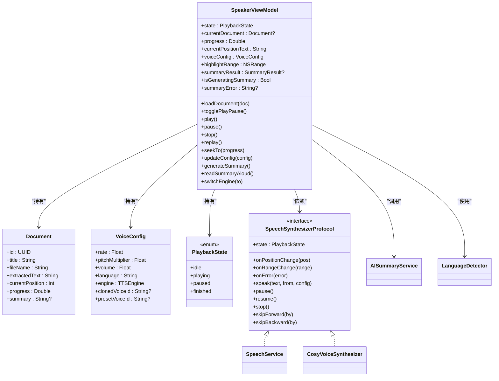
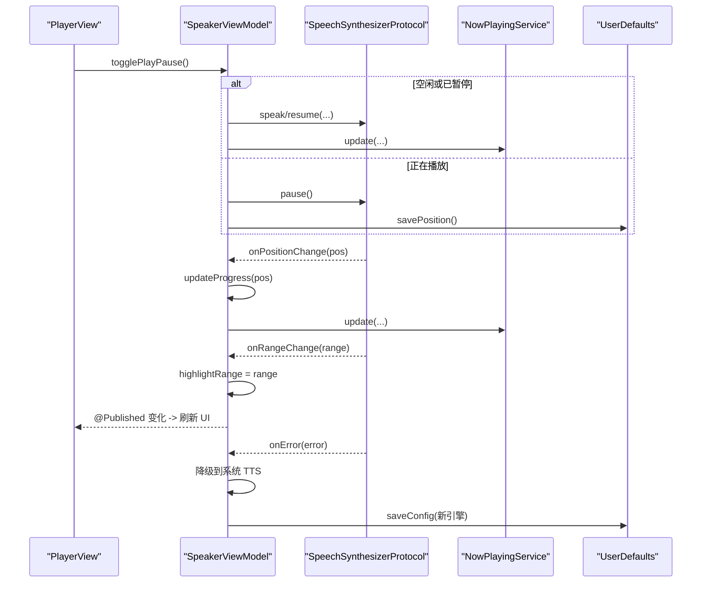
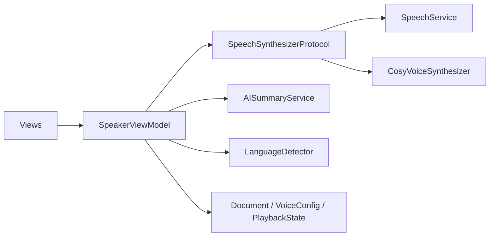

# MVVM 架构详解

<cite>
**本文引用的文件**   
- [KnowledgeApp.swift](file://App/KnowledgeApp.swift)
- [ContentView.swift](file://Views/ContentView.swift)
- [DocumentListView.swift](file://Views/DocumentListView.swift)
- [PlayerView.swift](file://Views/PlayerView.swift)
- [SpeakerViewModel.swift](file://ViewModels/SpeakerViewModel.swift)
- [Document.swift](file://Models/Document.swift)
- [VoiceConfig.swift](file://Models/VoiceConfig.swift)
- [PlaybackState.swift](file://Models/PlaybackState.swift)
- [SummaryResult.swift](file://Models/SummaryResult.swift)
- [SpeechSynthesizerProtocol.swift](file://Services/SpeechSynthesizerProtocol.swift)
- [SpeechService.swift](file://Services/SpeechService.swift)
- [CosyVoiceSynthesizer.swift](file://Services/CosyVoiceSynthesizer.swift)
- [AISummaryService.swift](file://Services/AISummaryService.swift)
- [LanguageDetector.swift](file://Services/LanguageDetector.swift)
</cite>

## 目录
1. [简介](#简介)
2. [项目结构](#项目结构)
3. [核心组件](#核心组件)
4. [架构总览](#架构总览)
5. [详细组件分析](#详细组件分析)
6. [依赖关系分析](#依赖关系分析)
7. [性能与可维护性](#性能与可维护性)
8. [故障排查指南](#故障排查指南)
9. [结论](#结论)
10. [附录：层间通信示例路径](#附录层间通信示例路径)

## 简介
本文件面向 Knowledge 应用，系统性阐述其基于 MVVM 的架构设计与实现。重点包括：
- Model-View-ViewModel 三层职责划分
- SpeakerViewModel 作为 Facade（外观）模式的设计思路
- 数据流向与状态管理（@Published、Combine、回调桥接）
- 具体代码级交互流程与图示
- 选择该架构的原因与收益

## 项目结构
Knowledge 采用按“功能域 + 分层”组织的方式：
- App：应用入口与全局配置
- Views：SwiftUI 视图层，负责 UI 展示与用户交互
- ViewModels：业务编排与状态协调（MVVM 中的 VM）
- Models：领域模型与持久化实体（SwiftData）
- Services：外部能力封装（TTS 引擎、AI 摘要、语言检测等）

图表来源
- [KnowledgeApp.swift:1-29](file://App/KnowledgeApp.swift#L1-L29)
- [ContentView.swift:1-98](file://Views/ContentView.swift#L1-L98)
- [DocumentListView.swift:1-147](file://Views/DocumentListView.swift#L1-L147)
- [PlayerView.swift:1-174](file://Views/PlayerView.swift#L1-L174)
- [SpeakerViewModel.swift:1-314](file://ViewModels/SpeakerViewModel.swift#L1-L314)
- [Document.swift:1-115](file://Models/Document.swift#L1-L115)
- [VoiceConfig.swift:1-52](file://Models/VoiceConfig.swift#L1-L52)
- [PlaybackState.swift:1-9](file://Models/PlaybackState.swift#L1-L9)
- [SummaryResult.swift:1-33](file://Models/SummaryResult.swift#L1-L33)
- [SpeechSynthesizerProtocol.swift:1-20](file://Services/SpeechSynthesizerProtocol.swift#L1-L20)
- [SpeechService.swift:1-155](file://Services/SpeechService.swift#L1-L155)
- [CosyVoiceSynthesizer.swift:1-258](file://Services/CosyVoiceSynthesizer.swift#L1-L258)
- [AISummaryService.swift:1-180](file://Services/AISummaryService.swift#L1-L180)
- [LanguageDetector.swift:1-83](file://Services/LanguageDetector.swift#L1-L83)

章节来源
- [KnowledgeApp.swift:1-29](file://App/KnowledgeApp.swift#L1-L29)
- [ContentView.swift:1-98](file://Views/ContentView.swift#L1-L98)

## 核心组件
- Model 层
  - Document：SwiftData 实体，承载文档元信息、提取文本、阅读进度、摘要缓存等
  - VoiceConfig：语音合成参数与引擎选择
  - PlaybackState：播放状态枚举
  - SummaryResult：AI 摘要结果的结构体，支持 JSON 序列化
- ViewModel 层
  - SpeakerViewModel：对外暴露统一接口，内部组合多个服务，协调播放、配置、摘要生成与错误降级
- View 层
  - ContentView：根视图，装配 Tab 与全局错误提示
  - DocumentListView：书库列表，导入文档、触发加载与播放
  - PlayerView：播放界面，展示高亮文本、控制条、摘要弹窗

章节来源
- [Document.swift:1-115](file://Models/Document.swift#L1-L115)
- [VoiceConfig.swift:1-52](file://Models/VoiceConfig.swift#L1-L52)
- [PlaybackState.swift:1-9](file://Models/PlaybackState.swift#L1-L9)
- [SummaryResult.swift:1-33](file://Models/SummaryResult.swift#L1-L33)
- [SpeakerViewModel.swift:1-314](file://ViewModels/SpeakerViewModel.swift#L1-L314)
- [ContentView.swift:1-98](file://Views/ContentView.swift#L1-L98)
- [DocumentListView.swift:1-147](file://Views/DocumentListView.swift#L1-L147)
- [PlayerView.swift:1-174](file://Views/PlayerView.swift#L1-L174)

## 架构总览
MVVM 在 Knowledge 中的落地方式：
- Model 仅关注数据结构与持久化，不包含业务逻辑
- View 只负责展示与用户输入，不直接访问 Service
- ViewModel 作为 Facade，聚合多服务，提供简洁 API；通过 @Published 将状态推送给 SwiftUI

图表来源
- [SpeakerViewModel.swift:1-314](file://ViewModels/SpeakerViewModel.swift#L1-L314)
- [SpeechSynthesizerProtocol.swift:1-20](file://Services/SpeechSynthesizerProtocol.swift#L1-L20)
- [SpeechService.swift:1-155](file://Services/SpeechService.swift#L1-L155)
- [CosyVoiceSynthesizer.swift:1-258](file://Services/CosyVoiceSynthesizer.swift#L1-L258)
- [AISummaryService.swift:1-180](file://Services/AISummaryService.swift#L1-L180)
- [LanguageDetector.swift:1-83](file://Services/LanguageDetector.swift#L1-L83)
- [Document.swift:1-115](file://Models/Document.swift#L1-L115)
- [VoiceConfig.swift:1-52](file://Models/VoiceConfig.swift#L1-L52)
- [PlaybackState.swift:1-9](file://Models/PlaybackState.swift#L1-L9)

## 详细组件分析

### Facade 设计：SpeakerViewModel
- 角色定位
  - 对外暴露统一的播放、配置、摘要能力
  - 内部组合系统 TTS 与网络 TTS 两种引擎，并处理切换与降级
  - 通过 @Published 属性驱动 SwiftUI 刷新
- 关键职责
  - 文档加载与自动语言匹配
  - 播放控制（播放/暂停/停止/重播/跳转）
  - 引擎切换与运行时配置更新
  - AI 摘要生成与朗读
  - 错误处理与自动降级
- 状态与数据流
  - 使用 Timer.publish 轮询引擎状态，同步到 state
  - 订阅 onPositionChange/onRangeChange 回调，更新 progress/highlightRange
  - 使用 UserDefaults 持久化 voiceConfig 与阅读位置

图表来源
- [PlayerView.swift:1-174](file://Views/PlayerView.swift#L1-L174)
- [SpeakerViewModel.swift:1-314](file://ViewModels/SpeakerViewModel.swift#L1-L314)
- [SpeechSynthesizerProtocol.swift:1-20](file://Services/SpeechSynthesizerProtocol.swift#L1-L20)
- [SpeechService.swift:1-155](file://Services/SpeechService.swift#L1-L155)
- [CosyVoiceSynthesizer.swift:1-258](file://Services/CosyVoiceSynthesizer.swift#L1-L258)

章节来源
- [SpeakerViewModel.swift:1-314](file://ViewModels/SpeakerViewModel.swift#L1-L314)

### Model 层：数据模型定义
- Document
  - 使用 SwiftData 注解，字段包含标题、文件名、类型、提取文本、当前位置、打开时间、收藏标记、摘要缓存、播客音频路径等
  - 计算属性 totalLength、progress 用于 UI 显示
- VoiceConfig
  - 语速、音高、音量、语言、语音标识、引擎选择、克隆/预设音色 ID
  - 提供默认配置与常用语速档位
- PlaybackState
  - idle/playing/paused/finished 四态
- SummaryResult
  - 摘要正文与要点列表，支持 JSON 编码/解码以持久化

章节来源
- [Document.swift:1-115](file://Models/Document.swift#L1-L115)
- [VoiceConfig.swift:1-52](file://Models/VoiceConfig.swift#L1-L52)
- [PlaybackState.swift:1-9](file://Models/PlaybackState.swift#L1-L9)
- [SummaryResult.swift:1-33](file://Models/SummaryResult.swift#L1-L33)

### View 层：SwiftUI 组件组织
- ContentView
  - 组装三个 Tab：书库、正在播放、设置
  - 注入 ErrorHandler 与 ShareExtensionHandler，处理分享来源内容
- DocumentListView
  - 读取 SwiftData 列表，点击行时调用 speakerVM.loadDocument 与 play
  - 支持导入本地文件与网页链接
- PlayerView
  - 绑定 speakerVM.currentDocument、progress、highlightRange 等
  - 提供滑块 seekTo、控制按钮、摘要弹窗

章节来源
- [ContentView.swift:1-98](file://Views/ContentView.swift#L1-L98)
- [DocumentListView.swift:1-147](file://Views/DocumentListView.swift#L1-L147)
- [PlayerView.swift:1-174](file://Views/PlayerView.swift#L1-L174)

### ViewModel 层：业务逻辑协调
- 播放控制
  - togglePlayPause/play/pause/stop/replay/skipForward/skipBackward/seekTo
  - 通过 audioSession 激活/停用，nowPlaying 同步锁屏控件
- 配置管理
  - updateConfig 实时生效，必要时重启当前播放
  - loadConfig/saveConfig 读写 UserDefaults
- 引擎切换
  - switchEngine 动态替换底层 synthesizer，并在播放中无缝迁移
- AI 摘要
  - generateSummary 异步调用 AISummaryService，结果缓存到 Document.summary
  - readSummaryAloud 将摘要拼接为文本后交由 TTS 朗读
- 状态同步
  - setupBindings 内监听 onPositionChange/onRangeChange/onError
  - Timer.publish 轮询 engine.state，保持 state 一致

章节来源
- [SpeakerViewModel.swift:1-314](file://ViewModels/SpeakerViewModel.swift#L1-L314)

### 服务层：TTS 抽象与实现
- SpeechSynthesizerProtocol
  - 定义 state、onPositionChange、onRangeChange、onError 以及播放控制方法
- SpeechService（系统 TTS）
  - 基于 AVSpeechSynthesizer，按自然断点分片，逐段朗读
  - 通过 delegate 回调更新位置与范围
- CosyVoiceSynthesizer（网络 TTS）
  - 分段请求云端合成，写入临时文件并播放
  - 定时估算位置，完成后自动播放下一段
  - 出错时回调 onError，由上层进行降级

章节来源
- [SpeechSynthesizerProtocol.swift:1-20](file://Services/SpeechSynthesizerProtocol.swift#L1-L20)
- [SpeechService.swift:1-155](file://Services/SpeechService.swift#L1-L155)
- [CosyVoiceSynthesizer.swift:1-258](file://Services/CosyVoiceSynthesizer.swift#L1-L258)

### 辅助服务：AI 摘要与语言检测
- AISummaryService
  - 构造 Prompt，调用 DashScope 文本生成 API，解析返回为 SummaryResult
  - 错误分类：缺少/无效 Key、响应异常、HTTP 错误码、网络错误
- LanguageDetector
  - 基于 NSLinguisticTagger 检测主导语言，映射到 VoiceConfig.language
  - 优先选择高质量语音，若不可用则回退

章节来源
- [AISummaryService.swift:1-180](file://Services/AISummaryService.swift#L1-L180)
- [LanguageDetector.swift:1-83](file://Services/LanguageDetector.swift#L1-L83)

## 依赖关系分析
- 低耦合
  - ViewModel 仅依赖 SpeechSynthesizerProtocol 接口，便于替换实现与单元测试 Mock
- 单一职责
  - 各 Service 专注自身领域：TTS、AI 摘要、语言检测
- 数据流清晰
  - View 通过 @ObservedObject/@StateObject 观察 VM 的 @Published
  - VM 通过回调与 Combine 将底层事件转化为 UI 状态

图表来源
- [SpeakerViewModel.swift:1-314](file://ViewModels/SpeakerViewModel.swift#L1-L314)
- [SpeechSynthesizerProtocol.swift:1-20](file://Services/SpeechSynthesizerProtocol.swift#L1-L20)
- [SpeechService.swift:1-155](file://Services/SpeechService.swift#L1-L155)
- [CosyVoiceSynthesizer.swift:1-258](file://Services/CosyVoiceSynthesizer.swift#L1-L258)
- [AISummaryService.swift:1-180](file://Services/AISummaryService.swift#L1-L180)
- [LanguageDetector.swift:1-83](file://Services/LanguageDetector.swift#L1-L83)
- [Document.swift:1-115](file://Models/Document.swift#L1-L115)
- [VoiceConfig.swift:1-52](file://Models/VoiceConfig.swift#L1-L52)
- [PlaybackState.swift:1-9](file://Models/PlaybackState.swift#L1-L9)

## 性能与可维护性
- 性能
  - 系统 TTS 分片策略避免单次过长导致卡顿
  - 网络 TTS 分段合成与顺序播放，减少内存占用
  - 位置更新频率合理（Timer 与回调），避免频繁 UI 重绘
- 可维护性
  - 接口隔离：SpeechSynthesizerProtocol 屏蔽实现差异
  - Facade 模式：SpeakerViewModel 集中编排，降低 View 复杂度
  - 错误降级：网络 TTS 失败自动回退系统 TTS，提升鲁棒性

[本节为通用建议，无需列出具体文件]

## 故障排查指南
- 常见问题
  - 无声音：检查 AudioSession 是否激活、系统语音包是否安装
  - 网络 TTS 失败：确认 API Key 有效、网络可达；查看 onError 回调日志
  - 语言不匹配：确认 LanguageDetector 映射表与系统可用语音
- 定位手段
  - 观察 SpeakerViewModel 的 state、progress、highlightRange 变化
  - 检查 NowPlaying 锁屏控件是否与播放状态一致
  - 查看 AISummaryService 的错误类型与 HTTP 状态码

章节来源
- [SpeakerViewModel.swift:1-314](file://ViewModels/SpeakerViewModel.swift#L1-L314)
- [AISummaryService.swift:1-180](file://Services/AISummaryService.swift#L1-L180)

## 结论
Knowledge 采用清晰的 MVVM 分层与 Facade 模式，结合 SwiftData、Combine 与回调机制，实现了：
- 明确的职责边界与低耦合
- 稳定的状态管理与流畅的用户体验
- 可扩展的 TTS 引擎与智能的语言适配
- 健壮的容错与降级策略

该架构使新增引擎、扩展功能与测试变得简单可控，具备良好的长期演进能力。

[本节为总结，无需列出具体文件]

## 附录：层间通信示例路径
- 视图到 ViewModel
  - 书库点击加载并播放：[DocumentListView.swift:32-35](file://Views/DocumentListView.swift#L32-L35)
  - 播放器控制与滑动跳转：[PlayerView.swift:27-36](file://Views/PlayerView.swift#L27-L36)
- ViewModel 到服务
  - 切换引擎与重新播放：[SpeakerViewModel.swift:57-77](file://ViewModels/SpeakerViewModel.swift#L57-L77)
  - 播放控制与位置保存：[SpeakerViewModel.swift:108-137](file://ViewModels/SpeakerViewModel.swift#L108-L137)
  - 配置更新与热重载：[SpeakerViewModel.swift:160-170](file://ViewModels/SpeakerViewModel.swift#L160-L170)
  - AI 摘要生成与缓存：[SpeakerViewModel.swift:175-203](file://ViewModels/SpeakerViewModel.swift#L175-L203)
- 服务到 ViewModel
  - 位置与范围回调：[SpeakerViewModel.swift:215-231](file://ViewModels/SpeakerViewModel.swift#L215-L231)
  - 错误回调与降级：[SpeakerViewModel.swift:233-247](file://ViewModels/SpeakerViewModel.swift#L233-L247)
- 模型与持久化
  - 文档实体与计算属性：[Document.swift:54-114](file://Models/Document.swift#L54-L114)
  - 语音配置与默认值：[VoiceConfig.swift:24-51](file://Models/VoiceConfig.swift#L24-L51)
  - 摘要结果序列化：[SummaryResult.swift:20-31](file://Models/SummaryResult.swift#L20-L31)