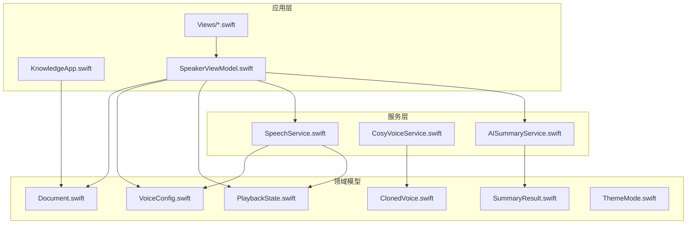
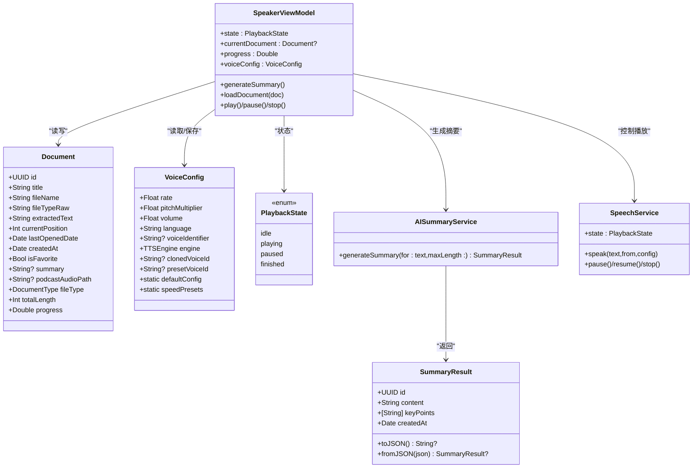
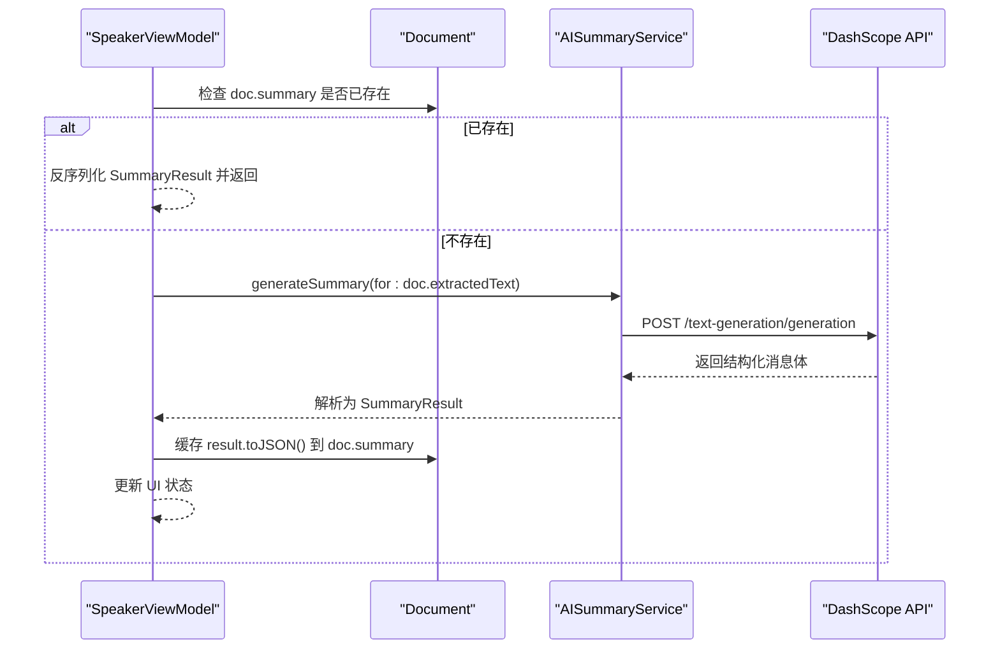
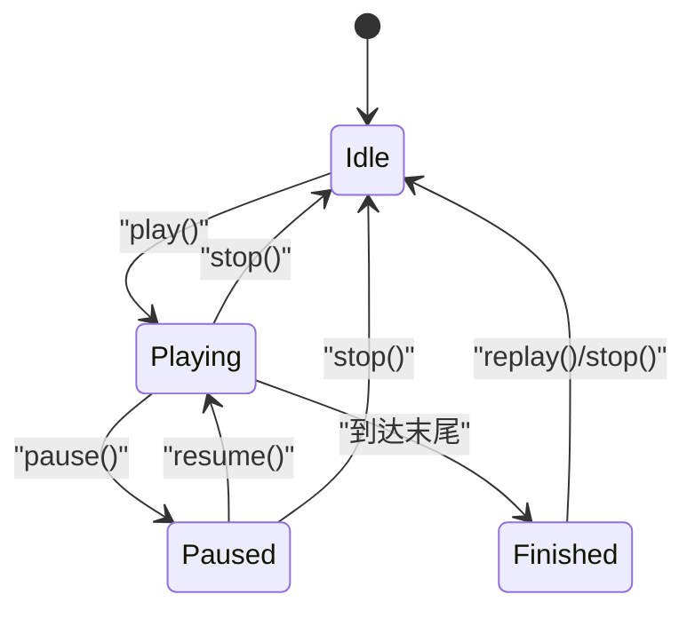
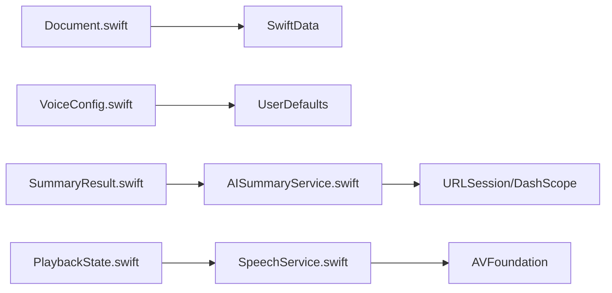

# 数据模型设计

<cite>
**本文引用的文件**
- [Models/Document.swift](file://Models/Document.swift)
- [Models/VoiceConfig.swift](file://Models/VoiceConfig.swift)
- [Models/SummaryResult.swift](file://Models/SummaryResult.swift)
- [Models/PlaybackState.swift](file://Models/PlaybackState.swift)
- [Models/ClonedVoice.swift](file://Models/ClonedVoice.swift)
- [Models/ThemeMode.swift](file://Models/ThemeMode.swift)
- [App/KnowledgeApp.swift](file://App/KnowledgeApp.swift)
- [Services/AISummaryService.swift](file://Services/AISummaryService.swift)
- [Services/CosyVoiceService.swift](file://Services/CosyVoiceService.swift)
- [Services/SpeechService.swift](file://Services/SpeechService.swift)
- [ViewModels/SpeakerViewModel.swift](file://ViewModels/SpeakerViewModel.swift)
- [Views/ContentView.swift](file://Views/ContentView.swift)
- [Views/DocumentListView.swift](file://Views/DocumentListView.swift)
</cite>

## 目录
1. [简介](#简介)
2. [项目结构](#项目结构)
3. [核心组件](#核心组件)
4. [架构总览](#架构总览)
5. [详细组件分析](#详细组件分析)
6. [依赖关系分析](#依赖关系分析)
7. [性能考虑](#性能考虑)
8. [故障排查指南](#故障排查指南)
9. [结论](#结论)
10. [附录：使用示例与最佳实践](#附录使用示例与最佳实践)

## 简介
本文件为 Knowledge 应用的数据模型设计文档，聚焦于 SwiftData 模型的架构设计与使用。内容涵盖：
- Document 核心实体的字段定义、计算属性、关系映射与生命周期管理
- VoiceConfig 配置模型的结构设计与默认值策略
- SummaryResult 数据模型与 AI 服务的交互格式
- PlaybackState 状态枚举的设计与状态转换规则
- 数据持久化策略、迁移方案与性能优化建议
- 数据模型的使用示例与最佳实践

## 项目结构
Knowledge 应用采用分层组织方式：
- Models：领域数据模型与配置
- Services：AI 摘要、语音合成、音频会话等外部能力封装
- ViewModels：业务编排与状态同步
- Views：UI 展示与用户交互
- App：应用入口与 SwiftData 容器初始化

图表来源
- [App/KnowledgeApp.swift:10-18](file://App/KnowledgeApp.swift#L10-L18)
- [Views/DocumentListView.swift:9](file://Views/DocumentListView.swift#L9)
- [ViewModels/SpeakerViewModel.swift:8-54](file://ViewModels/SpeakerViewModel.swift#L8-L54)
- [Services/AISummaryService.swift:5-34](file://Services/AISummaryService.swift#L5-L34)
- [Services/CosyVoiceService.swift:6-17](file://Services/CosyVoiceService.swift#L6-L17)
- [Services/SpeechService.swift:5-23](file://Services/SpeechService.swift#L5-L23)

章节来源
- [App/KnowledgeApp.swift:1-29](file://App/KnowledgeApp.swift#L1-L29)
- [Views/DocumentListView.swift:1-147](file://Views/DocumentListView.swift#L1-L147)
- [ViewModels/SpeakerViewModel.swift:1-314](file://ViewModels/SpeakerViewModel.swift#L1-L314)

## 核心组件
本节概述关键数据模型及其职责：
- Document：SwiftData 实体，表示一篇可朗读的文档，包含文本、进度、类型、收藏标记、摘要与播客音频路径等
- VoiceConfig：TTS 配置（语速、音高、音量、语言、引擎选择、音色标识）
- SummaryResult：AI 生成的摘要结果（正文 + 要点列表），提供 JSON 序列化方法
- PlaybackState：播放状态枚举（空闲、播放中、暂停、结束）
- ClonedVoice/PresetVoice：语音克隆与预设音色数据模型及 UserDefaults 持久化管理器
- ThemeMode：主题模式枚举（系统/亮/暗）

章节来源
- [Models/Document.swift:54-114](file://Models/Document.swift#L54-L114)
- [Models/VoiceConfig.swift:24-51](file://Models/VoiceConfig.swift#L24-L51)
- [Models/SummaryResult.swift:5-32](file://Models/SummaryResult.swift#L5-L32)
- [Models/PlaybackState.swift:3-8](file://Models/PlaybackState.swift#L3-L8)
- [Models/ClonedVoice.swift:33-48](file://Models/ClonedVoice.swift#L33-L48)
- [Models/ThemeMode.swift:4-24](file://Models/ThemeMode.swift#L4-L24)

## 架构总览
下图展示了数据模型在应用中的位置与交互关系，包括 SwiftData 容器注册、视图查询、ViewModel 编排与服务调用。

图表来源
- [Models/Document.swift:54-114](file://Models/Document.swift#L54-L114)
- [Models/VoiceConfig.swift:24-51](file://Models/VoiceConfig.swift#L24-L51)
- [Models/SummaryResult.swift:5-32](file://Models/SummaryResult.swift#L5-L32)
- [Models/PlaybackState.swift:3-8](file://Models/PlaybackState.swift#L3-L8)
- [ViewModels/SpeakerViewModel.swift:8-54](file://ViewModels/SpeakerViewModel.swift#L8-L54)
- [Services/AISummaryService.swift:25-34](file://Services/AISummaryService.swift#L25-L34)
- [Services/SpeechService.swift:5-23](file://Services/SpeechService.swift#L5-L23)

## 详细组件分析

### Document 实体（SwiftData）
- 字段说明
  - 标识与元信息：id、title、fileName、fileTypeRaw（用于持久化的原始字符串）、createdAt、lastOpenedDate
  - 内容与阅读：extractedText、currentPosition、totalLength（计算属性）、progress（计算属性）
  - 偏好与扩展：isFavorite、summary（JSON 字符串缓存）、podcastAudioPath（V3.0 播客音频路径）
- 计算属性
  - fileType：由 fileTypeRaw 派生，便于 UI 显示图标与颜色
  - totalLength：基于 extractedText 的字符长度
  - progress：当前阅读位置与总长度的比值
- 生命周期管理
  - 创建：通过 init 设置默认值（如 UUID、日期、空文本等）
  - 更新：在播放过程中更新 currentPosition 与 lastOpenedDate；在导入或分享时写入 extractedText、title、fileName、fileType
  - 删除：从 ModelContext 删除并保存
- 关系映射
  - 当前版本未显式声明反向关系；如需扩展（例如“文档-摘要”一对一），可在未来引入 @Relationship 或外键字段
- 错误处理与边界
  - 当 extractedText 为空时，progress 返回 0，避免除零异常
  - 对大文本进行截取与分块处理（见 SpeechService 的分段逻辑）

章节来源
- [Models/Document.swift:54-114](file://Models/Document.swift#L54-L114)
- [Views/DocumentListView.swift:99-111](file://Views/DocumentListView.swift#L99-L111)
- [Views/ContentView.swift:65-74](file://Views/ContentView.swift#L65-L74)
- [ViewModels/SpeakerViewModel.swift:296-300](file://ViewModels/SpeakerViewModel.swift#L296-L300)

### VoiceConfig 配置模型
- 结构与默认值
  - 语速 rate（默认 0.5）、音高 pitchMultiplier（默认 1.0）、音量 volume（默认 1.0）
  - 语言 language（默认 zh-CN）、可选 voiceIdentifier
  - 引擎 engine（system/knowledgeVoice），以及克隆音色 ID 与预设音色 ID
  - 提供默认实例 defaultConfig 与常用语速档位 speedPresets
- 持久化策略
  - 通过 JSON 编码存储到 UserDefaults，键名为 voiceConfig
  - 加载失败时回退到 defaultConfig
- 动态切换
  - 切换引擎后重新绑定回调，并在播放中无缝重启新引擎
- 与 TTS 引擎集成
  - 系统 TTS：使用 AVSpeechSynthesisVoice 的语言或标识符
  - Knowledge Voice：通过 CosyVoiceService 合成，支持预设与克隆音色

章节来源
- [Models/VoiceConfig.swift:24-51](file://Models/VoiceConfig.swift#L24-L51)
- [ViewModels/SpeakerViewModel.swift:302-312](file://ViewModels/SpeakerViewModel.swift#L302-L312)
- [Services/SpeechService.swift:59-68](file://Services/SpeechService.swift#L59-L68)
- [Services/CosyVoiceService.swift:27-50](file://Services/CosyVoiceService.swift#L27-L50)

### SummaryResult 与 AI 服务交互
- 数据结构
  - content：摘要正文
  - keyPoints：关键要点数组
  - createdAt：生成时间戳
  - toJSON/fromJSON：用于将结果序列化为字符串并缓存到 Document.summary
- AI 服务接口
  - AISummaryService.generateSummary(for:maxLen:) 异步返回 SummaryResult
  - 内部构建提示词、调用 DashScope API、解析响应并提取摘要与要点
- 错误处理
  - 缺失/无效 API Key、网络错误、非 200 状态码、响应格式异常等
- 缓存策略
  - 若 Document.summary 已有 JSON，则直接反序列化为 SummaryResult 并返回，避免重复请求

图表来源
- [ViewModels/SpeakerViewModel.swift:175-203](file://ViewModels/SpeakerViewModel.swift#L175-L203)
- [Services/AISummaryService.swift:25-34](file://Services/AISummaryService.swift#L25-L34)
- [Services/AISummaryService.swift:60-107](file://Services/AISummaryService.swift#L60-L107)
- [Services/AISummaryService.swift:109-153](file://Services/AISummaryService.swift#L109-L153)
- [Models/SummaryResult.swift:20-32](file://Models/SummaryResult.swift#L20-L32)

章节来源
- [Models/SummaryResult.swift:5-32](file://Models/SummaryResult.swift#L5-L32)
- [Services/AISummaryService.swift:5-180](file://Services/AISummaryService.swift#L5-L180)
- [ViewModels/SpeakerViewModel.swift:175-203](file://ViewModels/SpeakerViewModel.swift#L175-L203)

### PlaybackState 状态枚举与转换规则
- 状态定义
  - idle：空闲
  - playing：播放中
  - paused：暂停
  - finished：结束
- 转换规则（结合 SpeechService 与 SpeakerViewModel）
  - 开始播放：idle/paused -> playing
  - 暂停：playing -> paused
  - 恢复：paused -> playing
  - 停止：任意 -> idle
  - 完成：playing -> finished（当到达文本末尾）
- 状态同步
  - SpeakerViewModel 通过定时器轮询 synthesizer.state，保持 UI 与底层一致
  - 在 finished/idle 时自动保存当前位置

图表来源
- [Models/PlaybackState.swift:3-8](file://Models/PlaybackState.swift#L3-L8)
- [Services/SpeechService.swift:118-132](file://Services/SpeechService.swift#L118-L132)
- [ViewModels/SpeakerViewModel.swift:249-260](file://ViewModels/SpeakerViewModel.swift#L249-L260)

章节来源
- [Models/PlaybackState.swift:3-8](file://Models/PlaybackState.swift#L3-L8)
- [Services/SpeechService.swift:118-132](file://Services/SpeechService.swift#L118-L132)
- [ViewModels/SpeakerViewModel.swift:249-260](file://ViewModels/SpeakerViewModel.swift#L249-L260)

### 其他相关模型
- ClonedVoice 与 PresetVoice
  - 描述本地克隆音色与内置预设音色，并提供 VoiceStore 以 UserDefaults 持久化
- ThemeMode
  - 主题模式枚举，提供图标与 ColorScheme 映射

章节来源
- [Models/ClonedVoice.swift:33-48](file://Models/ClonedVoice.swift#L33-L48)
- [Models/ClonedVoice.swift:53-117](file://Models/ClonedVoice.swift#L53-L117)
- [Models/ThemeMode.swift:4-24](file://Models/ThemeMode.swift#L4-L24)

## 依赖关系分析
- 低耦合与单一职责
  - Document 仅承载数据与简单计算属性
  - VoiceConfig 作为纯配置对象，易于测试与替换
  - SummaryResult 与 AISummaryService 解耦，前者负责结构，后者负责网络与解析
  - PlaybackState 被多处引用，但无副作用
- 外部依赖
  - SwiftData：Document 的持久化与查询
  - UserDefaults：VoiceConfig 与克隆音色的轻量持久化
  - URLSession：AI 摘要与语音合成的网络请求
  - AVFoundation：系统 TTS 播放与状态回调

图表来源
- [App/KnowledgeApp.swift:10-18](file://App/KnowledgeApp.swift#L10-L18)
- [ViewModels/SpeakerViewModel.swift:302-312](file://ViewModels/SpeakerViewModel.swift#L302-L312)
- [Services/AISummaryService.swift:60-107](file://Services/AISummaryService.swift#L60-L107)
- [Services/SpeechService.swift:5-23](file://Services/SpeechService.swift#L5-L23)

章节来源
- [App/KnowledgeApp.swift:10-18](file://App/KnowledgeApp.swift#L10-L18)
- [ViewModels/SpeakerViewModel.swift:302-312](file://ViewModels/SpeakerViewModel.swift#L302-L312)
- [Services/AISummaryService.swift:60-107](file://Services/AISummaryService.swift#L60-L107)
- [Services/SpeechService.swift:5-23](file://Services/SpeechService.swift#L5-L23)

## 性能考虑
- 文本分块与断点优化
  - SpeechService 按自然断点（句号、换行等）切分文本，减少单次合成压力并提升流畅度
- 长文本处理
  - AISummaryService 对输入文本进行前缀截取，避免超长导致超时或费用过高
- 并发与节流
  - CosyVoiceService.synthesizeSegments 分段合成时加入短延迟，避免请求过快
- 内存与 I/O
  - 大文本应避免一次性加载到 UI；必要时分页或懒加载
  - 音频数据尽量流式处理或落盘，避免长时间驻留内存
- 查询优化
  - 使用 @Query 排序与过滤，减少不必要的全量扫描

章节来源
- [Services/SpeechService.swift:44-54](file://Services/SpeechService.swift#L44-L54)
- [Services/AISummaryService.swift:38-58](file://Services/AISummaryService.swift#L38-L58)
- [Services/CosyVoiceService.swift:167-186](file://Services/CosyVoiceService.swift#L167-L186)
- [Views/DocumentListView.swift:9](file://Views/DocumentListView.swift#L9)

## 故障排查指南
- AI 摘要失败
  - 检查 API Key 是否配置且有效
  - 查看网络状态与服务器返回码
  - 确认响应格式是否符合预期
- 语音合成失败
  - 检查 API Key 与网络
  - 确认音频数据是否成功获取（URL 或 base64）
  - 若 Knowledge Voice 出错，系统会自动降级到系统 TTS
- 播放状态不同步
  - 检查 onPositionChange/onRangeChange 回调是否触发
  - 确认主线程更新 state 与 UI 绑定

章节来源
- [Services/AISummaryService.swift:158-179](file://Services/AISummaryService.swift#L158-L179)
- [Services/CosyVoiceService.swift:191-218](file://Services/CosyVoiceService.swift#L191-L218)
- [ViewModels/SpeakerViewModel.swift:234-247](file://ViewModels/SpeakerViewModel.swift#L234-L247)
- [Services/SpeechService.swift:118-143](file://Services/SpeechService.swift#L118-L143)

## 结论
Knowledge 应用的数据模型设计遵循清晰的分层与职责分离原则：
- Document 作为 SwiftData 核心实体，承载文档内容与阅读状态
- VoiceConfig 提供灵活的 TTS 配置与默认值策略
- SummaryResult 与 AISummaryService 协作实现摘要生成与缓存
- PlaybackState 明确定义了播放状态机，保证 UI 与底层一致
- 通过 UserDefaults 与 SwiftData 的组合，兼顾轻量配置与结构化数据的持久化

## 附录：使用示例与最佳实践

### 数据模型使用示例
- 创建并插入文档
  - 在 ContentView 中根据分享内容创建 Document 并插入 ModelContext
  - 参考路径：[Views/ContentView.swift:65-74](file://Views/ContentView.swift#L65-L74)、[Views/ContentView.swift:78-87](file://Views/ContentView.swift#L78-L87)
- 导入文件并保存
  - 在 DocumentListView 中导入文件，解析文本并插入 Document
  - 参考路径：[Views/DocumentListView.swift:99-111](file://Views/DocumentListView.swift#L99-L111)
- 生成并缓存摘要
  - 在 SpeakerViewModel 中调用 AISummaryService，并将结果 JSON 缓存到 Document.summary
  - 参考路径：[ViewModels/SpeakerViewModel.swift:175-203](file://ViewModels/SpeakerViewModel.swift#L175-L203)
- 播放控制与状态同步
  - 通过 SpeakerViewModel 统一调度，监听合成器状态并更新 UI
  - 参考路径：[ViewModels/SpeakerViewModel.swift:249-260](file://ViewModels/SpeakerViewModel.swift#L249-L260)

### 最佳实践
- 数据一致性
  - 所有写操作应在 MainActor 上执行，确保 SwiftUI 状态更新安全
  - 在保存前校验必要字段（如 extractedText 非空）
- 错误处理
  - 对外暴露清晰的错误类型与用户可读消息
  - 对网络请求设置合理超时与重试策略
- 配置管理
  - 使用默认配置与快速预设，降低用户上手成本
  - 配置变更即时生效，必要时平滑切换引擎
- 性能优化
  - 大文本分块处理，避免阻塞主线程
  - 合理使用缓存（如摘要 JSON、最近打开时间）
- 可扩展性
  - 为未来关系建模预留字段（如外键、版本号）
  - 抽象合成器协议，便于替换与测试

章节来源
- [Views/ContentView.swift:65-87](file://Views/ContentView.swift#L65-L87)
- [Views/DocumentListView.swift:99-111](file://Views/DocumentListView.swift#L99-L111)
- [ViewModels/SpeakerViewModel.swift:175-203](file://ViewModels/SpeakerViewModel.swift#L175-L203)
- [ViewModels/SpeakerViewModel.swift:249-260](file://ViewModels/SpeakerViewModel.swift#L249-L260)