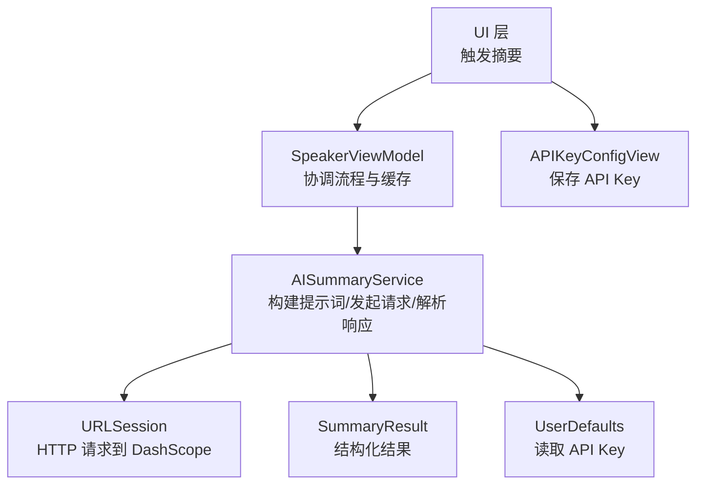
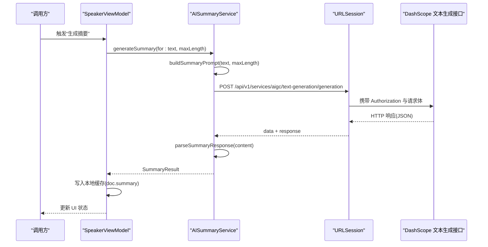
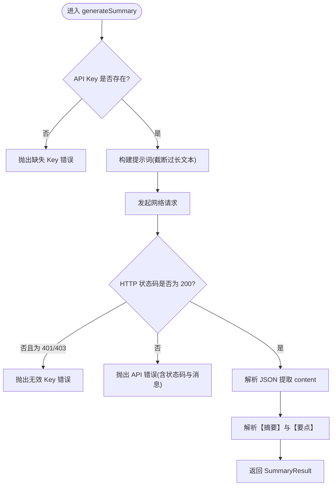
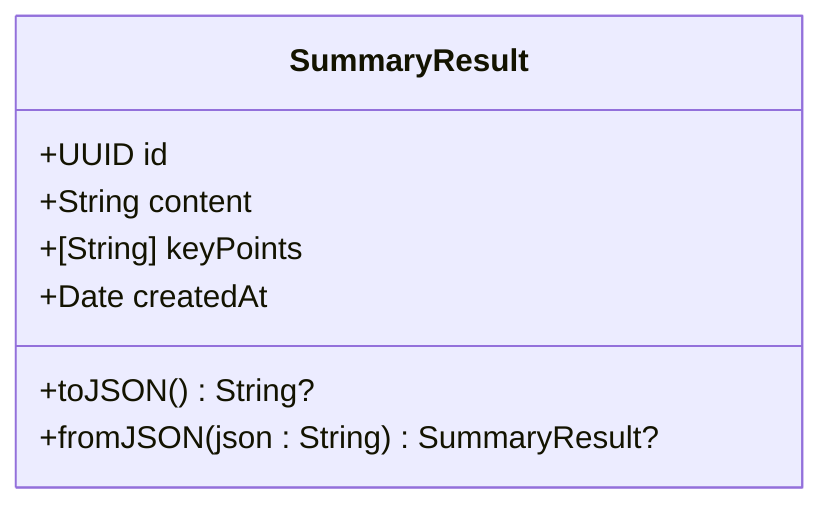
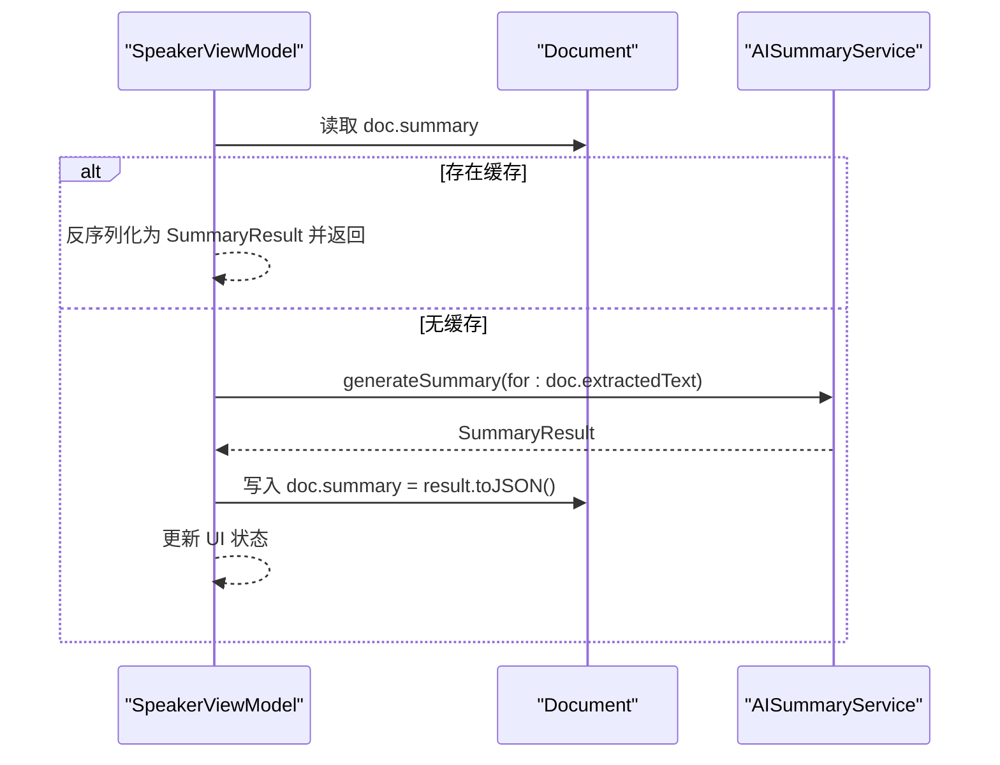
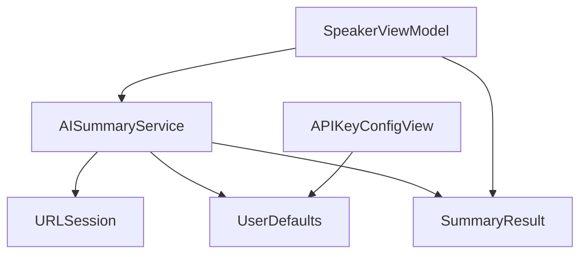

# AI 摘要生成服务

<cite>
**本文引用的文件**
- [AISummaryService.swift](file://Services/AISummaryService.swift)
- [SummaryResult.swift](file://Models/SummaryResult.swift)
- [SpeakerViewModel.swift](file://ViewModels/SpeakerViewModel.swift)
- [APIKeyConfigView.swift](file://Views/APIKeyConfigView.swift)
</cite>

## 目录
1. [简介](#简介)
2. [项目结构](#项目结构)
3. [核心组件](#核心组件)
4. [架构总览](#架构总览)
5. [详细组件分析](#详细组件分析)
6. [依赖关系分析](#依赖关系分析)
7. [性能与优化建议](#性能与优化建议)
8. [故障排查指南](#故障排查指南)
9. [结论](#结论)
10. [附录：使用示例与最佳实践](#附录使用示例与最佳实践)

## 简介
本文件面向 AISummaryService AI 摘要生成服务，说明其如何调用阿里云通义千问（DashScope）文本生成 API，实现智能文档摘要。内容涵盖：
- 工作流程：文本预处理、提示词工程、网络请求、结果解析与缓存策略
- 数据模型：SummaryResult 的结构与字段含义
- 错误处理机制与异常分类
- API 配置方式、提示词工程要点与性能优化建议
- 实际使用示例与最佳实践

## 项目结构
AI 摘要功能涉及以下关键文件：
- 服务层：AISummaryService.swift
- 数据模型：SummaryResult.swift
- 视图模型集成：SpeakerViewModel.swift
- 配置界面：APIKeyConfigView.swift

图表来源
- [AISummaryService.swift:1-180](file://Services/AISummaryService.swift#L1-L180)
- [SummaryResult.swift:1-33](file://Models/SummaryResult.swift#L1-L33)
- [SpeakerViewModel.swift:172-211](file://ViewModels/SpeakerViewModel.swift#L172-L211)
- [APIKeyConfigView.swift:1-70](file://Views/APIKeyConfigView.swift#L1-L70)

章节来源
- [AISummaryService.swift:1-180](file://Services/AISummaryService.swift#L1-L180)
- [SummaryResult.swift:1-33](file://Models/SummaryResult.swift#L1-L33)
- [SpeakerViewModel.swift:172-211](file://ViewModels/SpeakerViewModel.swift#L172-L211)
- [APIKeyConfigView.swift:1-70](file://Views/APIKeyConfigView.swift#L1-L70)

## 核心组件
- AISummaryService：封装对 DashScope 文本生成 API 的调用，负责提示词构建、网络请求、响应解析与错误抛出。
- SummaryResult：定义摘要结果的数据结构，包含摘要正文、关键要点列表与生成时间，并提供 JSON 序列化方法用于持久化。
- SpeakerViewModel：作为门面，协调摘要生成流程，提供本地缓存命中逻辑，并将结果写回文档对象。
- APIKeyConfigView：提供用户输入并持久化存储 API Key，供服务层读取。

章节来源
- [AISummaryService.swift:1-180](file://Services/AISummaryService.swift#L1-L180)
- [SummaryResult.swift:1-33](file://Models/SummaryResult.swift#L1-L33)
- [SpeakerViewModel.swift:172-211](file://ViewModels/SpeakerViewModel.swift#L172-L211)
- [APIKeyConfigView.swift:1-70](file://Views/APIKeyConfigView.swift#L1-L70)

## 架构总览
整体调用链从 UI 或 ViewModel 发起，经 AISummaryService 完成提示词构建、网络请求与结果解析，最终返回结构化摘要结果。

图表来源
- [AISummaryService.swift:25-107](file://Services/AISummaryService.swift#L25-L107)
- [AISummaryService.swift:109-153](file://Services/AISummaryService.swift#L109-L153)
- [SpeakerViewModel.swift:172-211](file://ViewModels/SpeakerViewModel.swift#L172-L211)

## 详细组件分析

### AISummaryService 组件分析
职责与流程：
- 初始化时从 UserDefaults 读取 API Key；若为空，后续调用将抛出缺失 Key 的错误。
- 对外暴露异步方法生成摘要，内部依次执行：
  - 文本预处理与提示词构建：超长文本截断至固定长度，构造结构化提示词，要求输出“摘要正文”和“关键要点”。
  - 网络请求：POST 到 DashScope 文本生成接口，设置 Content-Type 与 Authorization 头，超时时间合理配置。
  - 响应校验与解析：检查 HTTP 状态码，区分鉴权失败与其他错误；解析 JSON 中的消息内容。
  - 结果解析：按约定标记分割“摘要”和“要点”，支持多种要点格式（如“- ”、“• ”、“· ”以及“数字.”），兜底策略为整段文本作为摘要。
- 错误类型：
  - 缺失 API Key
  - 无效 API Key（401/403）
  - 服务器返回数据异常
  - 其他 API 错误（含状态码与消息）
  - 网络错误（包装底层 Error）

图表来源
- [AISummaryService.swift:25-107](file://Services/AISummaryService.swift#L25-L107)
- [AISummaryService.swift:109-153](file://Services/AISummaryService.swift#L109-L153)

章节来源
- [AISummaryService.swift:1-180](file://Services/AISummaryService.swift#L1-L180)

### SummaryResult 数据模型
字段与行为：
- id：唯一标识，便于 UI 列表展示与绑定。
- content：摘要正文字符串。
- keyPoints：关键要点数组，元素为字符串。
- createdAt：生成时间戳。
- toJSON/fromJSON：提供 JSON 编解码能力，用于本地持久化。

图表来源
- [SummaryResult.swift:1-33](file://Models/SummaryResult.swift#L1-L33)

章节来源
- [SummaryResult.swift:1-33](file://Models/SummaryResult.swift#L1-L33)

### 视图模型集成与缓存策略
- 缓存命中：在生成前检查文档是否已有摘要缓存（以 JSON 字符串形式存储在文档对象中），若有则直接返回，避免重复调用。
- 生成流程：若无缓存，调用 AISummaryService 生成摘要，成功后将结果转存为 JSON 字符串写回文档对象，并更新 UI 状态。
- 朗读摘要：将摘要正文与要点拼接后交由语音合成器播放。

图表来源
- [SpeakerViewModel.swift:172-211](file://ViewModels/SpeakerViewModel.swift#L172-L211)

章节来源
- [SpeakerViewModel.swift:172-211](file://ViewModels/SpeakerViewModel.swift#L172-L211)

### API Key 配置
- 配置入口：APIKeyConfigView 提供安全输入框，保存至 UserDefaults 的指定键。
- 服务读取：AISummaryService 初始化时从同一键读取 API Key，未配置时将抛出缺失 Key 错误。

图表来源
- [APIKeyConfigView.swift:55-65](file://Views/APIKeyConfigView.swift#L55-L65)
- [AISummaryService.swift:12-16](file://Services/AISummaryService.swift#L12-L16)
- [AISummaryService.swift:63-64](file://Services/AISummaryService.swift#L63-L64)

章节来源
- [APIKeyConfigView.swift:1-70](file://Views/APIKeyConfigView.swift#L1-L70)
- [AISummaryService.swift:12-16](file://Services/AISummaryService.swift#L12-L16)

## 依赖关系分析
- AISummaryService 依赖：
  - URLSession：发起 HTTP 请求
  - UserDefaults：读取 API Key
  - SummaryResult：返回结构化结果
- SpeakerViewModel 依赖：
  - AISummaryService：调用摘要生成
  - SummaryResult：本地缓存读写
- APIKeyConfigView 依赖：
  - UserDefaults：持久化 API Key

图表来源
- [AISummaryService.swift:1-180](file://Services/AISummaryService.swift#L1-L180)
- [SummaryResult.swift:1-33](file://Models/SummaryResult.swift#L1-L33)
- [SpeakerViewModel.swift:172-211](file://ViewModels/SpeakerViewModel.swift#L172-L211)
- [APIKeyConfigView.swift:1-70](file://Views/APIKeyConfigView.swift#L1-L70)

章节来源
- [AISummaryService.swift:1-180](file://Services/AISummaryService.swift#L1-L180)
- [SummaryResult.swift:1-33](file://Models/SummaryResult.swift#L1-L33)
- [SpeakerViewModel.swift:172-211](file://ViewModels/SpeakerViewModel.swift#L172-L211)
- [APIKeyConfigView.swift:1-70](file://Views/APIKeyConfigView.swift#L1-L70)

## 性能与优化建议
- 文本预处理
  - 当前实现将输入文本截断至固定长度，有助于控制 Token 消耗与响应时间。可考虑根据语言与内容密度动态调整截断阈值。
- 网络请求
  - 超时时间已设置为合理值。建议在业务层增加重试与退避策略，针对临时性网络抖动进行自动重试。
- 结果解析
  - 解析逻辑兼容多种要点格式，具备良好鲁棒性。若模型输出不稳定，可在提示词中进一步约束格式，或在解析层增加容错与降级策略。
- 缓存策略
  - 当前采用文档级 JSON 缓存，避免重复调用。可引入基于内容哈希的失效策略，当原文变更时主动清除旧缓存。
- 并发与线程
  - 服务层使用 async/await，ViewModel 在主线程更新 UI。对于批量摘要场景，建议使用任务组限制并发度，避免资源争用。
- 成本与速率
  - 通过 maxLength 与 max_tokens 控制输出规模，降低费用与延迟。可按文档类型自适应参数。

[本节为通用指导，不直接分析具体文件]

## 故障排查指南
常见问题与定位步骤：
- 未配置 API Key
  - 现象：抛出缺失 Key 错误
  - 处理：打开配置页面输入并保存 API Key
- 无效 API Key（401/403）
  - 现象：抛出无效 Key 错误
  - 处理：确认 Key 有效且权限正确，必要时重新创建
- 服务器返回数据异常
  - 现象：抛出无效响应错误
  - 处理：检查网络连通性与服务端状态，稍后重试
- 其他 API 错误
  - 现象：抛出 API 错误（含状态码与消息）
  - 处理：记录状态码与消息，结合服务端日志定位问题
- 网络错误
  - 现象：抛出网络错误
  - 处理：检查设备网络、代理与防火墙设置

章节来源
- [AISummaryService.swift:158-179](file://Services/AISummaryService.swift#L158-L179)

## 结论
AISummaryService 以清晰的职责边界实现了从提示词构建、网络请求到结果解析的完整链路，并通过 SummaryResult 提供结构化输出。配合 ViewModel 的本地缓存策略，显著减少重复调用与网络开销。错误分类明确，便于上层统一处理与用户反馈。建议在生产环境中补充重试与限流策略，并结合业务场景优化提示词与参数，以获得更稳定与高效的摘要体验。

[本节为总结性内容，不直接分析具体文件]

## 附录：使用示例与最佳实践

- 基本用法
  - 在需要生成摘要的位置调用服务方法，传入文档文本与期望的最大长度，捕获并处理错误，成功时获取 SummaryResult。
  - 参考路径：[generateSummary 调用位置:172-211](file://ViewModels/SpeakerViewModel.swift#L172-L211)

- 提示词工程建议
  - 明确输出结构：要求模型先输出“摘要正文”，再输出“关键要点”，并使用分隔标记，便于解析。
  - 约束要点数量与格式：限定 3-5 条要点，支持多种列表符号，提升解析鲁棒性。
  - 控制长度：通过 maxLength 与 max_tokens 双重约束，平衡质量与成本。
  - 参考路径：[提示词构建:38-58](file://Services/AISummaryService.swift#L38-L58)

- API 配置
  - 在配置页面输入并保存 API Key，服务层会自动读取并在请求头中携带。
  - 参考路径：[配置页面:1-70](file://Views/APIKeyConfigView.swift#L1-70)、[服务读取 Key:12-16](file://Services/AISummaryService.swift#L12-L16)

- 缓存策略
  - 生成前先检查文档是否已有摘要缓存，命中则直接返回；否则生成后写回缓存。
  - 参考路径：[缓存命中与写回:172-211](file://ViewModels/SpeakerViewModel.swift#L172-L211)

- 错误处理与重试
  - 区分鉴权错误、网络错误与服务器错误，分别给出用户提示与恢复策略。
  - 建议：在网络层增加指数退避重试，对 401/403 立即失败并引导用户修复配置。
  - 参考路径：[错误枚举:158-179](file://Services/AISummaryService.swift#L158-179)

- 性能优化
  - 文本截断与参数调优：根据文档类型与目标受众调整 maxLength 与 max_tokens。
  - 并发控制：批量生成时使用任务组限制并发度，避免资源竞争。
  - 缓存失效：当文档内容变化时主动清除旧摘要缓存，保证一致性。

[本节为使用指导，不直接分析具体文件]