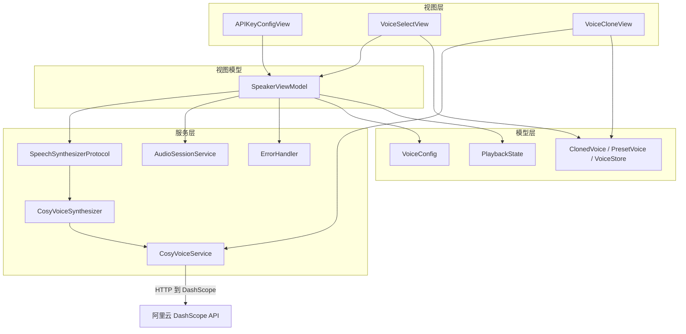
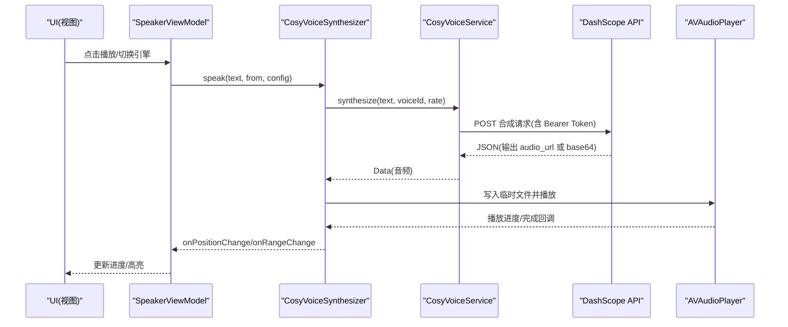
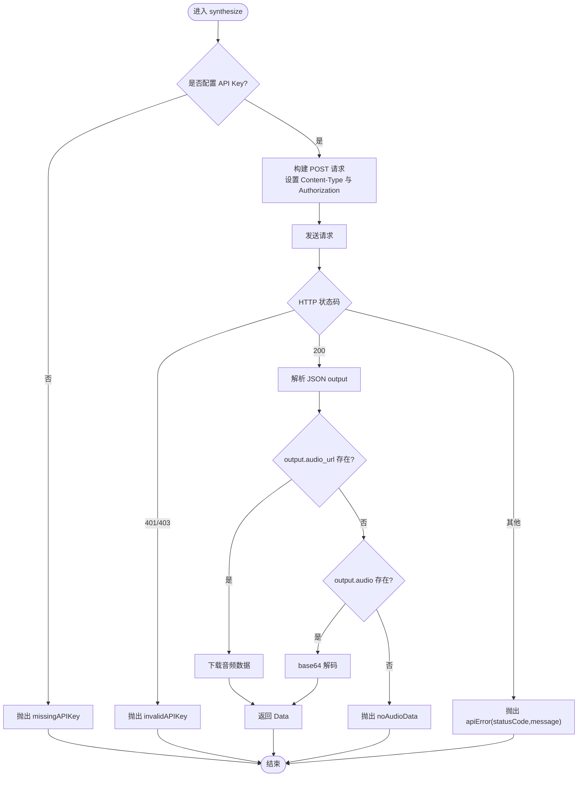
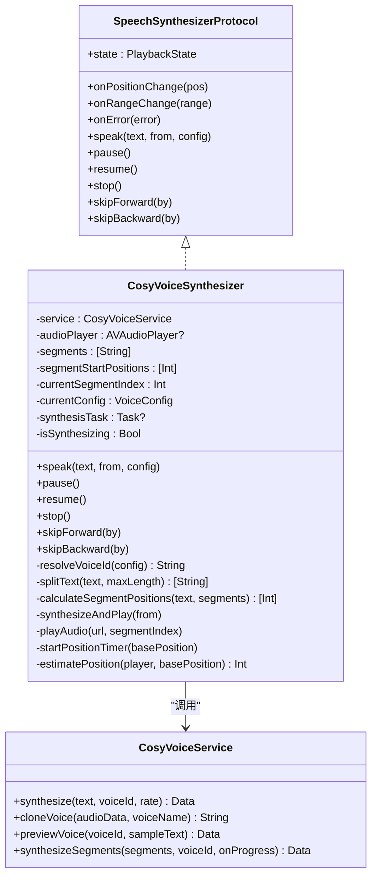
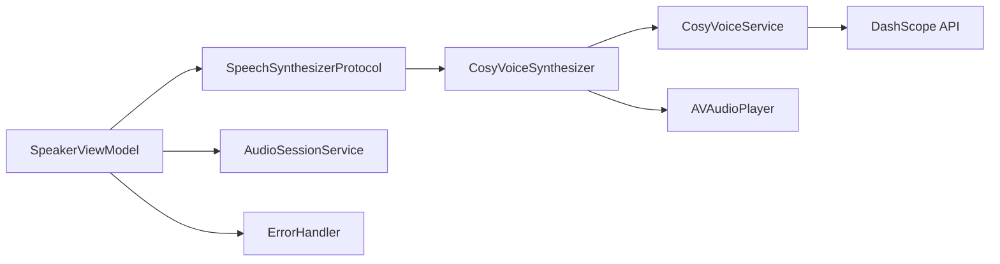

# AI 语音合成服务

<cite>
**本文引用的文件**
- [CosyVoiceService.swift](file://Services/CosyVoiceService.swift)
- [CosyVoiceSynthesizer.swift](file://Services/CosyVoiceSynthesizer.swift)
- [SpeechSynthesizerProtocol.swift](file://Services/SpeechSynthesizerProtocol.swift)
- [SpeakerViewModel.swift](file://ViewModels/SpeakerViewModel.swift)
- [VoiceConfig.swift](file://Models/VoiceConfig.swift)
- [ClonedVoice.swift](file://Models/ClonedVoice.swift)
- [PlaybackState.swift](file://Models/PlaybackState.swift)
- [APIKeyConfigView.swift](file://Views/APIKeyConfigView.swift)
- [VoiceCloneView.swift](file://Views/VoiceCloneView.swift)
- [VoiceSelectView.swift](file://Views/VoiceSelectView.swift)
- [AudioSessionService.swift](file://Services/AudioSessionService.swift)
- [ErrorHandler.swift](file://Services/ErrorHandler.swift)
</cite>

## 目录
1. [简介](#简介)
2. [项目结构](#项目结构)
3. [核心组件](#核心组件)
4. [架构总览](#架构总览)
5. [详细组件分析](#详细组件分析)
6. [依赖关系分析](#依赖关系分析)
7. [性能与网络优化](#性能与网络优化)
8. [集成示例](#集成示例)
9. [故障排除指南](#故障排除指南)
10. [结论](#结论)

## 简介
本文件面向开发者，系统化说明基于阿里云 DashScope API 的 CosyVoice 语音合成服务。文档重点覆盖：
- CosyVoiceService 与 CosyVoiceSynthesizer 的职责分工与协作方式
- API 调用流程（认证、请求构建、响应处理、错误处理）
- 语音克隆功能的原理与使用方法
- 配置管理、API Key 管理与网络请求优化最佳实践
- 完整集成示例与常见问题排查

## 项目结构
本项目采用分层组织：
- Services：服务层，封装 HTTP 调用与播放控制
- Models：数据模型与配置
- ViewModels：业务编排与状态同步
- Views：UI 交互入口（API Key 配置、音色选择、语音克隆）
- 音频会话统一管理

图表来源
- [SpeakerViewModel.swift:1-120](file://ViewModels/SpeakerViewModel.swift#L1-L120)
- [CosyVoiceSynthesizer.swift:1-60](file://Services/CosyVoiceSynthesizer.swift#L1-L60)
- [CosyVoiceService.swift:1-60](file://Services/CosyVoiceService.swift#L1-L60)
- [VoiceConfig.swift:1-52](file://Models/VoiceConfig.swift#L1-L52)
- [ClonedVoice.swift:1-118](file://Models/ClonedVoice.swift#L1-L118)
- [APIKeyConfigView.swift:1-71](file://Views/APIKeyConfigView.swift#L1-L71)
- [VoiceSelectView.swift:1-120](file://Views/VoiceSelectView.swift#L1-L120)
- [VoiceCloneView.swift:1-120](file://Views/VoiceCloneView.swift#L1-L120)
- [AudioSessionService.swift:1-46](file://Services/AudioSessionService.swift#L1-L46)
- [ErrorHandler.swift:1-53](file://Services/ErrorHandler.swift#L1-L53)

章节来源
- [SpeakerViewModel.swift:1-120](file://ViewModels/SpeakerViewModel.swift#L1-L120)
- [CosyVoiceSynthesizer.swift:1-60](file://Services/CosyVoiceSynthesizer.swift#L1-L60)
- [CosyVoiceService.swift:1-60](file://Services/CosyVoiceService.swift#L1-L60)
- [VoiceConfig.swift:1-52](file://Models/VoiceConfig.swift#L1-L52)
- [ClonedVoice.swift:1-118](file://Models/ClonedVoice.swift#L1-L118)
- [APIKeyConfigView.swift:1-71](file://Views/APIKeyConfigView.swift#L1-L71)
- [VoiceSelectView.swift:1-120](file://Views/VoiceSelectView.swift#L1-L120)
- [VoiceCloneView.swift:1-120](file://Views/VoiceCloneView.swift#L1-L120)
- [AudioSessionService.swift:1-46](file://Services/AudioSessionService.swift#L1-L46)
- [ErrorHandler.swift:1-53](file://Services/ErrorHandler.swift#L1-L53)

## 核心组件
- CosyVoiceService：负责与阿里云 DashScope 的 HTTP 通信，包括 TTS 合成、语音克隆、试听；统一错误类型定义；提供分段合成辅助方法。
- CosyVoiceSynthesizer：实现 SpeechSynthesizerProtocol，将 CosyVoiceService 的能力适配为统一的引擎接口，负责文本分段、流式播放、位置与范围回调、错误降级等。
- SpeakerViewModel：对外暴露统一播放控制接口，根据配置动态切换系统 TTS 或 Knowledge Voice（CosyVoice），并处理状态同步、远程控制、错误降级。
- 模型与配置：VoiceConfig 描述语速、音高、音量、语言、引擎与音色 ID；PlaybackState 表示播放状态；ClonedVoice/PresetVoice/VoiceStore 管理预设与克隆音色。
- UI 入口：APIKeyConfigView 用于保存 API Key；VoiceSelectView 用于选择预设或克隆音色并试听；VoiceCloneView 完成录音、上传与克隆流程。
- 基础设施：AudioSessionService 统一配置 AVAudioSession；ErrorHandler 集中记录错误并提示。

章节来源
- [CosyVoiceService.swift:1-219](file://Services/CosyVoiceService.swift#L1-L219)
- [CosyVoiceSynthesizer.swift:1-258](file://Services/CosyVoiceSynthesizer.swift#L1-L258)
- [SpeechSynthesizerProtocol.swift:1-20](file://Services/SpeechSynthesizerProtocol.swift#L1-L20)
- [SpeakerViewModel.swift:1-314](file://ViewModels/SpeakerViewModel.swift#L1-L314)
- [VoiceConfig.swift:1-52](file://Models/VoiceConfig.swift#L1-L52)
- [PlaybackState.swift:1-9](file://Models/PlaybackState.swift#L1-L9)
- [ClonedVoice.swift:1-118](file://Models/ClonedVoice.swift#L1-L118)
- [APIKeyConfigView.swift:1-71](file://Views/APIKeyConfigView.swift#L1-L71)
- [VoiceSelectView.swift:1-215](file://Views/VoiceSelectView.swift#L1-L215)
- [VoiceCloneView.swift:1-404](file://Views/VoiceCloneView.swift#L1-L404)
- [AudioSessionService.swift:1-46](file://Services/AudioSessionService.swift#L1-L46)
- [ErrorHandler.swift:1-53](file://Services/ErrorHandler.swift#L1-L53)

## 架构总览
整体采用“协议抽象 + 具体引擎实现”的分层设计：
- 上层通过 SpeakerViewModel 使用 SpeechSynthesizerProtocol 进行播放控制
- 当选择 Knowledge Voice 时，实际由 CosyVoiceSynthesizer 驱动
- CosyVoiceSynthesizer 内部调用 CosyVoiceService 发起 HTTP 请求至 DashScope
- 音频播放由 AVAudioPlayer 完成，位置与范围通过回调同步给 ViewModel 和 UI
- 错误发生时，ViewModel 自动降级到系统 TTS，保证可用性

图表来源
- [SpeakerViewModel.swift:100-170](file://ViewModels/SpeakerViewModel.swift#L100-L170)
- [CosyVoiceSynthesizer.swift:28-192](file://Services/CosyVoiceSynthesizer.swift#L28-L192)
- [CosyVoiceService.swift:27-88](file://Services/CosyVoiceService.swift#L27-L88)

## 详细组件分析

### CosyVoiceService：DashScope 客户端
职责
- 维护 API Key（从 UserDefaults 读取）
- 构建并发送 TTS 合成与语音克隆请求
- 解析响应（支持返回 audio_url 或 base64）
- 定义统一错误类型
- 提供长文本分段合成的辅助方法

关键流程
- 认证：在请求头设置 Authorization: Bearer <apiKey>
- 请求体：包含 model、input、parameters（voice、format、sample_rate、speech_rate 等）
- 响应处理：优先下载 audio_url，否则解码 base64；非 200 抛出 apiError
- 错误分类：缺失/无效 API Key、无效响应、无音频数据、网络错误等

图表来源
- [CosyVoiceService.swift:27-88](file://Services/CosyVoiceService.swift#L27-L88)
- [CosyVoiceService.swift:191-218](file://Services/CosyVoiceService.swift#L191-L218)

章节来源
- [CosyVoiceService.swift:1-219](file://Services/CosyVoiceService.swift#L1-L219)

### CosyVoiceSynthesizer：引擎适配器
职责
- 实现 SpeechSynthesizerProtocol，屏蔽底层 HTTP 细节
- 文本分段（按标点自然断句，每段不超过 500 字符）
- 逐段合成并播放，自动衔接下一段
- 计算并上报当前位置与朗读范围（全文绝对位置）
- 错误时回调 onError，供上层降级

关键逻辑
- 分段策略：优先在句号、感叹号、问号、换行、逗号、空格处截断
- 位置估算：按每秒约 3 个字符粗略换算，定时更新
- 播放控制：暂停/继续/跳转/停止，任务可取消
- 错误处理：捕获异常后回调 onError，触发 ViewModel 降级

图表来源
- [SpeechSynthesizerProtocol.swift:1-20](file://Services/SpeechSynthesizerProtocol.swift#L1-L20)
- [CosyVoiceSynthesizer.swift:1-258](file://Services/CosyVoiceSynthesizer.swift#L1-L258)
- [CosyVoiceService.swift:1-219](file://Services/CosyVoiceService.swift#L1-L219)

章节来源
- [CosyVoiceSynthesizer.swift:1-258](file://Services/CosyVoiceSynthesizer.swift#L1-L258)
- [SpeechSynthesizerProtocol.swift:1-20](file://Services/SpeechSynthesizerProtocol.swift#L1-L20)

### SpeakerViewModel：编排与降级
职责
- 根据 VoiceConfig.engine 动态选择系统 TTS 或 Knowledge Voice
- 绑定播放状态、位置、范围变化，同步到 UI
- 错误时自动降级到系统 TTS，保障用户体验
- 统一管理 AudioSession 激活/停用、远程控制

关键行为
- switchEngine(to:) 切换引擎并重启当前播放
- play()/pause()/stop()/replay()/seekTo() 控制播放
- onError 回调中若当前为 Knowledge Voice，则切换到系统 TTS 并重试

章节来源
- [SpeakerViewModel.swift:1-314](file://ViewModels/SpeakerViewModel.swift#L1-L314)

### 模型与配置
- VoiceConfig：包含语速、音高、音量、语言、引擎、克隆/预设音色 ID，并提供常用语速档位
- PlaybackState：idle/playing/paused/finished
- ClonedVoice/PresetVoice/VoiceStore：管理预设音色列表、用户克隆音色及持久化

章节来源
- [VoiceConfig.swift:1-52](file://Models/VoiceConfig.swift#L1-L52)
- [PlaybackState.swift:1-9](file://Models/PlaybackState.swift#L1-L9)
- [ClonedVoice.swift:1-118](file://Models/ClonedVoice.swift#L1-L118)

### UI 入口与交互
- APIKeyConfigView：输入并保存 API Key 到 UserDefaults
- VoiceSelectView：展示预设与克隆音色，支持试听与选择
- VoiceCloneView：引导录音、校验时长、预览、上传克隆、保存结果

章节来源
- [APIKeyConfigView.swift:1-71](file://Views/APIKeyConfigView.swift#L1-L71)
- [VoiceSelectView.swift:1-215](file://Views/VoiceSelectView.swift#L1-L215)
- [VoiceCloneView.swift:1-404](file://Views/VoiceCloneView.swift#L1-L404)

## 依赖关系分析
- CosyVoiceSynthesizer 依赖 CosyVoiceService 进行网络请求
- SpeakerViewModel 依赖 SpeechSynthesizerProtocol 以解耦具体引擎
- 所有音频播放相关操作通过 AVAudioPlayer 完成，AudioSessionService 统一配置
- 错误通过 ErrorHandler 集中处理，ViewModel 负责降级策略

图表来源
- [SpeakerViewModel.swift:1-120](file://ViewModels/SpeakerViewModel.swift#L1-L120)
- [CosyVoiceSynthesizer.swift:1-60](file://Services/CosyVoiceSynthesizer.swift#L1-L60)
- [CosyVoiceService.swift:1-60](file://Services/CosyVoiceService.swift#L1-L60)
- [AudioSessionService.swift:1-46](file://Services/AudioSessionService.swift#L1-L46)
- [ErrorHandler.swift:1-53](file://Services/ErrorHandler.swift#L1-L53)

章节来源
- [SpeakerViewModel.swift:1-120](file://ViewModels/SpeakerViewModel.swift#L1-L120)
- [CosyVoiceSynthesizer.swift:1-60](file://Services/CosyVoiceSynthesizer.swift#L1-L60)
- [CosyVoiceService.swift:1-60](file://Services/CosyVoiceService.swift#L1-L60)
- [AudioSessionService.swift:1-46](file://Services/AudioSessionService.swift#L1-L46)
- [ErrorHandler.swift:1-53](file://Services/ErrorHandler.swift#L1-L53)

## 性能与网络优化
- 文本分段：按标点自然断句，避免过长请求导致超时或失败
- 请求节流：分段合成间加入短延迟，降低瞬时并发压力
- 超时控制：TTS 请求默认 30 秒，克隆请求 60 秒，可根据网络环境调整
- 音频格式：MP3 便于传输与播放，采样率 24kHz 平衡音质与体积
- 本地缓存：临时文件路径使用系统临时目录，避免长期占用空间
- 错误重试：当前未内置自动重试，可在上层对特定错误（如网络错误）实施指数退避重试

[本节为通用建议，不直接分析具体文件]

## 集成示例

### 配置 API Key
- 打开 API Key 配置页面，输入阿里云 DashScope API Key 并保存
- 该值会写入 UserDefaults，CosyVoiceService 初始化时读取

章节来源
- [APIKeyConfigView.swift:1-71](file://Views/APIKeyConfigView.swift#L1-L71)
- [CosyVoiceService.swift:14-17](file://Services/CosyVoiceService.swift#L14-L17)

### 选择音色并试听
- 在音色选择页查看预设与克隆音色，点击试听按钮
- 试听通过 previewVoice 调用 synthesize 获取音频并播放

章节来源
- [VoiceSelectView.swift:165-203](file://Views/VoiceSelectView.swift#L165-L203)
- [CosyVoiceService.swift:153-155](file://Services/CosyVoiceService.swift#L153-L155)

### 语音克隆流程
- 进入语音克隆界面，跟随引导文本朗读至少 5 秒
- 预览录音后点击“开始克隆”，上传音频并等待处理
- 成功后保存 voice_id 到本地存储，并设为选中音色

章节来源
- [VoiceCloneView.swift:261-323](file://Views/VoiceCloneView.swift#L261-L323)
- [CosyVoiceService.swift:97-144](file://Services/CosyVoiceService.swift#L97-L144)
- [ClonedVoice.swift:52-118](file://Models/ClonedVoice.swift#L52-L118)

### 播放控制与降级
- 通过 SpeakerViewModel 的 play/pause/stop/replay/seekTo 控制播放
- 若 Knowledge Voice 出错，自动降级到系统 TTS 并重试

章节来源
- [SpeakerViewModel.swift:100-170](file://ViewModels/SpeakerViewModel.swift#L100-L170)
- [SpeakerViewModel.swift:234-247](file://ViewModels/SpeakerViewModel.swift#L234-L247)

## 故障排除指南
常见问题与定位步骤
- 未配置 API Key
  - 现象：抛出 missingAPIKey
  - 处理：前往 API Key 配置页面保存有效密钥
  - 参考：[CosyVoiceService.swift:28-30](file://Services/CosyVoiceService.swift#L28-L30)、[APIKeyConfigView.swift:61-65](file://Views/APIKeyConfigView.swift#L61-L65)

- API Key 无效
  - 现象：HTTP 401/403，抛出 invalidAPIKey
  - 处理：检查控制台权限与配额，重新生成密钥
  - 参考：[CosyVoiceService.swift:59-61](file://Services/CosyVoiceService.swift#L59-L61)

- 服务器返回异常
  - 现象：非 200 状态码，抛出 apiError
  - 处理：查看错误消息中的 statusCode 与 message，联系平台或重试
  - 参考：[CosyVoiceService.swift:63-66](file://Services/CosyVoiceService.swift#L63-L66)

- 未获取到音频数据
  - 现象：响应中既无 audio_url 也无 audio base64，抛出 noAudioData
  - 处理：确认服务端返回字段，必要时增加日志与重试
  - 参考：[CosyVoiceService.swift:69-87](file://Services/CosyVoiceService.swift#L69-L87)

- 录音时长不足
  - 现象：小于 5 秒即尝试克隆，抛出 audioTooShort
  - 处理：延长录音时间，确保清晰稳定
  - 参考：[VoiceCloneView.swift:273-281](file://Views/VoiceCloneView.swift#L273-L281)、[CosyVoiceService.swift:197-198](file://Services/CosyVoiceService.swift#L197-L198)

- 网络错误
  - 现象：网络不可用或超时，抛出 networkError
  - 处理：检查网络状态，适当增加超时或引入重试机制
  - 参考：[CosyVoiceService.swift:198-199](file://Services/CosyVoiceService.swift#L198-L199)

- 播放与音频会话问题
  - 现象：无法后台播放或蓝牙设备无输出
  - 处理：确保 AudioSession 已正确配置与激活
  - 参考：[AudioSessionService.swift:14-27](file://Services/AudioSessionService.swift#L14-L27)

- 全局错误提示
  - 现象：需要弹窗提示用户
  - 处理：使用 ErrorHandler.handle 统一展示
  - 参考：[ErrorHandler.swift:21-35](file://Services/ErrorHandler.swift#L21-L35)

章节来源
- [CosyVoiceService.swift:191-218](file://Services/CosyVoiceService.swift#L191-L218)
- [VoiceCloneView.swift:273-281](file://Views/VoiceCloneView.swift#L273-L281)
- [AudioSessionService.swift:14-27](file://Services/AudioSessionService.swift#L14-L27)
- [ErrorHandler.swift:21-35](file://Services/ErrorHandler.swift#L21-L35)

## 结论
本方案通过清晰的职责划分与协议抽象，实现了可扩展的语音合成能力：
- CosyVoiceService 专注网络与协议细节
- CosyVoiceSynthesizer 负责播放与分段策略
- SpeakerViewModel 统筹状态与降级策略
- UI 层提供直观的配置、选择与克隆体验

结合合理的网络优化与完善的错误处理，系统在可用性与用户体验方面具备良好表现。建议在后续迭代中补充自动重试、更精细的位置映射与离线缓存策略，进一步提升稳定性与性能。