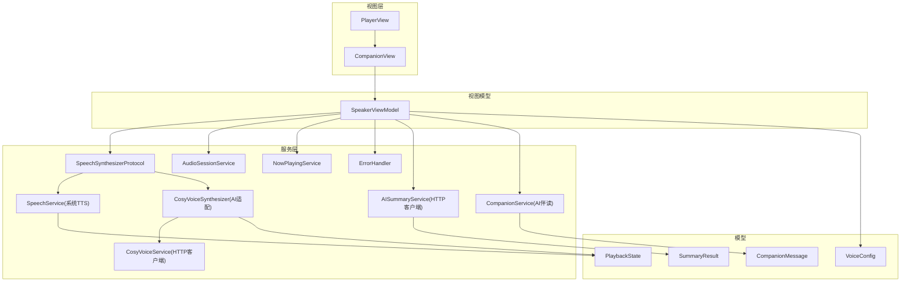
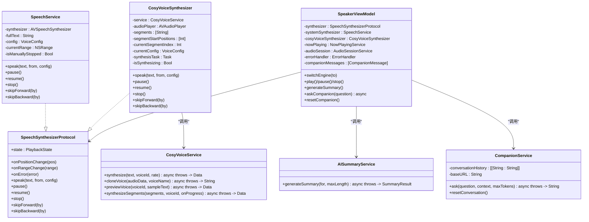
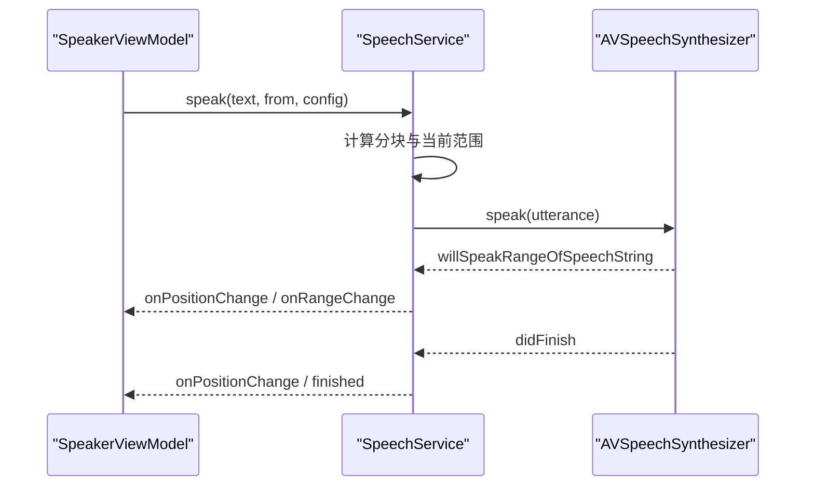
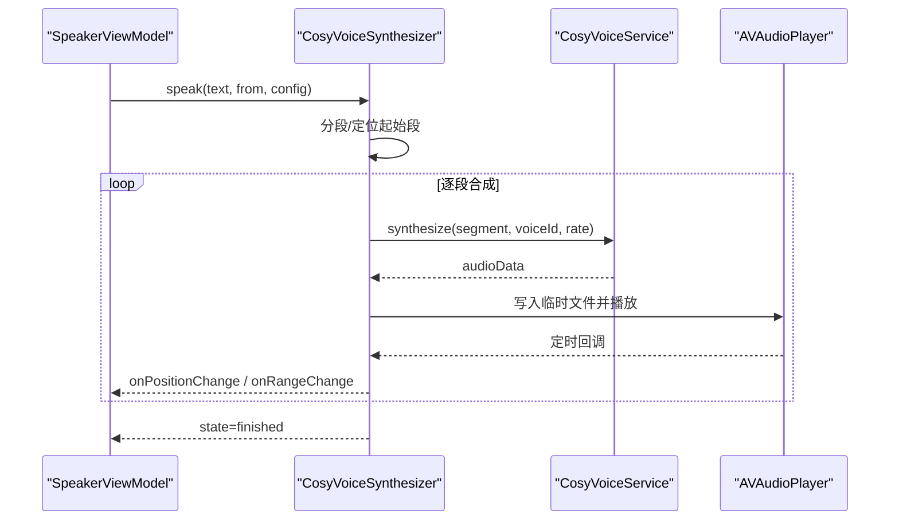
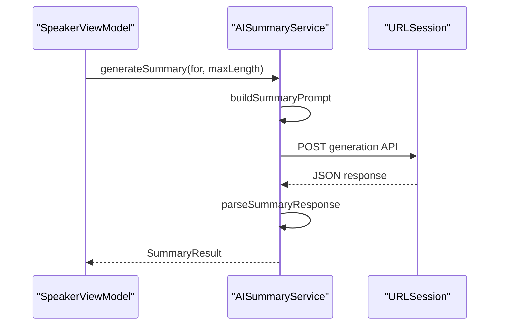
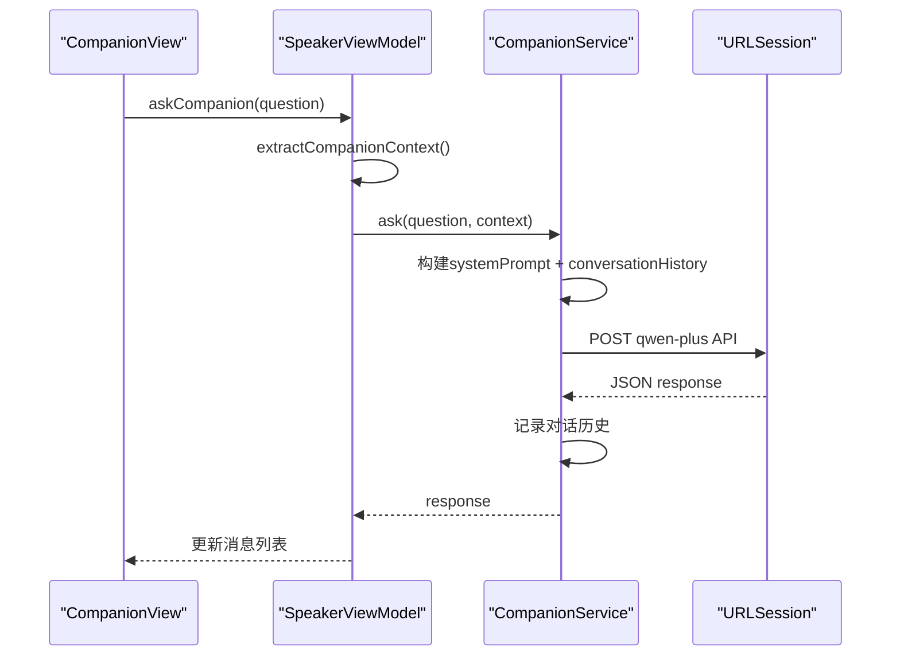
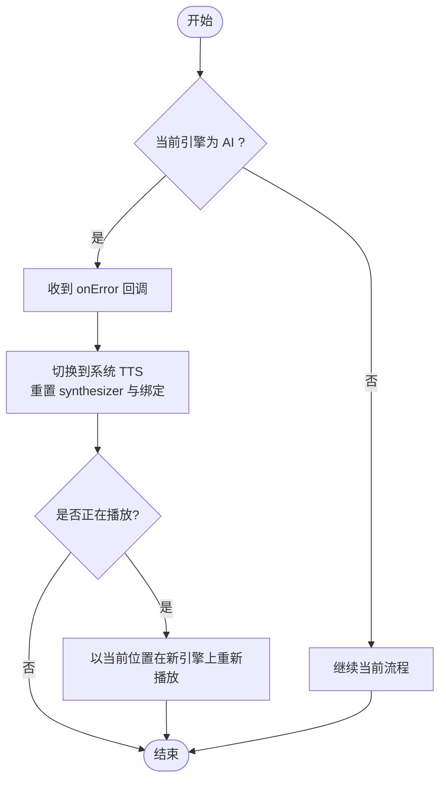
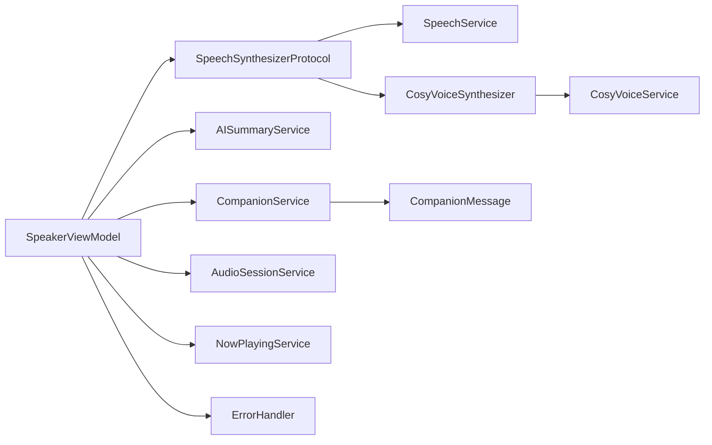

# 服务层设计

<cite>
**本文引用的文件**   
- [SpeechSynthesizerProtocol.swift](file://Services/SpeechSynthesizerProtocol.swift)
- [SpeechService.swift](file://Services/SpeechService.swift)
- [CosyVoiceService.swift](file://Services/CosyVoiceService.swift)
- [CosyVoiceSynthesizer.swift](file://Services/CosyVoiceSynthesizer.swift)
- [AISummaryService.swift](file://Services/AISummaryService.swift)
- [CompanionService.swift](file://Services/CompanionService.swift)
- [CompanionMessage.swift](file://Models/CompanionMessage.swift)
- [ErrorHandler.swift](file://Services/ErrorHandler.swift)
- [AudioSessionService.swift](file://Services/AudioSessionService.swift)
- [NowPlayingService.swift](file://Services/NowPlayingService.swift)
- [SpeakerViewModel.swift](file://ViewModels/SpeakerViewModel.swift)
- [PlaybackState.swift](file://Models/PlaybackState.swift)
- [VoiceConfig.swift](file://Models/VoiceConfig.swift)
- [SummaryResult.swift](file://Models/SummaryResult.swift)
- [CompanionView.swift](file://Views/CompanionView.swift)
- [PlayerView.swift](file://Views/PlayerView.swift)
</cite>

## 更新摘要
**变更内容**   
- 新增 CompanionService AI 伴读服务层组件
- 增强服务层的 AI 对话能力，支持多轮上下文对话
- 添加 CompanionMessage 数据模型和 CompanionView 交互界面
- 在 SpeakerViewModel 中集成伴读功能，提供统一的 AI 服务入口
- 更新架构图以反映新的 AI 服务层结构

## 目录
1. [引言](#引言)
2. [项目结构](#项目结构)
3. [核心组件](#核心组件)
4. [架构总览](#架构总览)
5. [详细组件分析](#详细组件分析)
6. [依赖关系分析](#依赖关系分析)
7. [性能与扩展性](#性能与扩展性)
8. [故障排查指南](#故障排查指南)
9. [结论](#结论)
10. [附录：扩展开发指南](#附录扩展开发指南)

## 引言
本设计文档聚焦 Knowledge 应用的服务层，围绕 SpeechSynthesizerProtocol 抽象接口的设计理念与扩展机制展开，说明如何通过协议抽象统一系统 TTS 与 AI 语音引擎；并阐述各服务的职责、依赖与通信方式，包括错误处理策略与服务降级机制。**最新更新**：新增了 CompanionService AI 伴读服务，增强了服务层的 AI 对话能力，支持边听边问的交互式体验。最后提供面向新语音引擎或 AI 服务的扩展开发指南，帮助开发者快速接入新的能力。

## 项目结构
服务层位于 Services 目录，模型位于 Models 目录，视图模型位于 ViewModels 目录。核心交互由 SpeakerViewModel 作为门面协调播放控制、引擎切换、AI 摘要生成和 AI 伴读对话等流程。

**图表来源**
- [SpeakerViewModel.swift:1-378](file://ViewModels/SpeakerViewModel.swift#L1-L378)
- [SpeechSynthesizerProtocol.swift:1-20](file://Services/SpeechSynthesizerProtocol.swift#L1-L20)
- [SpeechService.swift:1-155](file://Services/SpeechService.swift#L1-L155)
- [CosyVoiceSynthesizer.swift:1-258](file://Services/CosyVoiceSynthesizer.swift#L1-L258)
- [CosyVoiceService.swift:1-219](file://Services/CosyVoiceService.swift#L1-L219)
- [AISummaryService.swift:1-180](file://Services/AISummaryService.swift#L1-L180)
- [CompanionService.swift:1-114](file://Services/CompanionService.swift#L1-L114)
- [CompanionMessage.swift:1-11](file://Models/CompanionMessage.swift#L1-L11)
- [AudioSessionService.swift:1-46](file://Services/AudioSessionService.swift#L1-L46)
- [NowPlayingService.swift:1-57](file://Services/NowPlayingService.swift#L1-L57)
- [PlaybackState.swift:1-9](file://Models/PlaybackState.swift#L1-L9)
- [VoiceConfig.swift:1-52](file://Models/VoiceConfig.swift#L1-L52)
- [SummaryResult.swift:1-33](file://Models/SummaryResult.swift#L1-L33)
- [CompanionView.swift:1-200](file://Views/CompanionView.swift#L1-L200)
- [PlayerView.swift:1-187](file://Views/PlayerView.swift#L1-L187)

**章节来源**
- [SpeakerViewModel.swift:1-378](file://ViewModels/SpeakerViewModel.swift#L1-L378)
- [SpeechSynthesizerProtocol.swift:1-20](file://Services/SpeechSynthesizerProtocol.swift#L1-L20)
- [PlaybackState.swift:1-9](file://Models/PlaybackState.swift#L1-L9)
- [VoiceConfig.swift:1-52](file://Models/VoiceConfig.swift#L1-L52)
- [SummaryResult.swift:1-33](file://Models/SummaryResult.swift#L1-L33)
- [CompanionMessage.swift:1-11](file://Models/CompanionMessage.swift#L1-L11)

## 核心组件
- **SpeechSynthesizerProtocol**：定义统一的语音合成引擎抽象，屏蔽底层实现差异，支持状态、位置/范围回调、错误回调以及播放控制方法。
- **SpeechService**：基于 AVSpeechSynthesizer 的系统 TTS 实现，负责文本分块、断句、播放控制与位置更新。
- **CosyVoiceSynthesizer**：将阿里云 CosyVoice HTTP API 封装为符合协议的引擎适配器，负责分段合成、音频播放、进度估算与错误降级。
- **CosyVoiceService**：HTTP 客户端，封装 CosyVoice 的 TTS 合成、音色克隆、试听等网络请求与响应解析。
- **AISummaryService**：HTTP 客户端，封装通义千问文本生成 API，用于文档摘要生成与结果解析。
- **CompanionService**：**新增** AI 伴读服务，基于通义千问实现多轮对话，携带当前朗读上下文，支持边听边问的交互式体验。
- **AudioSessionService**：统一管理 AVAudioSession 的配置、激活与停用。
- **NowPlayingService**：集成系统媒体中心，同步播放信息与远程控制命令。
- **ErrorHandler**：全局错误日志与用户提示的统一入口。
- **SpeakerViewModel**：门面类，编排播放控制、引擎切换、AI 摘要生成、AI 伴读对话、状态同步与持久化。

**章节来源**
- [SpeechSynthesizerProtocol.swift:1-20](file://Services/SpeechSynthesizerProtocol.swift#L1-L20)
- [SpeechService.swift:1-155](file://Services/SpeechService.swift#L1-L155)
- [CosyVoiceSynthesizer.swift:1-258](file://Services/CosyVoiceSynthesizer.swift#L1-L258)
- [CosyVoiceService.swift:1-219](file://Services/CosyVoiceService.swift#L1-L219)
- [AISummaryService.swift:1-180](file://Services/AISummaryService.swift#L1-L180)
- [CompanionService.swift:1-114](file://Services/CompanionService.swift#L1-L114)
- [AudioSessionService.swift:1-46](file://Services/AudioSessionService.swift#L1-L46)
- [NowPlayingService.swift:1-57](file://Services/NowPlayingService.swift#L1-L57)
- [ErrorHandler.swift:1-53](file://Services/ErrorHandler.swift#L1-L53)
- [SpeakerViewModel.swift:1-378](file://ViewModels/SpeakerViewModel.swift#L1-L378)

## 架构总览
服务层采用"协议抽象 + 具体实现"的分层模式。上层通过 SpeechSynthesizerProtocol 与任意语音引擎交互，SpeakerViewModel 作为门面负责组合多个服务（音频会话、远程控制、错误处理、AI 摘要、AI 伴读）并提供统一的业务接口。

**图表来源**
- [SpeechSynthesizerProtocol.swift:1-20](file://Services/SpeechSynthesizerProtocol.swift#L1-L20)
- [SpeechService.swift:1-155](file://Services/SpeechService.swift#L1-L155)
- [CosyVoiceSynthesizer.swift:1-258](file://Services/CosyVoiceSynthesizer.swift#L1-L258)
- [CosyVoiceService.swift:1-219](file://Services/CosyVoiceService.swift#L1-L219)
- [AISummaryService.swift:1-180](file://Services/AISummaryService.swift#L1-L180)
- [CompanionService.swift:1-114](file://Services/CompanionService.swift#L1-L114)
- [SpeakerViewModel.swift:1-378](file://ViewModels/SpeakerViewModel.swift#L1-L378)

## 详细组件分析

### 语音合成协议与系统 TTS 引擎
- **设计理念**
  - 通过 SpeechSynthesizerProtocol 暴露最小必要接口：状态、位置/范围回调、错误回调与播放控制。这样上层无需关心具体引擎细节，便于替换与测试。
  - 使用 onPositionChange/onRangeChange 驱动 UI 高亮与进度条；onError 供上层进行降级或提示。
- **SpeechService 关键点**
  - 文本分块与断句：按最大长度切分并在标点处寻找自然断点，提升朗读体验。
  - 播放控制：暂停、继续、停止、快进/后退均基于 AVSpeechSynthesizer 的代理回调更新状态与位置。
  - 线程安全：状态更新在 MainActor 上执行，避免跨线程 UI 问题。
- **复杂度与性能**
  - 分块策略 O(n)，断点查找在小窗口内线性扫描，整体接近线性时间。
  - 延迟调度用于跳过操作后的重新合成，保证平滑过渡。

**章节来源**
- [SpeechSynthesizerProtocol.swift:1-20](file://Services/SpeechSynthesizerProtocol.swift#L1-L20)
- [SpeechService.swift:1-155](file://Services/SpeechService.swift#L1-L155)
- [PlaybackState.swift:1-9](file://Models/PlaybackState.swift#L1-L9)

#### 系统 TTS 播放序列

**图表来源**
- [SpeechService.swift:30-155](file://Services/SpeechService.swift#L30-L155)
- [SpeakerViewModel.swift:215-266](file://ViewModels/SpeakerViewModel.swift#L215-L266)

### AI 语音引擎适配器与 HTTP 客户端
- **CosyVoiceSynthesizer**
  - 将长文本按段落拆分，逐段调用 CosyVoiceService 合成 MP3，写入临时文件并通过 AVAudioPlayer 播放。
  - 维护每段在全文中的起始位置，结合播放器时间估算字符位置，驱动 onPositionChange/onRangeChange。
  - 错误处理：当某段合成失败时触发 onError，并返回 idle 状态，交由上层进行降级。
- **CosyVoiceService**
  - 封装 DashScope CosyVoice 的 TTS 与克隆接口，统一鉴权、超时、状态码与响应体解析。
  - 提供 synthesizeSegments 辅助方法，带进度回调与段间延时，避免请求过快。
- **错误与降级**
  - 网络/鉴权错误抛出明确错误类型，上层可据此提示用户或回退到系统 TTS。

**章节来源**
- [CosyVoiceSynthesizer.swift:1-258](file://Services/CosyVoiceSynthesizer.swift#L1-L258)
- [CosyVoiceService.swift:1-219](file://Services/CosyVoiceService.swift#L1-L219)

#### AI 语音合成与播放序列

**图表来源**
- [CosyVoiceSynthesizer.swift:148-258](file://Services/CosyVoiceSynthesizer.swift#L148-L258)
- [CosyVoiceService.swift:27-88](file://Services/CosyVoiceService.swift#L27-L88)
- [SpeakerViewModel.swift:215-266](file://ViewModels/SpeakerViewModel.swift#L215-L266)

### AI 摘要服务
- **AISummaryService**
  - 构建结构化 prompt，调用 DashScope 文本生成接口，解析 JSON 响应，提取摘要正文与关键要点。
  - 对过长输入做截断，限制 token 数量与温度参数，平衡质量与成本。
- **结果模型**
  - SummaryResult 包含内容、要点列表与创建时间，支持 JSON 序列化以便缓存。

**章节来源**
- [AISummaryService.swift:1-180](file://Services/AISummaryService.swift#L1-L180)
- [SummaryResult.swift:1-33](file://Models/SummaryResult.swift#L1-L33)

#### 摘要生成序列

**图表来源**
- [AISummaryService.swift:25-153](file://Services/AISummaryService.swift#L25-L153)
- [SpeakerViewModel.swift:175-203](file://ViewModels/SpeakerViewModel.swift#L175-L203)

### AI 伴读服务（新增）
- **CompanionService 设计**
  - 基于通义千问 qwen-plus 模型，实现多轮对话能力，自动携带当前朗读上下文。
  - 维护对话历史（最多保留最近 10 轮），支持 resetConversation 重置对话状态。
  - 智能上下文提取：自动获取当前朗读位置前后 500 字范围的文本作为对话背景。
- **对话管理机制**
  - 系统提示词设计：定义专业阅读伴读助手角色，要求回答简洁口语化，控制在 100 字以内。
  - 消息格式标准化：使用 system/user/assistant 角色格式，确保与通义千问 API 兼容。
  - 错误处理：统一的 AIServiceError 枚举，支持 API Key 验证、网络错误、响应异常等场景。
- **集成方式**
  - 单例模式：static let shared 提供全局访问点。
  - 异步接口：async/await 模式，支持并发调用。
  - 配置管理：从 UserDefaults 读取 dashscope_api_key。

**章节来源**
- [CompanionService.swift:1-114](file://Services/CompanionService.swift#L1-L114)
- [AIServiceError.swift:157-180](file://Services/AISummaryService.swift#L157-L180)

#### AI 伴读对话序列

**图表来源**
- [CompanionService.swift:24-59](file://Services/CompanionService.swift#L24-L59)
- [SpeakerViewModel.swift:227-253](file://ViewModels/SpeakerViewModel.swift#L227-L253)
- [CompanionView.swift:193-197](file://Views/CompanionView.swift#L193-L197)

### 门面与编排：SpeakerViewModel
- **职责**
  - 管理当前语音引擎实例，根据配置在系统 TTS 与 AI 引擎之间切换。
  - 编排播放控制、进度同步、远程控制、音频会话生命周期。
  - 触发 AI 摘要生成，并将结果缓存至文档对象。
  - **新增**：管理 AI 伴读对话状态，协调对话历史与朗读上下文。
- **错误处理与降级**
  - 监听引擎 onError：当 AI 引擎出错时自动降级到系统 TTS，并恢复绑定。
  - 使用 ErrorHandler 记录错误与弹窗提示。
  - **新增**：伴读对话错误处理，显示友好的错误提示信息。
- **状态同步**
  - 通过 Timer 轮询引擎 state，保持 ViewModel 状态一致，并在结束/空闲时保存位置。
  - **新增**：伴读对话状态管理，包括加载状态、消息列表、对话历史同步。

**章节来源**
- [SpeakerViewModel.swift:1-378](file://ViewModels/SpeakerViewModel.swift#L1-L378)
- [ErrorHandler.swift:1-53](file://Services/ErrorHandler.swift#L1-L53)
- [AudioSessionService.swift:1-46](file://Services/AudioSessionService.swift#L1-L46)
- [NowPlayingService.swift:1-57](file://Services/NowPlayingService.swift#L1-L57)

#### 引擎切换与降级流程图

**图表来源**
- [SpeakerViewModel.swift:233-247](file://ViewModels/SpeakerViewModel.swift#L233-L247)
- [SpeakerViewModel.swift:56-77](file://ViewModels/SpeakerViewModel.swift#L56-L77)

## 依赖关系分析
- **低耦合**
  - 上层仅依赖 SpeechSynthesizerProtocol，不感知具体实现，新增引擎只需实现该协议。
  - AI 服务通过独立的服务类封装，互不影响。
- **单一职责**
  - CosyVoiceService 专注 HTTP 请求与响应解析；CosyVoiceSynthesizer 专注播放编排与位置估算；SpeechService 专注系统 TTS。
  - **新增**：CompanionService 专注 AI 对话逻辑，与摘要服务分离。
- **外部依赖**
  - AVFoundation：系统 TTS 与音频播放。
  - MediaPlayer：系统媒体中心集成。
  - URLSession：网络请求。
- **潜在循环依赖**
  - 当前无循环引用；所有服务单向依赖模型与系统框架。

**图表来源**
- [SpeakerViewModel.swift:1-378](file://ViewModels/SpeakerViewModel.swift#L1-L378)
- [SpeechSynthesizerProtocol.swift:1-20](file://Services/SpeechSynthesizerProtocol.swift#L1-L20)
- [SpeechService.swift:1-155](file://Services/SpeechService.swift#L1-L155)
- [CosyVoiceSynthesizer.swift:1-258](file://Services/CosyVoiceSynthesizer.swift#L1-L258)
- [CosyVoiceService.swift:1-219](file://Services/CosyVoiceService.swift#L1-L219)
- [AISummaryService.swift:1-180](file://Services/AISummaryService.swift#L1-L180)
- [CompanionService.swift:1-114](file://Services/CompanionService.swift#L1-L114)
- [CompanionMessage.swift:1-11](file://Models/CompanionMessage.swift#L1-L11)
- [AudioSessionService.swift:1-46](file://Services/AudioSessionService.swift#L1-L46)
- [NowPlayingService.swift:1-57](file://Services/NowPlayingService.swift#L1-L57)
- [ErrorHandler.swift:1-53](file://Services/ErrorHandler.swift#L1-L53)

## 性能与扩展性
- **性能特性**
  - 系统 TTS：本地合成，首包延迟低，适合离线场景；分块与断句减少单次合成压力。
  - AI 语音：网络延迟较高，采用分段合成与段间延时，避免限流；音频写入临时文件后顺序播放，降低内存峰值。
  - 位置估算：AI 引擎使用定时器粗略估算字符位置，UI 流畅但精度有限。
  - **新增**：AI 伴读对话采用轻量级响应（100字以内），减少网络传输与处理开销。
- **优化建议**
  - 预取下一段音频，减少等待时间。
  - 对网络错误实施指数退避重试。
  - 合并小段音频以减少 I/O 次数。
  - 引入缓存策略，复用已合成的音频片段。
  - **新增**：对话历史分页加载，避免大量消息影响性能。
- **扩展性**
  - 新增引擎：实现 SpeechSynthesizerProtocol，并在 SpeakerViewModel 中注册与切换。
  - 新增 AI 服务：参照 AISummaryService 的模式，封装独立 HTTP 客户端与错误类型。
  - **新增**：AI 伴读服务可作为模板，快速添加其他 AI 对话功能。

## 故障排查指南
- **常见问题**
  - AI 引擎不可用：检查 API Key 配置与网络连通性；观察 onError 回调与错误描述。
  - 播放不同步：确认 onPositionChange/onRangeChange 是否在主线程回调；检查计时器与播放器委托。
  - 音频无法播放：验证临时文件路径与权限；检查 AVAudioPlayer 初始化异常。
  - **新增**：伴读对话失败：检查 dashscope_api_key 配置，验证网络连接，查看对话历史是否正常维护。
- **错误处理策略**
  - 统一通过 ErrorHandler.handle 输出日志与弹窗，便于定位问题。
  - 引擎级错误向上抛出，上层进行降级或提示。
  - **新增**：伴读对话错误分类处理，区分网络错误、API 错误、响应解析错误。
- **调试技巧**
  - 打印引擎状态变化与位置更新。
  - 在分段合成处增加进度回调日志。
  - 使用 NowPlayingService 的远程控制事件验证系统集成。
  - **新增**：打印对话历史与上下文信息，验证伴读逻辑正确性。

**章节来源**
- [ErrorHandler.swift:1-53](file://Services/ErrorHandler.swift#L1-L53)
- [CosyVoiceService.swift:191-219](file://Services/CosyVoiceService.swift#L191-L219)
- [AISummaryService.swift:157-180](file://Services/AISummaryService.swift#L157-L180)
- [CompanionService.swift:68-112](file://Services/CompanionService.swift#L68-L112)
- [SpeakerViewModel.swift:233-247](file://ViewModels/SpeakerViewModel.swift#L233-L247)

## 结论
服务层通过清晰的协议抽象与职责分离，实现了系统 TTS 与 AI 语音的统一接入与无缝切换。**最新增强**：新增的 CompanionService AI 伴读服务进一步丰富了服务层的 AI 能力，支持边听边问的交互式体验。SpeakerViewModel 作为门面编排播放、AI 摘要、AI 伴读与系统媒体集成，配合 ErrorHandler 提供一致的错误处理体验。该设计具备良好的可扩展性与可测试性，便于后续接入更多语音引擎与 AI 能力。

## 附录：扩展开发指南

### 添加新的语音引擎
- **步骤**
  1. 新建类实现 SpeechSynthesizerProtocol，遵循状态、位置/范围回调与错误回调约定。
  2. 在 SpeakerViewModel 中持有新引擎实例，并在 switchEngine 中添加分支以选择新引擎。
  3. 若需要配置项，扩展 VoiceConfig 以携带新引擎所需参数。
  4. 在设置界面中为新引擎提供选择入口。
- **注意事项**
  - 确保 onPositionChange/onRangeChange 在主线程回调。
  - 合理处理错误，必要时触发降级逻辑。
  - 如需网络请求，参考 CosyVoiceService 的错误类型与超时设置。

**章节来源**
- [SpeechSynthesizerProtocol.swift:1-20](file://Services/SpeechSynthesizerProtocol.swift#L1-L20)
- [SpeakerViewModel.swift:66-87](file://ViewModels/SpeakerViewModel.swift#L66-L87)
- [VoiceConfig.swift:1-52](file://Models/VoiceConfig.swift#L1-L52)

### 添加新的 AI 服务
- **步骤**
  1. 新建服务类（如 NewAIService），封装 HTTP 请求、鉴权、超时与响应解析。
  2. 定义专用错误枚举，实现 LocalizedError 以便统一提示。
  3. 在 SpeakerViewModel 或其他业务层按需调用新服务。
  4. 如需结果持久化，定义对应的数据模型并实现 JSON 编解码。
- **示例参考**
  - 参考 AISummaryService 的 API 调用与解析流程。
  - 参考 CosyVoiceService 的网络错误分类与用户提示。
  - **新增**：参考 CompanionService 的多轮对话管理与上下文处理。

**章节来源**
- [AISummaryService.swift:1-180](file://Services/AISummaryService.swift#L1-L180)
- [CosyVoiceService.swift:1-219](file://Services/CosyVoiceService.swift#L1-L219)
- [CompanionService.swift:1-114](file://Services/CompanionService.swift#L1-L114)
- [SummaryResult.swift:1-33](file://Models/SummaryResult.swift#L1-L33)

### 添加新的 AI 伴读功能（新增）
- **步骤**
  1. 基于 CompanionService 模式，创建新的 AI 对话服务类。
  2. 实现多轮对话管理，维护对话历史与上下文信息。
  3. 在 SpeakerViewModel 中添加相应的状态管理与业务逻辑。
  4. 创建对应的 SwiftUI 视图，提供用户交互界面。
- **最佳实践**
  - 使用单例模式管理服务实例。
  - 实现完善的错误处理与用户反馈。
  - 考虑性能优化，如对话历史分页、上下文压缩等。
  - 遵循现有的错误类型体系，确保用户体验一致性。

**章节来源**
- [CompanionService.swift:1-114](file://Services/CompanionService.swift#L1-L114)
- [SpeakerViewModel.swift:224-275](file://ViewModels/SpeakerViewModel.swift#L224-L275)
- [CompanionView.swift:1-200](file://Views/CompanionView.swift#L1-L200)
- [CompanionMessage.swift:1-11](file://Models/CompanionMessage.swift#L1-L11)