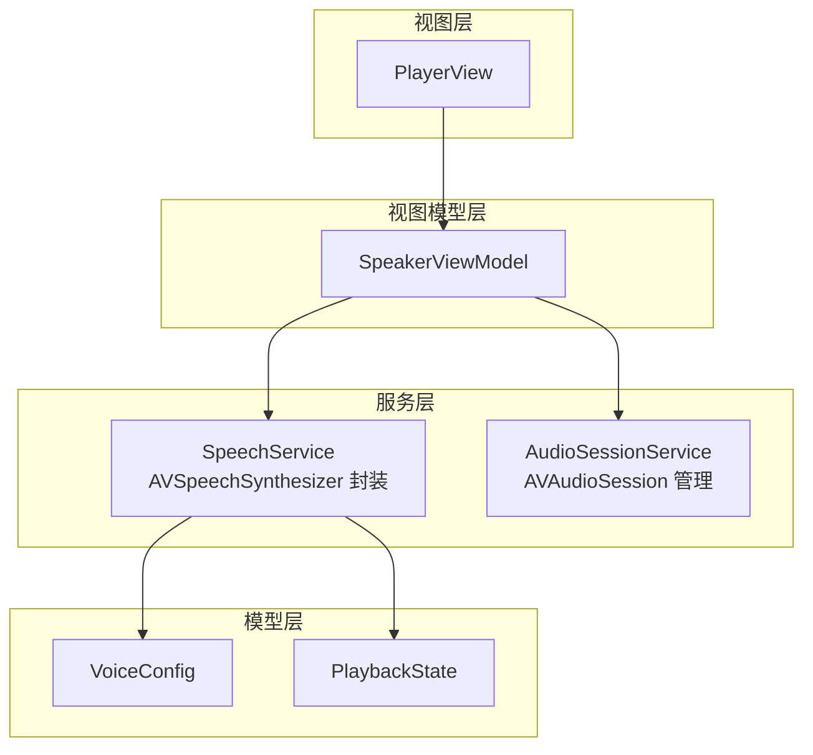
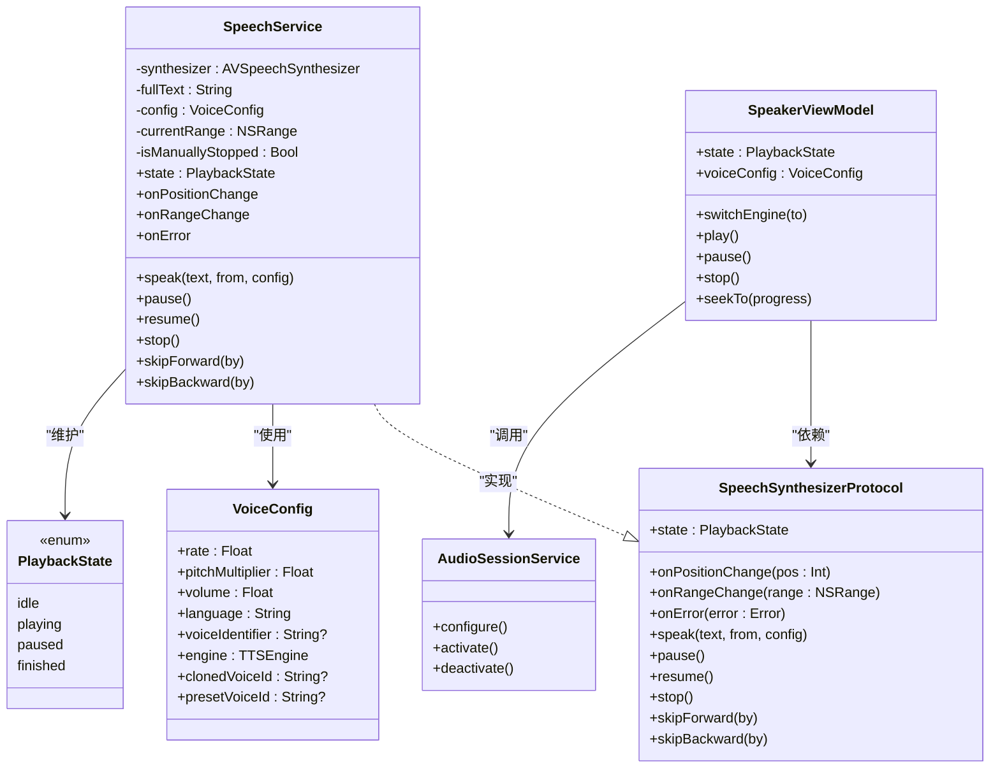
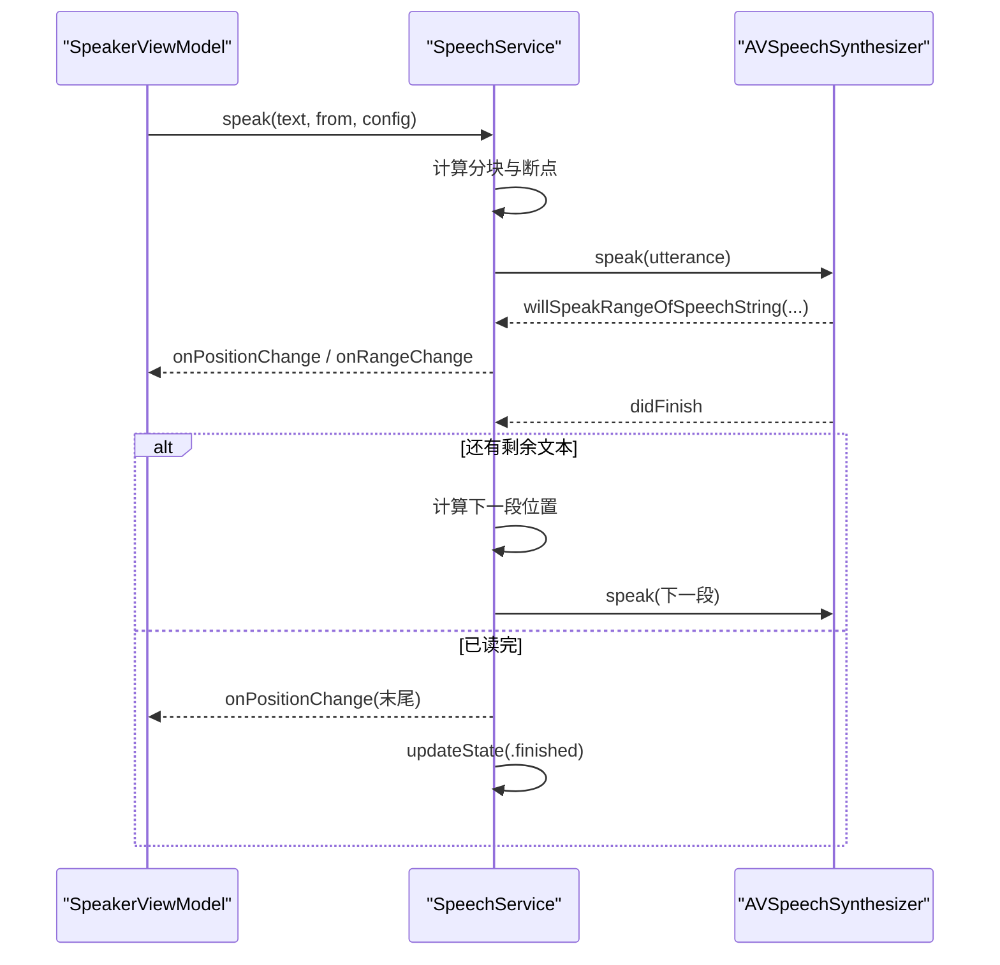
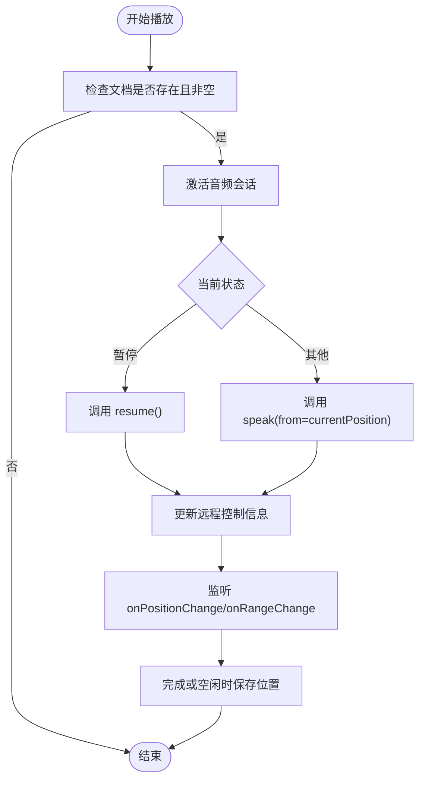
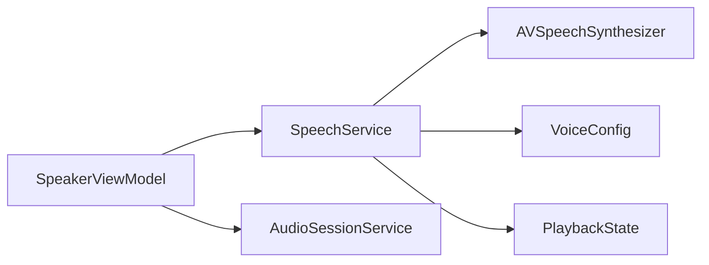

# 系统语音合成服务

<cite>
**本文引用的文件**   
- [SpeechService.swift](file://Services/SpeechService.swift)
- [SpeechSynthesizerProtocol.swift](file://Services/SpeechSynthesizerProtocol.swift)
- [VoiceConfig.swift](file://Models/VoiceConfig.swift)
- [PlaybackState.swift](file://Models/PlaybackState.swift)
- [AudioSessionService.swift](file://Services/AudioSessionService.swift)
- [SpeakerViewModel.swift](file://ViewModels/SpeakerViewModel.swift)
- [PlayerView.swift](file://Views/PlayerView.swift)
</cite>

## 目录
1. [简介](#简介)
2. [项目结构](#项目结构)
3. [核心组件](#核心组件)
4. [架构总览](#架构总览)
5. [详细组件分析](#详细组件分析)
6. [依赖关系分析](#依赖关系分析)
7. [性能与优化建议](#性能与优化建议)
8. [故障排查指南](#故障排查指南)
9. [结论](#结论)
10. [附录：使用示例与集成步骤](#附录使用示例与集成步骤)

## 简介
本文件面向 iOS 应用中的“系统语音合成服务”，聚焦于基于 AVSpeechSynthesizer 的 SpeechService 实现。文档将说明服务的初始化、配置项、生命周期管理，以及与 SpeechSynthesizerProtocol 的关系（状态、进度回调、错误处理）。同时提供在应用中集成与使用的参考路径，并给出性能优化与常见问题解决方案。

## 项目结构
围绕语音合成的关键代码分布在 Services、Models、ViewModels 与 Views 层：
- Services：SpeechService（系统 TTS 实现）、AudioSessionService（音频会话统一管理）
- Models：VoiceConfig（语音配置）、PlaybackState（播放状态）
- ViewModels：SpeakerViewModel（对外门面，协调引擎切换、UI 绑定、远程控制等）
- Views：PlayerView（播放器界面，展示高亮文本与播放控制）

图表来源
- [SpeechService.swift:1-155](file://Services/SpeechService.swift#L1-L155)
- [AudioSessionService.swift:1-46](file://Services/AudioSessionService.swift#L1-L46)
- [SpeakerViewModel.swift:1-314](file://ViewModels/SpeakerViewModel.swift#L1-L314)
- [VoiceConfig.swift:1-52](file://Models/VoiceConfig.swift#L1-L52)
- [PlaybackState.swift:1-9](file://Models/PlaybackState.swift#L1-L9)
- [PlayerView.swift:1-174](file://Views/PlayerView.swift#L1-L174)

章节来源
- [SpeechService.swift:1-155](file://Services/SpeechService.swift#L1-L155)
- [AudioSessionService.swift:1-46](file://Services/AudioSessionService.swift#L1-L46)
- [SpeakerViewModel.swift:1-314](file://ViewModels/SpeakerViewModel.swift#L1-L314)
- [VoiceConfig.swift:1-52](file://Models/VoiceConfig.swift#L1-L52)
- [PlaybackState.swift:1-9](file://Models/PlaybackState.swift#L1-L9)
- [PlayerView.swift:1-174](file://Views/PlayerView.swift#L1-L174)

## 核心组件
- SpeechService：基于 AVSpeechSynthesizer 的系统语音合成实现，负责分块朗读、断句优化、暂停/继续/停止、快进/后退、位置与范围回调、错误回调等。
- SpeechSynthesizerProtocol：抽象协议，屏蔽具体引擎差异，便于单元测试与多引擎切换。
- VoiceConfig：语音参数（语速、音高、音量、语言、引擎选择、克隆/预设音色 ID 等）。
- PlaybackState：统一的状态枚举（空闲、播放中、暂停、完成）。
- AudioSessionService：集中管理 AVAudioSession 的配置、激活与停用，确保后台播放、蓝牙与 AirPlay 支持。
- SpeakerViewModel：门面类，聚合多个子组件，暴露统一的 UI 绑定接口，处理引擎切换、错误降级、远程控制同步等。

章节来源
- [SpeechService.swift:1-155](file://Services/SpeechService.swift#L1-L155)
- [SpeechSynthesizerProtocol.swift:1-20](file://Services/SpeechSynthesizerProtocol.swift#L1-L20)
- [VoiceConfig.swift:1-52](file://Models/VoiceConfig.swift#L1-L52)
- [PlaybackState.swift:1-9](file://Models/PlaybackState.swift#L1-L9)
- [AudioSessionService.swift:1-46](file://Services/AudioSessionService.swift#L1-L46)
- [SpeakerViewModel.swift:1-314](file://ViewModels/SpeakerViewModel.swift#L1-L314)

## 架构总览
系统采用“协议 + 具体实现”的分层设计：
- 上层通过 SpeechSynthesizerProtocol 与具体引擎解耦；
- SpeakerViewModel 作为门面，负责 UI 绑定、引擎切换、错误降级、远程控制同步；
- SpeechService 内部使用 AVSpeechSynthesizer 进行实际合成，并通过代理回调更新状态与进度；
- AudioSessionService 统一处理音频会话，避免在多处重复配置。

图表来源
- [SpeechSynthesizerProtocol.swift:1-20](file://Services/SpeechSynthesizerProtocol.swift#L1-L20)
- [SpeechService.swift:1-155](file://Services/SpeechService.swift#L1-L155)
- [VoiceConfig.swift:1-52](file://Models/VoiceConfig.swift#L1-L52)
- [PlaybackState.swift:1-9](file://Models/PlaybackState.swift#L1-L9)
- [AudioSessionService.swift:1-46](file://Services/AudioSessionService.swift#L1-L46)
- [SpeakerViewModel.swift:1-314](file://ViewModels/SpeakerViewModel.swift#L1-L314)

## 详细组件分析

### SpeechService：系统语音合成实现
- 初始化与生命周期
  - 构造时设置 AVSpeechSynthesizer 的代理为自身；析构时清理代理并立即停止合成，防止资源泄漏。
- 配置与分块策略
  - speak(text, from, config) 接收全文与起始位置，按最大长度切块，并在自然断点（句号、换行等）附近寻找更自然的截断点，提升听感连贯性。
  - 根据 VoiceConfig 设置语速、音高、音量与语音标识符或语言。
- 播放控制
  - pause/resume/stop 分别对应暂停、继续与立即停止；内部维护 isManuallyStopped 标记以区分用户主动停止与自动结束。
  - skipForward/skipBackward 基于字符速率估算跳转位置，停止当前合成后从新位置继续。
- 状态与进度回调
  - 通过 onPositionChange/onRangeChange 向外部推送当前位置与当前朗读范围（绝对位置），用于 UI 高亮与进度条更新。
  - 通过 onError 上报不可恢复错误，供上层做降级处理。
- 代理回调
  - didFinish：若未手动停止，则计算下一段起始位置，继续朗读剩余内容；到达末尾时触发完成状态。
  - willSpeakRangeOfSpeechString：实时推送即将朗读的字符范围，驱动 UI 高亮跟随。
  - didCancel：静默处理取消事件，避免干扰。

图表来源
- [SpeechService.swift:30-72](file://Services/SpeechService.swift#L30-L72)
- [SpeechService.swift:118-143](file://Services/SpeechService.swift#L118-L143)

章节来源
- [SpeechService.swift:1-155](file://Services/SpeechService.swift#L1-L155)

### SpeechSynthesizerProtocol：抽象与可测试性
- 定义统一的播放接口与回调，屏蔽底层引擎差异（系统 TTS 与未来 AI 引擎）。
- 暴露 state、onPositionChange、onRangeChange、onError 等属性，便于上层订阅与 Mock。

章节来源
- [SpeechSynthesizerProtocol.swift:1-20](file://Services/SpeechSynthesizerProtocol.swift#L1-L20)

### VoiceConfig：语音配置
- 包含语速、音高、音量、语言、可选 voiceIdentifier、引擎类型、克隆/预设音色 ID 等。
- 提供默认配置与常用语速档位，便于快速切换体验。

章节来源
- [VoiceConfig.swift:1-52](file://Models/VoiceConfig.swift#L1-L52)

### PlaybackState：播放状态
- 统一状态机：idle、playing、paused、finished，配合定时器轮询与代理回调更新。

章节来源
- [PlaybackState.swift:1-9](file://Models/PlaybackState.swift#L1-L9)

### AudioSessionService：音频会话管理
- 单例模式，集中配置 AVAudioSession 为 playback/spokenAudio，允许蓝牙与 AirPlay。
- 提供 activate/deactivate 方法，由上层在开始/停止播放时调用，避免重复配置与冲突。

章节来源
- [AudioSessionService.swift:1-46](file://Services/AudioSessionService.swift#L1-L46)

### SpeakerViewModel：门面与编排
- 依赖注入：可注入自定义 SpeechSynthesizerProtocol 实现，便于单元测试。
- 引擎切换：根据 TTSEngine 切换至系统或 AI 引擎，并在切换后保持播放连续性。
- 错误降级：当 AI 引擎报错时，自动降级到系统 TTS，并重新绑定回调。
- 播放控制：封装 play/pause/stop/replay/seek/skip 等操作，并与 NowPlayingService 同步远程控制。
- UI 绑定：通过 onPositionChange/onRangeChange 更新进度、时间文本与高亮范围；通过 Timer 轮询 state 变化持久化位置。

图表来源
- [SpeakerViewModel.swift:108-137](file://ViewModels/SpeakerViewModel.swift#L108-L137)
- [SpeakerViewModel.swift:215-266](file://ViewModels/SpeakerViewModel.swift#L215-L266)

章节来源
- [SpeakerViewModel.swift:1-314](file://ViewModels/SpeakerViewModel.swift#L1-L314)

### PlayerView：UI 集成示例
- 通过 @ObservedObject 绑定 SpeakerViewModel，展示文档信息、高亮文本区域与播放控件。
- 利用 highlightRange 对当前朗读范围进行富文本高亮，并自动滚动到可视区域。
- 进度条与时间显示与 ViewModel 的 progress/currentPositionText 双向绑定。

章节来源
- [PlayerView.swift:1-174](file://Views/PlayerView.swift#L1-L174)

## 依赖关系分析
- 耦合与内聚
  - SpeechService 仅依赖 AVFoundation 与模型层，职责单一，内聚度高。
  - SpeakerViewModel 聚合多个服务，承担编排与 UI 绑定职责，属于门面模式。
- 直接/间接依赖
  - SpeechService 直接依赖 AVSpeechSynthesizer 与 AVSpeechSynthesisVoice。
  - SpeakerViewModel 间接依赖 AudioSessionService、NowPlayingService、ErrorHandler。
- 外部集成点
  - AVAudioSession 全局音频会话，影响后台播放、蓝牙与 AirPlay。
  - 系统级远程控制（锁屏、耳机按键）通过 NowPlayingService 与 ViewModel 联动。

图表来源
- [SpeakerViewModel.swift:1-314](file://ViewModels/SpeakerViewModel.swift#L1-L314)
- [SpeechService.swift:1-155](file://Services/SpeechService.swift#L1-L155)
- [AudioSessionService.swift:1-46](file://Services/AudioSessionService.swift#L1-L46)
- [VoiceConfig.swift:1-52](file://Models/VoiceConfig.swift#L1-L52)
- [PlaybackState.swift:1-9](file://Models/PlaybackState.swift#L1-L9)

章节来源
- [SpeakerViewModel.swift:1-314](file://ViewModels/SpeakerViewModel.swift#L1-L314)
- [SpeechService.swift:1-155](file://Services/SpeechService.swift#L1-L155)
- [AudioSessionService.swift:1-46](file://Services/AudioSessionService.swift#L1-L46)
- [VoiceConfig.swift:1-52](file://Models/VoiceConfig.swift#L1-L52)
- [PlaybackState.swift:1-9](file://Models/PlaybackState.swift#L1-L9)

## 性能与优化建议
- 合理分块与断句
  - 当前实现按固定上限切块并在标点处寻找自然断点，有助于减少卡顿与提升连贯性。建议在超长文本场景下进一步评估分块大小与断点搜索窗口，平衡延迟与流畅度。
- 主线程回调与异步调度
  - 回调均在主线程派发，避免 UI 更新竞态。对于大量文本的高亮渲染，建议使用增量更新与懒加载，避免一次性重绘。
- 音频会话复用
  - 通过 AudioSessionService 统一配置与激活，避免重复 setCategory 带来的抖动。
- 引擎切换平滑过渡
  - 切换引擎时先 stop 再延时短暂间隔后重新 speak，可减少中断导致的异常。可根据设备性能调整延时时长。
- 内存与对象生命周期
  - 在 deinit 中清理代理并停止合成，防止循环引用与后台残留任务。
- 跳过与定位
  - skipForward/skipBackward 基于字符速率估算，适合粗略跳转。如需精确跳转，可结合系统 API 获取更细粒度的时间戳映射。

[本节为通用指导，不直接分析具体文件]

## 故障排查指南
- 无声音或无法后台播放
  - 确认 AudioSessionService.activate() 已在播放前调用，且 category 设置为 playback/spokenAudio。
  - 检查是否被系统静音或媒体音量过低。
- 切换引擎后无响应
  - 确认 switchEngine 后已重新 setupBindings，且在切换时正确 stop 并延时后再 speak。
- 高亮不同步或闪烁
  - 检查 onRangeChange 的派发频率与 UI 渲染逻辑，避免频繁重建 AttributedString。
- 错误与降级
  - 当 AI 引擎返回错误时，应自动降级到系统 TTS 并重新绑定回调；观察 onError 回调是否触发以及降级流程是否正确执行。
- 远程控制不一致
  - 核对 NowPlayingService 的 onPlayPause/onSkipForward/onSkipBackward 是否与 ViewModel 的 togglePlayPause/skipForward/skipBackward 正确绑定。

章节来源
- [AudioSessionService.swift:14-44](file://Services/AudioSessionService.swift#L14-L44)
- [SpeakerViewModel.swift:57-77](file://ViewModels/SpeakerViewModel.swift#L57-L77)
- [SpeakerViewModel.swift:215-266](file://ViewModels/SpeakerViewModel.swift#L215-L266)

## 结论
SpeechService 以简洁清晰的职责划分与稳定的回调机制，提供了可靠的系统语音合成功能。通过 SpeechSynthesizerProtocol 的抽象与 SpeakerViewModel 的门面编排，系统在可测试性、可扩展性与用户体验方面取得了良好平衡。配合 AudioSessionService 的会话管理与 UI 层的实时高亮，整体方案具备较强的工程实践价值。

[本节为总结，不直接分析具体文件]

## 附录：使用示例与集成步骤
- 基本集成
  - 在应用启动或进入播放页面前，调用 AudioSessionService.shared.configure()/activate()。
  - 创建或注入 SpeakerViewModel，并将当前文档传入 loadDocument。
  - 调用 togglePlayPause/play 开始播放，stop 停止播放。
- 播放控制
  - 使用 seekTo(progress) 跳转到指定百分比位置；使用 skipForward/skipBackward 进行快进/后退。
- 引擎与音色
  - 通过 switchEngine(to:) 在系统 TTS 与 AI 引擎间切换；在 VoiceSelectView 中选择预设或克隆音色并应用到 VoiceConfig。
- UI 绑定
  - 在 PlayerView 中绑定 speakerVM.state、progress、highlightRange 等属性，实现进度条、时间显示与文本高亮。
- 错误处理
  - 监听 onError 回调，必要时降级到系统 TTS 并提示用户。

章节来源
- [SpeakerViewModel.swift:81-137](file://ViewModels/SpeakerViewModel.swift#L81-L137)
- [PlayerView.swift:104-151](file://Views/PlayerView.swift#L104-L151)
- [VoiceSelectView.swift:143-163](file://Views/VoiceSelectView.swift#L143-L163)