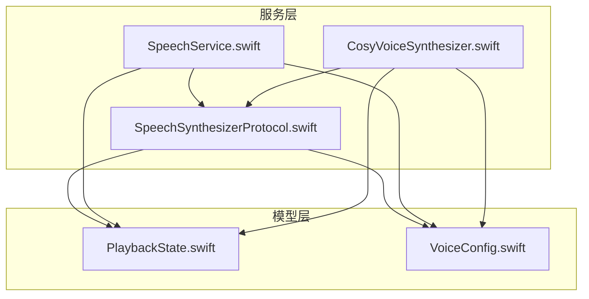
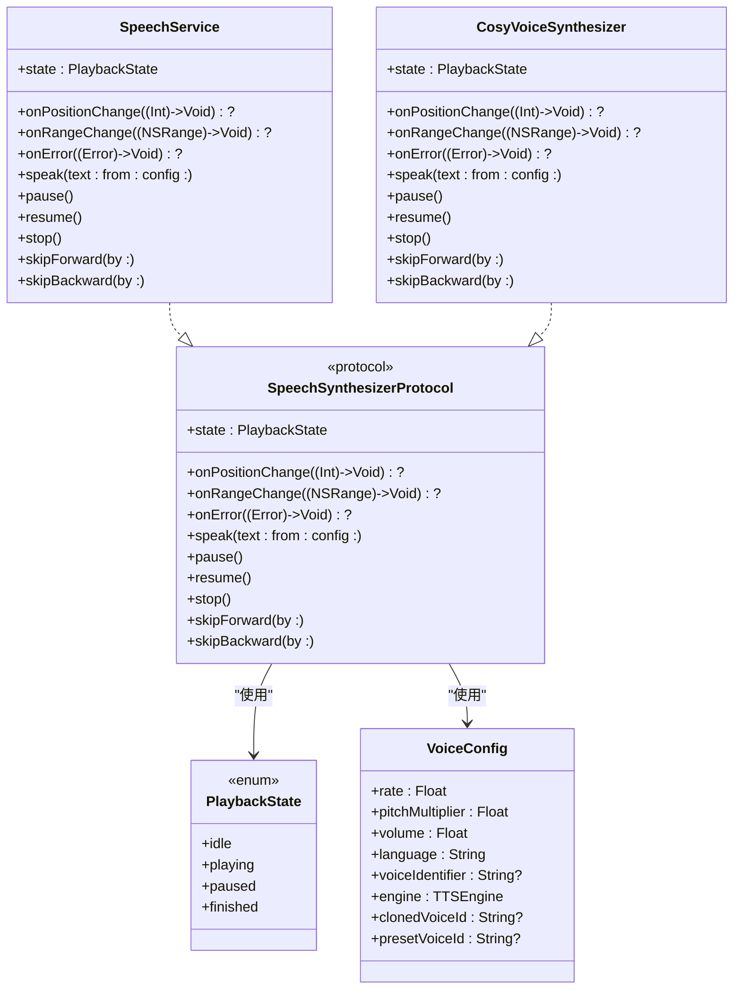
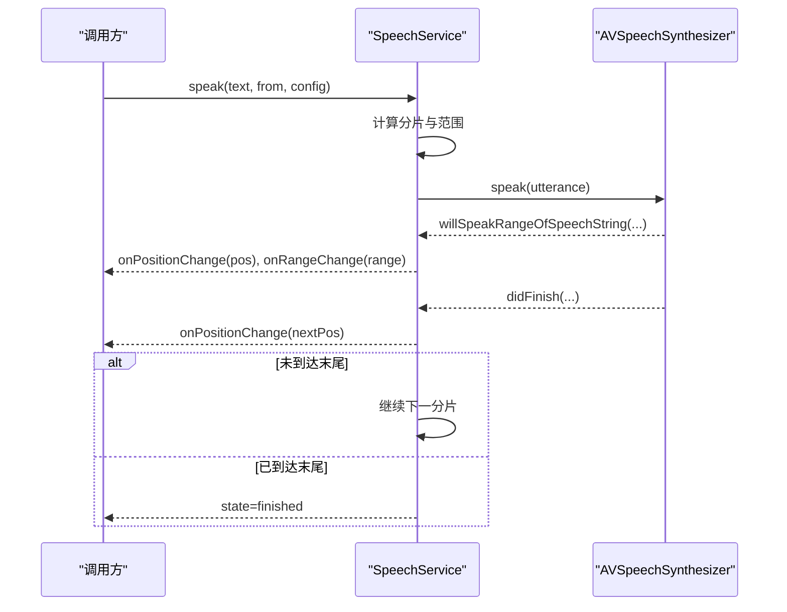
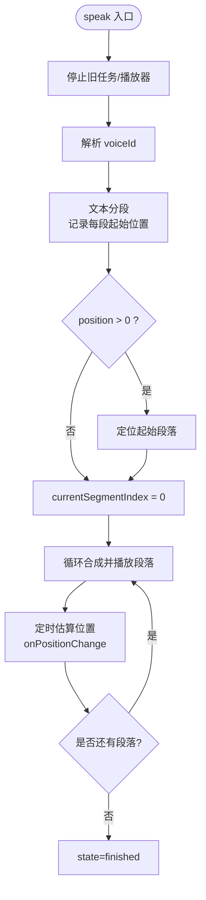
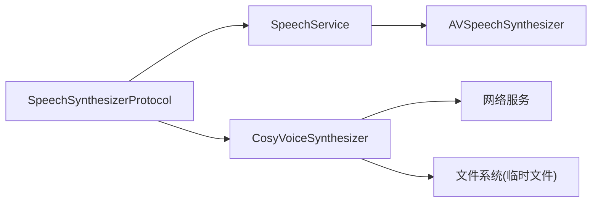

# 语音合成协议抽象

<cite>
**本文引用的文件**   
- [SpeechSynthesizerProtocol.swift](file://Services/SpeechSynthesizerProtocol.swift)
- [CosyVoiceSynthesizer.swift](file://Services/CosyVoiceSynthesizer.swift)
- [SpeechService.swift](file://Services/SpeechService.swift)
- [PlaybackState.swift](file://Models/PlaybackState.swift)
- [VoiceConfig.swift](file://Models/VoiceConfig.swift)
</cite>

## 目录
1. [简介](#简介)
2. [项目结构](#项目结构)
3. [核心组件](#核心组件)
4. [架构总览](#架构总览)
5. [详细组件分析](#详细组件分析)
6. [依赖关系分析](#依赖关系分析)
7. [性能与行为特性](#性能与行为特性)
8. [故障排查指南](#故障排查指南)
9. [结论](#结论)
10. [附录：扩展新引擎开发指南](#附录扩展新引擎开发指南)

## 简介
本文件围绕 SpeechSynthesizerProtocol 协议，系统化阐述其设计理念、统一抽象方式以及各属性与方法的行为语义。该协议将不同语音引擎（系统 TTS、云端 AI 语音等）的调用方式统一为一致的接口，便于上层业务以相同的方式控制播放、进度跟踪与错误处理，同时支持单元测试与多引擎切换。

## 项目结构
与协议相关的代码主要分布在 Services 与 Models 两个模块中：
- Services：定义协议及具体实现（系统 TTS 与 CosyVoice 适配器）
- Models：定义播放状态枚举与语音配置结构体

图表来源
- [SpeechSynthesizerProtocol.swift:1-20](file://Services/SpeechSynthesizerProtocol.swift#L1-L20)
- [SpeechService.swift:1-155](file://Services/SpeechService.swift#L1-L155)
- [CosyVoiceSynthesizer.swift:1-258](file://Services/CosyVoiceSynthesizer.swift#L1-L258)
- [PlaybackState.swift:1-9](file://Models/PlaybackState.swift#L1-L9)
- [VoiceConfig.swift:1-52](file://Models/VoiceConfig.swift#L1-L52)

章节来源
- [SpeechSynthesizerProtocol.swift:1-20](file://Services/SpeechSynthesizerProtocol.swift#L1-L20)
- [SpeechService.swift:1-155](file://Services/SpeechService.swift#L1-L155)
- [CosyVoiceSynthesizer.swift:1-258](file://Services/CosyVoiceSynthesizer.swift#L1-L258)
- [PlaybackState.swift:1-9](file://Models/PlaybackState.swift#L1-L9)
- [VoiceConfig.swift:1-52](file://Models/VoiceConfig.swift#L1-L52)

## 核心组件
- 协议：SpeechSynthesizerProtocol
  - 职责：统一对外暴露的语音合成能力，屏蔽底层引擎差异
  - 关键属性：state、onPositionChange、onRangeChange、onError
  - 关键方法：speak、pause、resume、stop、skipForward、skipBackward
- 系统实现：SpeechService（基于 AVSpeechSynthesizer）
- 云端实现：CosyVoiceSynthesizer（基于 HTTP API + AVAudioPlayer）
- 数据模型：PlaybackState、VoiceConfig

章节来源
- [SpeechSynthesizerProtocol.swift:1-20](file://Services/SpeechSynthesizerProtocol.swift#L1-L20)
- [SpeechService.swift:1-155](file://Services/SpeechService.swift#L1-L155)
- [CosyVoiceSynthesizer.swift:1-258](file://Services/CosyVoiceSynthesizer.swift#L1-L258)
- [PlaybackState.swift:1-9](file://Models/PlaybackState.swift#L1-L9)
- [VoiceConfig.swift:1-52](file://Models/VoiceConfig.swift#L1-L52)

## 架构总览
协议作为“契约”，上层通过它驱动任意引擎；具体引擎负责内部细节（网络、音频解码、分段策略等），并通过回调向上传播状态与进度。

图表来源
- [SpeechSynthesizerProtocol.swift:1-20](file://Services/SpeechSynthesizerProtocol.swift#L1-L20)
- [SpeechService.swift:1-155](file://Services/SpeechService.swift#L1-L155)
- [CosyVoiceSynthesizer.swift:1-258](file://Services/CosyVoiceSynthesizer.swift#L1-L258)
- [PlaybackState.swift:1-9](file://Models/PlaybackState.swift#L1-L9)
- [VoiceConfig.swift:1-52](file://Models/VoiceConfig.swift#L1-L52)

## 详细组件分析

### 协议设计核心理念
- 统一抽象：无论底层是系统 TTS 还是云端合成，上层都以同一套接口进行控制与监听
- 状态驱动：state 提供全局播放状态，配合 onPositionChange/onRangeChange 完成 UI 同步
- 错误可降级：onError 用于上报不可恢复错误，上层可据此切换到备用引擎或提示用户
- 参数化配置：VoiceConfig 集中管理语速、音高、音量、语言、音色标识等，避免散落的参数

章节来源
- [SpeechSynthesizerProtocol.swift:1-20](file://Services/SpeechSynthesizerProtocol.swift#L1-L20)
- [VoiceConfig.swift:1-52](file://Models/VoiceConfig.swift#L1-L52)

### 属性详解
- state: PlaybackState
  - 用途：获取当前播放状态（空闲、播放中、暂停、结束）
  - 线程安全：实现类通常在主线程更新，UI 可直接读取
- onPositionChange: ((Int) -> Void)?
  - 用途：全文绝对位置变化回调，单位通常为字符索引
  - 触发时机：开始播放、跳进/跳出、每段起始、定时估算等
- onRangeChange: ((NSRange) -> Void)?
  - 用途：当前朗读片段在全文中的范围（location, length）
  - 适用场景：高亮当前句段、滚动到对应行
- onError: ((Error) -> Void)?
  - 用途：上报不可恢复错误（如网络失败、解码异常）
  - 建议：上层收到后执行降级逻辑（例如切回系统 TTS）

章节来源
- [SpeechSynthesizerProtocol.swift:1-20](file://Services/SpeechSynthesizerProtocol.swift#L1-L20)
- [SpeechService.swift:1-155](file://Services/SpeechService.swift#L1-L155)
- [CosyVoiceSynthesizer.swift:1-258](file://Services/CosyVoiceSynthesizer.swift#L1-L258)

### 方法详解
- speak(text: String, from position: Int, config: VoiceConfig)
  - 作用：从指定位置开始合成并播放文本
  - 参数说明：
    - text：待合成的完整文本
    - position：从第几个字符开始（默认 0）
    - config：语音配置（语速、音高、音量、语言、引擎选择等）
  - 返回值：无
  - 行为约定：
    - 若 position 超出文本长度，应直接结束
    - 内部可能按自然断点分片，逐段合成/播放
    - 完成后将 state 置为 finished，并触发相应回调
- pause()
  - 作用：暂停当前播放
  - 行为约定：state 变为 paused；再次 resume 可从当前位置继续
- resume()
  - 作用：恢复播放
  - 行为约定：state 变为 playing
- stop()
  - 作用：停止播放并清理资源
  - 行为约定：state 回到 idle；取消未完成的合成任务
- skipForward(by seconds: TimeInterval)
  - 作用：向前跳转指定秒数
  - 行为约定：根据引擎能力调整播放位置，并估算新的字符位置，触发 onPositionChange
- skipBackward(by seconds: TimeInterval)
  - 作用：向后跳转指定秒数
  - 行为约定：同上

章节来源
- [SpeechSynthesizerProtocol.swift:1-20](file://Services/SpeechSynthesizerProtocol.swift#L1-L20)
- [SpeechService.swift:1-155](file://Services/SpeechService.swift#L1-L155)
- [CosyVoiceSynthesizer.swift:1-258](file://Services/CosyVoiceSynthesizer.swift#L1-L258)

### 系统实现：SpeechService（系统 TTS）
- 特点
  - 基于 AVSpeechSynthesizer，离线可用
  - 自动按标点/换行进行分片，保证语义连贯
  - 通过代理回调精确推进位置与范围
- 关键流程
  - speak：计算剩余长度与分片长度，设置 utterance 参数并启动
  - pause/resume/stop：委托给系统合成器
  - skipForward/skipBackward：按每秒约固定字符数估算跳转位置，重新 speak
  - 代理回调：更新 state、onPositionChange、onRangeChange

图表来源
- [SpeechService.swift:1-155](file://Services/SpeechService.swift#L1-L155)

章节来源
- [SpeechService.swift:1-155](file://Services/SpeechService.swift#L1-L155)

### 云端实现：CosyVoiceSynthesizer（HTTP 合成 + 本地播放）
- 特点
  - 通过 HTTP 接口合成音频，落盘后由 AVAudioPlayer 播放
  - 长文本自动分段（最大 500 字符），维护每段在全文的起始位置
  - 错误时触发 onError，并可由上层做降级
- 关键流程
  - speak：解析 voiceId、分段、定位起始段落、进入 .playing 并开始合成
  - 合成与播放：逐个段落请求合成，写入临时文件并播放；播放期间定时估算位置并回调
  - 跳过：直接修改播放器时间，再估算位置并回调
  - 停止：取消合成任务、停止播放器、重置状态

图表来源
- [CosyVoiceSynthesizer.swift:1-258](file://Services/CosyVoiceSynthesizer.swift#L1-L258)

章节来源
- [CosyVoiceSynthesizer.swift:1-258](file://Services/CosyVoiceSynthesizer.swift#L1-L258)

### 状态与配置模型
- PlaybackState
  - 值域：idle、playing、paused、finished
  - 用途：驱动 UI 按钮状态、进度条、高亮等
- VoiceConfig
  - 字段：rate、pitchMultiplier、volume、language、voiceIdentifier、engine、clonedVoiceId、presetVoiceId
  - 用途：统一传入引擎，决定发音风格与目标引擎

章节来源
- [PlaybackState.swift:1-9](file://Models/PlaybackState.swift#L1-L9)
- [VoiceConfig.swift:1-52](file://Models/VoiceConfig.swift#L1-L52)

## 依赖关系分析
- 耦合与内聚
  - 协议与实现解耦：上层仅依赖协议，不感知具体引擎
  - 实现类各自内聚：系统实现专注 AVSpeechSynthesizer，云端实现专注网络与播放器
- 外部依赖
  - 系统实现依赖 AVFoundation
  - 云端实现依赖网络服务与文件系统（临时文件）
- 可能的循环依赖
  - 当前结构未见循环引用，协议位于最顶层，被多个实现依赖

图表来源
- [SpeechSynthesizerProtocol.swift:1-20](file://Services/SpeechSynthesizerProtocol.swift#L1-L20)
- [SpeechService.swift:1-155](file://Services/SpeechService.swift#L1-L155)
- [CosyVoiceSynthesizer.swift:1-258](file://Services/CosyVoiceSynthesizer.swift#L1-L258)

章节来源
- [SpeechSynthesizerProtocol.swift:1-20](file://Services/SpeechSynthesizerProtocol.swift#L1-L20)
- [SpeechService.swift:1-155](file://Services/SpeechService.swift#L1-L155)
- [CosyVoiceSynthesizer.swift:1-258](file://Services/CosyVoiceSynthesizer.swift#L1-L258)

## 性能与行为特性
- 分段策略
  - 系统实现：优先在标点/换行处截断，提升可读性与连贯性
  - 云端实现：固定最大长度（如 500 字符），尽量在自然断点处分割
- 进度估算
  - 系统实现：基于代理回调精确推进
  - 云端实现：基于播放时长与经验系数估算字符位置
- 资源管理
  - 停止时需取消合成任务、释放播放器、清理临时文件
- 线程模型
  - 建议在主线程更新 state 与回调，确保 UI 一致性

[本节为通用指导，无需特定文件来源]

## 故障排查指南
- 常见问题
  - 进度不更新：检查 onPositionChange 是否在正确线程回调；云端实现需确认定时器与播放器事件
  - 无法跳转：确认 skipForward/skipBackward 是否更新了播放器时间并触发了位置回调
  - 错误未降级：确认 onError 是否被上层订阅，并在收到错误后执行降级逻辑
- 调试建议
  - 打印 state 变化序列与回调触发顺序
  - 对云端实现，记录网络请求与临时文件路径，验证音频加载成功

章节来源
- [SpeechService.swift:1-155](file://Services/SpeechService.swift#L1-L155)
- [CosyVoiceSynthesizer.swift:1-258](file://Services/CosyVoiceSynthesizer.swift#L1-L258)

## 结论
SpeechSynthesizerProtocol 通过统一的抽象接口，屏蔽了系统 TTS 与云端合成之间的差异，提供了稳定的状态与进度反馈机制。上层只需面向协议编程，即可灵活切换引擎、实现降级策略，并获得一致的用户体验。

[本节为总结，无需特定文件来源]

## 附录：扩展新引擎开发指南
- 步骤概览
  1) 新建一个类，遵循 SpeechSynthesizerProtocol
  2) 实现 state 与三个回调属性（onPositionChange、onRangeChange、onError）
  3) 实现 speak/pause/resume/stop/skipForward/skipBackward 等方法
  4) 在 speak 中按需要分段、合成/播放，并持续推送位置与范围回调
  5) 在错误路径上调用 onError，供上层降级
- 参考实现
  - 系统实现：SpeechService（基于 AVSpeechSynthesizer）
  - 云端实现：CosyVoiceSynthesizer（基于 HTTP + AVAudioPlayer）
- 最佳实践
  - 保持 state 与回调在主线程更新
  - 合理分段，兼顾语义与性能
  - 明确 skip 行为的精度与边界条件
  - 做好资源清理与任务取消

章节来源
- [SpeechSynthesizerProtocol.swift:1-20](file://Services/SpeechSynthesizerProtocol.swift#L1-L20)
- [SpeechService.swift:1-155](file://Services/SpeechService.swift#L1-L155)
- [CosyVoiceSynthesizer.swift:1-258](file://Services/CosyVoiceSynthesizer.swift#L1-L258)