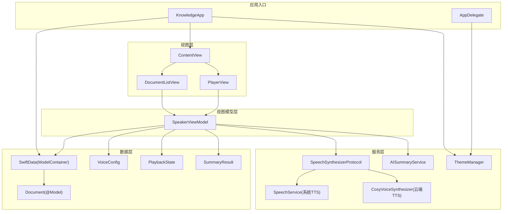
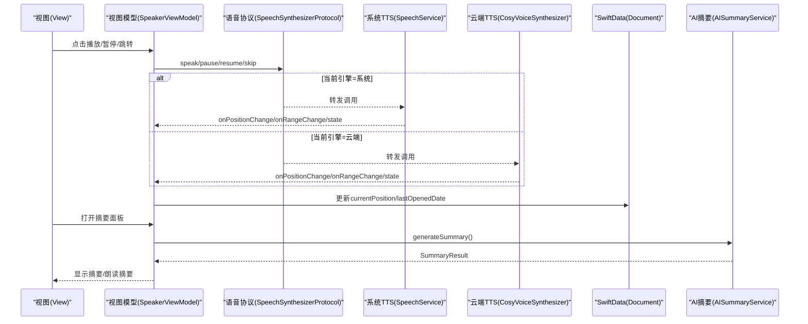
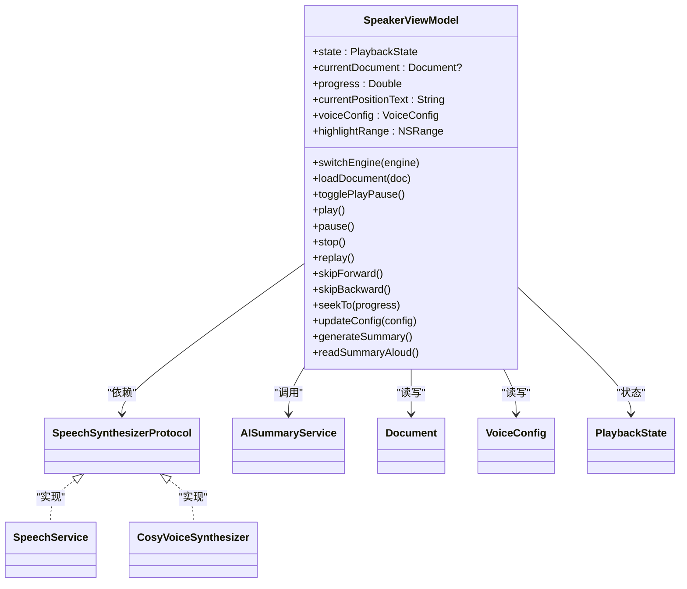
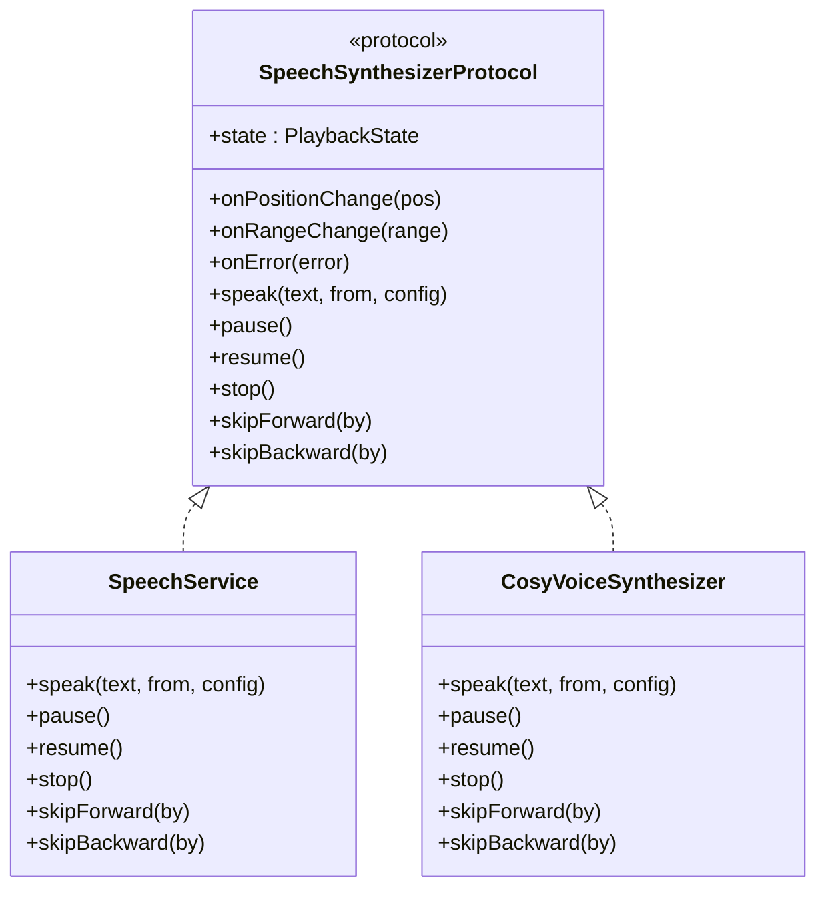
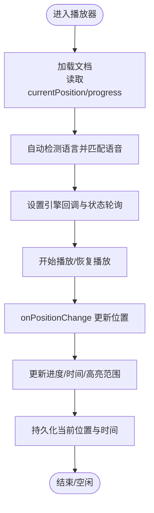
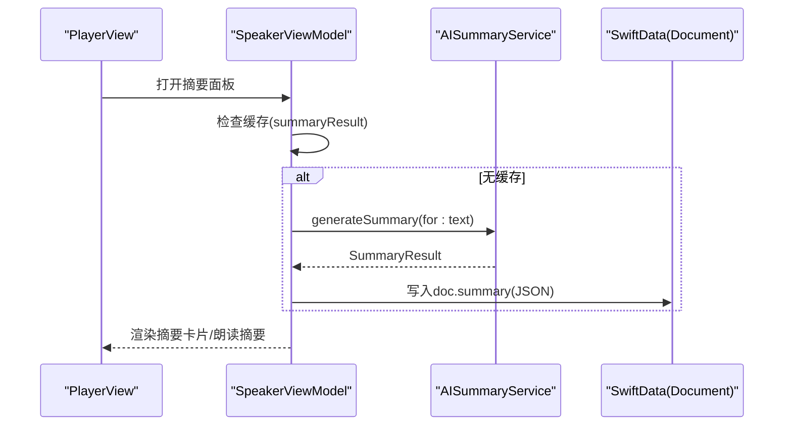
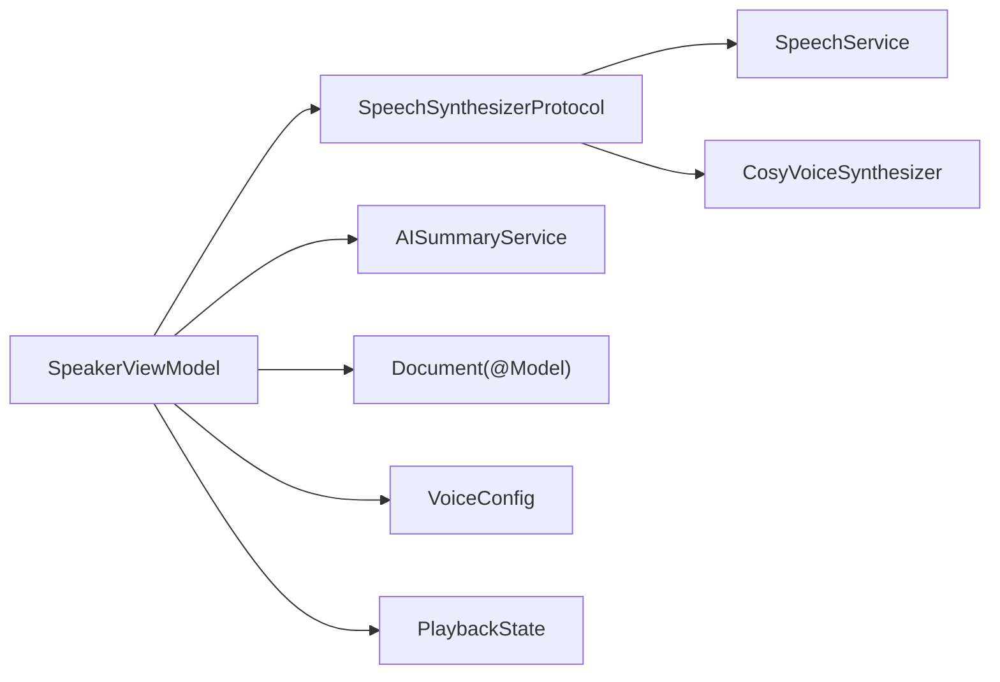

# 架构设计

<cite>
**本文引用的文件**
- [KnowledgeApp.swift](file://App/KnowledgeApp.swift)
- [AppDelegate.swift](file://App/AppDelegate.swift)
- [SpeakerViewModel.swift](file://ViewModels/SpeakerViewModel.swift)
- [SpeechSynthesizerProtocol.swift](file://Services/SpeechSynthesizerProtocol.swift)
- [SpeechService.swift](file://Services/SpeechService.swift)
- [CosyVoiceSynthesizer.swift](file://Services/CosyVoiceSynthesizer.swift)
- [Document.swift](file://Models/Document.swift)
- [PlaybackState.swift](file://Models/PlaybackState.swift)
- [VoiceConfig.swift](file://Models/VoiceConfig.swift)
- [AISummaryService.swift](file://Services/AISummaryService.swift)
- [SummaryResult.swift](file://Models/SummaryResult.swift)
- [ContentView.swift](file://Views/ContentView.swift)
- [PlayerView.swift](file://Views/PlayerView.swift)
- [DocumentListView.swift](file://Views/DocumentListView.swift)
- [ThemeManager.swift](file://Services/ThemeManager.swift)
</cite>

## 目录
1. [引言](#引言)
2. [项目结构](#项目结构)
3. [核心组件](#核心组件)
4. [架构总览](#架构总览)
5. [详细组件分析](#详细组件分析)
6. [依赖关系分析](#依赖关系分析)
7. [性能与可扩展性](#性能与可扩展性)
8. [故障排查指南](#故障排查指南)
9. [结论](#结论)
10. [附录](#附录)

## 引言
本文件为 Knowledge 应用的架构设计文档，聚焦于 MVVM 模式在各层的职责划分、数据流向与服务层抽象设计。重点说明 SpeechSynthesizerProtocol 的接口如何支持多语音引擎扩展（系统 TTS 与云端 AI 语音），并阐述基于 SwiftData 的数据持久化策略与状态管理机制。文末提供架构图与交互图，帮助开发者快速理解整体设计与技术权衡。

## 项目结构
应用采用 SwiftUI + SwiftData 的现代 iOS 架构，按“视图-视图模型-服务-模型”分层组织：
- App 入口负责应用生命周期、主题与 SwiftData 容器初始化
- Views 层为纯展示与用户交互
- ViewModels 层聚合业务逻辑、协调服务与状态
- Services 层封装外部能力（TTS、AI 摘要、音频会话等）
- Models 层定义数据模型与配置

图表来源
- [KnowledgeApp.swift:1-29](file://App/KnowledgeApp.swift#L1-L29)
- [AppDelegate.swift:1-14](file://App/AppDelegate.swift#L1-L14)
- [ContentView.swift:1-98](file://Views/ContentView.swift#L1-L98)
- [PlayerView.swift:1-174](file://Views/PlayerView.swift#L1-L174)
- [DocumentListView.swift:1-147](file://Views/DocumentListView.swift#L1-L147)
- [SpeakerViewModel.swift:1-314](file://ViewModels/SpeakerViewModel.swift#L1-L314)
- [SpeechSynthesizerProtocol.swift:1-20](file://Services/SpeechSynthesizerProtocol.swift#L1-L20)
- [SpeechService.swift:1-155](file://Services/SpeechService.swift#L1-L155)
- [CosyVoiceSynthesizer.swift:1-258](file://Services/CosyVoiceSynthesizer.swift#L1-L258)
- [AISummaryService.swift:1-180](file://Services/AISummaryService.swift#L1-L180)
- [Document.swift:1-115](file://Models/Document.swift#L1-L115)
- [VoiceConfig.swift:1-52](file://Models/VoiceConfig.swift#L1-L52)
- [PlaybackState.swift:1-9](file://Models/PlaybackState.swift#L1-L9)
- [SummaryResult.swift:1-33](file://Models/SummaryResult.swift#L1-L33)
- [ThemeManager.swift:1-25](file://Services/ThemeManager.swift#L1-L25)

章节来源
- [KnowledgeApp.swift:1-29](file://App/KnowledgeApp.swift#L1-L29)
- [AppDelegate.swift:1-14](file://App/AppDelegate.swift#L1-L14)

## 核心组件
- 视图模型 SpeakerViewModel：作为门面协调播放控制、文档加载、AI 摘要生成与 UI 状态发布；通过注入的 SpeechSynthesizerProtocol 屏蔽底层引擎差异。
- 语音合成协议 SpeechSynthesizerProtocol：统一抽象播放控制、位置/范围回调与错误回调，便于替换不同引擎实现。
- 系统 TTS 实现 SpeechService：基于 AVSpeechSynthesizer，离线可用，适合稳定兜底。
- 云端 TTS 实现 CosyVoiceSynthesizer：将 HTTP 合成结果分段播放，具备自动分段、进度估算与错误降级能力。
- 数据模型 Document：使用 @Model 标注，由 SwiftData 持久化，包含文本、阅读进度、摘要与播客路径等字段。
- 配置 VoiceConfig：保存语速、音高、音量、语言、引擎选择及音色 ID 等。
- 状态 PlaybackState：统一的播放状态枚举。
- AI 摘要 AISummaryService：调用云端大模型生成结构化摘要，返回 SummaryResult。
- 主题 ThemeManager：全局主题状态管理，驱动界面明暗模式。

章节来源
- [SpeakerViewModel.swift:1-314](file://ViewModels/SpeakerViewModel.swift#L1-L314)
- [SpeechSynthesizerProtocol.swift:1-20](file://Services/SpeechSynthesizerProtocol.swift#L1-L20)
- [SpeechService.swift:1-155](file://Services/SpeechService.swift#L1-L155)
- [CosyVoiceSynthesizer.swift:1-258](file://Services/CosyVoiceSynthesizer.swift#L1-L258)
- [Document.swift:1-115](file://Models/Document.swift#L1-L115)
- [VoiceConfig.swift:1-52](file://Models/VoiceConfig.swift#L1-L52)
- [PlaybackState.swift:1-9](file://Models/PlaybackState.swift#L1-L9)
- [AISummaryService.swift:1-180](file://Services/AISummaryService.swift#L1-L180)
- [SummaryResult.swift:1-33](file://Models/SummaryResult.swift#L1-L33)
- [ThemeManager.swift:1-25](file://Services/ThemeManager.swift#L1-L25)

## 架构总览
下图展示了 MVVM 各层职责与关键交互：
- View 仅订阅 ViewModel 的 @Published 属性，不直接访问服务或数据库
- ViewModel 组合多个 Service，并通过协议隔离 TTS 引擎
- Model 由 SwiftData 管理，ViewModel 在适当时机更新持久化字段
- 主题与音频会话在应用启动时配置，按需激活

图表来源
- [SpeakerViewModel.swift:1-314](file://ViewModels/SpeakerViewModel.swift#L1-L314)
- [SpeechSynthesizerProtocol.swift:1-20](file://Services/SpeechSynthesizerProtocol.swift#L1-L20)
- [SpeechService.swift:1-155](file://Services/SpeechService.swift#L1-L155)
- [CosyVoiceSynthesizer.swift:1-258](file://Services/CosyVoiceSynthesizer.swift#L1-L258)
- [AISummaryService.swift:1-180](file://Services/AISummaryService.swift#L1-L180)
- [Document.swift:1-115](file://Models/Document.swift#L1-L115)

## 详细组件分析

### 视图层（View）
- ContentView：组装 TabView，挂载 ErrorHandler 与 ShareExtensionHandler，处理分享来源内容导入，创建并持有 SpeakerViewModel。
- PlayerView：展示文档头部信息、可滚动的高亮文本区域、进度条与控制按钮；根据 highlightRange 自动滚动与样式高亮。
- DocumentListView：列表展示文档，支持导入本地文件与网页链接，删除文档时同步停止播放。

章节来源
- [ContentView.swift:1-98](file://Views/ContentView.swift#L1-L98)
- [PlayerView.swift:1-174](file://Views/PlayerView.swift#L1-L174)
- [DocumentListView.swift:1-147](file://Views/DocumentListView.swift#L1-L147)

### 视图模型层（ViewModel）
- SpeakerViewModel：
  - 对外暴露 state、currentDocument、progress、highlightRange 等 @Published 属性供 UI 绑定
  - 通过 switchEngine 动态切换 SpeechSynthesizerProtocol 实例（系统/云端）
  - 管理播放流程：play/pause/stop/replay/skip/seekTo，并在合适时机持久化当前位置
  - 监听引擎回调 onPositionChange/onRangeChange/onError，驱动 UI 与状态
  - 集成 AI 摘要功能，缓存结果到 Document.summary
  - 维护 VoiceConfig 并持久化至 UserDefaults

图表来源
- [SpeakerViewModel.swift:1-314](file://ViewModels/SpeakerViewModel.swift#L1-L314)
- [SpeechSynthesizerProtocol.swift:1-20](file://Services/SpeechSynthesizerProtocol.swift#L1-L20)
- [SpeechService.swift:1-155](file://Services/SpeechService.swift#L1-L155)
- [CosyVoiceSynthesizer.swift:1-258](file://Services/CosyVoiceSynthesizer.swift#L1-L258)
- [AISummaryService.swift:1-180](file://Services/AISummaryService.swift#L1-L180)
- [Document.swift:1-115](file://Models/Document.swift#L1-L115)
- [VoiceConfig.swift:1-52](file://Models/VoiceConfig.swift#L1-L52)
- [PlaybackState.swift:1-9](file://Models/PlaybackState.swift#L1-L9)

章节来源
- [SpeakerViewModel.swift:1-314](file://ViewModels/SpeakerViewModel.swift#L1-L314)

### 服务层与语音引擎抽象
- SpeechSynthesizerProtocol：定义 state、onPositionChange、onRangeChange、onError 以及 speak/pause/resume/stop/skipForward/skipBackward 方法，确保上层无需关心具体引擎。
- SpeechService：基于 AVSpeechSynthesizer，按自然断点分块朗读，回调字符级位置与范围，适合离线场景。
- CosyVoiceSynthesizer：将长文本切分为段落，逐段请求云端合成并播放，内部估算字符位置以对齐 UI 高亮；发生错误时触发 onError，由上层进行降级。

图表来源
- [SpeechSynthesizerProtocol.swift:1-20](file://Services/SpeechSynthesizerProtocol.swift#L1-L20)
- [SpeechService.swift:1-155](file://Services/SpeechService.swift#L1-L155)
- [CosyVoiceSynthesizer.swift:1-258](file://Services/CosyVoiceSynthesizer.swift#L1-L258)

章节来源
- [SpeechSynthesizerProtocol.swift:1-20](file://Services/SpeechSynthesizerProtocol.swift#L1-L20)
- [SpeechService.swift:1-155](file://Services/SpeechService.swift#L1-L155)
- [CosyVoiceSynthesizer.swift:1-258](file://Services/CosyVoiceSynthesizer.swift#L1-L258)

### 数据持久化与状态管理
- SwiftData：
  - KnowledgeApp 中创建 ModelContainer 并注入到 WindowGroup，使所有视图可通过 @Environment(\.modelContext) 访问
  - Document 使用 @Model 标注，字段包括标题、文件名、类型、提取文本、当前位置、最后打开时间、收藏标记、摘要与播客路径
  - DocumentType 枚举用于类型识别与图标/颜色映射
- 状态管理：
  - PlaybackState 统一表示 idle/playing/paused/finished
  - SpeakerViewModel 通过 @Published 暴露 UI 所需状态，结合 Timer 轮询与引擎回调保持 UI 同步
  - VoiceConfig 通过 UserDefaults 持久化，记录引擎选择与参数

图表来源
- [KnowledgeApp.swift:1-29](file://App/KnowledgeApp.swift#L1-L29)
- [Document.swift:1-115](file://Models/Document.swift#L1-L115)
- [PlaybackState.swift:1-9](file://Models/PlaybackState.swift#L1-L9)
- [SpeakerViewModel.swift:1-314](file://ViewModels/SpeakerViewModel.swift#L1-L314)

章节来源
- [KnowledgeApp.swift:1-29](file://App/KnowledgeApp.swift#L1-L29)
- [Document.swift:1-115](file://Models/Document.swift#L1-L115)
- [PlaybackState.swift:1-9](file://Models/PlaybackState.swift#L1-L9)
- [VoiceConfig.swift:1-52](file://Models/VoiceConfig.swift#L1-L52)
- [SpeakerViewModel.swift:1-314](file://ViewModels/SpeakerViewModel.swift#L1-L314)

### AI 摘要工作流
- 视图触发生成摘要后，ViewModel 检查缓存，若无则调用 AISummaryService
- 服务构建提示词并发起网络请求，解析响应为 SummaryResult
- ViewModel 将结果缓存到 Document.summary，并允许朗读摘要内容

图表来源
- [PlayerView.swift:1-174](file://Views/PlayerView.swift#L1-L174)
- [SpeakerViewModel.swift:1-314](file://ViewModels/SpeakerViewModel.swift#L1-L314)
- [AISummaryService.swift:1-180](file://Services/AISummaryService.swift#L1-L180)
- [SummaryResult.swift:1-33](file://Models/SummaryResult.swift#L1-L33)
- [Document.swift:1-115](file://Models/Document.swift#L1-L115)

章节来源
- [AISummaryService.swift:1-180](file://Services/AISummaryService.swift#L1-L180)
- [SummaryResult.swift:1-33](file://Models/SummaryResult.swift#L1-L33)
- [SpeakerViewModel.swift:1-314](file://ViewModels/SpeakerViewModel.swift#L1-L314)

### 主题与音频会话
- AppDelegate 在应用启动时配置音频会话类别，避免过早激活占用资源
- KnowledgeApp 注入 ThemeManager 到环境，并根据 mode 设置 preferredColorScheme

章节来源
- [AppDelegate.swift:1-14](file://App/AppDelegate.swift#L1-L14)
- [KnowledgeApp.swift:1-29](file://App/KnowledgeApp.swift#L1-L29)
- [ThemeManager.swift:1-25](file://Services/ThemeManager.swift#L1-L25)

## 依赖关系分析
- 低耦合：ViewModel 仅依赖 SpeechSynthesizerProtocol 协议，新增引擎只需实现该协议即可无缝接入
- 内聚性：每个服务专注单一职责（TTS、AI 摘要、音频会话、主题）
- 外部依赖：AVFoundation（系统 TTS）、URLSession（AI 摘要）、SwiftData（持久化）

图表来源
- [SpeakerViewModel.swift:1-314](file://ViewModels/SpeakerViewModel.swift#L1-L314)
- [SpeechSynthesizerProtocol.swift:1-20](file://Services/SpeechSynthesizerProtocol.swift#L1-L20)
- [SpeechService.swift:1-155](file://Services/SpeechService.swift#L1-L155)
- [CosyVoiceSynthesizer.swift:1-258](file://Services/CosyVoiceSynthesizer.swift#L1-L258)
- [AISummaryService.swift:1-180](file://Services/AISummaryService.swift#L1-L180)
- [Document.swift:1-115](file://Models/Document.swift#L1-L115)
- [VoiceConfig.swift:1-52](file://Models/VoiceConfig.swift#L1-L52)
- [PlaybackState.swift:1-9](file://Models/PlaybackState.swift#L1-L9)

章节来源
- [SpeakerViewModel.swift:1-314](file://ViewModels/SpeakerViewModel.swift#L1-L314)
- [SpeechSynthesizerProtocol.swift:1-20](file://Services/SpeechSynthesizerProtocol.swift#L1-L20)

## 性能与可扩展性
- 文本分段与断点优化：系统 TTS 与云端 TTS 均尝试在自然断点处截断，减少卡顿与语义割裂
- 位置估算：云端 TTS 通过定时器与每秒约 3 个字符的经验值估算位置，兼顾实时性与开销
- 错误降级：云端 TTS 出错时自动回退到系统 TTS，保障可用性
- 异步与主线程：网络请求与合成任务在后台执行，UI 更新在主线程，避免阻塞
- 可扩展性：新增引擎仅需实现 SpeechSynthesizerProtocol，并在 switchEngine 中注册

[本节为通用指导，不涉及具体文件分析]

## 故障排查指南
- 无法播放或无声：
  - 检查音频会话是否已正确配置与激活
  - 确认当前引擎是否可用（云端需网络与 API Key）
- 进度不同步或高亮异常：
  - 检查 onPositionChange 与 onRangeChange 回调是否被正确分发
  - 验证 estimatePosition 与字符长度计算是否一致
- 云端合成失败：
  - 确认 API Key 有效且权限正常
  - 查看 onError 回调的错误信息，必要时降级到系统 TTS
- 摘要生成失败：
  - 检查网络连接与 API Key
  - 查看 AIServiceError 的具体描述

章节来源
- [SpeechService.swift:1-155](file://Services/SpeechService.swift#L1-L155)
- [CosyVoiceSynthesizer.swift:1-258](file://Services/CosyVoiceSynthesizer.swift#L1-L258)
- [AISummaryService.swift:1-180](file://Services/AISummaryService.swift#L1-L180)
- [SpeakerViewModel.swift:1-314](file://ViewModels/SpeakerViewModel.swift#L1-L314)

## 结论
Knowledge 应用通过清晰的 MVVM 分层与协议抽象，实现了多语音引擎的可插拔扩展与稳定的用户体验。SwiftData 提供了简洁的数据持久化方案，配合 @Published 的状态管理，使得 UI 与业务逻辑解耦。技术决策上，优先保证离线可用与错误降级，同时预留云端增强能力，平衡了稳定性与扩展性。

[本节为总结性内容，不涉及具体文件分析]

## 附录
- 术语
  - TTS：文本转语音（Text-to-Speech）
  - 引擎：指具体的语音合成实现（系统 TTS 或云端 TTS）
- 最佳实践
  - 始终通过协议依赖注入，便于测试与替换
  - 在网络与合成任务中使用 Task 与 MainActor 调度，避免跨线程 UI 更新
  - 对长文本进行合理分段，提升可读性与播放体验

[本节为补充说明，不涉及具体文件分析]