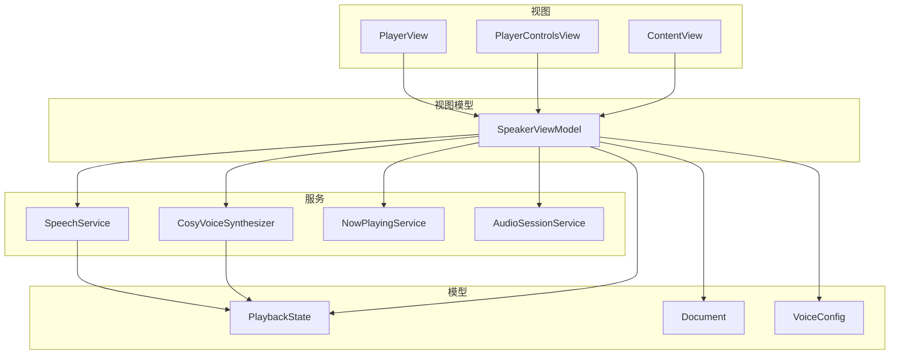
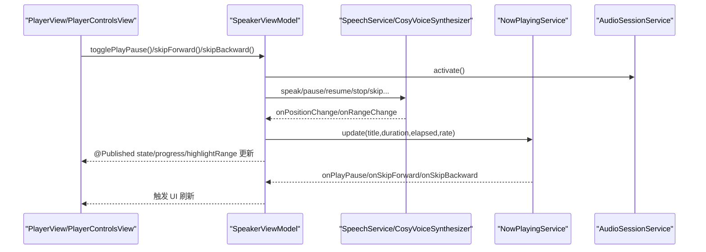
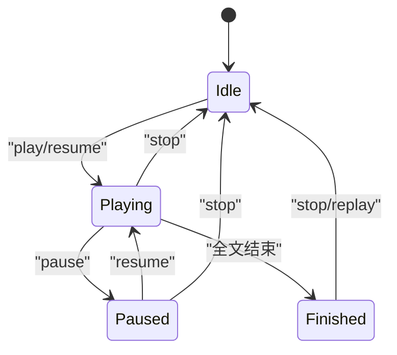
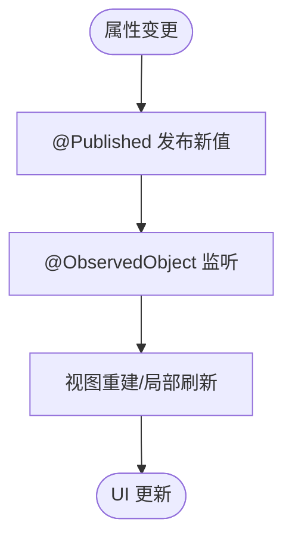
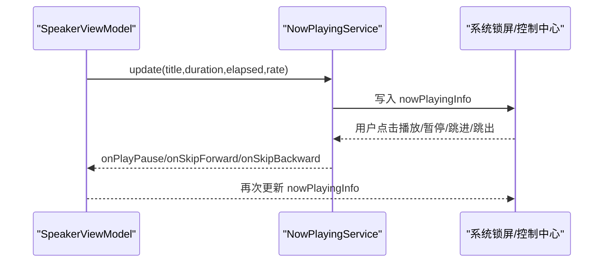
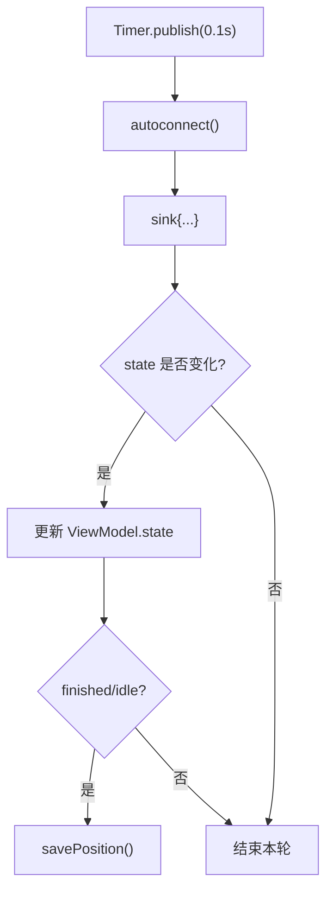
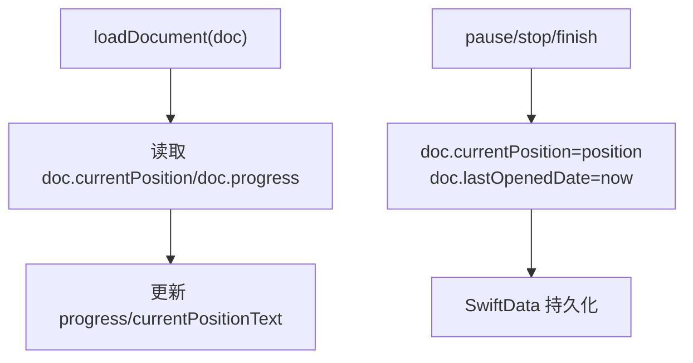
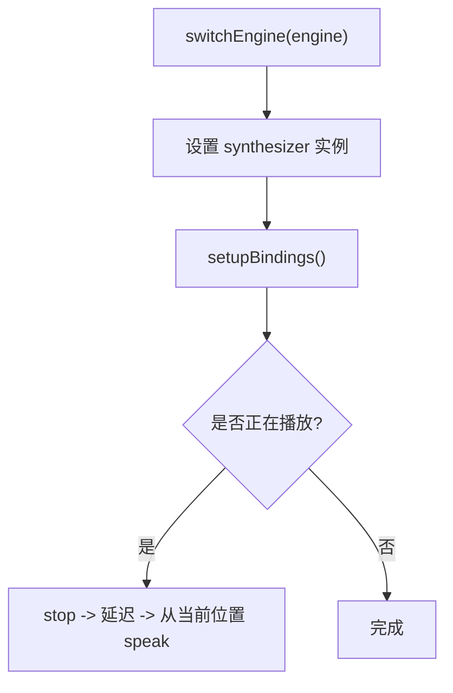
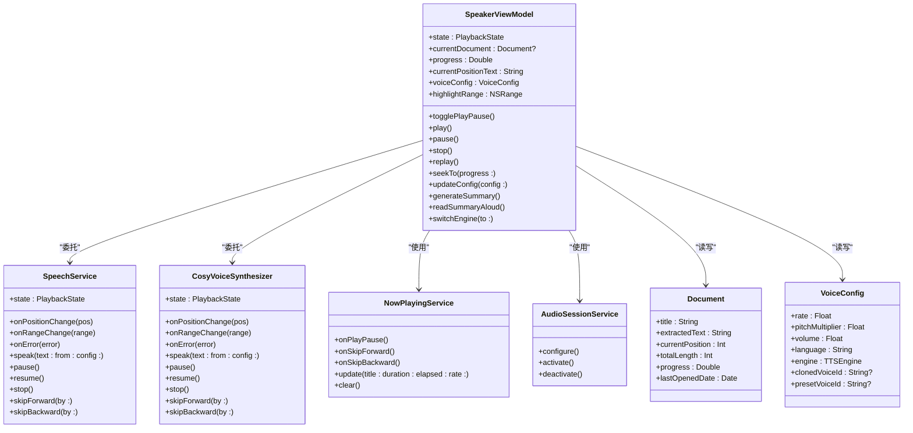
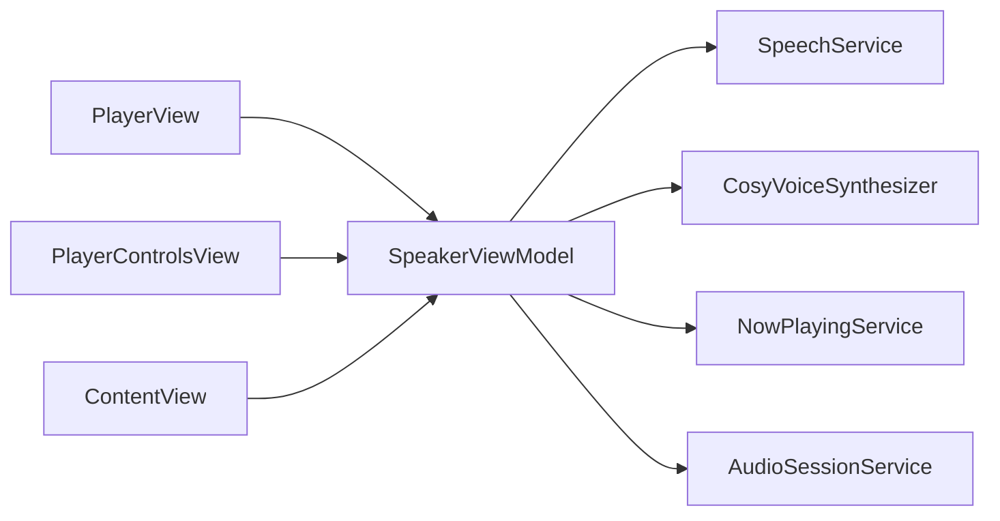

# 状态管理

<cite>
**本文引用的文件**   
- [PlaybackState.swift](file://Models/PlaybackState.swift)
- [SpeakerViewModel.swift](file://ViewModels/SpeakerViewModel.swift)
- [SpeechService.swift](file://Services/SpeechService.swift)
- [CosyVoiceSynthesizer.swift](file://Services/CosyVoiceSynthesizer.swift)
- [NowPlayingService.swift](file://Services/NowPlayingService.swift)
- [AudioSessionService.swift](file://Services/AudioSessionService.swift)
- [Document.swift](file://Models/Document.swift)
- [VoiceConfig.swift](file://Models/VoiceConfig.swift)
- [PlayerView.swift](file://Views/PlayerView.swift)
- [PlayerControlsView.swift](file://Views/PlayerControlsView.swift)
- [ContentView.swift](file://Views/ContentView.swift)
</cite>

## 目录
1. [简介](#简介)
2. [项目结构](#项目结构)
3. [核心组件](#核心组件)
4. [架构总览](#架构总览)
5. [详细组件分析](#详细组件分析)
6. [依赖关系分析](#依赖关系分析)
7. [性能考量](#性能考量)
8. [故障排查指南](#故障排查指南)
9. [结论](#结论)
10. [附录](#附录)

## 简介
本文件系统性梳理 Knowledge 应用的状态管理机制，重点围绕播放状态（PlaybackState）的生命周期与转换、@Published 在 SwiftUI 中的响应式更新、NowPlayingService 的系统级播放状态同步、Combine 框架在状态管理中的应用（含 Timer.publish 的使用与订阅管理）、以及位置持久化策略。文档同时提供最佳实践与常见问题解决方案，帮助读者快速理解并高效维护该应用的状态体系。

## 项目结构
Knowledge 采用分层组织：
- Models：领域模型与枚举（如 PlaybackState、Document、VoiceConfig）
- Services：可复用服务（语音合成、音频会话、系统播放信息同步等）
- ViewModels：面向 UI 的协调层（SpeakerViewModel），聚合业务逻辑与外部服务
- Views：UI 视图层，通过 @ObservedObject 观察 ViewModel 的 @Published 属性实现响应式更新

图表来源
- [SpeakerViewModel.swift:1-314](file://ViewModels/SpeakerViewModel.swift#L1-L314)
- [SpeechService.swift:1-155](file://Services/SpeechService.swift#L1-L155)
- [CosyVoiceSynthesizer.swift:1-258](file://Services/CosyVoiceSynthesizer.swift#L1-L258)
- [NowPlayingService.swift:1-57](file://Services/NowPlayingService.swift#L1-L57)
- [AudioSessionService.swift:1-46](file://Services/AudioSessionService.swift#L1-L46)
- [PlaybackState.swift:1-9](file://Models/PlaybackState.swift#L1-L9)
- [Document.swift:1-115](file://Models/Document.swift#L1-L115)
- [VoiceConfig.swift:1-52](file://Models/VoiceConfig.swift#L1-L52)
- [PlayerView.swift:1-174](file://Views/PlayerView.swift#L1-L174)
- [PlayerControlsView.swift:1-65](file://Views/PlayerControlsView.swift#L1-L65)
- [ContentView.swift:1-98](file://Views/ContentView.swift#L1-L98)

章节来源
- [SpeakerViewModel.swift:1-314](file://ViewModels/SpeakerViewModel.swift#L1-L314)
- [PlayerView.swift:1-174](file://Views/PlayerView.swift#L1-L174)
- [PlayerControlsView.swift:1-65](file://Views/PlayerControlsView.swift#L1-L65)
- [ContentView.swift:1-98](file://Views/ContentView.swift#L1-L98)

## 核心组件
- PlaybackState：定义播放状态的枚举类型，包含空闲、播放、暂停、完成四种状态，作为整个播放链路的状态源。
- SpeakerViewModel：主视图模型，负责编排播放控制、引擎切换、进度与高亮范围同步、远程控制桥接、配置与位置持久化。对外暴露多个 @Published 属性供 SwiftUI 响应式消费。
- SpeechService：基于系统 AVSpeechSynthesizer 的 TTS 引擎实现，按段落推进朗读，回调当前位置与高亮范围。
- CosyVoiceSynthesizer：网络 TTS 引擎适配器，分段合成并播放，估算位置并回调；具备错误降级能力。
- NowPlayingService：封装 MPNowPlayingInfoCenter 与 MPRemoteCommandCenter，将当前播放标题、时长、已播时间、速率同步到系统锁屏/控制中心，并接收系统级播放命令。
- AudioSessionService：统一配置和激活/停用 AVAudioSession，确保后台播放、蓝牙与 AirPlay 支持。
- Document：SwiftData 模型，保存文本、当前位置、最后打开时间、摘要等，用于位置持久化与恢复。
- VoiceConfig：语音配置（语速、音高、音量、语言、引擎选择、音色 ID 等），可序列化到 UserDefaults。

章节来源
- [PlaybackState.swift:1-9](file://Models/PlaybackState.swift#L1-L9)
- [SpeakerViewModel.swift:1-314](file://ViewModels/SpeakerViewModel.swift#L1-L314)
- [SpeechService.swift:1-155](file://Services/SpeechService.swift#L1-L155)
- [CosyVoiceSynthesizer.swift:1-258](file://Services/CosyVoiceSynthesizer.swift#L1-L258)
- [NowPlayingService.swift:1-57](file://Services/NowPlayingService.swift#L1-L57)
- [AudioSessionService.swift:1-46](file://Services/AudioSessionService.swift#L1-L46)
- [Document.swift:1-115](file://Models/Document.swift#L1-L115)
- [VoiceConfig.swift:1-52](file://Models/VoiceConfig.swift#L1-L52)

## 架构总览
下图展示了从 UI 到引擎再到系统层的完整调用链与数据流。

图表来源
- [SpeakerViewModel.swift:100-170](file://ViewModels/SpeakerViewModel.swift#L100-L170)
- [SpeechService.swift:30-155](file://Services/SpeechService.swift#L30-L155)
- [CosyVoiceSynthesizer.swift:28-258](file://Services/CosyVoiceSynthesizer.swift#L28-L258)
- [NowPlayingService.swift:18-55](file://Services/NowPlayingService.swift#L18-L55)
- [AudioSessionService.swift:15-44](file://Services/AudioSessionService.swift#L15-L44)
- [PlayerView.swift:27-36](file://Views/PlayerView.swift#L27-L36)
- [PlayerControlsView.swift:10-24](file://Views/PlayerControlsView.swift#L10-L24)

## 详细组件分析

### 播放状态（PlaybackState）生命周期与转换
- 状态定义：idle、playing、paused、finished。
- 关键转换路径：
  - idle → playing：首次开始或 resume
  - playing → paused：用户暂停或系统暂停
  - paused → playing：继续播放
  - playing → finished：全文读完
  - finished → idle：停止后重置
  - 任意状态 → idle：主动 stop
- 状态变更由底层引擎（SpeechService/CosyVoiceSynthesizer）驱动，并通过回调上报给 ViewModel，再由 ViewModel 广播到 UI。

图表来源
- [PlaybackState.swift:3-8](file://Models/PlaybackState.swift#L3-L8)
- [SpeechService.swift:70-90](file://Services/SpeechService.swift#L70-L90)
- [CosyVoiceSynthesizer.swift:49-69](file://Services/CosyVoiceSynthesizer.swift#L49-L69)
- [SpeakerViewModel.swift:100-137](file://ViewModels/SpeakerViewModel.swift#L100-L137)

章节来源
- [PlaybackState.swift:1-9](file://Models/PlaybackState.swift#L1-L9)
- [SpeechService.swift:118-155](file://Services/SpeechService.swift#L118-L155)
- [CosyVoiceSynthesizer.swift:240-258](file://Services/CosyVoiceSynthesizer.swift#L240-L258)
- [SpeakerViewModel.swift:249-266](file://ViewModels/SpeakerViewModel.swift#L249-L266)

### @Published 在 SwiftUI 中的响应式更新机制
- SpeakerViewModel 使用 @Published 暴露 state、currentDocument、progress、currentPositionText、voiceConfig、highlightRange 等属性。
- PlayerView 与 PlayerControlsView 以 @ObservedObject 持有 ViewModel，当 @Published 属性变化时自动触发视图重渲染。
- 典型绑定：
  - Slider 双向绑定 progress，拖动时调用 seekTo 更新位置
  - 按钮点击调用 togglePlayPause/skipForward/skipBackward
  - highlightRange 变化驱动滚动定位与高亮样式更新

图表来源
- [SpeakerViewModel.swift:12-18](file://ViewModels/SpeakerViewModel.swift#L12-L18)
- [PlayerView.swift:5-36](file://Views/PlayerView.swift#L5-L36)
- [PlayerControlsView.swift:4-24](file://Views/PlayerControlsView.swift#L4-L24)

章节来源
- [SpeakerViewModel.swift:12-18](file://ViewModels/SpeakerViewModel.swift#L12-L18)
- [PlayerView.swift:27-36](file://Views/PlayerView.swift#L27-L36)
- [PlayerControlsView.swift:10-24](file://Views/PlayerControlsView.swift#L10-L24)

### NowPlayingService 系统级播放状态同步
- 职责：
  - 更新锁屏/控制中心的媒体信息（标题、艺术家、时长、已播时间、速率、媒体类型）
  - 注册系统远程控制命令（播放/暂停/跳进/跳出），并将事件转发至 ViewModel
- 集成点：
  - ViewModel 在每次位置/状态变化时调用 update(...)
  - 用户通过系统控件操作时，回调 onPlayPause/onSkipForward/onSkipBackward，ViewModel 执行对应动作

图表来源
- [NowPlayingService.swift:18-55](file://Services/NowPlayingService.swift#L18-L55)
- [SpeakerViewModel.swift:284-294](file://ViewModels/SpeakerViewModel.swift#L284-L294)
- [SpeakerViewModel.swift:262-266](file://ViewModels/SpeakerViewModel.swift#L262-L266)

章节来源
- [NowPlayingService.swift:1-57](file://Services/NowPlayingService.swift#L1-L57)
- [SpeakerViewModel.swift:284-294](file://ViewModels/SpeakerViewModel.swift#L284-L294)

### Combine 框架在状态管理中的应用
- 定时器驱动状态轮询：
  - 使用 Timer.publish(every:on:in:) 每 0.1 秒发布一次，autoconnect 自动连接
  - sink 中读取引擎 state，若与 ViewModel.state 不同则更新，并在结束/空闲时持久化位置
- 订阅管理：
  - cancellables 集合持有所有订阅，避免内存泄漏
- 异步回调桥接：
  - 引擎回调 onPositionChange/onRangeChange/onError 通过 Task { @MainActor in ... } 回到主线程更新 @Published 属性

图表来源
- [SpeakerViewModel.swift:249-266](file://ViewModels/SpeakerViewModel.swift#L249-L266)
- [SpeakerViewModel.swift:215-247](file://ViewModels/SpeakerViewModel.swift#L215-L247)

章节来源
- [SpeakerViewModel.swift:249-266](file://ViewModels/SpeakerViewModel.swift#L249-L266)
- [SpeakerViewModel.swift:215-247](file://ViewModels/SpeakerViewModel.swift#L215-L247)

### 状态持久化策略：当前位置保存与恢复
- 保存时机：
  - pause/stop 时保存 currentPosition 与 lastOpenedDate
  - 播放结束或空闲时保存
- 恢复时机：
  - loadDocument 时读取 Document.currentPosition 与 progress，并初始化 UI 显示
- 存储载体：
  - Document 为 SwiftData 模型，持久化到数据库
  - VoiceConfig 使用 UserDefaults 进行 JSON 编码/解码

图表来源
- [SpeakerViewModel.swift:81-96](file://ViewModels/SpeakerViewModel.swift#L81-L96)
- [SpeakerViewModel.swift:119-137](file://ViewModels/SpeakerViewModel.swift#L119-L137)
- [SpeakerViewModel.swift:296-300](file://ViewModels/SpeakerViewModel.swift#L296-L300)
- [Document.swift:54-115](file://Models/Document.swift#L54-L115)
- [SpeakerViewModel.swift:302-312](file://ViewModels/SpeakerViewModel.swift#L302-L312)

章节来源
- [SpeakerViewModel.swift:81-96](file://ViewModels/SpeakerViewModel.swift#L81-L96)
- [SpeakerViewModel.swift:296-300](file://ViewModels/SpeakerViewModel.swift#L296-L300)
- [Document.swift:54-115](file://Models/Document.swift#L54-L115)
- [SpeakerViewModel.swift:302-312](file://ViewModels/SpeakerViewModel.swift#L302-L312)

### 引擎切换与错误降级
- 引擎切换：
  - switchEngine(to:) 根据配置切换 SpeechService 或 CosyVoiceSynthesizer，并重新 setupBindings
  - 若正在播放，短暂延迟后以新引擎从当前位置继续
- 错误降级：
  - 当 CosyVoice 报错时，自动降级到系统 TTS，更新 voiceConfig.engine 并重新建立绑定

图表来源
- [SpeakerViewModel.swift:57-77](file://ViewModels/SpeakerViewModel.swift#L57-L77)
- [SpeakerViewModel.swift:233-247](file://ViewModels/SpeakerViewModel.swift#L233-L247)

章节来源
- [SpeakerViewModel.swift:57-77](file://ViewModels/SpeakerViewModel.swift#L57-L77)
- [SpeakerViewModel.swift:233-247](file://ViewModels/SpeakerViewModel.swift#L233-L247)

### 类与协议关系图

图表来源
- [SpeakerViewModel.swift:1-314](file://ViewModels/SpeakerViewModel.swift#L1-L314)
- [SpeechService.swift:1-155](file://Services/SpeechService.swift#L1-L155)
- [CosyVoiceSynthesizer.swift:1-258](file://Services/CosyVoiceSynthesizer.swift#L1-L258)
- [NowPlayingService.swift:1-57](file://Services/NowPlayingService.swift#L1-L57)
- [AudioSessionService.swift:1-46](file://Services/AudioSessionService.swift#L1-L46)
- [Document.swift:1-115](file://Models/Document.swift#L1-L115)
- [VoiceConfig.swift:1-52](file://Models/VoiceConfig.swift#L1-L52)

## 依赖关系分析
- 低耦合设计：
  - ViewModel 通过协议抽象语音引擎，便于替换与测试
  - 系统级播放信息与音频会话分别由独立服务管理
- 直接依赖：
  - SpeakerViewModel 依赖 SpeechService/CosyVoiceSynthesizer、NowPlayingService、AudioSessionService
  - 视图仅依赖 ViewModel，不直接访问引擎或服务
- 潜在循环依赖：
  - 未发现循环引用；回调均使用弱引用或 MainActor 调度，避免强引用环

图表来源
- [SpeakerViewModel.swift:1-314](file://ViewModels/SpeakerViewModel.swift#L1-L314)
- [PlayerView.swift:1-174](file://Views/PlayerView.swift#L1-L174)
- [PlayerControlsView.swift:1-65](file://Views/PlayerControlsView.swift#L1-L65)
- [ContentView.swift:1-98](file://Views/ContentView.swift#L1-L98)

章节来源
- [SpeakerViewModel.swift:1-314](file://ViewModels/SpeakerViewModel.swift#L1-L314)
- [PlayerView.swift:1-174](file://Views/PlayerView.swift#L1-L174)
- [PlayerControlsView.swift:1-65](file://Views/PlayerControlsView.swift#L1-L65)
- [ContentView.swift:1-98](file://Views/ContentView.swift#L1-L98)

## 性能考量
- 定时器频率：
  - 0.1 秒轮询足以满足 UI 流畅度，且对 CPU 影响可控
- 网络合成：
  - CosyVoice 分段合成与播放，减少单次请求体积，提升首帧速度
- 文本切分：
  - 优先在自然断点处截断，提高朗读体验与位置估算准确性
- 主线程调度：
  - 所有 UI 相关更新均在 MainActor 上执行，避免竞态条件

[本节为通用指导，无需具体文件分析]

## 故障排查指南
- 无法后台播放或蓝牙无输出：
  - 检查 AudioSessionService.activate/deactivate 是否正确调用
  - 确认类别设置为 playback，模式为 spokenAudio，并允许蓝牙与 AirPlay
- 系统锁屏信息不更新：
  - 确认 NowPlayingService.update 被频繁调用（位置/状态变化时）
  - 检查 title/duration/elapsed/rate 字段是否有效
- 播放状态不同步：
  - 检查 Timer.publish 订阅是否仍在运行（cancellables 未释放）
  - 确认引擎回调 onPositionChange/onRangeChange 正常触发
- 网络 TTS 失败：
  - 查看 onError 回调，确认是否触发降级到系统 TTS
  - 检查网络权限与 API 可用性
- 位置丢失：
  - 确认 pause/stop/finish 时 savePosition 被调用
  - 验证 Document.currentPosition 与 lastOpenedDate 是否写入成功

章节来源
- [AudioSessionService.swift:15-44](file://Services/AudioSessionService.swift#L15-L44)
- [NowPlayingService.swift:18-31](file://Services/NowPlayingService.swift#L18-L31)
- [SpeakerViewModel.swift:249-266](file://ViewModels/SpeakerViewModel.swift#L249-L266)
- [SpeakerViewModel.swift:233-247](file://ViewModels/SpeakerViewModel.swift#L233-L247)
- [SpeakerViewModel.swift:296-300](file://ViewModels/SpeakerViewModel.swift#L296-L300)

## 结论
Knowledge 的状态管理以 SpeakerViewModel 为核心，结合 @Published 与 Combine 实现了高效的响应式 UI 更新；通过 NowPlayingService 与系统深度集成，提供了良好的跨平台一致体验；借助 Document 与 VoiceConfig 的持久化策略，保证了阅读与配置的连续性。整体架构清晰、职责分明，具备良好的可扩展性与可维护性。

[本节为总结性内容，无需具体文件分析]

## 附录
- 最佳实践
  - 单一状态源：所有播放状态由引擎驱动，ViewModel 只做桥接与广播
  - 明确持久化边界：仅在必要节点保存位置与配置，避免频繁 I/O
  - 错误降级：网络 TTS 失败自动回退到系统 TTS，保障用户体验
  - 资源清理：stop 时及时停用 AudioSession 与清除系统播放信息
- 常见问题
  - 多引擎切换时的竞态：使用延迟与状态判断保证平滑过渡
  - 远程控制冲突：禁用不必要的命令，只保留播放/暂停/跳转
  - 高亮范围越界：计算安全 NSRange 并限制长度

[本节为通用指导，无需具体文件分析]