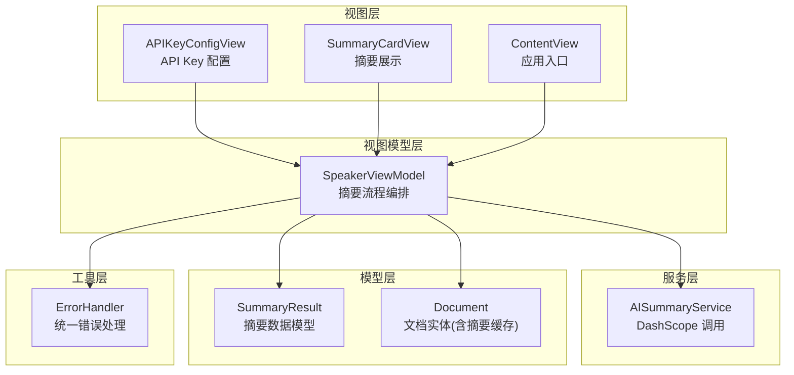
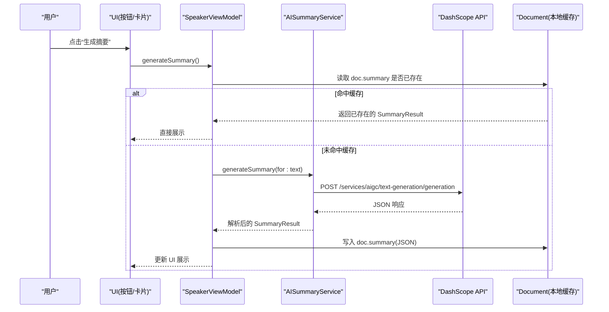
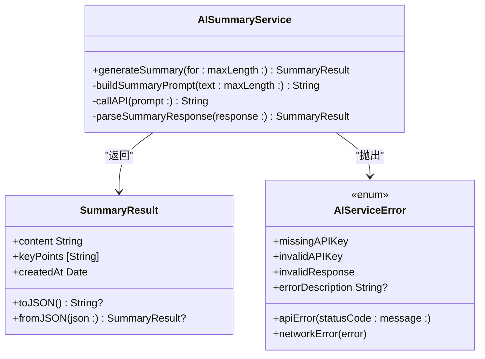
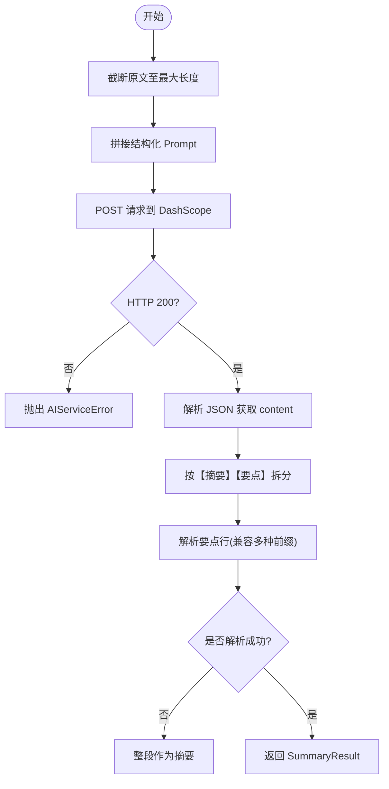
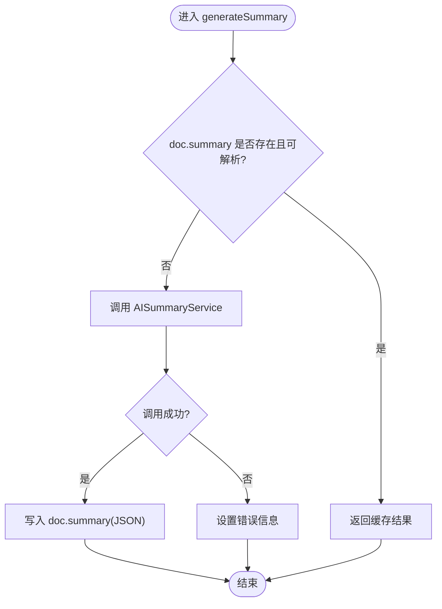
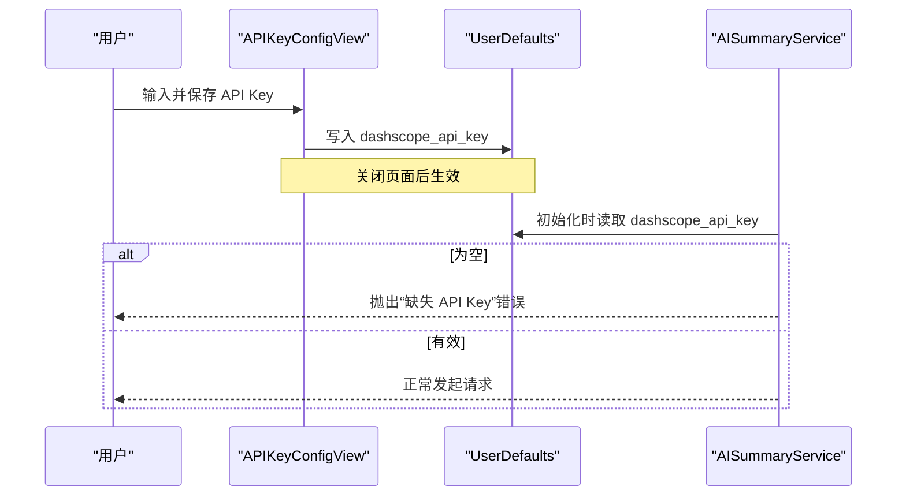
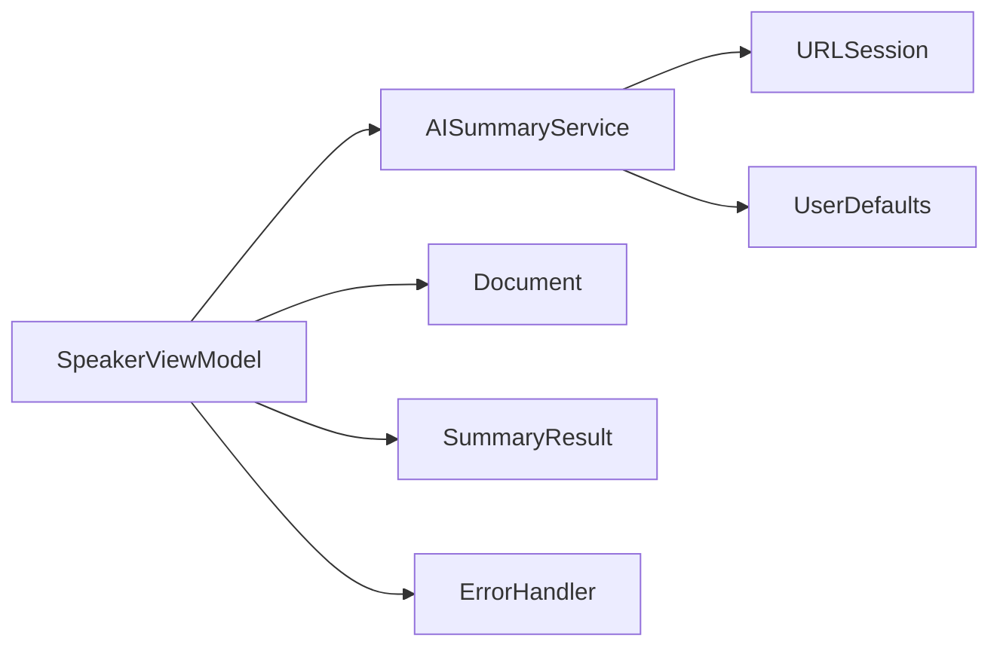

# AI 摘要功能

<cite>
**本文引用的文件**
- [AISummaryService.swift](file://Services/AISummaryService.swift)
- [SummaryResult.swift](file://Models/SummaryResult.swift)
- [SpeakerViewModel.swift](file://ViewModels/SpeakerViewModel.swift)
- [APIKeyConfigView.swift](file://Views/APIKeyConfigView.swift)
- [SummaryCardView.swift](file://Views/SummaryCardView.swift)
- [Document.swift](file://Models/Document.swift)
- [ErrorHandler.swift](file://Services/ErrorHandler.swift)
- [ContentView.swift](file://Views/ContentView.swift)
</cite>

## 目录
1. [简介](#简介)
2. [项目结构](#项目结构)
3. [核心组件](#核心组件)
4. [架构总览](#架构总览)
5. [详细组件分析](#详细组件分析)
6. [依赖关系分析](#依赖关系分析)
7. [性能与优化](#性能与优化)
8. [使用示例](#使用示例)
9. [故障排除指南](#故障排除指南)
10. [结论](#结论)

## 简介
本文件面向 Knowledge 应用的“AI 摘要”能力，聚焦阿里云通义千问（DashScope）的集成实现。内容涵盖：
- 请求构建、响应解析、错误处理与重试机制
- 摘要生成算法与缓存策略
- API Key 配置、调用频率限制、网络异常处理
- 使用示例与排障建议

## 项目结构
AI 摘要相关代码主要分布在 Services、Models、ViewModels 与 Views 四个层次：
- Services：封装对 DashScope 的 HTTP 调用与结果解析
- Models：定义摘要结果的数据模型
- ViewModels：编排 UI 状态、缓存与调用流程
- Views：提供 API Key 配置与摘要展示界面

图表来源
- [AISummaryService.swift:1-180](file://Services/AISummaryService.swift#L1-L180)
- [SummaryResult.swift:1-33](file://Models/SummaryResult.swift#L1-L33)
- [SpeakerViewModel.swift:1-314](file://ViewModels/SpeakerViewModel.swift#L1-L314)
- [APIKeyConfigView.swift:1-71](file://Views/APIKeyConfigView.swift#L1-L71)
- [SummaryCardView.swift:1-197](file://Views/SummaryCardView.swift#L1-L197)
- [Document.swift:1-115](file://Models/Document.swift#L1-L115)
- [ErrorHandler.swift:1-53](file://Services/ErrorHandler.swift#L1-L53)
- [ContentView.swift:1-98](file://Views/ContentView.swift#L1-L98)

章节来源
- [AISummaryService.swift:1-180](file://Services/AISummaryService.swift#L1-L180)
- [SummaryResult.swift:1-33](file://Models/SummaryResult.swift#L1-L33)
- [SpeakerViewModel.swift:1-314](file://ViewModels/SpeakerViewModel.swift#L1-L314)
- [APIKeyConfigView.swift:1-71](file://Views/APIKeyConfigView.swift#L1-L71)
- [SummaryCardView.swift:1-197](file://Views/SummaryCardView.swift#L1-L197)
- [Document.swift:1-115](file://Models/Document.swift#L1-L115)
- [ErrorHandler.swift:1-53](file://Services/ErrorHandler.swift#L1-L53)
- [ContentView.swift:1-98](file://Views/ContentView.swift#L1-L98)

## 核心组件
- AISummaryService：负责构造请求、发送网络请求、校验响应、解析 JSON 并返回结构化摘要结果；包含错误类型定义。
- SummaryResult：承载摘要正文与关键要点列表，支持 JSON 序列化用于持久化。
- SpeakerViewModel：对外暴露“生成摘要”接口，管理加载态、错误态、缓存命中逻辑，并将结果写回 Document。
- APIKeyConfigView：提供用户输入与保存 API Key 的界面，持久化到 UserDefaults。
- SummaryCardView：展示摘要正文与要点，并提供朗读入口。
- Document：SwiftData 模型，新增 summary 字段用于本地缓存摘要 JSON。
- ErrorHandler：统一的错误日志与弹窗提示。

章节来源
- [AISummaryService.swift:1-180](file://Services/AISummaryService.swift#L1-L180)
- [SummaryResult.swift:1-33](file://Models/SummaryResult.swift#L1-L33)
- [SpeakerViewModel.swift:172-211](file://ViewModels/SpeakerViewModel.swift#L172-L211)
- [APIKeyConfigView.swift:1-71](file://Views/APIKeyConfigView.swift#L1-L71)
- [SummaryCardView.swift:1-197](file://Views/SummaryCardView.swift#L1-L197)
- [Document.swift:54-115](file://Models/Document.swift#L54-L115)
- [ErrorHandler.swift:1-53](file://Services/ErrorHandler.swift#L1-L53)

## 架构总览
下图展示了从用户触发到最终展示的完整调用链，包括缓存命中、网络请求、解析与错误处理。

图表来源
- [SpeakerViewModel.swift:172-211](file://ViewModels/SpeakerViewModel.swift#L172-L211)
- [AISummaryService.swift:25-107](file://Services/AISummaryService.swift#L25-L107)
- [Document.swift:65-115](file://Models/Document.swift#L65-L115)

## 详细组件分析

### AISummaryService：DashScope 集成
- 职责
  - 构造 Prompt：将原文截断至固定长度，拼接结构化指令，要求输出“摘要+要点”。
  - 发起请求：POST 到 DashScope 文本生成端点，携带 Authorization 与 JSON Body。
  - 响应校验：检查 HTTP 状态码，区分鉴权失败与其他错误。
  - 解析 JSON：提取 output.choices[0].message.content。
  - 解析自然语言：按约定标记“【摘要】”“【要点】”拆分内容与要点。
- 错误处理
  - 自定义 AIServiceError：缺失/无效 API Key、非 200 状态码、非法响应体、网络错误等。
  - 通过 LocalizedError 提供用户可读的错误描述。
- 超时与重试
  - 当前设置请求超时为 60 秒。
  - 未实现自动重试；可在上层封装重试策略。

图表来源
- [AISummaryService.swift:1-180](file://Services/AISummaryService.swift#L1-L180)
- [SummaryResult.swift:1-33](file://Models/SummaryResult.swift#L1-L33)

章节来源
- [AISummaryService.swift:25-107](file://Services/AISummaryService.swift#L25-L107)
- [AISummaryService.swift:109-153](file://Services/AISummaryService.swift#L109-L153)
- [AISummaryService.swift:158-179](file://Services/AISummaryService.swift#L158-L179)

### 摘要生成算法与解析
- Prompt 设计
  - 先截取前若干字符，避免超长导致请求失败或成本过高。
  - 明确输出格式，便于后续稳定解析。
- 解析策略
  - 定位“【摘要】”与“【要点】”两个区块。
  - 要点行匹配多种前缀（如“- ”、“• ”、“· ”、“数字.”）。
  - 若无法识别，则整段回复作为摘要兜底。

图表来源
- [AISummaryService.swift:38-58](file://Services/AISummaryService.swift#L38-L58)
- [AISummaryService.swift:60-107](file://Services/AISummaryService.swift#L60-L107)
- [AISummaryService.swift:109-153](file://Services/AISummaryService.swift#L109-L153)

章节来源
- [AISummaryService.swift:38-58](file://Services/AISummaryService.swift#L38-L58)
- [AISummaryService.swift:109-153](file://Services/AISummaryService.swift#L109-L153)

### 缓存策略与持久化
- 缓存位置
  - Document 模型新增 summary 字段，存储 SummaryResult 的 JSON 字符串。
- 命中逻辑
  - 在生成前尝试从 doc.summary 反序列化为 SummaryResult，命中则直接返回，避免重复调用。
- 落盘时机
  - 生成成功后，将新的 SummaryResult 转 JSON 写回 doc.summary。

图表来源
- [SpeakerViewModel.swift:172-203](file://ViewModels/SpeakerViewModel.swift#L172-L203)
- [Document.swift:65-115](file://Models/Document.swift#L65-L115)
- [SummaryResult.swift:20-31](file://Models/SummaryResult.swift#L20-L31)

章节来源
- [SpeakerViewModel.swift:172-203](file://ViewModels/SpeakerViewModel.swift#L172-L203)
- [Document.swift:65-115](file://Models/Document.swift#L65-L115)
- [SummaryResult.swift:20-31](file://Models/SummaryResult.swift#L20-L31)

### API Key 配置与存储
- 配置入口
  - APIKeyConfigView 提供安全输入框与保存按钮，支持读取已有值。
- 存储方式
  - 使用 UserDefaults 的键名保存 API Key，供 AISummaryService 初始化时读取。
- 使用场景
  - AISummaryService 初始化时从 UserDefaults 读取，为空则抛出“缺失 API Key”错误。

图表来源
- [APIKeyConfigView.swift:55-65](file://Views/APIKeyConfigView.swift#L55-L65)
- [AISummaryService.swift:12-16](file://Services/AISummaryService.swift#L12-L16)
- [AISummaryService.swift:25-28](file://Services/AISummaryService.swift#L25-L28)

章节来源
- [APIKeyConfigView.swift:1-71](file://Views/APIKeyConfigView.swift#L1-L71)
- [AISummaryService.swift:12-16](file://Services/AISummaryService.swift#L12-L16)
- [AISummaryService.swift:25-28](file://Services/AISummaryService.swift#L25-L28)

### 错误处理与用户体验
- 错误分类
  - 缺失/无效 API Key、服务器非 200、响应体不合法、网络错误等。
- 统一处理
  - ErrorHandler 提供集中式错误日志与弹窗提示，便于全局管理。
- UI 反馈
  - SummaryCardView 提供加载中与错误状态视图，支持重试与取消操作。

章节来源
- [AISummaryService.swift:158-179](file://Services/AISummaryService.swift#L158-L179)
- [ErrorHandler.swift:1-53](file://Services/ErrorHandler.swift#L1-L53)
- [SummaryCardView.swift:95-182](file://Views/SummaryCardView.swift#L95-L182)

## 依赖关系分析
- 组件耦合
  - SpeakerViewModel 依赖 AISummaryService、Document、SummaryResult、ErrorHandler。
  - AISummaryService 依赖系统 URLSession 与 UserDefaults。
  - Views 仅持有 ViewModel 引用，保持低耦合。
- 外部依赖
  - 阿里云 DashScope 文本生成 API。
  - iOS 系统 UserDefaults、URLSession。

图表来源
- [SpeakerViewModel.swift:1-314](file://ViewModels/SpeakerViewModel.swift#L1-L314)
- [AISummaryService.swift:1-180](file://Services/AISummaryService.swift#L1-L180)

章节来源
- [SpeakerViewModel.swift:1-314](file://ViewModels/SpeakerViewModel.swift#L1-L314)
- [AISummaryService.swift:1-180](file://Services/AISummaryService.swift#L1-L180)

## 性能与优化
- 文本截断
  - 在构造 Prompt 前对原文进行截断，降低请求大小与延迟，减少 Token 消耗。
- 缓存优先
  - 生成前先检查本地缓存，命中即返回，显著减少网络开销与等待时间。
- 超时控制
  - 请求设置合理超时，避免长时间阻塞。
- 可扩展优化建议
  - 增加指数退避重试：针对 429/5xx 等临时错误进行有限次重试。
  - 并发控制：对同一文档的多次生成请求进行去重。
  - 增量缓存：记录上次生成时间与输入哈希，当输入变化时失效缓存。
  - 速率限制：在客户端维护令牌桶/滑动窗口，避免超过服务端配额。

[本节为通用性能建议，不直接分析具体文件]

## 使用示例
- 配置 API Key
  - 打开“设置”中的“API Key”页面，粘贴从阿里云控制台获取的 Key 并保存。
- 生成摘要
  - 在文档详情页或列表页选择目标文档，点击“生成摘要”。
  - 首次会调用 DashScope，随后结果会被缓存；再次查看将直接展示。
- 朗读摘要
  - 在摘要卡片中点击“朗读摘要”，将合成语音播放。

章节来源
- [APIKeyConfigView.swift:1-71](file://Views/APIKeyConfigView.swift#L1-L71)
- [SpeakerViewModel.swift:172-211](file://ViewModels/SpeakerViewModel.swift#L172-L211)
- [SummaryCardView.swift:1-91](file://Views/SummaryCardView.swift#L1-L91)

## 故障排除指南
- 提示“请先在设置中配置阿里云 API Key”
  - 确认已在“API Key”页面正确保存 Key。
  - 检查 AISummaryService 是否能从 UserDefaults 读取到该键值。
- 提示“API Key 无效，请检查后重试”
  - 登录阿里云控制台核对 Key 是否过期或被禁用。
  - 确认网络可达且未被防火墙拦截。
- 提示“请求失败（状态码）：...”
  - 根据状态码排查：鉴权类（401/403）、限流类（429）、服务端错误（5xx）。
  - 建议在服务端控制台查看调用日志与配额使用情况。
- 提示“服务器返回数据异常，请稍后重试”
  - 可能是响应体结构变更或网络中间件干扰，稍后重试或更换网络环境。
- 提示“网络错误：...”
  - 检查设备网络、代理与 DNS 设置，必要时切换 Wi-Fi/蜂窝网络。
- 如何启用重试
  - 当前未内置重试，可在上层封装：捕获 AIServiceError 的特定类型，按策略重试并限制次数。

章节来源
- [AISummaryService.swift:158-179](file://Services/AISummaryService.swift#L158-L179)
- [AISummaryService.swift:89-96](file://Services/AISummaryService.swift#L89-L96)
- [AISummaryService.swift:98-106](file://Services/AISummaryService.swift#L98-L106)

## 结论
Knowledge 的 AI 摘要功能以 AISummaryService 为核心，结合清晰的 Prompt 设计与稳健的解析逻辑，实现了稳定的摘要生成体验。通过本地缓存与合理的错误处理，提升了可用性与性能。未来可在重试、限流与并发控制方面进一步增强，以获得更鲁棒的云端交互体验。