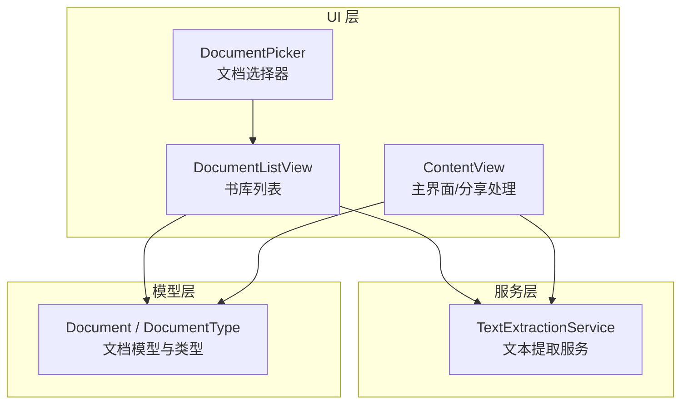
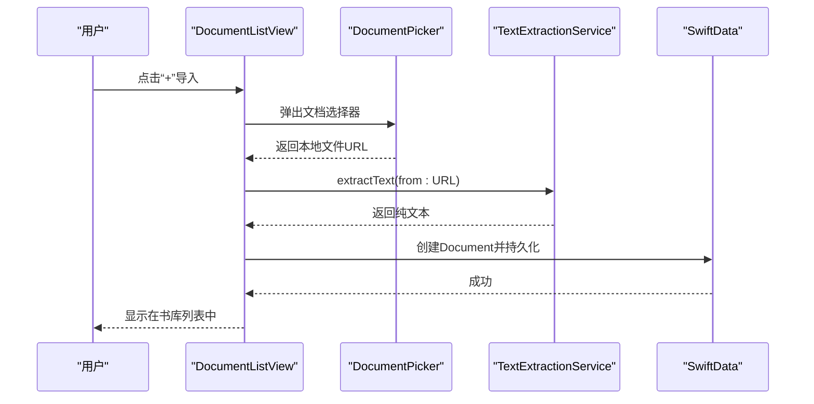
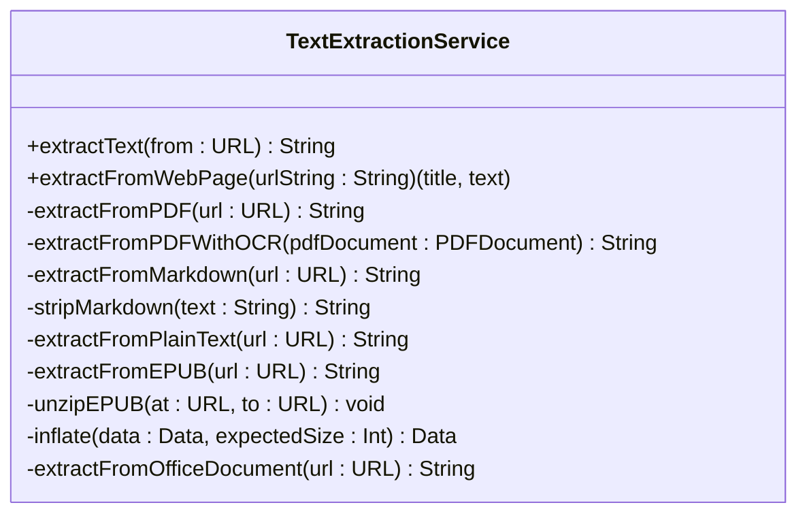
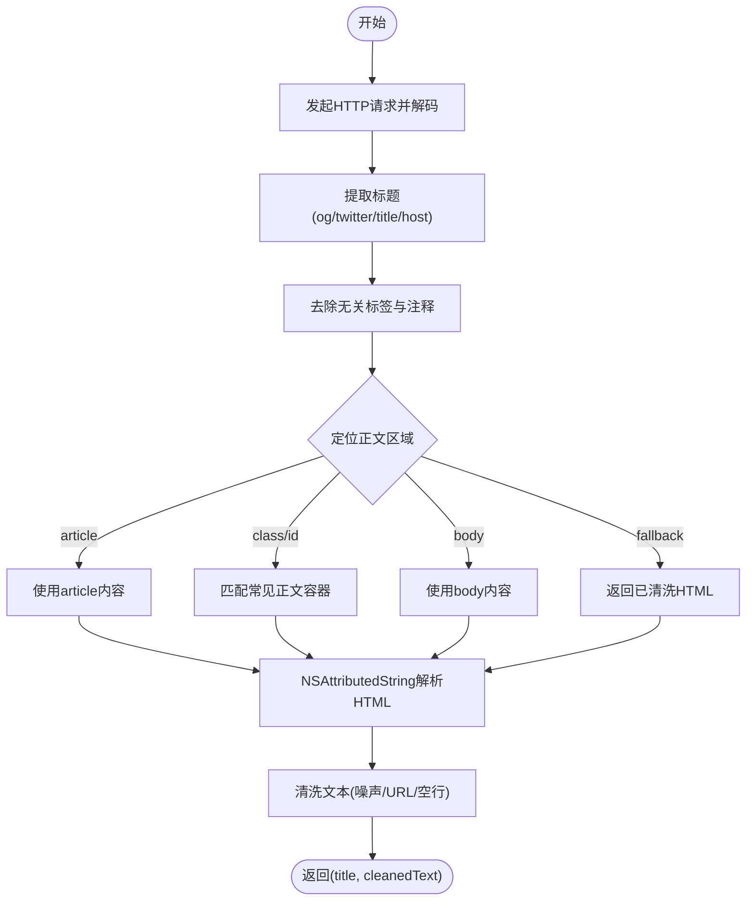
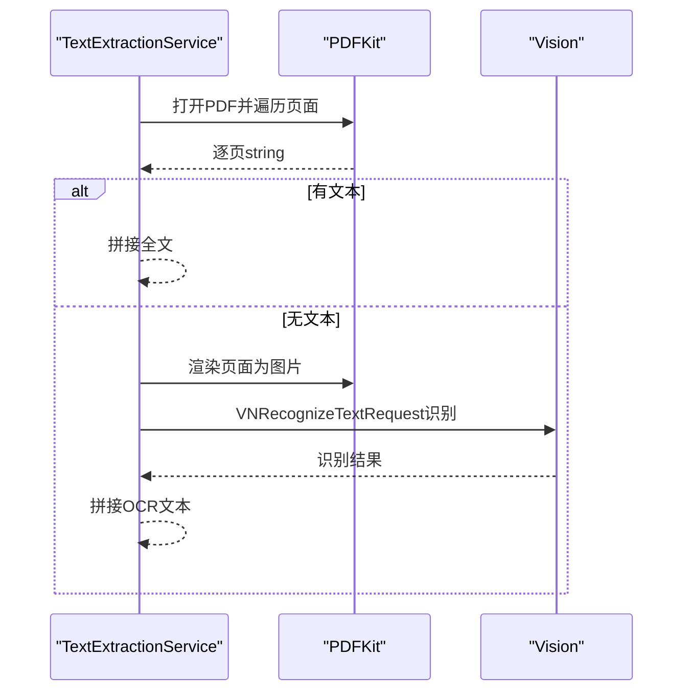
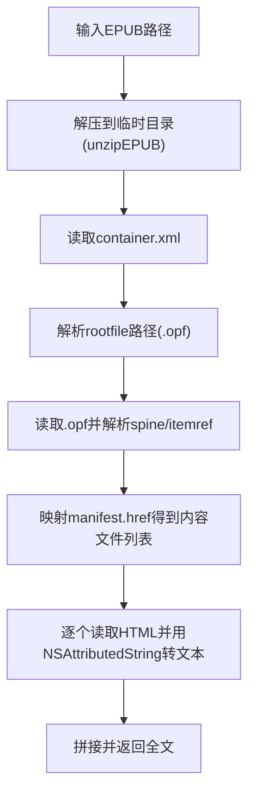
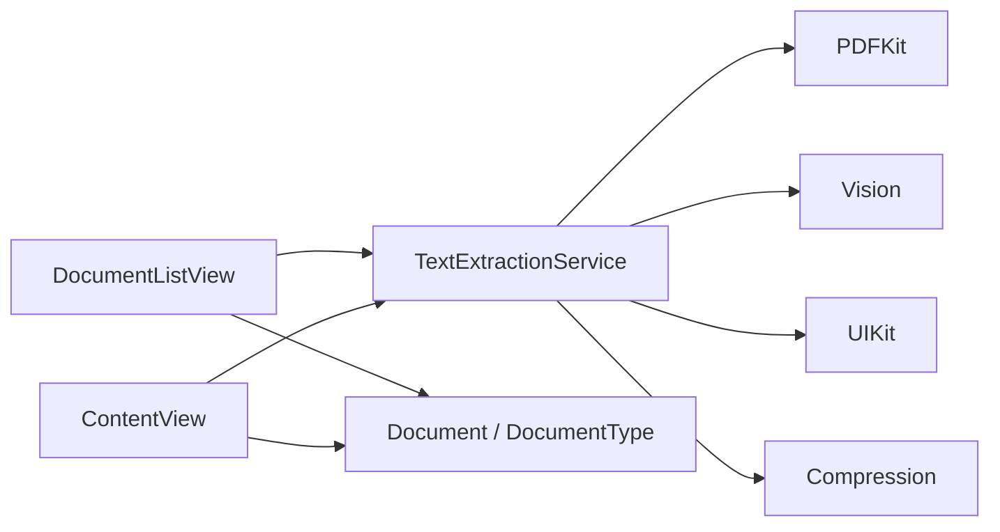

# 文档处理系统

<cite>
**本文引用的文件**   
- [TextExtractionService.swift](file://Services/TextExtractionService.swift)
- [DocumentPicker.swift](file://UIKit/DocumentPicker.swift)
- [Document.swift](file://Models/Document.swift)
- [ContentView.swift](file://Views/ContentView.swift)
- [DocumentListView.swift](file://Views/DocumentListView.swift)
</cite>

## 目录
1. [简介](#简介)
2. [项目结构](#项目结构)
3. [核心组件](#核心组件)
4. [架构总览](#架构总览)
5. [详细组件分析](#详细组件分析)
6. [依赖关系分析](#依赖关系分析)
7. [性能考虑](#性能考虑)
8. [故障排查指南](#故障排查指南)
9. [结论](#结论)
10. [附录：扩展新格式与集成示例](#附录扩展新格式与集成示例)

## 简介
本文件系统面向 Knowledge 应用，提供多格式文档的文本提取、网页内容清洗、OCR 文字识别、ZIP 解压以及 Office 文档解析能力。其目标是让用户通过统一的入口导入 PDF、Markdown、纯文本、EPUB、Office 文档（docx/xlsx/pptx）和网页链接，并自动转换为可阅读的纯文本，以便后续进行语音合成、摘要生成等上层功能。

## 项目结构
与文档处理相关的代码主要分布在以下位置：
- 服务层：文本提取与解析逻辑集中在单一服务类中，便于统一维护与扩展
- UI 层：文档选择器与列表视图负责用户交互与流程编排
- 模型层：文档类型枚举与数据模型定义

图表来源
- [DocumentPicker.swift:1-48](file://UIKit/DocumentPicker.swift#L1-L48)
- [DocumentListView.swift:1-147](file://Views/DocumentListView.swift#L1-L147)
- [ContentView.swift:1-98](file://Views/ContentView.swift#L1-L98)
- [TextExtractionService.swift:1-748](file://Services/TextExtractionService.swift#L1-L748)
- [Document.swift:1-115](file://Models/Document.swift#L1-L115)

章节来源
- [DocumentPicker.swift:1-48](file://UIKit/DocumentPicker.swift#L1-L48)
- [DocumentListView.swift:1-147](file://Views/DocumentListView.swift#L1-L147)
- [ContentView.swift:1-98](file://Views/ContentView.swift#L1-L98)
- [TextExtractionService.swift:1-748](file://Services/TextExtractionService.swift#L1-L748)
- [Document.swift:1-115](file://Models/Document.swift#L1-L115)

## 核心组件
- 文本提取服务：统一入口 extractText(from:)，按扩展名分发到具体解析器；支持网页异步提取 extractFromWebPage(urlString:)
- 文档选择器：封装 UIDocumentPickerViewController，限制支持的 UTType，并将文件复制到本地沙盒后回调
- 文档模型：DocumentType 枚举集中管理支持的扩展名与展示信息；Document 为 SwiftData 模型，保存标题、文件名、类型、提取文本等

章节来源
- [TextExtractionService.swift:27-53](file://Services/TextExtractionService.swift#L27-L53)
- [DocumentPicker.swift:5-47](file://UIKit/DocumentPicker.swift#L5-L47)
- [Document.swift:5-52](file://Models/Document.swift#L5-L52)
- [Document.swift:54-115](file://Models/Document.swift#L54-L115)

## 架构总览
整体采用“UI 编排 + 服务实现”的分层设计。UI 层仅负责用户交互与错误提示，具体的解析细节全部下沉至 TextExtractionService。该服务内部以策略模式组织不同格式的解析器方法，并通过错误枚举对外暴露一致的异常语义。

图表来源
- [DocumentListView.swift:99-111](file://Views/DocumentListView.swift#L99-L111)
- [DocumentPicker.swift:26-46](file://UIKit/DocumentPicker.swift#L26-L46)
- [TextExtractionService.swift:27-53](file://Services/TextExtractionService.swift#L27-L53)
- [Document.swift:54-115](file://Models/Document.swift#L54-L115)

## 详细组件分析

### 文本提取服务（TextExtractionService）
职责：
- 根据文件扩展名路由到对应解析器
- 对网页内容进行抓取、正文定位、HTML 清洗与文本后处理
- 对 PDF 先尝试直接提取，失败则回退 OCR
- 对 EPUB 执行 ZIP 解压并解析 OPF 清单，顺序拼接各章节文本
- 对 Office 文档使用 NSAttributedString 解析 RTF 文本
- 对 Markdown 与纯文本进行语法剥离或直读

关键方法与流程：
- 统一入口：extractText(from:)
- 网页提取：extractFromWebPage(urlString:)
- PDF 提取：extractFromPDF(url:) 与 extractFromPDFWithOCR(pdfDocument:)
- Markdown 提取：extractFromMarkdown(url:) 与 stripMarkdown(_:)
- 纯文本提取：extractFromPlainText(url:)
- EPUB 提取：extractFromEPUB(url:) 与 unzipEPUB(at:to:) 及 inflate(data:expectedSize:)
- Office 提取：extractFromOfficeDocument(url:)

图表来源
- [TextExtractionService.swift:8-733](file://Services/TextExtractionService.swift#L8-L733)

章节来源
- [TextExtractionService.swift:27-53](file://Services/TextExtractionService.swift#L27-L53)
- [TextExtractionService.swift:57-114](file://Services/TextExtractionService.swift#L57-L114)
- [TextExtractionService.swift:348-426](file://Services/TextExtractionService.swift#L348-L426)
- [TextExtractionService.swift:430-495](file://Services/TextExtractionService.swift#L430-L495)
- [TextExtractionService.swift:499-505](file://Services/TextExtractionService.swift#L499-L505)
- [TextExtractionService.swift:509-592](file://Services/TextExtractionService.swift#L509-L592)
- [TextExtractionService.swift:596-708](file://Services/TextExtractionService.swift#L596-L708)
- [TextExtractionService.swift:712-732](file://Services/TextExtractionService.swift#L712-L732)

#### 网页内容清洗算法
目标：从 HTML 中提取可读正文，过滤导航、广告、脚本、样式等无关区域，并对结果进行噪声行过滤与空行合并。

核心步骤：
- 请求网页并正确解码编码
- 优先从 meta 标签（如 og:title、twitter:title）或 <title> 获取标题
- 正文定位策略：
  - 移除 head/script/style/noscript/nav/footer/header/aside 等标签
  - 优先匹配 article 标签
  - 其次匹配常见正文容器 class/id（正则集合）
  - 回退到 body 或最终返回已清洗的 HTML
- 使用 NSAttributedString 将 HTML 转为纯文本，若失败则回退到手动去标签
- 后处理：过滤噪声行、URL、数字分隔线，合并多余空行

图表来源
- [TextExtractionService.swift:57-114](file://Services/TextExtractionService.swift#L57-L114)
- [TextExtractionService.swift:144-192](file://Services/TextExtractionService.swift#L144-L192)
- [TextExtractionService.swift:244-285](file://Services/TextExtractionService.swift#L244-L285)
- [TextExtractionService.swift:287-344](file://Services/TextExtractionService.swift#L287-L344)

章节来源
- [TextExtractionService.swift:57-114](file://Services/TextExtractionService.swift#L57-L114)
- [TextExtractionService.swift:144-192](file://Services/TextExtractionService.swift#L144-L192)
- [TextExtractionService.swift:244-285](file://Services/TextExtractionService.swift#L244-L285)
- [TextExtractionService.swift:287-344](file://Services/TextExtractionService.swift#L287-L344)

#### PDF 与 OCR 识别
流程：
- 使用 PDFKit 逐页提取文本
- 若结果为空，渲染页面为图片并使用 Vision 进行文字识别
- 语言设置包含简体中文、繁体中文与英文，识别级别设为高精度

图表来源
- [TextExtractionService.swift:348-426](file://Services/TextExtractionService.swift#L348-L426)

章节来源
- [TextExtractionService.swift:348-426](file://Services/TextExtractionService.swift#L348-L426)

#### EPUB 与 ZIP 解压
流程：
- 在临时目录解压 EPUB（ZIP 格式）
- 读取 META-INF/container.xml 找到 content.opf
- 解析 spine 中的 itemref，映射 manifest 中的 href，得到内容文件列表
- 按序读取每个内容文件，用 NSAttributedString 解析 HTML 并拼接文本
- ZIP 解压采用纯 Swift 实现，支持 Store 与 Deflate 压缩

图表来源
- [TextExtractionService.swift:509-592](file://Services/TextExtractionService.swift#L509-L592)
- [TextExtractionService.swift:596-708](file://Services/TextExtractionService.swift#L596-L708)

章节来源
- [TextExtractionService.swift:509-592](file://Services/TextExtractionService.swift#L509-L592)
- [TextExtractionService.swift:596-708](file://Services/TextExtractionService.swift#L596-L708)

#### Office 文档解析
- 使用 NSAttributedString 以 RTF 文档类型加载 docx/xlsx/pptx
- 安全访问：startAccessingSecurityScopedResource 与 stopAccessingSecurityScopedResource
- 若内容为空或解析失败，抛出统一错误

章节来源
- [TextExtractionService.swift:712-732](file://Services/TextExtractionService.swift#L712-L732)

#### Markdown 与纯文本
- Markdown：通过正则逐步剥离 front matter、标题、加粗/斜体、删除线、代码块、链接、图片、引用、列表、水平线、HTML 标签等，最后清理空行
- 纯文本：直接读取 UTF-8 文本并校验非空

章节来源
- [TextExtractionService.swift:430-495](file://Services/TextExtractionService.swift#L430-L495)
- [TextExtractionService.swift:499-505](file://Services/TextExtractionService.swift#L499-L505)

### 文档选择器（DocumentPicker）
- 基于 UIDocumentPickerViewController，限定支持的 UTType（pdf、plainText、epub、docx、xlsx、pptx）
- 单文件选择，复制文件到 Documents 目录后回调
- 处理安全范围访问权限

章节来源
- [DocumentPicker.swift:5-47](file://UIKit/DocumentPicker.swift#L5-L47)

### 文档模型（Document / DocumentType）
- DocumentType：集中管理支持的扩展名、显示名称、图标与颜色
- Document：SwiftData 模型，包含标题、文件名、类型、提取文本、阅读进度、收藏状态、摘要、音频路径等字段

章节来源
- [Document.swift:5-52](file://Models/Document.swift#L5-L52)
- [Document.swift:54-115](file://Models/Document.swift#L54-L115)

## 依赖关系分析
- UI 层依赖服务层进行文本提取，不关心具体解析细节
- 服务层依赖系统框架：PDFKit、Vision、UIKit、Compression、Foundation
- 模型层被 UI 层用于持久化与展示

图表来源
- [DocumentListView.swift:1-147](file://Views/DocumentListView.swift#L1-L147)
- [ContentView.swift:1-98](file://Views/ContentView.swift#L1-L98)
- [TextExtractionService.swift:1-748](file://Services/TextExtractionService.swift#L1-L748)
- [Document.swift:1-115](file://Models/Document.swift#L1-L115)

章节来源
- [DocumentListView.swift:1-147](file://Views/DocumentListView.swift#L1-L147)
- [ContentView.swift:1-98](file://Views/ContentView.swift#L1-L98)
- [TextExtractionService.swift:1-748](file://Services/TextExtractionService.swift#L1-L748)
- [Document.swift:1-115](file://Models/Document.swift#L1-L115)

## 性能考虑
- PDF 直接提取优先，仅在无文本时触发 OCR，避免不必要的图像渲染与识别开销
- 网页正文定位尽量早剔除无关标签，减少后续解析与清洗成本
- EPUB 解压使用临时目录并在完成后清理，避免长期占用磁盘
- Office 文档解析依赖系统框架，注意大文档可能带来的内存峰值
- 建议在批量导入场景中对网络请求与 OCR 任务进行并发控制与超时保护（当前实现未显式配置）

[本节为通用指导，无需源码引用]

## 故障排查指南
- 不支持的文件类型：检查扩展名是否在 DocumentType 与 extractText 分支中覆盖
- 文件未找到或无法访问：确认文件路径有效且具备安全访问权限（尤其是共享扩展或第三方应用传入的 URL）
- 提取失败：
  - PDF：若 OCR 失败，可能是图片质量过低或扫描模糊
  - 网页：检查 URL 有效性、编码是否正确、正文是否被反爬或动态加载
  - EPUB：确认 container.xml 与 opf 结构符合规范
  - Office：确认文件格式为 RTF 兼容，或系统能解析该 Office 变体
- 空内容：确保文件确实包含可提取文本，或在导入前进行预检

章节来源
- [TextExtractionService.swift:10-25](file://Services/TextExtractionService.swift#L10-L25)
- [TextExtractionService.swift:27-53](file://Services/TextExtractionService.swift#L27-L53)
- [TextExtractionService.swift:57-114](file://Services/TextExtractionService.swift#L57-L114)
- [TextExtractionService.swift:348-426](file://Services/TextExtractionService.swift#L348-L426)
- [TextExtractionService.swift:509-592](file://Services/TextExtractionService.swift#L509-L592)
- [TextExtractionService.swift:712-732](file://Services/TextExtractionService.swift#L712-L732)

## 结论
本文件系统以单一服务为核心，围绕多格式文本提取构建了清晰可扩展的架构。通过策略化的解析器方法、完善的错误枚举与一致的数据模型，既保证了易用性，也为后续新增格式提供了明确的扩展点。网页清洗与 OCR 的加入进一步提升了系统的鲁棒性与实用性。

[本节为总结，无需源码引用]

## 附录：扩展新格式与集成示例

### 如何扩展支持新的文档格式
步骤：
1. 在 DocumentType 中添加新的扩展名与展示信息（例如 .html、.rtf）
2. 在 TextExtractionService.extractText(from:) 的 switch 分支中添加新扩展名的路由
3. 实现对应的私有解析方法（例如 extractFromHTML(url:)），遵循现有错误处理与空内容校验约定
4. 如需网络抓取或外部资源访问，参考网页提取的实现方式，做好编码与异常处理
5. 在 UI 层（DocumentPicker 或 URL 输入）中增加对新类型的支持（可选）

参考路径
- [DocumentType 定义:5-52](file://Models/Document.swift#L5-L52)
- [extractText 路由:27-53](file://Services/TextExtractionService.swift#L27-L53)
- [网页提取参考:57-114](file://Services/TextExtractionService.swift#L57-114)

### 文档选择器组件的使用与集成
- 在 SwiftUI 中以 UIViewControllerRepresentable 包装 UIDocumentPickerViewController
- 指定支持的 UTType，限制多选为 false
- 在 delegate 中将选中的文件复制到 Documents 目录，再回调上层处理
- 上层调用 extractor.extractText(from:) 完成文本提取并持久化为 Document

参考路径
- [DocumentPicker 实现:5-47](file://UIKit/DocumentPicker.swift#L5-L47)
- [导入文件流程:99-111](file://Views/DocumentListView.swift#L99-L111)

### 错误处理策略
- 使用 ExtractionError 枚举统一描述错误原因（不支持类型、文件未找到、提取失败）
- 所有解析方法在失败时抛出错误，由上层捕获并展示给用户
- 对空内容提前校验，避免无效数据进入持久化层

参考路径
- [错误枚举定义:10-25](file://Services/TextExtractionService.swift#L10-L25)
- [统一入口校验:48-53](file://Services/TextExtractionService.swift#L48-L53)

### 性能优化建议
- 对网页抓取设置合理的超时与重试策略（当前未显式配置）
- 对 OCR 任务添加进度反馈与取消机制（当前为同步阻塞）
- 对大文档进行分块处理或流式解析（当前为全量加载）
- 对 EPUB 解压后的中间文件及时清理，避免磁盘膨胀

[本节为通用指导，无需源码引用]