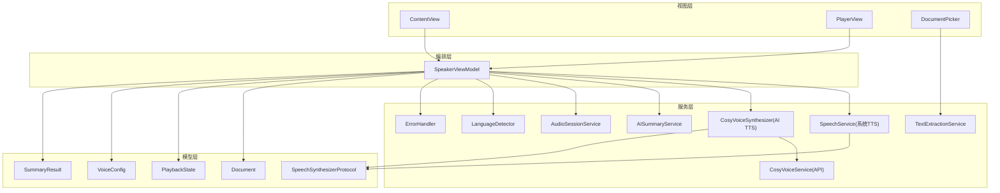
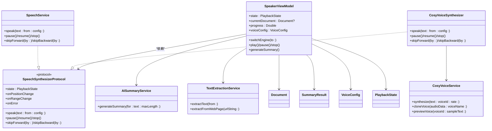
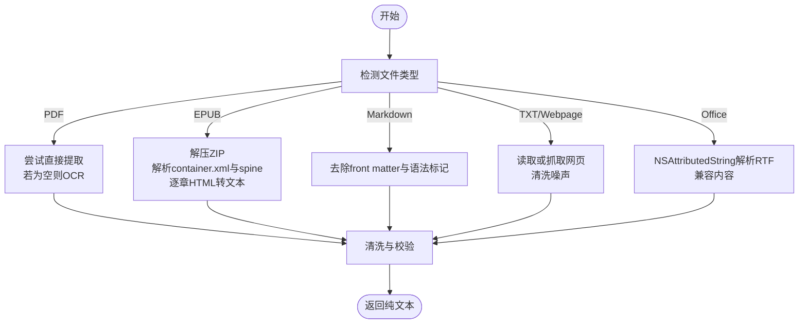
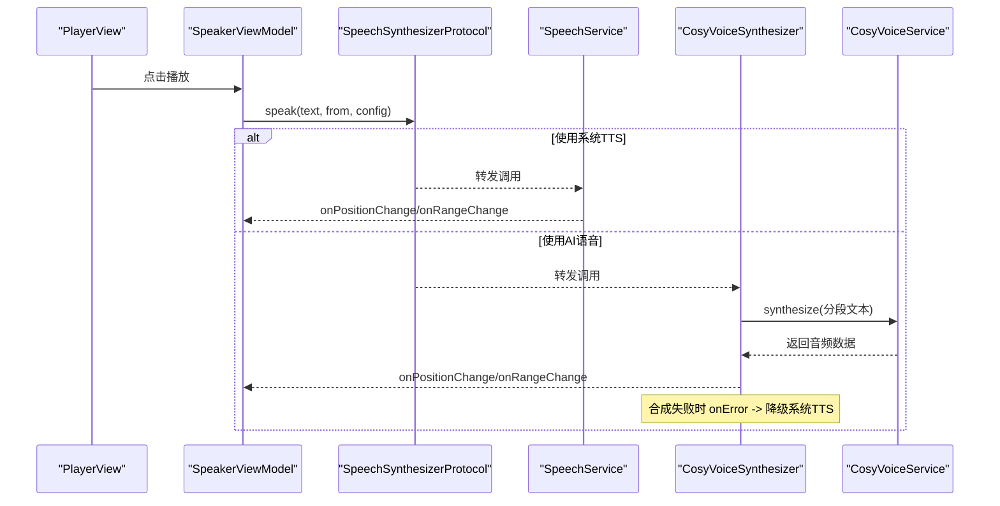
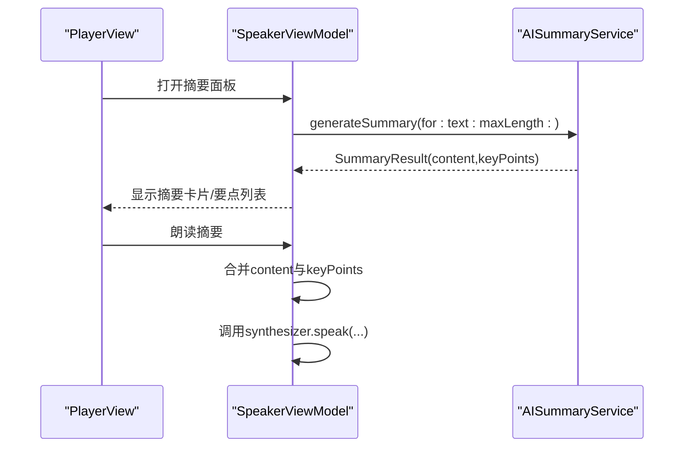
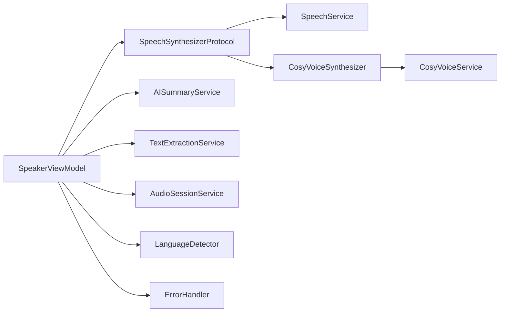

# 核心功能模块

<cite>
**本文引用的文件**   
- [TextExtractionService.swift](file://Services/TextExtractionService.swift)
- [SpeechService.swift](file://Services/SpeechService.swift)
- [CosyVoiceService.swift](file://Services/CosyVoiceService.swift)
- [CosyVoiceSynthesizer.swift](file://Services/CosyVoiceSynthesizer.swift)
- [AISummaryService.swift](file://Services/AISummaryService.swift)
- [AudioSessionService.swift](file://Services/AudioSessionService.swift)
- [LanguageDetector.swift](file://Services/LanguageDetector.swift)
- [ErrorHandler.swift](file://Services/ErrorHandler.swift)
- [SpeakerViewModel.swift](file://ViewModels/SpeakerViewModel.swift)
- [Document.swift](file://Models/Document.swift)
- [SummaryResult.swift](file://Models/SummaryResult.swift)
- [VoiceConfig.swift](file://Models/VoiceConfig.swift)
- [PlaybackState.swift](file://Models/PlaybackState.swift)
- [SpeechSynthesizerProtocol.swift](file://Services/SpeechSynthesizerProtocol.swift)
- [ContentView.swift](file://Views/ContentView.swift)
- [PlayerView.swift](file://Views/PlayerView.swift)
- [DocumentPicker.swift](file://UIKit/DocumentPicker.swift)
</cite>

## 目录
1. [简介](#简介)
2. [项目结构](#项目结构)
3. [核心组件](#核心组件)
4. [架构总览](#架构总览)
5. [详细组件分析](#详细组件分析)
6. [依赖关系分析](#依赖关系分析)
7. [性能与优化](#性能与优化)
8. [故障排查指南](#故障排查指南)
9. [结论](#结论)
10. [附录：配置与最佳实践](#附录配置与最佳实践)

## 简介
本文件面向开发者，系统化梳理 Knowledge 应用的核心功能模块，包括：
- 文档处理系统：多格式文本提取（PDF、EPUB、Markdown、纯文本、网页、Office 文档）
- 语音合成系统：系统 TTS 与 AI 语音（阿里云 CosyVoice），支持预设音色与语音克隆
- AI 摘要功能：基于通义千问的文档摘要生成与朗读
同时说明各模块间的协作关系、数据流转、错误处理、配置项与性能优化策略，并提供可操作的扩展建议。

## 项目结构
Knowledge 采用分层组织方式：
- Models：领域模型（文档、播放状态、语音配置、摘要结果）
- Services：核心服务（文本提取、TTS、AI 摘要、音频会话、语言检测、错误处理）
- ViewModels：编排层（SpeakerViewModel 作为门面协调 UI 与服务）
- Views：UI 界面（内容页、播放器、设置等）
- UIKit：原生选择器封装（文档选择）

图表来源
- [ContentView.swift:1-98](file://Views/ContentView.swift#L1-L98)
- [PlayerView.swift:1-174](file://Views/PlayerView.swift#L1-L174)
- [DocumentPicker.swift:1-48](file://UIKit/DocumentPicker.swift#L1-L48)
- [SpeakerViewModel.swift:1-314](file://ViewModels/SpeakerViewModel.swift#L1-L314)
- [TextExtractionService.swift:1-748](file://Services/TextExtractionService.swift#L1-L748)
- [SpeechService.swift:1-155](file://Services/SpeechService.swift#L1-L155)
- [CosyVoiceSynthesizer.swift:1-258](file://Services/CosyVoiceSynthesizer.swift#L1-L258)
- [CosyVoiceService.swift:1-219](file://Services/CosyVoiceService.swift#L1-L219)
- [AISummaryService.swift:1-180](file://Services/AISummaryService.swift#L1-L180)
- [AudioSessionService.swift:1-46](file://Services/AudioSessionService.swift#L1-L46)
- [LanguageDetector.swift:1-83](file://Services/LanguageDetector.swift#L1-L83)
- [ErrorHandler.swift:1-53](file://Services/ErrorHandler.swift#L1-L53)
- [Document.swift:1-115](file://Models/Document.swift#L1-L115)
- [PlaybackState.swift:1-9](file://Models/PlaybackState.swift#L1-L9)
- [VoiceConfig.swift:1-52](file://Models/VoiceConfig.swift#L1-L52)
- [SummaryResult.swift:1-33](file://Models/SummaryResult.swift#L1-L33)
- [SpeechSynthesizerProtocol.swift:1-20](file://Services/SpeechSynthesizerProtocol.swift#L1-L20)

章节来源
- [ContentView.swift:1-98](file://Views/ContentView.swift#L1-L98)
- [PlayerView.swift:1-174](file://Views/PlayerView.swift#L1-L174)
- [DocumentPicker.swift:1-48](file://UIKit/DocumentPicker.swift#L1-L48)
- [SpeakerViewModel.swift:1-314](file://ViewModels/SpeakerViewModel.swift#L1-L314)

## 核心组件
- 文档处理系统（TextExtractionService）
  - 支持 PDF（含 OCR）、EPUB（ZIP 解压 + OPF 解析）、Markdown、纯文本、网页正文提取、Office 文档（docx/xlsx/pptx）
  - 网页提取包含标题获取、正文区域定位、HTML 清洗与噪声过滤
  - Office 文档通过 NSAttributedString 解析 RTF 兼容内容
- 语音合成系统
  - 系统 TTS（SpeechService）：基于 AVSpeechSynthesizer，提供分段朗读、位置回调、范围高亮
  - AI 语音（CosyVoiceSynthesizer + CosyVoiceService）：调用阿里云 DashScope CosyVoice API，支持预设音色与语音克隆；长文本自动分段合成并拼接播放
- AI 摘要（AISummaryService）
  - 调用通义千问生成“摘要+要点”，返回结构化结果（SummaryResult）
- 辅助能力
  - 音频会话管理（AudioSessionService）
  - 语言检测与语音匹配（LanguageDetector）
  - 全局错误处理（ErrorHandler）
  - 统一播放协议（SpeechSynthesizerProtocol）

章节来源
- [TextExtractionService.swift:1-748](file://Services/TextExtractionService.swift#L1-L748)
- [SpeechService.swift:1-155](file://Services/SpeechService.swift#L1-L155)
- [CosyVoiceService.swift:1-219](file://Services/CosyVoiceService.swift#L1-L219)
- [CosyVoiceSynthesizer.swift:1-258](file://Services/CosyVoiceSynthesizer.swift#L1-L258)
- [AISummaryService.swift:1-180](file://Services/AISummaryService.swift#L1-L180)
- [AudioSessionService.swift:1-46](file://Services/AudioSessionService.swift#L1-L46)
- [LanguageDetector.swift:1-83](file://Services/LanguageDetector.swift#L1-L83)
- [ErrorHandler.swift:1-53](file://Services/ErrorHandler.swift#L1-L53)
- [SpeechSynthesizerProtocol.swift:1-20](file://Services/SpeechSynthesizerProtocol.swift#L1-L20)

## 架构总览
整体采用“视图 → 编排（ViewModel）→ 服务”的分层架构，并通过协议抽象实现引擎可插拔。

图表来源
- [SpeakerViewModel.swift:1-314](file://ViewModels/SpeakerViewModel.swift#L1-L314)
- [SpeechSynthesizerProtocol.swift:1-20](file://Services/SpeechSynthesizerProtocol.swift#L1-L20)
- [SpeechService.swift:1-155](file://Services/SpeechService.swift#L1-L155)
- [CosyVoiceSynthesizer.swift:1-258](file://Services/CosyVoiceSynthesizer.swift#L1-L258)
- [CosyVoiceService.swift:1-219](file://Services/CosyVoiceService.swift#L1-L219)
- [AISummaryService.swift:1-180](file://Services/AISummaryService.swift#L1-L180)
- [TextExtractionService.swift:1-748](file://Services/TextExtractionService.swift#L1-L748)
- [Document.swift:1-115](file://Models/Document.swift#L1-L115)
- [SummaryResult.swift:1-33](file://Models/SummaryResult.swift#L1-L33)
- [VoiceConfig.swift:1-52](file://Models/VoiceConfig.swift#L1-L52)
- [PlaybackState.swift:1-9](file://Models/PlaybackState.swift#L1-L9)

## 详细组件分析

### 文档处理系统（多格式文本提取）
- 入口方法
  - extractText(from:)：根据扩展名路由到具体解析器，最终返回纯文本
  - extractFromWebPage(urlString:)：异步抓取网页，提取标题与正文，清洗噪声
- 关键流程
  - PDF：优先直接提取文字，若为空则启用 Vision OCR 识别
  - EPUB：ZIP 解压 → 读取 container.xml → 解析 spine 顺序 → 逐章 HTML 转文本
  - Markdown：去除 front matter 与语法标记，保留纯文本
  - Office：NSAttributedString 解析 RTF 兼容内容
  - 网页：正则/标签匹配定位正文区域，NSAttributedString 渲染为文本，后处理清洗
- 错误处理
  - 定义 ExtractionError，区分不支持类型、未找到、提取失败等场景
- 复杂度与性能
  - PDF OCR 耗时较高，建议在后台任务执行并提示进度
  - EPUB 解压与逐章解析需控制内存占用，避免超大文件

图表来源
- [TextExtractionService.swift:27-53](file://Services/TextExtractionService.swift#L27-L53)
- [TextExtractionService.swift:58-114](file://Services/TextExtractionService.swift#L58-L114)
- [TextExtractionService.swift:348-426](file://Services/TextExtractionService.swift#L348-L426)
- [TextExtractionService.swift:509-592](file://Services/TextExtractionService.swift#L509-L592)
- [TextExtractionService.swift:430-495](file://Services/TextExtractionService.swift#L430-L495)
- [TextExtractionService.swift:712-732](file://Services/TextExtractionService.swift#L712-L732)

章节来源
- [TextExtractionService.swift:1-748](file://Services/TextExtractionService.swift#L1-L748)

### 语音合成系统（系统 TTS 与 AI 语音）
- 系统 TTS（SpeechService）
  - 基于 AVSpeechSynthesizer，按自然断点切分段落，回调当前位置与范围
  - 支持暂停、继续、停止、快进/后退
- AI 语音（CosyVoiceSynthesizer + CosyVoiceService）
  - 长文本自动分段（≤500字符），并行/串行合成并拼接播放
  - 支持预设音色与克隆音色，失败时触发降级到系统 TTS
- 统一协议（SpeechSynthesizerProtocol）
  - 屏蔽底层差异，便于切换与测试

图表来源
- [SpeakerViewModel.swift:108-117](file://ViewModels/SpeakerViewModel.swift#L108-L117)
- [SpeechService.swift:30-72](file://Services/SpeechService.swift#L30-L72)
- [CosyVoiceSynthesizer.swift:28-51](file://Services/CosyVoiceSynthesizer.swift#L28-L51)
- [CosyVoiceService.swift:27-88](file://Services/CosyVoiceService.swift#L27-L88)

章节来源
- [SpeechService.swift:1-155](file://Services/SpeechService.swift#L1-L155)
- [CosyVoiceSynthesizer.swift:1-258](file://Services/CosyVoiceSynthesizer.swift#L1-L258)
- [CosyVoiceService.swift:1-219](file://Services/CosyVoiceService.swift#L1-L219)
- [SpeechSynthesizerProtocol.swift:1-20](file://Services/SpeechSynthesizerProtocol.swift#L1-L20)

### AI 摘要功能
- 生成流程
  - 构建提示词（限制长度、要求摘要+要点）
  - 调用通义千问接口，解析 JSON 响应，提取【摘要】与【要点】
  - 返回 SummaryResult，支持持久化缓存
- 集成
  - ViewModel 负责状态管理与 UI 交互，错误信息通过 ErrorHandler 展示

图表来源
- [AISummaryService.swift:25-34](file://Services/AISummaryService.swift#L25-L34)
- [AISummaryService.swift:109-153](file://Services/AISummaryService.swift#L109-L153)
- [SpeakerViewModel.swift:175-211](file://ViewModels/SpeakerViewModel.swift#L175-L211)

章节来源
- [AISummaryService.swift:1-180](file://Services/AISummaryService.swift#L1-L180)
- [SummaryResult.swift:1-33](file://Models/SummaryResult.swift#L1-L33)
- [SpeakerViewModel.swift:175-211](file://ViewModels/SpeakerViewModel.swift#L175-L211)

### 语言检测与语音匹配
- 基于 NSLinguisticTagger 检测主导语言
- 将检测结果映射到系统语音语言代码，并选择高质量语音（enhanced/premium/默认）
- 若无可用语音或不在支持列表，保持当前配置

章节来源
- [LanguageDetector.swift:1-83](file://Services/LanguageDetector.swift#L1-L83)

### 音频会话管理
- 统一配置 playback/spokenAudio，支持蓝牙与 AirPlay
- 在播放前激活，停止后停用，避免与其他音频冲突

章节来源
- [AudioSessionService.swift:1-46](file://Services/AudioSessionService.swift#L1-L46)

### 错误处理
- 全局 ErrorHandler 提供弹窗与日志输出
- 各服务定义本地化错误类型，便于上层统一处理与用户提示

章节来源
- [ErrorHandler.swift:1-53](file://Services/ErrorHandler.swift#L1-L53)
- [CosyVoiceService.swift:191-218](file://Services/CosyVoiceService.swift#L191-L218)
- [AISummaryService.swift:158-179](file://Services/AISummaryService.swift#L158-L179)
- [TextExtractionService.swift:10-25](file://Services/TextExtractionService.swift#L10-L25)

## 依赖关系分析
- 耦合与内聚
  - SpeakerViewModel 作为门面，聚合多个服务，职责清晰
  - 语音引擎通过协议解耦，易于替换与测试
- 外部依赖
  - AVFoundation（TTS、音频播放、会话）
  - PDFKit、Vision（PDF 与 OCR）
  - URLSession（网络请求）
  - UserDefaults（配置与 API Key）
- 潜在循环依赖
  - 当前未见循环引用，服务间单向依赖

图表来源
- [SpeakerViewModel.swift:1-314](file://ViewModels/SpeakerViewModel.swift#L1-L314)
- [SpeechSynthesizerProtocol.swift:1-20](file://Services/SpeechSynthesizerProtocol.swift#L1-L20)
- [SpeechService.swift:1-155](file://Services/SpeechService.swift#L1-L155)
- [CosyVoiceSynthesizer.swift:1-258](file://Services/CosyVoiceSynthesizer.swift#L1-L258)
- [CosyVoiceService.swift:1-219](file://Services/CosyVoiceService.swift#L1-L219)
- [AISummaryService.swift:1-180](file://Services/AISummaryService.swift#L1-L180)
- [TextExtractionService.swift:1-748](file://Services/TextExtractionService.swift#L1-L748)
- [AudioSessionService.swift:1-46](file://Services/AudioSessionService.swift#L1-L46)
- [LanguageDetector.swift:1-83](file://Services/LanguageDetector.swift#L1-L83)
- [ErrorHandler.swift:1-53](file://Services/ErrorHandler.swift#L1-L53)

## 性能与优化
- 文本提取
  - PDF OCR 仅在无文字时触发，避免不必要的计算
  - EPUB 解析按需加载章节，注意临时目录清理
  - 网页提取优先定位正文区域，减少后续清洗成本
- 语音合成
  - 系统 TTS 分段长度约 500 字符，结合标点断句提升连贯性
  - AI 语音分段合成，段间增加延迟避免限流；失败自动降级
- 播放体验
  - 使用 Timer 定时更新位置，平滑滚动与高亮
  - 估算时间戳用于 UI 显示，降低频繁换算开销
- 资源管理
  - 及时释放合成临时文件与播放器实例
  - 合理设置超时与重试策略

[本节为通用指导，不直接分析具体文件]

## 故障排查指南
- 常见问题
  - API Key 缺失或无效：检查设置中是否已配置 dashscope_api_key
  - 网络异常：确认网络连通性与服务器状态
  - 音频会话冲突：确保在合适时机 activate/deactivate
  - 网页无法提取正文：检查目标站点结构与反爬策略
- 定位步骤
  - 查看 ErrorHandler 弹窗与控制台日志
  - 检查各服务的错误枚举描述，快速定位原因
  - 对 AI 语音失败进行降级验证（切换系统 TTS）

章节来源
- [ErrorHandler.swift:21-35](file://Services/ErrorHandler.swift#L21-L35)
- [CosyVoiceService.swift:191-218](file://Services/CosyVoiceService.swift#L191-L218)
- [AISummaryService.swift:158-179](file://Services/AISummaryService.swift#L158-L179)
- [AudioSessionService.swift:14-44](file://Services/AudioSessionService.swift#L14-L44)

## 结论
Knowledge 的核心模块以清晰的层次与协议抽象实现了可扩展的文档处理、双引擎语音合成与 AI 摘要能力。通过统一的错误处理与完善的配置选项，系统在易用性与稳定性之间取得平衡。开发者可在现有基础上进一步扩展新引擎、增强文本清洗规则或优化 AI 提示词以获得更好的用户体验。

[本节为总结性内容，不直接分析具体文件]

## 附录：配置与最佳实践
- 配置项
  - 阿里云 API Key：dashscope_api_key（用于 AI 语音与摘要）
  - 语音配置（VoiceConfig）：语速、音高、音量、语言、引擎选择、预设/克隆音色 ID
- 最佳实践
  - 大文件处理：在后台任务中进行文本提取与 AI 合成，提供进度反馈
  - 错误恢复：AI 语音失败自动降级系统 TTS，保证可用性
  - 用户体验：高亮跟随与自动滚动，提升阅读沉浸感
  - 资源清理：及时释放临时文件与播放器，避免内存泄漏
- 参考路径
  - 配置读写：[SpeakerViewModel.swift:302-312](file://ViewModels/SpeakerViewModel.swift#L302-L312)
  - 引擎切换：[SpeakerViewModel.swift:57-77](file://ViewModels/SpeakerViewModel.swift#L57-L77)
  - 语言检测：[LanguageDetector.swift:32-76](file://Services/LanguageDetector.swift#L32-L76)
  - 错误弹窗：[ErrorHandler.swift:21-35](file://Services/ErrorHandler.swift#L21-L35)

章节来源
- [VoiceConfig.swift:24-51](file://Models/VoiceConfig.swift#L24-L51)
- [SpeakerViewModel.swift:57-77](file://ViewModels/SpeakerViewModel.swift#L57-L77)
- [SpeakerViewModel.swift:302-312](file://ViewModels/SpeakerViewModel.swift#L302-L312)
- [LanguageDetector.swift:32-76](file://Services/LanguageDetector.swift#L32-L76)
- [ErrorHandler.swift:21-35](file://Services/ErrorHandler.swift#L21-L35)