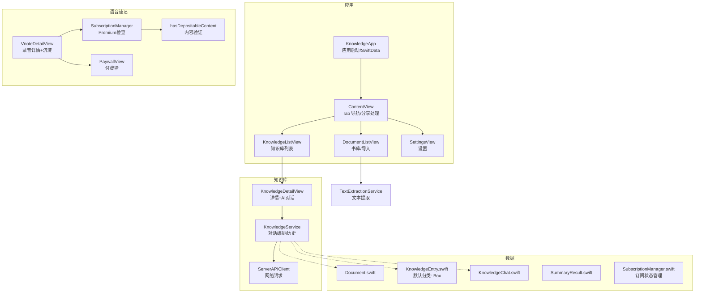
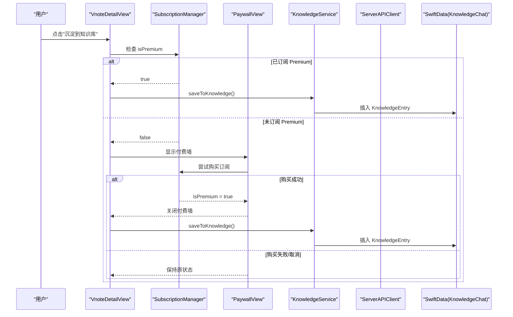
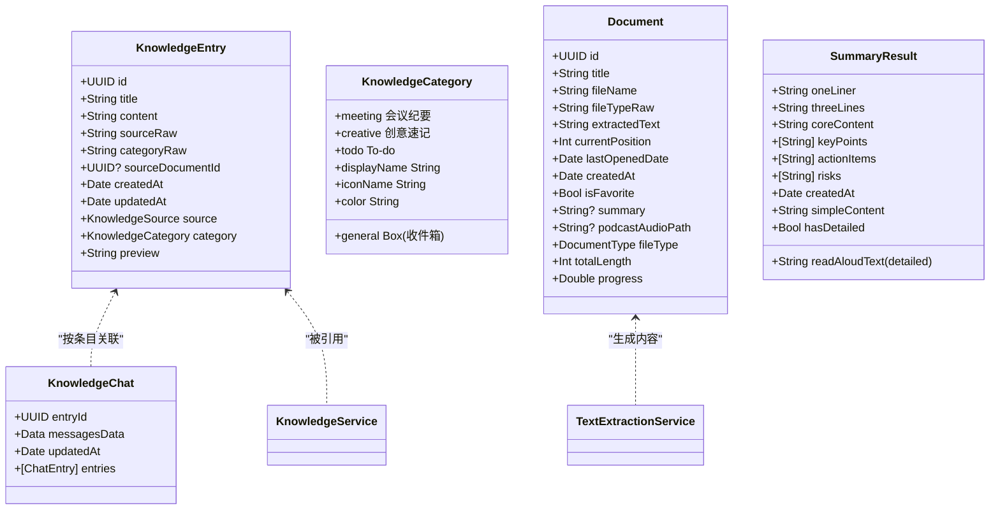
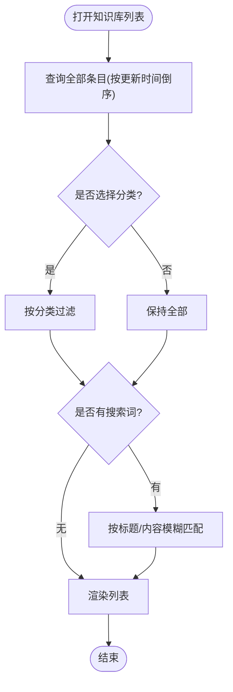
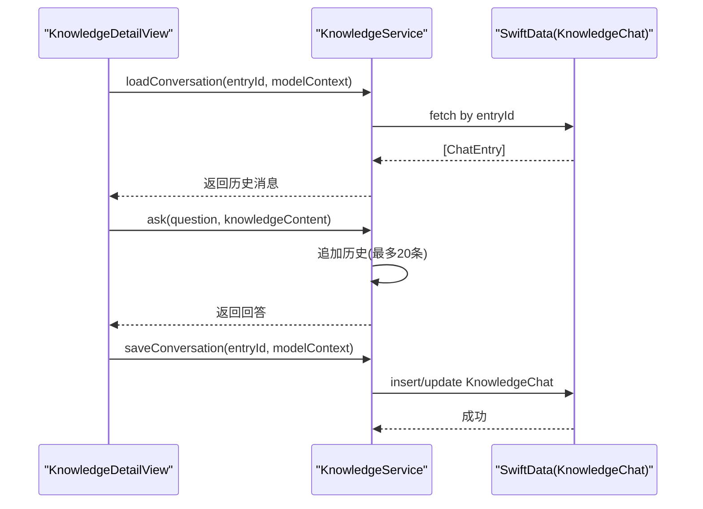
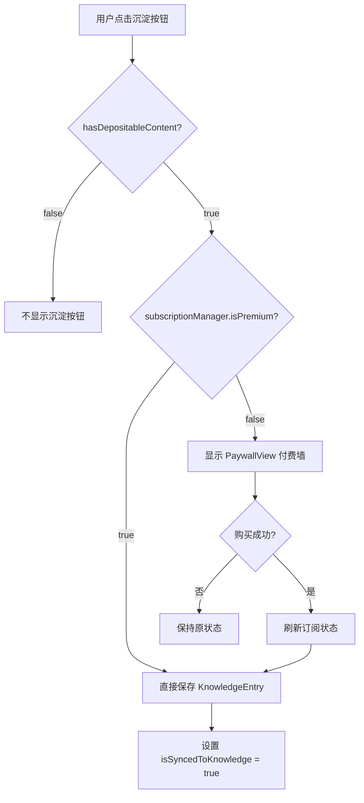
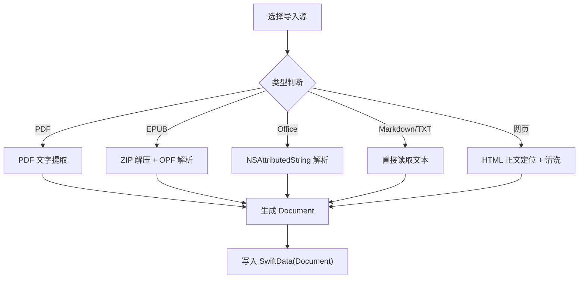
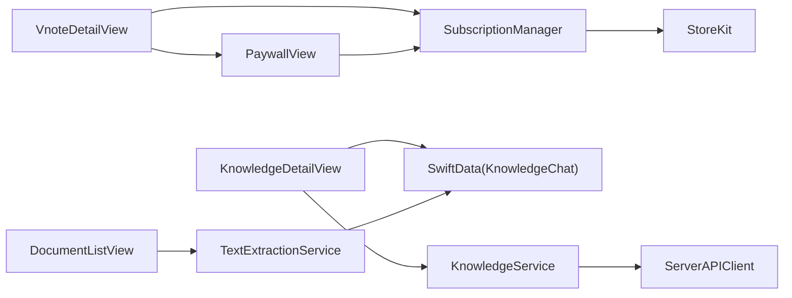

# 知识库功能

<cite>
**本文引用的文件**   
- [KnowledgeApp.swift](file://App/KnowledgeApp.swift)
- [AppDelegate.swift](file://App/AppDelegate.swift)
- [ContentView.swift](file://Views/ContentView.swift)
- [DocumentListView.swift](file://Views/DocumentListView.swift)
- [KnowledgeListView.swift](file://Views/KnowledgeListView.swift)
- [KnowledgeDetailView.swift](file://Views/KnowledgeDetailView.swift)
- [VnoteDetailView.swift](file://Views/VnoteDetailView.swift)
- [PaywallView.swift](file://Views/PaywallView.swift)
- [SubscriptionManager.swift](file://Services/SubscriptionManager.swift)
- [Document.swift](file://Models/Document.swift)
- [KnowledgeEntry.swift](file://Models/KnowledgeEntry.swift)
- [KnowledgeChat.swift](file://Models/KnowledgeChat.swift)
- [SummaryResult.swift](file://Models/SummaryResult.swift)
- [KnowledgeService.swift](file://Services/KnowledgeService.swift)
- [ServerAPIClient.swift](file://Services/ServerAPIClient.swift)
- [TextExtractionService.swift](file://Services/TextExtractionService.swift)
</cite>

## 更新摘要
**变更内容**   
- 新增 Premium 订阅要求：知识库沉淀功能需要 Premium 订阅权限，通过 SubscriptionManager.shared.isPremium 检查权限
- 集成付费墙系统：未订阅用户点击沉淀按钮时显示 PaywallView() 付费墙界面
- 增强内容验证：添加 hasDepositableContent 计算属性，防止空内容沉淀到知识库
- 知识分类重构：默认分类从"知识笔记"重命名为"Box"（收件箱），图标从 book.fill 改为 tray.fill
- 改进用户体验：更好的收件箱风格分类表示，适用于未分类内容的统一管理

## 目录
1. [简介](#简介)
2. [项目结构](#项目结构)
3. [核心组件](#核心组件)
4. [架构总览](#架构总览)
5. [详细组件分析](#详细组件分析)
6. [依赖关系分析](#依赖关系分析)
7. [性能与体验优化建议](#性能与体验优化建议)
8. [故障排查指南](#故障排查指南)
9. [结论](#结论)

## 简介
本仓库实现了一个"知识库"能力：从文档、网页、语音速记等来源沉淀知识条目，支持分类筛选与搜索；在知识条目详情页提供基于该条目的 AI 对话能力，并通过服务器中转调用大模型。数据层采用 SwiftData 持久化，UI 使用 SwiftUI 构建，整体遵循 MVVM + Service 的分层组织方式。**新增 Premium 订阅机制**，知识库沉淀功能需要付费订阅权限，同时改进了知识分类系统，将默认分类重命名为"Box"（收件箱）以更好地表示未分类内容的统一管理。

## 项目结构
- App 入口与全局配置
  - KnowledgeApp：应用启动、SwiftData 容器初始化、主题注入
  - AppDelegate：音频会话基础配置（按需激活）
- 视图层（SwiftUI）
  - ContentView：底部 Tab 导航，集成分享处理与错误提示
  - DocumentListView：书库列表、导入文件/网页、继续收听
  - KnowledgeListView：知识库列表、分类筛选、搜索
  - KnowledgeDetailView：知识详情、AI 对话输入与消息展示
  - VnoteDetailView：语音速记详情、AI 整理内容、转写文本、**知识库沉淀（需 Premium）**
  - PaywallView：**付费墙界面**，展示 Premium 功能列表和购买选项
- 模型层（SwiftData）
  - Document：文档实体（含摘要、播放进度等）
  - KnowledgeEntry：知识条目（来源、分类、时间戳等），**默认分类为 Box（收件箱）**
  - KnowledgeChat：按知识条目存储的对话历史
  - SummaryResult：AI 摘要结果结构体（简版/详版）
- 服务层
  - TextExtractionService：多格式文本提取（PDF/EPUB/Office/Markdown/网页等）
  - ServerAPIClient：统一网络请求封装（总结、伴读对话、TTS、语音克隆）
  - KnowledgeService：知识库 AI 对话编排（系统提示词、上下文拼装、历史管理、持久化）
  - **SubscriptionManager：Premium 订阅管理，包含 isPremium 状态检查和免费次数限制**

**图表来源**
- [KnowledgeApp.swift:10-27](file://App/KnowledgeApp.swift#L10-L27)
- [ContentView.swift:16-26](file://Views/ContentView.swift#L16-L26)
- [DocumentListView.swift:19-110](file://Views/DocumentListView.swift#L19-L110)
- [KnowledgeListView.swift:12-39](file://Views/KnowledgeListView.swift#L12-L39)
- [KnowledgeDetailView.swift:19-52](file://Views/KnowledgeDetailView.swift#L19-L52)
- [VnoteDetailView.swift:218-260](file://Views/VnoteDetailView.swift#L218-L260)
- [PaywallView.swift:1-184](file://Views/PaywallView.swift#L1-184)
- [SubscriptionManager.swift:1-166](file://Services/SubscriptionManager.swift#L1-L166)
- [KnowledgeService.swift:8-16](file://Services/KnowledgeService.swift#L8-L16)
- [ServerAPIClient.swift:6-21](file://Services/ServerAPIClient.swift#L6-L21)
- [TextExtractionService.swift:8-53](file://Services/TextExtractionService.swift#L8-L53)

章节来源
- [KnowledgeApp.swift:10-27](file://App/KnowledgeApp.swift#L10-L27)
- [ContentView.swift:16-26](file://Views/ContentView.swift#L16-L26)

## 核心组件
- 知识库数据模型
  - KnowledgeEntry：知识条目，包含标题、正文、来源类型、AI 分类、创建/更新时间等，并提供预览计算属性
  - KnowledgeChat：按知识条目维度保存对话历史，内部以 JSON 编码消息数组
  - **KnowledgeCategory：知识分类枚举，包含 meeting（会议纪要）、creative（创意速记）、todo（To-do）、general（Box收件箱）**
- 知识库服务
  - KnowledgeService：单例，负责组装系统提示词、调用服务端伴读接口、维护本地对话历史并持久化到 SwiftData
- 订阅管理系统
  - **SubscriptionManager：Premium 订阅管理器，提供 isPremium 状态检查、免费次数限制、产品加载和购买功能**
  - **PaywallView：付费墙界面，展示 Premium 功能列表和订阅选项**
- 网络客户端
  - ServerAPIClient：封装 POST 请求、响应校验、字段抽取、错误映射；支持总结、伴读对话、TTS、语音克隆
- 文本提取
  - TextExtractionService：统一入口 extractText(from:)，根据扩展名分发至 PDF/EPUB/Office/Markdown/网页等解析器；网页提取具备正文定位与噪声清洗
- UI 页面
  - KnowledgeListView：列表渲染、分类筛选、搜索、删除
  - KnowledgeDetailView：内容展示、快捷提问、聊天气泡、发送/清空/删除操作
  - **VnoteDetailView：语音速记详情，包含 hasDepositableContent 验证和 Premium 权限检查的知识库沉淀功能**

**章节来源**
- [KnowledgeEntry.swift:63-112](file://Models/KnowledgeEntry.swift#L63-L112)
- [KnowledgeEntry.swift:28-61](file://Models/KnowledgeEntry.swift#L28-L61)
- [KnowledgeChat.swift:6-26](file://Models/KnowledgeChat.swift#L6-L26)
- [KnowledgeService.swift:8-113](file://Services/KnowledgeService.swift#L8-L113)
- [SubscriptionManager.swift:1-166](file://Services/SubscriptionManager.swift#L1-L166)
- [PaywallView.swift:1-184](file://Views/PaywallView.swift#L1-184)
- [ServerAPIClient.swift:6-208](file://Services/ServerAPIClient.swift#L6-L208)
- [TextExtractionService.swift:8-53](file://Services/TextExtractionService.swift#L8-L53)
- [KnowledgeListView.swift:12-61](file://Views/KnowledgeListView.swift#L12-L61)
- [KnowledgeDetailView.swift:19-52](file://Views/KnowledgeDetailView.swift#L19-L52)
- [VnoteDetailView.swift:218-260](file://Views/VnoteDetailView.swift#L218-L260)

## 架构总览
知识库功能的端到端流程如下：用户在"书库"导入文档或网页，经文本提取后形成文档；后续可沉淀为"知识条目"。在"知识库"列表中查看条目，进入详情页后可发起基于该条目的 AI 对话。**新增的 Premium 订阅机制**确保只有付费用户才能进行知识库沉淀操作，未订阅用户会看到付费墙界面。对话由 KnowledgeService 编排，通过 ServerAPIClient 转发至后端，返回结果后更新 UI 并持久化对话历史。

**图表来源**
- [VnoteDetailView.swift:236-260](file://Views/VnoteDetailView.swift#L236-L260)
- [SubscriptionManager.swift:95-108](file://Services/SubscriptionManager.swift#L95-L108)
- [PaywallView.swift:163-178](file://Views/PaywallView.swift#L163-L178)
- [VnoteDetailView.swift:322-333](file://Views/VnoteDetailView.swift#L322-L333)

## 详细组件分析

### 数据模型与关系
- KnowledgeEntry
  - 关键字段：id、title、content、sourceRaw、categoryRaw、sourceDocumentId、createdAt、updatedAt
  - 计算属性：source、category、preview（前 100 字）
  - **默认分类：.general（Box 收件箱）**
- KnowledgeCategory
  - **分类类型：meeting（会议纪要）、creative（创意速记）、todo（To-do）、general（Box收件箱）**
  - **图标映射：person.2.fill、lightbulb.fill、checklist、tray.fill**
  - **颜色映射：blue、orange、green、gray**
- KnowledgeChat
  - 关键字段：entryId、messagesData(JSON)、updatedAt
  - 计算属性：entries（解码/编码消息数组）
- Document
  - 关键字段：id、title、fileName、fileTypeRaw、extractedText、currentPosition、lastOpenedDate、createdAt、isFavorite、summary、podcastAudioPath
  - 计算属性：fileType、totalLength、progress
- SummaryResult
  - 用于结构化存储 AI 摘要（一句话、三句话、核心内容、要点、行动项、风险等），并提供朗读文本拼接逻辑

**图表来源**
- [KnowledgeEntry.swift:63-112](file://Models/KnowledgeEntry.swift#L63-L112)
- [KnowledgeEntry.swift:28-61](file://Models/KnowledgeEntry.swift#L28-L61)
- [KnowledgeChat.swift:6-26](file://Models/KnowledgeChat.swift#L6-L26)
- [Document.swift:54-114](file://Models/Document.swift#L54-L114)
- [SummaryResult.swift:5-89](file://Models/SummaryResult.swift#L5-L89)

**章节来源**
- [KnowledgeEntry.swift:63-112](file://Models/KnowledgeEntry.swift#L63-L112)
- [KnowledgeEntry.swift:28-61](file://Models/KnowledgeEntry.swift#L28-L61)
- [KnowledgeChat.swift:6-26](file://Models/KnowledgeChat.swift#L6-L26)
- [Document.swift:54-114](file://Models/Document.swift#L54-L114)
- [SummaryResult.swift:5-89](file://Models/SummaryResult.swift#L5-L89)

### 知识库列表与筛选
- 列表加载：按 updatedAt 倒序查询所有 KnowledgeEntry
- 筛选与搜索：支持按分类过滤、按标题/内容全文模糊匹配
- 交互：删除条目、空态引导、行内显示来源图标与分类标签、相对时间
- **分类显示：Box（收件箱）作为默认分类，使用 tray.fill 图标和灰色背景**

**图表来源**
- [KnowledgeListView.swift:8-61](file://Views/KnowledgeListView.swift#L8-L61)

**章节来源**
- [KnowledgeListView.swift:12-61](file://Views/KnowledgeListView.swift#L12-L61)

### 知识详情与 AI 对话
- 页面职责：展示知识正文、头部元信息、AI 对话区（欢迎语、快捷提问、消息气泡、输入栏）
- 对话流程：
  - 加载历史：按 entryId 读取 KnowledgeChat，转换为内存历史
  - 发送问题：插入用户消息与占位，异步调用 KnowledgeService.ask
  - 接收回复：替换占位消息，保存对话历史，重置请求状态
  - 清理：清空当前对话并删除持久化记录

**图表来源**
- [KnowledgeDetailView.swift:216-245](file://Views/KnowledgeDetailView.swift#L216-L245)
- [KnowledgeService.swift:52-76](file://Services/KnowledgeService.swift#L52-L76)
- [ServerAPIClient.swift:37-45](file://Services/ServerAPIClient.swift#L37-L45)
- [KnowledgeService.swift:91-102](file://Services/KnowledgeService.swift#L91-L102)

**章节来源**
- [KnowledgeDetailView.swift:19-52](file://Views/KnowledgeDetailView.swift#L19-L52)
- [KnowledgeDetailView.swift:216-245](file://Views/KnowledgeDetailView.swift#L216-L245)
- [KnowledgeService.swift:52-76](file://Services/KnowledgeService.swift#L52-L76)
- [KnowledgeService.swift:81-102](file://Services/KnowledgeService.swift#L81-L102)

### 语音速记与知识库沉淀（Premium 功能）
- **内容验证**：hasDepositableContent 计算属性确保只有当转录文本或 AI 整理内容不为空时才显示沉淀按钮
- **权限检查**：点击沉淀按钮时检查 subscriptionManager.isPremium 状态
- **付费墙集成**：未订阅用户显示 PaywallView() 付费墙界面
- **沉淀逻辑**：创建 KnowledgeEntry 对象，设置来源为 .vnote，分类继承自 VnoteEntry.category
- **状态同步**：标记 entry.isSyncedToKnowledge = true 并更新时间戳

**图表来源**
- [VnoteDetailView.swift:220-223](file://Views/VnoteDetailView.swift#L220-L223)
- [VnoteDetailView.swift:236-260](file://Views/VnoteDetailView.swift#L236-L260)
- [VnoteDetailView.swift:322-333](file://Views/VnoteDetailView.swift#L322-L333)
- [PaywallView.swift:163-178](file://Views/PaywallView.swift#L163-L178)

**章节来源**
- [VnoteDetailView.swift:218-260](file://Views/VnoteDetailView.swift#L218-L260)
- [VnoteDetailView.swift:322-333](file://Views/VnoteDetailView.swift#L322-L333)
- [PaywallView.swift:163-178](file://Views/PaywallView.swift#L163-L178)

### 文本提取与入库（与知识库的关系）
- 文本提取：支持 PDF（含 OCR 回退）、EPUB（ZIP 解压+OPF 解析）、Office（NSAttributedString）、Markdown、纯文本、网页（正文定位+噪声清洗）
- 入库路径：
  - 书库：导入文件/网页 → 生成 Document
  - 知识库：可从文档摘要沉淀或语音速记沉淀为 KnowledgeEntry（具体沉淀逻辑在其他模块中触发）

**图表来源**
- [TextExtractionService.swift:27-53](file://Services/TextExtractionService.swift#L27-L53)
- [TextExtractionService.swift:58-114](file://Services/TextExtractionService.swift#L58-L114)
- [TextExtractionService.swift:348-426](file://Services/TextExtractionService.swift#L348-L426)
- [TextExtractionService.swift:509-592](file://Services/TextExtractionService.swift#L509-L592)
- [TextExtractionService.swift:712-732](file://Services/TextExtractionService.swift#L712-L732)
- [DocumentListView.swift:235-275](file://Views/DocumentListView.swift#L235-L275)

**章节来源**
- [TextExtractionService.swift:27-53](file://Services/TextExtractionService.swift#L27-L53)
- [TextExtractionService.swift:58-114](file://Services/TextExtractionService.swift#L58-L114)
- [TextExtractionService.swift:348-426](file://Services/TextExtractionService.swift#L348-L426)
- [TextExtractionService.swift:509-592](file://Services/TextExtractionService.swift#L509-L592)
- [TextExtractionService.swift:712-732](file://Services/TextExtractionService.swift#L712-L732)
- [DocumentListView.swift:235-275](file://Views/DocumentListView.swift#L235-L275)

### 网络与错误处理
- 统一请求封装：POST JSON，超时控制，HTTP 状态码校验，兼容多种返回结构（result/content/output.choices.message.content）
- 错误枚举：未授权、配额超限、无效响应、无音频数据、服务器错误、网络错误
- 对话历史持久化：按条目维度增改 KnowledgeChat，避免重复插入

**章节来源**
- [ServerAPIClient.swift:112-178](file://Services/ServerAPIClient.swift#L112-L178)
- [ServerAPIClient.swift:183-207](file://Services/ServerAPIClient.swift#L183-L207)
- [KnowledgeService.swift:91-102](file://Services/KnowledgeService.swift#L91-L102)

### Premium 订阅管理
- **SubscriptionManager 单例**：管理 Premium 订阅状态，提供 isPremium 发布属性
- **免费次数限制**：每个 AI 功能提供 1 次免费体验机会
- **产品管理**：支持月订阅和年订阅产品 ID 配置
- **购买流程**：集成 StoreKit 2，支持购买、恢复购买和交易验证
- **付费墙界面**：展示所有 Premium 功能，包括知识库沉淀、AI 总结、伴读对话等

**章节来源**
- [SubscriptionManager.swift:1-166](file://Services/SubscriptionManager.swift#L1-L166)
- [PaywallView.swift:1-184](file://Views/PaywallView.swift#L1-184)

## 依赖关系分析
- 视图依赖服务：KnowledgeDetailView 依赖 KnowledgeService；KnowledgeListView 仅依赖 SwiftData
- **新增依赖**：VnoteDetailView 依赖 SubscriptionManager 和 PaywallView 进行权限检查和付费墙展示
- 服务依赖网络：KnowledgeService 依赖 ServerAPIClient
- 文本提取独立：TextExtractionService 不依赖 AI 服务，专注多格式解析
- 数据模型耦合：KnowledgeService 读写 KnowledgeChat；KnowledgeEntry 作为知识内容上下文传入 AI 服务

**图表来源**
- [KnowledgeDetailView.swift:216-245](file://Views/KnowledgeDetailView.swift#L216-L245)
- [KnowledgeService.swift:8-16](file://Services/KnowledgeService.swift#L8-L16)
- [ServerAPIClient.swift:6-21](file://Services/ServerAPIClient.swift#L6-L21)
- [VnoteDetailView.swift:11](file://Views/VnoteDetailView.swift#L11)
- [VnoteDetailView.swift:236-260](file://Views/VnoteDetailView.swift#L236-L260)
- [PaywallView.swift:7](file://Views/PaywallView.swift#L7)
- [DocumentListView.swift:235-275](file://Views/DocumentListView.swift#L235-L275)
- [TextExtractionService.swift:27-53](file://Services/TextExtractionService.swift#L27-L53)

**章节来源**
- [KnowledgeDetailView.swift:216-245](file://Views/KnowledgeDetailView.swift#L216-L245)
- [KnowledgeService.swift:8-16](file://Services/KnowledgeService.swift#L8-L16)
- [ServerAPIClient.swift:6-21](file://Services/ServerAPIClient.swift#L6-L21)
- [VnoteDetailView.swift:11](file://Views/VnoteDetailView.swift#L11)
- [VnoteDetailView.swift:236-260](file://Views/VnoteDetailView.swift#L236-L260)
- [PaywallView.swift:7](file://Views/PaywallView.swift#L7)
- [DocumentListView.swift:235-275](file://Views/DocumentListView.swift#L235-L275)
- [TextExtractionService.swift:27-53](file://Services/TextExtractionService.swift#L27-L53)

## 性能与体验优化建议
- 列表渲染
  - 对长文本预览进行截断（已实现），避免重绘开销
  - 列表项背景阴影与圆角适度使用，减少复杂图层叠加
- 网络请求
  - 合理设置超时（已配置），必要时增加重试与退避策略
  - 对大文本上下文做长度限制，避免超长导致响应慢或失败
- 对话历史
  - 保留最近若干轮（已实现），避免历史膨胀影响性能
- 文本提取
  - PDF OCR 耗时较长，建议在后台队列执行并反馈进度
  - EPUB 解压与 OPF 解析可考虑缓存中间结果
- **订阅管理**
  - 订阅状态检查应在应用启动时异步执行，避免阻塞主线程
  - 付费墙界面应预加载产品信息，提升用户体验

## 故障排查指南
- 无法获取 AI 回答
  - 检查网络连通性与服务器可达性
  - 查看错误类型：未授权/配额超限/服务器错误/网络错误
  - 确认服务端返回字段是否符合预期（result/content/output）
- 对话历史丢失
  - 确认 KnowledgeChat 是否正确按 entryId 查询与保存
  - 检查 ModelContext 是否及时 save()
- 文本提取失败
  - 确认文件类型是否受支持
  - 网页提取失败时检查链接有效性、编码识别与正文定位
  - PDF OCR 失败时检查图片质量与语言包
- **知识库沉淀失败**
  - 检查 SubscriptionManager.isPremium 状态是否正确
  - 确认 hasDepositableContent 计算属性返回值
  - 验证 PaywallView 是否正确显示和处理购买流程
  - 检查 KnowledgeEntry 创建时的分类和来源设置

**章节来源**
- [ServerAPIClient.swift:183-207](file://Services/ServerAPIClient.swift#L183-L207)
- [KnowledgeService.swift:81-102](file://Services/KnowledgeService.swift#L81-L102)
- [TextExtractionService.swift:27-53](file://Services/TextExtractionService.swift#L27-L53)
- [TextExtractionService.swift:58-114](file://Services/TextExtractionService.swift#L58-L114)
- [TextExtractionService.swift:348-426](file://Services/TextExtractionService.swift#L348-L426)
- [VnoteDetailView.swift:220-223](file://Views/VnoteDetailView.swift#L220-L223)
- [SubscriptionManager.swift:95-108](file://Services/SubscriptionManager.swift#L95-L108)

## 结论
知识库功能围绕"沉淀—检索—对话"的主线展开：通过多格式文本提取沉淀知识，以条目形式组织与检索，并在详情页提供基于上下文的 AI 对话能力。**新增的 Premium 订阅机制**为知识库沉淀功能提供了商业化支持，通过 SubscriptionManager 进行权限控制，结合 PaywallView 提供完整的购买流程。**知识分类系统的重构**将默认分类从"知识笔记"重命名为"Box"（收件箱），使用 tray.fill 图标更好地表示未分类内容的统一管理。整体架构清晰、职责分离良好，数据持久化与网络请求均有明确封装。后续可在稳定性（重试/降级）、性能（OCR/解压优化）与用户体验（加载反馈/错误引导）方面持续完善。