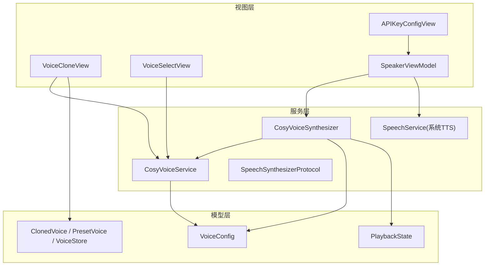
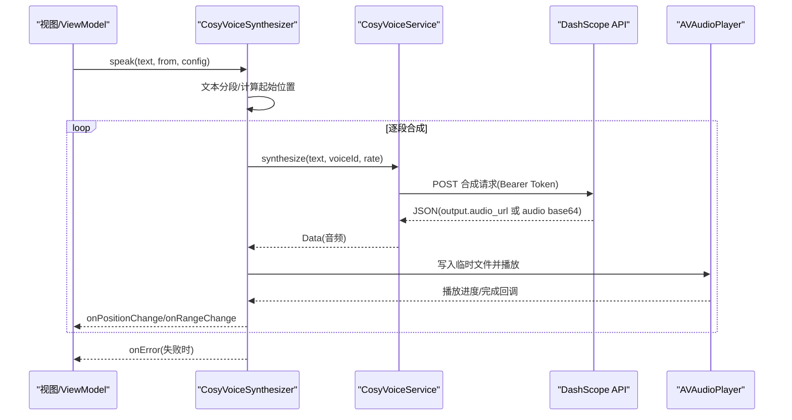
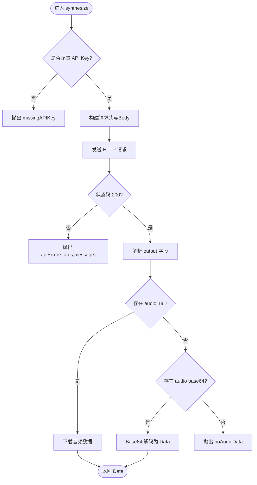
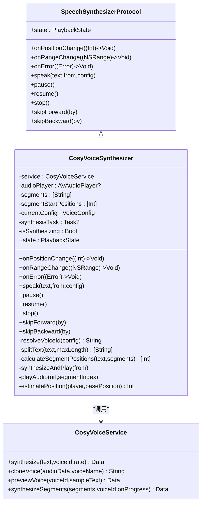
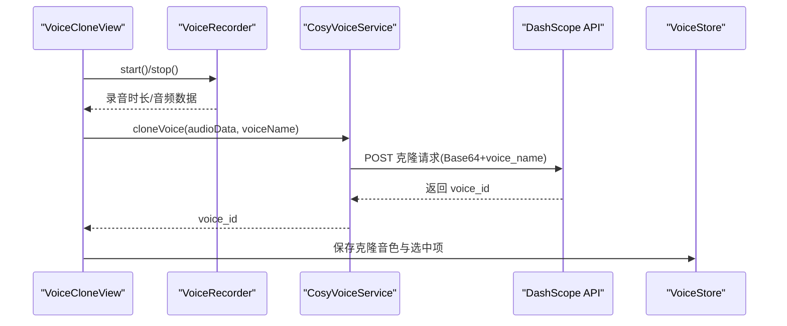
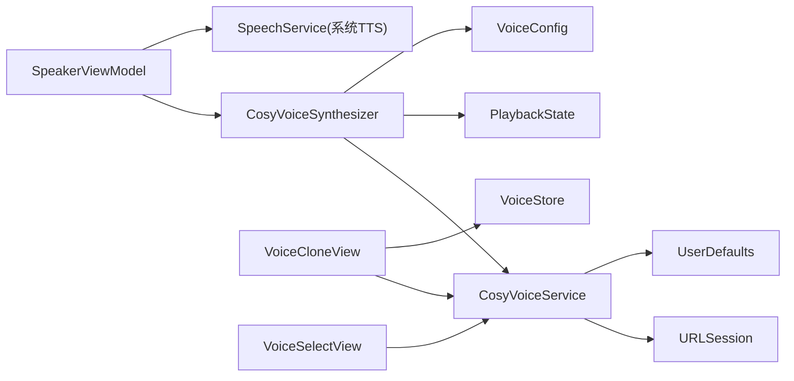

# CosyVoice AI 语音服务

<cite>
**本文引用的文件**
- [CosyVoiceService.swift](file://Services/CosyVoiceService.swift)
- [CosyVoiceSynthesizer.swift](file://Services/CosyVoiceSynthesizer.swift)
- [SpeechSynthesizerProtocol.swift](file://Services/SpeechSynthesizerProtocol.swift)
- [PlaybackState.swift](file://Models/PlaybackState.swift)
- [VoiceConfig.swift](file://Models/VoiceConfig.swift)
- [ClonedVoice.swift](file://Models/ClonedVoice.swift)
- [APIKeyConfigView.swift](file://Views/APIKeyConfigView.swift)
- [VoiceCloneView.swift](file://Views/VoiceCloneView.swift)
- [VoiceSelectView.swift](file://Views/VoiceSelectView.swift)
- [ErrorHandler.swift](file://Services/ErrorHandler.swift)
- [SpeakerViewModel.swift](file://ViewModels/SpeakerViewModel.swift)
</cite>

## 目录
1. [简介](#简介)
2. [项目结构](#项目结构)
3. [核心组件](#核心组件)
4. [架构总览](#架构总览)
5. [详细组件分析](#详细组件分析)
6. [依赖关系分析](#依赖关系分析)
7. [性能与优化](#性能与优化)
8. [故障排查指南](#故障排查指南)
9. [结论](#结论)
10. [附录](#附录)

## 简介
本文件面向开发者与产品使用者，系统性梳理 CosyVoice AI 语音服务的实现与协作方式。重点围绕以下目标：
- 深入解析 CosyVoiceService 与 CosyVoiceSynthesizer 的协作架构
- 说明如何通过阿里云 DashScope API 实现高级语音合成（预设音色、语音克隆）
- 详解 API Key 配置、请求构建、响应处理、错误与重试策略
- 阐述语音克隆原理、音色选择与情感控制等高级特性
- 提供网络请求优化、缓存策略与降级处理的落地方案

## 项目结构
本项目采用分层组织：
- Services：服务层封装网络与播放逻辑（CosyVoiceService、CosyVoiceSynthesizer、SpeechService 等）
- Models：数据模型与配置（VoiceConfig、ClonedVoice、PlaybackState 等）
- Views：UI 交互（APIKeyConfigView、VoiceCloneView、VoiceSelectView 等）
- ViewModels：业务编排与状态管理（SpeakerViewModel）

图表来源
- [CosyVoiceService.swift:1-219](file://Services/CosyVoiceService.swift#L1-L219)
- [CosyVoiceSynthesizer.swift:1-258](file://Services/CosyVoiceSynthesizer.swift#L1-L258)
- [SpeechSynthesizerProtocol.swift:1-20](file://Services/SpeechSynthesizerProtocol.swift#L1-L20)
- [VoiceConfig.swift:1-52](file://Models/VoiceConfig.swift#L1-L52)
- [ClonedVoice.swift:1-118](file://Models/ClonedVoice.swift#L1-L118)
- [APIKeyConfigView.swift:1-71](file://Views/APIKeyConfigView.swift#L1-L71)
- [VoiceCloneView.swift:1-404](file://Views/VoiceCloneView.swift#L1-L404)
- [VoiceSelectView.swift:1-215](file://Views/VoiceSelectView.swift#L1-L215)
- [SpeakerViewModel.swift:79-129](file://ViewModels/SpeakerViewModel.swift#L79-L129)

章节来源
- [CosyVoiceService.swift:1-219](file://Services/CosyVoiceService.swift#L1-L219)
- [CosyVoiceSynthesizer.swift:1-258](file://Services/CosyVoiceSynthesizer.swift#L1-L258)
- [SpeechSynthesizerProtocol.swift:1-20](file://Services/SpeechSynthesizerProtocol.swift#L1-L20)
- [VoiceConfig.swift:1-52](file://Models/VoiceConfig.swift#L1-L52)
- [ClonedVoice.swift:1-118](file://Models/ClonedVoice.swift#L1-L118)
- [APIKeyConfigView.swift:1-71](file://Views/APIKeyConfigView.swift#L1-L71)
- [VoiceCloneView.swift:1-404](file://Views/VoiceCloneView.swift#L1-L404)
- [VoiceSelectView.swift:1-215](file://Views/VoiceSelectView.swift#L1-L215)
- [SpeakerViewModel.swift:79-129](file://ViewModels/SpeakerViewModel.swift#L79-L129)

## 核心组件
- CosyVoiceService：封装阿里云 DashScope CosyVoice HTTP 接口，提供 TTS 合成、语音克隆、音色试听与分段合成能力。负责鉴权、请求体构造、HTTP 响应校验与音频数据提取。
- CosyVoiceSynthesizer：作为 SpeechSynthesizerProtocol 的实现之一，将 CosyVoiceService 的能力适配为统一的“引擎”接口，负责文本分段、流式合成与播放、位置与范围回调、错误回调与降级触发。
- VoiceConfig：统一描述语速、音高、音量、语言、引擎类型、预设/克隆音色 ID 等参数。
- ClonedVoice/PresetVoice/VoiceStore：定义预设音色与用户克隆音色数据结构，并提供本地持久化能力。
- PlaybackState：抽象播放状态（空闲、播放中、暂停、完成）。
- APIKeyConfigView：提供 API Key 输入与保存入口。
- VoiceCloneView：录音、预览、上传并调用 cloneVoice 接口，完成后持久化克隆音色。
- VoiceSelectView：展示预设与克隆音色列表，支持试听与选择应用。
- SpeakerViewModel：编排播放流程、监听引擎状态、错误回调与自动降级到系统 TTS。

章节来源
- [CosyVoiceService.swift:1-219](file://Services/CosyVoiceService.swift#L1-L219)
- [CosyVoiceSynthesizer.swift:1-258](file://Services/CosyVoiceSynthesizer.swift#L1-L258)
- [VoiceConfig.swift:1-52](file://Models/VoiceConfig.swift#L1-L52)
- [ClonedVoice.swift:1-118](file://Models/ClonedVoice.swift#L1-L118)
- [PlaybackState.swift:1-9](file://Models/PlaybackState.swift#L1-L9)
- [APIKeyConfigView.swift:1-71](file://Views/APIKeyConfigView.swift#L1-L71)
- [VoiceCloneView.swift:1-404](file://Views/VoiceCloneView.swift#L1-L404)
- [VoiceSelectView.swift:1-215](file://Views/VoiceSelectView.swift#L1-L215)
- [SpeakerViewModel.swift:79-129](file://ViewModels/SpeakerViewModel.swift#L79-L129)

## 架构总览
CosyVoice 服务由“引擎适配器 + 网络服务 + UI/ViewModel”三层组成。上层通过统一协议切换不同引擎（AI 或系统），在 AI 引擎出错时自动降级至系统 TTS，保证可用性。

图表来源
- [CosyVoiceSynthesizer.swift:28-51](file://Services/CosyVoiceSynthesizer.swift#L28-L51)
- [CosyVoiceSynthesizer.swift:148-192](file://Services/CosyVoiceSynthesizer.swift#L148-L192)
- [CosyVoiceService.swift:27-88](file://Services/CosyVoiceService.swift#L27-L88)
- [SpeakerViewModel.swift:226-247](file://ViewModels/SpeakerViewModel.swift#L226-L247)

## 详细组件分析

### CosyVoiceService：网络与 API 封装
职责
- 维护 API Key（从 UserDefaults 读取）
- 构建 DashScope 合成与克隆请求
- 校验 HTTP 状态码与响应体
- 返回音频数据或 voice_id
- 提供分段合成辅助方法

关键流程
- 合成：设置 Authorization Bearer、JSON Body（model/input/parameters）、超时、解析 output.audio_url 或 output.audio
- 克隆：上传参考音频 Base64，返回 voice_id
- 试听：复用合成接口，使用默认示例文本
- 分段：顺序合成并拼接，段间加入延迟避免限流

错误处理
- 未配置/无效 API Key
- 非 200 状态码映射为 apiError
- 响应体缺失或格式异常
- 无音频数据
- 录音时长不足
- 网络错误包装

图表来源
- [CosyVoiceService.swift:27-88](file://Services/CosyVoiceService.swift#L27-L88)
- [CosyVoiceService.swift:191-218](file://Services/CosyVoiceService.swift#L191-L218)

章节来源
- [CosyVoiceService.swift:1-219](file://Services/CosyVoiceService.swift#L1-L219)

### CosyVoiceSynthesizer：引擎适配与播放编排
职责
- 实现 SpeechSynthesizerProtocol，对外暴露 speak/pause/resume/stop/skipForward/skipBackward
- 文本智能分段（按标点/换行/空格断句，单段不超过 500 字符）
- 基于当前段落起始位置估算全文绝对位置，驱动高亮与进度
- 将每段音频写入临时文件并通过 AVAudioPlayer 播放
- 错误回调向上抛出，供 ViewModel 执行降级

关键流程
- 初始化：根据 VoiceConfig 解析 voiceId（优先克隆，其次预设，最后默认）
- 分段：splitText/calculateSegmentPositions
- 合成与播放：循环调用 service.synthesize，写入临时文件，启动播放器，定时更新位置
- 完成：下一段自动衔接，全部完成后置 finished

图表来源
- [SpeechSynthesizerProtocol.swift:1-20](file://Services/SpeechSynthesizerProtocol.swift#L1-L20)
- [CosyVoiceSynthesizer.swift:1-258](file://Services/CosyVoiceSynthesizer.swift#L1-L258)
- [CosyVoiceService.swift:1-219](file://Services/CosyVoiceService.swift#L1-L219)

章节来源
- [CosyVoiceSynthesizer.swift:1-258](file://Services/CosyVoiceSynthesizer.swift#L1-L258)
- [SpeechSynthesizerProtocol.swift:1-20](file://Services/SpeechSynthesizerProtocol.swift#L1-L20)

### 语音克隆：录音、上传与持久化
流程要点
- 录音：使用 AVAudioRecorder 录制 PCM 音频（采样率 24kHz，单声道，16bit），限制最短时长
- 预览：AVAudioPlayer 回放本地录音
- 上传：调用 cloneVoice，将音频 Base64 放入 input.audio，附带 voice_name
- 持久化：保存 ClonedVoice 到 VoiceStore，并记录选中项

图表来源
- [VoiceCloneView.swift:283-322](file://Views/VoiceCloneView.swift#L283-L322)
- [CosyVoiceService.swift:97-144](file://Services/CosyVoiceService.swift#L97-L144)
- [ClonedVoice.swift:52-118](file://Models/ClonedVoice.swift#L52-L118)

章节来源
- [VoiceCloneView.swift:1-404](file://Views/VoiceCloneView.swift#L1-L404)
- [CosyVoiceService.swift:97-144](file://Services/CosyVoiceService.swift#L97-L144)
- [ClonedVoice.swift:1-118](file://Models/ClonedVoice.swift#L1-L118)

### 音色选择与试听
- 预设音色：VoiceStore.presetVoices 内置多组中文/英文音色，按分类展示
- 克隆音色：用户录制后保存在本地，可在列表中删除与选择
- 试听：调用 previewVoice 获取示例音频并播放

章节来源
- [VoiceSelectView.swift:1-215](file://Views/VoiceSelectView.swift#L1-L215)
- [ClonedVoice.swift:94-118](file://Models/ClonedVoice.swift#L94-L118)
- [CosyVoiceService.swift:153-155](file://Services/CosyVoiceService.swift#L153-L155)

### API Key 配置
- 通过 APIKeyConfigView 输入并保存到 UserDefaults
- CosyVoiceService 初始化时读取该值用于鉴权

章节来源
- [APIKeyConfigView.swift:1-71](file://Views/APIKeyConfigView.swift#L1-L71)
- [CosyVoiceService.swift:14-17](file://Services/CosyVoiceService.swift#L14-L17)

### 错误处理与降级
- CosyVoiceSynthesizer 在合成阶段捕获错误，回调 onError
- SpeakerViewModel 监听 onError，当使用 Knowledge Voice 时自动降级到系统 TTS，并恢复播放

章节来源
- [CosyVoiceSynthesizer.swift:176-184](file://Services/CosyVoiceSynthesizer.swift#L176-L184)
- [SpeakerViewModel.swift:234-247](file://ViewModels/SpeakerViewModel.swift#L234-L247)
- [ErrorHandler.swift:1-53](file://Services/ErrorHandler.swift#L1-L53)

## 依赖关系分析
- CosyVoiceSynthesizer 依赖 CosyVoiceService 进行网络请求
- CosyVoiceService 依赖 URLSession 与 UserDefaults
- 视图层依赖服务层与模型层
- ViewModel 协调引擎切换与状态同步

图表来源
- [CosyVoiceSynthesizer.swift:1-258](file://Services/CosyVoiceSynthesizer.swift#L1-L258)
- [CosyVoiceService.swift:1-219](file://Services/CosyVoiceService.swift#L1-L219)
- [SpeakerViewModel.swift:79-129](file://ViewModels/SpeakerViewModel.swift#L79-L129)
- [VoiceCloneView.swift:1-404](file://Views/VoiceCloneView.swift#L1-L404)
- [VoiceSelectView.swift:1-215](file://Views/VoiceSelectView.swift#L1-L215)
- [ClonedVoice.swift:1-118](file://Models/ClonedVoice.swift#L1-L118)

章节来源
- [CosyVoiceSynthesizer.swift:1-258](file://Services/CosyVoiceSynthesizer.swift#L1-L258)
- [CosyVoiceService.swift:1-219](file://Services/CosyVoiceService.swift#L1-L219)
- [SpeakerViewModel.swift:79-129](file://ViewModels/SpeakerViewModel.swift#L79-L129)
- [VoiceCloneView.swift:1-404](file://Views/VoiceCloneView.swift#L1-L404)
- [VoiceSelectView.swift:1-215](file://Views/VoiceSelectView.swift#L1-L215)
- [ClonedVoice.swift:1-118](file://Models/ClonedVoice.swift#L1-L118)

## 性能与优化
本节提供可落地的优化建议，结合现有实现进行增强：

- 网络请求优化
  - 并发与限速：当前分段合成串行且段间有 200ms 延迟，建议在队列中限制并发数（如 2~3），并结合速率限制器避免触发服务端限流
  - 连接复用：已使用 URLSession.shared，保持连接复用；可考虑自定义 URLSessionConfiguration 调整超时与缓存策略
  - 压缩与传输：对大音频下载启用 gzip（若服务端支持），减少带宽占用

- 缓存策略
  - 结果缓存：对相同 text+voiceId+rate 的音频结果进行内存/磁盘缓存（LRU），键可用哈希生成，避免重复合成
  - 试听缓存：预览音频可短期缓存，提升用户体验
  - 临时文件清理：定期清理临时目录中的 MP3/WAV 文件，防止存储膨胀

- 降级处理
  - 当前已在合成失败时回调 onError，ViewModel 自动降级到系统 TTS，确保可用性
  - 可增加“离线模式”提示与快速回退路径

- 播放体验
  - 预加载：在播放当前段前预加载下一段，降低首帧等待
  - 平滑跳转：skipForward/skipBackward 时尽量对齐自然断点，避免突兀中断

[本节为通用优化建议，不直接分析具体代码文件]

## 故障排查指南
常见问题与定位步骤
- 未配置或无效 API Key
  - 现象：抛出 missingAPIKey 或 invalidAPIKey
  - 处理：检查 APIKeyConfigView 是否正确保存，确认控制台 Key 有效
- 服务器返回非 200
  - 现象：apiError 携带状态码与消息
  - 处理：查看服务端日志，核对 model、input、parameters 字段是否符合规范
- 响应体缺少音频数据
  - 现象：noAudioData
  - 处理：检查 output.audio_url 或 output.audio 是否存在
- 录音时长不足
  - 现象：audioTooShort
  - 处理：引导用户录制至少 5 秒，提高样本质量
- 网络错误
  - 现象：networkError
  - 处理：检查网络连通性、代理与证书配置

章节来源
- [CosyVoiceService.swift:191-218](file://Services/CosyVoiceService.swift#L191-L218)
- [ErrorHandler.swift:1-53](file://Services/ErrorHandler.swift#L1-L53)

## 结论
CosyVoice 服务通过清晰的职责划分与协议抽象，实现了“AI 引擎 + 系统引擎”的双轨播放能力。CosyVoiceService 专注网络与 API 细节，CosyVoiceSynthesizer 负责文本分段、合成与播放编排，配合 ViewModel 的错误回调与自动降级，形成稳定可用的语音阅读体验。在此基础上，可通过并发控制、缓存与预加载进一步优化性能与体验。

[本节为总结性内容，不直接分析具体代码文件]

## 附录

### API 密钥配置
- 入口：APIKeyConfigView
- 存储：UserDefaults 键 dashscope_api_key
- 使用：CosyVoiceService 初始化时读取并注入 Authorization Bearer

章节来源
- [APIKeyConfigView.swift:1-71](file://Views/APIKeyConfigView.swift#L1-L71)
- [CosyVoiceService.swift:14-17](file://Services/CosyVoiceService.swift#L14-L17)

### 请求构建与响应处理
- 请求头：Content-Type application/json，Authorization Bearer <apiKey>
- 请求体：包含 model、input、parameters（voice/format/sample_rate/speech_rate）
- 响应：output.audio_url 或 output.audio（Base64）

章节来源
- [CosyVoiceService.swift:32-51](file://Services/CosyVoiceService.swift#L32-L51)
- [CosyVoiceService.swift:68-88](file://Services/CosyVoiceService.swift#L68-L88)

### 错误重试机制
- 现状：当前未实现自动重试，错误直接上抛
- 建议：在调用方增加指数退避重试（最多 2~3 次），针对 429/5xx 等可重试状态码

章节来源
- [CosyVoiceService.swift:59-66](file://Services/CosyVoiceService.swift#L59-L66)
- [CosyVoiceService.swift:132-135](file://Services/CosyVoiceService.swift#L132-L135)

### 语音克隆实现原理
- 录音：PCM 24kHz/单声道/16bit，最短 5 秒
- 上传：Base64 编码音频，附带 voice_name
- 返回：voice_id，用于后续合成

章节来源
- [VoiceCloneView.swift:346-372](file://Views/VoiceCloneView.swift#L346-L372)
- [CosyVoiceService.swift:108-144](file://Services/CosyVoiceService.swift#L108-L144)

### 音色选择与情感控制
- 音色选择：预设与克隆两类，VoiceStore 提供持久化与分组展示
- 情感控制：当前未直接暴露情感参数，可通过语速、音高、音量调节近似表达

章节来源
- [VoiceSelectView.swift:1-215](file://Views/VoiceSelectView.swift#L1-L215)
- [VoiceConfig.swift:24-52](file://Models/VoiceConfig.swift#L24-L52)

### 网络请求优化、缓存策略与降级处理
- 优化：并发限制、连接复用、压缩
- 缓存：结果 LRU、试听短缓存、临时文件清理
- 降级：AI 引擎失败自动回退系统 TTS

章节来源
- [CosyVoiceSynthesizer.swift:176-184](file://Services/CosyVoiceSynthesizer.swift#L176-L184)
- [SpeakerViewModel.swift:234-247](file://ViewModels/SpeakerViewModel.swift#L234-L247)