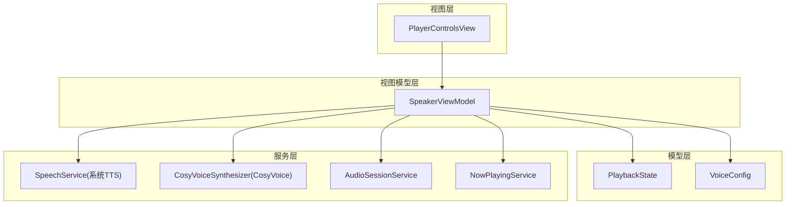
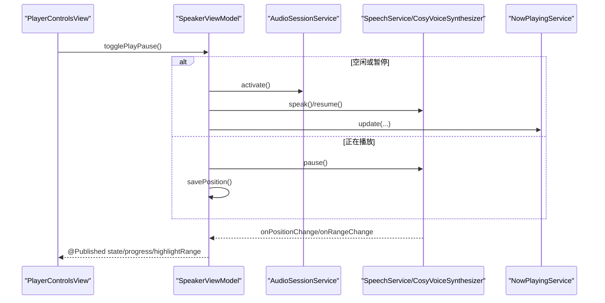
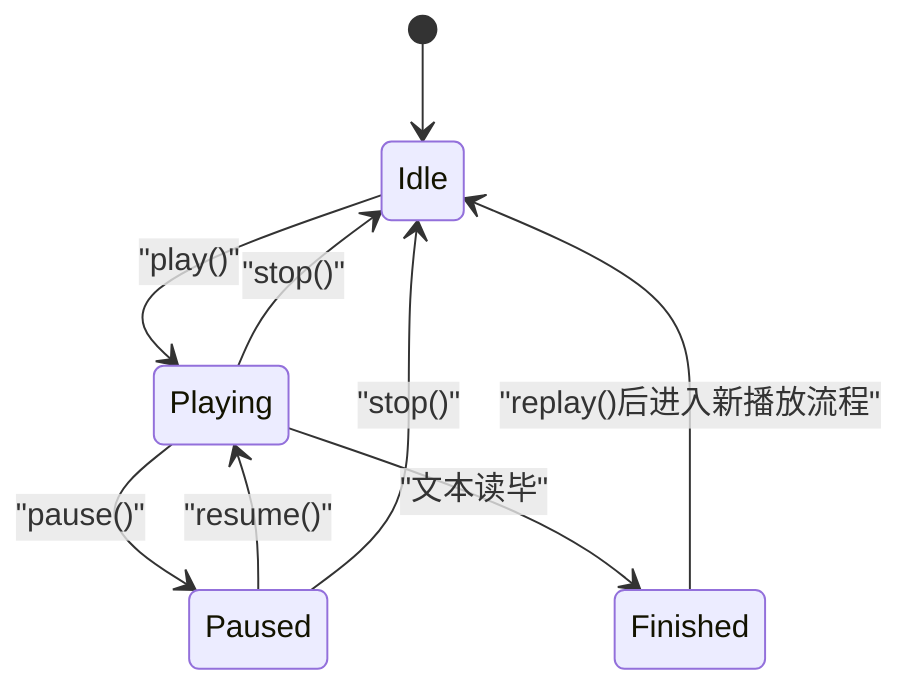
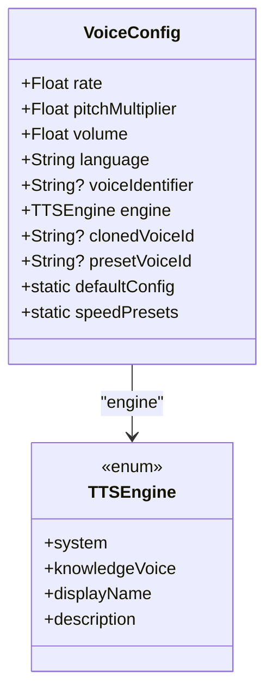
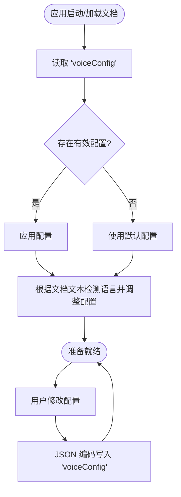
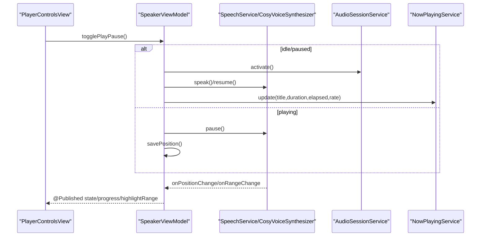
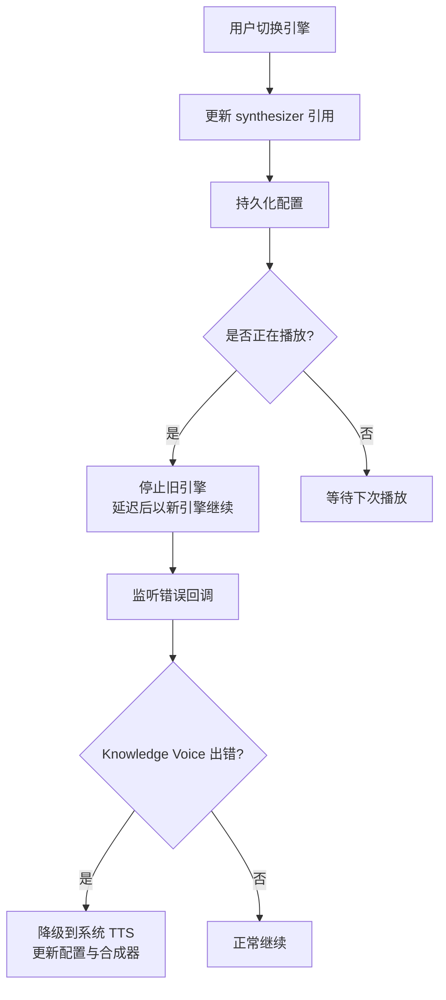
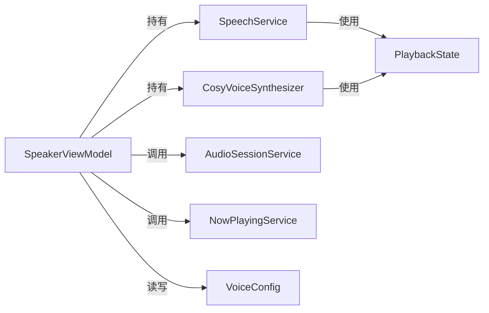

# 播放状态模型

<cite>
**本文引用的文件**
- [Models/PlaybackState.swift](file://Models/PlaybackState.swift)
- [Models/VoiceConfig.swift](file://Models/VoiceConfig.swift)
- [Services/SpeechService.swift](file://Services/SpeechService.swift)
- [Services/CosyVoiceSynthesizer.swift](file://Services/CosyVoiceSynthesizer.swift)
- [ViewModels/SpeakerViewModel.swift](file://ViewModels/SpeakerViewModel.swift)
- [Services/AudioSessionService.swift](file://Services/AudioSessionService.swift)
- [Services/NowPlayingService.swift](file://Services/NowPlayingService.swift)
- [Views/PlayerControlsView.swift](file://Views/PlayerControlsView.swift)
</cite>

## 目录
1. [简介](#简介)
2. [项目结构](#项目结构)
3. [核心组件](#核心组件)
4. [架构总览](#架构总览)
5. [详细组件分析](#详细组件分析)
6. [依赖关系分析](#依赖关系分析)
7. [性能与资源管理](#性能与资源管理)
8. [故障排查指南](#故障排查指南)
9. [结论](#结论)
10. [附录：最佳实践](#附录最佳实践)

## 简介
本文件围绕“播放状态相关的数据模型”展开，重点解析以下方面：
- PlaybackState 枚举的设计思路、各状态语义及状态转换的业务逻辑
- VoiceConfig 模型的配置项定义、默认值与验证规则
- 数据模型生命周期管理、默认值设置与配置持久化策略
- 状态机设计与配置管理的最佳实践

## 项目结构
与播放状态和语音配置相关的代码主要分布在 Models、Services、ViewModels 与 Views 四个层次：
- Models：定义 PlaybackState 与 VoiceConfig 等基础数据模型
- Services：实现具体合成器（系统 TTS 与 CosyVoice）以及音频会话、锁屏控件等服务
- ViewModels：聚合业务编排，协调状态、配置与 UI 更新
- Views：展示控制按钮并根据状态渲染 UI

图表来源
- [Models/PlaybackState.swift:1-9](file://Models/PlaybackState.swift#L1-L9)
- [Models/VoiceConfig.swift:1-52](file://Models/VoiceConfig.swift#L1-L52)
- [Services/SpeechService.swift:1-155](file://Services/SpeechService.swift#L1-L155)
- [Services/CosyVoiceSynthesizer.swift:1-219](file://Services/CosyVoiceSynthesizer.swift#L1-L219)
- [Services/AudioSessionService.swift:1-46](file://Services/AudioSessionService.swift#L1-L46)
- [Services/NowPlayingService.swift:1-57](file://Services/NowPlayingService.swift#L1-L57)
- [ViewModels/SpeakerViewModel.swift:1-314](file://ViewModels/SpeakerViewModel.swift#L1-L314)
- [Views/PlayerControlsView.swift:1-65](file://Views/PlayerControlsView.swift#L1-L65)

章节来源
- [Models/PlaybackState.swift:1-9](file://Models/PlaybackState.swift#L1-L9)
- [Models/VoiceConfig.swift:1-52](file://Models/VoiceConfig.swift#L1-L52)
- [Services/SpeechService.swift:1-155](file://Services/SpeechService.swift#L1-L155)
- [Services/CosyVoiceSynthesizer.swift:1-219](file://Services/CosyVoiceSynthesizer.swift#L1-L219)
- [Services/AudioSessionService.swift:1-46](file://Services/AudioSessionService.swift#L1-L46)
- [Services/NowPlayingService.swift:1-57](file://Services/NowPlayingService.swift#L1-L57)
- [ViewModels/SpeakerViewModel.swift:1-314](file://ViewModels/SpeakerViewModel.swift#L1-L314)
- [Views/PlayerControlsView.swift:1-65](file://Views/PlayerControlsView.swift#L1-L65)

## 核心组件
- PlaybackState：描述播放器当前所处状态，用于驱动 UI 与业务分支。
- VoiceConfig：封装语音合成参数（语速、音调、音量、语言、引擎选择、音色标识等），并提供默认值与常用预设。
- SpeakerViewModel：作为门面，统一暴露播放控制接口，维护 state、voiceConfig 并负责持久化与远程控制同步。
- SpeechService / CosyVoiceSynthesizer：两种合成器实现，分别基于系统 TTS 与云端 CosyVoice，均遵循同一协议并在内部维护 PlaybackState。

章节来源
- [Models/PlaybackState.swift:1-9](file://Models/PlaybackState.swift#L1-L9)
- [Models/VoiceConfig.swift:1-52](file://Models/VoiceConfig.swift#L1-L52)
- [ViewModels/SpeakerViewModel.swift:1-314](file://ViewModels/SpeakerViewModel.swift#L1-L314)
- [Services/SpeechService.swift:1-155](file://Services/SpeechService.swift#L1-L155)
- [Services/CosyVoiceSynthesizer.swift:1-219](file://Services/CosyVoiceSynthesizer.swift#L1-L219)

## 架构总览
下图展示了从 UI 到播放引擎的状态流转与配置传递路径。

图表来源
- [Views/PlayerControlsView.swift:1-65](file://Views/PlayerControlsView.swift#L1-L65)
- [ViewModels/SpeakerViewModel.swift:100-156](file://ViewModels/SpeakerViewModel.swift#L100-L156)
- [Services/AudioSessionService.swift:14-44](file://Services/AudioSessionService.swift#L14-L44)
- [Services/SpeechService.swift:30-153](file://Services/SpeechService.swift#L30-L153)
- [Services/CosyVoiceSynthesizer.swift:39-86](file://Services/CosyVoiceSynthesizer.swift#L39-L86)
- [Services/NowPlayingService.swift:18-55](file://Services/NowPlayingService.swift#L18-L55)

## 详细组件分析

### PlaybackState 状态机设计
- 状态集合
  - idle：初始或停止后的空闲态
  - playing：正在播放
  - paused：已暂停
  - finished：播放完成
- 典型转换
  - idle → playing：首次开始或继续播放
  - playing → paused：用户主动暂停
  - paused → playing：恢复播放
  - playing → finished：文本全部读完
  - playing/paused → idle：用户主动停止
- 关键实现要点
  - 状态变更在 MainActor 上执行，保证 UI 安全
  - 通过定时器轮询底层合成器的 state，与 ViewModel 的 @Published state 保持同步
  - 到达 finished 或 idle 时触发位置保存

图表来源
- [Services/SpeechService.swift:70-90](file://Services/SpeechService.swift#L70-L90)
- [Services/SpeechService.swift:118-153](file://Services/SpeechService.swift#L118-L153)
- [Services/CosyVoiceSynthesizer.swift:49-86](file://Services/CosyVoiceSynthesizer.swift#L49-L86)
- [ViewModels/SpeakerViewModel.swift:249-260](file://ViewModels/SpeakerViewModel.swift#L249-L260)

章节来源
- [Models/PlaybackState.swift:1-9](file://Models/PlaybackState.swift#L1-L9)
- [Services/SpeechService.swift:70-90](file://Services/SpeechService.swift#L70-L90)
- [Services/SpeechService.swift:118-153](file://Services/SpeechService.swift#L118-L153)
- [Services/CosyVoiceSynthesizer.swift:49-86](file://Services/CosyVoiceSynthesizer.swift#L49-L86)
- [ViewModels/SpeakerViewModel.swift:249-260](file://ViewModels/SpeakerViewModel.swift#L249-L260)

### VoiceConfig 配置模型
- 字段说明
  - rate：语速，注释给出范围 0.1 ~ 2.0，默认 0.5
  - pitchMultiplier：音调倍数，默认 1.0
  - volume：音量，默认 1.0
  - language：语言代码，默认 zh-CN
  - voiceIdentifier：系统 TTS 指定语音标识（可选）
  - engine：TTS 引擎选择（system/knowledgeVoice）
  - clonedVoiceId：克隆音色 ID（可选）
  - presetVoiceId：预设音色 ID（可选）
- 默认值与预设
  - defaultConfig：提供默认实例
  - speedPresets：常用语速档位列表，便于 UI 快速切换
- 验证规则
  - 当前未实现显式校验；建议对 rate 进行边界检查与归一化，避免超出引擎支持范围
- 持久化
  - 使用 JSONEncoder/JSONDecoder 将 VoiceConfig 序列化为 UserDefaults 中的 "voiceConfig" 键值

图表来源
- [Models/VoiceConfig.swift:1-52](file://Models/VoiceConfig.swift#L1-L52)

章节来源
- [Models/VoiceConfig.swift:1-52](file://Models/VoiceConfig.swift#L1-L52)
- [ViewModels/SpeakerViewModel.swift:302-312](file://ViewModels/SpeakerViewModel.swift#L302-L312)

### 配置加载与持久化策略
- 加载时机
  - 加载文档时，优先读取已保存配置，并结合文档内容自动检测语言以匹配更合适的语音
- 保存时机
  - 每次更新配置后立即保存
  - 播放结束或停止时保存当前位置
- 存储介质
  - UserDefaults 中 key 为 "voiceConfig"，采用 Codable 序列化

图表来源
- [ViewModels/SpeakerViewModel.swift:81-96](file://ViewModels/SpeakerViewModel.swift#L81-L96)
- [ViewModels/SpeakerViewModel.swift:160-170](file://ViewModels/SpeakerViewModel.swift#L160-L170)
- [ViewModels/SpeakerViewModel.swift:302-312](file://ViewModels/SpeakerViewModel.swift#L302-L312)

章节来源
- [ViewModels/SpeakerViewModel.swift:81-96](file://ViewModels/SpeakerViewModel.swift#L81-L96)
- [ViewModels/SpeakerViewModel.swift:160-170](file://ViewModels/SpeakerViewModel.swift#L160-L170)
- [ViewModels/SpeakerViewModel.swift:302-312](file://ViewModels/SpeakerViewModel.swift#L302-L312)

### 播放控制与状态同步
- 入口
  - PlayerControlsView 调用 SpeakerViewModel.togglePlayPause()
- 分支逻辑
  - idle/paused → play()
  - playing → pause()
  - finished → replay()
- 播放过程
  - play() 激活 AudioSession，若为 paused 则 resume()，否则 speak()
  - 通过 onPositionChange/onRangeChange 回调推进进度与高亮范围
  - 每 0.1 秒轮询底层合成器 state，与 @Published state 同步
- 停止与完成
  - stop() 会停用 AudioSession、清空锁屏信息并保存位置
  - finished 或 idle 时保存位置

图表来源
- [Views/PlayerControlsView.swift:10-24](file://Views/PlayerControlsView.swift#L10-L24)
- [ViewModels/SpeakerViewModel.swift:100-156](file://ViewModels/SpeakerViewModel.swift#L100-L156)
- [Services/AudioSessionService.swift:29-44](file://Services/AudioSessionService.swift#L29-L44)
- [Services/NowPlayingService.swift:18-27](file://Services/NowPlayingService.swift#L18-L27)

章节来源
- [Views/PlayerControlsView.swift:1-65](file://Views/PlayerControlsView.swift#L1-65)
- [ViewModels/SpeakerViewModel.swift:100-156](file://ViewModels/SpeakerViewModel.swift#L100-L156)
- [Services/AudioSessionService.swift:29-44](file://Services/AudioSessionService.swift#L29-L44)
- [Services/NowPlayingService.swift:18-27](file://Services/NowPlayingService.swift#L18-L27)

### 引擎切换与降级策略
- 引擎选择
  - TTSEngine.system：系统内置 TTS，离线可用
  - TTSEngine.knowledgeVoice：云端 CosyVoice，高品质音色
- 切换流程
  - switchEngine(to:) 更新 synthesizer 引用、持久化配置，并重新绑定事件
  - 若当前处于 playing，则以新引擎从当前位置重新开始
- 错误降级
  - 当 Knowledge Voice 报错时，自动回退到系统 TTS，并更新配置与合成器引用

图表来源
- [ViewModels/SpeakerViewModel.swift:57-77](file://ViewModels/SpeakerViewModel.swift#L57-L77)
- [ViewModels/SpeakerViewModel.swift:234-247](file://ViewModels/SpeakerViewModel.swift#L234-L247)

章节来源
- [ViewModels/SpeakerViewModel.swift:57-77](file://ViewModels/SpeakerViewModel.swift#L57-L77)
- [ViewModels/SpeakerViewModel.swift:234-247](file://ViewModels/SpeakerViewModel.swift#L234-L247)

## 依赖关系分析
- 低耦合
  - SpeakerViewModel 通过协议 SpeechSynthesizerProtocol 与具体合成器解耦，便于替换与测试
- 内聚性
  - PlaybackState 仅表达状态，无副作用；VoiceConfig 仅承载配置，职责清晰
- 外部依赖
  - AVFoundation：系统 TTS 与音频会话
  - MediaPlayer：锁屏播放信息与远程控制
  - URLSession：CosyVoice 网络请求（由上层服务封装）

图表来源
- [ViewModels/SpeakerViewModel.swift:22-30](file://ViewModels/SpeakerViewModel.swift#L22-L30)
- [Services/SpeechService.swift:1-155](file://Services/SpeechService.swift#L1-L155)
- [Services/CosyVoiceSynthesizer.swift:1-219](file://Services/CosyVoiceSynthesizer.swift#L1-L219)
- [Services/AudioSessionService.swift:1-46](file://Services/AudioSessionService.swift#L1-L46)
- [Services/NowPlayingService.swift:1-57](file://Services/NowPlayingService.swift#L1-L57)
- [Models/PlaybackState.swift:1-9](file://Models/PlaybackState.swift#L1-L9)
- [Models/VoiceConfig.swift:1-52](file://Models/VoiceConfig.swift#L1-L52)

章节来源
- [ViewModels/SpeakerViewModel.swift:22-30](file://ViewModels/SpeakerViewModel.swift#L22-L30)
- [Services/SpeechService.swift:1-155](file://Services/SpeechService.swift#L1-L155)
- [Services/CosyVoiceSynthesizer.swift:1-219](file://Services/CosyVoiceSynthesizer.swift#L1-L219)
- [Services/AudioSessionService.swift:1-46](file://Services/AudioSessionService.swift#L1-L46)
- [Services/NowPlayingService.swift:1-57](file://Services/NowPlayingService.swift#L1-L57)
- [Models/PlaybackState.swift:1-9](file://Models/PlaybackState.swift#L1-L9)
- [Models/VoiceConfig.swift:1-52](file://Models/VoiceConfig.swift#L1-L52)

## 性能与资源管理
- 音频会话
  - 仅在需要播放时激活，停止时及时停用，避免占用系统音频通道
- 合成粒度
  - 系统 TTS 按自然断点切分段落，减少单次合成长度，提升流畅度
- 网络与缓存
  - 云端合成采用分段拼接，段间加入短暂延时以避免请求过快
- 内存与线程
  - 状态更新与 UI 同步均在主线程执行，避免竞态条件

[本节为通用指导，不直接分析具体文件]

## 故障排查指南
- 常见问题定位
  - 无法播放：检查 AudioSession 是否成功激活与停用
  - 锁屏控件无响应：确认 NowPlayingService 命令绑定是否生效
  - 云端合成失败：查看错误回调，必要时自动降级到系统 TTS
- 日志与提示
  - 使用统一的错误处理服务记录上下文与消息，便于定位问题

章节来源
- [Services/AudioSessionService.swift:14-44](file://Services/AudioSessionService.swift#L14-L44)
- [Services/NowPlayingService.swift:33-55](file://Services/NowPlayingService.swift#L33-L55)
- [ViewModels/SpeakerViewModel.swift:234-247](file://ViewModels/SpeakerViewModel.swift#L234-L247)

## 结论
- PlaybackState 提供了简洁而完备的状态机，配合轮询机制确保 UI 与底层一致
- VoiceConfig 集中管理语音参数，结合默认值与预设提升易用性
- 通过 SpeakerViewModel 的门面模式，实现了清晰的职责划分与良好的可测试性
- 配置持久化与自动语言检测增强了用户体验与鲁棒性

[本节为总结性内容，不直接分析具体文件]

## 附录：最佳实践
- 状态机设计
  - 明确每个状态的进入与退出条件，避免非法转换
  - 所有状态变更在主线程执行，保证 UI 一致性
- 配置管理
  - 提供默认值与常用预设，降低用户配置成本
  - 对用户输入进行边界校验与归一化处理
  - 变更即持久化，避免丢失用户偏好
- 资源管理
  - 按需激活/停用音频会话，减少系统资源占用
  - 长文本合成采用分段策略，兼顾体验与稳定性
- 错误处理
  - 统一错误上报与降级策略，保障核心功能可用性

[本节为通用指导，不直接分析具体文件]