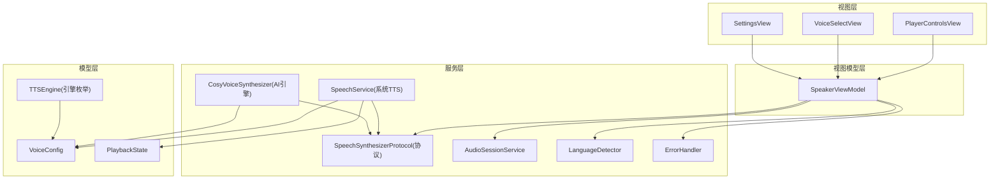
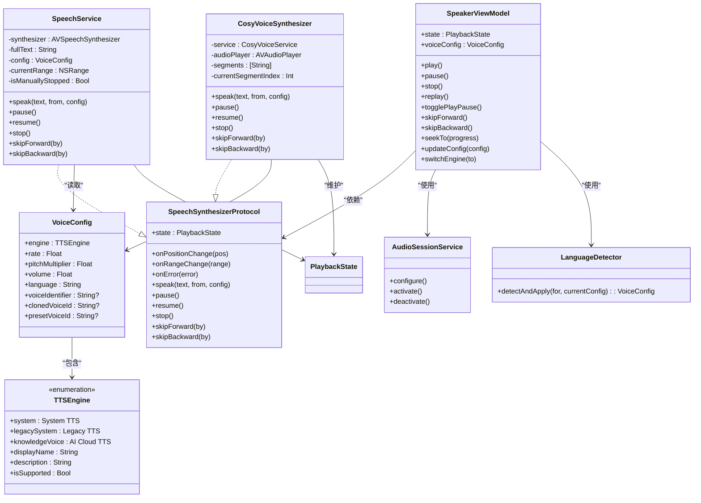
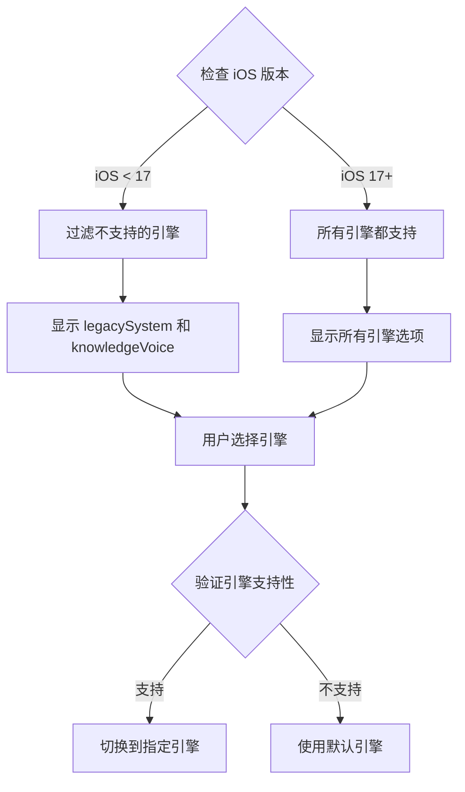
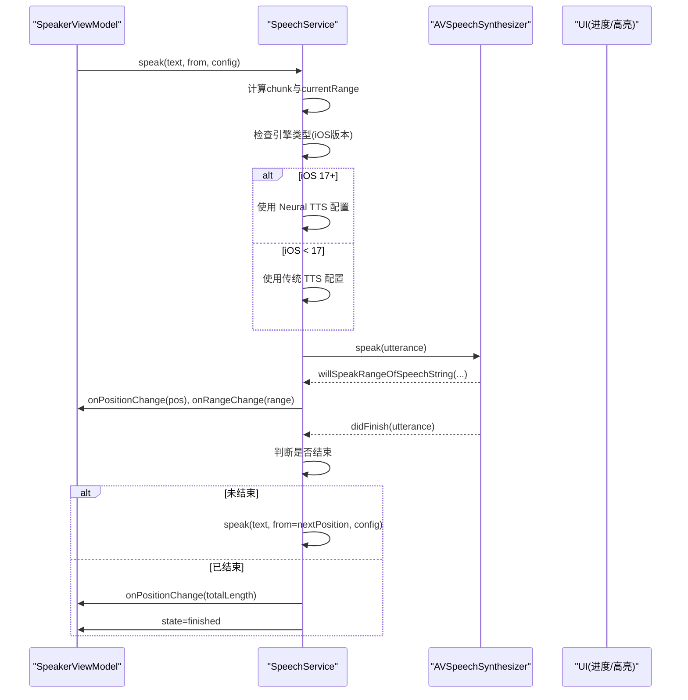
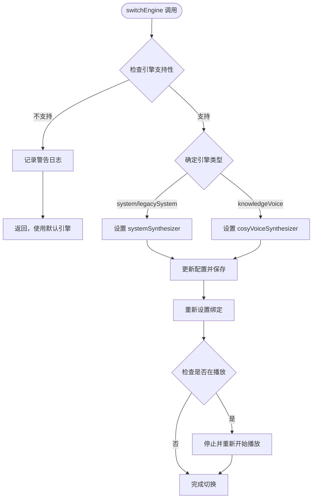
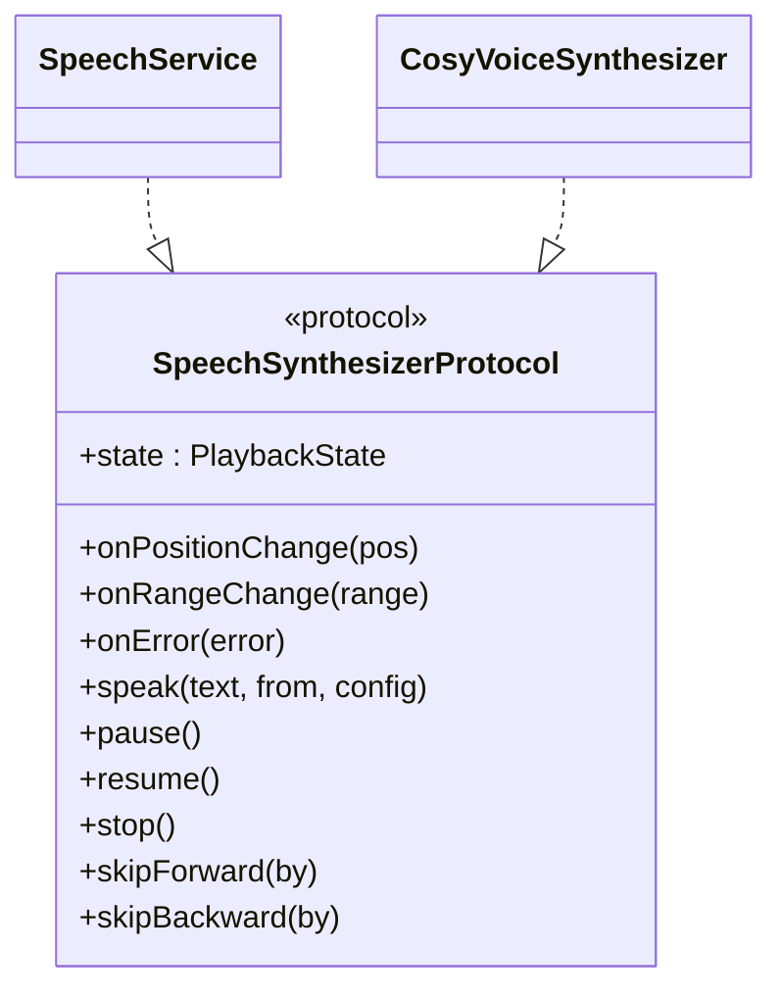
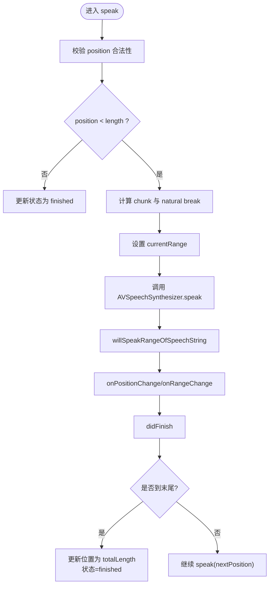
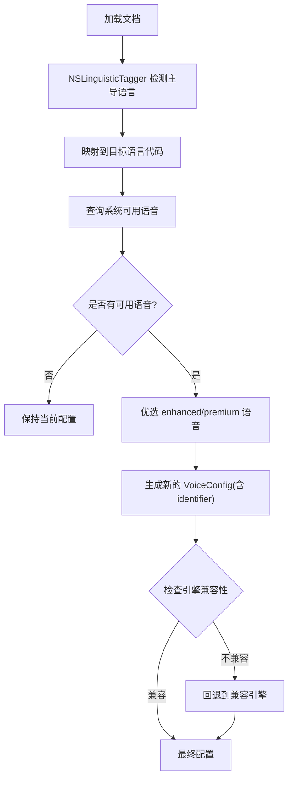
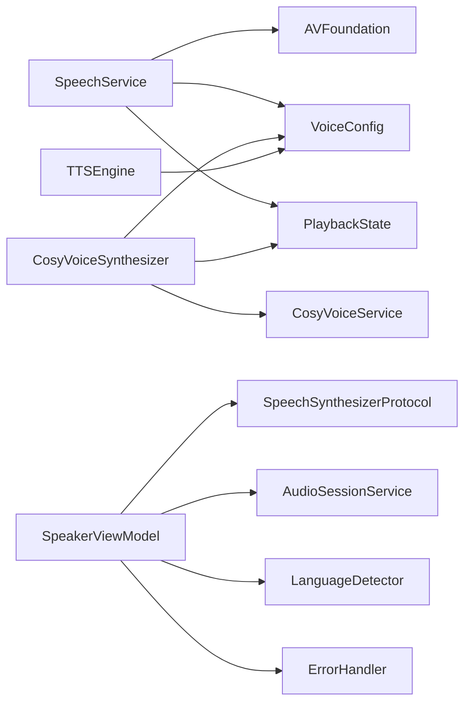

# 系统 TTS 服务

<cite>
**本文引用的文件**
- [SpeechService.swift](file://Services/SpeechService.swift)
- [SpeechSynthesizerProtocol.swift](file://Services/SpeechSynthesizerProtocol.swift)
- [VoiceConfig.swift](file://Models/VoiceConfig.swift)
- [PlaybackState.swift](file://Models/PlaybackState.swift)
- [SpeakerViewModel.swift](file://ViewModels/SpeakerViewModel.swift)
- [AudioSessionService.swift](file://Services/AudioSessionService.swift)
- [LanguageDetector.swift](file://Services/LanguageDetector.swift)
- [ErrorHandler.swift](file://Services/ErrorHandler.swift)
- [PlayerControlsView.swift](file://Views/PlayerControlsView.swift)
- [VoiceSelectView.swift](file://Views/VoiceSelectView.swift)
- [SettingsView.swift](file://Views/SettingsView.swift)
- [CosyVoiceSynthesizer.swift](file://Services/CosyVoiceSynthesizer.swift)
</cite>

## 更新摘要
**所做更改**
- 新增 legacySystem TTS 引擎选项，提供向后兼容性支持旧版本 iOS
- 改进 iOS 16 兼容性，移除已弃用的 AVSpeechUtterance.quality 属性
- 增强 SpeakerViewModel 中的引擎验证逻辑
- 更新语音配置管理以支持新的引擎类型

## 目录
1. [简介](#简介)
2. [项目结构](#项目结构)
3. [核心组件](#核心组件)
4. [架构总览](#架构总览)
5. [详细组件分析](#详细组件分析)
6. [依赖关系分析](#依赖关系分析)
7. [性能与优化建议](#性能与优化建议)
8. [故障排查指南](#故障排查指南)
9. [结论](#结论)
10. [附录：公共接口与使用方式](#附录公共接口与使用方式)

## 简介
本文件为系统 TTS（文本转语音）服务的综合文档，重点围绕 SpeechService 类如何集成 iOS 系统的 AVSpeechSynthesizer，涵盖语音配置管理、播放状态控制、错误处理机制；解释与 SpeechSynthesizerProtocol 协议的实现关系；文档化所有公共接口与方法的使用方式；并包含系统语音特性、语言支持、语速调节、音调设置等配置选项的具体实现。同时提供性能优化建议与常见问题解决方案，帮助开发者快速理解与扩展系统 TTS 能力。

**更新** 新增了 legacySystem 引擎选项以提供更好的向后兼容性，改进了 iOS 16 的兼容性支持，并增强了引擎验证逻辑。

## 项目结构
TTS 相关代码主要分布在 Services、Models、ViewModels、Views 四个层次：
- Services：SpeechService（系统 TTS 引擎）、SpeechSynthesizerProtocol（抽象协议）、AudioSessionService（音频会话）、LanguageDetector（语言检测）、ErrorHandler（错误处理）、CosyVoiceSynthesizer（AI 语音引擎）
- Models：VoiceConfig（语音配置）、PlaybackState（播放状态）
- ViewModels：SpeakerViewModel（门面层，统一编排播放、配置、远程控制等）
- Views：PlayerControlsView（播放控制 UI）、VoiceSelectView（音色选择 UI）、SettingsView（设置界面）

**图表来源**
- [SpeechService.swift:1-166](file://Services/SpeechService.swift#L1-L166)
- [SpeechSynthesizerProtocol.swift:1-20](file://Services/SpeechSynthesizerProtocol.swift#L1-L20)
- [SpeakerViewModel.swift:1-384](file://ViewModels/SpeakerViewModel.swift#L1-L384)
- [VoiceConfig.swift:1-64](file://Models/VoiceConfig.swift#L1-L64)
- [SettingsView.swift:40-72](file://Views/SettingsView.swift#L40-L72)
- [CosyVoiceSynthesizer.swift:1-258](file://Services/CosyVoiceSynthesizer.swift#L1-L258)

**章节来源**
- [SpeechService.swift:1-166](file://Services/SpeechService.swift#L1-L166)
- [SpeechSynthesizerProtocol.swift:1-20](file://Services/SpeechSynthesizerProtocol.swift#L1-L20)
- [SpeakerViewModel.swift:1-384](file://ViewModels/SpeakerViewModel.swift#L1-L384)
- [VoiceConfig.swift:1-64](file://Models/VoiceConfig.swift#L1-L64)
- [SettingsView.swift:40-72](file://Views/SettingsView.swift#L40-L72)
- [CosyVoiceSynthesizer.swift:1-258](file://Services/CosyVoiceSynthesizer.swift#L1-L258)

## 核心组件
- SpeechService：基于 AVSpeechSynthesizer 的系统 TTS 实现，负责分块朗读、断点续读、跳转、暂停/恢复/停止、位置与范围回调、错误回调。
- CosyVoiceSynthesizer：AI 云端语音合成引擎，支持语音克隆和高级功能。
- SpeechSynthesizerProtocol：定义统一的合成器抽象，屏蔽具体引擎差异，便于测试与多引擎切换。
- VoiceConfig：封装语速、音调、音量、语言、引擎类型、克隆/预设音色 ID 等配置项。
- TTSEngine：新增的引擎枚举，支持 system（iOS 17+ Neural TTS）、legacySystem（传统系统 TTS）、knowledgeVoice（AI 云端）三种引擎类型。
- PlaybackState：描述 idle、playing、paused、finished 四种播放状态。
- SpeakerViewModel：门面层，协调 AudioSession、NowPlaying、错误处理、语言检测与引擎切换，对外暴露统一的播放控制与配置更新接口。
- AudioSessionService：统一管理 AVAudioSession 的类别、模式、激活与停用，确保后台播放、蓝牙、AirPlay 可用。
- LanguageDetector：自动检测文档主导语言，匹配系统可用语音并优选高质量音色。
- ErrorHandler：集中记录错误与弹窗提示。

**更新** 新增了 TTSEngine 枚举和 CosyVoiceSynthesizer 引擎，提供了更灵活的引擎选择和更好的兼容性支持。

**章节来源**
- [SpeechService.swift:1-166](file://Services/SpeechService.swift#L1-L166)
- [CosyVoiceSynthesizer.swift:1-258](file://Services/CosyVoiceSynthesizer.swift#L1-L258)
- [SpeechSynthesizerProtocol.swift:1-20](file://Services/SpeechSynthesizerProtocol.swift#L1-L20)
- [VoiceConfig.swift:1-64](file://Models/VoiceConfig.swift#L1-L64)
- [PlaybackState.swift:1-9](file://Models/PlaybackState.swift#L1-L9)
- [SpeakerViewModel.swift:1-384](file://ViewModels/SpeakerViewModel.swift#L1-L384)
- [AudioSessionService.swift:1-46](file://Services/AudioSessionService.swift#L1-L46)
- [LanguageDetector.swift:1-83](file://Services/LanguageDetector.swift#L1-L83)
- [ErrorHandler.swift:1-53](file://Services/ErrorHandler.swift#L1-L53)

## 架构总览
系统采用"协议 + 多实现"的解耦设计：
- 上层通过 SpeechSynthesizerProtocol 与具体引擎交互，默认使用 SpeechService（系统 TTS）。
- SpeakerViewModel 作为门面，聚合播放控制、配置持久化、远程控制、错误降级等逻辑。
- AudioSessionService 保证音频会话正确配置与生命周期管理。
- LanguageDetector 在加载文档时自动匹配最佳系统语音。
- TTSEngine 枚举提供引擎类型管理和设备兼容性检查。

**图表来源**
- [SpeechSynthesizerProtocol.swift:1-20](file://Services/SpeechSynthesizerProtocol.swift#L1-L20)
- [VoiceConfig.swift:5-34](file://Models/VoiceConfig.swift#L5-L34)
- [SpeechService.swift:1-166](file://Services/SpeechService.swift#L1-L166)
- [CosyVoiceSynthesizer.swift:1-258](file://Services/CosyVoiceSynthesizer.swift#L1-L258)
- [SpeakerViewModel.swift:1-384](file://ViewModels/SpeakerViewModel.swift#L1-L384)
- [AudioSessionService.swift:1-46](file://Services/AudioSessionService.swift#L1-L46)
- [LanguageDetector.swift:1-83](file://Services/LanguageDetector.swift#L1-L83)
- [PlaybackState.swift:1-9](file://Models/PlaybackState.swift#L1-L9)

## 详细组件分析

### TTSEngine 引擎枚举与兼容性管理
**新增** TTSEngine 枚举定义了三种不同的 TTS 引擎类型：
- `system`：iOS 17+ Neural TTS（默认），提供神经网络增强的自然音质
- `legacySystem`：传统系统 TTS，用于兼容旧版本 iOS 设备
- `knowledgeVoice`：AI 云端合成，支持语音克隆和高级功能

每个引擎都有对应的显示名称、描述信息和设备支持检查：
- `displayName`：用户友好的引擎名称
- `description`：详细的引擎说明
- `isSupported`：根据 iOS 版本动态检查引擎可用性

**图表来源**
- [VoiceConfig.swift:5-34](file://Models/VoiceConfig.swift#L5-L34)
- [SpeakerViewModel.swift:66-93](file://ViewModels/SpeakerViewModel.swift#L66-L93)

**章节来源**
- [VoiceConfig.swift:5-34](file://Models/VoiceConfig.swift#L5-L34)

### SpeechService 与 AVSpeechSynthesizer 集成
- 初始化与委托：创建 AVSpeechSynthesizer 实例并设置自身为代理，析构时清理代理并立即停止播放。
- 分块朗读策略：
  - 将全文按最大长度切块（默认每块不超过 500 字符），优先在自然断点处截断（如句号、换行等），提升听感连贯性。
  - 使用 NSRange 跟踪当前块的起始与长度，结合 onPositionChange/onRangeChange 回调驱动 UI 高亮与进度。
- 播放控制：
  - speak/pause/resume/stop 对应底层 AVSpeechSynthesizer 的 speak、pauseSpeaking、continueSpeaking、stopSpeaking。
  - skipForward/skipBackward 基于 charsPerSecond 估算跳过的字符数，停止后延迟一小段时间再重新从新位置开始朗读，避免竞态。
- 系统语音特性：
  - 根据 VoiceConfig 设置 utterance.rate、utterance.pitchMultiplier、utterance.volume。
  - **更新** 移除了已弃用的 AVSpeechUtterance.quality 属性，改用条件编译支持 iOS 17+ 和旧版本的兼容性。
  - 若配置了 voiceIdentifier，则使用指定 AVSpeechSynthesisVoice(identifier:)；否则按 language 构造语音。
- 完成与继续：
  - didFinish 回调中计算下一段起始位置，若未结束则继续调用 speak 实现无缝续读；若结束则触发 finished 状态与位置回调。
- 错误处理：
  - 当前实现未直接抛出错误，但预留 onError 回调用于上层监听不可恢复错误（例如未来扩展或网络引擎）。

**更新** 改进了 iOS 16 兼容性，移除了已弃用的 quality 属性，使用条件编译确保在不同 iOS 版本上的稳定运行。

**图表来源**
- [SpeechService.swift:30-83](file://Services/SpeechService.swift#L30-L83)
- [SpeechService.swift:129-143](file://Services/SpeechService.swift#L129-L143)
- [SpeakerViewModel.swift:285-336](file://ViewModels/SpeakerViewModel.swift#L285-L336)

**章节来源**
- [SpeechService.swift:1-166](file://Services/SpeechService.swift#L1-L166)

### 引擎切换与验证逻辑
**更新** SpeakerViewModel 中的 switchEngine 方法增强了引擎验证逻辑：
- 在切换前检查目标引擎的设备支持性
- 对于不支持的引擎，打印警告并使用默认引擎
- 支持运行时动态切换引擎而无需重启应用
- 保持播放状态的一致性，切换后自动恢复播放

**图表来源**
- [SpeakerViewModel.swift:66-93](file://ViewModels/SpeakerViewModel.swift#L66-L93)

**章节来源**
- [SpeakerViewModel.swift:66-93](file://ViewModels/SpeakerViewModel.swift#L66-L93)

### SpeechSynthesizerProtocol 协议与实现关系
- 协议职责：
  - 暴露统一的播放控制接口（speak/pause/resume/stop/skipForward/skipBackward）。
  - 暴露状态与回调（state、onPositionChange、onRangeChange、onError）。
- 实现关系：
  - SpeechService 遵循该协议，封装 AVSpeechSynthesizer 细节。
  - CosyVoiceSynthesizer 也遵循同一协议，提供 AI 云端语音合成能力。
  - 其他引擎也可遵循同一协议，由 SpeakerViewModel 动态切换。

**图表来源**
- [SpeechSynthesizerProtocol.swift:1-20](file://Services/SpeechSynthesizerProtocol.swift#L1-L20)
- [SpeechService.swift:1-166](file://Services/SpeechService.swift#L1-L166)
- [CosyVoiceSynthesizer.swift:1-258](file://Services/CosyVoiceSynthesizer.swift#L1-L258)

**章节来源**
- [SpeechSynthesizerProtocol.swift:1-20](file://Services/SpeechSynthesizerProtocol.swift#L1-L20)
- [SpeechService.swift:1-166](file://Services/SpeechService.swift#L1-L166)
- [CosyVoiceSynthesizer.swift:1-258](file://Services/CosyVoiceSynthesizer.swift#L1-L258)

### 播放状态与回调机制
- 状态机：idle → playing → paused / finished；finished/idle 可回到 idle 或保持。
- 位置与范围：
  - onPositionChange：实时推送当前绝对位置，用于进度条与时间显示。
  - onRangeChange：推送当前朗读的 NSRange（相对全文），用于文本高亮跟随。
- 错误回调：
  - onError：当引擎发生不可恢复错误时通知上层，用于降级或提示用户。

**图表来源**
- [SpeechService.swift:30-83](file://Services/SpeechService.swift#L30-L83)
- [SpeechService.swift:129-143](file://Services/SpeechService.swift#L129-L143)

**章节来源**
- [SpeechService.swift:1-166](file://Services/SpeechService.swift#L1-L166)

### 语音配置管理与语言支持
- VoiceConfig 关键属性：
  - rate：语速（示例默认值 0.5，常用档位见 presets）。
  - pitchMultiplier：音调倍数（默认 1.0）。
  - volume：音量（默认 1.0）。
  - language：语言代码（默认 zh-CN）。
  - voiceIdentifier：指定系统语音标识符（可选）。
  - **更新** engine：引擎类型（system/knowledgeVoice/legacySystem）。
  - clonedVoiceId/presetVoiceId：AI 引擎的音色标识（系统引擎不使用）。
- 语言检测与自动匹配：
  - LanguageDetector 使用 NSLinguisticTagger 检测主导语言，映射到目标语言代码。
  - 查询系统可用语音 AVSpeechSynthesisVoice.speechVoices()，优先选择 enhanced/premium 质量，回退到首个可用语音。
  - 若系统无对应语言语音，保持当前配置不变。

**更新** 移除了对已弃用的 AVSpeechUtterance.quality 属性的依赖，确保在 iOS 16 及更低版本上的兼容性。

**图表来源**
- [LanguageDetector.swift:46-76](file://Services/LanguageDetector.swift#L46-L76)
- [VoiceConfig.swift:36-63](file://Models/VoiceConfig.swift#L36-L63)

**章节来源**
- [LanguageDetector.swift:1-83](file://Services/LanguageDetector.swift#L1-L83)
- [VoiceConfig.swift:1-64](file://Models/VoiceConfig.swift#L1-L64)

### 音频会话与系统集成
- AudioSessionService 负责：
  - 配置类别为 playback，模式为 spokenAudio，允许蓝牙 HFP 与 AirPlay。
  - 激活/停用会话，并在停用后通知其他应用退出音频焦点。
- SpeakerViewModel 在 play/stop 时调用 activate/deactivate，确保后台播放与锁屏控制可用。

**章节来源**
- [AudioSessionService.swift:1-46](file://Services/AudioSessionService.swift#L1-L46)
- [SpeakerViewModel.swift:125-146](file://ViewModels/SpeakerViewModel.swift#L125-L146)

### 错误处理与降级策略
- 全局错误处理：
  - ErrorHandler 提供 handle/log 方法，统一打印日志与弹窗提示。
- 引擎错误与降级：
  - SpeakerViewModel 订阅 synthesizer.onError，当 AI 引擎出错时自动降级到系统 TTS，并保存配置。
- 系统 TTS 错误：
  - 当前 SpeechService 未直接抛出错误，但保留 onError 回调以兼容未来扩展。

**更新** 增强了引擎错误处理，现在可以智能地在不同引擎间进行降级切换。

**章节来源**
- [ErrorHandler.swift:1-53](file://Services/ErrorHandler.swift#L1-L53)
- [SpeakerViewModel.swift:303-317](file://ViewModels/SpeakerViewModel.swift#L303-L317)
- [SpeechService.swift:1-166](file://Services/SpeechService.swift#L1-L166)

### UI 集成与使用方式
- PlayerControlsView：
  - 提供播放/暂停、快进/快退按钮，以及快捷语速切换。
  - 通过 SpeakerViewModel 的 updateConfig 即时生效，无需重启引擎。
- VoiceSelectView：
  - 展示预设/克隆音色列表，选择后更新 VoiceConfig 并切换引擎。
  - 试听功能通过 CosyVoiceService 获取预览音频并播放。
- **更新** SettingsView：
  - 提供引擎选择界面，根据设备兼容性动态显示可用的引擎选项。
  - 支持实时切换引擎并立即生效。

**章节来源**
- [PlayerControlsView.swift:1-65](file://Views/PlayerControlsView.swift#L1-L65)
- [VoiceSelectView.swift:1-215](file://Views/VoiceSelectView.swift#L1-L215)
- [SettingsView.swift:40-72](file://Views/SettingsView.swift#L40-L72)

## 依赖关系分析
- 耦合与内聚：
  - SpeechService 仅依赖 AVFoundation 与内部模型（VoiceConfig、PlaybackState），内聚度高。
  - CosyVoiceSynthesizer 依赖 CosyVoiceService 进行云端合成。
  - SpeakerViewModel 聚合多个服务，承担编排职责，符合门面模式。
- 外部依赖：
  - AVFoundation：AVSpeechSynthesizer、AVAudioSession、AVSpeechSynthesisVoice。
  - Foundation：NSLinguisticTagger、UserDefaults、JSONEncoder/Decoder。
- 潜在循环依赖：
  - 当前未见循环引用，ViewModel 通过协议依赖引擎，避免直接耦合。

**图表来源**
- [SpeechService.swift:1-166](file://Services/SpeechService.swift#L1-L166)
- [CosyVoiceSynthesizer.swift:1-258](file://Services/CosyVoiceSynthesizer.swift#L1-L258)
- [SpeakerViewModel.swift:1-384](file://ViewModels/SpeakerViewModel.swift#L1-L384)
- [VoiceConfig.swift:1-64](file://Models/VoiceConfig.swift#L1-L64)
- [AudioSessionService.swift:1-46](file://Services/AudioSessionService.swift#L1-L46)
- [LanguageDetector.swift:1-83](file://Services/LanguageDetector.swift#L1-L83)
- [ErrorHandler.swift:1-53](file://Services/ErrorHandler.swift#L1-L53)

**章节来源**
- [SpeechService.swift:1-166](file://Services/SpeechService.swift#L1-L166)
- [CosyVoiceSynthesizer.swift:1-258](file://Services/CosyVoiceSynthesizer.swift#L1-L258)
- [SpeakerViewModel.swift:1-384](file://ViewModels/SpeakerViewModel.swift#L1-L384)

## 性能与优化建议
- 分块大小与自然断点：
  - 当前每块上限 500 字符，并在标点/换行附近寻找断点，兼顾流畅性与内存占用。可根据设备性能与文本密度微调。
- 跳过与重入延迟：
  - skipForward/skipBackward 使用 50ms 延迟避免与底层合成器状态冲突，必要时可缩短以提升响应速度。
- 字符到秒换算：
  - charsPerSecond 固定为 3，用于估算跳转距离与时间显示。若需更精确的时间轴，可结合 AVSpeechSynthesizer 的已用时长 API 进行校准。
- 语言检测样本长度：
  - 使用前 500 字符进行语言检测，平衡准确性与性能。对超长文档可在首次加载时缓存检测结果。
- 音频会话优先级：
  - 使用 spokenAudio 模式确保中断与后台行为符合预期；在多任务场景下注意与其他音频应用的焦点协商。
- 线程与主队列：
  - 状态更新与 UI 回调均在主队列执行，避免并发问题；如需批量更新，可合并回调减少 UI 刷新频率。
- **更新** 引擎切换优化：
  - 引擎切换时使用异步操作避免阻塞主线程，切换完成后自动恢复播放状态。

[本节为通用指导，不直接分析具体文件]

## 故障排查指南
- 无法后台播放或锁屏控制无效：
  - 检查 AudioSessionService 是否正确配置为 playback/spokenAudio，并确保在 play 时激活、stop 时停用。
- 语言不支持或语音缺失：
  - LanguageDetector 会回退到当前配置；确认系统已下载对应语言包（部分增强/高级语音需下载）。
- 语速/音调/音量无变化：
  - 确认 VoiceConfig 的 rate/pitchMultiplier/volume 已更新并通过 updateConfig 生效；UI 层应调用 speakerVM.updateConfig。
- 跳转不准确或卡顿：
  - 检查 charsPerSecond 与实际语速是否匹配；必要时调整估算系数或引入更精确的时间追踪。
- 错误处理与降级：
  - 观察 onError 回调是否触发；AI 引擎错误时应自动降级到系统 TTS，确认配置已保存且绑定已重建。
- **更新** 引擎兼容性问题：
  - 检查 TTSEngine.isSupported 返回值，确保在不支持的 iOS 版本上不会尝试使用 Neural TTS。
  - 如果引擎切换失败，查看控制台日志中的警告信息。

**章节来源**
- [AudioSessionService.swift:14-44](file://Services/AudioSessionService.swift#L14-L44)
- [LanguageDetector.swift:46-76](file://Services/LanguageDetector.swift#L46-L76)
- [SpeakerViewModel.swift:125-173](file://ViewModels/SpeakerViewModel.swift#L125-L173)
- [SpeechService.swift:103-125](file://Services/SpeechService.swift#L103-L125)
- [SpeakerViewModel.swift:303-317](file://ViewModels/SpeakerViewModel.swift#L303-L317)
- [VoiceConfig.swift:26-33](file://Models/VoiceConfig.swift#L26-L33)

## 结论
SpeechService 通过简洁的分块朗读与断点续读机制，稳定地集成了 iOS 系统 AVSpeechSynthesizer，配合 SpeechSynthesizerProtocol 实现了引擎抽象与多引擎切换。**更新** 新增的 TTSEngine 枚举和 legacySystem 引擎选项提供了更好的向后兼容性，改进了 iOS 16 的兼容性支持，移除了已弃用的 API 调用。SpeakerViewModel 作为门面层，统一管理播放、配置、远程控制与错误降级，提升了整体可维护性与可扩展性。通过合理的语言检测与系统语音优选策略，系统在多语言环境下具备良好的用户体验。建议在后续迭代中引入更精确的时间轴与性能监控，进一步优化跳转与高亮同步体验。

[本节为总结，不直接分析具体文件]

## 附录：公共接口与使用方式

### SpeechSynthesizerProtocol 公共接口
- 属性
  - state：当前播放状态（idle/playing/paused/finished）
  - onPositionChange：位置回调（绝对字符位置）
  - onRangeChange：范围回调（全文 NSRange）
  - onError：错误回调（不可恢复错误）
- 方法
  - speak(text: String, from position: Int, config: VoiceConfig)
  - pause()
  - resume()
  - stop()
  - skipForward(by seconds: TimeInterval)
  - skipBackward(by seconds: TimeInterval)

**章节来源**
- [SpeechSynthesizerProtocol.swift:1-20](file://Services/SpeechSynthesizerProtocol.swift#L1-L20)

### TTSEngine 引擎类型
**新增** 支持的引擎类型：
- `system`：Apple Neural TTS（iOS 17+），提供神经网络增强的自然音质
- `legacySystem`：传统系统 TTS，兼容旧版本 iOS
- `knowledgeVoice`：Knowledge Voice（AI 云端），支持语音克隆和高级功能

每个引擎的属性：
- displayName：用户友好的显示名称
- description：详细的引擎描述
- isSupported：设备兼容性检查

**章节来源**
- [VoiceConfig.swift:5-34](file://Models/VoiceConfig.swift#L5-L34)

### SpeechService 使用要点
- 初始化后无需额外配置，直接调用 speak 即可开始朗读。
- 通过 onPositionChange/onRangeChange 驱动 UI 进度与高亮。
- 使用 pause/resume/stop 控制播放生命周期。
- skipForward/skipBackward 基于字符估算进行跳转，适合长文本导航。
- **更新** 自动处理 iOS 版本兼容性，无需手动检查系统版本。

**章节来源**
- [SpeechService.swift:30-125](file://Services/SpeechService.swift#L30-L125)
- [SpeechService.swift:129-143](file://Services/SpeechService.swift#L129-L143)

### VoiceConfig 配置项说明
- rate：语速（示例默认 0.5，常用档位见 presets）
- pitchMultiplier：音调倍数（默认 1.0）
- volume：音量（默认 1.0）
- language：语言代码（默认 zh-CN）
- voiceIdentifier：指定系统语音标识符（可选）
- **更新** engine：引擎类型（system/knowledgeVoice/legacySystem）
- clonedVoiceId/presetVoiceId：AI 引擎的音色标识（系统引擎不使用）

**章节来源**
- [VoiceConfig.swift:36-63](file://Models/VoiceConfig.swift#L36-L63)

### SpeakerViewModel 典型用法
- 播放控制
  - togglePlayPause/play/pause/stop/replay
  - skipForward/skipBackward/seekTo(progress)
- 配置管理
  - updateConfig(config)：即时生效，正在播放时自动重启引擎
  - **更新** switchEngine(to engine)：运行时切换引擎并保存配置，支持设备兼容性检查
- 事件绑定
  - setupBindings 中订阅 onPositionChange/onRangeChange/onError，并同步到 @Published 属性供 UI 使用

**章节来源**
- [SpeakerViewModel.swift:117-187](file://ViewModels/SpeakerViewModel.swift#L117-L187)
- [SpeakerViewModel.swift:66-93](file://ViewModels/SpeakerViewModel.swift#L66-L93)
- [SpeakerViewModel.swift:285-336](file://ViewModels/SpeakerViewModel.swift#L285-L336)