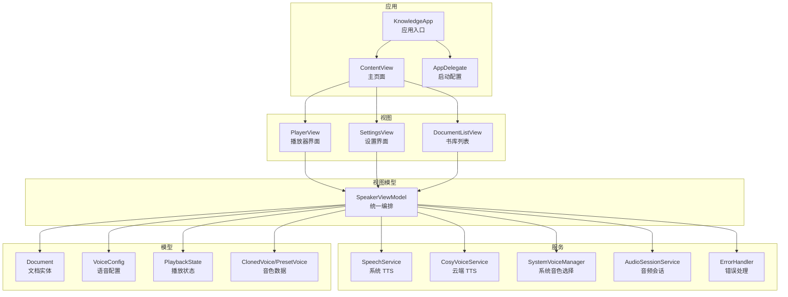
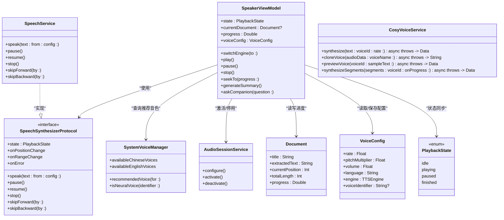
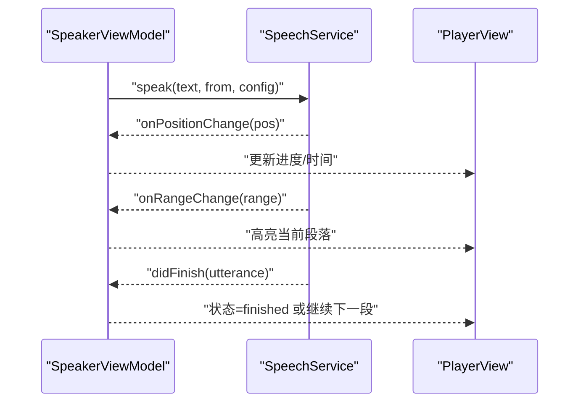
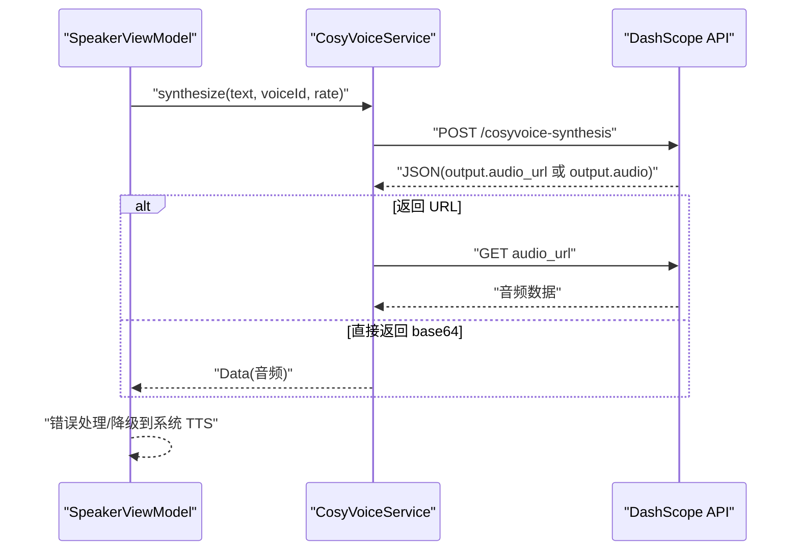
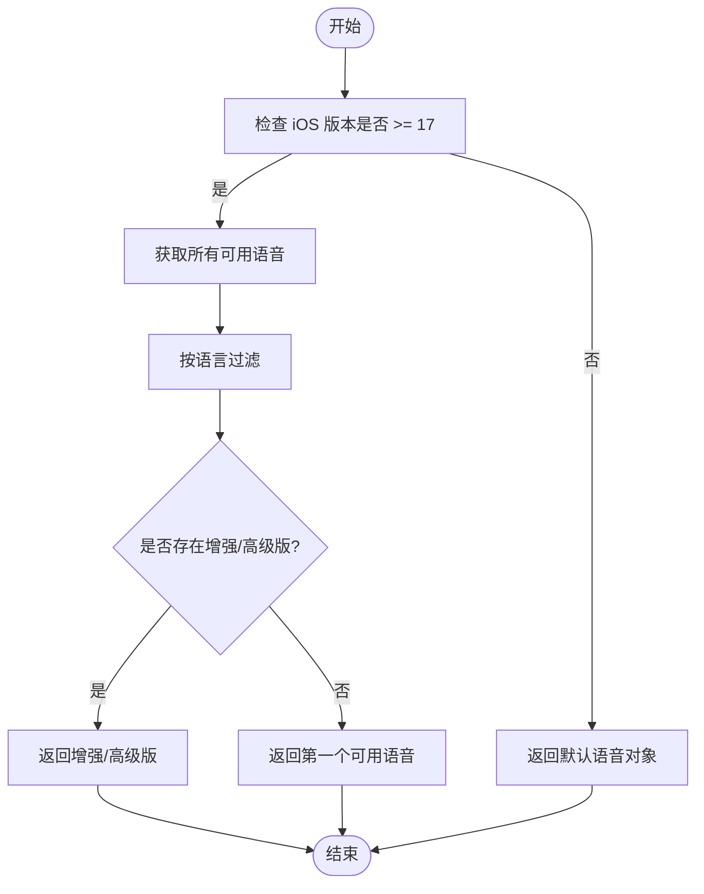
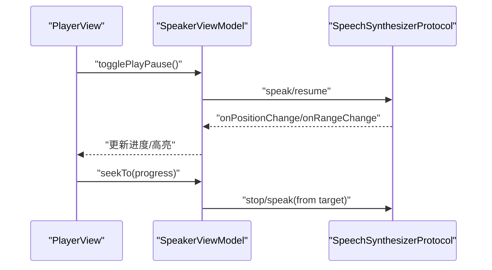
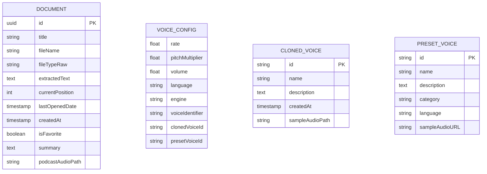
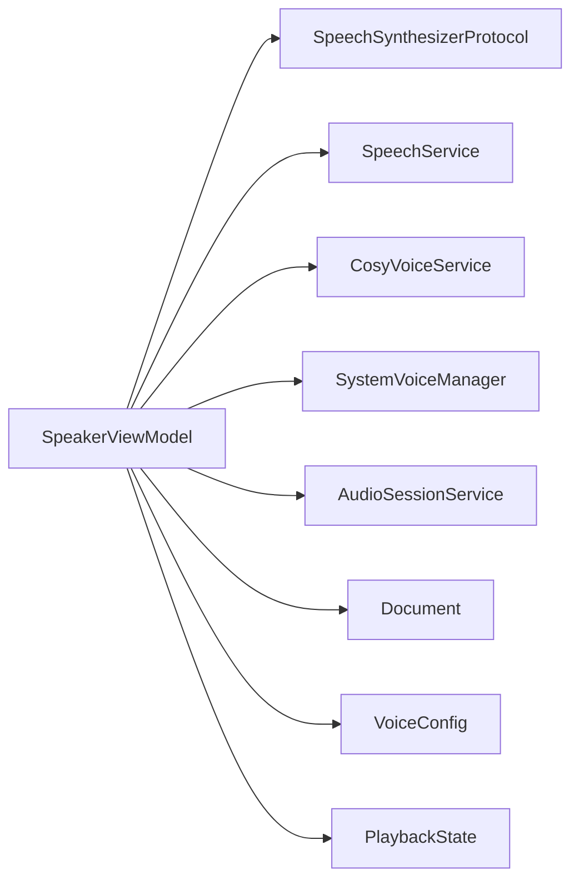

# Apple Neural TTS 语音管理系统

<cite>
**本文引用的文件**   
- [KnowledgeApp.swift](file://App/KnowledgeApp.swift)
- [AppDelegate.swift](file://App/AppDelegate.swift)
- [VoiceConfig.swift](file://Models/VoiceConfig.swift)
- [PlaybackState.swift](file://Models/PlaybackState.swift)
- [SpeechService.swift](file://Services/SpeechService.swift)
- [SpeechSynthesizerProtocol.swift](file://Services/SpeechSynthesizerProtocol.swift)
- [SystemVoiceManager.swift](file://Services/SystemVoiceManager.swift)
- [CosyVoiceService.swift](file://Services/CosyVoiceService.swift)
- [ClonedVoice.swift](file://Models/ClonedVoice.swift)
- [SpeakerViewModel.swift](file://ViewModels/SpeakerViewModel.swift)
- [Document.swift](file://Models/Document.swift)
- [AudioSessionService.swift](file://Services/AudioSessionService.swift)
- [PlayerView.swift](file://Views/PlayerView.swift)
- [ContentView.swift](file://Views/ContentView.swift)
- [ErrorHandler.swift](file://Services/ErrorHandler.swift)
</cite>

## 目录
1. [简介](#简介)
2. [项目结构](#项目结构)
3. [核心组件](#核心组件)
4. [架构总览](#架构总览)
5. [详细组件分析](#详细组件分析)
6. [依赖关系分析](#依赖关系分析)
7. [性能考量](#性能考量)
8. [故障排查指南](#故障排查指南)
9. [结论](#结论)
10. [附录](#附录)

## 简介
本系统是一个面向 iOS 的“Apple Neural TTS 语音管理系统”，提供多引擎语音合成（本地 Apple Neural TTS 与云端 CosyVoice）、文档朗读、播放控制、AI 摘要与伴读等能力。系统采用 SwiftUI + SwiftData 构建，通过统一的 ViewModel 协调 UI 与底层服务，支持在设备不支持时自动降级，并具备错误处理与远程控制中心集成。

## 项目结构
- App 层：应用入口与生命周期初始化
- Models 层：数据模型与配置
- Services 层：音频会话、TTS 引擎、网络合成、错误处理等
- ViewModels 层：业务编排与状态管理
- Views 层：UI 界面与交互
- ShareExtension：分享扩展入口（未在本节深入）

图表来源
- [KnowledgeApp.swift:1-29](file://App/KnowledgeApp.swift#L1-L29)
- [ContentView.swift:1-98](file://Views/ContentView.swift#L1-L98)
- [PlayerView.swift:1-261](file://Views/PlayerView.swift#L1-L261)
- [SpeakerViewModel.swift:1-399](file://ViewModels/SpeakerViewModel.swift#L1-L399)
- [SpeechService.swift:1-166](file://Services/SpeechService.swift#L1-L166)
- [CosyVoiceService.swift:1-219](file://Services/CosyVoiceService.swift#L1-L219)
- [SystemVoiceManager.swift:1-92](file://Services/SystemVoiceManager.swift#L1-L92)
- [AudioSessionService.swift:1-46](file://Services/AudioSessionService.swift#L1-L46)
- [Document.swift:1-115](file://Models/Document.swift#L1-L115)
- [VoiceConfig.swift:1-71](file://Models/VoiceConfig.swift#L1-L71)
- [PlaybackState.swift:1-9](file://Models/PlaybackState.swift#L1-L9)
- [ClonedVoice.swift:1-118](file://Models/ClonedVoice.swift#L1-L118)

章节来源
- [KnowledgeApp.swift:1-29](file://App/KnowledgeApp.swift#L1-L29)
- [ContentView.swift:1-98](file://Views/ContentView.swift#L1-L98)
- [PlayerView.swift:1-261](file://Views/PlayerView.swift#L1-L261)
- [SpeakerViewModel.swift:1-399](file://ViewModels/SpeakerViewModel.swift#L1-L399)

## 核心组件
- 语音合成协议与实现
  - 抽象协议定义统一接口，便于替换与测试
  - 系统实现基于 AVSpeechSynthesizer，支持分段朗读、位置回调、范围高亮
- 云端语音合成
  - 阿里云 DashScope CosyVoice 服务，支持预设音色与语音克隆
  - 长文本分段合成与进度回调
- 系统音色管理
  - 筛选与推荐 iOS 17+ Neural 增强版音色
- 播放编排
  - 统一 ViewModel 负责切换引擎、播放控制、进度同步、远程控制、错误降级
- 文档与配置
  - Document 持久化阅读进度与摘要；VoiceConfig 保存语速、语言、引擎等
- 音频会话
  - 集中管理 AVAudioSession 的配置、激活与停用

章节来源
- [SpeechSynthesizerProtocol.swift:1-20](file://Services/SpeechSynthesizerProtocol.swift#L1-L20)
- [SpeechService.swift:1-166](file://Services/SpeechService.swift#L1-L166)
- [CosyVoiceService.swift:1-219](file://Services/CosyVoiceService.swift#L1-L219)
- [SystemVoiceManager.swift:1-92](file://Services/SystemVoiceManager.swift#L1-L92)
- [SpeakerViewModel.swift:1-399](file://ViewModels/SpeakerViewModel.swift#L1-L399)
- [Document.swift:1-115](file://Models/Document.swift#L1-L115)
- [VoiceConfig.swift:1-71](file://Models/VoiceConfig.swift#L1-L71)
- [AudioSessionService.swift:1-46](file://Services/AudioSessionService.swift#L1-L46)

## 架构总览
系统以 SpeakerViewModel 为门面，聚合多种 TTS 引擎与辅助服务，向上暴露统一的播放与配置接口，向下对接系统 TTS 与云端服务。UI 通过 SwiftUI 绑定 ViewModel 的状态变化，实现实时高亮与播放控制。

图表来源
- [SpeakerViewModel.swift:1-399](file://ViewModels/SpeakerViewModel.swift#L1-L399)
- [SpeechSynthesizerProtocol.swift:1-20](file://Services/SpeechSynthesizerProtocol.swift#L1-L20)
- [SpeechService.swift:1-166](file://Services/SpeechService.swift#L1-L166)
- [CosyVoiceService.swift:1-219](file://Services/CosyVoiceService.swift#L1-L219)
- [SystemVoiceManager.swift:1-92](file://Services/SystemVoiceManager.swift#L1-L92)
- [AudioSessionService.swift:1-46](file://Services/AudioSessionService.swift#L1-L46)
- [Document.swift:1-115](file://Models/Document.swift#L1-L115)
- [VoiceConfig.swift:1-71](file://Models/VoiceConfig.swift#L1-L71)
- [PlaybackState.swift:1-9](file://Models/PlaybackState.swift#L1-L9)

## 详细组件分析

### 语音合成协议与系统实现
- 设计要点
  - 通过协议屏蔽具体实现差异，便于单元测试与运行时切换
  - 系统实现基于 AVSpeechSynthesizer，按自然断点切分文本，避免中途截断导致不自然
  - 回调 onPositionChange/onRangeChange 驱动 UI 高亮与进度更新
- 关键流程
  - speak 方法根据配置设置速率、音高、音量与语音标识符
  - 完成回调中推进全文位置，继续下一段
  - 跳过前进/后退通过字符估算定位并重新 speak

图表来源
- [SpeechSynthesizerProtocol.swift:1-20](file://Services/SpeechSynthesizerProtocol.swift#L1-L20)
- [SpeechService.swift:1-166](file://Services/SpeechService.swift#L1-L166)
- [SpeakerViewModel.swift:1-399](file://ViewModels/SpeakerViewModel.swift#L1-L399)
- [PlayerView.swift:1-261](file://Views/PlayerView.swift#L1-L261)

章节来源
- [SpeechSynthesizerProtocol.swift:1-20](file://Services/SpeechSynthesizerProtocol.swift#L1-L20)
- [SpeechService.swift:1-166](file://Services/SpeechService.swift#L1-L166)
- [SpeakerViewModel.swift:1-399](file://ViewModels/SpeakerViewModel.swift#L1-L399)
- [PlayerView.swift:1-261](file://Views/PlayerView.swift#L1-L261)

### 云端语音合成（CosyVoice）
- 功能概览
  - 预设音色与语音克隆
  - 长文本分段合成与进度回调
  - 错误类型化（API Key 缺失/无效、响应异常、无音频数据等）
- 调用流程
  - synthesize 发起请求，解析 JSON 输出，支持直接返回 base64 或返回 URL 再下载
  - cloneVoice 上传参考音频，返回 voice_id
  - synthesizeSegments 循环合成并拼接，间隔避免限流

图表来源
- [CosyVoiceService.swift:1-219](file://Services/CosyVoiceService.swift#L1-L219)
- [SpeakerViewModel.swift:1-399](file://ViewModels/SpeakerViewModel.swift#L1-L399)

章节来源
- [CosyVoiceService.swift:1-219](file://Services/CosyVoiceService.swift#L1-L219)
- [SpeakerViewModel.swift:1-399](file://ViewModels/SpeakerViewModel.swift#L1-L399)

### 系统音色管理与推荐
- 能力
  - 过滤中文/英文 Neural 音色并按名称排序
  - 根据语言代码推荐增强版或高级版音色
  - 判断指定 identifier 是否为 Neural 音色
- 使用场景
  - 加载文档时若使用 Apple Neural TTS 且未设置 voiceIdentifier，则自动填充推荐值

图表来源
- [SystemVoiceManager.swift:1-92](file://Services/SystemVoiceManager.swift#L1-L92)
- [SpeakerViewModel.swift:1-399](file://ViewModels/SpeakerViewModel.swift#L1-L399)

章节来源
- [SystemVoiceManager.swift:1-92](file://Services/SystemVoiceManager.swift#L1-L92)
- [SpeakerViewModel.swift:1-399](file://ViewModels/SpeakerViewModel.swift#L1-L399)

### 播放编排与 UI 联动
- 编排职责
  - 切换引擎（系统/云端），并在出错时自动降级
  - 播放控制（播放/暂停/停止/重播/快进/快退/跳转）
  - 进度与高亮同步，防抖更新 UI
  - 与 Now Playing 集成，支持锁屏与控制中心
- UI 联动
  - PlayerView 将 highlightRange 映射到段落高亮，并自动滚动到当前段落
  - 进度条拖动触发 seekTo，必要时立即恢复播放

图表来源
- [SpeakerViewModel.swift:1-399](file://ViewModels/SpeakerViewModel.swift#L1-L399)
- [PlayerView.swift:1-261](file://Views/PlayerView.swift#L1-L261)

章节来源
- [SpeakerViewModel.swift:1-399](file://ViewModels/SpeakerViewModel.swift#L1-L399)
- [PlayerView.swift:1-261](file://Views/PlayerView.swift#L1-L261)

### 文档与配置模型
- Document
  - 记录标题、文件名、提取文本、当前位置、最后打开时间、收藏状态、摘要与播客音频路径
  - 计算属性 totalLength 与 progress 用于 UI 展示
- VoiceConfig
  - 包含语速、音高、音量、语言、引擎类型、音色标识符与克隆/预设 ID
  - 提供常用语速预设与引擎描述信息
- ClonedVoice/PresetVoice
  - 云端音色数据模型与持久化管理（UserDefaults）

图表来源
- [Document.swift:1-115](file://Models/Document.swift#L1-L115)
- [VoiceConfig.swift:1-71](file://Models/VoiceConfig.swift#L1-L71)
- [ClonedVoice.swift:1-118](file://Models/ClonedVoice.swift#L1-L118)

章节来源
- [Document.swift:1-115](file://Models/Document.swift#L1-L115)
- [VoiceConfig.swift:1-71](file://Models/VoiceConfig.swift#L1-L71)
- [ClonedVoice.swift:1-118](file://Models/ClonedVoice.swift#L1-L118)

### 音频会话管理
- 职责
  - 统一配置 AVAudioSession 为播放模式，支持蓝牙与 AirPlay
  - 按需激活与停用，避免过早占用音频资源
- 集成点
  - AppDelegate 启动时仅配置类别，不激活
  - 播放开始时激活，停止时停用并清理远程控制状态

章节来源
- [AudioSessionService.swift:1-46](file://Services/AudioSessionService.swift#L1-L46)
- [AppDelegate.swift:1-14](file://App/AppDelegate.swift#L1-L14)
- [SpeakerViewModel.swift:1-399](file://ViewModels/SpeakerViewModel.swift#L1-L399)

## 依赖关系分析
- 耦合与内聚
  - SpeakerViewModel 作为门面，内聚了播放逻辑与状态管理，降低 UI 与服务之间的耦合
  - 通过协议注入 SpeechSynthesizerProtocol，提升可测试性与可扩展性
- 外部依赖
  - AVFoundation（系统 TTS 与音频会话）
  - URLSession（云端合成）
  - UserDefaults（配置与音色持久化）
  - SwiftData（文档持久化）
- 潜在循环依赖
  - 当前未见循环引用，ViewModel 单向依赖服务与模型

图表来源
- [SpeakerViewModel.swift:1-399](file://ViewModels/SpeakerViewModel.swift#L1-L399)
- [SpeechSynthesizerProtocol.swift:1-20](file://Services/SpeechSynthesizerProtocol.swift#L1-L20)
- [SpeechService.swift:1-166](file://Services/SpeechService.swift#L1-L166)
- [CosyVoiceService.swift:1-219](file://Services/CosyVoiceService.swift#L1-L219)
- [SystemVoiceManager.swift:1-92](file://Services/SystemVoiceManager.swift#L1-L92)
- [AudioSessionService.swift:1-46](file://Services/AudioSessionService.swift#L1-L46)
- [Document.swift:1-115](file://Models/Document.swift#L1-L115)
- [VoiceConfig.swift:1-71](file://Models/VoiceConfig.swift#L1-L71)
- [PlaybackState.swift:1-9](file://Models/PlaybackState.swift#L1-L9)

章节来源
- [SpeakerViewModel.swift:1-399](file://ViewModels/SpeakerViewModel.swift#L1-L399)

## 性能考量
- 文本分段策略
  - 系统 TTS 按自然断点切分，减少卡顿与不自然中断
- UI 更新优化
  - 高亮范围更新采用定时器防抖，避免频繁刷新
- 网络请求节流
  - 云端分段合成加入延迟，避免触发服务端限流
- 音频会话管理
  - 仅在需要时激活会话，降低功耗与资源占用

[本节为通用指导，无需列出章节来源]

## 故障排查指南
- 常见问题
  - 云端 API Key 缺失或无效：检查设置中的 API Key 配置
  - 网络错误：确认网络连接与服务器可达性
  - 系统 TTS 不可用：检查 iOS 版本与语音包安装情况
- 错误处理机制
  - 全局 ErrorHandler 统一弹窗提示与日志打印
  - 云端服务错误类型化，便于上层区分处理
  - 云端出错时自动降级到系统 TTS，保障可用性

章节来源
- [ErrorHandler.swift:1-53](file://Services/ErrorHandler.swift#L1-L53)
- [CosyVoiceService.swift:1-219](file://Services/CosyVoiceService.swift#L1-L219)
- [SpeakerViewModel.swift:1-399](file://ViewModels/SpeakerViewModel.swift#L1-L399)

## 结论
本系统通过清晰的层次划分与协议抽象，实现了多引擎语音合成的统一管理，具备良好的可扩展性与容错能力。结合 AI 摘要与伴读功能，为用户提供更智能的阅读体验。建议在后续迭代中完善云端音频播放适配与离线缓存策略，进一步提升用户体验。

[本节为总结性内容，无需列出章节来源]

## 附录
- 应用入口与主题环境注入
  - KnowledgeApp 创建 ModelContainer 并注入主题管理器
- 分享扩展处理
  - ContentView 监听分享通知，导入网页或文本到书库

章节来源
- [KnowledgeApp.swift:1-29](file://App/KnowledgeApp.swift#L1-L29)
- [ContentView.swift:1-98](file://Views/ContentView.swift#L1-L98)