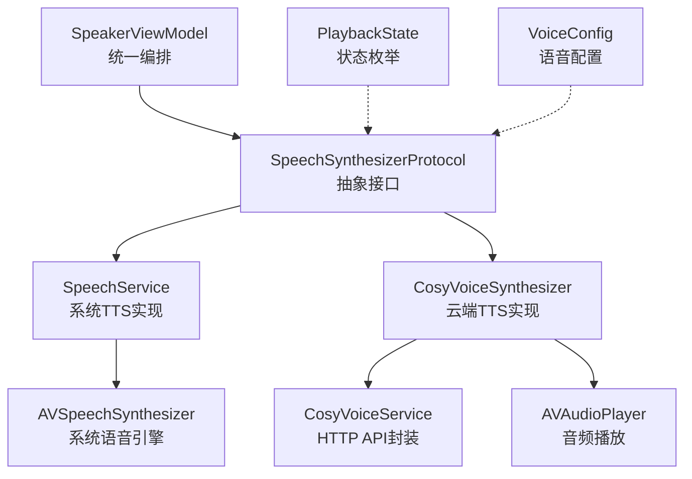
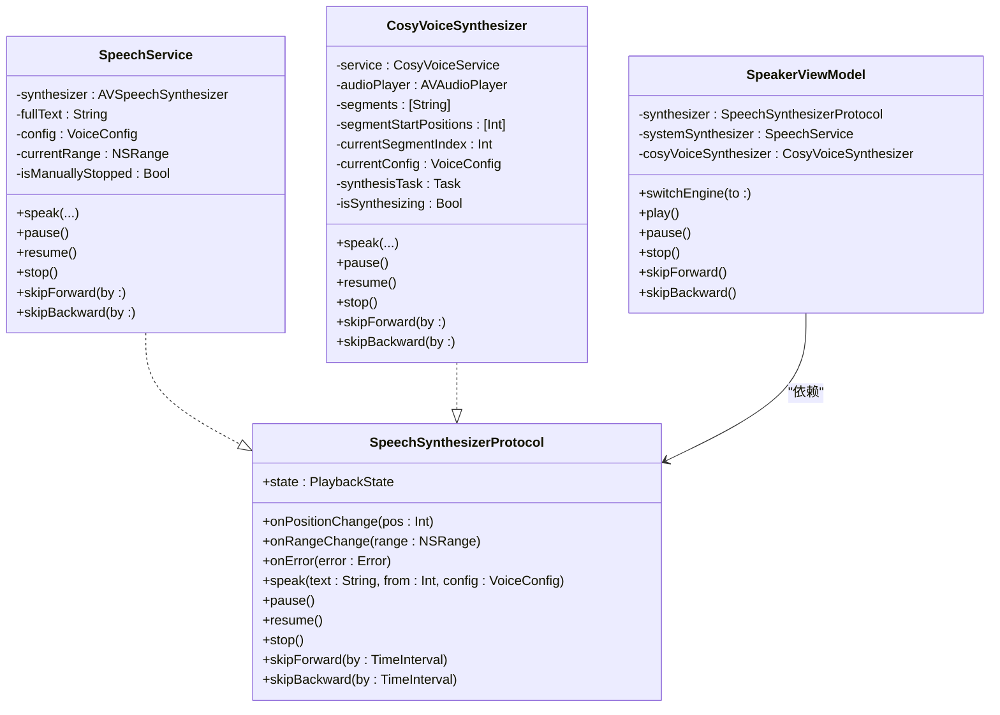
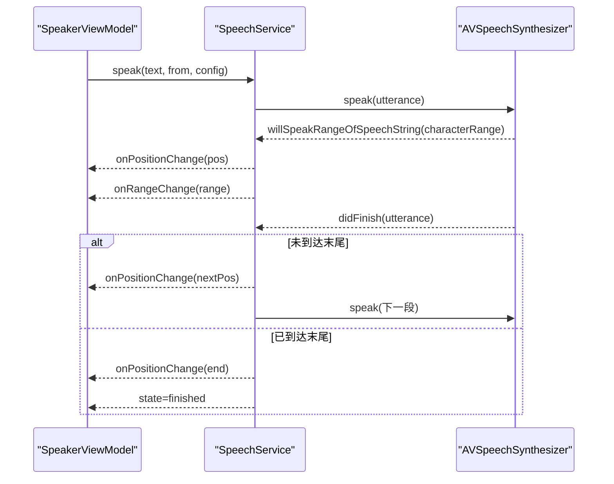
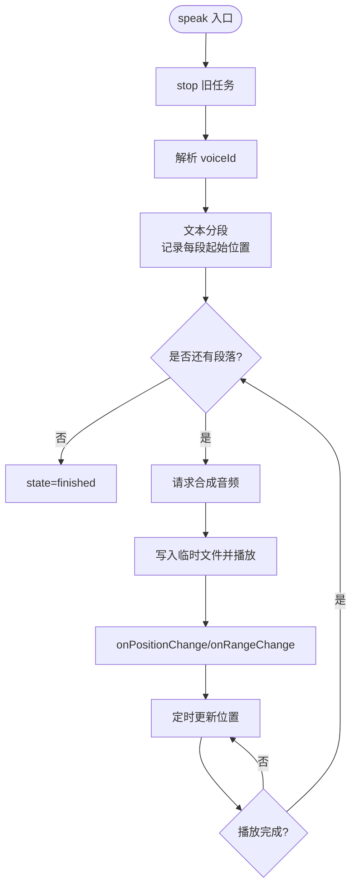
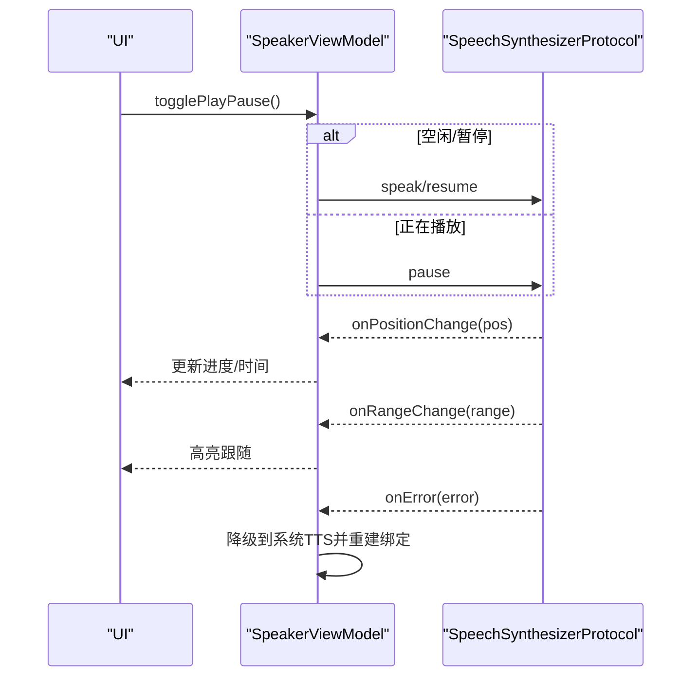
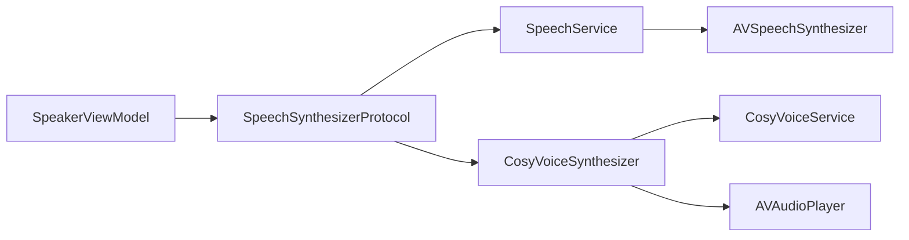

# 语音合成协议设计

<cite>
**本文引用的文件**   
- [SpeechSynthesizerProtocol.swift](file://Services/SpeechSynthesizerProtocol.swift)
- [SpeechService.swift](file://Services/SpeechService.swift)
- [CosyVoiceSynthesizer.swift](file://Services/CosyVoiceSynthesizer.swift)
- [PlaybackState.swift](file://Models/PlaybackState.swift)
- [VoiceConfig.swift](file://Models/VoiceConfig.swift)
- [SpeakerViewModel.swift](file://ViewModels/SpeakerViewModel.swift)
</cite>

## 目录
1. [简介](#简介)
2. [项目结构](#项目结构)
3. [核心组件](#核心组件)
4. [架构总览](#架构总览)
5. [详细组件分析](#详细组件分析)
6. [依赖关系分析](#依赖关系分析)
7. [性能与行为特性](#性能与行为特性)
8. [故障排查指南](#故障排查指南)
9. [结论](#结论)
10. [附录：实现与测试最佳实践](#附录实现与测试最佳实践)

## 简介
本文件围绕 SpeechSynthesizerProtocol 协议，系统化阐述其设计理念、抽象边界、方法语义与回调契约，并结合现有两种引擎实现（系统 TTS 与 CosyVoice）给出使用方式、扩展指南与单元测试 mock 策略。目标是帮助读者快速理解并安全地扩展新的语音合成引擎，同时保证上层 UI 与业务逻辑的稳定性。

## 项目结构
与语音合成相关的关键文件组织如下：
- 协议定义：Services/SpeechSynthesizerProtocol.swift
- 状态模型：Models/PlaybackState.swift
- 配置模型：Models/VoiceConfig.swift
- 系统引擎实现：Services/SpeechService.swift
- 云端引擎实现：Services/CosyVoiceSynthesizer.swift
- 上层编排与绑定：ViewModels/SpeakerViewModel.swift

图表来源
- [SpeechSynthesizerProtocol.swift:1-20](file://Services/SpeechSynthesizerProtocol.swift#L1-L20)
- [SpeechService.swift:1-155](file://Services/SpeechService.swift#L1-L155)
- [CosyVoiceSynthesizer.swift:1-258](file://Services/CosyVoiceSynthesizer.swift#L1-L258)
- [PlaybackState.swift:1-9](file://Models/PlaybackState.swift#L1-L9)
- [VoiceConfig.swift:1-52](file://Models/VoiceConfig.swift#L1-L52)
- [SpeakerViewModel.swift:1-314](file://ViewModels/SpeakerViewModel.swift#L1-L314)

章节来源
- [SpeechSynthesizerProtocol.swift:1-20](file://Services/SpeechSynthesizerProtocol.swift#L1-L20)
- [PlaybackState.swift:1-9](file://Models/PlaybackState.swift#L1-L9)
- [VoiceConfig.swift:1-52](file://Models/VoiceConfig.swift#L1-L52)
- [SpeakerViewModel.swift:1-314](file://ViewModels/SpeakerViewModel.swift#L1-L314)

## 核心组件
- 协议：SpeechSynthesizerProtocol
  - 职责：抽象语音合成引擎能力，屏蔽底层差异，提供统一的播放控制与状态回调。
  - 关键属性：
    - state：当前播放状态（idle/playing/paused/finished）。
    - onPositionChange：位置变化回调，参数为全文绝对字符位置。
    - onRangeChange：朗读范围回调，参数为 NSRange（相对全文绝对位置）。
    - onError：不可恢复错误回调，用于上层降级或提示。
  - 关键方法：
    - speak(text:from:config:)：开始或继续朗读，支持从指定位置开始。
    - pause()/resume()：暂停/恢复。
    - stop()：停止并清理资源。
    - skipForward(by:)/skipBackward(by:)：快进/快退，按秒为单位。

- 状态模型：PlaybackState
  - 值域：idle、playing、paused、finished。
  - 用途：驱动 UI 控件与持久化进度。

- 配置模型：VoiceConfig
  - 字段：语速、音高、音量、语言、音色标识、引擎选择、克隆/预设音色 ID。
  - 用途：跨引擎的统一参数载体。

章节来源
- [SpeechSynthesizerProtocol.swift:1-20](file://Services/SpeechSynthesizerProtocol.swift#L1-L20)
- [PlaybackState.swift:1-9](file://Models/PlaybackState.swift#L1-L9)
- [VoiceConfig.swift:1-52](file://Models/VoiceConfig.swift#L1-L52)

## 架构总览
协议位于 Services 层，作为“引擎抽象”；具体引擎在 Services 下各自实现；上层 ViewModel 通过注入该协议进行解耦，并在运行时根据配置切换不同引擎。

图表来源
- [SpeechSynthesizerProtocol.swift:1-20](file://Services/SpeechSynthesizerProtocol.swift#L1-L20)
- [SpeechService.swift:1-155](file://Services/SpeechService.swift#L1-L155)
- [CosyVoiceSynthesizer.swift:1-258](file://Services/CosyVoiceSynthesizer.swift#L1-L258)
- [SpeakerViewModel.swift:1-314](file://ViewModels/SpeakerViewModel.swift#L1-L314)

## 详细组件分析

### 协议设计与语义
- 设计思想
  - 面向接口编程：上层仅依赖 SpeechSynthesizerProtocol，不感知具体引擎差异。
  - 事件驱动：通过 onPositionChange/onRangeChange/onError 将引擎内部状态与 UI 同步。
  - 可插拔：新增引擎只需实现协议，无需改动上层。
- 方法语义与约束
  - speak(text:from:config:)
    - 作用：以给定文本和起始位置开始朗读，应用 VoiceConfig。
    - 约定：若 position 超出文本长度，应尽快进入 finished 或 idle 状态。
    - 分段策略：由实现决定（例如按自然断点切分），但需保证 onRangeChange 的 range 是全文绝对位置。
  - pause()/resume()
    - 作用：暂停/恢复播放。
    - 约定：仅在合法状态下生效，且更新 state。
  - stop()
    - 作用：停止播放并释放资源。
    - 约定：清理定时器/任务，重置 state 到 idle。
  - skipForward(by:)/skipBackward(by:)
    - 作用：按秒跳过，内部估算对应字符偏移并触发 onPositionChange。
    - 约定：边界保护，避免越界。
- 回调契约
  - onPositionChange：频繁调用，建议节流合并，避免 UI 抖动。
  - onRangeChange：随朗读推进更新高亮范围。
  - onError：发生不可恢复错误时触发，上层可做降级处理（如切换到系统 TTS）。

章节来源
- [SpeechSynthesizerProtocol.swift:1-20](file://Services/SpeechSynthesizerProtocol.swift#L1-L20)

### 系统 TTS 引擎：SpeechService
- 特点
  - 基于系统 AVSpeechSynthesizer，离线可用，延迟低。
  - 自动按自然断点分段，逐段朗读，完成后自动推进。
- 关键流程
  - speak：计算当前段落范围，设置 utterance 参数，启动朗读。
  - willSpeakRangeOfSpeechString：实时推送 onPositionChange 与 onRangeChange。
  - didFinish：推进到下一段或结束。
  - skipForward/skipBackward：按每秒约固定字符数估算跳转，重新 speak。
- 注意事项
  - 所有状态变更在主线程执行，确保 UI 安全。
  - 手动 stop 会阻止自动推进。

图表来源
- [SpeechService.swift:30-72](file://Services/SpeechService.swift#L30-L72)
- [SpeechService.swift:118-143](file://Services/SpeechService.swift#L118-L143)

章节来源
- [SpeechService.swift:1-155](file://Services/SpeechService.swift#L1-L155)

### 云端 TTS 引擎：CosyVoiceSynthesizer
- 特点
  - 基于阿里云 CosyVoice HTTP API，音质更高，需要网络与 API Key。
  - 长文本分段合成，边合成边播放，失败时触发 onError 供上层降级。
- 关键流程
  - speak：解析 voiceId，按最大长度分段，计算每段起始位置，异步合成并播放。
  - playAudio：初始化 AVAudioPlayer，定时更新 onPositionChange，发送 onRangeChange。
  - skipForward/skipBackward：直接调整播放器时间，估算位置并回调。
  - audioPlayerDidFinishPlaying：自动播放下一段，直至结束。
- 错误处理
  - 网络/鉴权/响应异常等抛出错误，经 onError 上报，上层可切换回系统 TTS。

图表来源
- [CosyVoiceSynthesizer.swift:28-51](file://Services/CosyVoiceSynthesizer.swift#L28-L51)
- [CosyVoiceSynthesizer.swift:148-192](file://Services/CosyVoiceSynthesizer.swift#L148-L192)
- [CosyVoiceSynthesizer.swift:194-217](file://Services/CosyVoiceSynthesizer.swift#L194-L217)
- [CosyVoiceSynthesizer.swift:240-257](file://Services/CosyVoiceSynthesizer.swift#L240-L257)

章节来源
- [CosyVoiceSynthesizer.swift:1-258](file://Services/CosyVoiceSynthesizer.swift#L1-L258)

### 上层编排：SpeakerViewModel
- 职责
  - 暴露统一播放控制接口，管理当前文档与进度。
  - 监听 onPositionChange/onRangeChange/onError，驱动 UI 与持久化。
  - 根据 TTSEngine 动态切换具体引擎实例。
- 关键行为
  - switchEngine：切换 system/knowledgeVoice，必要时重启播放。
  - setupBindings：订阅回调，更新 progress/highlightRange/state，处理错误降级。
  - seekTo/skipForward/skipBackward：组合 stop 与 speak 实现跳转。

图表来源
- [SpeakerViewModel.swift:57-77](file://ViewModels/SpeakerViewModel.swift#L57-L77)
- [SpeakerViewModel.swift:100-156](file://ViewModels/SpeakerViewModel.swift#L100-L156)
- [SpeakerViewModel.swift:215-266](file://ViewModels/SpeakerViewModel.swift#L215-L266)

章节来源
- [SpeakerViewModel.swift:1-314](file://ViewModels/SpeakerViewModel.swift#L1-L314)

## 依赖关系分析
- 耦合与内聚
  - 协议层与实现层松耦合，上层仅依赖协议。
  - 各引擎内聚自身播放细节，对外暴露一致行为。
- 外部依赖
  - SpeechService 依赖系统 AVSpeechSynthesizer。
  - CosyVoiceSynthesizer 依赖 CosyVoiceService（HTTP）、AVAudioPlayer。
- 潜在循环依赖
  - 无直接循环依赖；ViewModel 持有协议引用，实现类不反向依赖 ViewModel。

图表来源
- [SpeakerViewModel.swift:1-314](file://ViewModels/SpeakerViewModel.swift#L1-L314)
- [SpeechService.swift:1-155](file://Services/SpeechService.swift#L1-L155)
- [CosyVoiceSynthesizer.swift:1-258](file://Services/CosyVoiceSynthesizer.swift#L1-L258)

章节来源
- [SpeakerViewModel.swift:1-314](file://ViewModels/SpeakerViewModel.swift#L1-L314)
- [SpeechService.swift:1-155](file://Services/SpeechService.swift#L1-L155)
- [CosyVoiceSynthesizer.swift:1-258](file://Services/CosyVoiceSynthesizer.swift#L1-L258)

## 性能与行为特性
- 分段策略
  - 两段实现均按自然断点切分，提升可读性与容错性。
- 位置估算
  - 系统 TTS 使用精确字符范围回调；云端 TTS 采用粗略估算（每秒约若干字符），可在 UI 层做平滑处理。
- 资源管理
  - stop 会取消任务、停止播放器、清理定时器，避免内存泄漏。
- 主线程安全
  - 状态与 UI 相关更新均在主线程执行，避免竞态条件。

[本节为通用指导，不直接分析具体文件]

## 故障排查指南
- 常见问题
  - 云端 TTS 报错：检查 API Key、网络连通性与服务端返回码。
  - 位置不更新：确认 onPositionChange 是否被正确订阅与节流。
  - 无法跳转：检查 skipForward/skipBackward 的边界保护与播放器状态。
- 定位步骤
  - 打印 onError 错误信息，观察是否触发降级逻辑。
  - 对比 onRangeChange 与 onPositionChange 的一致性。
  - 验证 state 流转是否符合预期（idle→playing→paused/finished）。

章节来源
- [SpeakerViewModel.swift:233-247](file://ViewModels/SpeakerViewModel.swift#L233-L247)
- [CosyVoiceSynthesizer.swift:176-184](file://Services/CosyVoiceSynthesizer.swift#L176-L184)

## 结论
SpeechSynthesizerProtocol 通过清晰的抽象与回调契约，实现了多引擎可插拔与上层稳定性的平衡。结合 SpeakerViewModel 的编排与错误降级策略，既保证了用户体验，又降低了新引擎接入成本。遵循本文的最佳实践与测试策略，可高效扩展更多语音合成后端。

[本节为总结性内容，不直接分析具体文件]

## 附录：实现与测试最佳实践

### 实现新引擎的步骤
- 新建实现类并遵循协议
  - 实现 state 与三个回调属性。
  - 实现 speak/pause/resume/stop/skipForward/skipBackward。
  - 在 speak 中合理分段，维护全文绝对位置映射。
- 状态与回调
  - 在播放开始、暂停、恢复、停止、完成时及时更新 state。
  - 高频 onPositionChange 建议在调用方做节流合并。
  - onRangeChange 必须为全文绝对位置的 NSRange。
- 错误处理
  - 对不可恢复错误调用 onError，便于上层降级。
- 集成到上层
  - 在 SpeakerViewModel.switchEngine 中添加新引擎分支。
  - 在 VoiceConfig 中增加必要字段（如 engine 类型、特定参数）。

章节来源
- [SpeechSynthesizerProtocol.swift:1-20](file://Services/SpeechSynthesizerProtocol.swift#L1-L20)
- [SpeakerViewModel.swift:57-77](file://ViewModels/SpeakerViewModel.swift#L57-L77)
- [VoiceConfig.swift:1-52](file://Models/VoiceConfig.swift#L1-L52)

### 单元测试 Mock 策略
- 目标
  - 验证上层逻辑（播放控制、进度更新、错误降级）而不依赖真实引擎。
- 建议做法
  - 创建 MockSynthesizer 实现 SpeechSynthesizerProtocol。
  - 在 speak 中模拟分段与延时，按需触发 onPositionChange/onRangeChange。
  - 在特定条件下触发 onError，验证上层降级逻辑。
  - 通过构造器注入 Mock 实例，替换默认实现。
- 用例参考
  - 正常播放：speak → onPositionChange 递增 → 最终 finished。
  - 暂停/恢复：pause → paused → resume → playing。
  - 跳转：skipForward/skipBackward 后位置落在边界内。
  - 错误降级：onError 触发后切换至系统 TTS。

[本节为通用指导，不直接分析具体文件]

### 代码示例路径（不含源码）
- 协议定义与属性说明
  - [SpeechSynthesizerProtocol.swift:1-20](file://Services/SpeechSynthesizerProtocol.swift#L1-L20)
- 系统引擎实现要点
  - [SpeechService.swift:30-72](file://Services/SpeechService.swift#L30-L72)
  - [SpeechService.swift:118-143](file://Services/SpeechService.swift#L118-L143)
- 云端引擎实现要点
  - [CosyVoiceSynthesizer.swift:28-51](file://Services/CosyVoiceSynthesizer.swift#L28-L51)
  - [CosyVoiceSynthesizer.swift:148-192](file://Services/CosyVoiceSynthesizer.swift#L148-L192)
  - [CosyVoiceSynthesizer.swift:194-217](file://Services/CosyVoiceSynthesizer.swift#L194-L217)
- 上层绑定与降级
  - [SpeakerViewModel.swift:215-266](file://ViewModels/SpeakerViewModel.swift#L215-L266)
  - [SpeakerViewModel.swift:233-247](file://ViewModels/SpeakerViewModel.swift#L233-L247)