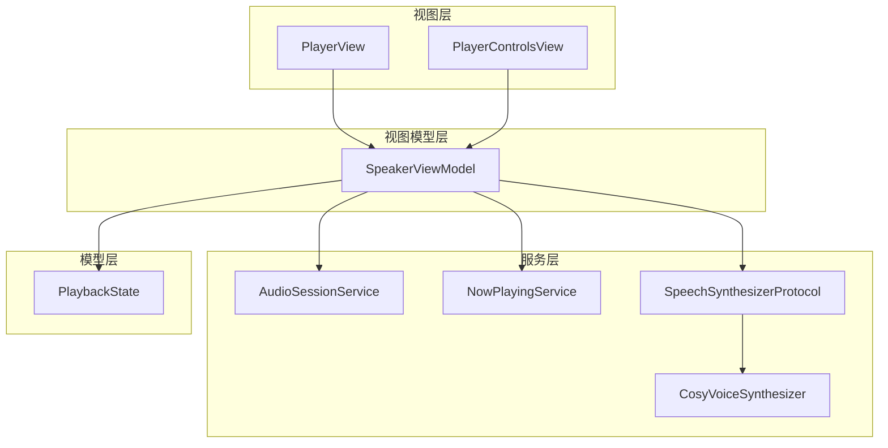
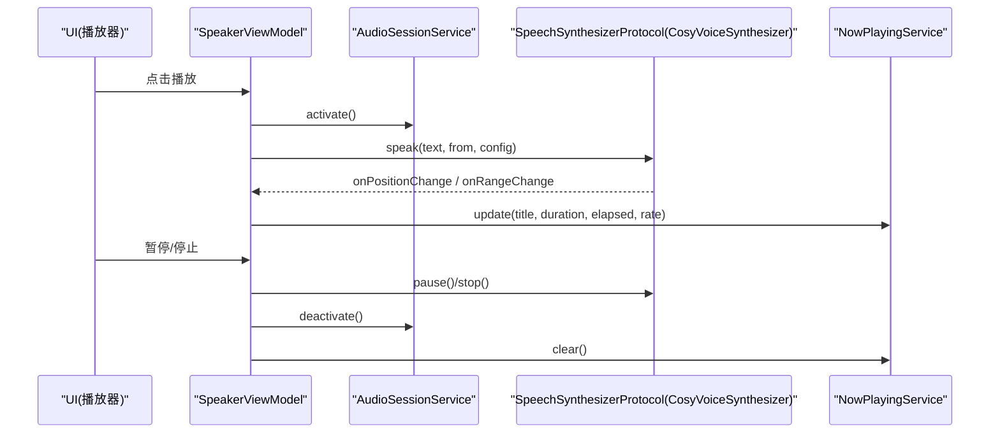
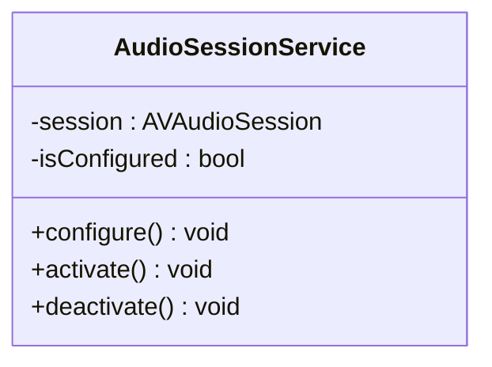
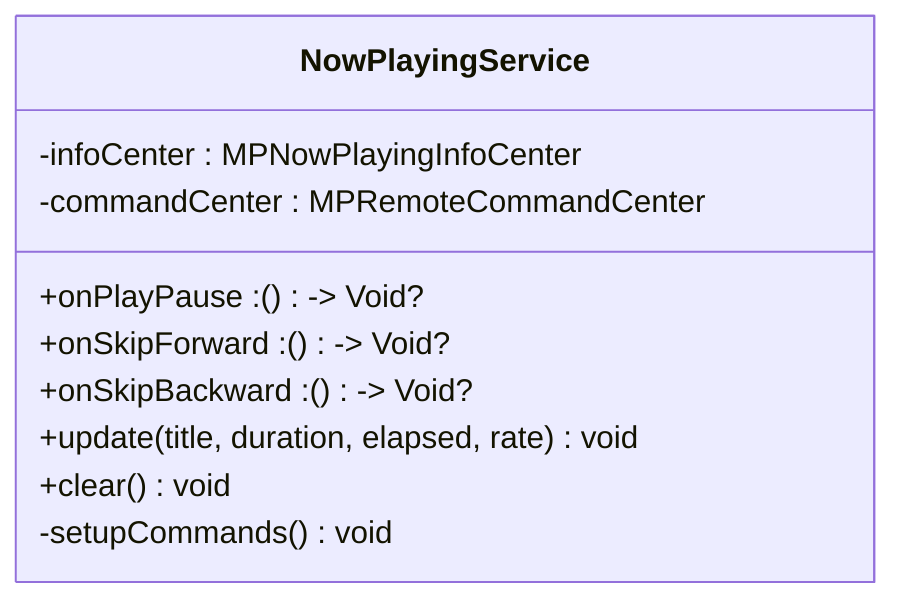
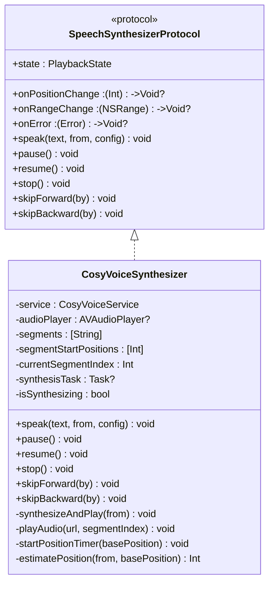
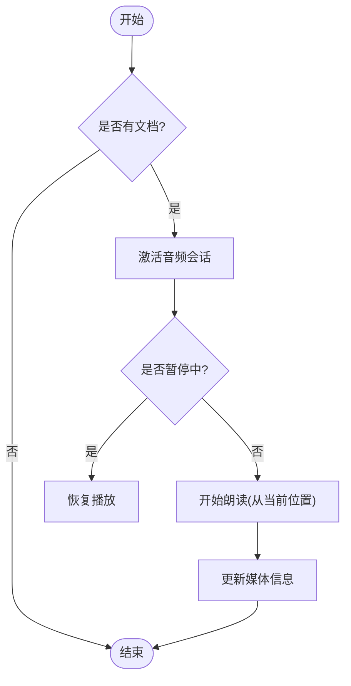
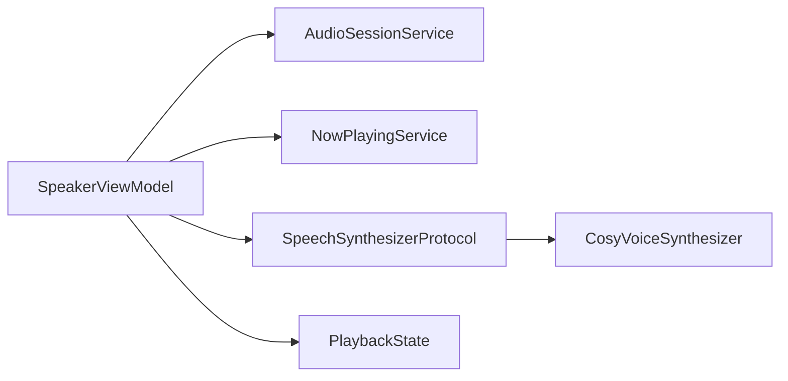

# 音频会话管理

<cite>
**本文引用的文件**
- [AudioSessionService.swift](file://Services/AudioSessionService.swift)
- [NowPlayingService.swift](file://Services/NowPlayingService.swift)
- [SpeechSynthesizerProtocol.swift](file://Services/SpeechSynthesizerProtocol.swift)
- [CosyVoiceSynthesizer.swift](file://Services/CosyVoiceSynthesizer.swift)
- [PlaybackState.swift](file://Models/PlaybackState.swift)
- [SpeakerViewModel.swift](file://ViewModels/SpeakerViewModel.swift)
- [PlayerView.swift](file://Views/PlayerView.swift)
- [PlayerControlsView.swift](file://Views/PlayerControlsView.swift)
</cite>

## 目录
1. [简介](#简介)
2. [项目结构](#项目结构)
3. [核心组件](#核心组件)
4. [架构总览](#架构总览)
5. [详细组件分析](#详细组件分析)
6. [依赖关系分析](#依赖关系分析)
7. [性能与资源考量](#性能与资源考量)
8. [故障排查指南](#故障排查指南)
9. [结论](#结论)
10. [附录：iOS 音频框架最佳实践与常见问题](#附录ios-音频框架最佳实践与常见问题)

## 简介
本文件围绕应用中的音频会话管理进行系统化说明，重点解释 AudioSessionService 如何统一管理应用的音频会话生命周期，包括音频类别设置、与其他应用音频的交互处理、后台播放支持；并进一步梳理中断处理、设备切换、蓝牙连接管理等复杂场景的处理逻辑。同时文档化音频优先级控制、混音策略和音量管理，并结合 iOS 音频框架的最佳实践给出常见问题解决方案。

## 项目结构
本项目采用分层组织方式：
- Services 层：封装系统能力（AVAudioSession、MPRemoteCommandCenter）与业务服务（TTS 引擎适配、远端合成）。
- ViewModels 层：作为门面协调 UI 与底层服务，统一暴露播放控制接口。
- Views 层：负责用户交互与展示。
- Models 层：定义状态与配置。

图表来源
- [SpeakerViewModel.swift:1-314](file://ViewModels/SpeakerViewModel.swift#L1-L314)
- [AudioSessionService.swift:1-46](file://Services/AudioSessionService.swift#L1-L46)
- [NowPlayingService.swift:1-57](file://Services/NowPlayingService.swift#L1-L57)
- [SpeechSynthesizerProtocol.swift:1-20](file://Services/SpeechSynthesizerProtocol.swift#L1-L20)
- [CosyVoiceSynthesizer.swift:1-258](file://Services/CosyVoiceSynthesizer.swift#L1-L258)
- [PlaybackState.swift:1-9](file://Models/PlaybackState.swift#L1-L9)
- [PlayerView.swift:1-174](file://Views/PlayerView.swift#L1-L174)
- [PlayerControlsView.swift:1-65](file://Views/PlayerControlsView.swift#L1-L65)

章节来源
- [SpeakerViewModel.swift:1-314](file://ViewModels/SpeakerViewModel.swift#L1-L314)
- [AudioSessionService.swift:1-46](file://Services/AudioSessionService.swift#L1-L46)
- [NowPlayingService.swift:1-57](file://Services/NowPlayingService.swift#L1-L57)
- [SpeechSynthesizerProtocol.swift:1-20](file://Services/SpeechSynthesizerProtocol.swift#L1-L20)
- [CosyVoiceSynthesizer.swift:1-258](file://Services/CosyVoiceSynthesizer.swift#L1-L258)
- [PlaybackState.swift:1-9](file://Models/PlaybackState.swift#L1-L9)
- [PlayerView.swift:1-174](file://Views/PlayerView.swift#L1-L174)
- [PlayerControlsView.swift:1-65](file://Views/PlayerControlsView.swift#L1-L65)

## 核心组件
- AudioSessionService：集中管理 AVAudioSession 的配置、激活与停用，屏蔽上层对系统音频会话的直接操作。
- NowPlayingService：维护锁屏/控制中心媒体信息与远程控制命令，实现与系统媒体中心的联动。
- SpeechSynthesizerProtocol：语音合成引擎抽象协议，统一 speak/pause/resume/stop/skip 等接口，便于替换不同引擎。
- CosyVoiceSynthesizer：基于 HTTP 的 TTS 引擎适配器，内部使用 AVAudioPlayer 播放音频片段，提供位置与范围回调。
- SpeakerViewModel：门面类，协调 AudioSession、NowPlaying、TTS 引擎，对外暴露统一的播放控制与配置更新接口。
- PlaybackState：播放状态枚举，贯穿各组件的状态同步。

章节来源
- [AudioSessionService.swift:1-46](file://Services/AudioSessionService.swift#L1-L46)
- [NowPlayingService.swift:1-57](file://Services/NowPlayingService.swift#L1-L57)
- [SpeechSynthesizerProtocol.swift:1-20](file://Services/SpeechSynthesizerProtocol.swift#L1-L20)
- [CosyVoiceSynthesizer.swift:1-258](file://Services/CosyVoiceSynthesizer.swift#L1-L258)
- [SpeakerViewModel.swift:1-314](file://ViewModels/SpeakerViewModel.swift#L1-L314)
- [PlaybackState.swift:1-9](file://Models/PlaybackState.swift#L1-L9)

## 架构总览
整体流程以 SpeakerViewModel 为入口，调用 AudioSessionService 激活会话，驱动具体 TTS 引擎（如 CosyVoiceSynthesizer）进行分段合成与播放，并通过 NowPlayingService 同步媒体信息与远程控制。

图表来源
- [SpeakerViewModel.swift:100-130](file://ViewModels/SpeakerViewModel.swift#L100-L130)
- [AudioSessionService.swift:29-44](file://Services/AudioSessionService.swift#L29-L44)
- [CosyVoiceSynthesizer.swift:28-86](file://Services/CosyVoiceSynthesizer.swift#L28-L86)
- [NowPlayingService.swift:18-31](file://Services/NowPlayingService.swift#L18-L31)

## 详细组件分析

### AudioSessionService：音频会话生命周期管理
职责
- 统一设置音频类别与模式，启用蓝牙 HFP 与 AirPlay。
- 提供激活与停用接口，并在停用时通知其他应用释放音频焦点。

关键行为
- configure：设置类别为 playback，模式为 spokenAudio，选项包含允许蓝牙 HFP 与 AirPlay。
- activate：确保已配置后激活会话。
- deactivate：停用会话并通知其他应用。

图表来源
- [AudioSessionService.swift:14-44](file://Services/AudioSessionService.swift#L14-L44)

章节来源
- [AudioSessionService.swift:14-44](file://Services/AudioSessionService.swift#L14-L44)

### NowPlayingService：媒体信息与远程控制
职责
- 更新锁屏/控制中心的媒体信息（标题、时长、已播放时间、速率）。
- 注册远程控制命令（播放/暂停/快进/快退），将事件转发到上层。

关键行为
- setupCommands：绑定 play/pause/togglePlayPause/skipForward/skipBackward 命令，禁用不需要的命令。
- update/clear：更新或清空媒体信息。

图表来源
- [NowPlayingService.swift:14-55](file://Services/NowPlayingService.swift#L14-L55)

章节来源
- [NowPlayingService.swift:14-55](file://Services/NowPlayingService.swift#L14-L55)

### SpeechSynthesizerProtocol 与 CosyVoiceSynthesizer：引擎抽象与实现
职责
- 通过协议统一引擎能力，便于在系统 TTS 与网络 TTS 之间切换。
- CosyVoiceSynthesizer 负责文本分段、HTTP 合成、临时文件写入、AVAudioPlayer 播放、位置与范围回调、自动续播下一段。

关键行为
- speak：准备分段、定位起始段落、启动合成与播放任务。
- pause/resume/stop：控制 AVAudioPlayer 与合成任务。
- skipForward/skipBackward：调整当前播放时间并估算字符位置。
- synthesizeAndPlay：异步循环合成段落，错误时触发 onError 回调用于降级。
- AVAudioPlayerDelegate：完成一段后自动进入下一段，结束时标记 finished。

图表来源
- [SpeechSynthesizerProtocol.swift:5-19](file://Services/SpeechSynthesizerProtocol.swift#L5-L19)
- [CosyVoiceSynthesizer.swift:7-258](file://Services/CosyVoiceSynthesizer.swift#L7-L258)

章节来源
- [SpeechSynthesizerProtocol.swift:5-19](file://Services/SpeechSynthesizerProtocol.swift#L5-L19)
- [CosyVoiceSynthesizer.swift:28-86](file://Services/CosyVoiceSynthesizer.swift#L28-L86)
- [CosyVoiceSynthesizer.swift:148-192](file://Services/CosyVoiceSynthesizer.swift#L148-L192)
- [CosyVoiceSynthesizer.swift:194-217](file://Services/CosyVoiceSynthesizer.swift#L194-L217)
- [CosyVoiceSynthesizer.swift:240-257](file://Services/CosyVoiceSynthesizer.swift#L240-L257)

### SpeakerViewModel：门面与编排
职责
- 根据配置选择引擎（系统 TTS 或 Knowledge Voice）。
- 管理播放生命周期：播放、暂停、停止、重播、跳转。
- 同步进度与高亮范围，更新 NowPlaying 信息。
- 监听引擎错误并执行降级策略（从网络 TTS 回退到系统 TTS）。

关键行为
- togglePlayPause/play/pause/stop/replay：组合 AudioSessionService 与引擎控制。
- seekTo：停止当前播放，按目标位置重新 speak。
- updateConfig：保存配置，若正在播放则用新配置重启。
- setupBindings：订阅 onPositionChange/onRangeChange/onError，定时同步 state，绑定远程控制回调。

图表来源
- [SpeakerViewModel.swift:100-117](file://ViewModels/SpeakerViewModel.swift#L100-L117)

章节来源
- [SpeakerViewModel.swift:56-77](file://ViewModels/SpeakerViewModel.swift#L56-L77)
- [SpeakerViewModel.swift:100-156](file://ViewModels/SpeakerViewModel.swift#L100-L156)
- [SpeakerViewModel.swift:215-266](file://ViewModels/SpeakerViewModel.swift#L215-L266)

### 视图层：交互与展示
- PlayerView：显示文档信息、高亮文本区域、进度条与摘要面板。
- PlayerControlsView：提供播放/暂停、快进/快退、语速快捷切换按钮。

章节来源
- [PlayerView.swift:1-174](file://Views/PlayerView.swift#L1-L174)
- [PlayerControlsView.swift:1-65](file://Views/PlayerControlsView.swift#L1-L65)

## 依赖关系分析
- SpeakerViewModel 依赖 AudioSessionService、NowPlayingService、SpeechSynthesizerProtocol 的具体实现（默认系统 TTS，可切换为 CosyVoiceSynthesizer）。
- CosyVoiceSynthesizer 依赖 AVAudioPlayer 与远端合成服务（此处未展开其内部服务细节，但通过协议解耦）。
- NowPlayingService 依赖 MediaPlayer 框架，提供媒体信息与远程控制。
- AudioSessionService 依赖 AVFoundation 的 AVAudioSession。

图表来源
- [SpeakerViewModel.swift:1-314](file://ViewModels/SpeakerViewModel.swift#L1-L314)
- [AudioSessionService.swift:1-46](file://Services/AudioSessionService.swift#L1-L46)
- [NowPlayingService.swift:1-57](file://Services/NowPlayingService.swift#L1-L57)
- [SpeechSynthesizerProtocol.swift:1-20](file://Services/SpeechSynthesizerProtocol.swift#L1-L20)
- [CosyVoiceSynthesizer.swift:1-258](file://Services/CosyVoiceSynthesizer.swift#L1-L258)
- [PlaybackState.swift:1-9](file://Models/PlaybackState.swift#L1-L9)

章节来源
- [SpeakerViewModel.swift:1-314](file://ViewModels/SpeakerViewModel.swift#L1-L314)
- [AudioSessionService.swift:1-46](file://Services/AudioSessionService.swift#L1-L46)
- [NowPlayingService.swift:1-57](file://Services/NowPlayingService.swift#L1-L57)
- [SpeechSynthesizerProtocol.swift:1-20](file://Services/SpeechSynthesizerProtocol.swift#L1-L20)
- [CosyVoiceSynthesizer.swift:1-258](file://Services/CosyVoiceSynthesizer.swift#L1-L258)
- [PlaybackState.swift:1-9](file://Models/PlaybackState.swift#L1-L9)

## 性能与资源考量
- 分段合成与流式播放：CosyVoiceSynthesizer 将长文本切分为小段，逐段合成并立即播放，避免一次性加载大音频数据，降低内存占用与首帧延迟。
- 定时器与 UI 刷新：通过 Timer 定期估算位置并推送 onPositionChange，保持 UI 平滑更新。
- 任务取消与状态检查：合成任务在 stop 或状态变化时会及时退出，减少无效计算。
- 临时文件管理：每段合成结果写入临时目录，播放完成后由系统回收，注意在长时间运行场景下清理策略。

[本节为通用指导，无需特定文件引用]

## 故障排查指南
- 音频会话配置失败：检查 AudioSessionService.configure 的异常输出，确认权限与类别设置是否符合预期。
- 无法激活会话：查看 activate 的错误日志，确保没有其他应用独占音频会话。
- 远程控制无响应：确认 NowPlayingService.setupCommands 是否正确注册命令，且上层 ViewModel 已绑定回调。
- 引擎错误与降级：当网络 TTS 报错时，SpeakerViewModel 会切换到系统 TTS，检查 onError 回调路径与配置持久化。
- 播放位置不准确：CosyVoiceSynthesizer 使用粗略估算（每秒约若干字符），如需更精确需结合音频时长与文本映射优化。

章节来源
- [AudioSessionService.swift:24-35](file://Services/AudioSessionService.swift#L24-L35)
- [NowPlayingService.swift:33-55](file://Services/NowPlayingService.swift#L33-L55)
- [SpeakerViewModel.swift:233-247](file://ViewModels/SpeakerViewModel.swift#L233-L247)
- [CosyVoiceSynthesizer.swift:230-235](file://Services/CosyVoiceSynthesizer.swift#L230-L235)

## 结论
AudioSessionService 提供了统一的音频会话管理能力，配合 SpeakerViewModel 的门面编排与 NowPlayingService 的媒体中心集成，实现了完整的播放体验。通过 SpeechSynthesizerProtocol 的抽象，应用可在系统 TTS 与网络 TTS 间灵活切换，并在出错时自动降级。整体架构清晰、职责明确，具备良好的可扩展性与可测试性。

[本节为总结性内容，无需特定文件引用]

## 附录：iOS 音频框架最佳实践与常见问题

- 音频类别与模式
  - 使用 .playback 类别与 .spokenAudio 模式适合语音朗读场景，能优化静音开关行为与低延迟。
  - 启用 .allowBluetoothHFP 与 .allowAirPlay 以支持蓝牙耳机与 AirPlay 输出。
  - 参考：[AudioSessionService.swift:18-22](file://Services/AudioSessionService.swift#L18-L22)

- 会话激活与停用
  - 在播放前激活，停止后停用并通知其他应用，避免长期占用音频资源。
  - 参考：[AudioSessionService.swift:29-44](file://Services/AudioSessionService.swift#L29-L44)

- 与其他应用音频的交互
  - 使用 .notifyOthersOnDeactivation 在停用会话时通知其他应用恢复，提升用户体验。
  - 参考：[AudioSessionService.swift:38-44](file://Services/AudioSessionService.swift#L38-L44)

- 后台播放支持
  - 使用 .playback 类别可实现后台播放；结合 NowPlayingService 更新媒体信息，使锁屏/控制中心可用。
  - 参考：[NowPlayingService.swift:18-31](file://Services/NowPlayingService.swift#L18-L31)

- 设备切换与蓝牙管理
  - 通过 .allowBluetoothHFP 支持蓝牙耳机；设备切换由系统音频路由自动处理，必要时监听 AVAudioSession.routeChangeNotification 做 UI 提示（当前代码未显式监听）。
  - 参考：[AudioSessionService.swift:18-22](file://Services/AudioSessionService.swift#L18-L22)

- 音频优先级与混音策略
  - 当前使用 .playback 类别，默认不与其它应用音频混音；如需混音可考虑 .playAndRecord 或 .multiRoute 类别并设置相应选项（需评估对静音开关与功耗的影响）。
  - 参考：[AudioSessionService.swift:18-22](file://Services/AudioSessionService.swift#L18-L22)

- 音量管理
  - 系统音量由硬件按键与控制中心控制；应用内可通过 AVAudioPlayer.volume 调节相对音量（当前未显式设置，保持默认）。
  - 参考：[CosyVoiceSynthesizer.swift:194-217](file://Services/CosyVoiceSynthesizer.swift#L194-L217)

- 常见问题的解决方案
  - 静音模式下无声：.playback 类别遵循静音开关；如需忽略静音可使用 .defaultToSpeaker 或 .mixWithOthers（谨慎使用）。
  - 锁屏控件不可用：确保 NowPlayingService.update 被持续调用，且会话处于激活状态。
  - 远程命令无响应：检查 commandCenter 的命令注册与上层回调绑定。
  - 网络 TTS 失败：实现 onError 回调并降级到系统 TTS，保证可用性。

[本节为概念性指导，无需特定文件引用]