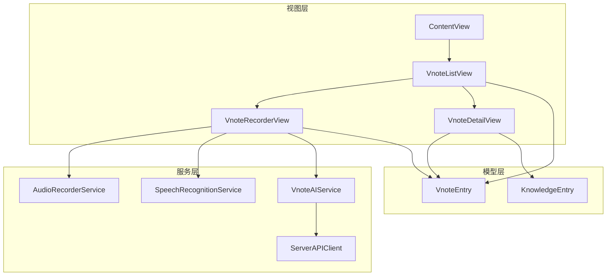
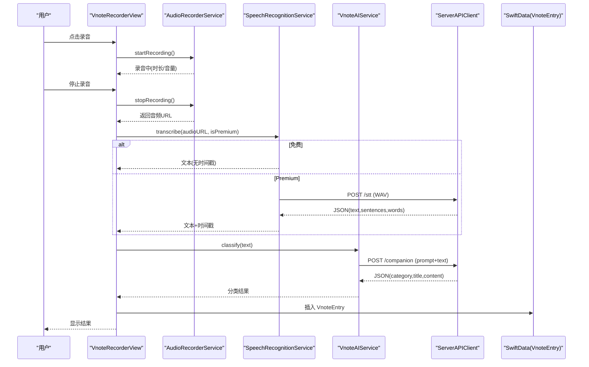
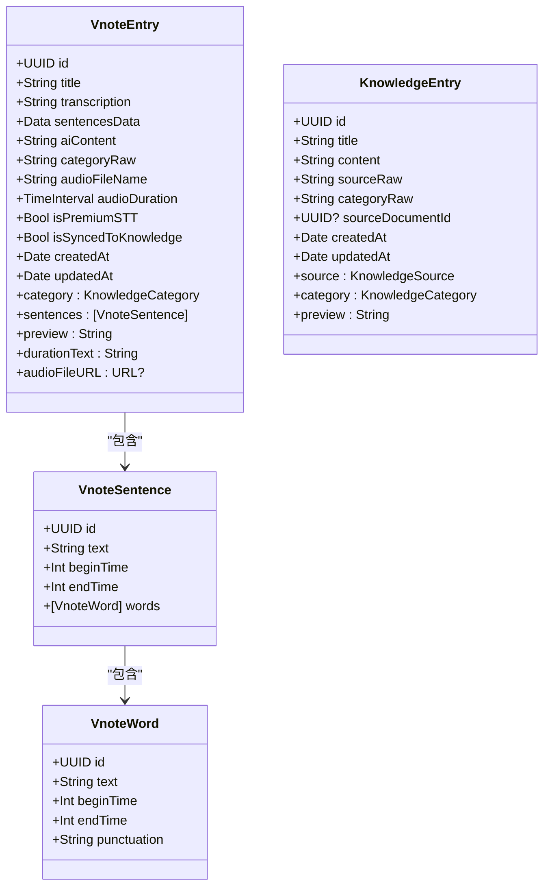
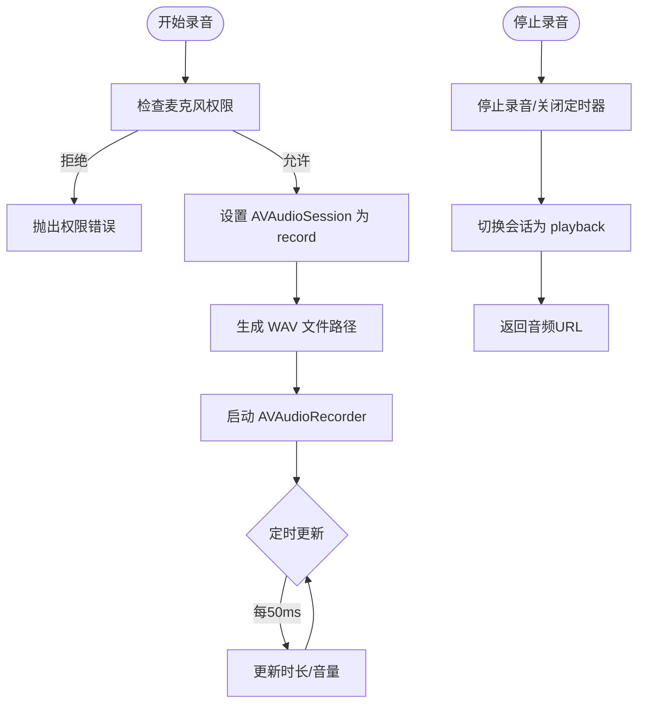
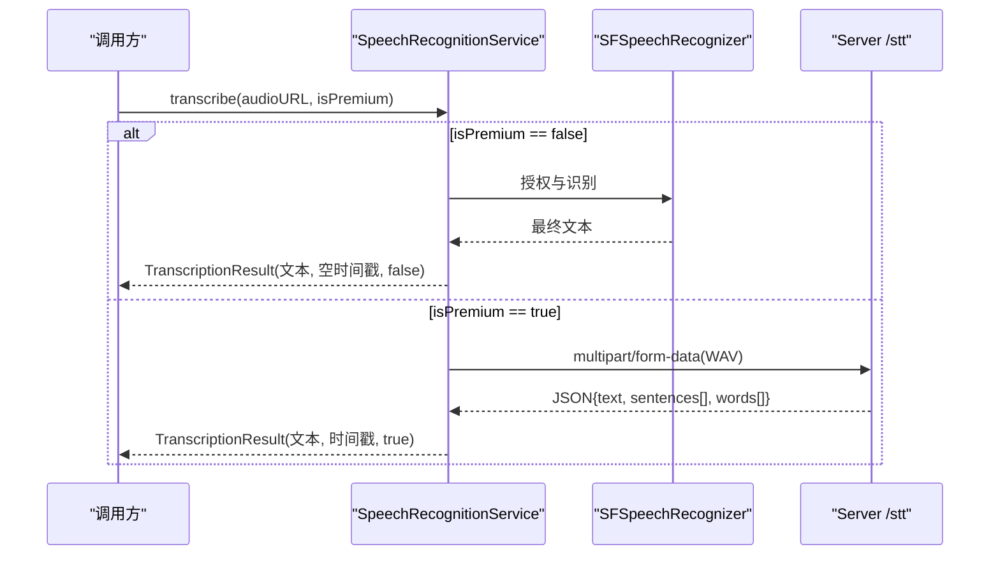
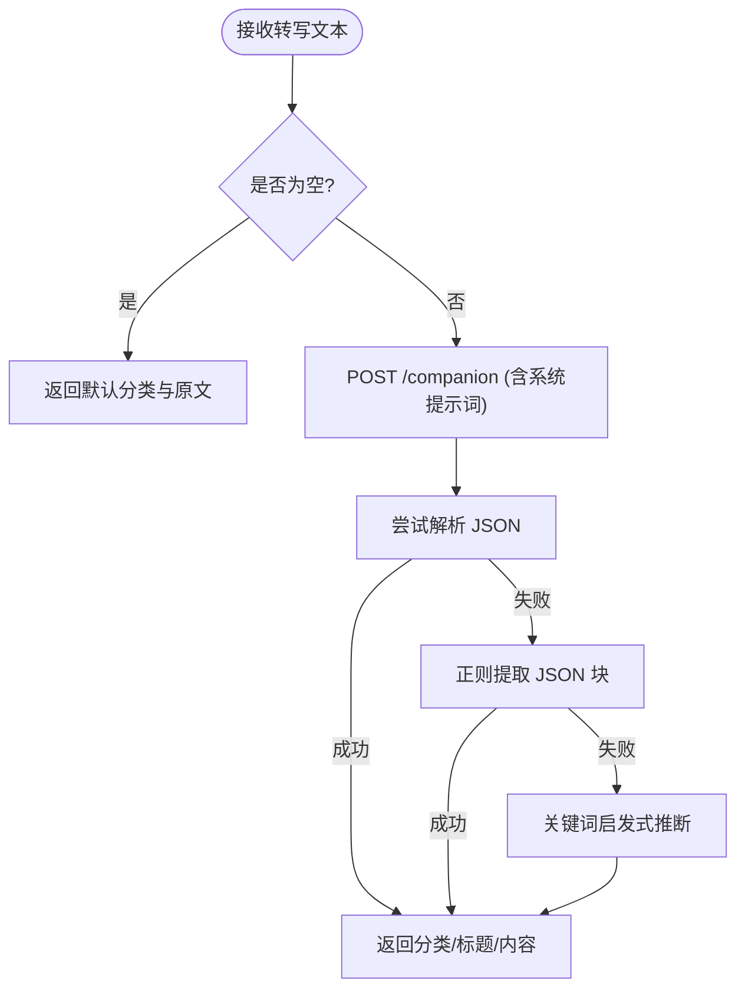
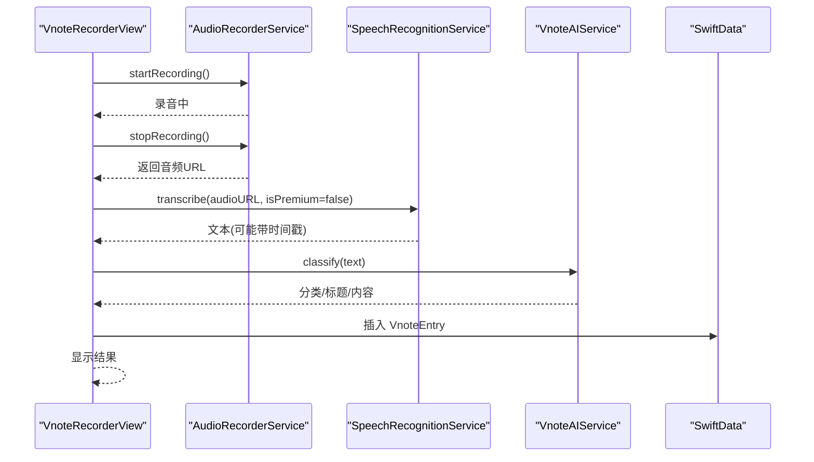
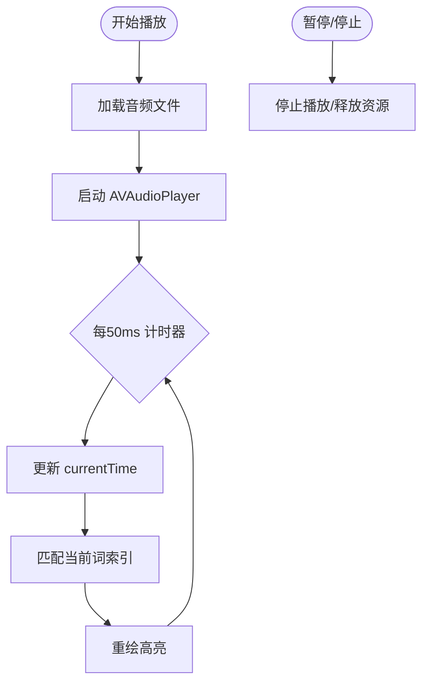
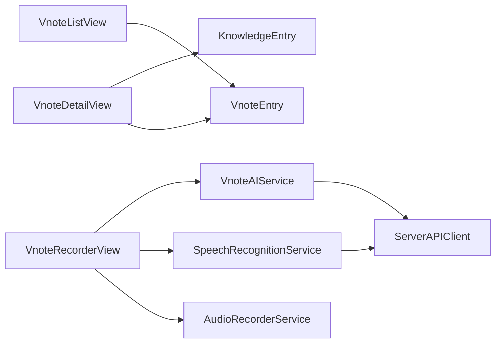

# 语音笔记功能

<cite>
**本文引用的文件**   
- [VnoteEntry.swift](file://Models/VnoteEntry.swift)
- [KnowledgeEntry.swift](file://Models/KnowledgeEntry.swift)
- [VnoteRecorderView.swift](file://Views/VnoteRecorderView.swift)
- [VnoteListView.swift](file://Views/VnoteListView.swift)
- [VnoteDetailView.swift](file://Views/VnoteDetailView.swift)
- [AudioRecorderService.swift](file://Services/AudioRecorderService.swift)
- [SpeechRecognitionService.swift](file://Services/SpeechRecognitionService.swift)
- [VnoteAIService.swift](file://Services/VnoteAIService.swift)
- [ServerAPIClient.swift](file://Services/ServerAPIClient.swift)
- [ContentView.swift](file://Views/ContentView.swift)
</cite>

## 目录
1. [简介](#简介)
2. [项目结构](#项目结构)
3. [核心组件](#核心组件)
4. [架构总览](#架构总览)
5. [详细组件分析](#详细组件分析)
6. [依赖关系分析](#依赖关系分析)
7. [性能与体验优化建议](#性能与体验优化建议)
8. [故障排查指南](#故障排查指南)
9. [结论](#结论)

## 简介
本模块为“语音笔记（Vnote）”能力，覆盖从录音、转写、AI 分类整理到结果展示与沉淀至知识库的完整流程。支持免费本地转写与 Premium 云端字级时间戳高亮回放；提供列表浏览、筛选搜索、详情播放与一键沉淀等功能。

## 项目结构
围绕 Vnote 的核心代码分布在 Models、Views、Services 三层：
- Models：数据模型与持久化实体
- Views：UI 交互与状态呈现
- Services：录音、转写、AI 分类与网络请求封装

图表来源
- [ContentView.swift:17-28](file://Views/ContentView.swift#L17-L28)
- [VnoteListView.swift:13-53](file://Views/VnoteListView.swift#L13-L53)
- [VnoteRecorderView.swift:27-68](file://Views/VnoteRecorderView.swift#L27-L68)
- [VnoteDetailView.swift:17-48](file://Views/VnoteDetailView.swift#L17-L48)
- [AudioRecorderService.swift:7-26](file://Services/AudioRecorderService.swift#L7-L26)
- [SpeechRecognitionService.swift:8-33](file://Services/SpeechRecognitionService.swift#L8-L33)
- [VnoteAIService.swift:6-10](file://Services/VnoteAIService.swift#L6-L10)
- [ServerAPIClient.swift:6-21](file://Services/ServerAPIClient.swift#L6-L21)
- [VnoteEntry.swift:6-20](file://Models/VnoteEntry.swift#L6-L20)
- [KnowledgeEntry.swift:64-74](file://Models/KnowledgeEntry.swift#L64-L74)

章节来源
- [ContentView.swift:17-28](file://Views/ContentView.swift#L17-L28)
- [VnoteListView.swift:13-53](file://Views/VnoteListView.swift#L13-L53)
- [VnoteRecorderView.swift:27-68](file://Views/VnoteRecorderView.swift#L27-L68)
- [VnoteDetailView.swift:17-48](file://Views/VnoteDetailView.swift#L17-L48)

## 核心组件
- 数据模型
  - VnoteEntry：语音速记条目，包含标题、转写文本、句子与词级时间戳、AI 整理内容、分类、音频文件名与时长、是否 Premium STT、是否已沉淀等字段，并提供预览与时长格式化等计算属性。
  - KnowledgeEntry：知识库条目，记录来源类型、分类、正文与时间戳等。
- 录音服务
  - AudioRecorderService：基于 AVAudioRecorder 封装，录制 16kHz 单声道 PCM WAV，维护录音状态、时长与音量电平，管理录音文件路径与权限。
- 转写服务
  - SpeechRecognitionService：双层策略。免费走 Apple Speech 框架（离线可用、无时间戳），Premium 走服务器中转阿里云百炼（返回句级与词级时间戳）。
- AI 分类服务
  - VnoteAIService：通过 ServerAPIClient 调用 /companion 接口，将转写文本分类为会议纪要/创意速记/To-do/知识笔记，并生成结构化内容。
- 网络客户端
  - ServerAPIClient：统一封装 POST 请求、超时、响应校验与错误映射，兼容多种返回格式。
- UI 视图
  - VnoteListView：列表展示、分类筛选、搜索、新建录音入口、删除操作。
  - VnoteRecorderView：录音界面、波形可视化、处理进度、结果预览、沉淀按钮。
  - VnoteDetailView：详情展示、播放器控制、Premium 逐词高亮、沉淀知识库。

章节来源
- [VnoteEntry.swift:6-79](file://Models/VnoteEntry.swift#L6-L79)
- [KnowledgeEntry.swift:64-112](file://Models/KnowledgeEntry.swift#L64-L112)
- [AudioRecorderService.swift:7-112](file://Services/AudioRecorderService.swift#L7-L112)
- [SpeechRecognitionService.swift:8-156](file://Services/SpeechRecognitionService.swift#L8-L156)
- [VnoteAIService.swift:6-108](file://Services/VnoteAIService.swift#L6-L108)
- [ServerAPIClient.swift:6-208](file://Services/ServerAPIClient.swift#L6-L208)
- [VnoteListView.swift:13-242](file://Views/VnoteListView.swift#L13-L242)
- [VnoteRecorderView.swift:27-339](file://Views/VnoteRecorderView.swift#L27-L339)
- [VnoteDetailView.swift:17-380](file://Views/VnoteDetailView.swift#L17-L380)

## 架构总览
Vnote 采用分层架构：UI 层负责交互与展示，服务层负责业务逻辑与外部集成，模型层负责数据持久化。关键流程如下：
- 录音：VnoteRecorderView 调用 AudioRecorderService 开始/停止录音，保存 WAV 文件。
- 转写：根据 isPremium 选择 Apple Speech 或服务端 STT，得到文本与可选的时间戳。
- 分类：VnoteAIService 调用 ServerAPIClient 的 /companion 接口，返回分类、标题与结构化内容。
- 持久化：创建 VnoteEntry 写入 SwiftData，必要时同步沉淀为 KnowledgeEntry。
- 回放：VnoteDetailView 使用 AVAudioPlayer 播放录音，Premium 用户按当前时间匹配词级时间戳实现高亮。

图表来源
- [VnoteRecorderView.swift:244-307](file://Views/VnoteRecorderView.swift#L244-L307)
- [AudioRecorderService.swift:29-102](file://Services/AudioRecorderService.swift#L29-L102)
- [SpeechRecognitionService.swift:27-156](file://Services/SpeechRecognitionService.swift#L27-L156)
- [VnoteAIService.swift:45-98](file://Services/VnoteAIService.swift#L45-L98)
- [ServerAPIClient.swift:37-45](file://Services/ServerAPIClient.swift#L37-L45)
- [VnoteEntry.swift:54-79](file://Models/VnoteEntry.swift#L54-L79)

## 详细组件分析

### 数据模型与领域对象
- VnoteEntry
  - 关键字段：标题、转写文本、句子与词级时间戳（JSON 编码）、AI 整理内容、分类、音频文件名与时长、是否 Premium STT、是否已沉淀、创建/更新时间。
  - 计算属性：类别枚举转换、句子解码/编码、文本预览、时长格式化、音频文件 URL。
  - 复杂度：句子与词数组在详情页用于高亮渲染，时间复杂度 O(N) 线性扫描当前时间匹配词索引。
- KnowledgeEntry
  - 关键字段：标题、正文、来源类型、分类、来源文档 ID、时间戳。
  - 用途：作为 Vnote 沉淀的目标实体，便于统一检索与管理。

图表来源
- [VnoteEntry.swift:6-112](file://Models/VnoteEntry.swift#L6-L112)
- [KnowledgeEntry.swift:64-112](file://Models/KnowledgeEntry.swift#L64-L112)

章节来源
- [VnoteEntry.swift:6-112](file://Models/VnoteEntry.swift#L6-L112)
- [KnowledgeEntry.swift:64-112](file://Models/KnowledgeEntry.swift#L64-L112)

### 录音服务（AudioRecorderService）
- 职责：初始化 AVAudioSession、申请麦克风权限、配置 16kHz 单声道 PCM 参数、启动/停止录音、更新时长与音量电平、清理临时文件。
- 关键点：
  - 权限失败抛出明确错误，提示开启麦克风权限。
  - 录音结束后切回播放模式，避免影响后续播放。
  - 使用定时器高频更新 meterLevel 与 duration，驱动 UI 波形与计时器。

图表来源
- [AudioRecorderService.swift:29-102](file://Services/AudioRecorderService.swift#L29-L102)

章节来源
- [AudioRecorderService.swift:7-140](file://Services/AudioRecorderService.swift#L7-L140)

### 转写服务（SpeechRecognitionService）
- 双层策略：
  - 免费：Apple Speech 框架，本地识别，返回纯文本，无时间戳。
  - Premium：上传 WAV 到服务器 /stt，解析 JSON 中的 text、sentences、words，构建 VnoteSentence/VnoteWord 列表。
- 错误处理：区分权限不可用、识别器不可用、服务端异常、响应解析失败等场景。

图表来源
- [SpeechRecognitionService.swift:27-156](file://Services/SpeechRecognitionService.swift#L27-L156)

章节来源
- [SpeechRecognitionService.swift:8-179](file://Services/SpeechRecognitionService.swift#L8-L179)

### AI 分类服务（VnoteAIService）
- 输入：转写文本（截断前 6000 字符）。
- 输出：分类（meeting/creative/todo/general）、标题、结构化内容。
- 容错：优先解析 JSON，其次正则提取 JSON 块，最后关键词启发式推断。

图表来源
- [VnoteAIService.swift:45-108](file://Services/VnoteAIService.swift#L45-L108)

章节来源
- [VnoteAIService.swift:6-108](file://Services/VnoteAIService.swift#L6-L108)

### 网络客户端（ServerAPIClient）
- 统一封装 POST 请求、超时、响应码校验、多格式兼容（result/content/output.choices.message.content）。
- 错误映射：未授权、配额超限、无效响应、无音频数据、网络错误等。

章节来源
- [ServerAPIClient.swift:6-208](file://Services/ServerAPIClient.swift#L6-L208)

### 视图层与交互流程

#### 列表页（VnoteListView）
- 功能：按更新时间倒序展示、分类筛选、全文搜索、新建录音、删除条目（同时删除录音文件）。
- 数据来源：SwiftData Query 绑定 VnoteEntry。

章节来源
- [VnoteListView.swift:13-242](file://Views/VnoteListView.swift#L13-L242)

#### 录音页（VnoteRecorderView）
- 流程：
  - 开始录音 → 实时波形与时长 → 停止录音 → 触发 STT → AI 分类 → 创建 VnoteEntry → 展示结果 → 可沉淀到知识库。
  - 若 STT 失败，仍保存录音，提示稍后重试。
- 关键交互：取消录音、完成返回、错误弹窗。

图表来源
- [VnoteRecorderView.swift:244-307](file://Views/VnoteRecorderView.swift#L244-L307)
- [AudioRecorderService.swift:29-102](file://Services/AudioRecorderService.swift#L29-L102)
- [SpeechRecognitionService.swift:27-156](file://Services/SpeechRecognitionService.swift#L27-L156)
- [VnoteAIService.swift:45-98](file://Services/VnoteAIService.swift#L45-L98)
- [VnoteEntry.swift:54-79](file://Models/VnoteEntry.swift#L54-L79)

章节来源
- [VnoteRecorderView.swift:27-339](file://Views/VnoteRecorderView.swift#L27-L339)

#### 详情页（VnoteDetailView）
- 功能：头部信息、播放器控制、AI 整理内容、转写文本（Premium 高亮）、沉淀知识库。
- 高亮算法：将全部词按 begin/end 时间排序，播放时以当前毫秒时间查找活跃词索引，进行背景高亮；点击词跳转播放位置。
- 播放控制：Timer 周期更新 currentTime，结束自动停止。

图表来源
- [VnoteDetailView.swift:248-317](file://Views/VnoteDetailView.swift#L248-L317)
- [VnoteDetailView.swift:182-214](file://Views/VnoteDetailView.swift#L182-L214)

章节来源
- [VnoteDetailView.swift:17-380](file://Views/VnoteDetailView.swift#L17-L380)

### 应用入口与导航
- ContentView 提供底部 Tab 导航，其中包含“Vnote”入口，进入 VnoteListView。

章节来源
- [ContentView.swift:17-28](file://Views/ContentView.swift#L17-L28)

## 依赖关系分析
- 视图对服务的依赖：
  - VnoteRecorderView 依赖 AudioRecorderService、SpeechRecognitionService、VnoteAIService。
  - VnoteDetailView 依赖 AVFoundation 播放与 SwiftData 上下文。
  - VnoteListView 依赖 SwiftData 查询与 FileManager 删除。
- 服务间依赖：
  - SpeechRecognitionService 在 Premium 模式下依赖 ServerAPIClient。
  - VnoteAIService 依赖 ServerAPIClient。
- 模型与视图：
  - 所有视图通过 SwiftData 上下文读写 VnoteEntry 与 KnowledgeEntry。

图表来源
- [VnoteListView.swift:13-242](file://Views/VnoteListView.swift#L13-L242)
- [VnoteRecorderView.swift:244-307](file://Views/VnoteRecorderView.swift#L244-L307)
- [VnoteDetailView.swift:17-380](file://Views/VnoteDetailView.swift#L17-L380)
- [SpeechRecognitionService.swift:27-156](file://Services/SpeechRecognitionService.swift#L27-L156)
- [VnoteAIService.swift:45-98](file://Services/VnoteAIService.swift#L45-L98)
- [ServerAPIClient.swift:6-208](file://Services/ServerAPIClient.swift#L6-L208)
- [VnoteEntry.swift:6-79](file://Models/VnoteEntry.swift#L6-L79)
- [KnowledgeEntry.swift:64-112](file://Models/KnowledgeEntry.swift#L64-L112)

章节来源
- [VnoteListView.swift:13-242](file://Views/VnoteListView.swift#L13-L242)
- [VnoteRecorderView.swift:244-307](file://Views/VnoteRecorderView.swift#L244-L307)
- [VnoteDetailView.swift:17-380](file://Views/VnoteDetailView.swift#L17-L380)
- [SpeechRecognitionService.swift:27-156](file://Services/SpeechRecognitionService.swift#L27-L156)
- [VnoteAIService.swift:45-98](file://Services/VnoteAIService.swift#L45-L98)
- [ServerAPIClient.swift:6-208](file://Services/ServerAPIClient.swift#L6-L208)
- [VnoteEntry.swift:6-79](file://Models/VnoteEntry.swift#L6-L79)
- [KnowledgeEntry.swift:64-112](file://Models/KnowledgeEntry.swift#L64-L112)

## 性能与体验优化建议
- 录音与转写
  - 短录音过滤：已在停止时判断时长小于 1 秒直接丢弃，避免无效数据。
  - 转写并发：可在未来引入队列限制与重试机制，避免频繁网络请求导致卡顿。
- 高亮渲染
  - 当前逐词遍历匹配，O(N) 复杂度；当词数较多时可考虑二分查找或区间树优化。
  - Timer 频率 50ms 较细，建议在低端设备上适当降低刷新率。
- 内存与存储
  - 删除条目时同步删除录音文件，避免残留占用。
  - 大音频文件建议按需加载与缓存策略，减少重复 IO。
- 用户体验
  - 增加转写进度反馈（如分段提示：上传→识别→解析）。
  - 弱网环境下提供降级策略（仅本地转写或延迟处理）。

[本节为通用建议，不直接分析具体文件]

## 故障排查指南
- 无法录音
  - 现象：提示需要麦克风权限。
  - 排查：确认系统设置中已授予麦克风权限；检查 AVAudioSession 设置是否正确。
  - 参考：[AudioRecorderService.swift:29-44](file://Services/AudioRecorderService.swift#L29-L44)
- 转写失败（免费）
  - 现象：提示语音识别服务不可用或权限不足。
  - 排查：检查 SFSpeechRecognizer 授权与可用性；确保设备语言包下载完成。
  - 参考：[SpeechRecognitionService.swift:37-59](file://Services/SpeechRecognitionService.swift#L37-L59)
- 转写失败（Premium）
  - 现象：服务端错误或响应解析失败。
  - 排查：检查网络连接、服务端状态；查看返回码与消息；确认 /stt 接口返回 JSON 结构。
  - 参考：[SpeechRecognitionService.swift:86-156](file://Services/SpeechRecognitionService.swift#L86-L156)
- AI 分类异常
  - 现象：返回非 JSON 或字段缺失。
  - 排查：查看提示词与截断长度；启用 fallback 关键词推断；检查 /companion 返回格式。
  - 参考：[VnoteAIService.swift:68-108](file://Services/VnoteAIService.swift#L68-L108)
- 播放无声音
  - 现象：详情页无法播放或高亮不生效。
  - 排查：确认音频文件存在且路径正确；检查 AVAudioPlayer 初始化与 Timer 是否运行；Premium 高亮需有词级时间戳。
  - 参考：[VnoteDetailView.swift:256-297](file://Views/VnoteDetailView.swift#L256-L297)

章节来源
- [AudioRecorderService.swift:29-44](file://Services/AudioRecorderService.swift#L29-L44)
- [SpeechRecognitionService.swift:37-59](file://Services/SpeechRecognitionService.swift#L37-L59)
- [SpeechRecognitionService.swift:86-156](file://Services/SpeechRecognitionService.swift#L86-L156)
- [VnoteAIService.swift:68-108](file://Services/VnoteAIService.swift#L68-L108)
- [VnoteDetailView.swift:256-297](file://Views/VnoteDetailView.swift#L256-L297)

## 结论
Vnote 语音笔记功能以清晰的层次划分与模块化设计实现了从录音到结构化知识沉淀的闭环。通过免费与 Premium 双通道转写策略兼顾可用性与准确性，结合 AI 分类与高亮回放提升了阅读与回顾效率。后续可在性能优化、错误恢复与用户体验方面持续迭代。