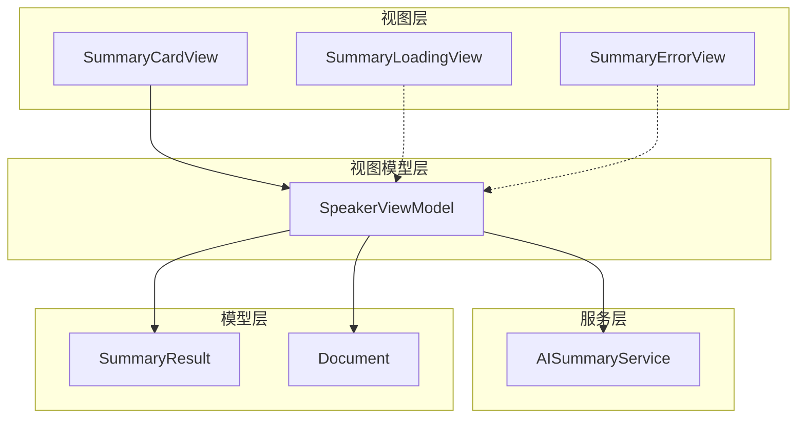
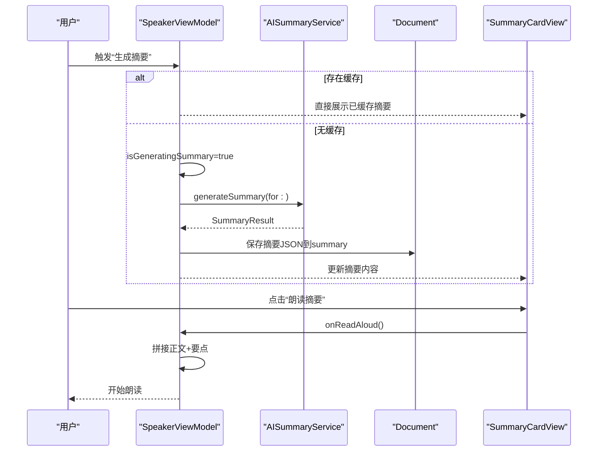
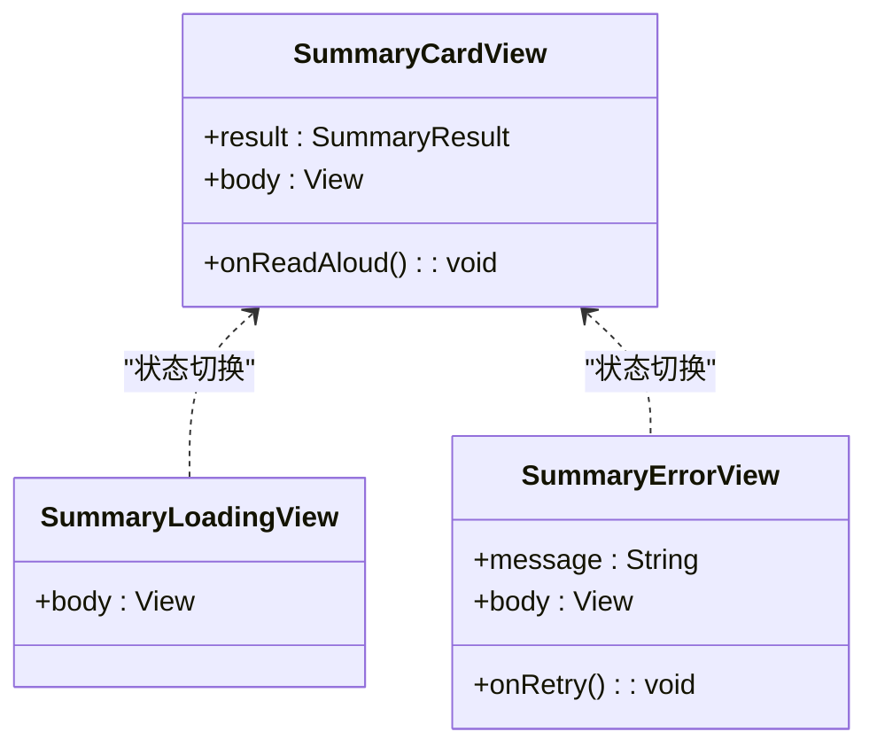
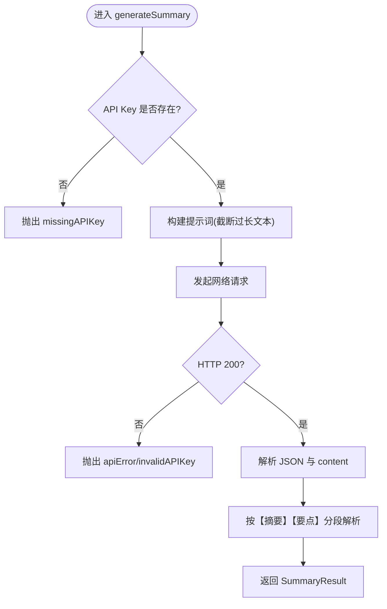
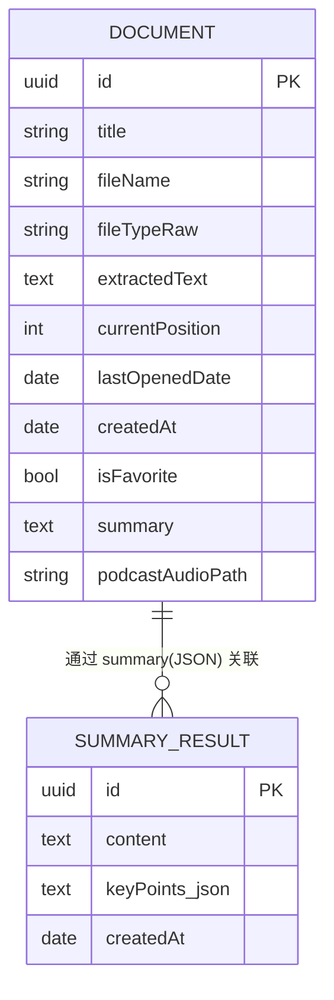
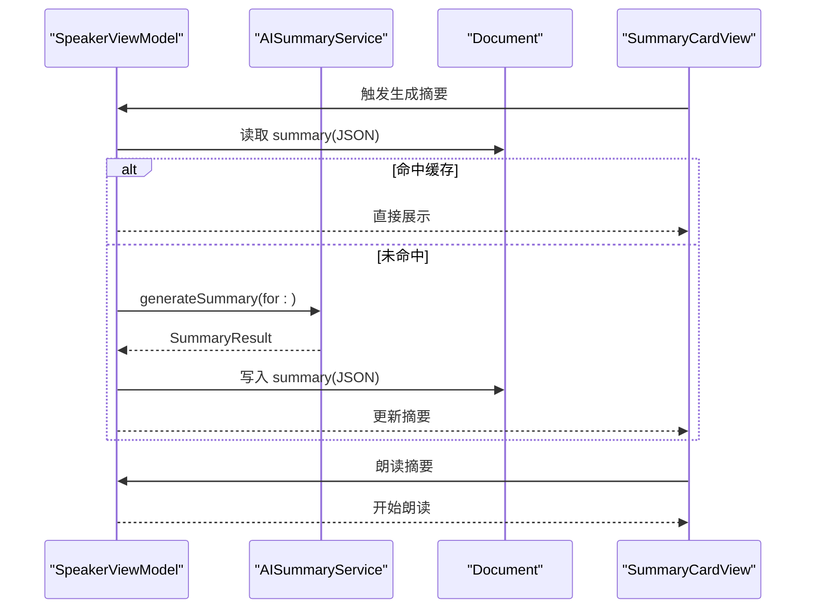
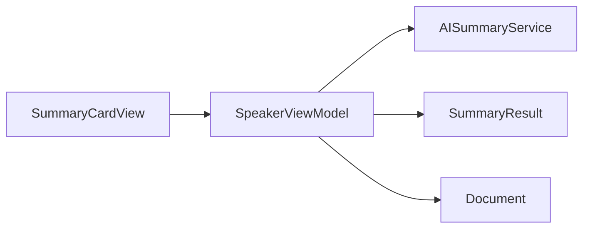

# AI摘要界面

<cite>
**本文引用的文件**
- [Views/SummaryCardView.swift](file://Views/SummaryCardView.swift)
- [Services/AISummaryService.swift](file://Services/AISummaryService.swift)
- [Models/SummaryResult.swift](file://Models/SummaryResult.swift)
- [ViewModels/SpeakerViewModel.swift](file://ViewModels/SpeakerViewModel.swift)
- [Models/Document.swift](file://Models/Document.swift)
</cite>

## 目录
1. [简介](#简介)
2. [项目结构](#项目结构)
3. [核心组件](#核心组件)
4. [架构总览](#架构总览)
5. [详细组件分析](#详细组件分析)
6. [依赖关系分析](#依赖关系分析)
7. [性能与缓存优化](#性能与缓存优化)
8. [故障排查指南](#故障排查指南)
9. [结论](#结论)
10. [附录：扩展与定制指南](#附录扩展与定制指南)

## 简介
本文件面向“AI 摘要界面”的实现与使用，聚焦于 SummaryCardView 的设计与实现、加载状态与错误处理的用户反馈、摘要内容的格式化展示、朗读功能以及与 AISummaryService 的数据绑定和实时更新机制。同时涵盖摘要的缓存策略与本地存储优化，并提供自定义卡片样式与扩展功能的开发指南。

## 项目结构
围绕 AI 摘要功能的关键文件组织如下：
- Views/SummaryCardView.swift：摘要展示卡片、加载中视图、错误视图
- Services/AISummaryService.swift：调用云端模型生成摘要、解析响应、错误定义
- Models/SummaryResult.swift：摘要结果数据模型（正文 + 关键要点）
- ViewModels/SpeakerViewModel.swift：聚合业务逻辑，负责触发摘要生成、缓存读写、朗读等
- Models/Document.swift：文档实体，包含摘要 JSON 字符串字段用于持久化

图表来源
- [Views/SummaryCardView.swift:1-197](file://Views/SummaryCardView.swift#L1-L197)
- [ViewModels/SpeakerViewModel.swift:172-211](file://ViewModels/SpeakerViewModel.swift#L172-L211)
- [Services/AISummaryService.swift:1-180](file://Services/AISummaryService.swift#L1-L180)
- [Models/SummaryResult.swift:1-33](file://Models/SummaryResult.swift#L1-L33)
- [Models/Document.swift:54-114](file://Models/Document.swift#L54-L114)

章节来源
- [Views/SummaryCardView.swift:1-197](file://Views/SummaryCardView.swift#L1-L197)
- [ViewModels/SpeakerViewModel.swift:172-211](file://ViewModels/SpeakerViewModel.swift#L172-L211)
- [Services/AISummaryService.swift:1-180](file://Services/AISummaryService.swift#L1-L180)
- [Models/SummaryResult.swift:1-33](file://Models/SummaryResult.swift#L1-L33)
- [Models/Document.swift:54-114](file://Models/Document.swift#L54-L114)

## 核心组件
- SummaryCardView：以卡片形式展示摘要正文与关键要点，提供朗读入口，支持导航返回。
- SummaryLoadingView：动画提示用户正在生成摘要。
- SummaryErrorView：展示错误信息并提供重试与取消操作。
- SpeakerViewModel：协调摘要生成流程、缓存命中、错误状态暴露给 UI，并封装朗读逻辑。
- AISummaryService：封装网络请求、提示词构建、响应解析与错误映射。
- SummaryResult：摘要数据结构体，含正文、要点列表与时间戳，提供 JSON 序列化方法。
- Document：SwiftData 模型，包含 summary 字段用于持久化摘要 JSON。

章节来源
- [Views/SummaryCardView.swift:1-197](file://Views/SummaryCardView.swift#L1-L197)
- [ViewModels/SpeakerViewModel.swift:172-211](file://ViewModels/SpeakerViewModel.swift#L172-L211)
- [Services/AISummaryService.swift:1-180](file://Services/AISummaryService.swift#L1-L180)
- [Models/SummaryResult.swift:1-33](file://Models/SummaryResult.swift#L1-L33)
- [Models/Document.swift:54-114](file://Models/Document.swift#L54-L114)

## 架构总览
AI 摘要的整体交互流程如下：
- 用户在文档详情或播放页触发“生成摘要”。
- SpeakerViewModel 检查当前文档是否已有摘要缓存；若命中则直接显示。
- 未命中时设置加载状态，异步调用 AISummaryService 生成摘要。
- 成功时更新 ViewModel 状态并将结果 JSON 写入 Document.summary 进行持久化。
- 失败时记录错误消息，UI 切换至错误视图并提供重试。
- 用户点击“朗读摘要”，ViewModel 将正文与要点拼接后交由 TTS 引擎朗读。

图表来源
- [ViewModels/SpeakerViewModel.swift:172-211](file://ViewModels/SpeakerViewModel.swift#L172-L211)
- [Services/AISummaryService.swift:25-34](file://Services/AISummaryService.swift#L25-L34)
- [Models/Document.swift:65-66](file://Models/Document.swift#L65-L66)
- [Views/SummaryCardView.swift:68-77](file://Views/SummaryCardView.swift#L68-L77)

## 详细组件分析

### SummaryCardView 设计与实现
- 展示格式
  - 标题区：带图标与强调色的“AI 摘要”标题。
  - 正文区：摘要文本，采用圆角背景块提升可读性。
  - 关键要点区：有序编号列表，左侧圆形序号标记，右侧要点文本。
  - 操作区：主按钮“朗读摘要”，通过回调触发朗读。
- 交互方式
  - 顶部导航栏显示“文档总结”，右上角“完成”关闭页面。
  - 滚动区域承载长内容，适配不同屏幕尺寸。
- 状态组合
  - 正常态：由传入的 SummaryResult 渲染。
  - 加载中态：由 SummaryLoadingView 呈现环形进度与提示文案。
  - 错误态：由 SummaryErrorView 展示错误信息与重试/取消按钮。

图表来源
- [Views/SummaryCardView.swift:5-91](file://Views/SummaryCardView.swift#L5-L91)
- [Views/SummaryCardView.swift:95-140](file://Views/SummaryCardView.swift#L95-L140)
- [Views/SummaryCardView.swift:144-182](file://Views/SummaryCardView.swift#L144-L182)

章节来源
- [Views/SummaryCardView.swift:1-197](file://Views/SummaryCardView.swift#L1-L197)

### AISummaryService 数据绑定与解析
- 输入输出
  - 输入：文档原文文本、可选的最大长度参数。
  - 输出：SummaryResult（正文 + 关键要点）。
- 提示词构建
  - 对过长文本进行截断，构造结构化提示词，要求按“【摘要】”“【要点】”格式回复。
- 网络请求
  - 使用 URLSession 发起 POST 请求，携带 Authorization 头与请求体。
  - 超时与状态码校验，针对 401/403 抛出无效 API Key 错误。
- 响应解析
  - 从 JSON 中取 output.choices[0].message.content。
  - 根据“【摘要】”“【要点】”分段解析，兼容多种要点前缀格式。
- 错误映射
  - 统一转换为 AIServiceError，便于上层捕获与展示。

图表来源
- [Services/AISummaryService.swift:25-34](file://Services/AISummaryService.swift#L25-L34)
- [Services/AISummaryService.swift:38-58](file://Services/AISummaryService.swift#L38-L58)
- [Services/AISummaryService.swift:60-107](file://Services/AISummaryService.swift#L60-L107)
- [Services/AISummaryService.swift:109-153](file://Services/AISummaryService.swift#L109-L153)
- [Services/AISummaryService.swift:158-179](file://Services/AISummaryService.swift#L158-L179)

章节来源
- [Services/AISummaryService.swift:1-180](file://Services/AISummaryService.swift#L1-L180)

### 数据模型与本地存储
- SummaryResult
  - 字段：content、keyPoints、createdAt。
  - 提供 toJSON()/fromJSON() 用于持久化。
- Document
  - 字段：summary(String?) 用于存储摘要 JSON 字符串。
  - SwiftData 注解 @Model，使 summary 可随文档持久化。
- 缓存策略
  - 在生成摘要前，优先读取 Document.summary 并反序列化为 SummaryResult。
  - 成功后立即写回 Document.summary，避免重复请求。

图表来源
- [Models/Document.swift:54-114](file://Models/Document.swift#L54-L114)
- [Models/SummaryResult.swift:1-33](file://Models/SummaryResult.swift#L1-L33)

章节来源
- [Models/SummaryResult.swift:1-33](file://Models/SummaryResult.swift#L1-L33)
- [Models/Document.swift:54-114](file://Models/Document.swift#L54-L114)

### 视图模型与实时更新
- 状态管理
  - @Published summaryResult、isGeneratingSummary、summaryError 驱动 UI 刷新。
- 生成流程
  - 先查缓存；若无缓存则设置加载状态并异步调用 AISummaryService。
  - 成功时更新 summaryResult 并持久化；失败时设置 summaryError。
- 朗读流程
  - 将正文与要点拼接为完整朗读文本，停止当前播放并重新朗读。

图表来源
- [ViewModels/SpeakerViewModel.swift:172-211](file://ViewModels/SpeakerViewModel.swift#L172-L211)
- [Services/AISummaryService.swift:25-34](file://Services/AISummaryService.swift#L25-L34)
- [Models/Document.swift:65-66](file://Models/Document.swift#L65-L66)

章节来源
- [ViewModels/SpeakerViewModel.swift:172-211](file://ViewModels/SpeakerViewModel.swift#L172-L211)

## 依赖关系分析
- 视图层依赖视图模型：SummaryCardView 通过回调与 ViewModel 交互。
- 视图模型依赖服务与模型：SpeakerViewModel 调用 AISummaryService，读写 Document.summary。
- 服务层独立：AISummaryService 仅依赖系统网络能力与 JSON 序列化。
- 模型层被多处引用：SummaryResult 与 Document 共同支撑摘要数据的流转与持久化。

图表来源
- [Views/SummaryCardView.swift:1-197](file://Views/SummaryCardView.swift#L1-L197)
- [ViewModels/SpeakerViewModel.swift:172-211](file://ViewModels/SpeakerViewModel.swift#L172-L211)
- [Services/AISummaryService.swift:1-180](file://Services/AISummaryService.swift#L1-L180)
- [Models/SummaryResult.swift:1-33](file://Models/SummaryResult.swift#L1-L33)
- [Models/Document.swift:54-114](file://Models/Document.swift#L54-L114)

章节来源
- [Views/SummaryCardView.swift:1-197](file://Views/SummaryCardView.swift#L1-L197)
- [ViewModels/SpeakerViewModel.swift:172-211](file://ViewModels/SpeakerViewModel.swift#L172-L211)
- [Services/AISummaryService.swift:1-180](file://Services/AISummaryService.swift#L1-L180)
- [Models/SummaryResult.swift:1-33](file://Models/SummaryResult.swift#L1-L33)
- [Models/Document.swift:54-114](file://Models/Document.swift#L54-L114)

## 性能与缓存优化
- 缓存命中优先：生成前先读取 Document.summary，避免重复网络请求。
- 增量持久化：成功后立即写回 Document.summary，保证下次打开即命中。
- 文本截断：服务端提示词构建时对超长文本截断，降低请求体积与延迟。
- 建议优化方向（通用指导）
  - 增加摘要版本或更新时间戳，以便在文档变更时失效旧缓存。
  - 引入内存级 LRU 缓存，减少频繁磁盘 I/O。
  - 对大文档分片摘要后再合并，提高质量与稳定性。
  - 对网络请求增加退避重试与幂等键，避免抖动导致重复生成。

[本节为通用性能建议，不直接分析具体文件]

## 故障排查指南
- 常见问题定位
  - 未配置 API Key：服务层会抛出缺失 API Key 错误，需引导用户前往设置配置。
  - API Key 无效：服务端返回 401/403，应提示用户检查密钥。
  - 网络异常或服务端错误：统一映射为 apiError，展示友好提示并允许重试。
- 用户反馈设计
  - 加载中：环形进度动画与提示文案，明确告知“正在生成摘要”。
  - 错误态：展示错误原因、重试与取消按钮，确保用户可恢复。
- 调试建议
  - 打印或记录 AIServiceError 的具体描述，便于快速定位问题。
  - 在 ViewModel 层捕获并展示 summaryError，结合日志上下文辅助诊断。

章节来源
- [Services/AISummaryService.swift:158-179](file://Services/AISummaryService.swift#L158-L179)
- [Views/SummaryCardView.swift:144-182](file://Views/SummaryCardView.swift#L144-L182)
- [ViewModels/SpeakerViewModel.swift:184-203](file://ViewModels/SpeakerViewModel.swift#L184-L203)

## 结论
AI 摘要界面通过清晰的视图分层、稳健的服务层与可靠的缓存策略，实现了良好的用户体验与可扩展性。SummaryCardView 专注于展示与基础交互，SpeakerViewModel 承担状态管理与流程编排，AISummaryService 屏蔽网络细节并规范化错误。整体架构易于扩展新的展示样式与功能点。

[本节为总结性内容，不直接分析具体文件]

## 附录：扩展与定制指南

### 自定义摘要卡片样式
- 目标：在不改变业务逻辑的前提下，调整视觉风格与布局。
- 步骤建议
  - 复制 SummaryCardView 作为新视图，替换字体、颜色、间距与背景装饰。
  - 保持对外接口一致（传入 SummaryResult、onReadAloud 回调），确保 ViewModel 无需改动。
  - 如需新增操作（如分享、收藏），可在视图内添加按钮并通过闭包向上冒泡事件。

章节来源
- [Views/SummaryCardView.swift:10-91](file://Views/SummaryCardView.swift#L10-L91)

### 扩展摘要功能
- 目标：在现有摘要基础上增加新功能，例如复制、分享、收藏、导出等。
- 步骤建议
  - 在 SummaryCardView 中添加相应按钮与行为。
  - 对于复制/分享，可通过系统剪贴板与 ShareSheet 集成。
  - 对于收藏，可将摘要 ID 或文档 ID 加入收藏集合，并在列表中标记。
  - 注意保持与 ViewModel 的解耦，必要时在 ViewModel 中暴露对应方法供视图调用。

章节来源
- [Views/SummaryCardView.swift:68-77](file://Views/SummaryCardView.swift#L68-L77)
- [Models/SummaryResult.swift:5-18](file://Models/SummaryResult.swift#L5-L18)

### 与 AISummaryService 的数据绑定与实时更新
- 目标：确保 UI 能实时反映摘要生成状态与结果。
- 关键点
  - 使用 @Published 属性驱动视图刷新。
  - 在异步任务完成后回到主线程更新状态。
  - 错误路径及时清空加载状态并设置错误消息。

章节来源
- [ViewModels/SpeakerViewModel.swift:32-34](file://ViewModels/SpeakerViewModel.swift#L32-L34)
- [ViewModels/SpeakerViewModel.swift:184-203](file://ViewModels/SpeakerViewModel.swift#L184-L203)