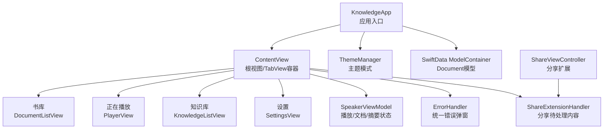
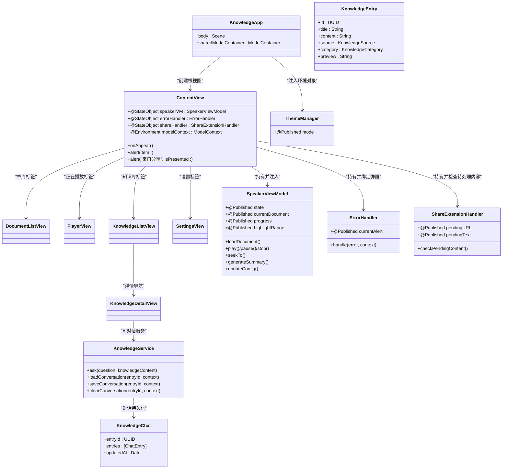
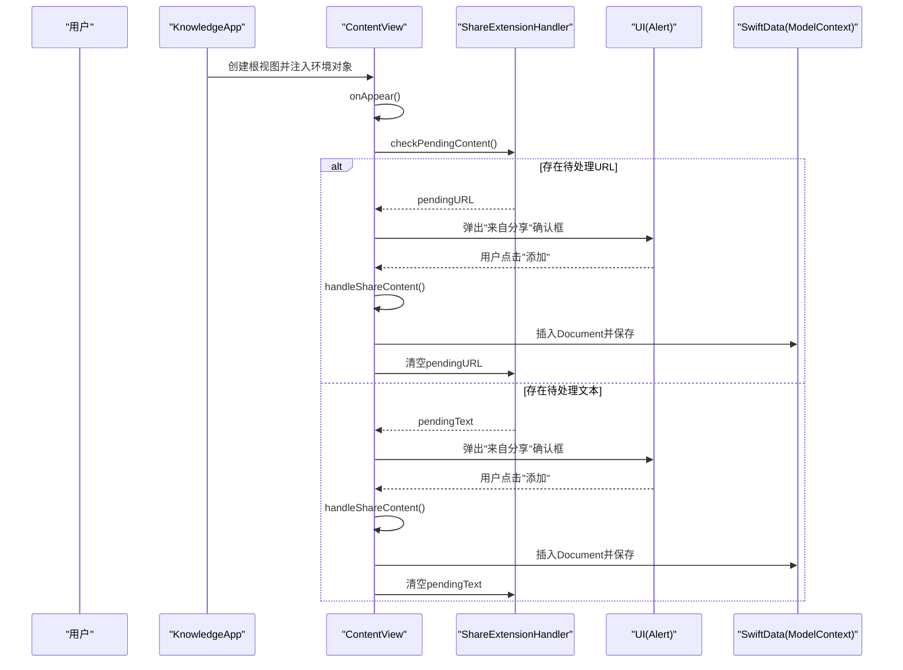
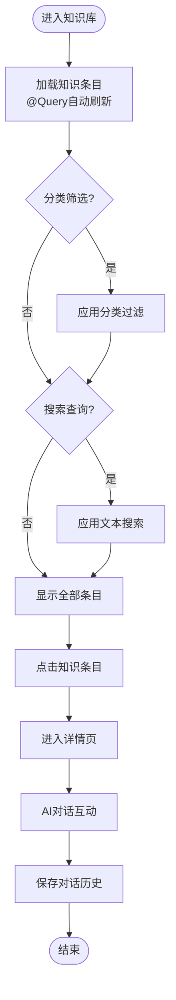
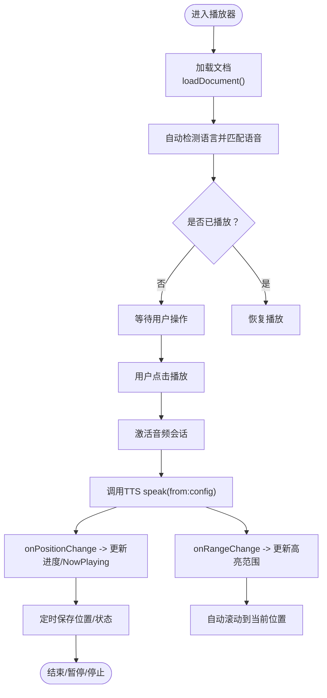
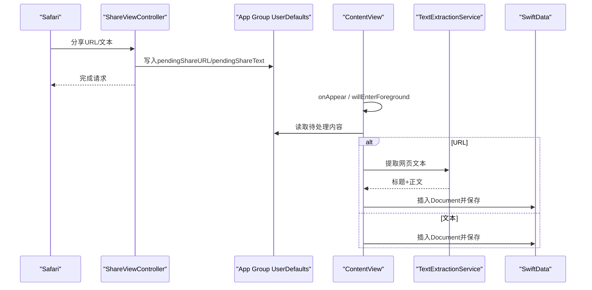
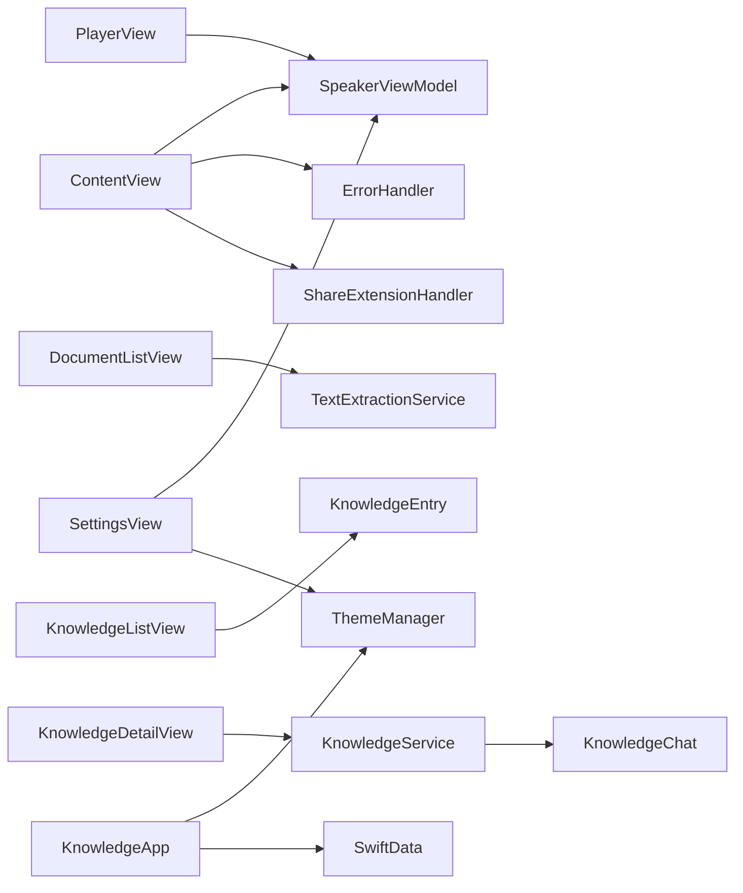

# 主导航架构

<cite>
**本文引用的文件**
- [KnowledgeApp.swift](file://App/KnowledgeApp.swift)
- [AppDelegate.swift](file://App/AppDelegate.swift)
- [ContentView.swift](file://Views/ContentView.swift)
- [DocumentListView.swift](file://Views/DocumentListView.swift)
- [PlayerView.swift](file://Views/PlayerView.swift)
- [KnowledgeListView.swift](file://Views/KnowledgeListView.swift)
- [KnowledgeDetailView.swift](file://Views/KnowledgeDetailView.swift)
- [SettingsView.swift](file://Views/SettingsView.swift)
- [SpeakerViewModel.swift](file://ViewModels/SpeakerViewModel.swift)
- [ShareExtensionHandler.swift](file://Services/ShareExtensionHandler.swift)
- [ErrorHandler.swift](file://Services/ErrorHandler.swift)
- [ThemeManager.swift](file://Services/ThemeManager.swift)
- [ThemeMode.swift](file://Models/ThemeMode.swift)
- [VoiceConfig.swift](file://Models/VoiceConfig.swift)
- [Document.swift](file://Models/Document.swift)
- [KnowledgeEntry.swift](file://Models/KnowledgeEntry.swift)
- [KnowledgeChat.swift](file://Models/KnowledgeChat.swift)
- [KnowledgeService.swift](file://Services/KnowledgeService.swift)
- [CompanionChat.swift](file://Models/CompanionChat.swift)
- [ShareViewController.swift](file://ShareExtension/ShareViewController.swift)
</cite>

## 更新摘要
**变更内容**   
- 新增'知识库'标签页，完善了四标签导航架构
- 新增KnowledgeListView和KnowledgeDetailView视图组件
- 新增KnowledgeEntry、KnowledgeChat模型和相关服务
- 更新了架构图表以反映新的四标签结构

## 目录
1. [简介](#简介)
2. [项目结构](#项目结构)
3. [核心组件](#核心组件)
4. [架构总览](#架构总览)
5. [详细组件分析](#详细组件分析)
6. [依赖关系分析](#依赖关系分析)
7. [性能与体验优化](#性能与体验优化)
8. [故障排查指南](#故障排查指南)
9. [结论](#结论)
10. [附录：自定义标签页与导航样式配置](#附录自定义标签页与导航样式配置)

## 简介
本文件聚焦 Knowledge 应用的主导航架构，围绕 ContentView 作为根视图的设计模式展开，详细说明基于 TabView 的四标签导航（书库、正在播放、知识库、设置），以及根视图中的集中式状态管理策略。内容涵盖错误处理、分享扩展集成、生命周期管理、@StateObject 的使用模式与数据流向、导航切换时的状态保持机制和用户体验优化策略，并提供自定义标签页与导航样式的配置方法。

## 项目结构
Knowledge 采用 SwiftUI + SwiftData 的现代 iOS 架构，入口为 KnowledgeApp，根视图为 ContentView，内部通过 TabView 组织四大功能模块；全局服务（主题、错误、分享）以单例形式注入到视图层；播放与文档逻辑集中在 SpeakerViewModel 中，配合 SwiftData 持久化。

**图表来源**
- [KnowledgeApp.swift:1-29](file://App/KnowledgeApp.swift#L1-L29)
- [ContentView.swift:1-103](file://Views/ContentView.swift#L1-L103)
- [DocumentListView.swift:1-147](file://Views/DocumentListView.swift#L1-L147)
- [PlayerView.swift:1-174](file://Views/PlayerView.swift#L1-L174)
- [KnowledgeListView.swift:1-190](file://Views/KnowledgeListView.swift#L1-L190)
- [SettingsView.swift:1-194](file://Views/SettingsView.swift#L1-L194)
- [SpeakerViewModel.swift:1-314](file://ViewModels/SpeakerViewModel.swift#L1-L314)
- [ShareExtensionHandler.swift:1-34](file://Services/ShareExtensionHandler.swift#L1-L34)
- [ErrorHandler.swift:1-53](file://Services/ErrorHandler.swift#L1-L53)
- [ThemeManager.swift:1-25](file://Services/ThemeManager.swift#L1-L25)
- [ShareViewController.swift:1-108](file://ShareExtension/ShareViewController.swift#L1-L108)

**章节来源**
- [KnowledgeApp.swift:1-29](file://App/KnowledgeApp.swift#L1-L29)
- [ContentView.swift:1-103](file://Views/ContentView.swift#L1-L103)

## 核心组件
- 根视图与导航容器
  - ContentView 作为应用根视图，负责构建 TabView 四标签导航，并集中挂载全局错误提示、分享扩展处理与生命周期事件监听。
- 标签页视图
  - 书库：DocumentListView，负责文档列表展示、导入、删除与网页链接添加。
  - 正在播放：PlayerView，负责当前文档朗读控制、进度条、文本高亮与摘要生成。
  - **知识库：KnowledgeListView，负责知识条目展示、分类筛选、搜索与AI对话**。
  - 设置：SettingsView，负责外观、语音引擎、语速/音高/音量、语言与声音选择等。
- 状态与业务中心
  - SpeakerViewModel：对外暴露播放控制、文档加载、AI 摘要、配置更新等能力，内部协调 TTS 引擎、远程控制、音频会话与错误降级。
  - **KnowledgeService：提供知识库AI对话服务，支持多轮上下文对话与持久化**。
- 全局服务
  - ErrorHandler：统一错误日志与弹窗。
  - ShareExtensionHandler：从 App Group 读取分享扩展写入的待处理 URL/文本。
  - ThemeManager：主题模式管理与持久化。

**章节来源**
- [ContentView.swift:1-103](file://Views/ContentView.swift#L1-L103)
- [DocumentListView.swift:1-147](file://Views/DocumentListView.swift#L1-L147)
- [PlayerView.swift:1-174](file://Views/PlayerView.swift#L1-L174)
- [KnowledgeListView.swift:1-190](file://Views/KnowledgeListView.swift#L1-L190)
- [SettingsView.swift:1-194](file://Views/SettingsView.swift#L1-L194)
- [SpeakerViewModel.swift:1-314](file://ViewModels/SpeakerViewModel.swift#L1-L314)
- [KnowledgeService.swift:1-114](file://Services/KnowledgeService.swift#L1-L114)
- [ErrorHandler.swift:1-53](file://Services/ErrorHandler.swift#L1-L53)
- [ShareExtensionHandler.swift:1-34](file://Services/ShareExtensionHandler.swift#L1-L34)
- [ThemeManager.swift:1-25](file://Services/ThemeManager.swift#L1-L25)

## 架构总览
下图展示了 ContentView 作为根视图如何组织四标签导航，并通过 @StateObject 持有全局服务与 ViewModel，结合环境对象与环境变量完成数据与上下文传递。

**图表来源**
- [KnowledgeApp.swift:1-29](file://App/KnowledgeApp.swift#L1-L29)
- [ContentView.swift:1-103](file://Views/ContentView.swift#L1-L103)
- [SpeakerViewModel.swift:1-314](file://ViewModels/SpeakerViewModel.swift#L1-L314)
- [KnowledgeService.swift:1-114](file://Services/KnowledgeService.swift#L1-L114)
- [KnowledgeEntry.swift:1-113](file://Models/KnowledgeEntry.swift#L1-L113)
- [KnowledgeChat.swift:1-27](file://Models/KnowledgeChat.swift#L1-L27)
- [ErrorHandler.swift:1-53](file://Services/ErrorHandler.swift#L1-L53)
- [ShareExtensionHandler.swift:1-34](file://Services/ShareExtensionHandler.swift#L1-L34)
- [ThemeManager.swift:1-25](file://Services/ThemeManager.swift#L1-L25)

## 详细组件分析

### ContentView 根视图设计模式
- 四标签导航结构
  - 使用 TabView 组织"书库""正在播放""知识库""设置"四个标签，每个标签对应独立视图，便于职责分离与状态隔离。
- 集中式状态管理
  - 通过 @StateObject 在根视图持有 SpeakerViewModel、ErrorHandler、ShareExtensionHandler，确保它们在 Tab 切换时不被销毁，实现跨标签共享与状态保持。
- 错误处理
  - 将 ErrorHandler.currentAlert 与 alert(item:) 绑定，任何子模块调用 handle(_:context:) 都会触发统一弹窗。
- 分享扩展集成
  - onAppear 与 willEnterForegroundNotification 回调中调用 checkPendingContent()，检测 App Group 中是否有待处理的 URL 或文本，弹出确认对话框后异步提取网页内容或保存文本至 SwiftData。
- 生命周期管理
  - onAppear 用于初始化分享检查；通知监听用于前台恢复时再次检查，保证分享流程在不同生命周期阶段均可被处理。

**图表来源**
- [ContentView.swift:1-103](file://Views/ContentView.swift#L1-L103)
- [ShareExtensionHandler.swift:1-34](file://Services/ShareExtensionHandler.swift#L1-L34)
- [ShareViewController.swift:1-108](file://ShareExtension/ShareViewController.swift#L1-L108)

**章节来源**
- [ContentView.swift:1-103](file://Views/ContentView.swift#L1-L103)
- [ShareExtensionHandler.swift:1-34](file://Services/ShareExtensionHandler.swift#L1-L34)
- [ShareViewController.swift:1-108](file://ShareExtension/ShareViewController.swift#L1-L108)

### 标签页视图与交互
- 书库（DocumentListView）
  - 使用 NavigationStack 包裹 List，支持空态引导、导入本地文件、添加网页链接、删除条目等操作。
  - 通过 @Query 自动刷新文档列表，按最近打开时间倒序排列。
  - 点击行加载文档并立即开始播放，删除时若为当前播放文档则先停止播放。
- 正在播放（PlayerView）
  - 显示文档头部信息、可滚动的高亮文本区域、进度条与控制按钮。
  - 文本高亮与自动滚动跟随朗读位置，提升阅读体验。
  - 提供 AI 摘要生成与朗读入口，失败重试与加载中状态清晰。
- **知识库（KnowledgeListView）**
  - **使用 NavigationStack 包裹，支持分类筛选、全文搜索与批量删除**。
  - **通过 @Query 自动刷新知识条目列表，按更新时间倒序排列**。
  - **提供四种分类：会议纪要、创意速记、To-do、知识笔记，每种分类有专属颜色标识**。
  - **点击条目进入详情页进行AI对话互动**。
- 设置（SettingsView）
  - 外观主题切换、语音引擎选择、语速/音高/音量滑块、语言与声音选择。
  - 实时更新播放参数（仅在播放中生效），并将配置持久化。

**章节来源**
- [DocumentListView.swift:1-147](file://Views/DocumentListView.swift#L1-L147)
- [PlayerView.swift:1-174](file://Views/PlayerView.swift#L1-L174)
- [KnowledgeListView.swift:1-190](file://Views/KnowledgeListView.swift#L1-L190)
- [SettingsView.swift:1-194](file://Views/SettingsView.swift#L1-L194)

### 知识库功能详解
- 知识条目模型（KnowledgeEntry）
  - **支持三种来源：文档摘要沉淀、语音速记沉淀、手动添加**。
  - **包含标题、正文内容、来源类型、AI分类、创建与更新时间戳**。
  - **提供预览文本生成（前100字）和计算属性简化访问**。
- 知识分类系统（KnowledgeCategory）
  - **四种预设分类：meeting（会议纪要）、creative（创意速记）、todo（To-do）、general（通用知识）**。
  - **每类分类都有对应的显示名称、图标名称和颜色标识**。
- 知识详情与AI对话（KnowledgeDetailView）
  - **展示知识条目完整内容，支持AI对话互动**。
  - **提供快速提问按钮：核心要点、实践应用、总结归纳、相关知识**。
  - **对话历史持久化存储，支持多轮上下文对话**。
- 知识库服务（KnowledgeService）
  - **基于通义千问API的专业级AI对话服务**。
  - **维护对话历史（最多10轮），支持对话重置与清理**。
  - **通过服务器中转调用，API Key仅存储在服务器端**。

**图表来源**
- [KnowledgeListView.swift:1-190](file://Views/KnowledgeListView.swift#L1-L190)
- [KnowledgeDetailView.swift:1-268](file://Views/KnowledgeDetailView.swift#L1-L268)
- [KnowledgeService.swift:1-114](file://Services/KnowledgeService.swift#L1-L114)
- [KnowledgeEntry.swift:1-113](file://Models/KnowledgeEntry.swift#L1-L113)

**章节来源**
- [KnowledgeListView.swift:1-190](file://Views/KnowledgeListView.swift#L1-L190)
- [KnowledgeDetailView.swift:1-268](file://Views/KnowledgeDetailView.swift#L1-L268)
- [KnowledgeService.swift:1-114](file://Services/KnowledgeService.swift#L1-L114)
- [KnowledgeEntry.swift:1-113](file://Models/KnowledgeEntry.swift#L1-L113)
- [KnowledgeChat.swift:1-27](file://Models/KnowledgeChat.swift#L1-L27)

### 状态管理与数据流（SpeakerViewModel）
- 发布属性
  - state、currentDocument、progress、highlightRange、voiceConfig 等通过 @Published 驱动 UI 更新。
- 播放控制
  - play/pause/stop/replay/skipForward/skipBackward/seekTo 等方法封装底层 TTS 引擎调用，并在合适时机更新 NowPlaying 与持久化位置。
- 引擎切换与降级
  - switchEngine 根据配置切换系统或 Knowledge Voice 引擎；当 Knowledge Voice 报错时自动降级回系统 TTS 并重新建立绑定。
- 绑定与同步
  - setupBindings 订阅合成器位置变化、范围变化与错误回调，并通过 Timer 轮询状态变化，保证 UI 与后台一致。
- AI 摘要
  - generateSummary 支持缓存命中、异步生成、错误处理与结果朗读。

**图表来源**
- [SpeakerViewModel.swift:1-314](file://ViewModels/SpeakerViewModel.swift#L1-L314)
- [PlayerView.swift:1-174](file://Views/PlayerView.swift#L1-L174)

**章节来源**
- [SpeakerViewModel.swift:1-314](file://ViewModels/SpeakerViewModel.swift#L1-L314)
- [PlayerView.swift:1-174](file://Views/PlayerView.swift#L1-L174)

### 分享扩展集成流程
- 分享扩展（ShareViewController）
  - 接收 Safari 分享的 URL 或纯文本，写入 App Group 共享容器（UserDefaults suiteName）。
- 主应用（ContentView）
  - 启动与回到前台时检查共享容器，若有待处理内容则弹出确认框，确认后异步提取网页文本或直接保存文本，并插入 SwiftData。

**图表来源**
- [ShareViewController.swift:1-108](file://ShareExtension/ShareViewController.swift#L1-L108)
- [ContentView.swift:1-103](file://Views/ContentView.swift#L1-L103)
- [ShareExtensionHandler.swift:1-34](file://Services/ShareExtensionHandler.swift#L1-L34)

**章节来源**
- [ShareViewController.swift:1-108](file://ShareExtension/ShareViewController.swift#L1-L108)
- [ContentView.swift:1-103](file://Views/ContentView.swift#L1-L103)
- [ShareExtensionHandler.swift:1-34](file://Services/ShareExtensionHandler.swift#L1-L34)

### 错误处理与主题管理
- 错误处理（ErrorHandler）
  - 提供 handle(_:context:) 记录错误并弹窗，log(_:level:) 仅打印日志。
  - ContentView 通过 alert(item:) 绑定 currentAlert，实现统一错误提示。
- 主题管理（ThemeManager）
  - 维护 mode 并持久化，KnowledgeApp 注入 environmentObject 并设置 preferredColorScheme，SettingsView 中可切换主题。

**章节来源**
- [ErrorHandler.swift:1-53](file://Services/ErrorHandler.swift#L1-L53)
- [ThemeManager.swift:1-25](file://Services/ThemeManager.swift#L1-L25)
- [ThemeMode.swift:1-25](file://Models/ThemeMode.swift#L1-L25)
- [KnowledgeApp.swift:1-29](file://App/KnowledgeApp.swift#L1-L29)
- [SettingsView.swift:1-194](file://Views/SettingsView.swift#L1-L194)

## 依赖关系分析
- 组件耦合与内聚
  - ContentView 作为导航容器，低耦合地组合各标签页，并通过 @StateObject 持有全局服务，避免在各标签重复实例化。
  - SpeakerViewModel 聚合播放、文档、摘要与配置逻辑，内聚性强，对外暴露简洁接口。
  - **KnowledgeService 独立管理知识库AI对话逻辑，与播放功能解耦**。
- 直接依赖
  - ContentView 依赖 SpeakerViewModel、ErrorHandler、ShareExtensionHandler。
  - DocumentListView 依赖 TextExtractionService 与 SwiftData。
  - PlayerView 依赖 SpeakerViewModel 与 Summary 相关视图。
  - **KnowledgeListView 依赖 KnowledgeEntry 模型与 SwiftData**。
  - **KnowledgeDetailView 依赖 KnowledgeService 进行AI对话**。
  - SettingsView 依赖 SpeakerViewModel 与 ThemeManager。
- 外部依赖
  - AVFoundation（音频会话）、SwiftData（数据持久化）、Combine（状态订阅）、System TTS/AI 语音（通过协议抽象）。

**图表来源**
- [ContentView.swift:1-103](file://Views/ContentView.swift#L1-L103)
- [SpeakerViewModel.swift:1-314](file://ViewModels/SpeakerViewModel.swift#L1-L314)
- [KnowledgeService.swift:1-114](file://Services/KnowledgeService.swift#L1-L114)
- [KnowledgeEntry.swift:1-113](file://Models/KnowledgeEntry.swift#L1-L113)
- [KnowledgeChat.swift:1-27](file://Models/KnowledgeChat.swift#L1-L27)
- [ErrorHandler.swift:1-53](file://Services/ErrorHandler.swift#L1-L53)
- [ShareExtensionHandler.swift:1-34](file://Services/ShareExtensionHandler.swift#L1-L34)
- [ThemeManager.swift:1-25](file://Services/ThemeManager.swift#L1-L25)

**章节来源**
- [ContentView.swift:1-103](file://Views/ContentView.swift#L1-L103)
- [SpeakerViewModel.swift:1-314](file://ViewModels/SpeakerViewModel.swift#L1-L314)
- [DocumentListView.swift:1-147](file://Views/DocumentListView.swift#L1-L147)
- [PlayerView.swift:1-174](file://Views/PlayerView.swift#L1-L174)
- [KnowledgeListView.swift:1-190](file://Views/KnowledgeListView.swift#L1-L190)
- [KnowledgeDetailView.swift:1-268](file://Views/KnowledgeDetailView.swift#L1-L268)
- [SettingsView.swift:1-194](file://Views/SettingsView.swift#L1-L194)

## 性能与体验优化
- 状态保持与内存效率
  - 使用 @StateObject 在根视图持有 SpeakerViewModel 与服务实例，避免 Tab 切换导致重建，减少不必要的资源分配。
- 渲染优化
  - 使用 @Query 自动排序与增量更新，避免手动刷新；List 使用 plain 样式减少视觉开销。
- 交互流畅性
  - 文本高亮与自动滚动使用 withAnimation 平滑过渡；进度条拖动时即时反馈。
  - **知识库分类筛选与搜索使用 withAnimation 提供流畅的动画效果**。
- 错误降级
  - Knowledge Voice 出错自动降级到系统 TTS，保障可用性。
- 网络与 I/O
  - 网页提取与摘要生成均异步执行，避免阻塞主线程；错误捕获并提示用户。
  - **知识库AI对话异步处理，支持loading状态与错误重试**。

## 故障排查指南
- 分享扩展未触发
  - 检查 App Group 名称是否一致；确认 ShareViewController 写入成功且 ContentView 在前台/后台恢复时能读取。
- 错误弹窗不出现
  - 确认 ErrorHandler.currentAlert 与 alert(item:) 绑定正确；确保调用 handle(_:context:) 在主线程或通过 Task { @MainActor in ... } 更新。
- 播放无声音或中断
  - 检查 AudioSessionService 是否正确配置与激活；确认系统静音与媒体音量设置。
- 主题切换无效
  - 确认 ThemeManager.mode 已持久化并在 KnowledgeApp 中设置 preferredColorScheme；SettingsView 中切换后应实时生效。
- **知识库功能异常**
  - **检查 KnowledgeEntry 模型是否正确注册到 SwiftData**。
  - **确认 KnowledgeService API 连接正常，检查服务器端配置**。
  - **验证分类筛选与搜索功能的过滤逻辑**。

**章节来源**
- [ErrorHandler.swift:1-53](file://Services/ErrorHandler.swift#L1-L53)
- [ShareExtensionHandler.swift:1-34](file://Services/ShareExtensionHandler.swift#L1-L34)
- [ShareViewController.swift:1-108](file://ShareExtension/ShareViewController.swift#L1-L108)
- [ThemeManager.swift:1-25](file://Services/ThemeManager.swift#L1-L25)
- [AppDelegate.swift:1-14](file://App/AppDelegate.swift#L1-L14)
- [KnowledgeService.swift:1-114](file://Services/KnowledgeService.swift#L1-L114)
- [KnowledgeEntry.swift:1-113](file://Models/KnowledgeEntry.swift#L1-L113)

## 结论
Knowledge 的主导航架构以 ContentView 为核心，通过 TabView 组织四大功能模块，并使用 @StateObject 在根视图集中管理全局状态与服务，实现了良好的状态保持与跨标签共享。错误处理与分享扩展集成在根视图中统一管理，提升了用户体验与可维护性。SpeakerViewModel 作为业务中枢，封装了播放、文档与摘要逻辑，并通过协议抽象支持多引擎切换与降级。**新增的知识库模块提供了完整的知识管理解决方案，包括分类整理、搜索筛选与AI智能对话功能**。整体架构清晰、职责分明，具备良好的可扩展性与稳定性。

## 附录：自定义标签页与导航样式配置
- 自定义标签项图标与文字
  - 在每个标签视图上使用 .tabItem { Label("标题", systemImage: "图标名") } 进行配置。
  - **知识库标签使用 "brain.head.profile" 图标，体现AI智能特性**。
- 全局强调色
  - 在根视图上通过 .tint(.primary) 统一标签栏与控件强调色。
- 导航样式
  - 各标签内部使用 NavigationStack 包裹，设置 .navigationTitle("标题") 与 toolbar 工具栏项。
- 主题与颜色方案
  - 在 KnowledgeApp 中注入 ThemeManager 并设置 preferredColorScheme；在 SettingsView 中切换主题模式。
- 新增标签页步骤
  - 新建视图文件；在 ContentView 的 TabView 中添加新标签项；如需全局状态，通过 @ObservedObject 注入 SpeakerViewModel 或其他服务。
  - **参考知识库标签的实现：KnowledgeListView 使用 NavigationStack、@Query 数据绑定、分类筛选与搜索功能**。

**章节来源**
- [ContentView.swift:1-103](file://Views/ContentView.swift#L1-L103)
- [DocumentListView.swift:1-147](file://Views/DocumentListView.swift#L1-L147)
- [PlayerView.swift:1-174](file://Views/PlayerView.swift#L1-L174)
- [KnowledgeListView.swift:1-190](file://Views/KnowledgeListView.swift#L1-L190)
- [SettingsView.swift:1-194](file://Views/SettingsView.swift#L1-L194)
- [ThemeManager.swift:1-25](file://Services/ThemeManager.swift#L1-L25)
- [KnowledgeApp.swift:1-29](file://App/KnowledgeApp.swift#L1-L29)