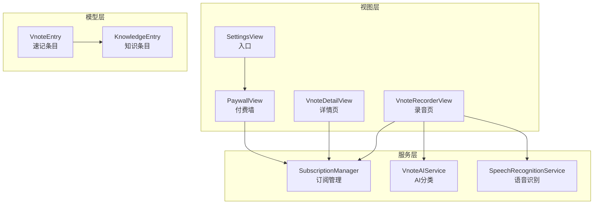
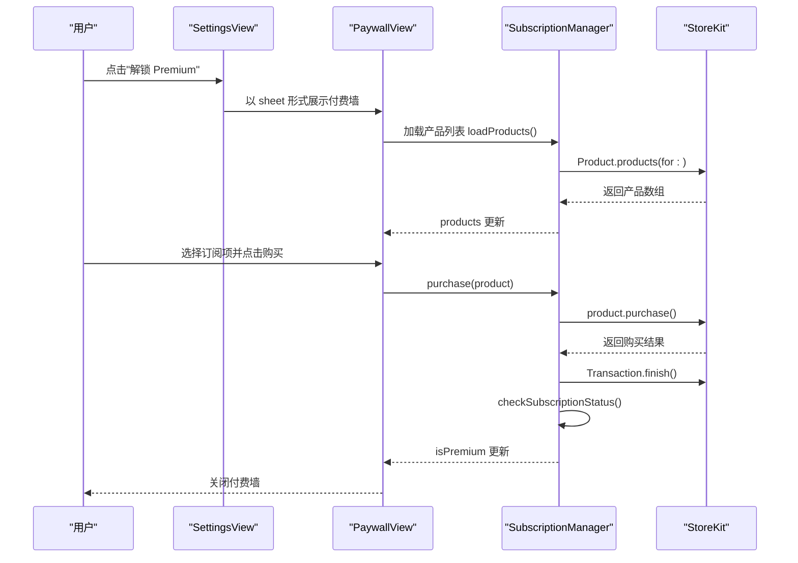
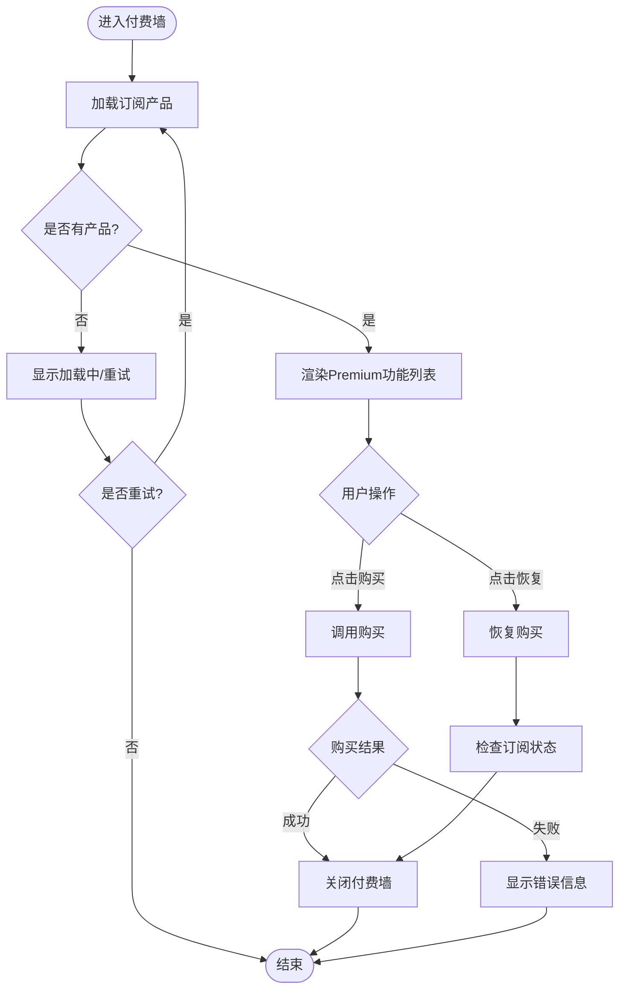
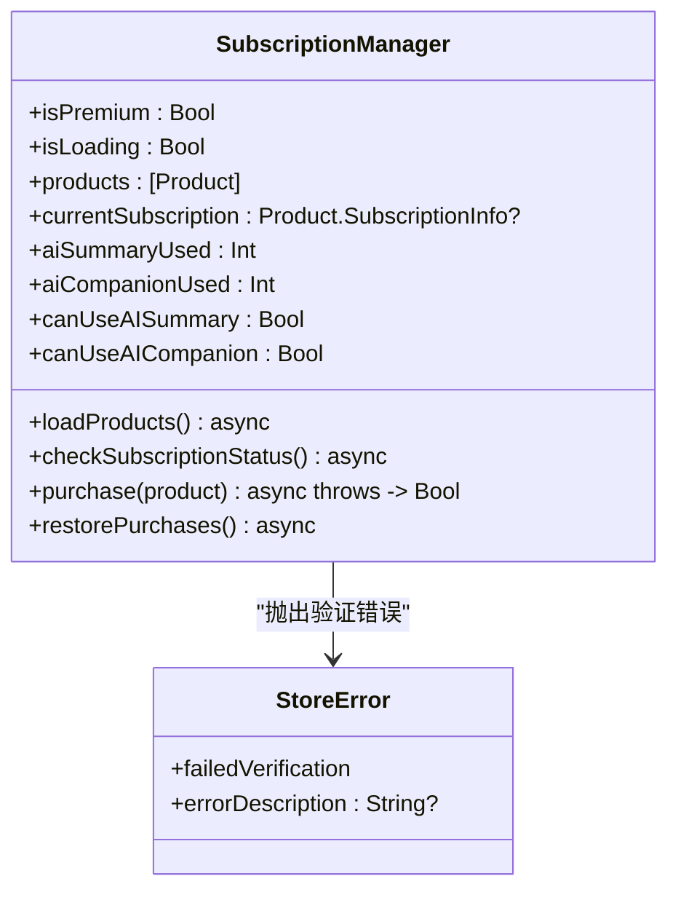
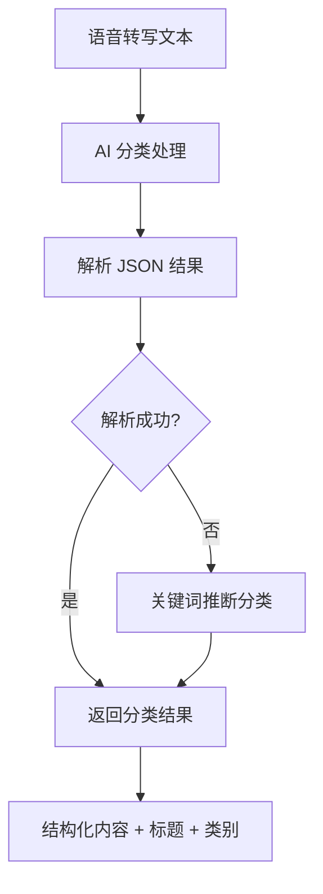
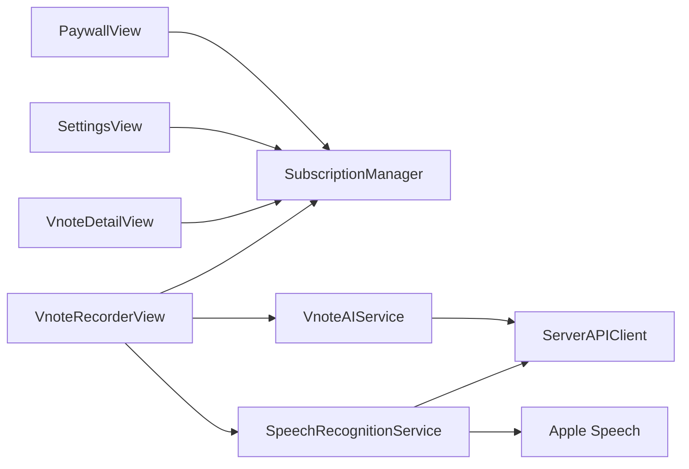

# 付费墙界面

<cite>
**本文引用的文件**
- [PaywallView.swift](file://Views/PaywallView.swift)
- [SubscriptionManager.swift](file://Services/SubscriptionManager.swift)
- [SettingsView.swift](file://Views/SettingsView.swift)
- [VnoteAIService.swift](file://Services/VnoteAIService.swift)
- [VnoteEntry.swift](file://Models/VnoteEntry.swift)
- [VnoteDetailView.swift](file://Views/VnoteDetailView.swift)
- [VnoteRecorderView.swift](file://Views/VnoteRecorderView.swift)
- [SpeechRecognitionService.swift](file://Services/SpeechRecognitionService.swift)
- [KnowledgeEntry.swift](file://Models/KnowledgeEntry.swift)
</cite>

## 更新摘要
**变更内容**
- 增强了付费墙界面的Premium功能展示，新增了Vnote相关的高级功能
- 添加了精确转写与字级时间戳高亮播放的Premium特性说明
- 新增了AI智能分类功能（会议纪要、创意速记、To-do列表）的展示
- 增加了知识库沉淀与AI对话能力的Premium权益说明
- 更新了付费墙与各Vnote功能的集成关系图

## 目录
1. [简介](#简介)
2. [项目结构](#项目结构)
3. [核心组件](#核心组件)
4. [架构总览](#架构总览)
5. [详细组件分析](#详细组件分析)
6. [依赖分析](#依赖分析)
7. [性能考虑](#性能考虑)
8. [故障排查指南](#故障排查指南)
9. [结论](#结论)

## 简介
本文件聚焦于"付费墙界面"的实现与集成，围绕以下目标展开：
- 展示 Premium 订阅权益、加载 App Store 产品列表、发起购买与恢复购买
- 在设置页引导用户进入付费墙，并在购买成功后关闭并刷新状态
- 将付费墙与 AI 功能（摘要、伴读、高品质音色、Vnote精准转写、AI分类、知识库沉淀）的访问控制进行解耦设计说明

**更新** 新增了对Vnote高级功能的展示，包括精确转写、字级时间戳高亮、AI智能分类和知识库沉淀等Premium特性。

## 项目结构
付费墙相关代码主要分布在 Views 与 Services 层：
- 视图层：PaywallView 负责 UI 与交互；SettingsView 提供入口；Vnote相关视图集成付费墙逻辑
- 服务层：SubscriptionManager 封装 StoreKit 2 的订阅检查、购买与恢复；VnoteAIService 提供AI分类能力
- 业务层：Vnote功能通过多层服务暴露接口，当前实现已内置权限校验，可在上层统一接入权限判断

**图表来源**
- [SettingsView.swift:74-99](file://Views/SettingsView.swift#L74-L99)
- [PaywallView.swift:40-48](file://Views/PaywallView.swift#L40-L48)
- [VnoteDetailView.swift:238-259](file://Views/VnoteDetailView.swift#L238-L259)
- [VnoteRecorderView.swift:217-234](file://Views/VnoteRecorderView.swift#L217-L234)
- [VnoteAIService.swift:6-10](file://Services/VnoteAIService.swift#L6-L10)
- [SpeechRecognitionService.swift:8-11](file://Services/SpeechRecognitionService.swift#L8-L11)

**章节来源**
- [SettingsView.swift:74-99](file://Views/SettingsView.swift#L74-L99)
- [PaywallView.swift:40-48](file://Views/PaywallView.swift#L40-L48)
- [VnoteDetailView.swift:238-259](file://Views/VnoteDetailView.swift#L238-L259)
- [VnoteRecorderView.swift:217-234](file://Views/VnoteRecorderView.swift#L217-L234)
- [VnoteAIService.swift:6-10](file://Services/VnoteAIService.swift#L6-L10)
- [SpeechRecognitionService.swift:8-11](file://Services/SpeechRecognitionService.swift#L8-L11)

## 核心组件
- PaywallView：展示 Premium 权益、订阅选项、错误提示，调用 SubscriptionManager 完成购买与恢复
- SubscriptionManager：单例，使用 StoreKit 2 加载产品、检查 entitlements、执行购买与恢复
- SettingsView：在"Premium 功能"区域显示已激活或未激活状态，并提供打开付费墙的入口
- VnoteAIService：提供AI智能分类功能，将语音内容自动归类为会议纪要、创意速记、To-do列表
- SpeechRecognitionService：双层STT策略，支持免费本地识别和Premium云端高精度识别
- VnoteDetailView/VnoteRecorderView：集成付费墙逻辑，控制Premium功能的访问权限

**更新** 新增了Vnote相关的核心组件，包括AI分类服务和双层语音识别服务，以及集成了付费墙控制的Vnote视图。

**章节来源**
- [PaywallView.swift:6-179](file://Views/PaywallView.swift#L6-L179)
- [SubscriptionManager.swift:8-166](file://Services/SubscriptionManager.swift#L8-L166)
- [SettingsView.swift:54-107](file://Views/SettingsView.swift#L54-L107)
- [VnoteAIService.swift:6-108](file://Services/VnoteAIService.swift#L6-L108)
- [SpeechRecognitionService.swift:8-178](file://Services/SpeechRecognitionService.swift#L8-L178)
- [VnoteDetailView.swift:7-396](file://Views/VnoteDetailView.swift#L7-L396)
- [VnoteRecorderView.swift:6-348](file://Views/VnoteRecorderView.swift#L6-L348)

## 架构总览
付费墙与订阅管理的交互流程如下：

**更新** 新增了Vnote功能与付费墙的集成流程，包括AI分类和知识库沉淀的权限控制。

**图表来源**
- [SettingsView.swift:74-99](file://Views/SettingsView.swift#L74-L99)
- [PaywallView.swift:163-178](file://Views/PaywallView.swift#L163-L178)
- [SubscriptionManager.swift:111-134](file://Services/SubscriptionManager.swift#L111-L134)
- [VnoteDetailView.swift:238-259](file://Views/VnoteDetailView.swift#L238-L259)
- [VnoteRecorderView.swift:217-234](file://Views/VnoteRecorderView.swift#L217-L234)

## 详细组件分析

### 付费墙视图 PaywallView
- 职责
  - 展示 Premium 权益与订阅选项
  - 处理购买与恢复购买
  - 展示加载与错误状态
- 关键行为
  - 初始化时观察 SubscriptionManager 的状态变化
  - 当 products 为空时提供"重新加载"按钮
  - 购买成功则关闭弹窗并刷新订阅状态
- 交互要点
  - 顶部导航栏提供"关闭"按钮
  - 底部"恢复购买"用于换设备或重装后恢复
  - **新增** 展示了完整的Premium功能列表，包括Vnote精准转写、AI分类、知识库沉淀等

**更新** 增强了功能展示，新增了Vnote相关的Premium特性说明，包括精确转写、字级时间戳高亮、AI智能分类和知识库沉淀等功能。

**图表来源**
- [PaywallView.swift:86-139](file://Views/PaywallView.swift#L86-L139)
- [PaywallView.swift:163-178](file://Views/PaywallView.swift#L163-L178)

**章节来源**
- [PaywallView.swift:6-179](file://Views/PaywallView.swift#L6-L179)

### 订阅管理器 SubscriptionManager
- 职责
  - 维护 isPremium、isLoading、products、currentSubscription 等状态
  - 加载产品、检查订阅状态、执行购买与恢复
- 关键点
  - 使用 @MainActor 保证主线程安全
  - 构造时异步加载产品并检查订阅状态
  - 购买完成后 finish 交易并刷新订阅状态
- 错误处理
  - 定义 StoreError.failedVerification，用于验证失败场景
- **新增** AI功能限免配额管理，支持免费体验次数控制

**更新** 新增了AI功能的使用次数管理和限免配额控制机制。

**图表来源**
- [SubscriptionManager.swift:8-166](file://Services/SubscriptionManager.swift#L8-L166)

**章节来源**
- [SubscriptionManager.swift:8-166](file://Services/SubscriptionManager.swift#L8-L166)

### 设置页入口 SettingsView
- 职责
  - 展示 Premium 功能区块
  - 根据 isPremium 切换显示"已激活"或"解锁 Premium"入口
  - 以 sheet 形式弹出 PaywallView
- 关键点
  - 订阅状态来自全局 SubscriptionManager.shared
  - 打开付费墙通过 showPaywall 状态驱动
  - **新增** 显示了包含Vnote功能的Premium功能描述

**更新** 更新了Premium功能描述，包含了Vnote转写分类和知识库沉淀等新功能。

**章节来源**
- [SettingsView.swift:54-107](file://Views/SettingsView.swift#L54-L107)
- [SettingsView.swift:330-332](file://Views/SettingsView.swift#L330-L332)

### Vnote AI 分类服务 VnoteAIService
- 职责
  - 提供AI智能分类功能，将语音转写内容自动归类
  - 支持四种分类：会议纪要、创意速记、To-do列表、Box收件箱
  - 生成结构化内容和标题
- 关键特性
  - 使用服务器中转调用AI大模型
  - 支持JSON格式解析和回退机制
  - 内置关键词推断作为兜底方案

**新增** 这是全新的AI分类服务，为Vnote功能提供智能化的内容整理能力。

**图表来源**
- [VnoteAIService.swift:45-64](file://Services/VnoteAIService.swift#L45-L64)
- [VnoteAIService.swift:68-98](file://Services/VnoteAIService.swift#L68-L98)

**章节来源**
- [VnoteAIService.swift:6-108](file://Services/VnoteAIService.swift#L6-L108)

### 双层语音识别服务 SpeechRecognitionService
- 职责
  - 提供双层STT策略，区分免费和Premium用户
  - 免费用户：Apple Speech框架（本地、离线、无时间戳）
  - Premium用户：服务器中转阿里云百炼（云端、高准确率、字级时间戳）
- 关键特性
  - 统一的transcribe接口，内部根据isPremium参数选择不同策略
  - Premium模式支持词级时间戳和高亮回放
  - 完善的错误处理和异常恢复

**新增** 这是全新的双层识别服务，为Vnote的精准转写功能提供技术支持。

**章节来源**
- [SpeechRecognitionService.swift:8-178](file://Services/SpeechRecognitionService.swift#L8-L178)

### Vnote 详情页面集成
- 职责
  - 展示Vnote记录的详细信息
  - 集成音频播放器与文字高亮同步
  - 控制知识库沉淀的Premium权限
- 关键特性
  - 根据isPremiumSTT状态决定显示普通文本还是高亮文本
  - 播放时实时计算当前词位置并高亮显示
  - 非Premium用户点击沉淀到知识库时弹出付费墙

**更新** 新增了Premium功能的状态控制和权限检查逻辑。

**章节来源**
- [VnoteDetailView.swift:7-396](file://Views/VnoteDetailView.swift#L7-L396)

### Vnote 录音页面集成
- 职责
  - 提供录音界面和STT转写流程
  - 集成AI分类和知识库沉淀功能
  - 控制Premium功能的访问权限
- 关键特性
  - 录音完成后自动进行STT转写和AI分类
  - 根据订阅状态决定是否使用Premium STT服务
  - 非Premium用户尝试沉淀到知识库时弹出付费墙

**更新** 新增了Premium STT服务的集成和权限控制逻辑。

**章节来源**
- [VnoteRecorderView.swift:6-348](file://Views/VnoteRecorderView.swift#L6-L348)

## 依赖分析
- 视图到服务
  - PaywallView 依赖 SubscriptionManager 获取产品与执行购买
  - SettingsView 依赖 SubscriptionManager 展示订阅状态
  - VnoteDetailView/VnoteRecorderView 依赖 SubscriptionManager 控制Premium功能访问
- 服务到系统
  - SubscriptionManager 依赖 StoreKit 2 的 Product、Transaction、AppStore
  - VnoteAIService 依赖 ServerAPIClient 调用AI服务
  - SpeechRecognitionService 依赖 Apple Speech框架和服务器API
- 应用入口
  - KnowledgeApp 作为应用启动点，注入主题与环境对象

**更新** 新增了Vnote相关服务之间的依赖关系。

**图表来源**
- [PaywallView.swift:7-11](file://Views/PaywallView.swift#L7-L11)
- [SettingsView.swift:8-9](file://Views/SettingsView.swift#L8-L9)
- [VnoteDetailView.swift:11-17](file://Views/VnoteDetailView.swift#L11-L17)
- [VnoteRecorderView.swift:10-16](file://Views/VnoteRecorderView.swift#L10-L16)
- [VnoteAIService.swift:8-9](file://Services/VnoteAIService.swift#L8-L9)
- [SpeechRecognitionService.swift:2-3](file://Services/SpeechRecognitionService.swift#L2-L3)

**章节来源**
- [PaywallView.swift:7-11](file://Views/PaywallView.swift#L7-L11)
- [SettingsView.swift:8-9](file://Views/SettingsView.swift#L8-L9)
- [VnoteDetailView.swift:11-17](file://Views/VnoteDetailView.swift#L11-L17)
- [VnoteRecorderView.swift:10-16](file://Views/VnoteRecorderView.swift#L10-L16)
- [VnoteAIService.swift:8-9](file://Services/VnoteAIService.swift#L8-L9)
- [SpeechRecognitionService.swift:2-3](file://Services/SpeechRecognitionService.swift#L2-L3)

## 性能考虑
- 产品加载与状态检查在后台异步执行，避免阻塞 UI
- 购买流程中尽快 finish 交易，减少重复回调
- 建议在调用 AI 功能前缓存 isPremium 状态，减少频繁读取
- **新增** Vnote的高亮播放使用Timer定时更新，注意性能优化
- **新增** AI分类和STT转写采用异步处理，避免UI卡顿

## 故障排查指南
- 产品未加载
  - 现象：付费墙显示"订阅信息加载中，请稍后重试"，并提供"重新加载"
  - 排查：确认 App Store Connect 已配置订阅产品 ID，网络可用
- 购买失败
  - 现象：显示"购买失败：..."
  - 排查：检查 StoreError.failedVerification 是否被抛出，确认交易验证逻辑
- 恢复购买无效
  - 现象：恢复后仍为非 Premium
  - 排查：确认 AppStore.sync() 成功，再次检查 currentEntitlements
- **新增** Vnote AI分类失败
  - 现象：分类结果为general或内容未结构化
  - 排查：检查服务器连接状态，查看AI服务响应格式
- **新增** Premium STT转写失败
  - 现象：无法获得字级时间戳或高亮功能失效
  - 排查：确认网络连接正常，检查服务器API响应格式

**章节来源**
- [PaywallView.swift:90-108](file://Views/PaywallView.swift#L90-L108)
- [PaywallView.swift:163-178](file://Views/PaywallView.swift#L163-L178)
- [SubscriptionManager.swift:137-140](file://Services/SubscriptionManager.swift#L137-L140)
- [VnoteAIService.swift:68-98](file://Services/VnoteAIService.swift#L68-L98)
- [SpeechRecognitionService.swift:127-168](file://Services/SpeechRecognitionService.swift#L127-L168)

## 结论
- 付费墙界面清晰展示了 Premium 权益与订阅选项，并通过 SubscriptionManager 与 StoreKit 2 完成购买与恢复
- **新增** 增强了Vnote相关Premium功能的展示，包括精确转写、字级时间戳高亮、AI智能分类和知识库沉淀
- 当前各功能已内置权限校验，在调用前统一检查 isPremium 并引导至付费墙
- 后续可结合SpeakerViewModel或SummaryCardView的触发点，集中实现权限拦截与体验优化
- **新增** Vnote功能形成了完整的从录音到分类再到知识库沉淀的Premium工作流