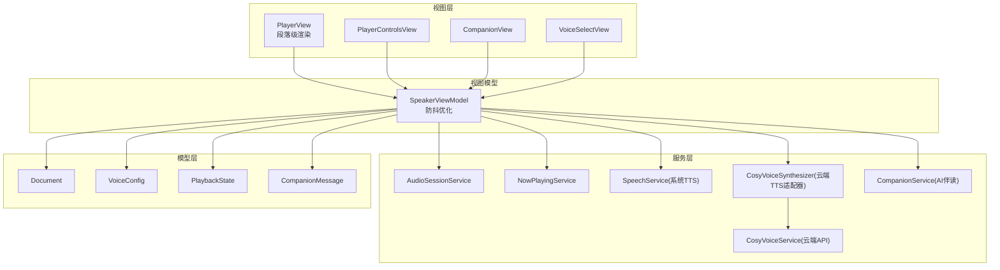
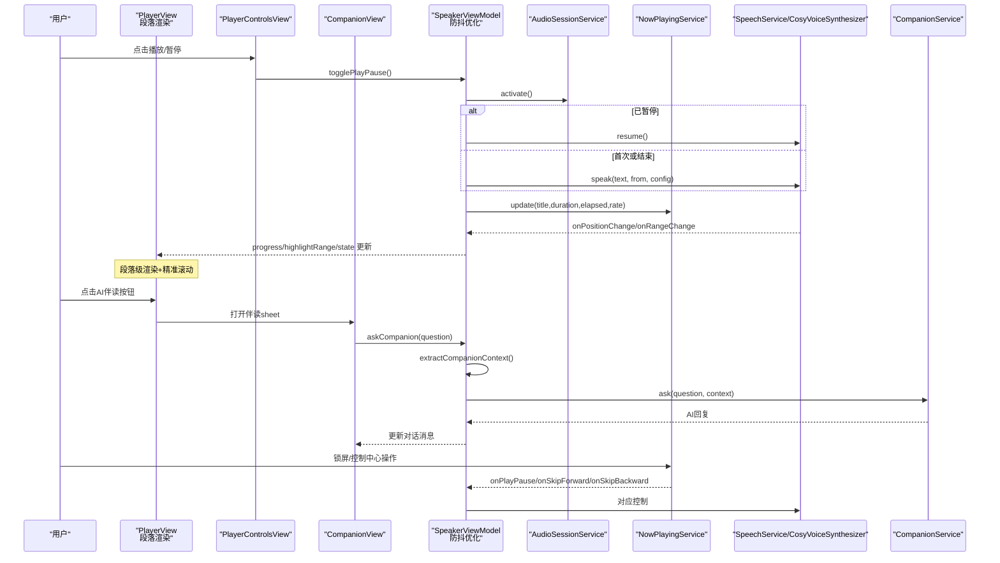
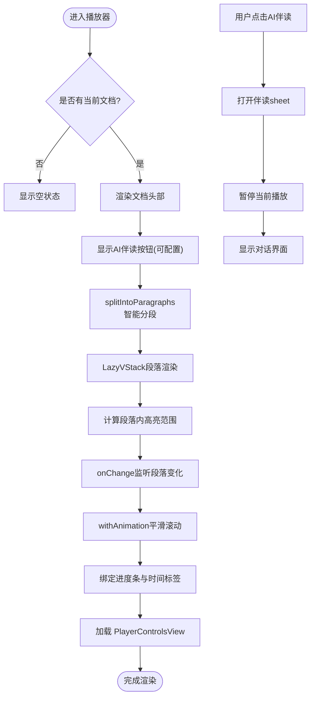
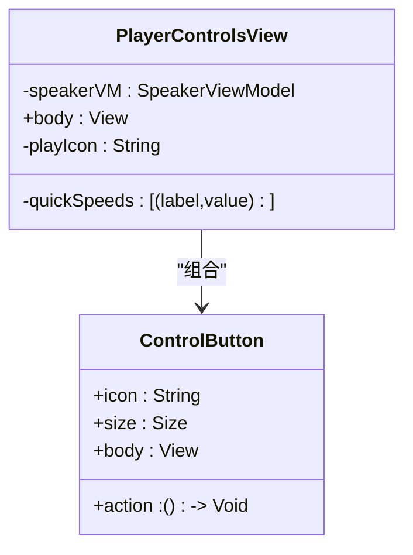
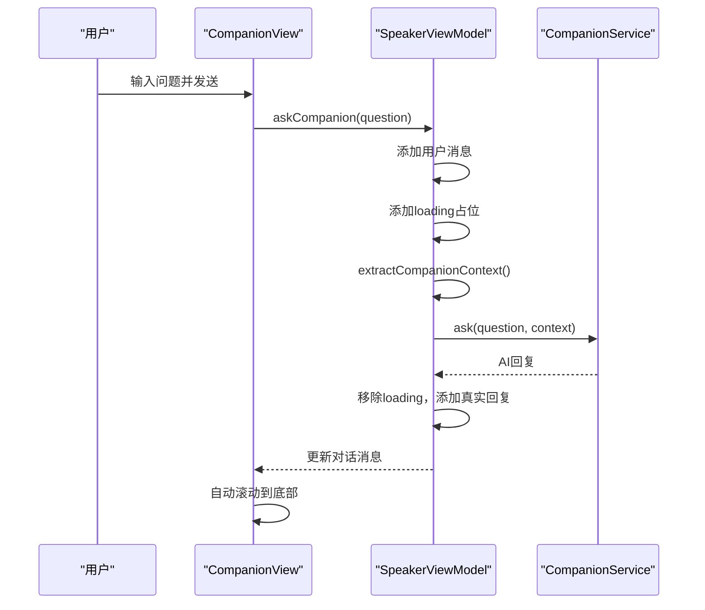
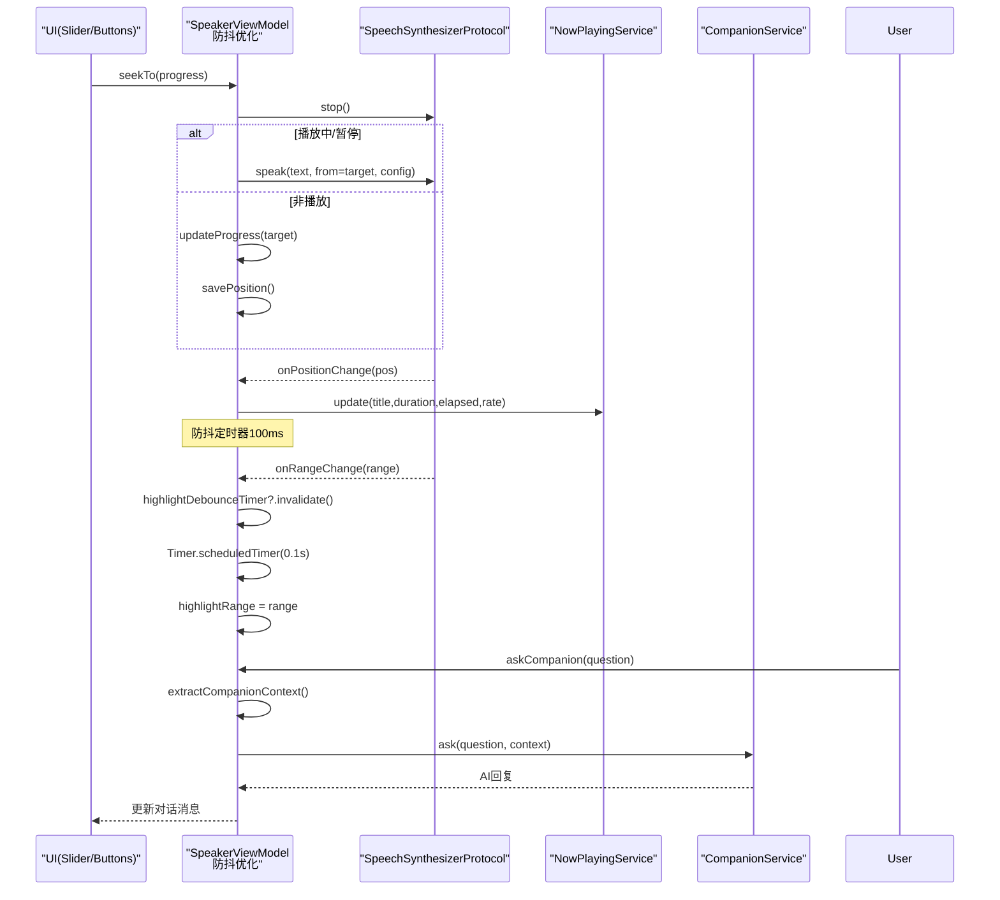
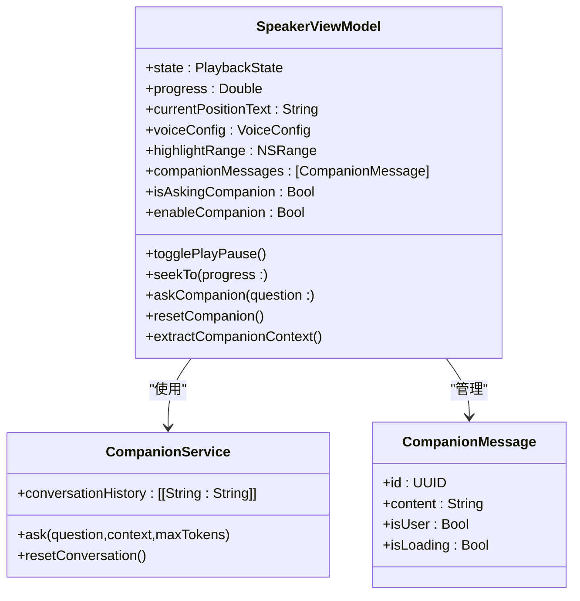
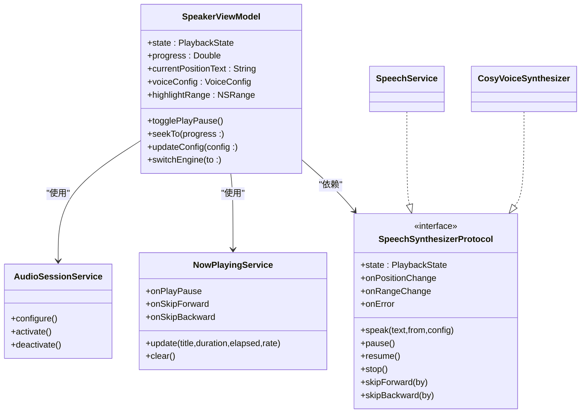
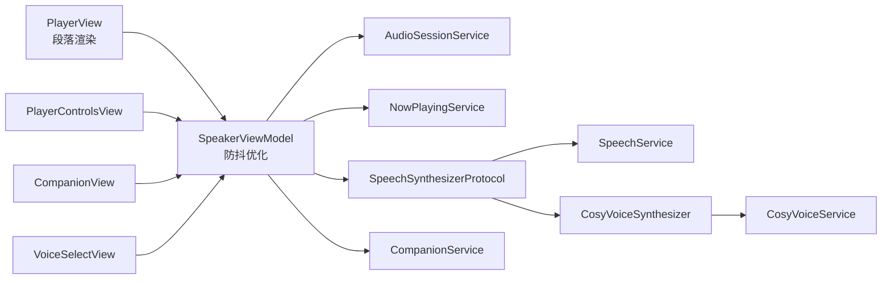

# 播放器界面

<cite>
**本文引用的文件**
- [Views/PlayerView.swift](file://Views/PlayerView.swift)
- [Views/PlayerControlsView.swift](file://Views/PlayerControlsView.swift)
- [Views/CompanionView.swift](file://Views/CompanionView.swift)
- [ViewModels/SpeakerViewModel.swift](file://ViewModels/SpeakerViewModel.swift)
- [Models/PlaybackState.swift](file://Models/PlaybackState.swift)
- [Models/VoiceConfig.swift](file://Models/VoiceConfig.swift)
- [Models/Document.swift](file://Models/Document.swift)
- [Models/CompanionMessage.swift](file://Models/CompanionMessage.swift)
- [Services/AudioSessionService.swift](file://Services/AudioSessionService.swift)
- [Services/NowPlayingService.swift](file://Services/NowPlayingService.swift)
- [Services/SpeechService.swift](file://Services/SpeechService.swift)
- [Services/CosyVoiceSynthesizer.swift](file://Services/CosyVoiceSynthesizer.swift)
- [Services/CosyVoiceService.swift](file://Services/CosyVoiceService.swift)
- [Services/CompanionService.swift](file://Services/CompanionService.swift)
- [Views/VoiceSelectView.swift](file://Views/VoiceSelectView.swift)
</cite>

## 更新摘要
**变更内容**
- PlayerView实现段落级渲染架构，将长文档按段落拆分独立渲染，显著提升性能
- 引入精确滚动定位机制，使用ScrollViewReader和id标识符实现平滑的段落跟随
- 优化高亮同步算法，通过防抖定时器减少频繁UI更新，提升播放流畅度
- 新增AI伴读功能入口按钮，支持边听边问的交互式对话体验
- 实现智能上下文提取，自动获取当前朗读位置前后500字作为对话背景

## 目录
1. [简介](#简介)
2. [项目结构](#项目结构)
3. [核心组件](#核心组件)
4. [架构总览](#架构总览)
5. [详细组件分析](#详细组件分析)
6. [依赖关系分析](#依赖关系分析)
7. [性能与体验优化](#性能与体验优化)
8. [故障排查指南](#故障排查指南)
9. [结论](#结论)
10. [附录：扩展与自定义](#附录扩展与自定义)

## 简介
本文件面向"有声阅读器"的播放器界面，系统性说明 PlayerView 与 PlayerControlsView 的核心功能、用户交互设计、播放状态同步、后台播放与锁屏控制集成，并给出语音选择、语速调节、音量控制的 UI 交互说明。**重大更新**：PlayerView实现了革命性的段落级渲染架构，通过将长文档按段落拆分独立渲染，结合精确滚动定位和高亮同步优化，显著提升了长文档的播放性能和用户体验。同时新增AI伴读功能，支持在阅读过程中通过聊天气泡图标进入交互式问答界面，AI会基于当前朗读上下文提供智能回答。

## 项目结构
播放器相关代码主要分布在 Views、ViewModels、Services 与 Models 四个层次：
- Views：UI 层，包含播放器主视图、控件视图与AI伴读对话界面
- ViewModels：业务编排与状态管理，集成伴读功能状态
- Services：音频会话、远程控制、TTS 引擎适配、网络服务与AI伴读服务
- Models：数据模型与配置，新增伴读消息模型

**图表来源**
- [Views/PlayerView.swift:1-261](file://Views/PlayerView.swift#L1-L261)
- [Views/PlayerControlsView.swift:1-65](file://Views/PlayerControlsView.swift#L1-L65)
- [Views/CompanionView.swift:1-200](file://Views/CompanionView.swift#L1-L200)
- [ViewModels/SpeakerViewModel.swift:1-399](file://ViewModels/SpeakerViewModel.swift#L1-L399)
- [Services/AudioSessionService.swift:1-46](file://Services/AudioSessionService.swift#L1-L46)
- [Services/NowPlayingService.swift:1-57](file://Services/NowPlayingService.swift#L1-L57)
- [Services/SpeechService.swift:1-155](file://Services/SpeechService.swift#L1-L155)
- [Services/CosyVoiceSynthesizer.swift:1-258](file://Services/CosyVoiceSynthesizer.swift#L1-L258)
- [Services/CosyVoiceService.swift:1-219](file://Services/CosyVoiceService.swift#L1-L219)
- [Services/CompanionService.swift:1-114](file://Services/CompanionService.swift#L1-L114)
- [Models/Document.swift:1-115](file://Models/Document.swift#L1-L115)
- [Models/VoiceConfig.swift:1-52](file://Models/VoiceConfig.swift#L1-L52)
- [Models/PlaybackState.swift:1-9](file://Models/PlaybackState.swift#L1-L9)
- [Models/CompanionMessage.swift:1-11](file://Models/CompanionMessage.swift#L1-L11)

**章节来源**
- [Views/PlayerView.swift:1-261](file://Views/PlayerView.swift#L1-L261)
- [Views/PlayerControlsView.swift:1-65](file://Views/PlayerControlsView.swift#L1-L65)
- [Views/CompanionView.swift:1-200](file://Views/CompanionView.swift#L1-L200)
- [ViewModels/SpeakerViewModel.swift:1-399](file://ViewModels/SpeakerViewModel.swift#L1-L399)
- [Services/AudioSessionService.swift:1-46](file://Services/AudioSessionService.swift#L1-L46)
- [Services/NowPlayingService.swift:1-57](file://Services/NowPlayingService.swift#L1-L57)
- [Services/SpeechService.swift:1-155](file://Services/SpeechService.swift#L1-L155)
- [Services/CosyVoiceSynthesizer.swift:1-258](file://Services/CosyVoiceSynthesizer.swift#L1-L258)
- [Services/CosyVoiceService.swift:1-219](file://Services/CosyVoiceService.swift#L1-L219)
- [Services/CompanionService.swift:1-114](file://Services/CompanionService.swift#L1-L114)
- [Models/Document.swift:1-115](file://Models/Document.swift#L1-L115)
- [Models/VoiceConfig.swift:1-52](file://Models/VoiceConfig.swift#L1-L52)
- [Models/PlaybackState.swift:1-9](file://Models/PlaybackState.swift#L1-L9)
- [Models/CompanionMessage.swift:1-11](file://Models/CompanionMessage.swift#L1-L11)

## 核心组件
- **PlayerView**：播放器主界面，采用**段落级渲染架构**，负责文档信息展示、智能文本分段、精准滚动跟随、进度条与底部控制区布局，以及摘要弹窗入口。**重大改进**：实现LazyVStack段落渲染、ScrollViewReader精确定位、防抖高亮同步，显著提升长文档性能。
- **PlayerControlsView**：播放控制按钮与快捷语速切换，提供播放/暂停、前进后退、快速语速预设等交互。
- **CompanionView**：AI伴读对话界面，支持实时问答、快捷问题、对话历史管理与自动滚动。
- **SpeakerViewModel**：统一编排播放流程、状态同步、远程控制绑定、配置持久化与错误降级。**重要优化**：引入highlightDebounceTimer防抖机制，减少频繁UI更新；新增伴读状态管理、对话消息维护、上下文提取与AI问答接口。
- **AudioSessionService**：集中管理 AVAudioSession 的配置、激活与停用，确保后台播放、蓝牙与 AirPlay 可用。
- **NowPlayingService**：对接系统媒体中心，更新锁屏/控制中心信息与远程命令（播放/暂停、快进/快退）。
- **SpeechService**：系统 TTS 引擎实现，按字符段推进朗读，回调位置与范围以驱动 UI 高亮。
- **CosyVoiceSynthesizer**：云端 TTS 适配器，分段合成并流式播放，估算位置并回调 UI。
- **CompanionService**：AI伴读服务，基于通义千问提供智能问答，携带当前朗读上下文进行多轮对话。
- **VoiceSelectView**：音色选择页，支持预设音色与克隆音色选择、试听与保存选择。

**章节来源**
- [Views/PlayerView.swift:1-261](file://Views/PlayerView.swift#L1-L261)
- [Views/PlayerControlsView.swift:1-65](file://Views/PlayerControlsView.swift#L1-L65)
- [Views/CompanionView.swift:1-200](file://Views/CompanionView.swift#L1-L200)
- [ViewModels/SpeakerViewModel.swift:1-399](file://ViewModels/SpeakerViewModel.swift#L1-L399)
- [Services/AudioSessionService.swift:1-46](file://Services/AudioSessionService.swift#L1-L46)
- [Services/NowPlayingService.swift:1-57](file://Services/NowPlayingService.swift#L1-L57)
- [Services/SpeechService.swift:1-155](file://Services/SpeechService.swift#L1-L155)
- [Services/CosyVoiceSynthesizer.swift:1-258](file://Services/CosyVoiceSynthesizer.swift#L1-L258)
- [Services/CompanionService.swift:1-114](file://Services/CompanionService.swift#L1-L114)
- [Views/VoiceSelectView.swift:1-215](file://Views/VoiceSelectView.swift#L1-L215)

## 架构总览
播放器采用 MVVM + Service 分层，**重大架构升级**：
- 视图层通过 @ObservedObject 订阅 ViewModel 的 Published 属性，实现响应式 UI 更新。
- ViewModel 聚合多个 Service，屏蔽底层差异，对外暴露统一的播放控制接口。
- 两个 TTS 引擎（系统/云端）通过同一协议接入，便于运行时切换与错误降级。
- 远程控制由 NowPlayingService 统一注册，事件回调到 ViewModel，再转发到底层引擎。
- **新增**：AI伴读功能通过独立的 CompanionService 提供服务，支持多轮对话与上下文感知。
- **性能优化**：引入段落级渲染和防抖机制，大幅提升长文档处理效率。

**图表来源**
- [Views/PlayerView.swift:1-261](file://Views/PlayerView.swift#L1-L261)
- [Views/PlayerControlsView.swift:1-65](file://Views/PlayerControlsView.swift#L1-L65)
- [Views/CompanionView.swift:1-200](file://Views/CompanionView.swift#L1-L200)
- [ViewModels/SpeakerViewModel.swift:1-399](file://ViewModels/SpeakerViewModel.swift#L1-L399)
- [Services/AudioSessionService.swift:1-46](file://Services/AudioSessionService.swift#L1-L46)
- [Services/NowPlayingService.swift:1-57](file://Services/NowPlayingService.swift#L1-L57)
- [Services/SpeechService.swift:1-155](file://Services/SpeechService.swift#L1-L155)
- [Services/CosyVoiceSynthesizer.swift:1-258](file://Services/CosyVoiceSynthesizer.swift#L1-L258)
- [Services/CompanionService.swift:1-114](file://Services/CompanionService.swift#L1-L114)

## 详细组件分析

### PlayerView 分析与交互设计
**重大架构升级**：实现段落级渲染和精准滚动定位

- **顶部标题栏**：显示"正在播放"，**新增**左侧AI伴读按钮（聊天气泡图标），右侧工具栏按钮用于打开 AI 摘要弹窗。
- **文档头部**：展示文件名、类型图标与长度信息。
- **段落级文本区域**：**全新架构** - 使用 `splitIntoParagraphs` 方法将文本按 `\n\n` 或 `\n` 智能分段，每段独立渲染为 LazyVStack 元素，支持精准滚动跟随。
- **精准滚动机制**：通过 ScrollViewReader 和 id 标识符实现段落级别的平滑滚动，当高亮范围变化时自动滚动到对应段落顶部。
- **智能高亮算法**：为每个段落单独计算高亮范围，仅对当前段落内的交集部分应用前景色、背景色与加粗字体，避免全量重绘。
- **进度条**：Slider 双向绑定 speakerVM.progress，拖动时调用 seekTo(progress:) 进行跳转。
- **控制区**：嵌入 PlayerControlsView，承载播放/暂停、前后跳与快捷语速。
- **空状态**：无文档时展示引导文案与图标。
- **AI伴读sheet覆盖层**：打开时自动暂停朗读，退出时恢复播放。

**图表来源**
- [Views/PlayerView.swift:117-145](file://Views/PlayerView.swift#L117-L145)
- [Views/PlayerView.swift:154-190](file://Views/PlayerView.swift#L154-L190)
- [Views/PlayerView.swift:193-238](file://Views/PlayerView.swift#L193-L238)

**章节来源**
- [Views/PlayerView.swift:1-261](file://Views/PlayerView.swift#L1-L261)

### PlayerControlsView 控件布局与手势
- 主控制按钮：后退 15 秒、播放/暂停、前进 30 秒，大小与图标区分主次。
- 快捷语速：一组固定档位按钮，选中态以强调色高亮。
- 交互方式：纯点击，未实现滑动/长按等高级手势；如需增强可在该视图中添加手势识别器并回调至 ViewModel。

**图表来源**
- [Views/PlayerControlsView.swift:1-65](file://Views/PlayerControlsView.swift#L1-L65)

**章节来源**
- [Views/PlayerControlsView.swift:1-65](file://Views/PlayerControlsView.swift#L1-L65)

### CompanionView AI伴读对话界面
- 导航栏：显示"AI 伴读"标题，左侧"继续听"按钮关闭sheet，右侧菜单支持清空对话。
- 消息列表：支持欢迎语、用户消息气泡、AI回复气泡与加载状态指示器。
- 快捷问题：提供预设问题按钮，如"这段讲了什么？"、"解释一下关键概念"。
- 输入栏：支持多行文本输入、回车发送、发送按钮状态管理。
- 自动滚动：新消息到达时自动滚动到底部。
- 播放控制：进入时暂停朗读，退出时自动恢复播放。

**图表来源**
- [Views/CompanionView.swift:1-200](file://Views/CompanionView.swift#L1-L200)
- [ViewModels/SpeakerViewModel.swift:242-290](file://ViewModels/SpeakerViewModel.swift#L242-L290)
- [Services/CompanionService.swift:1-114](file://Services/CompanionService.swift#L1-L114)

**章节来源**
- [Views/CompanionView.swift:1-200](file://Views/CompanionView.swift#L1-L200)

### SpeakerViewModel 播放控制与状态同步
**重要性能优化**：引入防抖机制和AI伴读功能

- **状态机**：基于 PlaybackState（空闲/播放/暂停/结束），通过 Timer 轮询底层引擎状态变化，驱动 UI 更新。
- **播放流程**：
  - play/pause/stop/replay：封装底层引擎调用，并在合适时机激活/停用 AudioSession。
  - skipForward/skipBackward：按字符数换算跳转距离，重新 speak。
  - seekTo：根据进度百分比计算目标字符位置，若处于播放中则重启 speak，否则仅更新进度与持久化。
- **配置更新**：updateConfig 会持久化 VoiceConfig，并在播放中无缝切换新配置（停止后从当前位置继续）。
- **引擎切换**：switchEngine 在运行时替换底层引擎实例，保持当前进度继续播放。
- **错误处理**：当云端引擎报错时，自动降级到系统 TTS，并更新配置与绑定。
- **远程控制**：将 NowPlayingService 的回调映射到本地控制方法，保证锁屏/控制中心一致行为。
- **位置与高亮**：onPositionChange 更新 progress 与时间文本；**防抖优化**：onRangeChange 使用 highlightDebounceTimer 延迟100ms更新，避免频繁UI刷新。
- **AI伴读功能**：完整的伴读状态管理，包括对话消息数组、询问状态标志、播放暂停标记等。
- **上下文提取**：智能提取当前朗读位置前后500字作为AI问答的上下文背景。

**图表来源**
- [ViewModels/SpeakerViewModel.swift:294-351](file://ViewModels/SpeakerViewModel.swift#L294-L351)
- [ViewModels/SpeakerViewModel.swift:276-290](file://ViewModels/SpeakerViewModel.swift#L276-L290)
- [Services/NowPlayingService.swift:1-57](file://Services/NowPlayingService.swift#L1-L57)
- [Services/CompanionService.swift:1-114](file://Services/CompanionService.swift#L1-L114)

**章节来源**
- [ViewModels/SpeakerViewModel.swift:1-399](file://ViewModels/SpeakerViewModel.swift#L1-L399)

### AI伴读服务实现
- **CompanionService**：单例服务，基于通义千问API提供智能问答功能。
- **上下文感知**：自动提取当前朗读位置前后500字作为对话上下文。
- **多轮对话**：维护对话历史，最多保留最近10轮对话记录。
- **错误处理**：支持API Key验证、网络错误、服务器错误等多种异常场景。
- **角色设定**：内置专业的阅读伴读助手提示词，要求简洁口语化的回答风格。

**图表来源**
- [ViewModels/SpeakerViewModel.swift:36-44](file://ViewModels/SpeakerViewModel.swift#L36-L44)
- [Services/CompanionService.swift:1-114](file://Services/CompanionService.swift#L1-L114)
- [Models/CompanionMessage.swift:1-11](file://Models/CompanionMessage.swift#L1-L11)

**章节来源**
- [Services/CompanionService.swift:1-114](file://Services/CompanionService.swift#L1-L114)
- [Models/CompanionMessage.swift:1-11](file://Models/CompanionMessage.swift#L1-L11)

### 播放状态与后端集成
- **AudioSessionService**：统一配置 playback 模式，允许蓝牙与 AirPlay，并提供 activate/deactivate 生命周期管理。
- **NowPlayingService**：注册系统远程控制命令，更新锁屏元数据（标题、时长、已播放时间、速率），并将用户操作回调回 ViewModel。
- **引擎实现**：
  - **SpeechService**：系统 TTS，按句读断点切块，回调 willSpeakRangeOfSpeechString 与 didFinish 以驱动位置与高亮。
  - **CosyVoiceSynthesizer**：云端 TTS 适配器，分段合成 MP3，AVAudioPlayer 播放，定时估算位置并回调。

**图表来源**
- [ViewModels/SpeakerViewModel.swift:1-399](file://ViewModels/SpeakerViewModel.swift#L1-L399)
- [Services/AudioSessionService.swift:1-46](file://Services/AudioSessionService.swift#L1-L46)
- [Services/NowPlayingService.swift:1-57](file://Services/NowPlayingService.swift#L1-L57)
- [Services/SpeechService.swift:1-155](file://Services/SpeechService.swift#L1-L155)
- [Services/CosyVoiceSynthesizer.swift:1-258](file://Services/CosyVoiceSynthesizer.swift#L1-L258)

**章节来源**
- [Services/AudioSessionService.swift:1-46](file://Services/AudioSessionService.swift#L1-L46)
- [Services/NowPlayingService.swift:1-57](file://Services/NowPlayingService.swift#L1-L57)
- [Services/SpeechService.swift:1-155](file://Services/SpeechService.swift#L1-L155)
- [Services/CosyVoiceSynthesizer.swift:1-258](file://Services/CosyVoiceSynthesizer.swift#L1-L258)

### 语音选择、语速调节与音量控制
- **语音选择**：VoiceSelectView 支持预设音色与克隆音色列表、单选、删除与试听；选择后更新 voiceConfig.engine 与对应 ID，并通过 switchEngine 切换到云端引擎。
- **语速调节**：PlayerControlsView 内置快捷语速按钮；VoiceConfig.speedPresets 提供常用档位；updateConfig 即时生效并在播放中无缝切换。
- **音量控制**：VoiceConfig.volume 字段存在，但当前 UI 未暴露滑块；可在 PlayerControlsView 增加音量滑块并绑定到 voiceConfig.volume，再由引擎应用。

**章节来源**
- [Views/VoiceSelectView.swift:1-215](file://Views/VoiceSelectView.swift#L1-L215)
- [Views/PlayerControlsView.swift:1-65](file://Views/PlayerControlsView.swift#L1-L65)
- [Models/VoiceConfig.swift:1-52](file://Models/VoiceConfig.swift#L1-L52)
- [ViewModels/SpeakerViewModel.swift:1-399](file://ViewModels/SpeakerViewModel.swift#L1-L399)

### 播放队列管理、循环播放与随机播放
- **当前实现**：针对单文档朗读，无多文档队列、循环与随机逻辑。
- **扩展建议**：
  - 在 SpeakerViewModel 引入队列数据结构（如数组）与游标索引，提供 add/remove/clear 等方法。
  - 在 finish 回调中判断是否还有下一项，若有则 loadDocument 并自动播放；若无则根据标志位决定是否从头开始（循环）或随机选取（随机）。
  - 在 UI 层增加"上一首/下一首"、"循环模式"、"随机模式"开关，并与队列逻辑联动。

[本节为概念性内容，不直接分析具体文件]

## 依赖关系分析
- **视图对 ViewModel 的强依赖**：通过 @ObservedObject 订阅状态变更，保证 UI 实时刷新。
- **ViewModel 对服务的松耦合**：通过协议 SpeechSynthesizerProtocol 抽象底层引擎，便于替换与测试。
- **远程控制解耦**：NowPlayingService 仅暴露回调，避免 UI 与系统 API 紧耦合。
- **AI伴读功能独立**：通过专用服务提供，不影响现有播放功能。
- **潜在风险**：
  - 云端引擎失败时的降级路径已在 onError 中处理，但仍需关注网络抖动导致的卡顿。
  - 位置估算在云端引擎下为近似值，UI 高亮可能存在轻微偏差。
  - AI伴读需要网络连接，离线环境下无法使用。
  - **段落渲染性能**：超长文档可能导致内存占用增加，需监控 LazyVStack 的渲染性能。

**图表来源**
- [Views/PlayerView.swift:1-261](file://Views/PlayerView.swift#L1-L261)
- [Views/PlayerControlsView.swift:1-65](file://Views/PlayerControlsView.swift#L1-L65)
- [Views/CompanionView.swift:1-200](file://Views/CompanionView.swift#L1-L200)
- [Views/VoiceSelectView.swift:1-215](file://Views/VoiceSelectView.swift#L1-L215)
- [ViewModels/SpeakerViewModel.swift:1-399](file://ViewModels/SpeakerViewModel.swift#L1-L399)
- [Services/AudioSessionService.swift:1-46](file://Services/AudioSessionService.swift#L1-L46)
- [Services/NowPlayingService.swift:1-57](file://Services/NowPlayingService.swift#L1-L57)
- [Services/SpeechService.swift:1-155](file://Services/SpeechService.swift#L1-L155)
- [Services/CosyVoiceSynthesizer.swift:1-258](file://Services/CosyVoiceSynthesizer.swift#L1-L258)
- [Services/CosyVoiceService.swift:1-219](file://Services/CosyVoiceService.swift#L1-L219)
- [Services/CompanionService.swift:1-114](file://Services/CompanionService.swift#L1-L114)

**章节来源**
- [ViewModels/SpeakerViewModel.swift:1-399](file://ViewModels/SpeakerViewModel.swift#L1-L399)

## 性能与体验优化
**重大架构升级带来的性能提升**：

- **段落级渲染优化**：
  - 使用 LazyVStack 按需渲染段落，避免一次性加载整个文档。
  - 每段独立计算高亮范围，仅对当前段落内的交集部分应用样式，大幅减少 AttributedString 重绘开销。
  - 大文档可考虑分页渲染或虚拟列表以减少内存占用。

- **精准滚动定位**：
  - 通过 ScrollViewReader 和 id 标识符实现段落级别的精准滚动。
  - 使用 withAnimation(.easeInOut(duration: 0.3)) 提供平滑的滚动动画效果。
  - onChange 监听 activeParagraphIndex 变化，仅在段落切换时触发滚动。

- **防抖高亮同步**：
  - **highlightDebounceTimer**：100ms 防抖机制，避免高频的 onRangeChange 回调导致 UI 频繁更新。
  - 取消之前的定时器后再设置新的定时器，确保只执行最新的更新请求。
  - 系统 TTS 回调粒度较细；云端引擎使用定时器估算，可适当调整间隔平衡精度与功耗。

- **网络请求优化**：
  - 云端合成采用分段请求，建议在弱网环境下加入重试与缓存策略，减少重复合成。
  - **AI伴读请求**：应加入超时处理和错误重试机制，避免长时间等待。

- **音频资源管理**：
  - 临时文件及时清理，避免磁盘增长；长任务注意取消与状态一致性。
  - **伴读对话历史管理**：限制最大对话轮数防止内存增长。

[本节为通用指导，不直接分析具体文件]

## 故障排查指南
- **无法后台播放或蓝牙耳机无输出**：
  - 检查 AudioSessionService 是否正确配置 playback 模式并激活。
- **锁屏/控制中心无控制按钮**：
  - 确认 NowPlayingService 已注册命令且 onPlayPause 等回调已绑定到 ViewModel。
- **云端 TTS 失败**：
  - 查看 CosyVoiceService 的错误枚举与返回码；确认 API Key 有效；观察是否自动降级到系统 TTS。
- **高亮不同步**：
  - 核对 onRangeChange 回调是否在主线程派发；检查 highlightRange 与文本长度边界。
  - **防抖问题**：检查 highlightDebounceTimer 是否正确初始化和管理。
- **段落滚动异常**：
  - 确认 ScrollViewProxy 是否正确初始化；检查段落 id 生成逻辑。
  - 验证 activeParagraphIndex 计算的准确性。
- **AI伴读功能异常**：
  - 检查 dashscope_api_key 是否正确配置。
  - 确认网络连接正常，API服务可用。
  - 查看对话历史是否超过限制，必要时重置对话。
  - 检查伴读按钮是否启用（enableCompanion = true）。
  - **上下文提取问题**：检查 extractCompanionContext 方法的边界计算。

**章节来源**
- [Services/AudioSessionService.swift:1-46](file://Services/AudioSessionService.swift#L1-L46)
- [Services/NowPlayingService.swift:1-57](file://Services/NowPlayingService.swift#L1-L57)
- [Services/CosyVoiceService.swift:1-219](file://Services/CosyVoiceService.swift#L1-L219)
- [Services/SpeechService.swift:1-155](file://Services/SpeechService.swift#L1-L155)
- [Services/CosyVoiceSynthesizer.swift:1-258](file://Services/CosyVoiceSynthesizer.swift#L1-L258)
- [Services/CompanionService.swift:1-114](file://Services/CompanionService.swift#L1-L114)
- [ViewModels/SpeakerViewModel.swift:305-316](file://ViewModels/SpeakerViewModel.swift#L305-L316)
- [Views/PlayerView.swift:138-143](file://Views/PlayerView.swift#L138-L143)

## 结论
播放器界面以清晰的 MVVM 分层与协议抽象实现了双引擎可插拔的 TTS 能力，结合系统媒体中心提供了完整的后台播放与锁屏控制体验。**重大架构升级**：全新的段落级渲染架构通过智能文本分段、精准滚动定位和防抖高亮同步，显著提升了长文档的播放性能和用户体验。新增的AI伴读功能为用户提供了智能化的阅读辅助体验，通过聊天气泡图标便捷访问，支持边听边问的交互式学习模式。当前版本聚焦单文档朗读，后续可扩展队列、循环与随机播放，并完善音量控制 UI。整体架构具备良好的扩展性与可维护性，AI伴读功能的模块化设计确保了与核心播放逻辑的解耦。

[本节为总结性内容，不直接分析具体文件]

## 附录：扩展与自定义

### 自定义播放器样式
- **主题与配色**：通过 AccentColor 与语义化颜色统一风格；可在 PlayerControlsView 中复用 ControlButton 的 Size 与背景圆角参数实现多种尺寸与视觉层级。
- **动画与过渡**：在 PlayerView 中对高亮滚动与进度条变化添加 withAnimation 包裹，提升流畅度。
- **段落渲染定制**：可通过修改 splitIntoParagraphs 方法的分段逻辑，支持不同的文本格式（如HTML标签、Markdown语法等）。
- **AI伴读界面样式**：可通过修改 CompanionView 中的气泡样式、颜色主题与动画效果进行个性化定制。

**章节来源**
- [Views/PlayerControlsView.swift:1-65](file://Views/PlayerControlsView.swift#L1-L65)
- [Views/PlayerView.swift:1-261](file://Views/PlayerView.swift#L1-L261)
- [Views/CompanionView.swift:1-200](file://Views/CompanionView.swift#L1-L200)

### 添加新的控制功能
- **新增控制项步骤**：
  1) 在 PlayerControlsView 中添加按钮或滑块，定义 action 闭包。
  2) 在 SpeakerViewModel 中暴露对应方法（例如 setVolume、setPitch、toggleLoop 等）。
  3) 在 action 中调用 ViewModel 方法，必要时更新 VoiceConfig 并持久化。
  4) 若涉及远程控制，需在 NowPlayingService 中注册相应命令并绑定回调。
- **示例参考路径**：
  - 控制按钮与快捷语速：[Views/PlayerControlsView.swift:1-65](file://Views/PlayerControlsView.swift#L1-L65)
  - 配置更新与持久化：[ViewModels/SpeakerViewModel.swift:1-399](file://ViewModels/SpeakerViewModel.swift#L1-L399)
  - 远程控制命令注册：[Services/NowPlayingService.swift:1-57](file://Services/NowPlayingService.swift#L1-L57)

### AI伴读功能扩展
- **功能开关**：通过修改 SpeakerViewModel 中的 enableCompanion 属性控制伴读入口显示。
- **对话配置**：可调整 CompanionService 中的 maxTokens、temperature 等参数优化回答质量。
- **上下文窗口**：修改 extractCompanionContext 方法中的 range 参数调整上下文范围。
- **错误处理**：在 CompanionService 中扩展更多错误类型和处理策略。
- **UI定制**：在 CompanionView 中添加更多快捷问题、表情符号或富文本支持。
- **段落渲染优化**：可根据文档类型调整分段策略，支持更复杂的文本格式处理。

**章节来源**
- [Views/PlayerControlsView.swift:1-65](file://Views/PlayerControlsView.swift#L1-L65)
- [ViewModels/SpeakerViewModel.swift:1-399](file://ViewModels/SpeakerViewModel.swift#L1-L399)
- [Services/NowPlayingService.swift:1-57](file://Services/NowPlayingService.swift#L1-L57)
- [Services/CompanionService.swift:1-114](file://Services/CompanionService.swift#L1-L114)
- [Views/CompanionView.swift:1-200](file://Views/CompanionView.swift#L1-L200)
- [Views/PlayerView.swift:154-190](file://Views/PlayerView.swift#L154-L190)