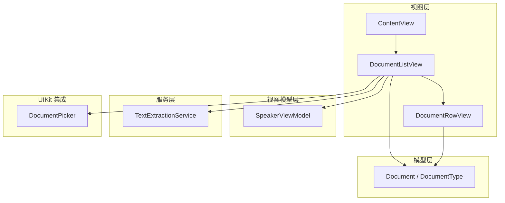
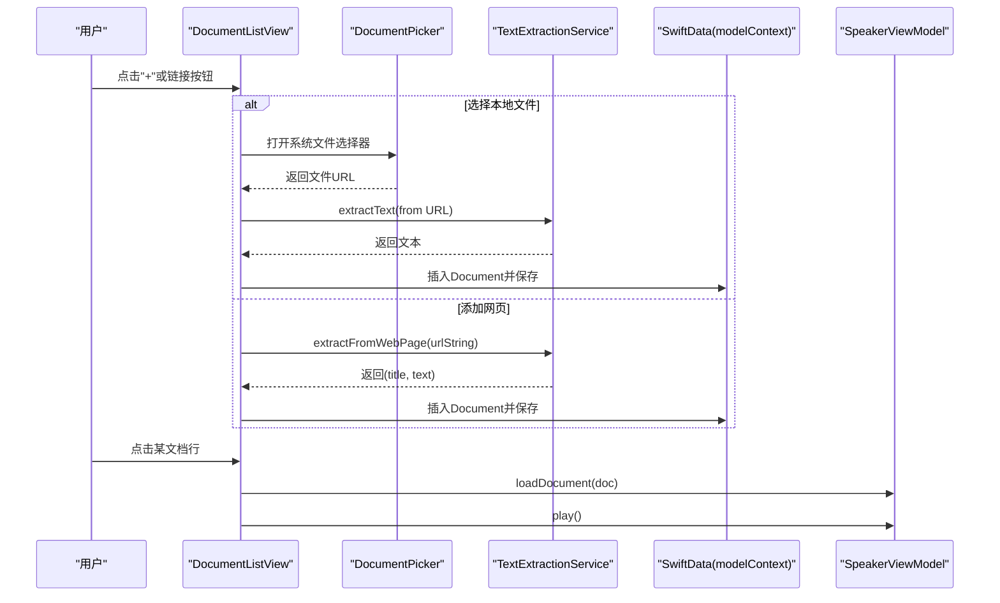
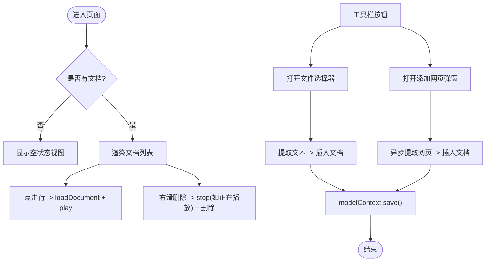
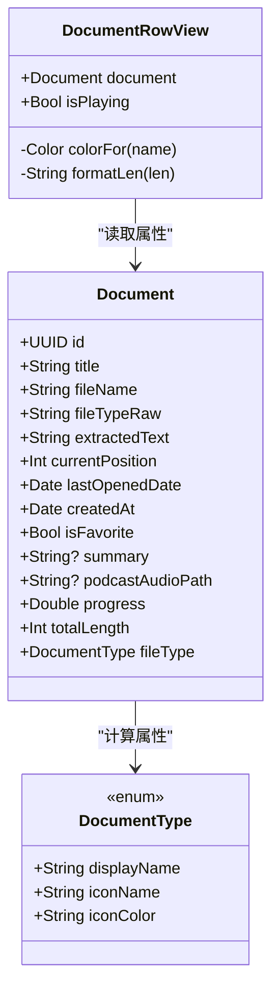
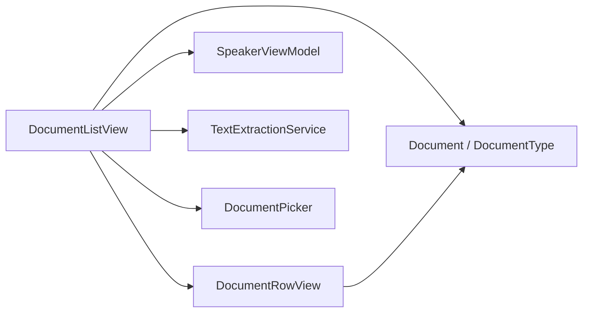

# 文档列表界面

<cite>
**本文引用的文件**   
- [DocumentListView.swift](file://Views/DocumentListView.swift)
- [DocumentRowView.swift](file://Views/DocumentRowView.swift)
- [Document.swift](file://Models/Document.swift)
- [SpeakerViewModel.swift](file://ViewModels/SpeakerViewModel.swift)
- [TextExtractionService.swift](file://Services/TextExtractionService.swift)
- [DocumentPicker.swift](file://UIKit/DocumentPicker.swift)
- [ContentView.swift](file://Views/ContentView.swift)
</cite>

## 目录
1. [简介](#简介)
2. [项目结构](#项目结构)
3. [核心组件](#核心组件)
4. [架构总览](#架构总览)
5. [详细组件分析](#详细组件分析)
6. [依赖关系分析](#依赖关系分析)
7. [性能与可扩展性](#性能与可扩展性)
8. [故障排查指南](#故障排查指南)
9. [结论](#结论)
10. [附录：扩展指南](#附录扩展指南)

## 简介
本文件面向“文档列表界面”的实现，围绕以下目标展开：
- 详细说明 DocumentListView 的数据获取、显示与交互逻辑
- 解析 DocumentRowView 的设计模式与可复用性
- 说明搜索、排序与筛选功能的现状与实现方式
- 解释文件类型图标显示、元数据展示与点击交互处理
- 覆盖空状态、加载状态与错误提示机制
- 提供自定义文档行样式与新增文档类型的扩展指南

## 项目结构
与文档列表界面直接相关的代码分布在 Views、Models、ViewModels、Services 与 UIKit 模块中。整体采用 SwiftUI + SwiftData 的声明式 UI 与数据持久化方案，结合 Service 层完成文本提取与网页抓取，使用 ViewModel 管理播放与文档状态。

图表来源
- [ContentView.swift:16-24](file://Views/ContentView.swift#L16-L24)
- [DocumentListView.swift:19-77](file://Views/DocumentListView.swift#L19-L77)
- [DocumentRowView.swift:8-42](file://Views/DocumentRowView.swift#L8-L42)
- [Document.swift:54-114](file://Models/Document.swift#L54-L114)
- [SpeakerViewModel.swift:8-54](file://ViewModels/SpeakerViewModel.swift#L8-L54)
- [TextExtractionService.swift:8-53](file://Services/TextExtractionService.swift#L8-L53)
- [DocumentPicker.swift:5-24](file://UIKit/DocumentPicker.swift#L5-L24)

章节来源
- [ContentView.swift:16-24](file://Views/ContentView.swift#L16-L24)
- [DocumentListView.swift:19-77](file://Views/DocumentListView.swift#L19-L77)
- [DocumentRowView.swift:8-42](file://Views/DocumentRowView.swift#L8-L42)
- [Document.swift:54-114](file://Models/Document.swift#L54-L114)
- [SpeakerViewModel.swift:8-54](file://ViewModels/SpeakerViewModel.swift#L8-L54)
- [TextExtractionService.swift:8-53](file://Services/TextExtractionService.swift#L8-L53)
- [DocumentPicker.swift:5-24](file://UIKit/DocumentPicker.swift#L5-L24)

## 核心组件
- DocumentListView：负责文档列表渲染、导入（本地文件/网页）、删除、空状态展示、工具栏操作与错误提示。
- DocumentRowView：单行文档展示，包含文件类型图标、标题、类型标签、字数统计、阅读进度与播放指示。
- Document / DocumentType：SwiftData 模型与文档类型枚举，定义图标、颜色、显示名等元数据。
- SpeakerViewModel：统一暴露播放控制与文档加载接口，维护当前文档、播放状态、进度与高亮范围。
- TextExtractionService：多格式文本提取服务（PDF/EPUB/Office/Markdown/纯文本/网页），并封装错误类型。
- DocumentPicker：基于 UIDocumentPickerViewController 的文件选择器桥接。

章节来源
- [DocumentListView.swift:19-146](file://Views/DocumentListView.swift#L19-L146)
- [DocumentRowView.swift:8-61](file://Views/DocumentRowView.swift#L8-L61)
- [Document.swift:5-114](file://Models/Document.swift#L5-L114)
- [SpeakerViewModel.swift:8-314](file://ViewModels/SpeakerViewModel.swift#L8-L314)
- [TextExtractionService.swift:8-748](file://Services/TextExtractionService.swift#L8-L748)
- [DocumentPicker.swift:5-47](file://UIKit/DocumentPicker.swift#L5-L47)

## 架构总览
下图展示了从用户操作到数据持久化的关键流程：导入文件、添加网页、点击播放、删除文档。

图表来源
- [DocumentListView.swift:59-76](file://Views/DocumentListView.swift#L59-L76)
- [DocumentListView.swift:99-139](file://Views/DocumentListView.swift#L99-L139)
- [TextExtractionService.swift:27-114](file://Services/TextExtractionService.swift#L27-L114)
- [SpeakerViewModel.swift:81-117](file://ViewModels/SpeakerViewModel.swift#L81-L117)

## 详细组件分析

### DocumentListView 实现要点
- 数据源与排序
  - 使用 @Query 绑定 SwiftData 中的 Document 集合，默认按 lastOpenedDate 倒序排列，无需额外排序逻辑。
- 列表渲染与交互
  - 非空时以 List 渲染，每项为 DocumentRowView；整行可点击，触发 speakerVM.loadDocument(doc) 与 play()。
  - 支持右滑删除，调用 deleteDoc(doc)，若当前正在播放则先停止。
- 空状态
  - documents.isEmpty 时展示 emptyView，提供“导入文档”和“添加网页”两个入口。
- 导入本地文件
  - 通过 DocumentPicker 选择文件后，调用 TextExtractionService.extractText(from:) 提取文本，构造 Document 并写入 SwiftData。
- 添加网页
  - 弹出 alert 输入 URL，调用 TextExtractionService.extractFromWebPage(urlString:) 异步提取，成功后插入文档并清空输入框。
- 错误提示
  - 导入失败或网络异常时，设置 alertMsg 并展示 alert。

图表来源
- [DocumentListView.swift:22-46](file://Views/DocumentListView.swift#L22-L46)
- [DocumentListView.swift:79-97](file://Views/DocumentListView.swift#L79-L97)
- [DocumentListView.swift:99-139](file://Views/DocumentListView.swift#L99-L139)
- [DocumentListView.swift:141-145](file://Views/DocumentListView.swift#L141-L145)

章节来源
- [DocumentListView.swift:19-146](file://Views/DocumentListView.swift#L19-L146)

### DocumentRowView 设计与可复用性
- 设计模式
  - 无状态展示型组件：仅接收 document 与 isPlaying 作为输入，内部不持有外部状态，便于在任意列表或卡片中复用。
- 文件类型图标与颜色
  - 根据 document.fileType.iconName 与 iconColor 动态渲染 SF Symbols 图标与背景色块。
- 元数据展示
  - 标题、类型标签（displayName）、字数统计（totalLength 格式化）。
- 进度与播放指示
  - 当 progress > 0 时显示百分比与 ProgressView；isPlaying 为真时显示波形动画图标。
- 可定制点
  - 颜色映射 colorFor、长度格式化 formatLen 均可替换为策略注入或配置对象，提升扩展性。

图表来源
- [DocumentRowView.swift:8-61](file://Views/DocumentRowView.swift#L8-L61)
- [Document.swift:54-114](file://Models/Document.swift#L54-L114)
- [Document.swift:5-52](file://Models/Document.swift#L5-L52)

章节来源
- [DocumentRowView.swift:8-61](file://Views/DocumentRowView.swift#L8-L61)
- [Document.swift:5-114](file://Models/Document.swift#L5-L114)

### 文档搜索、排序与筛选
- 排序
  - 已实现：@Query(sort: \Document.lastOpenedDate, order: .reverse) 自动按最近打开时间倒序。
- 搜索与筛选
  - 当前未实现搜索与筛选功能。如需扩展，可在 DocumentListView 中引入 @State 过滤条件，并在 Query 结果基础上进行内存过滤，或使用 SwiftData 的 predicate 参数进行服务端过滤。

章节来源
- [DocumentListView.swift:9](file://Views/DocumentListView.swift#L9)

### 文件类型图标、元数据与点击交互
- 图标与颜色
  - 由 DocumentType 的 iconName 与 iconColor 决定，DocumentRowView 据此渲染。
- 元数据
  - 标题、类型标签、字数统计、阅读进度均来自 Document 的计算属性与字段。
- 点击交互
  - 点击行触发 speakerVM.loadDocument(doc) 与 play()，切换当前文档并开始朗读。

章节来源
- [DocumentRowView.swift:8-42](file://Views/DocumentRowView.swift#L8-L42)
- [Document.swift:72-87](file://Models/Document.swift#L72-L87)
- [DocumentListView.swift:26-35](file://Views/DocumentListView.swift#L26-L35)
- [SpeakerViewModel.swift:81-117](file://ViewModels/SpeakerViewModel.swift#L81-L117)

### 空状态、加载状态与错误提示
- 空状态
  - documents.isEmpty 时展示引导式空视图，并提供快速导入入口。
- 加载状态
  - 添加网页时通过 isLoadingURL 禁用“添加”按钮并提示“正在加载网页...”。
- 错误提示
  - 导入失败或网络异常时，设置 alertMsg 并通过 alert 展示给用户。

章节来源
- [DocumentListView.swift:22-24](file://Views/DocumentListView.swift#L22-L24)
- [DocumentListView.swift:62-76](file://Views/DocumentListView.swift#L62-L76)
- [DocumentListView.swift:113-139](file://Views/DocumentListView.swift#L113-L139)

## 依赖关系分析
- 视图与模型
  - DocumentListView 依赖 Document 模型与 SwiftData 上下文；DocumentRowView 依赖 Document 与 DocumentType。
- 视图与视图模型
  - DocumentListView 通过 SpeakerViewModel 执行加载与播放；SpeakerViewModel 对外暴露 state、currentDocument、progress 等发布属性。
- 视图与服务
  - DocumentListView 使用 TextExtractionService 进行文本提取；使用 DocumentPicker 桥接系统文件选择器。
- 外部集成
  - TextExtractionService 依赖 PDFKit、Vision、UIKit、Compression 等系统框架。

图表来源
- [DocumentListView.swift:19-77](file://Views/DocumentListView.swift#L19-L77)
- [DocumentRowView.swift:8-42](file://Views/DocumentRowView.swift#L8-L42)
- [SpeakerViewModel.swift:8-54](file://ViewModels/SpeakerViewModel.swift#L8-L54)
- [TextExtractionService.swift:8-53](file://Services/TextExtractionService.swift#L8-L53)
- [DocumentPicker.swift:5-24](file://UIKit/DocumentPicker.swift#L5-L24)

章节来源
- [DocumentListView.swift:19-77](file://Views/DocumentListView.swift#L19-L77)
- [DocumentRowView.swift:8-42](file://Views/DocumentRowView.swift#L8-L42)
- [SpeakerViewModel.swift:8-54](file://ViewModels/SpeakerViewModel.swift#L8-L54)
- [TextExtractionService.swift:8-53](file://Services/TextExtractionService.swift#L8-L53)
- [DocumentPicker.swift:5-24](file://UIKit/DocumentPicker.swift#L5-L24)

## 性能与可扩展性
- 列表性能
  - 使用 SwiftUI List 与 ForEach 高效渲染；避免在行内做重计算，尽量使用 Document 的计算属性。
- 文本提取
  - PDF OCR 与网页抓取可能耗时较长，建议在后台任务中进行，UI 上通过 isLoadingURL 反馈状态。
- 可扩展性
  - 新增文档类型：在 DocumentType 中添加新枚举值，并完善 displayName/iconName/iconColor；在 TextExtractionService 中补充对应提取逻辑；在 DocumentPicker 中注册 UTType。
  - 自定义行样式：将 DocumentRowView 的颜色映射与长度格式化抽取为可配置项，或通过协议注入策略。

[本节为通用建议，不涉及具体文件分析]

## 故障排查指南
- 导入失败
  - 检查 TextExtractionService 抛出的 ExtractionError，常见原因包括不支持的文件类型、文件为空、OCR 识别失败、网页无法解析正文等。
- 网页添加失败
  - 确认 URL 有效、网络可达；注意编码识别与正文区域定位失败时的回退路径。
- 播放异常
  - 若当前引擎出错，SpeakerViewModel 会自动降级到系统 TTS；检查音频会话激活与远程控制回调是否正常。

章节来源
- [TextExtractionService.swift:10-25](file://Services/TextExtractionService.swift#L10-L25)
- [TextExtractionService.swift:27-114](file://Services/TextExtractionService.swift#L27-L114)
- [SpeakerViewModel.swift:233-247](file://ViewModels/SpeakerViewModel.swift#L233-L247)

## 结论
文档列表界面以 SwiftUI + SwiftData 为核心，配合 Service 层实现多格式文本提取与网页抓取，使用统一的 ViewModel 管理播放与文档状态。当前已具备完整的导入、展示、播放与删除能力，并提供了良好的空状态与错误提示体验。后续可按扩展指南平滑增加新的文档类型与行样式定制能力。

[本节为总结性内容，不涉及具体文件分析]

## 附录：扩展指南

### 新增文档类型步骤
- 在 DocumentType 中添加新枚举值，并完善 displayName、iconName、iconColor。
- 在 TextExtractionService 中为该类型实现提取逻辑（例如新增 case 分支与对应方法）。
- 在 DocumentPicker 中注册对应的 UTType，使系统文件选择器允许选择该类型。
- 如有需要，更新 DocumentRowView 的展示细节（如特殊标签或进度条样式）。

章节来源
- [Document.swift:5-52](file://Models/Document.swift#L5-L52)
- [TextExtractionService.swift:27-53](file://Services/TextExtractionService.swift#L27-L53)
- [DocumentPicker.swift:9-16](file://UIKit/DocumentPicker.swift#L9-L16)
- [DocumentRowView.swift:8-42](file://Views/DocumentRowView.swift#L8-L42)

### 自定义文档行样式
- 将 DocumentRowView 中的颜色映射与长度格式化抽象为可注入的策略或配置对象，以便在不同主题或业务场景下灵活定制。
- 可通过组合包装 DocumentRowView 的方式，在不修改其内部逻辑的前提下叠加额外信息或交互。

章节来源
- [DocumentRowView.swift:44-60](file://Views/DocumentRowView.swift#L44-L60)