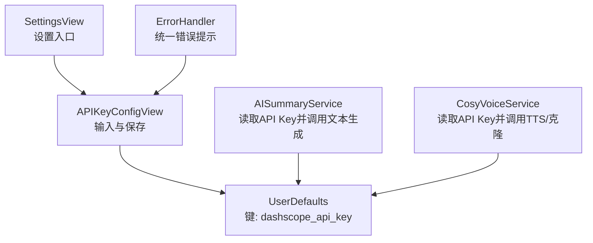
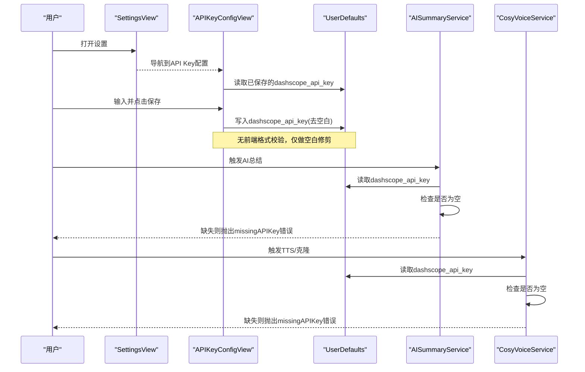
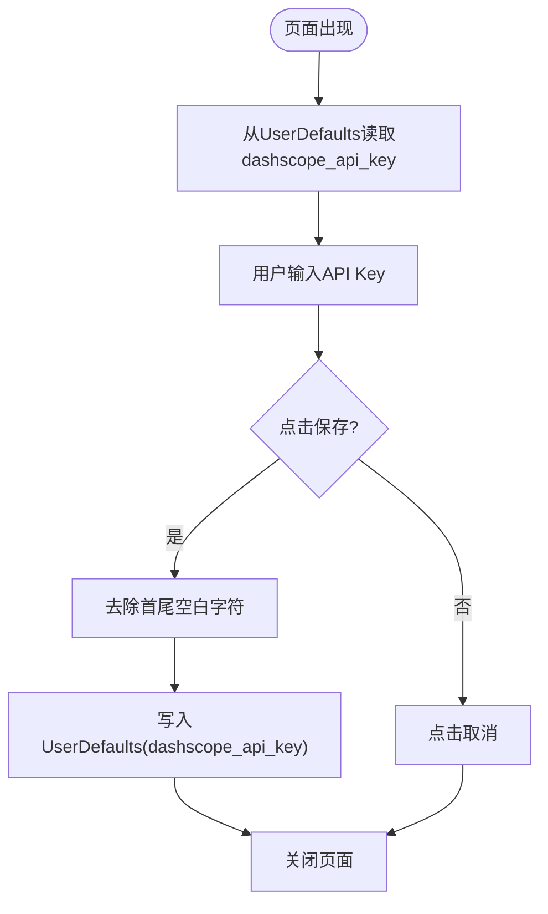
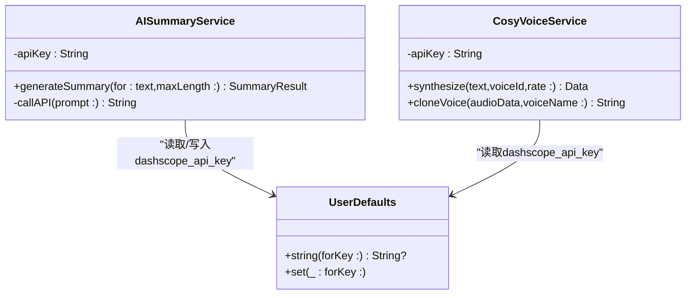
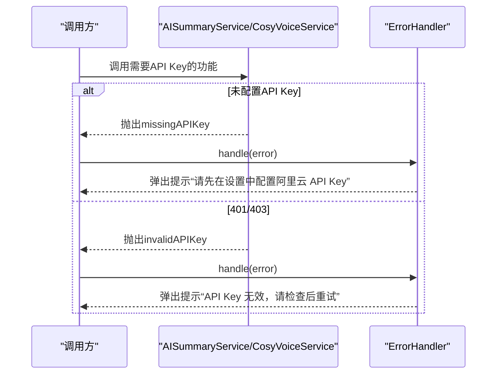
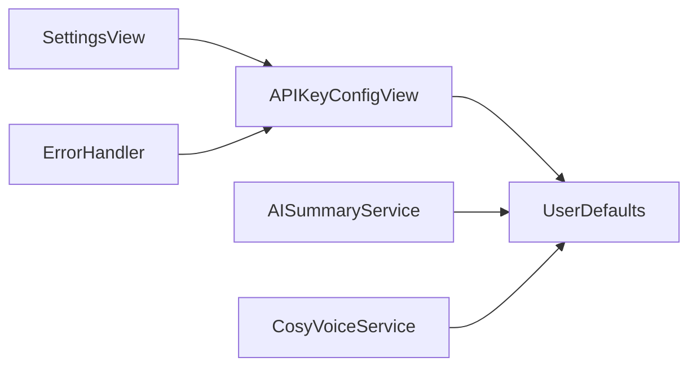

# API密钥配置

<cite>
**本文引用的文件**   
- [APIKeyConfigView.swift](file://Views/APIKeyConfigView.swift)
- [AISummaryService.swift](file://Services/AISummaryService.swift)
- [CosyVoiceService.swift](file://Services/CosyVoiceService.swift)
- [ErrorHandler.swift](file://Services/ErrorHandler.swift)
- [ClonedVoice.swift](file://Models/ClonedVoice.swift)
- [SettingsView.swift](file://Views/SettingsView.swift)
</cite>

## 目录
1. [简介](#简介)
2. [项目结构](#项目结构)
3. [核心组件](#核心组件)
4. [架构总览](#架构总览)
5. [详细组件分析](#详细组件分析)
6. [依赖关系分析](#依赖关系分析)
7. [性能与安全考量](#性能与安全考量)
8. [故障排查指南](#故障排查指南)
9. [结论](#结论)
10. [附录：集成新服务配置界面指南](#附录集成新服务配置界面指南)

## 简介
本文件围绕“API密钥配置界面”展开，聚焦于阿里云 DashScope API Key 的输入、验证与存储机制，并说明当前实现的安全策略与隐私保护措施。文档同时覆盖错误处理逻辑、密钥格式校验现状、导入导出与批量配置的扩展建议，以及如何在代码中集成新的API服务配置界面。

## 项目结构
与API密钥配置相关的代码主要分布在以下位置：
- 视图层：APIKeyConfigView（配置界面）
- 服务层：AISummaryService、CosyVoiceService（读取并使用API Key）
- 模型与持久化：ClonedVoice/VoiceStore（用于音色相关配置，非密钥）
- 错误处理：ErrorHandler（统一错误提示）
- 设置入口：SettingsView（可导航到API Key配置）

图示来源
- [APIKeyConfigView.swift:10-65](file://Views/APIKeyConfigView.swift#L10-L65)
- [AISummaryService.swift:12-16](file://Services/AISummaryService.swift#L12-L16)
- [CosyVoiceService.swift:14-17](file://Services/CosyVoiceService.swift#L14-L17)
- [SettingsView.swift:19-141](file://Views/SettingsView.swift#L19-L141)

章节来源
- [APIKeyConfigView.swift:1-71](file://Views/APIKeyConfigView.swift#L1-L71)
- [AISummaryService.swift:1-180](file://Services/AISummaryService.swift#L1-L180)
- [CosyVoiceService.swift:1-219](file://Services/CosyVoiceService.swift#L1-L219)
- [SettingsView.swift:1-194](file://Views/SettingsView.swift#L1-L194)

## 核心组件
- APIKeyConfigView：提供安全输入框、保存按钮、取消操作、帮助信息；从UserDefaults加载已有值；保存时进行空白修剪后写入。
- AISummaryService：构造请求头Authorization为Bearer + apiKey；若未配置或无效返回特定错误。
- CosyVoiceService：同样从UserDefaults读取apiKey，并在TTS与语音克隆接口中使用；对401/403状态码映射为无效密钥错误。
- ErrorHandler：集中展示错误弹窗与日志输出。
- SettingsView：作为设置页入口，可导航至API Key配置页面。

章节来源
- [APIKeyConfigView.swift:10-65](file://Views/APIKeyConfigView.swift#L10-L65)
- [AISummaryService.swift:25-34](file://Services/AISummaryService.swift#L25-L34)
- [CosyVoiceService.swift:27-36](file://Services/CosyVoiceService.swift#L27-L36)
- [ErrorHandler.swift:20-35](file://Services/ErrorHandler.swift#L20-L35)
- [SettingsView.swift:19-141](file://Views/SettingsView.swift#L19-L141)

## 架构总览
下图展示了用户从设置进入API Key配置、保存后各服务如何读取并使用该密钥的整体流程。

图示来源
- [APIKeyConfigView.swift:55-65](file://Views/APIKeyConfigView.swift#L55-L65)
- [AISummaryService.swift:12-34](file://Services/AISummaryService.swift#L12-L34)
- [CosyVoiceService.swift:14-36](file://Services/CosyVoiceService.swift#L14-L36)

## 详细组件分析

### APIKeyConfigView 界面与交互
- 输入控件：使用安全输入框，避免明文显示。
- 保存逻辑：对输入进行空白字符修剪后写入UserDefaults，键名为dashscope_api_key。
- 取消操作：直接关闭页面。
- 初始化：页面出现时从UserDefaults读取已有值回填。
- 帮助信息：提供获取DashScope API Key的步骤说明。

图示来源
- [APIKeyConfigView.swift:55-65](file://Views/APIKeyConfigView.swift#L55-L65)

章节来源
- [APIKeyConfigView.swift:10-65](file://Views/APIKeyConfigView.swift#L10-L65)

### 密钥读取与服务调用
- AISummaryService：在构造时从UserDefaults读取apiKey；发起请求时将Authorization设置为Bearer + apiKey；当HTTP状态为401/403时抛出invalidAPIKey错误；未配置时抛出missingAPIKey错误。
- CosyVoiceService：与AISummaryService一致，负责TTS合成与语音克隆，同样基于Bearer鉴权，并对401/403映射为invalidAPIKey错误。

图示来源
- [AISummaryService.swift:12-34](file://Services/AISummaryService.swift#L12-L34)
- [CosyVoiceService.swift:14-36](file://Services/CosyVoiceService.swift#L14-L36)

章节来源
- [AISummaryService.swift:25-34](file://Services/AISummaryService.swift#L25-L34)
- [CosyVoiceService.swift:27-36](file://Services/CosyVoiceService.swift#L27-L36)

### 错误处理与用户反馈
- AIServiceError与CosyVoiceError均定义了missingAPIKey与invalidAPIKey等错误类型，并提供本地化描述。
- ErrorHandler提供统一的错误弹窗与日志输出，便于UI层集中展示错误。

图示来源
- [AISummaryService.swift:158-179](file://Services/AISummaryService.swift#L158-L179)
- [CosyVoiceService.swift:191-218](file://Services/CosyVoiceService.swift#L191-L218)
- [ErrorHandler.swift:20-35](file://Services/ErrorHandler.swift#L20-L35)

章节来源
- [AISummaryService.swift:158-179](file://Services/AISummaryService.swift#L158-L179)
- [CosyVoiceService.swift:191-218](file://Services/CosyVoiceService.swift#L191-L218)
- [ErrorHandler.swift:20-35](file://Services/ErrorHandler.swift#L20-L35)

### 密钥格式验证规则与现状
- 当前实现未在UI层进行格式校验，仅在保存时对空白字符进行trim。
- 服务端侧通过HTTP状态码401/403间接判定密钥是否有效。
- 建议在UI层增加正则或长度/前缀校验，以提升用户体验与减少无效请求。

章节来源
- [APIKeyConfigView.swift:61-65](file://Views/APIKeyConfigView.swift#L61-L65)
- [AISummaryService.swift:89-96](file://Services/AISummaryService.swift#L89-L96)
- [CosyVoiceService.swift:59-66](file://Services/CosyVoiceService.swift#L59-L66)

### 密钥存储机制与隐私保护
- 存储位置：UserDefaults，键名dashscope_api_key。
- 加密情况：当前未对密钥进行额外加密或系统级安全存储（如Keychain）。
- 隐私风险：UserDefaults以明文形式存在，易被设备备份或越狱环境读取。
- 建议：迁移至iOS Keychain，结合应用标识符与访问控制策略，降低泄露风险。

章节来源
- [APIKeyConfigView.swift:61-65](file://Views/APIKeyConfigView.swift#L61-L65)
- [AISummaryService.swift:12-16](file://Services/AISummaryService.swift#L12-L16)
- [CosyVoiceService.swift:14-17](file://Services/CosyVoiceService.swift#L14-L17)

### 密钥导入导出与批量配置管理
- 当前未提供导入/导出功能。
- 建议方案：
  - 导出：将dashscope_api_key与其他配置项打包为JSON文件，支持分享与备份。
  - 导入：解析JSON并写入UserDefaults或Keychain，提供冲突处理与回滚机制。
  - 批量配置：支持多账号或多环境的密钥切换，通过配置文件选择激活项。

[本节为概念性建议，不直接分析具体文件]

### 密钥轮换与安全最佳实践
- 定期轮换：建议按周期更新DashScope API Key，并在UI提供“更换密钥”入口。
- 最小权限：为不同功能创建独立密钥，限制访问范围。
- 传输安全：确保HTTPS通信，已在服务层使用HTTPS端点。
- 审计与告警：记录密钥变更事件，异常访问及时告警。
- 失效检测：在首次调用失败且返回401/403时，主动引导用户重新配置。

[本节为通用安全建议，不直接分析具体文件]

## 依赖关系分析
- APIKeyConfigView依赖UserDefaults读写dashscope_api_key。
- AISummaryService与CosyVoiceService在构造时读取dashscope_api_key，并在网络请求中注入Authorization头。
- SettingsView作为入口，可导航至APIKeyConfigView。
- ErrorHandler集中处理错误提示。

图示来源
- [APIKeyConfigView.swift:55-65](file://Views/APIKeyConfigView.swift#L55-L65)
- [AISummaryService.swift:12-16](file://Services/AISummaryService.swift#L12-L16)
- [CosyVoiceService.swift:14-17](file://Services/CosyVoiceService.swift#L14-L17)
- [SettingsView.swift:19-141](file://Views/SettingsView.swift#L19-L141)
- [ErrorHandler.swift:20-35](file://Services/ErrorHandler.swift#L20-L35)

章节来源
- [APIKeyConfigView.swift:10-65](file://Views/APIKeyConfigView.swift#L10-L65)
- [AISummaryService.swift:12-34](file://Services/AISummaryService.swift#L12-L34)
- [CosyVoiceService.swift:14-36](file://Services/CosyVoiceService.swift#L14-L36)
- [SettingsView.swift:19-141](file://Views/SettingsView.swift#L19-L141)
- [ErrorHandler.swift:20-35](file://Services/ErrorHandler.swift#L20-L35)

## 性能与安全考量
- 性能：
  - 网络超时：AISummaryService与CosyVoiceService分别设置了合理的超时时间，避免长时间阻塞。
  - 分段合成：CosyVoiceService提供分段合成方法，适合长文本场景，避免单次请求过大。
- 安全：
  - 当前使用UserDefaults明文存储，存在安全风险，建议迁移至Keychain。
  - 建议在UI层增加格式校验与二次确认，防止误操作。
  - 对敏感操作（如删除、重置密钥）增加确认对话框。

章节来源
- [AISummaryService.swift:60-66](file://Services/AISummaryService.swift#L60-L66)
- [CosyVoiceService.swift:32-36](file://Services/CosyVoiceService.swift#L32-L36)
- [CosyVoiceService.swift:167-186](file://Services/CosyVoiceService.swift#L167-L186)

## 故障排查指南
- 现象：提示“请先在设置中配置阿里云 API Key”
  - 原因：UserDefaults中不存在dashscope_api_key。
  - 处理：进入设置页，打开API Key配置，输入并保存。
- 现象：提示“API Key 无效，请检查后重试”
  - 原因：服务端返回401/403。
  - 处理：确认DashScope控制台中的密钥是否过期或被禁用；必要时重新生成。
- 现象：网络错误或服务器异常
  - 原因：网络不可用或服务端返回非200状态码。
  - 处理：检查网络连接与服务端状态；查看错误详情并稍后重试。

章节来源
- [AISummaryService.swift:158-179](file://Services/AISummaryService.swift#L158-L179)
- [CosyVoiceService.swift:191-218](file://Services/CosyVoiceService.swift#L191-L218)
- [ErrorHandler.swift:20-35](file://Services/ErrorHandler.swift#L20-L35)

## 结论
当前API密钥配置界面实现了基础的输入、保存与读取能力，并通过服务层对缺失与无效密钥进行了明确错误提示。然而，密钥存储仍采用UserDefaults明文方式，缺乏格式校验与导入导出能力。建议优先提升安全性（迁移至Keychain）、增强校验与用户体验（格式校验、二次确认），并补充导入导出与批量配置管理能力，以满足生产环境的安全与管理需求。

## 附录：集成新服务配置界面指南
- 新增配置界面：
  - 新建一个SwiftUI View，复用APIKeyConfigView的模式：安全输入框、保存/取消、帮助信息。
  - 定义独立的UserDefaults键名，避免与现有dashscope_api_key冲突。
- 服务层接入：
  - 在服务构造或调用处读取对应键值，并在请求头中注入鉴权信息。
  - 针对缺失与无效密钥定义明确的错误类型与本地化描述。
- 错误处理：
  - 使用ErrorHandler统一展示错误提示，保持UI一致性。
- 安全与校验：
  - 在UI层增加格式校验与二次确认。
  - 考虑将敏感配置迁移至Keychain。
- 测试与回归：
  - 覆盖正常保存、无效格式、重复保存、取消操作等用例。
  - 模拟401/403响应，验证错误提示路径。

[本节为通用集成建议，不直接分析具体文件]