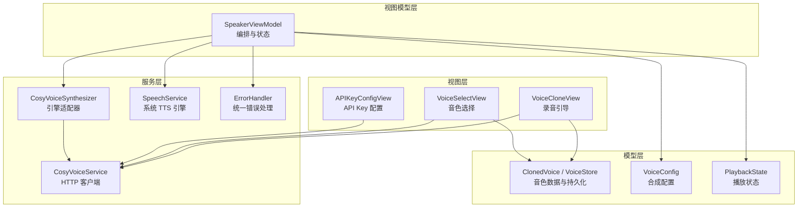
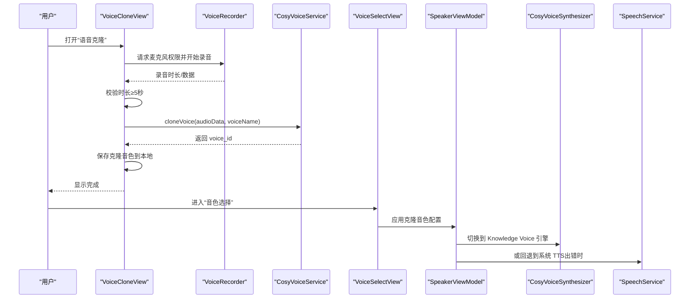
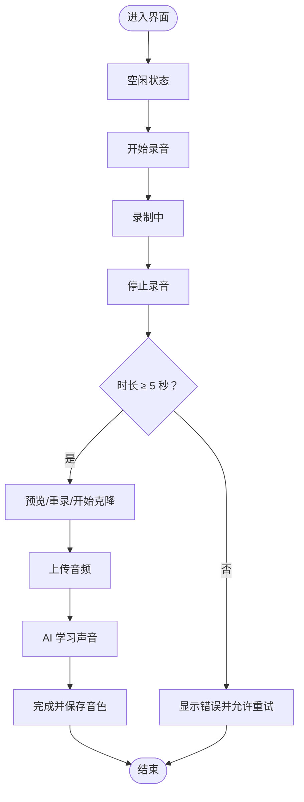
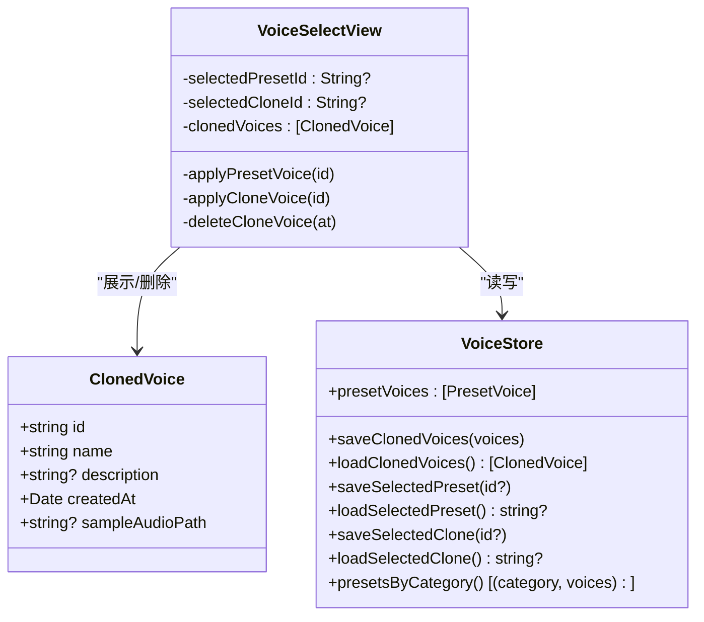
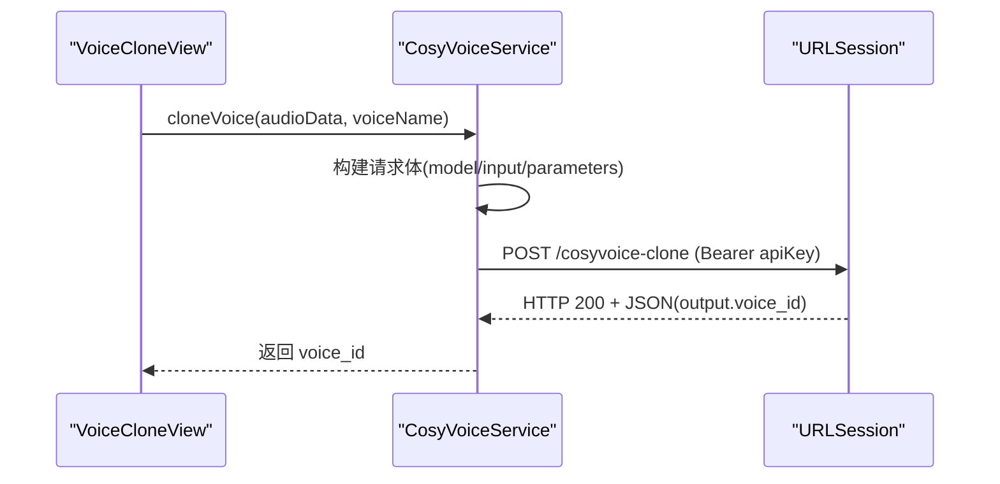
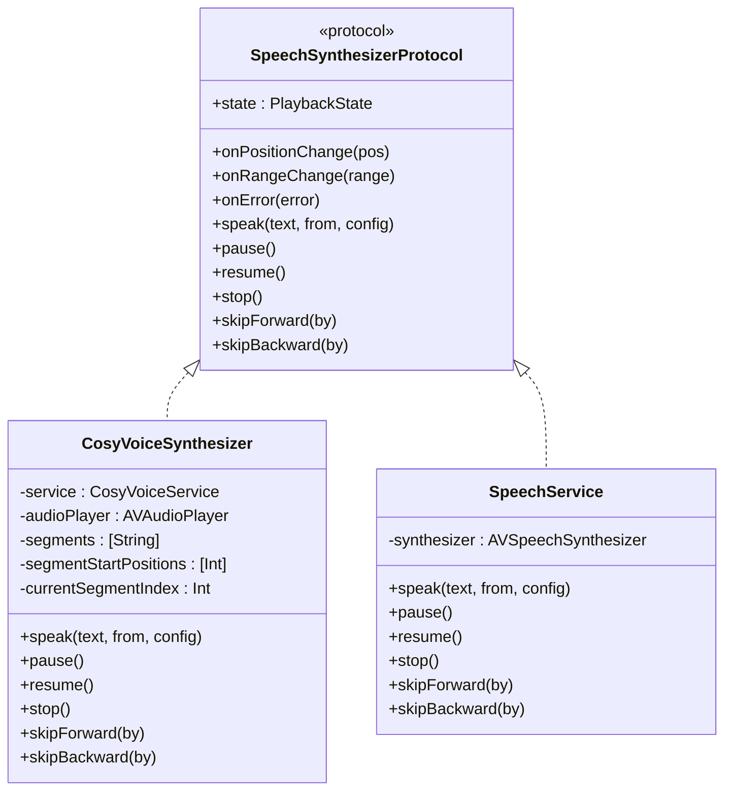
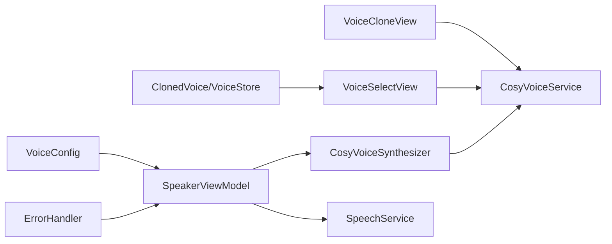
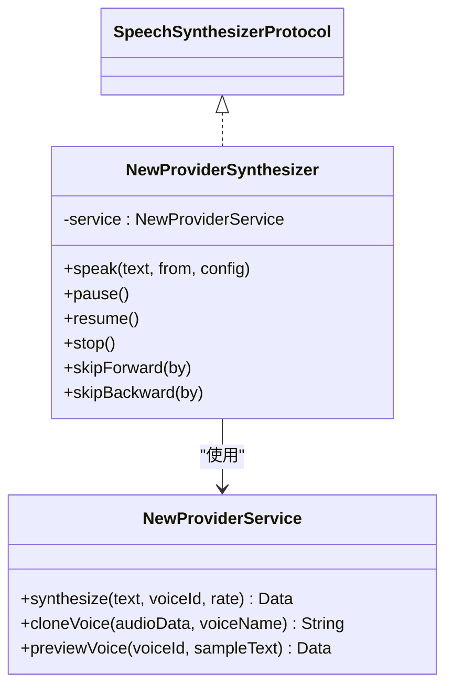

# 声音克隆界面

<cite>
**本文引用的文件**   
- [VoiceCloneView.swift](file://Views/VoiceCloneView.swift)
- [ClonedVoice.swift](file://Models/ClonedVoice.swift)
- [VoiceConfig.swift](file://Models/VoiceConfig.swift)
- [CosyVoiceService.swift](file://Services/CosyVoiceService.swift)
- [CosyVoiceSynthesizer.swift](file://Services/CosyVoiceSynthesizer.swift)
- [SpeechSynthesizerProtocol.swift](file://Services/SpeechSynthesizerProtocol.swift)
- [SpeakerViewModel.swift](file://ViewModels/SpeakerViewModel.swift)
- [APIKeyConfigView.swift](file://Views/APIKeyConfigView.swift)
- [VoiceSelectView.swift](file://Views/VoiceSelectView.swift)
- [SpeechService.swift](file://Services/SpeechService.swift)
- [PlaybackState.swift](file://Models/PlaybackState.swift)
- [ErrorHandler.swift](file://Services/ErrorHandler.swift)
</cite>

## 目录
1. [简介](#简介)
2. [项目结构](#项目结构)
3. [核心组件](#核心组件)
4. [架构总览](#架构总览)
5. [详细组件分析](#详细组件分析)
6. [依赖关系分析](#依赖关系分析)
7. [性能与质量考量](#性能与质量考量)
8. [故障排查指南](#故障排查指南)
9. [结论](#结论)
10. [附录：扩展新的语音克隆服务提供商](#附录扩展新的语音克隆服务提供商)

## 简介
本文件面向“声音克隆”功能，围绕 VoiceCloneView 的录音引导、上传训练、模型部署与音色管理进行系统化说明。文档涵盖：
- 用户引导流程与状态机
- AI 语音合成服务（阿里云 DashScope CosyVoice）集成方式与配置参数
- 声音克隆模型的上传、训练与部署路径
- 克隆语音的创建、编辑、删除与分享能力
- 音频预处理与质量检测机制
- API 调用示例与错误处理方案
- 如何扩展支持新的语音克隆服务提供商

## 项目结构
与声音克隆相关的代码主要分布在 Views、Services、Models 与 ViewModels 四个层次：
- Views：用户交互入口（录音引导、音色选择、API Key 配置）
- Services：AI 服务封装（CosyVoice）、系统 TTS 适配、错误处理
- Models：数据模型与持久化（克隆音色、配置、播放状态）
- ViewModels：编排层（切换引擎、播放控制、配置同步）

图表来源
- [VoiceCloneView.swift:1-404](file://Views/VoiceCloneView.swift#L1-L404)
- [VoiceSelectView.swift:1-215](file://Views/VoiceSelectView.swift#L1-L215)
- [APIKeyConfigView.swift:1-71](file://Views/APIKeyConfigView.swift#L1-L71)
- [SpeakerViewModel.swift:1-314](file://ViewModels/SpeakerViewModel.swift#L1-L314)
- [CosyVoiceService.swift:1-219](file://Services/CosyVoiceService.swift#L1-L219)
- [CosyVoiceSynthesizer.swift:1-258](file://Services/CosyVoiceSynthesizer.swift#L1-L258)
- [SpeechService.swift:1-155](file://Services/SpeechService.swift#L1-L155)
- [ClonedVoice.swift:1-118](file://Models/ClonedVoice.swift#L1-L118)
- [VoiceConfig.swift:1-52](file://Models/VoiceConfig.swift#L1-L52)
- [PlaybackState.swift:1-9](file://Models/PlaybackState.swift#L1-L9)
- [ErrorHandler.swift:1-53](file://Services/ErrorHandler.swift#L1-L53)

章节来源
- [VoiceCloneView.swift:1-404](file://Views/VoiceCloneView.swift#L1-L404)
- [VoiceSelectView.swift:1-215](file://Views/VoiceSelectView.swift#L1-L215)
- [APIKeyConfigView.swift:1-71](file://Views/APIKeyConfigView.swift#L1-L71)
- [SpeakerViewModel.swift:1-314](file://ViewModels/SpeakerViewModel.swift#L1-L314)
- [CosyVoiceService.swift:1-219](file://Services/CosyVoiceService.swift#L1-L219)
- [CosyVoiceSynthesizer.swift:1-258](file://Services/CosyVoiceSynthesizer.swift#L1-L258)
- [SpeechService.swift:1-155](file://Services/SpeechService.swift#L1-L155)
- [ClonedVoice.swift:1-118](file://Models/ClonedVoice.swift#L1-L118)
- [VoiceConfig.swift:1-52](file://Models/VoiceConfig.swift#L1-L52)
- [PlaybackState.swift:1-9](file://Models/PlaybackState.swift#L1-L9)
- [ErrorHandler.swift:1-53](file://Services/ErrorHandler.swift#L1-L53)

## 核心组件
- VoiceCloneView：提供录音引导、录制、试听、上传克隆、完成与重试的状态机 UI。
- CosyVoiceService：封装阿里云 DashScope CosyVoice 的 HTTP 接口，提供文本转语音与语音克隆能力。
- CosyVoiceSynthesizer：将 CosyVoiceService 适配为 SpeechSynthesizerProtocol，实现分段合成、自动拼接与播放。
- SpeakerViewModel：编排层，负责引擎切换、播放控制、配置持久化与错误降级。
- ClonedVoice/VoiceStore：克隆音色的数据模型与本地持久化。
- VoiceConfig：TTS 引擎类型、语速、音高、音量、语言、音色 ID 等配置项。
- APIKeyConfigView：用于保存阿里云 DashScope API Key。
- ErrorHandler：统一的错误日志与弹窗提示。

章节来源
- [VoiceCloneView.swift:1-404](file://Views/VoiceCloneView.swift#L1-L404)
- [CosyVoiceService.swift:1-219](file://Services/CosyVoiceService.swift#L1-L219)
- [CosyVoiceSynthesizer.swift:1-258](file://Services/CosyVoiceSynthesizer.swift#L1-L258)
- [SpeakerViewModel.swift:1-314](file://ViewModels/SpeakerViewModel.swift#L1-L314)
- [ClonedVoice.swift:1-118](file://Models/ClonedVoice.swift#L1-L118)
- [VoiceConfig.swift:1-52](file://Models/VoiceConfig.swift#L1-L52)
- [APIKeyConfigView.swift:1-71](file://Views/APIKeyConfigView.swift#L1-L71)
- [ErrorHandler.swift:1-53](file://Services/ErrorHandler.swift#L1-L53)

## 架构总览
声音克隆的整体流程从用户录音开始，经过本地校验与上传，由云端完成训练并返回 voice_id，随后在应用中持久化并可被 TTS 使用。

图表来源
- [VoiceCloneView.swift:261-322](file://Views/VoiceCloneView.swift#L261-L322)
- [CosyVoiceService.swift:97-144](file://Services/CosyVoiceService.swift#L97-L144)
- [VoiceSelectView.swift:143-163](file://Views/VoiceSelectView.swift#L143-L163)
- [SpeakerViewModel.swift:57-77](file://ViewModels/SpeakerViewModel.swift#L57-L77)
- [CosyVoiceSynthesizer.swift:28-51](file://Services/CosyVoiceSynthesizer.swift#L28-L51)
- [SpeechService.swift:30-72](file://Services/SpeechService.swift#L30-L72)

## 详细组件分析

### 录音与引导界面（VoiceCloneView）
- 用户引导：展示朗读文本，提供“开始录音/停止/试听/重录/开始克隆/完成/重试”等操作按钮。
- 状态机：idle → recording → preview → uploading → processing → completed/error。
- 录音器：基于 AVAudioRecorder，采样率 24kHz、单声道、16bit PCM，输出临时 WAV 文件；支持播放预览。
- 上传与克隆：调用 CosyVoiceService.cloneVoice，成功后持久化到 VoiceStore，并设置当前选中的克隆音色。
- 错误处理：权限不足、时长不足、网络异常等通过 UI 提示与重试。

图表来源
- [VoiceCloneView.swift:16-24](file://Views/VoiceCloneView.swift#L16-L24)
- [VoiceCloneView.swift:261-322](file://Views/VoiceCloneView.swift#L261-L322)
- [VoiceCloneView.swift:327-403](file://Views/VoiceCloneView.swift#L327-L403)

章节来源
- [VoiceCloneView.swift:1-404](file://Views/VoiceCloneView.swift#L1-L404)

### 音色选择与管理（VoiceSelectView + ClonedVoice + VoiceStore）
- 我的音色：加载本地已克隆的音色列表，支持删除操作。
- 预设音色：按分类展示内置预设，支持试听与选择。
- 应用选择：更新 SpeakerViewModel 的 voiceConfig，并切换至 Knowledge Voice 引擎。
- 持久化：VoiceStore 使用 UserDefaults 存储克隆音色列表与选中 ID。

图表来源
- [ClonedVoice.swift:33-118](file://Models/ClonedVoice.swift#L33-L118)
- [VoiceSelectView.swift:1-215](file://Views/VoiceSelectView.swift#L1-L215)

章节来源
- [VoiceSelectView.swift:1-215](file://Views/VoiceSelectView.swift#L1-L215)
- [ClonedVoice.swift:1-118](file://Models/ClonedVoice.swift#L1-L118)

### AI 语音合成服务集成（CosyVoiceService）
- 文本转语音：POST 到 cosyvoice-synthesis，支持 voiceId、format、sample_rate、speech_rate 等参数。
- 语音克隆：POST 到 cosyvoice-clone，上传 base64 编码的参考音频，返回 voice_id。
- 响应解析：支持 audio_url 下载或直接 base64 解码。
- 错误码：401/403 视为无效 API Key，其他非 200 返回 apiError。

图表来源
- [CosyVoiceService.swift:97-144](file://Services/CosyVoiceService.swift#L97-L144)
- [CosyVoiceService.swift:27-88](file://Services/CosyVoiceService.swift#L27-L88)

章节来源
- [CosyVoiceService.swift:1-219](file://Services/CosyVoiceService.swift#L1-L219)

### 引擎适配与播放（CosyVoiceSynthesizer + SpeechSynthesizerProtocol）
- 协议抽象：SpeechSynthesizerProtocol 定义 speak/pause/resume/stop/skipForward/skipBackward 及位置/范围回调。
- 分段合成：按段落（≤500 字符）调用 CosyVoiceService.synthesize，写入临时文件后顺序播放。
- 位置估算：根据播放时间与预估字符速率计算当前位置，驱动 UI 高亮。
- 错误降级：当引擎报错时，SpeakerViewModel 自动降级到系统 TTS。

图表来源
- [SpeechSynthesizerProtocol.swift:1-20](file://Services/SpeechSynthesizerProtocol.swift#L1-L20)
- [CosyVoiceSynthesizer.swift:1-258](file://Services/CosyVoiceSynthesizer.swift#L1-L258)
- [SpeechService.swift:1-155](file://Services/SpeechService.swift#L1-L155)

章节来源
- [CosyVoiceSynthesizer.swift:1-258](file://Services/CosyVoiceSynthesizer.swift#L1-L258)
- [SpeechSynthesizerProtocol.swift:1-20](file://Services/SpeechSynthesizerProtocol.swift#L1-L20)
- [SpeechService.swift:1-155](file://Services/SpeechService.swift#L1-L155)

### 编排与配置（SpeakerViewModel + VoiceConfig）
- 引擎切换：根据 TTSEngine 选择系统 TTS 或 Knowledge Voice。
- 配置持久化：保存 rate、pitchMultiplier、volume、language、engine、clonedVoiceId、presetVoiceId。
- 播放控制：play/pause/stop/replay/skipForward/skipBackward/seekTo，并与 NowPlaying 系统集成。
- 错误降级：Knowledge Voice 出错时自动切回系统 TTS。

章节来源
- [SpeakerViewModel.swift:1-314](file://ViewModels/SpeakerViewModel.swift#L1-L314)
- [VoiceConfig.swift:1-52](file://Models/VoiceConfig.swift#L1-L52)

### API Key 配置（APIKeyConfigView）
- 输入与保存：SecureField 输入阿里云 DashScope API Key，保存到 UserDefaults。
- 使用说明：提供获取 API Key 的步骤指引。

章节来源
- [APIKeyConfigView.swift:1-71](file://Views/APIKeyConfigView.swift#L1-L71)

## 依赖关系分析
- 视图层依赖服务层：VoiceCloneView 直接调用 CosyVoiceService；VoiceSelectView 通过 CosyVoiceService 试听音色。
- 编排层聚合多引擎：SpeakerViewModel 持有系统 TTS 与 Knowledge Voice 两个引擎实例，依据配置动态切换。
- 模型与持久化：ClonedVoice/VoiceStore 与 VoiceConfig 均使用 UserDefaults 进行本地持久化。
- 错误处理：ErrorHandler 提供统一日志与弹窗，SpeakerViewModel 在引擎错误时触发降级逻辑。

图表来源
- [VoiceCloneView.swift:1-404](file://Views/VoiceCloneView.swift#L1-L404)
- [VoiceSelectView.swift:1-215](file://Views/VoiceSelectView.swift#L1-L215)
- [SpeakerViewModel.swift:1-314](file://ViewModels/SpeakerViewModel.swift#L1-L314)
- [CosyVoiceService.swift:1-219](file://Services/CosyVoiceService.swift#L1-L219)
- [CosyVoiceSynthesizer.swift:1-258](file://Services/CosyVoiceSynthesizer.swift#L1-L258)
- [SpeechService.swift:1-155](file://Services/SpeechService.swift#L1-L155)
- [ClonedVoice.swift:1-118](file://Models/ClonedVoice.swift#L1-L118)
- [VoiceConfig.swift:1-52](file://Models/VoiceConfig.swift#L1-L52)
- [ErrorHandler.swift:1-53](file://Services/ErrorHandler.swift#L1-L53)

章节来源
- [SpeakerViewModel.swift:1-314](file://ViewModels/SpeakerViewModel.swift#L1-L314)
- [CosyVoiceService.swift:1-219](file://Services/CosyVoiceService.swift#L1-L219)
- [CosyVoiceSynthesizer.swift:1-258](file://Services/CosyVoiceSynthesizer.swift#L1-L258)
- [SpeechService.swift:1-155](file://Services/SpeechService.swift#L1-L155)
- [ClonedVoice.swift:1-118](file://Models/ClonedVoice.swift#L1-L118)
- [VoiceConfig.swift:1-52](file://Models/VoiceConfig.swift#L1-L52)
- [ErrorHandler.swift:1-53](file://Services/ErrorHandler.swift#L1-L53)

## 性能与质量考量
- 录音参数：24kHz、单声道、16bit PCM，兼顾音质与体积，适合短时参考音频上传。
- 时长限制：要求至少 5 秒，避免过短样本导致训练失败或效果不佳。
- 分段合成：每段 ≤500 字符，降低单次请求压力，提升稳定性；段间加入延迟避免过快请求。
- 播放体验：定时更新位置与范围，驱动 UI 高亮跟随；自动播放下一段，减少等待。
- 资源清理：临时文件写入缓存目录，播放完成后释放播放器与定时器。

[本节为通用指导，不直接分析具体文件]

## 故障排查指南
- 未配置 API Key：CosyVoiceService 抛出 missingAPIKey，UI 应引导用户前往 APIKeyConfigView 配置。
- 无效 API Key：服务端返回 401/403，抛出 invalidAPIKey，提示检查密钥。
- 网络错误：捕获 networkError，建议检查网络并重试。
- 录音时长不足：提示至少 5 秒，允许重新录制。
- 服务器异常：apiError 携带状态码与消息，便于定位问题。
- 引擎降级：Knowledge Voice 出错时自动回退到系统 TTS，保障可用性。

章节来源
- [CosyVoiceService.swift:191-218](file://Services/CosyVoiceService.swift#L191-L218)
- [ErrorHandler.swift:21-35](file://Services/ErrorHandler.swift#L21-L35)
- [SpeakerViewModel.swift:234-247](file://ViewModels/SpeakerViewModel.swift#L234-L247)

## 结论
声音克隆界面以清晰的引导流程与稳健的错误处理为核心，结合阿里云 CosyVoice 的云端训练能力，实现了从录音到音色使用的完整闭环。通过可插拔的引擎适配与统一的配置管理，系统在易用性与可扩展性之间取得平衡。后续可在音频预处理、质量评估与服务提供商扩展方面进一步增强。

[本节为总结，不直接分析具体文件]

## 附录：扩展新的语音克隆服务提供商
目标：在不改动上层 UI 的前提下，新增一个语音克隆服务提供商（例如某第三方 TTS 平台）。

步骤建议：
- 新增服务类：参照 CosyVoiceService，实现新的 HTTP 客户端，封装注册/上传/训练/查询/试听等接口。
- 新增引擎适配器：参照 CosyVoiceSynthesizer，实现 SpeechSynthesizerProtocol，负责分段合成与播放。
- 配置扩展：在 VoiceConfig 中增加 provider 字段或枚举，用于选择不同提供商。
- 编排层接入：在 SpeakerViewModel 中根据配置选择对应引擎实例，并在错误时执行降级策略。
- 测试与回退：确保新引擎出错时能平滑回退到系统 TTS，不影响用户体验。

图表来源
- [SpeechSynthesizerProtocol.swift:1-20](file://Services/SpeechSynthesizerProtocol.swift#L1-L20)
- [CosyVoiceSynthesizer.swift:1-258](file://Services/CosyVoiceSynthesizer.swift#L1-L258)
- [CosyVoiceService.swift:1-219](file://Services/CosyVoiceService.swift#L1-L219)
- [SpeakerViewModel.swift:57-77](file://ViewModels/SpeakerViewModel.swift#L57-L77)
- [VoiceConfig.swift:1-52](file://Models/VoiceConfig.swift#L1-L52)

章节来源
- [SpeechSynthesizerProtocol.swift:1-20](file://Services/SpeechSynthesizerProtocol.swift#L1-L20)
- [CosyVoiceSynthesizer.swift:1-258](file://Services/CosyVoiceSynthesizer.swift#L1-L258)
- [CosyVoiceService.swift:1-219](file://Services/CosyVoiceService.swift#L1-L219)
- [SpeakerViewModel.swift:1-314](file://ViewModels/SpeakerViewModel.swift#L1-L314)
- [VoiceConfig.swift:1-52](file://Models/VoiceConfig.swift#L1-L52)