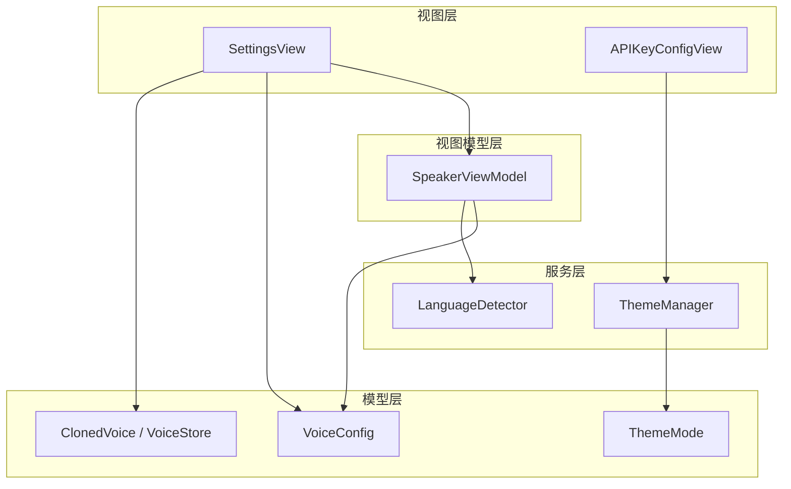
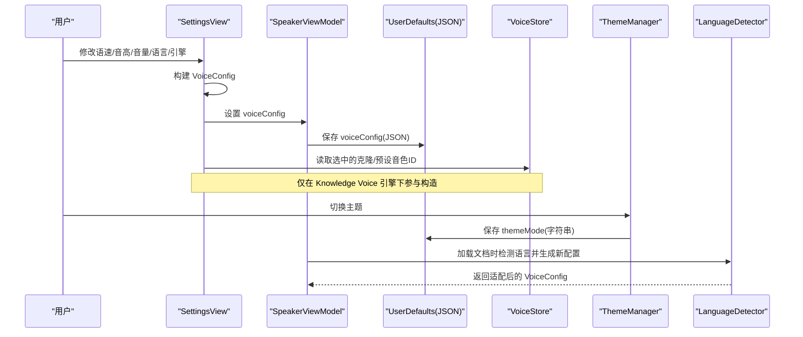
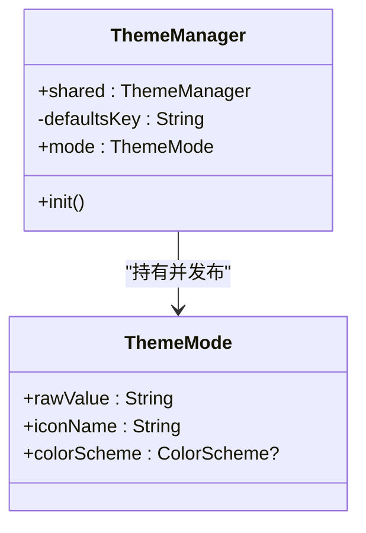
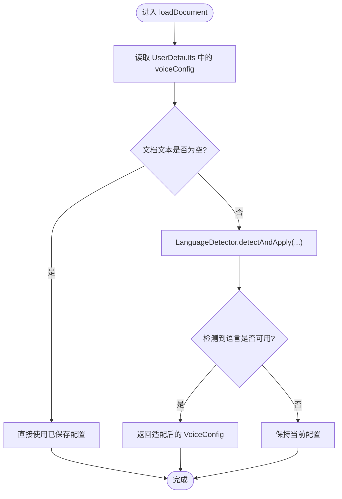
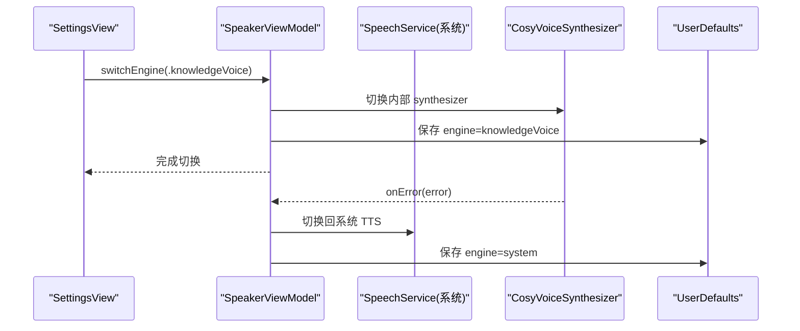
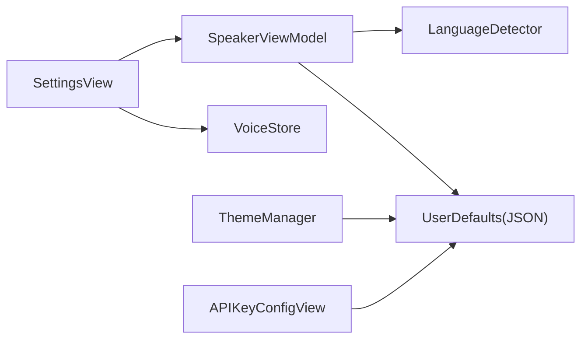

# 设置持久化

<cite>
**本文引用的文件**   
- [VoiceConfig.swift](file://Models/VoiceConfig.swift)
- [ThemeMode.swift](file://Models/ThemeMode.swift)
- [ThemeManager.swift](file://Services/ThemeManager.swift)
- [SettingsView.swift](file://Views/SettingsView.swift)
- [SpeakerViewModel.swift](file://ViewModels/SpeakerViewModel.swift)
- [ClonedVoice.swift](file://Models/ClonedVoice.swift)
- [LanguageDetector.swift](file://Services/LanguageDetector.swift)
- [APIKeyConfigView.swift](file://Views/APIKeyConfigView.swift)
</cite>

## 目录
1. [简介](#简介)
2. [项目结构](#项目结构)
3. [核心组件](#核心组件)
4. [架构总览](#架构总览)
5. [详细组件分析](#详细组件分析)
6. [依赖关系分析](#依赖关系分析)
7. [性能与存储特性](#性能与存储特性)
8. [故障排查指南](#故障排查指南)
9. [结论](#结论)
10. [附录：扩展与迁移指南](#附录扩展与迁移指南)

## 简介
本文件围绕“设置持久化机制”展开，系统性说明以下方面：
- VoiceConfig 数据模型的设计与字段定义（语音参数、语言设置、引擎配置）
- UserDefaults 的配置存储策略与 JSON 序列化机制
- ThemeManager 的主题切换实现与状态同步
- 设置的默认值管理与恢复机制
- 配置版本迁移与数据兼容性处理建议
- 设置备份导入导出功能的实现指南
- 如何添加新的设置项与配置验证规则

## 项目结构
与设置持久化相关的代码主要分布在 Models、Services、ViewModels、Views 四个层次：
- Models：数据模型与枚举（VoiceConfig、ThemeMode、ClonedVoice）
- Services：主题管理（ThemeManager）、语言检测（LanguageDetector）
- ViewModels：播放与配置中心（SpeakerViewModel）
- Views：用户界面与交互（SettingsView、APIKeyConfigView）

图表来源
- [VoiceConfig.swift:1-52](file://Models/VoiceConfig.swift#L1-L52)
- [ThemeMode.swift:1-25](file://Models/ThemeMode.swift#L1-L25)
- [ThemeManager.swift:1-25](file://Services/ThemeManager.swift#L1-L25)
- [ClonedVoice.swift:50-118](file://Models/ClonedVoice.swift#L50-L118)
- [LanguageDetector.swift:1-82](file://Services/LanguageDetector.swift#L1-L82)
- [SpeakerViewModel.swift:1-314](file://ViewModels/SpeakerViewModel.swift#L1-L314)
- [SettingsView.swift:1-194](file://Views/SettingsView.swift#L1-L194)
- [APIKeyConfigView.swift:1-71](file://Views/APIKeyConfigView.swift#L1-L71)

章节来源
- [VoiceConfig.swift:1-52](file://Models/VoiceConfig.swift#L1-L52)
- [ThemeMode.swift:1-25](file://Models/ThemeMode.swift#L1-L25)
- [ThemeManager.swift:1-25](file://Services/ThemeManager.swift#L1-L25)
- [ClonedVoice.swift:50-118](file://Models/ClonedVoice.swift#L50-L118)
- [LanguageDetector.swift:1-82](file://Services/LanguageDetector.swift#L1-L82)
- [SpeakerViewModel.swift:1-314](file://ViewModels/SpeakerViewModel.swift#L1-L314)
- [SettingsView.swift:1-194](file://Views/SettingsView.swift#L1-L194)
- [APIKeyConfigView.swift:1-71](file://Views/APIKeyConfigView.swift#L1-L71)

## 核心组件
本节聚焦于设置持久化的关键对象与职责。

- VoiceConfig：语音合成相关配置的集中载体，包含语速、音高、音量、语言、系统语音标识、TTS 引擎选择、以及 Knowledge Voice 的克隆/预设音色 ID。提供默认实例与常用语速预设集合。
- ThemeMode：主题模式枚举，支持跟随系统、白天、暗黑三种模式，并附带图标与 ColorScheme 映射。
- ThemeManager：单例 ObservableObject，持有 @Published 的 mode，负责将主题写入 UserDefaults 并在初始化时恢复。
- SpeakerViewModel：作为统一门面，维护 voiceConfig，负责加载/保存配置到 UserDefaults，并在运行时更新 TTS 引擎或实时应用新配置。
- VoiceStore：封装 ClonedVoice 列表与选中预设/克隆音色的存取，使用 JSON 编码为 Data 后存入 UserDefaults。
- LanguageDetector：根据文档文本自动检测主导语言，匹配可用系统语音并返回适配后的 VoiceConfig。
- SettingsView：UI 入口，聚合所有设置项，构建 VoiceConfig 并调用 ViewModel 保存与应用。
- APIKeyConfigView：用于持久化 DashScope API Key 的简单页面。

章节来源
- [VoiceConfig.swift:1-52](file://Models/VoiceConfig.swift#L1-L52)
- [ThemeMode.swift:1-25](file://Models/ThemeMode.swift#L1-L25)
- [ThemeManager.swift:1-25](file://Services/ThemeManager.swift#L1-L25)
- [SpeakerViewModel.swift:158-170](file://ViewModels/SpeakerViewModel.swift#L158-L170)
- [SpeakerViewModel.swift:302-313](file://ViewModels/SpeakerViewModel.swift#L302-L313)
- [ClonedVoice.swift:50-118](file://Models/ClonedVoice.swift#L50-L118)
- [LanguageDetector.swift:1-82](file://Services/LanguageDetector.swift#L1-L82)
- [SettingsView.swift:160-193](file://Views/SettingsView.swift#L160-L193)
- [APIKeyConfigView.swift:55-65](file://Views/APIKeyConfigView.swift#L55-L65)

## 架构总览
下图展示了设置持久化的整体流程：用户在 SettingsView 中调整参数，构建 VoiceConfig；SpeakerViewModel 负责从 UserDefaults 读取默认/历史配置，并在变更时写回；ThemeManager 独立管理主题；VoiceStore 管理克隆/预设音色选择；LanguageDetector 在加载文档时尝试自动匹配语言与语音。

图表来源
- [SettingsView.swift:160-193](file://Views/SettingsView.swift#L160-L193)
- [SpeakerViewModel.swift:158-170](file://ViewModels/SpeakerViewModel.swift#L158-L170)
- [SpeakerViewModel.swift:302-313](file://ViewModels/SpeakerViewModel.swift#L302-L313)
- [ThemeManager.swift:10-23](file://Services/ThemeManager.swift#L10-L23)
- [ClonedVoice.swift:50-118](file://Models/ClonedVoice.swift#L50-L118)
- [LanguageDetector.swift:30-76](file://Services/LanguageDetector.swift#L30-L76)

## 详细组件分析

### VoiceConfig 数据模型与字段定义
- 语音参数
  - rate：语速，Float，范围 0.1~2.0，默认 0.5
  - pitchMultiplier：音高倍数，Float，默认 1.0
  - volume：音量，Float，默认 1.0
- 语言与语音
  - language：语言代码，String，默认 "zh-CN"
  - voiceIdentifier：系统语音标识符，可选 String
- 引擎与音色
  - engine：TTSEngine 枚举，支持 system 与 knowledgeVoice
  - clonedVoiceId：Knowledge Voice 克隆音色 ID，可选 String
  - presetVoiceId：Knowledge Voice 预设音色 ID，可选 String
- 默认值与预设
  - defaultConfig：默认实例
  - speedPresets：常用语速档位集合，供 UI 快捷选择

复杂度与可序列化性
- 结构体遵循 Codable，便于 JSON 编解码
- 字段均为基础类型或可选类型，易于跨版本兼容

章节来源
- [VoiceConfig.swift:24-51](file://Models/VoiceConfig.swift#L24-L51)

### UserDefaults 配置存储策略与序列化机制
- 存储键
  - "voiceConfig"：VoiceConfig 的 JSON Data
  - "themeMode"：ThemeMode 的 rawValue 字符串
  - "clonedVoices"：[ClonedVoice] 的 JSON Data
  - "selectedPresetVoiceId"：当前选中的预设音色 ID
  - "selectedCloneVoiceId"：当前选中的克隆音色 ID
  - "dashscope_api_key"：DashScope API Key
- 序列化方式
  - 使用 JSONEncoder/JSONDecoder 进行 Data 与模型之间的转换
  - 失败路径采用容错降级（例如 decode 失败返回默认配置）

读写位置
- SpeakerViewModel：loadConfig/saveConfig
- SettingsView：saveConfig
- ThemeManager：mode 的 didSet 与 init
- VoiceStore：克隆/预设音色的存取
- APIKeyConfigView：API Key 的读取与保存

章节来源
- [SpeakerViewModel.swift:302-313](file://ViewModels/SpeakerViewModel.swift#L302-L313)
- [SettingsView.swift:178-193](file://Views/SettingsView.swift#L178-L193)
- [ThemeManager.swift:10-23](file://Services/ThemeManager.swift#L10-L23)
- [ClonedVoice.swift:50-118](file://Models/ClonedVoice.swift#L50-L118)
- [APIKeyConfigView.swift:55-65](file://Views/APIKeyConfigView.swift#L55-L65)

### ThemeManager 主题切换与状态同步
- 单例模式，@Published var mode 驱动 SwiftUI 响应式更新
- 初始化时从 UserDefaults 读取已保存的主题，若不存在则回退到 .system
- 每次 mode 变化通过 didSet 立即落盘

图表来源
- [ThemeManager.swift:5-24](file://Services/ThemeManager.swift#L5-L24)
- [ThemeMode.swift:4-24](file://Models/ThemeMode.swift#L4-L24)

章节来源
- [ThemeManager.swift:5-24](file://Services/ThemeManager.swift#L5-L24)
- [ThemeMode.swift:4-24](file://Models/ThemeMode.swift#L4-L24)

### 默认值管理与恢复机制
- 首次运行或无历史数据时，VoiceConfig 使用 .defaultConfig
- 加载文档时，SpeakerViewModel.loadDocument 会先读取已保存配置，再结合 LanguageDetector 对语言与语音进行智能匹配
- 当系统语音不可用时，LanguageDetector 保持当前配置不变，避免异常

图表来源
- [SpeakerViewModel.swift:81-96](file://ViewModels/SpeakerViewModel.swift#L81-L96)
- [LanguageDetector.swift:30-76](file://Services/LanguageDetector.swift#L30-L76)

章节来源
- [SpeakerViewModel.swift:81-96](file://ViewModels/SpeakerViewModel.swift#L81-L96)
- [LanguageDetector.swift:30-76](file://Services/LanguageDetector.swift#L30-L76)

### 引擎切换与错误降级
- switchEngine(to:) 根据 TTSEngine 切换内部 synthesizer 实例，并持久化 engine 字段
- 若正在播放，停止后以新引擎继续播放
- onError 回调中，若当前为 Knowledge Voice 且出错，自动降级至系统 TTS，并保存配置

图表来源
- [SpeakerViewModel.swift:57-77](file://ViewModels/SpeakerViewModel.swift#L57-L77)
- [SpeakerViewModel.swift:234-247](file://ViewModels/SpeakerViewModel.swift#L234-L247)

章节来源
- [SpeakerViewModel.swift:57-77](file://ViewModels/SpeakerViewModel.swift#L57-L77)
- [SpeakerViewModel.swift:234-247](file://ViewModels/SpeakerViewModel.swift#L234-L247)

### 设置项的 UI 绑定与即时生效
- SettingsView 通过 @State 绑定各滑块与选择器，onChange 触发 apply()
- apply() 构建 VoiceConfig 并设置到 speakerVM.voiceConfig，同时调用 saveConfig()
- 如果当前处于播放状态，updateConfig(config) 会停止当前播放并以新配置继续

章节来源
- [SettingsView.swift:160-176](file://Views/SettingsView.swift#L160-L176)
- [SpeakerViewModel.swift:160-170](file://ViewModels/SpeakerViewModel.swift#L160-L170)

### 音色与预设的持久化
- VoiceStore 统一管理克隆音色列表与选中项
- 新增克隆音色后，追加到列表并保存，同时将选中 ID 写入 UserDefaults
- 设置页在 Knowledge Voice 模式下，会从 VoiceStore 读取当前选中的克隆/预设 ID 并纳入 VoiceConfig

章节来源
- [ClonedVoice.swift:50-118](file://Models/ClonedVoice.swift#L50-L118)
- [SettingsView.swift:168-170](file://Views/SettingsView.swift#L168-L170)

## 依赖关系分析
- SettingsView 依赖 SpeakerViewModel 与 VoiceStore，负责构建与保存配置
- SpeakerViewModel 依赖 LanguageDetector 与具体 TTS 引擎，负责加载/保存配置与运行时应用
- ThemeManager 独立管理主题，不耦合业务逻辑
- VoiceStore 仅关注音色数据的存取，低耦合

图表来源
- [SettingsView.swift:160-193](file://Views/SettingsView.swift#L160-L193)
- [SpeakerViewModel.swift:158-170](file://ViewModels/SpeakerViewModel.swift#L158-L170)
- [ThemeManager.swift:10-23](file://Services/ThemeManager.swift#L10-L23)
- [ClonedVoice.swift:50-118](file://Models/ClonedVoice.swift#L50-L118)
- [APIKeyConfigView.swift:55-65](file://Views/APIKeyConfigView.swift#L55-L65)

章节来源
- [SettingsView.swift:160-193](file://Views/SettingsView.swift#L160-L193)
- [SpeakerViewModel.swift:158-170](file://ViewModels/SpeakerViewModel.swift#L158-L170)
- [ThemeManager.swift:10-23](file://Services/ThemeManager.swift#L10-L23)
- [ClonedVoice.swift:50-118](file://Models/ClonedVoice.swift#L50-L118)
- [APIKeyConfigView.swift:55-65](file://Views/APIKeyConfigView.swift#L55-L65)

## 性能与存储特性
- UserDefaults 适合轻量级配置，不适合大体积数据
- JSON 编解码开销较小，但频繁写入可能带来 I/O 压力
- 建议在 UI 层面做节流（如滑动结束后保存），或在关键节点（切换引擎、停止播放）保存
- 当前实现已在多处 onChange/onDisappear 等时机保存，兼顾及时性与性能

## 故障排查指南
- 主题未生效
  - 检查 ThemeManager 的初始化与 didSet 是否正确写入 UserDefaults
  - 确认 SwiftUI 环境对象注入正确
- 语音配置未持久化
  - 检查 SettingsView.apply()/saveConfig 是否被调用
  - 检查 SpeakerViewModel.updateConfig 是否在播放中正确重启合成
- 引擎切换无效
  - 检查 switchEngine 是否更新了内部 synthesizer 并保存 engine
  - 检查 onError 降级逻辑是否覆盖到保存
- 语言自动匹配异常
  - 检查 LanguageDetector 的语言映射与系统语音可用性判断
  - 确认 detectAndApply 返回的配置是否被正确应用到 voiceConfig

章节来源
- [ThemeManager.swift:10-23](file://Services/ThemeManager.swift#L10-L23)
- [SettingsView.swift:160-193](file://Views/SettingsView.swift#L160-L193)
- [SpeakerViewModel.swift:57-77](file://ViewModels/SpeakerViewModel.swift#L57-L77)
- [SpeakerViewModel.swift:234-247](file://ViewModels/SpeakerViewModel.swift#L234-L247)
- [LanguageDetector.swift:30-76](file://Services/LanguageDetector.swift#L30-L76)

## 结论
本项目采用基于 UserDefaults 的轻量级配置持久化方案，配合 Codable 的 JSON 序列化，实现了语音参数、语言设置、引擎配置与主题的可靠存储与恢复。通过 SpeakerViewModel 的统一门面与 SettingsView 的 UI 绑定，配置可在运行时即时生效；ThemeManager 独立管理主题；VoiceStore 管理音色选择；LanguageDetector 提供智能语言匹配。整体设计清晰、解耦良好，便于后续扩展与迁移。

## 附录：扩展与迁移指南

### 添加新的设置项
步骤建议：
- 在 VoiceConfig 中添加新字段（遵循 Codable）
- 在 SettingsView 中增加对应的 UI 控件，并在 apply() 中将其纳入 VoiceConfig 构造
- 确保 saveConfig() 能持久化新字段
- 如需默认值，完善 VoiceConfig.defaultConfig 或初始化逻辑
- 若涉及运行时生效，在 SpeakerViewModel.updateConfig 中处理

章节来源
- [VoiceConfig.swift:24-51](file://Models/VoiceConfig.swift#L24-L51)
- [SettingsView.swift:160-193](file://Views/SettingsView.swift#L160-L193)
- [SpeakerViewModel.swift:160-170](file://ViewModels/SpeakerViewModel.swift#L160-L170)

### 配置验证规则
建议：
- 在 apply() 中对输入进行边界校验（如 rate 范围、volume 非负）
- 对语言代码进行白名单校验，避免非法值
- 对可选字段（如 voiceIdentifier）进行存在性检查后再使用

章节来源
- [SettingsView.swift:160-193](file://Views/SettingsView.swift#L160-L193)

### 配置版本迁移与数据兼容性
现状：
- 当前未显式实现版本号与迁移逻辑
- 由于 Codable 对未知字段具备一定容忍度，新增字段通常向后兼容

建议方案：
- 引入配置版本字段（如 configVersion），在加载时判断版本并执行迁移
- 迁移策略示例：
  - 旧版缺少某字段：赋予默认值
  - 字段重命名：按旧键名读取并写入新键名
  - 字段类型变更：解析旧格式并转换为新格式
- 迁移完成后更新 configVersion 并保存

章节来源
- [SpeakerViewModel.swift:302-313](file://ViewModels/SpeakerViewModel.swift#L302-L313)

### 设置备份与导入导出
目标：
- 支持将全部设置导出为单一 JSON 文件
- 支持从 JSON 文件导入合并或覆盖现有设置

实现要点：
- 导出
  - 收集 key 列表：voiceConfig、themeMode、clonedVoices、selectedPresetVoiceId、selectedCloneVoiceId、dashscope_api_key
  - 使用 JSONEncoder 将字典序列化为 Data，并提供分享/保存到文件
- 导入
  - 解析 JSON，校验必要字段
  - 合并策略：可选择覆盖或增量合并（保留未提供的字段）
  - 写入 UserDefaults，必要时重建 UI 状态（如重新加载主题、重置播放器）

注意：
- 敏感信息（如 API Key）应提示用户风险
- 导入前建议备份当前配置，防止误覆盖

章节来源
- [SpeakerViewModel.swift:302-313](file://ViewModels/SpeakerViewModel.swift#L302-L313)
- [ThemeManager.swift:10-23](file://Services/ThemeManager.swift#L10-L23)
- [ClonedVoice.swift:50-118](file://Models/ClonedVoice.swift#L50-L118)
- [APIKeyConfigView.swift:55-65](file://Views/APIKeyConfigView.swift#L55-L65)