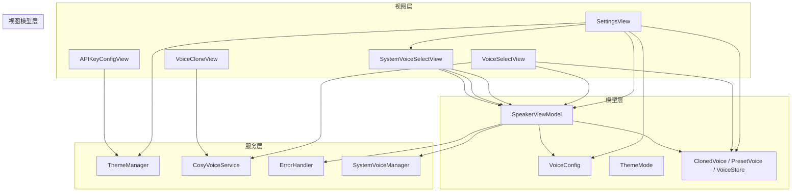
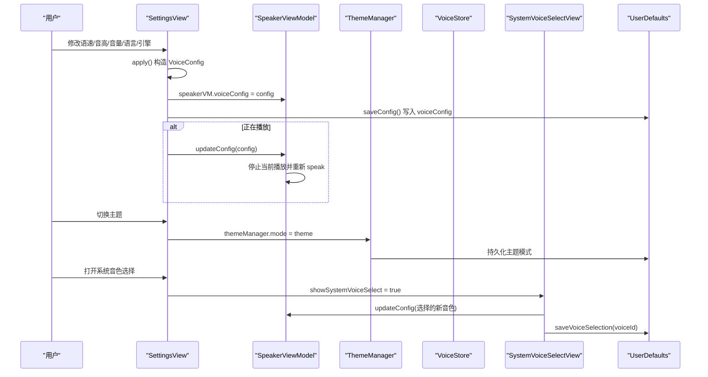
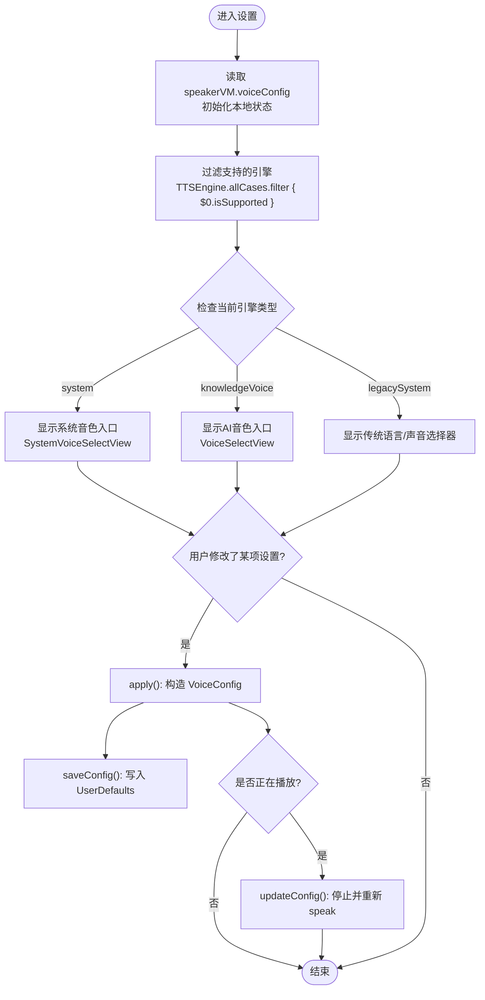
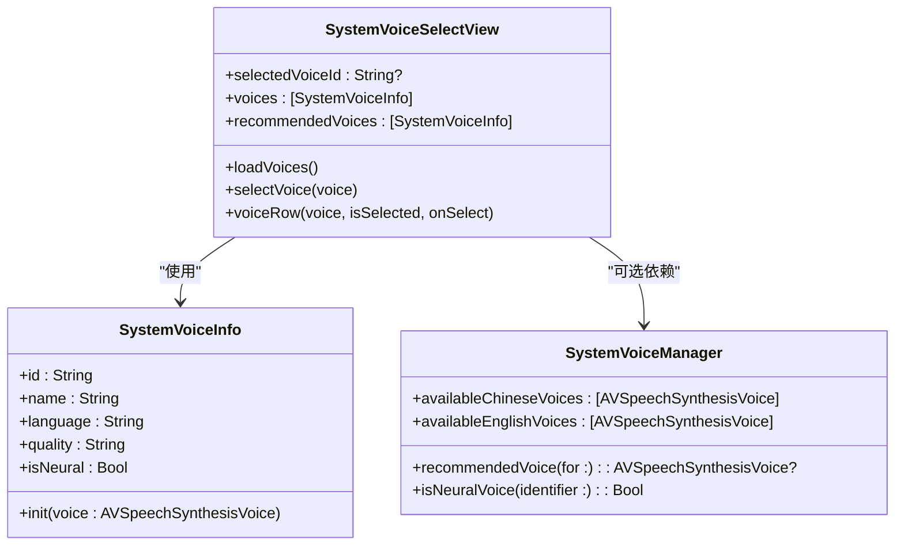
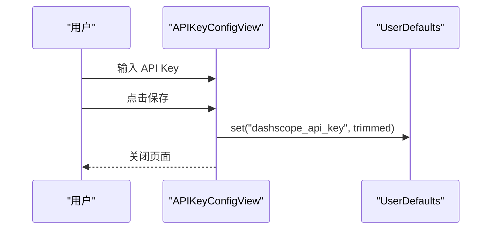
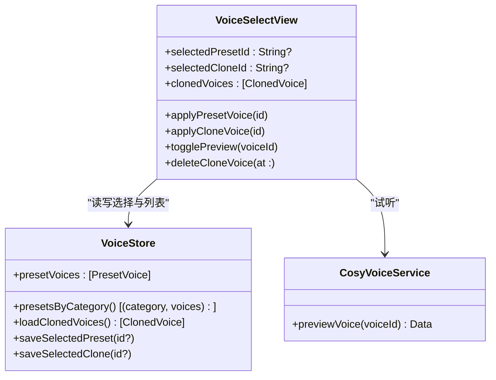
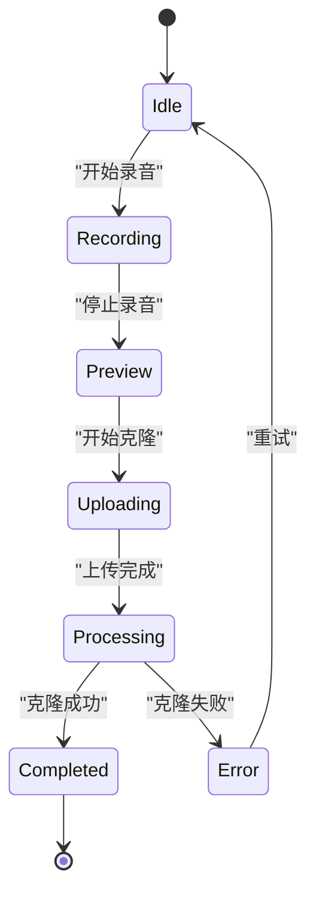
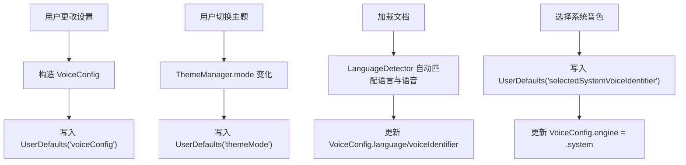
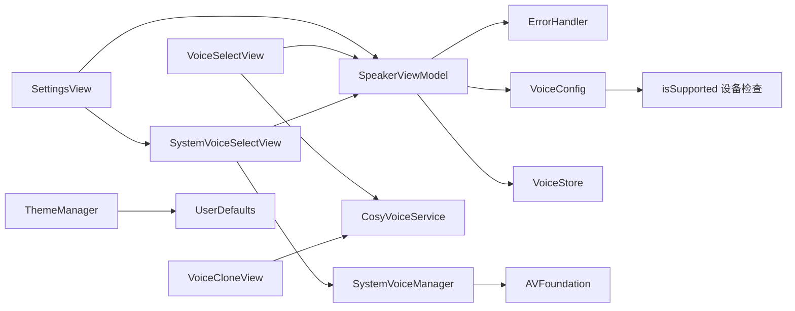

# 设置界面

<cite>
**本文引用的文件**
- [Views/SettingsView.swift](file://Views/SettingsView.swift)
- [Views/APIKeyConfigView.swift](file://Views/APIKeyConfigView.swift)
- [Views/VoiceSelectView.swift](file://Views/VoiceSelectView.swift)
- [Views/VoiceCloneView.swift](file://Views/VoiceCloneView.swift)
- [Views/SystemVoiceSelectView.swift](file://Views/SystemVoiceSelectView.swift)
- [Models/VoiceConfig.swift](file://Models/VoiceConfig.swift)
- [Models/ClonedVoice.swift](file://Models/ClonedVoice.swift)
- [Models/ThemeMode.swift](file://Models/ThemeMode.swift)
- [Services/ThemeManager.swift](file://Services/ThemeManager.swift)
- [Services/SystemVoiceManager.swift](file://Services/SystemVoiceManager.swift)
- [Services/SystemVoiceSelectView.swift](file://Services/SystemVoiceSelectView.swift)
- [ViewModels/SpeakerViewModel.swift](file://ViewModels/SpeakerViewModel.swift)
- [Services/CosyVoiceService.swift](file://Services/CosyVoiceService.swift)
- [Services/ErrorHandler.swift](file://Services/ErrorHandler.swift)
</cite>

## 更新摘要
**已进行的更改**
- 增强了多TTS引擎类型的动态适配能力，为Apple Neural TTS、Knowledge Voice和传统系统TTS提供了专门的语音选择界面
- 新增SystemVoiceSelectView用于iOS 17+的Neural TTS音色管理
- 实现了TTSEngine.isSupported设备兼容性检查机制
- 优化了不同引擎类型的用户界面和交互流程
- 添加了智能引擎推荐和设备能力检测

## 目录
1. [简介](#简介)
2. [项目结构](#项目结构)
3. [核心组件](#核心组件)
4. [架构总览](#架构总览)
5. [详细组件分析](#详细组件分析)
6. [依赖关系分析](#依赖关系分析)
7. [性能与体验优化](#性能与体验优化)
8. [故障排查指南](#故障排查指南)
9. [结论](#结论)
10. [附录：扩展开发指南](#附录扩展开发指南)

## 简介
本文件面向开发者与维护者，系统化梳理"设置"相关界面的整体布局、功能组织与数据流，覆盖以下要点：
- SettingsView 的多引擎动态适配与分组交互逻辑
- APIKeyConfigView 的密钥配置与安全存储机制
- VoiceSelectView 的AI音色选择与参数调节联动
- SystemVoiceSelectView 的Apple Neural TTS专业音色管理
- VoiceCloneView 的声音克隆流程与用户引导
- 主题切换、语言设置与其他配置的持久化策略
- 设置验证、默认值恢复与配置导入导出能力（含实现建议）
- 新增设置项与自定义配置界面的开发规范

## 项目结构
设置相关的代码主要分布在 Views、Models、Services 与 ViewModels 四个层次：
- Views：提供 UI 与用户交互（设置主界面、API Key 配置、音色选择、语音克隆、系统音色管理）
- Models：定义配置模型、主题枚举、预设与克隆音色数据结构
- Services：主题管理、CosyVoice 服务、系统语音管理、错误处理等
- ViewModels：统一编排播放引擎、配置加载与保存、状态同步

**图表来源**
- [Views/SettingsView.swift:1-237](file://Views/SettingsView.swift#L1-L237)
- [Views/APIKeyConfigView.swift:1-71](file://Views/APIKeyConfigView.swift#L1-L71)
- [Views/VoiceSelectView.swift:1-215](file://Views/VoiceSelectView.swift#L1-L215)
- [Views/VoiceCloneView.swift:1-404](file://Views/VoiceCloneView.swift#L1-L404)
- [Views/SystemVoiceSelectView.swift:1-177](file://Views/SystemVoiceSelectView.swift#L1-L177)
- [Models/VoiceConfig.swift:1-71](file://Models/VoiceConfig.swift#L1-L71)
- [Models/ClonedVoice.swift:1-118](file://Models/ClonedVoice.swift#L1-L118)
- [Models/ThemeMode.swift:1-25](file://Models/ThemeMode.swift#L1-L25)
- [Services/ThemeManager.swift:1-25](file://Services/ThemeManager.swift#L1-L25)
- [Services/SystemVoiceManager.swift:1-92](file://Services/SystemVoiceManager.swift#L1-L92)
- [Services/CosyVoiceService.swift:1-219](file://Services/CosyVoiceService.swift#L1-L219)
- [Services/ErrorHandler.swift:1-53](file://Services/ErrorHandler.swift#L1-L53)
- [ViewModels/SpeakerViewModel.swift:1-384](file://ViewModels/SpeakerViewModel.swift#L1-L384)

## 核心组件
- **SettingsView**：设置主入口，支持多TTS引擎动态适配，按引擎类型显示不同的语音选择界面；实时应用并持久化配置。
- **SystemVoiceSelectView**：专为iOS 17+ Apple Neural TTS设计的音色选择界面，提供推荐音色分类和专业音质标识。
- APIKeyConfigView：阿里云 DashScope API Key 输入与保存，用于 AI 总结、CosyVoice 合成与克隆。
- VoiceSelectView：展示"我的音色"和"预设音色"，支持试听、删除、选择并切换引擎。
- VoiceCloneView：录音→预览→上传→AI 学习→完成的全流程引导，包含权限校验、时长校验与错误提示。
- ThemeManager：主题模式单例，读写 UserDefaults，驱动全局主题切换。
- SpeakerViewModel：统一暴露 TTS 控制接口，负责引擎切换、配置加载/保存、播放状态同步与降级策略。
- CosyVoiceService：封装云端 TTS 与克隆接口，返回音频或 voice_id，集中错误类型。
- SystemVoiceManager：系统语音管理器，提供iOS 17+ Neural TTS音色查询和推荐算法。
- ErrorHandler：统一错误日志与弹窗提示。

## 架构总览
设置界面采用 MVVM + Service 分层，支持多引擎动态适配：
- 视图层通过 @ObservedObject/@State 绑定 ViewModel 与服务，响应式更新 UI
- 配置以 JSON 编码后写入 UserDefaults，保证跨会话持久化
- 引擎切换由 SpeakerViewModel 统一调度，必要时自动降级到系统 TTS
- 云端能力通过 CosyVoiceService 调用，错误集中抛出并由 ErrorHandler 呈现
- **新增** 设备能力检查通过 TTSEngine.isSupported 属性在渲染前过滤不支持的引擎选项

**图表来源**
- [Views/SettingsView.swift:171-184](file://Views/SettingsView.swift#L171-L184)
- [Views/SystemVoiceSelectView.swift:95-106](file://Views/SystemVoiceSelectView.swift#L95-L106)
- [ViewModels/SpeakerViewModel.swift:177-187](file://ViewModels/SpeakerViewModel.swift#L177-L187)
- [Services/ThemeManager.swift:10-23](file://Services/ThemeManager.swift#L10-L23)
- [Models/ClonedVoice.swift:72-90](file://Models/ClonedVoice.swift#L72-L90)

## 详细组件分析

### SettingsView：多引擎动态适配的设置主界面
- **更新** 分组与布局
  - 外观：遍历 ThemeMode 列表，点击即切换主题，右侧显示选中标记
  - **新增** 语音引擎：使用 `TTSEngine.allCases.filter { $0.isSupported }` 动态过滤支持的引擎；每个引擎显示名称和描述；Knowledge Voice 显示"即将推出"标签；Apple Neural TTS 标记为"推荐"选项
  - **新增** 智能语音选择：根据当前选择的引擎类型显示对应的语音选择界面
    - Apple Neural TTS：显示"系统音色"按钮，打开 SystemVoiceSelectView
    - Knowledge Voice：显示"AI 音色"按钮，打开 VoiceSelectView  
    - 传统系统 TTS：显示传统的语言和声音 Picker
  - 朗读设置：语速滑块+快捷档位、音高滑块、音量滑块；变更时即时 apply()
  - 关于：显示版本号
- **更新** 数据流
  - onAppear 从 speakerVM.voiceConfig 初始化本地 State
  - apply() 构建 VoiceConfig 并写入 UserDefaults，若处于播放中则调用 updateConfig 热更新
  - saveConfig() 将完整配置 JSON 编码保存
- **新增** 关键点
  - 使用 AVSpeechSynthesisVoice.speechVoices() 动态获取可用语音并按语言前缀过滤
  - 当引擎为 Knowledge Voice 时，VoiceConfig 会附带 selectedCloneId/presetVoiceId
  - **新增** 设备能力检查：通过 `TTSEngine.isSupported` 属性在 iOS < 17 时自动过滤 Apple Neural TTS
  - **新增** 条件渲染：根据 selectedEngine 的值动态显示相应的语音选择入口

**图表来源**
- [Views/SettingsView.swift:42-73](file://Views/SettingsView.swift#L42-L73)
- [Views/SettingsView.swift:114-165](file://Views/SettingsView.swift#L114-L165)
- [Views/SettingsView.swift:171-184](file://Views/SettingsView.swift#L171-L184)
- [Models/VoiceConfig.swift:26-40](file://Models/VoiceConfig.swift#L26-L40)

**章节来源**
- [Views/SettingsView.swift:1-237](file://Views/SettingsView.swift#L1-L237)
- [Models/VoiceConfig.swift:1-71](file://Models/VoiceConfig.swift#L1-L71)

### SystemVoiceSelectView：Apple Neural TTS专业音色管理
- **新增** 功能特性
  - 专为iOS 17+ Apple Neural TTS设计的音色选择界面
  - 智能分类：区分"推荐音色"和"全部音色"两个区域
  - 音质标识：显示"Neural"标签和音质等级（标准版/增强版/高级版）
  - 语言支持：优先展示中文和英文的Neural音色
  - 设备兼容：iOS < 17时显示友好的升级提示
- **新增** 核心逻辑
  - loadVoices()：获取所有可用系统语音并转换为 SystemVoiceInfo
  - recommendedVoices：筛选推荐的Neural音色（中文和英文优先）
  - selectVoice()：更新配置并保存到UserDefaults
  - voiceRow()：专业的UI展示，包含选择指示器和音质信息
- **新增** 用户体验
  - 大图标选择指示器，清晰的状态反馈
  - 选中音色的扬声器图标动画
  - 完整的导航栏和工具栏支持

**图表来源**
- [Views/SystemVoiceSelectView.swift:1-177](file://Views/SystemVoiceSelectView.swift#L1-L177)
- [Services/SystemVoiceManager.swift:62-91](file://Services/SystemVoiceManager.swift#L62-L91)

**章节来源**
- [Views/SystemVoiceSelectView.swift:1-177](file://Views/SystemVoiceSelectView.swift#L1-L177)
- [Services/SystemVoiceManager.swift:1-92](file://Services/SystemVoiceManager.swift#L1-L92)

### APIKeyConfigView：API Key 配置与安全存储
- 界面行为
  - 使用 SecureField 输入阿里云 DashScope API Key
  - 保存按钮在输入为空时禁用
  - 提供获取 Key 的步骤说明
- 安全与持久化
  - 保存至 UserDefaults 的 key 为 dashscope_api_key
  - 注意：当前未使用 iOS Keychain，属于明文存储；建议后续迁移到 Keychain 提升安全性

**图表来源**
- [Views/APIKeyConfigView.swift:10-66](file://Views/APIKeyConfigView.swift#L10-L66)

**章节来源**
- [Views/APIKeyConfigView.swift:1-71](file://Views/APIKeyConfigView.swift#L1-L71)

### VoiceSelectView：AI音色选择与试听
- 功能组织
  - "我的音色"：来自 VoiceStore.loadClonedVoices()，支持删除
  - "录制我的声音"：弹出 VoiceCloneView 进行克隆
  - "预设音色"：按分类展示内置预设，支持选择与试听
- 选择与切换
  - 选择预设：设置 engine=knowledgeVoice，保存 presetVoiceId，清空 clonedVoiceId
  - 选择克隆：设置 engine=knowledgeVoice，保存 clonedVoiceId，清空 presetVoiceId
  - 试听：调用 CosyVoiceService.previewVoice 下载临时音频并播放
- 与设置联动
  - SettingsView 在 Knowledge Voice 模式下，会从 VoiceStore 读取已选克隆/预设 ID 并回填

**图表来源**
- [Views/VoiceSelectView.swift:1-215](file://Views/VoiceSelectView.swift#L1-L215)
- [Models/ClonedVoice.swift:92-117](file://Models/ClonedVoice.swift#L92-L117)
- [Services/CosyVoiceService.swift:153-156](file://Services/CosyVoiceService.swift#L153-L156)

**章节来源**
- [Views/VoiceSelectView.swift:1-215](file://Views/VoiceSelectView.swift#L1-L215)
- [Models/ClonedVoice.swift:1-118](file://Models/ClonedVoice.swift#L1-L118)
- [Services/CosyVoiceService.swift:1-219](file://Services/CosyVoiceService.swift#L1-L219)

### VoiceCloneView：声音克隆流程与用户引导
- 流程状态机
  - idle → recording → preview → uploading → processing → completed/error
- 关键校验
  - 麦克风权限请求失败 → error
  - 录音时长不足 5 秒 → error
- 云端集成
  - 上传参考音频并触发 cloneVoice，成功后保存 ClonedVoice 到 VoiceStore，并设为当前选择
- 用户体验
  - 大图标状态反馈、进度条、重试/取消按钮、完成后可直接回到音色选择

**图表来源**
- [Views/VoiceCloneView.swift:16-24](file://Views/VoiceCloneView.swift#L16-L24)
- [Views/VoiceCloneView.swift:261-322](file://Views/VoiceCloneView.swift#L261-L322)
- [Services/CosyVoiceService.swift:97-144](file://Services/CosyVoiceService.swift#L97-L144)

**章节来源**
- [Views/VoiceCloneView.swift:1-404](file://Views/VoiceCloneView.swift#L1-L404)
- [Services/CosyVoiceService.swift:1-219](file://Services/CosyVoiceService.swift#L1-L219)

### 主题切换、语言设置与配置持久化
- 主题切换
  - ThemeManager 单例持有 mode，写入 UserDefaults；SettingsView 直接修改该属性
- 语言与声音
  - SettingsView 根据所选语言过滤系统语音；SpeakerViewModel 在加载文档时可自动检测语言并匹配最佳语音
  - **新增** SystemVoiceSelectView 提供智能的Neural音色选择和推荐算法
- 配置持久化
  - VoiceConfig 以 JSON 编码保存到 UserDefaults 的 voiceConfig key
  - 主题模式保存在 themeMode key
  - 克隆音色列表与选择保存在 clonedVoices、selectedPresetVoiceId、selectedCloneVoiceId
  - **新增** 系统音色选择保存在 selectedSystemVoiceIdentifier key

**图表来源**
- [Services/ThemeManager.swift:10-23](file://Services/ThemeManager.swift#L10-L23)
- [Views/SettingsView.swift:203-235](file://Views/SettingsView.swift#L203-L235)
- [Views/SystemVoiceSelectView.swift:108-110](file://Views/SystemVoiceSelectView.swift#L108-L110)
- [ViewModels/SpeakerViewModel.swift:97-113](file://ViewModels/SpeakerViewModel.swift#L97-L113)

**章节来源**
- [Services/ThemeManager.swift:1-25](file://Services/ThemeManager.swift#L1-25)
- [Views/SettingsView.swift:1-237](file://Views/SettingsView.swift#L1-L237)
- [Views/SystemVoiceSelectView.swift:1-177](file://Views/SystemVoiceSelectView.swift#L1-L177)
- [ViewModels/SpeakerViewModel.swift:1-384](file://ViewModels/SpeakerViewModel.swift#L1-L384)

## 依赖关系分析
- 视图对 ViewModel 的依赖
  - SettingsView 与 VoiceSelectView 均依赖 SpeakerViewModel 以同步 voiceConfig 与引擎切换
  - **新增** SystemVoiceSelectView 也依赖 SpeakerViewModel 进行配置更新
- 服务层解耦
  - CosyVoiceService 仅依赖网络与 UserDefaults 中的 API Key
  - ThemeManager 独立于业务逻辑，只负责主题持久化
  - **新增** SystemVoiceManager 提供系统语音管理能力，独立于其他服务
- **更新** 错误处理
  - CosyVoiceError 提供明确错误语义，SpeakerViewModel 在错误回调中执行降级策略（知识语音失败回退系统 TTS）
  - **新增** 设备兼容性检查：TTSEngine.isSupported 属性确保只在支持的设备上显示相应引擎选项

**图表来源**
- [Views/SettingsView.swift:1-237](file://Views/SettingsView.swift#L1-L237)
- [Views/SystemVoiceSelectView.swift:1-177](file://Views/SystemVoiceSelectView.swift#L1-L177)
- [Views/VoiceSelectView.swift:1-215](file://Views/VoiceSelectView.swift#L1-L215)
- [Views/VoiceCloneView.swift:1-404](file://Views/VoiceCloneView.swift#L1-L404)
- [ViewModels/SpeakerViewModel.swift:1-384](file://ViewModels/SpeakerViewModel.swift#L1-L384)
- [Services/SystemVoiceManager.swift:1-92](file://Services/SystemVoiceManager.swift#L1-L92)
- [Services/CosyVoiceService.swift:1-219](file://Services/CosyVoiceService.swift#L1-L219)
- [Services/ThemeManager.swift:1-25](file://Services/ThemeManager.swift#L1-L25)
- [Models/VoiceConfig.swift:26-40](file://Models/VoiceConfig.swift#L26-L40)

**章节来源**
- [ViewModels/SpeakerViewModel.swift:304-317](file://ViewModels/SpeakerViewModel.swift#L304-L317)
- [Services/CosyVoiceService.swift:191-218](file://Services/CosyVoiceService.swift#L191-L218)
- [Models/VoiceConfig.swift:26-40](file://Models/VoiceConfig.swift#L26-L40)
- [Services/SystemVoiceManager.swift:1-92](file://Services/SystemVoiceManager.swift#L1-L92)

## 性能与体验优化
- 避免频繁重绘
  - 语速/音高/音量滑动时使用 .onChange 触发最小必要更新，已在 SettingsView 中实现
- 网络与音频
  - 试听音频写入临时目录，播放完成后清理；长文本合成建议使用分段合成（CosyVoiceService.synthesizeSegments）
- **更新** 引擎切换
  - 仅在播放中才热更新引擎，减少不必要的中断
  - **新增** 设备能力检查在渲染前过滤不支持的引擎，避免运行时错误
  - **新增** 智能引擎推荐：Apple Neural TTS 作为推荐选项，提供更好的音质和离线支持
- 资源占用
  - 录音采样率 24kHz、单声道、16bit，兼顾质量与体积
- **新增** 用户体验优化
  - 多引擎动态适配：根据设备能力和用户偏好显示合适的引擎选项
  - 专业的音色管理界面：SystemVoiceSelectView 提供清晰的音质标识和分类
  - 友好的设备兼容性提示：iOS < 17 时显示明确的升级建议
  - 智能默认选择：自动选择最佳的Neural音色作为默认选项

## 故障排查指南
- API Key 无效或缺失
  - 现象：TTS/克隆报错"请先在设置中配置阿里云 API Key"或"API Key 无效"
  - 处理：检查 APIKeyConfigView 中保存的 dashscope_api_key；确认网络与配额
- 录音失败
  - 现象：需要麦克风权限或录音时长不足
  - 处理：授予麦克风权限；确保录音≥5秒
- **更新** 引擎异常降级
  - 现象：Knowledge Voice 出错后自动回退系统 TTS
  - 处理：查看错误日志；确认网络与 API Key；必要时手动切回系统 TTS
- **新增** 设备兼容性问题
  - 现象：iOS < 17 设备上无法选择 Apple Neural TTS 或看到升级提示
  - 处理：这是预期行为，系统会自动过滤不支持的引擎选项；建议升级到 iOS 17+
- **新增** 系统音色选择问题
  - 现象：SystemVoiceSelectView 显示空白或无法加载音色
  - 处理：检查 iOS 版本是否为 17+；确认网络连接正常；重启应用重试
- 配置丢失
  - 现象：重启后设置未生效
  - 处理：检查 UserDefaults 键值是否存在；确认 JSON 编解码是否成功

**章节来源**
- [Services/CosyVoiceService.swift:191-218](file://Services/CosyVoiceService.swift#L191-L218)
- [Views/VoiceCloneView.swift:261-281](file://Views/VoiceCloneView.swift#L261-L281)
- [ViewModels/SpeakerViewModel.swift:304-317](file://ViewModels/SpeakerViewModel.swift#L304-L317)
- [Services/ErrorHandler.swift:21-35](file://Services/ErrorHandler.swift#L21-L35)
- [Models/VoiceConfig.swift:26-40](file://Models/VoiceConfig.swift#L26-L40)
- [Views/SystemVoiceSelectView.swift:33-50](file://Views/SystemVoiceSelectView.swift#L33-L50)

## 结论
设置模块以清晰的分组与响应式数据流为核心，结合统一的配置持久化与错误处理，提供了良好的可扩展性与用户体验。**最新更新**显著增强了多TTS引擎的动态适配能力，通过引入SystemVoiceSelectView为Apple Neural TTS提供专业的音色管理界面，实现了针对不同引擎类型的专门化用户界面。新增的设备兼容性检查和智能引擎推荐机制，确保了应用在不同iOS版本上的稳定运行和最佳用户体验。通过模块化设计和明确的职责边界，新增设置项与自定义配置界面可以低成本接入现有体系。

## 附录：扩展开发指南

### 新增设置项
- 在 SettingsView 中添加新的 Section 与控件，并在 apply()/saveConfig() 中纳入 VoiceConfig 字段
- 如需新字段，请在 VoiceConfig 中声明并保证 Codable
- 在 onAppear 中从 speakerVM.voiceConfig 初始化本地状态
- 若涉及引擎切换，调用 speakerVM.switchEngine(to:) 或 updateConfig(config)
- **新增** 如需添加新引擎，请在 TTSEngine 中定义并实现 isSupported 属性，同时在 SettingsView 中添加相应的条件渲染逻辑

**章节来源**
- [Views/SettingsView.swift:42-73](file://Views/SettingsView.swift#L42-L73)
- [Views/SettingsView.swift:114-165](file://Views/SettingsView.swift#L114-L165)
- [Models/VoiceConfig.swift:43-70](file://Models/VoiceConfig.swift#L43-L70)
- [ViewModels/SpeakerViewModel.swift:177-187](file://ViewModels/SpeakerViewModel.swift#L177-L187)
- [Models/VoiceConfig.swift:26-40](file://Models/VoiceConfig.swift#L26-L40)

### 自定义配置界面
- 新建 SwiftUI View，使用 NavigationStack 与 Form 组织表单
- 敏感信息请使用 SecureField，并考虑迁移到 Keychain 存储
- 保存后立即 dismiss，并通过通知或共享状态源（如 UserDefaults 或单例）让其他界面感知变更
- **新增** 对于特定引擎的配置界面，参考 SystemVoiceSelectView 的设计模式，提供专业化的用户体验

**章节来源**
- [Views/APIKeyConfigView.swift:10-66](file://Views/APIKeyConfigView.swift#L10-L66)
- [Views/SystemVoiceSelectView.swift:1-177](file://Views/SystemVoiceSelectView.swift#L1-L177)

### 设置验证与默认值恢复
- 建议在保存前做基本校验（非空、范围限制），并在失败时通过 ErrorHandler 提示
- 提供"恢复默认"操作：将 VoiceConfig 重置为 defaultConfig 并重新持久化
- **新增** 针对多引擎场景，确保默认值考虑设备兼容性和最佳实践

**章节来源**
- [Models/VoiceConfig.swift:57-70](file://Models/VoiceConfig.swift#L57-L70)
- [Services/ErrorHandler.swift:21-35](file://Services/ErrorHandler.swift#L21-L35)

### 配置导入导出
- 导出：将 VoiceConfig 与相关配置（主题、API Key 等）序列化为 JSON 字符串，提供分享/复制能力
- 导入：解析 JSON 并合并到现有配置，冲突项可按策略覆盖或提示用户
- 注意：导出需脱敏或提醒用户谨慎分享敏感信息（API Key）
- **新增** 考虑导出引擎特定的配置信息，如系统音色ID、AI音色ID等

### **新增** 设备兼容性处理
- 在 TTSEngine 中实现 isSupported 属性，根据 iOS 版本和设备能力返回支持状态
- 在 UI 中使用 `.filter { $0.isSupported }` 过滤不支持的选项
- 为用户提供清晰的引擎描述，帮助理解各选项的差异和适用场景
- **新增** 参考 SystemVoiceSelectView 的实现，为不支持的功能提供友好的降级提示

**章节来源**
- [Models/VoiceConfig.swift:26-40](file://Models/VoiceConfig.swift#L26-L40)
- [Views/SettingsView.swift:42-73](file://Views/SettingsView.swift#L42-L73)
- [Views/SystemVoiceSelectView.swift:33-50](file://Views/SystemVoiceSelectView.swift#L33-L50)

### **新增** 多引擎架构扩展
- 设计原则：每个引擎类型应有独立的配置管理和UI界面
- 引擎注册：在 TTSEngine 中定义新引擎，实现必要的属性和方法
- 条件渲染：在 SettingsView 中根据引擎类型显示相应的配置界面
- 兼容性处理：确保新引擎在不同iOS版本上的正确行为和降级策略
- 测试覆盖：为新引擎添加完整的单元测试和集成测试

**章节来源**
- [Models/VoiceConfig.swift:5-40](file://Models/VoiceConfig.swift#L5-L40)
- [Views/SettingsView.swift:42-73](file://Views/SettingsView.swift#L42-L73)
- [Views/SystemVoiceSelectView.swift:1-177](file://Views/SystemVoiceSelectView.swift#L1-L177)