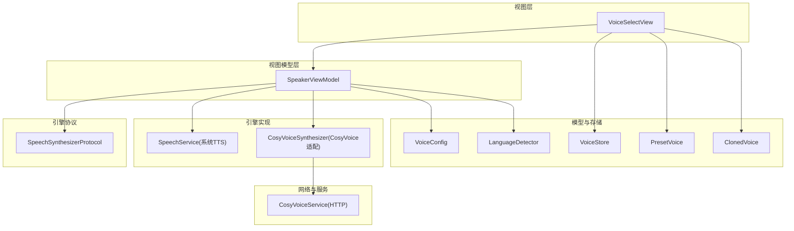
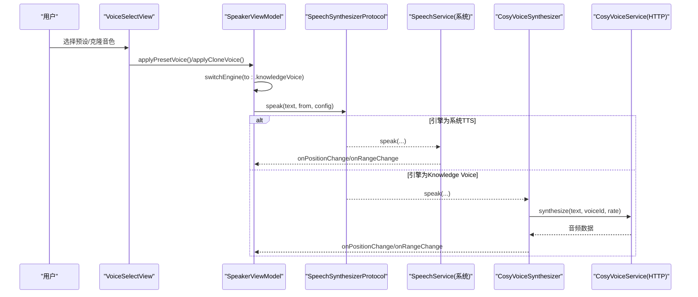
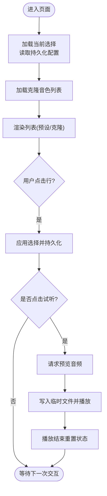
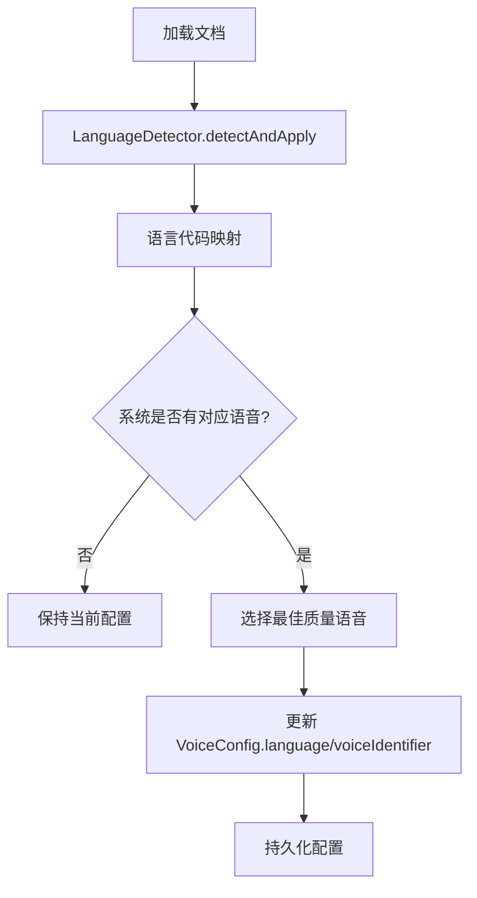
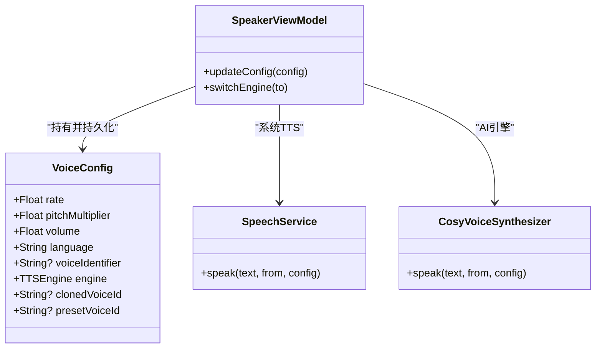
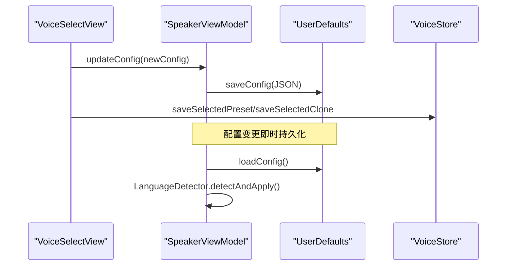
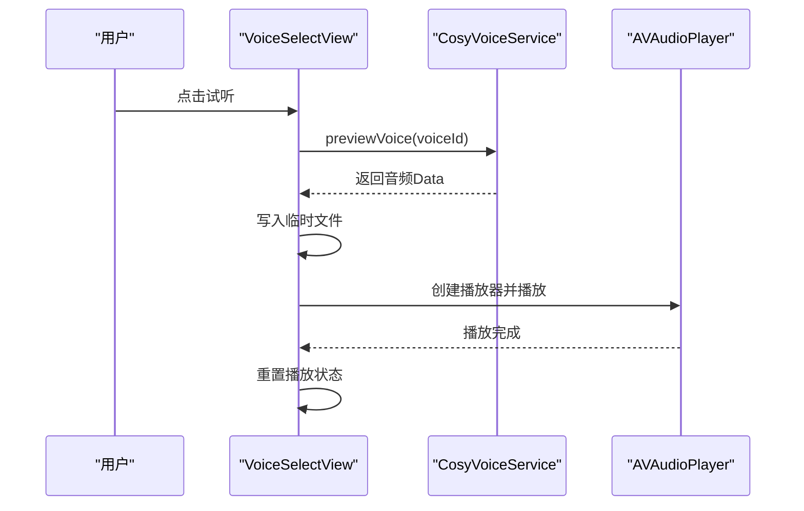
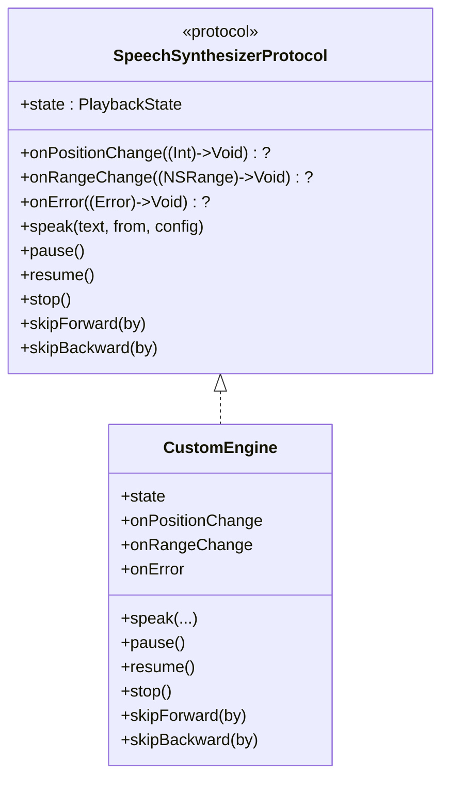
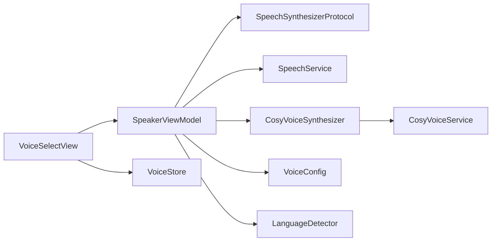

# 语音选择界面

<cite>
**本文引用的文件**   
- [VoiceSelectView.swift](file://Views/VoiceSelectView.swift)
- [ClonedVoice.swift](file://Models/ClonedVoice.swift)
- [VoiceConfig.swift](file://Models/VoiceConfig.swift)
- [SpeakerViewModel.swift](file://ViewModels/SpeakerViewModel.swift)
- [SpeechSynthesizerProtocol.swift](file://Services/SpeechSynthesizerProtocol.swift)
- [SpeechService.swift](file://Services/SpeechService.swift)
- [CosyVoiceService.swift](file://Services/CosyVoiceService.swift)
- [CosyVoiceSynthesizer.swift](file://Services/CosyVoiceSynthesizer.swift)
- [LanguageDetector.swift](file://Services/LanguageDetector.swift)
</cite>

## 目录
1. [简介](#简介)
2. [项目结构](#项目结构)
3. [核心组件](#核心组件)
4. [架构总览](#架构总览)
5. [详细组件分析](#详细组件分析)
6. [依赖关系分析](#依赖关系分析)
7. [性能考虑](#性能考虑)
8. [故障排查指南](#故障排查指南)
9. [结论](#结论)
10. [附录](#附录)

## 简介
本文件围绕“语音选择界面”展开，聚焦 VoiceSelectView 的展示与交互、系统 TTS 与 AI 引擎的动态加载与切换、语言筛选与预览机制、实时参数调节接口、配置持久化与同步、测试播放流程以及性能优化策略。同时提供自定义语音引擎扩展指南，帮助开发者在现有架构上平滑接入新的合成后端。

## 项目结构
与语音选择相关的代码主要分布在以下模块：
- Views：UI 层，包含音色选择页面 VoiceSelectView
- Models：数据模型与存储，包括 VoiceConfig、PresetVoice、ClonedVoice、VoiceStore
- ViewModels：业务编排与状态管理，SpeakerViewModel 作为门面协调引擎与 UI
- Services：引擎实现与网络服务，SpeechService（系统 TTS）、CosyVoiceService（阿里云 CosyVoice HTTP API）、CosyVoiceSynthesizer（引擎适配器）
- 辅助服务：LanguageDetector 自动检测文档语言并匹配语音

图表来源
- [VoiceSelectView.swift:1-215](file://Views/VoiceSelectView.swift#L1-L215)
- [SpeakerViewModel.swift:1-314](file://ViewModels/SpeakerViewModel.swift#L1-L314)
- [SpeechSynthesizerProtocol.swift:1-20](file://Services/SpeechSynthesizerProtocol.swift#L1-L20)
- [SpeechService.swift:1-155](file://Services/SpeechService.swift#L1-L155)
- [CosyVoiceSynthesizer.swift:1-258](file://Services/CosyVoiceSynthesizer.swift#L1-L258)
- [CosyVoiceService.swift:1-219](file://Services/CosyVoiceService.swift#L1-L219)
- [ClonedVoice.swift:1-118](file://Models/ClonedVoice.swift#L1-L118)
- [VoiceConfig.swift:1-52](file://Models/VoiceConfig.swift#L1-L52)
- [LanguageDetector.swift:1-82](file://Services/LanguageDetector.swift#L1-L82)

章节来源
- [VoiceSelectView.swift:1-215](file://Views/VoiceSelectView.swift#L1-L215)
- [SpeakerViewModel.swift:1-314](file://ViewModels/SpeakerViewModel.swift#L1-L314)
- [ClonedVoice.swift:1-118](file://Models/ClonedVoice.swift#L1-L118)
- [VoiceConfig.swift:1-52](file://Models/VoiceConfig.swift#L1-L52)
- [SpeechSynthesizerProtocol.swift:1-20](file://Services/SpeechSynthesizerProtocol.swift#L1-L20)
- [SpeechService.swift:1-155](file://Services/SpeechService.swift#L1-L155)
- [CosyVoiceSynthesizer.swift:1-258](file://Services/CosyVoiceSynthesizer.swift#L1-L258)
- [CosyVoiceService.swift:1-219](file://Services/CosyVoiceService.swift#L1-L219)
- [LanguageDetector.swift:1-82](file://Services/LanguageDetector.swift#L1-L82)

## 核心组件
- VoiceSelectView：负责展示预设音色与克隆音色列表、用户选择交互、试听播放、删除克隆音色等。
- SpeakerViewModel：统一编排播放控制、引擎切换、配置加载与保存、错误降级、远程控制同步。
- SpeechSynthesizerProtocol：定义引擎抽象接口，屏蔽系统 TTS 与 AI 引擎差异。
- SpeechService：基于 AVSpeechSynthesizer 的系统 TTS 实现。
- CosyVoiceSynthesizer：将 CosyVoiceService 封装为引擎协议，支持分段合成与流式播放。
- CosyVoiceService：HTTP 客户端，调用阿里云 DashScope CosyVoice 接口进行合成与克隆。
- LanguageDetector：根据文本主导语言自动匹配系统语音或保持当前配置。
- VoiceConfig/PresetVoice/ClonedVoice/VoiceStore：语音配置、预设与克隆数据模型及本地持久化。

章节来源
- [VoiceSelectView.swift:1-215](file://Views/VoiceSelectView.swift#L1-L215)
- [SpeakerViewModel.swift:1-314](file://ViewModels/SpeakerViewModel.swift#L1-L314)
- [SpeechSynthesizerProtocol.swift:1-20](file://Services/SpeechSynthesizerProtocol.swift#L1-L20)
- [SpeechService.swift:1-155](file://Services/SpeechService.swift#L1-L155)
- [CosyVoiceSynthesizer.swift:1-258](file://Services/CosyVoiceSynthesizer.swift#L1-L258)
- [CosyVoiceService.swift:1-219](file://Services/CosyVoiceService.swift#L1-L219)
- [LanguageDetector.swift:1-82](file://Services/LanguageDetector.swift#L1-L82)
- [ClonedVoice.swift:1-118](file://Models/ClonedVoice.swift#L1-L118)
- [VoiceConfig.swift:1-52](file://Models/VoiceConfig.swift#L1-L52)

## 架构总览
VoiceSelectView 通过 SpeakerViewModel 驱动引擎；当选择 Knowledge Voice 时，使用 CosyVoiceSynthesizer 调用 CosyVoiceService 完成云端合成；当选择系统 TTS 时，使用 SpeechService 直接合成。语言检测在加载文档时触发，自动调整语言与系统语音标识。

图表来源
- [VoiceSelectView.swift:143-163](file://Views/VoiceSelectView.swift#L143-L163)
- [SpeakerViewModel.swift:57-77](file://ViewModels/SpeakerViewModel.swift#L57-L77)
- [SpeechSynthesizerProtocol.swift:5-19](file://Services/SpeechSynthesizerProtocol.swift#L5-L19)
- [SpeechService.swift:30-72](file://Services/SpeechService.swift#L30-L72)
- [CosyVoiceSynthesizer.swift:28-51](file://Services/CosyVoiceSynthesizer.swift#L28-L51)
- [CosyVoiceService.swift:27-88](file://Services/CosyVoiceService.swift#L27-L88)

## 详细组件分析

### VoiceSelectView：语音列表展示与交互
- 列表组织
  - “我的音色”：展示已克隆的音色，支持删除操作。
  - “录制我的声音”：打开 VoiceCloneView 进行录音与克隆。
  - 预设音色：按分类分组展示，点击即选中并应用。
- 选择逻辑
  - 选择预设音色：设置 engine=knowledgeVoice、presetVoiceId、清空 clonedVoiceId，并持久化选择。
  - 选择克隆音色：设置 engine=knowledgeVoice、clonedVoiceId、清空 presetVoiceId，并持久化选择。
- 试听功能
  - 点击试听按钮后，调用 CosyVoiceService.previewVoice 获取音频片段，写入临时文件并通过 AVAudioPlayer 播放。
  - 播放期间更新图标状态，播放结束后重置状态。
- 初始化与恢复
  - onAppear 中加载当前选择与克隆列表，确保 UI 与持久化一致。

图表来源
- [VoiceSelectView.swift:71-79](file://Views/VoiceSelectView.swift#L71-L79)
- [VoiceSelectView.swift:131-141](file://Views/VoiceSelectView.swift#L131-L141)
- [VoiceSelectView.swift:143-163](file://Views/VoiceSelectView.swift#L143-L163)
- [VoiceSelectView.swift:165-203](file://Views/VoiceSelectView.swift#L165-L203)

章节来源
- [VoiceSelectView.swift:1-215](file://Views/VoiceSelectView.swift#L1-L215)

### 动态加载与过滤机制：语言筛选与语音预览
- 语言筛选
  - 加载文档时，LanguageDetector 对前 500 字符进行主导语言检测，映射到目标语言代码，并在系统可用语音中选择最佳质量语音（优先 enhanced，其次 premium）。
  - 若目标语言不可用或与当前配置匹配，则保持原配置。
- 语音预览
  - 通过 CosyVoiceService.previewVoice 返回一段示例音频，用于快速试听不同预设或克隆音色的效果。
  - 预览音频以 MP3 形式写入临时目录，由 AVAudioPlayer 播放。

图表来源
- [LanguageDetector.swift:32-76](file://Services/LanguageDetector.swift#L32-L76)
- [SpeakerViewModel.swift:81-96](file://ViewModels/SpeakerViewModel.swift#L81-L96)
- [VoiceConfig.swift:24-38](file://Models/VoiceConfig.swift#L24-L38)

章节来源
- [LanguageDetector.swift:1-82](file://Services/LanguageDetector.swift#L1-L82)
- [SpeakerViewModel.swift:81-96](file://ViewModels/SpeakerViewModel.swift#L81-L96)
- [VoiceConfig.swift:24-38](file://Models/VoiceConfig.swift#L24-L38)

### 实时参数调节接口：语速、音高、音量即时反馈
- 参数定义
  - VoiceConfig.rate：语速范围 0.1~2.0，默认 0.5。
  - VoiceConfig.pitchMultiplier：音高倍数，默认 1.0。
  - VoiceConfig.volume：音量，默认 1.0。
- 实时生效
  - 当正在播放时，更新配置会立即停止当前合成，并以新参数从当前位置继续播放，保证即时反馈。
- 系统 TTS 与 AI 引擎的差异
  - 系统 TTS：通过 AVSpeechUtterance 的 rate/pitchMultiplier/volume 直接生效。
  - Knowledge Voice：仅 rate 传入服务端合成；pitch/volume 由播放器控制或后续扩展。

图表来源
- [VoiceConfig.swift:24-38](file://Models/VoiceConfig.swift#L24-L38)
- [SpeakerViewModel.swift:160-170](file://ViewModels/SpeakerViewModel.swift#L160-L170)
- [SpeechService.swift:30-72](file://Services/SpeechService.swift#L30-L72)
- [CosyVoiceSynthesizer.swift:28-51](file://Services/CosyVoiceSynthesizer.swift#L28-L51)

章节来源
- [VoiceConfig.swift:24-38](file://Models/VoiceConfig.swift#L24-L38)
- [SpeakerViewModel.swift:160-170](file://ViewModels/SpeakerViewModel.swift#L160-L170)
- [SpeechService.swift:30-72](file://Services/SpeechService.swift#L30-L72)
- [CosyVoiceSynthesizer.swift:28-51](file://Services/CosyVoiceSynthesizer.swift#L28-L51)

### 配置持久化与同步机制
- 配置存储
  - SpeakerViewModel 使用 UserDefaults 以 JSON 编码方式持久化 VoiceConfig。
  - VoiceStore 管理克隆音色列表与选中的预设/克隆 ID。
- 同步策略
  - 选择音色后，VoiceSelectView 调用 SpeakerViewModel 更新配置并持久化。
  - 加载文档时，SpeakerViewModel 读取持久化配置并结合 LanguageDetector 自动匹配语言与系统语音。
  - 引擎切换时，若正在播放，会以新引擎从当前位置继续播放，保证体验连贯。

图表来源
- [SpeakerViewModel.swift:302-313](file://ViewModels/SpeakerViewModel.swift#L302-L313)
- [ClonedVoice.swift:58-90](file://Models/ClonedVoice.swift#L58-L90)
- [VoiceSelectView.swift:143-163](file://Views/VoiceSelectView.swift#L143-L163)
- [SpeakerViewModel.swift:81-96](file://ViewModels/SpeakerViewModel.swift#L81-L96)

章节来源
- [SpeakerViewModel.swift:302-313](file://ViewModels/SpeakerViewModel.swift#L302-L313)
- [ClonedVoice.swift:58-90](file://Models/ClonedVoice.swift#L58-L90)
- [VoiceSelectView.swift:143-163](file://Views/VoiceSelectView.swift#L143-L163)
- [SpeakerViewModel.swift:81-96](file://ViewModels/SpeakerViewModel.swift#L81-L96)

### 语音测试播放功能
- 预览入口
  - VoiceSelectView 的每行右侧有试听按钮，点击后调用 CosyVoiceService.previewVoice。
- 播放流程
  - 获取音频数据后写入临时文件，创建 AVAudioPlayer 并播放。
  - 播放完成后重置播放状态，避免 UI 卡住。
- 错误处理
  - 捕获异常并将播放状态重置为未播放，防止 UI 不一致。

图表来源
- [VoiceSelectView.swift:165-203](file://Views/VoiceSelectView.swift#L165-L203)
- [CosyVoiceService.swift:153-155](file://Services/CosyVoiceService.swift#L153-L155)

章节来源
- [VoiceSelectView.swift:165-203](file://Views/VoiceSelectView.swift#L165-L203)
- [CosyVoiceService.swift:153-155](file://Services/CosyVoiceService.swift#L153-L155)

### 自定义语音引擎接口的扩展指南
- 协议约束
  - 实现 SpeechSynthesizerProtocol，暴露 state、onPositionChange、onRangeChange、onError 回调，以及 speak/pause/resume/stop/skipForward/skipBackward 方法。
- 集成步骤
  - 在 SpeakerViewModel 中新增引擎实例，并在 switchEngine 中注入。
  - 在 onError 回调中实现降级策略（如从 AI 引擎回退到系统 TTS）。
- 注意事项
  - 位置与范围回调需准确反映全文绝对位置，以便 UI 高亮与进度条同步。
  - 长文本应分段合成与播放，避免单次请求过大导致超时或内存压力。

图表来源
- [SpeechSynthesizerProtocol.swift:5-19](file://Services/SpeechSynthesizerProtocol.swift#L5-L19)
- [SpeakerViewModel.swift:57-77](file://ViewModels/SpeakerViewModel.swift#L57-L77)

章节来源
- [SpeechSynthesizerProtocol.swift:5-19](file://Services/SpeechSynthesizerProtocol.swift#L5-L19)
- [SpeakerViewModel.swift:57-77](file://ViewModels/SpeakerViewModel.swift#L57-L77)

## 依赖关系分析
- 耦合与内聚
  - VoiceSelectView 与 SpeakerViewModel 松耦合，通过 ViewModel 暴露的状态与方法驱动 UI。
  - SpeakerViewModel 通过 SpeechSynthesizerProtocol 解耦具体引擎实现，提升可测试性与可扩展性。
- 外部依赖
  - CosyVoiceService 依赖 URLSession 与阿里云 DashScope API。
  - SpeechService 依赖 AVSpeechSynthesizer 与 AVFoundation。
- 潜在循环依赖
  - 当前无循环依赖；各层职责清晰，单向依赖。

图表来源
- [VoiceSelectView.swift:1-215](file://Views/VoiceSelectView.swift#L1-L215)
- [SpeakerViewModel.swift:1-314](file://ViewModels/SpeakerViewModel.swift#L1-L314)
- [SpeechSynthesizerProtocol.swift:1-20](file://Services/SpeechSynthesizerProtocol.swift#L1-L20)
- [SpeechService.swift:1-155](file://Services/SpeechService.swift#L1-L155)
- [CosyVoiceSynthesizer.swift:1-258](file://Services/CosyVoiceSynthesizer.swift#L1-L258)
- [CosyVoiceService.swift:1-219](file://Services/CosyVoiceService.swift#L1-L219)
- [ClonedVoice.swift:1-118](file://Models/ClonedVoice.swift#L1-L118)
- [VoiceConfig.swift:1-52](file://Models/VoiceConfig.swift#L1-L52)
- [LanguageDetector.swift:1-82](file://Services/LanguageDetector.swift#L1-L82)

章节来源
- [VoiceSelectView.swift:1-215](file://Views/VoiceSelectView.swift#L1-L215)
- [SpeakerViewModel.swift:1-314](file://ViewModels/SpeakerViewModel.swift#L1-L314)
- [SpeechSynthesizerProtocol.swift:1-20](file://Services/SpeechSynthesizerProtocol.swift#L1-L20)
- [SpeechService.swift:1-155](file://Services/SpeechService.swift#L1-L155)
- [CosyVoiceSynthesizer.swift:1-258](file://Services/CosyVoiceSynthesizer.swift#L1-L258)
- [CosyVoiceService.swift:1-219](file://Services/CosyVoiceService.swift#L1-L219)
- [ClonedVoice.swift:1-118](file://Models/ClonedVoice.swift#L1-L118)
- [VoiceConfig.swift:1-52](file://Models/VoiceConfig.swift#L1-L52)
- [LanguageDetector.swift:1-82](file://Services/LanguageDetector.swift#L1-L82)

## 性能考虑
- 分段合成与播放
  - CosyVoiceSynthesizer 将长文本切分为不超过 500 字符的段落，逐段合成并拼接播放，降低单次请求负载与内存占用。
- 自然断点优化
  - 分段算法尝试在句号、换行、逗号、空格等自然断点处截断，提升朗读流畅度。
- 网络节流
  - 多段合成间加入短延迟，避免请求过快导致服务端限流。
- 资源清理
  - 预览与合成音频均写入临时目录，播放结束后及时释放播放器与任务，避免泄漏。
- 估算位置
  - 对于非系统 TTS 引擎，采用每秒约 3 个字符的粗略估算来更新位置，减少频繁计算开销。

[本节为通用性能建议，不直接分析具体文件]

## 故障排查指南
- 常见错误类型
  - 缺少或无效 API Key：检查设置中是否正确配置阿里云密钥。
  - 服务器响应异常：确认网络连通性与服务端状态。
  - 未获取到音频数据：检查服务端返回格式与解析逻辑。
- 降级策略
  - 当 AI 引擎报错时，SpeakerViewModel 自动降级到系统 TTS，保障用户体验。
- 调试建议
  - 监听 onError 回调，记录错误信息。
  - 检查临时文件路径与权限，确保 AVAudioPlayer 能正常读取。
  - 验证分段长度与自然断点选择是否符合预期。

章节来源
- [CosyVoiceService.swift:191-218](file://Services/CosyVoiceService.swift#L191-L218)
- [SpeakerViewModel.swift:234-247](file://ViewModels/SpeakerViewModel.swift#L234-L247)

## 结论
VoiceSelectView 提供了直观的音色选择与试听能力，结合 SpeakerViewModel 的统一编排与 SpeechSynthesizerProtocol 的抽象设计，实现了系统 TTS 与 AI 引擎的无缝切换。语言自动检测与配置持久化确保了跨设备与跨会话的一致性。通过分段合成、网络节流与资源清理等策略，系统在性能与稳定性方面具备良好表现。未来可通过扩展自定义引擎进一步提升生态兼容性。

[本节为总结性内容，不直接分析具体文件]

## 附录
- 预设音色分类
  - 男声、女声、中性、播客风格、故事讲述等类别，便于用户快速定位。
- 克隆音色管理
  - 支持上传参考音频进行克隆，结果持久化并可随时选择与删除。
- 实时参数调节
  - 语速、音高、音量可在播放过程中即时生效，提升个性化体验。

[本节为概念性补充，不直接分析具体文件]