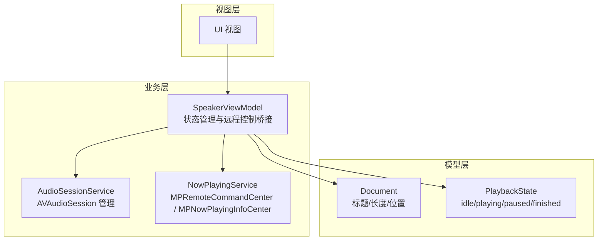
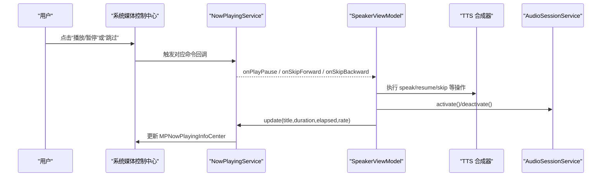
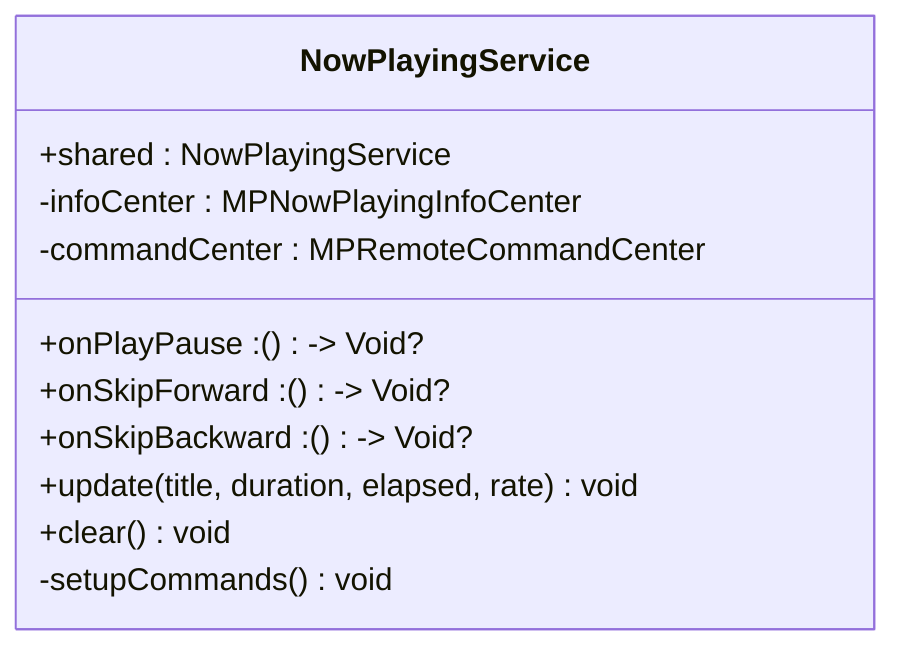
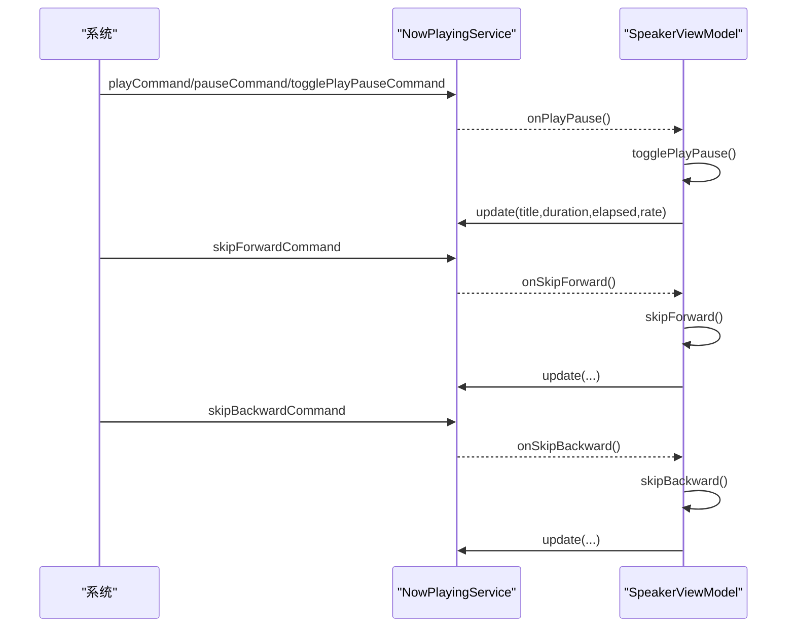
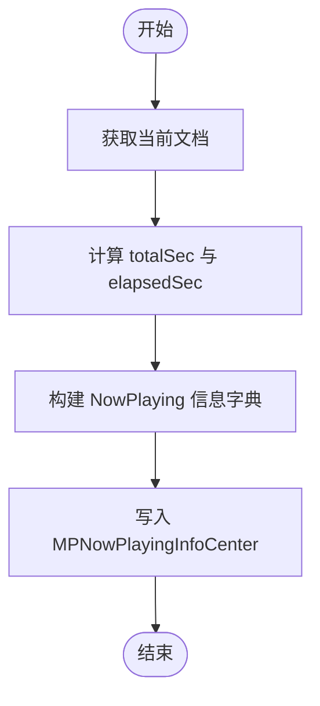
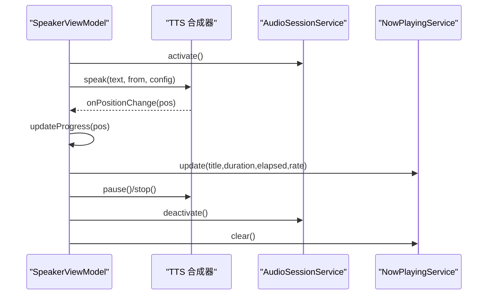
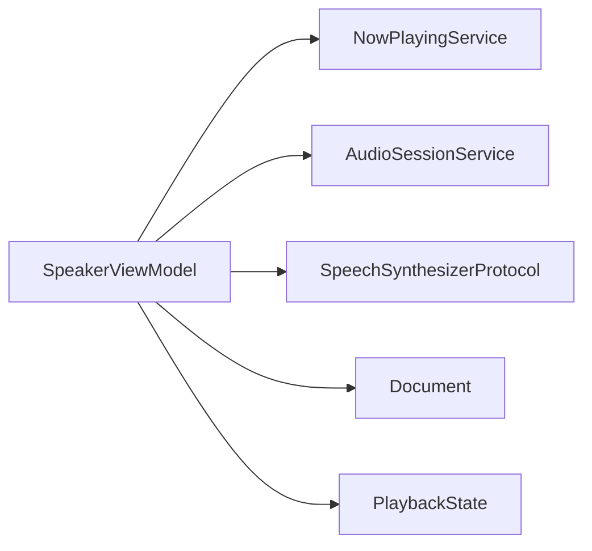

# Now Playing 集成

<cite>
**本文引用的文件**
- [NowPlayingService.swift](file://Services/NowPlayingService.swift)
- [SpeakerViewModel.swift](file://ViewModels/SpeakerViewModel.swift)
- [AudioSessionService.swift](file://Services/AudioSessionService.swift)
- [PlaybackState.swift](file://Models/PlaybackState.swift)
- [Document.swift](file://Models/Document.swift)
</cite>

## 目录
1. [简介](#简介)
2. [项目结构](#项目结构)
3. [核心组件](#核心组件)
4. [架构总览](#架构总览)
5. [详细组件分析](#详细组件分析)
6. [依赖关系分析](#依赖关系分析)
7. [性能与体验优化](#性能与体验优化)
8. [故障排查指南](#故障排查指南)
9. [结论](#结论)
10. [附录：媒体元数据规范与最佳实践](#附录媒体元数据规范与最佳实践)

## 简介
本文件面向 Knowledge 应用的 Now Playing 服务集成，系统性说明以下要点：
- NowPlayingService 的实现机制，包括 MPRemoteCommandCenter 的配置与媒体控制事件监听
- 锁屏界面显示信息的更新策略（标题、艺术家、播放进度等）
- 系统媒体控制中心的集成（播放/暂停、上一首/下一首、跳转等按钮处理）
- 媒体元数据的格式规范与最佳实践
- 与音频播放器的协调机制、状态同步与用户体验优化细节

## 项目结构
围绕 Now Playing 集成的关键代码分布在 Services、ViewModels、Models 三个层次：
- Services/NowPlayingService.swift：封装系统媒体中心交互（MPNowPlayingInfoCenter、MPRemoteCommandCenter），提供远程控制回调桥接
- ViewModels/SpeakerViewModel.swift：作为主控制器，负责将播放器状态与 Now Playing 信息同步，并响应远程控制
- Services/AudioSessionService.swift：统一 AVAudioSession 配置与生命周期管理
- Models/PlaybackState.swift：定义播放状态枚举
- Models/Document.swift：文档模型，包含标题、文本长度、当前位置等，用于计算 Now Playing 元数据

图表来源
- [SpeakerViewModel.swift:1-314](file://ViewModels/SpeakerViewModel.swift#L1-L314)
- [NowPlayingService.swift:1-57](file://Services/NowPlayingService.swift#L1-L57)
- [AudioSessionService.swift:1-46](file://Services/AudioSessionService.swift#L1-L46)
- [PlaybackState.swift:1-9](file://Models/PlaybackState.swift#L1-L9)
- [Document.swift:1-115](file://Models/Document.swift#L1-L115)

章节来源
- [SpeakerViewModel.swift:1-314](file://ViewModels/SpeakerViewModel.swift#L1-L314)
- [NowPlayingService.swift:1-57](file://Services/NowPlayingService.swift#L1-L57)
- [AudioSessionService.swift:1-46](file://Services/AudioSessionService.swift#L1-L46)
- [PlaybackState.swift:1-9](file://Models/PlaybackState.swift#L1-L9)
- [Document.swift:1-115](file://Models/Document.swift#L1-L115)

## 核心组件
- NowPlayingService
  - 单例，持有 MPNowPlayingInfoCenter 与 MPRemoteCommandCenter
  - 提供 update(title, duration, elapsed, rate) 与 clear() 接口
  - 在初始化时通过 setupCommands() 注册播放/暂停、跳过前进/后退命令，并将回调暴露为 onPlayPause、onSkipForward、onSkipBackward
- SpeakerViewModel
  - 作为门面，订阅合成器位置变化与引擎错误，驱动 UI 与 Now Playing 同步
  - 将远程控制回调映射到 togglePlayPause、skipForward、skipBackward 等方法
  - 调用 AudioSessionService.activate/deactivate 管理音频会话
- AudioSessionService
  - 统一配置 AVAudioSession 为 playback + spokenAudio，支持蓝牙与 AirPlay
  - 提供 activate/deactivate 方法，确保后台播放能力
- PlaybackState
  - 定义 idle、playing、paused、finished 四种状态，供 ViewModel 与 UI 同步
- Document
  - 提供 title、totalLength、currentPosition 等字段，用于计算 Now Playing 元数据

章节来源
- [NowPlayingService.swift:1-57](file://Services/NowPlayingService.swift#L1-L57)
- [SpeakerViewModel.swift:1-314](file://ViewModels/SpeakerViewModel.swift#L1-L314)
- [AudioSessionService.swift:1-46](file://Services/AudioSessionService.swift#L1-L46)
- [PlaybackState.swift:1-9](file://Models/PlaybackState.swift#L1-L9)
- [Document.swift:1-115](file://Models/Document.swift#L1-L115)

## 架构总览
Now Playing 集成采用“服务层隔离 + ViewModel 编排”的模式：
- 服务层（NowPlayingService）仅负责与系统媒体中心通信，不感知业务逻辑
- ViewModel 负责状态机、播放器协调、远程命令分发与 UI 同步
- AudioSessionService 保证音频会话正确配置与激活，使远程控制可用

图表来源
- [NowPlayingService.swift:33-55](file://Services/NowPlayingService.swift#L33-L55)
- [SpeakerViewModel.swift:262-294](file://ViewModels/SpeakerViewModel.swift#L262-L294)
- [AudioSessionService.swift:15-44](file://Services/AudioSessionService.swift#L15-L44)

## 详细组件分析

### NowPlayingService 实现机制
- 初始化阶段
  - 构造时调用 setupCommands()，向 MPRemoteCommandCenter 注册命令处理器
  - 禁用当前应用不需要的命令（如 nextTrack、previousTrack、changePlaybackPosition），避免误触
- 远程控制事件
  - playCommand、pauseCommand、togglePlayPauseCommand 均映射到 onPlayPause
  - skipForwardCommand.preferredIntervals = [30]；skipBackwardCommand.preferredIntervals = [15]
  - 所有命令返回 .success，表示处理成功
- 锁屏信息显示
  - update(...) 设置标题、艺术家、总时长、已播放时间、播放速率、媒体类型
  - clear() 清空 nowPlayingInfo，停止播放后清理显示

图表来源
- [NowPlayingService.swift:4-56](file://Services/NowPlayingService.swift#L4-L56)

章节来源
- [NowPlayingService.swift:1-57](file://Services/NowPlayingService.swift#L1-L57)

### 远程控制事件处理流程
- 当用户在锁屏或控制中心触发控制时，系统调用 MPRemoteCommandCenter 注册的回调
- NowPlayingService 将回调转发给 SpeakerViewModel 的闭包属性
- SpeakerViewModel 根据当前状态执行相应操作（播放/暂停/跳过），并更新 Now Playing 信息

图表来源
- [NowPlayingService.swift:33-55](file://Services/NowPlayingService.swift#L33-L55)
- [SpeakerViewModel.swift:262-294](file://ViewModels/SpeakerViewModel.swift#L262-L294)

章节来源
- [NowPlayingService.swift:33-55](file://Services/NowPlayingService.swift#L33-L55)
- [SpeakerViewModel.swift:262-294](file://ViewModels/SpeakerViewModel.swift#L262-L294)

### 锁屏界面显示信息更新
- 标题与艺术家
  - 标题来自 Document.title
  - 艺术家固定为“有声阅读器”
- 播放进度
  - 总时长与已播放时间由 Document.totalLength 与 currentPosition 换算为秒
  - 播放速率根据当前状态设置为 1.0 或 0.0
- 媒体类型
  - 设置为音频类型，确保系统按音频内容渲染

图表来源
- [SpeakerViewModel.swift:284-294](file://ViewModels/SpeakerViewModel.swift#L284-L294)
- [NowPlayingService.swift:18-27](file://Services/NowPlayingService.swift#L18-L27)
- [Document.swift:78-87](file://Models/Document.swift#L78-L87)

章节来源
- [SpeakerViewModel.swift:284-294](file://ViewModels/SpeakerViewModel.swift#L284-L294)
- [NowPlayingService.swift:18-27](file://Services/NowPlayingService.swift#L18-L27)
- [Document.swift:78-87](file://Models/Document.swift#L78-L87)

### 与音频播放器的协调机制与状态同步
- 播放启动
  - 切换引擎后若处于播放中，会先 stop 再重新 speak，确保新引擎生效
  - 播放前调用 AudioSessionService.activate()，确保后台播放与远程控制可用
- 位置与范围同步
  - 订阅合成器的 onPositionChange 与 onRangeChange，驱动 UI 高亮与 Now Playing 进度更新
- 状态轮询
  - 使用 Timer 高频轮询合成器 state，差异变更时更新 ViewModel.state，并在 finished/idle 时保存位置
- 停止与清理
  - stop() 中调用 synthesizer.stop()、audioSession.deactivate()、nowPlaying.clear()，确保资源释放与显示清理

图表来源
- [SpeakerViewModel.swift:108-137](file://ViewModels/SpeakerViewModel.swift#L108-L137)
- [SpeakerViewModel.swift:215-266](file://ViewModels/SpeakerViewModel.swift#L215-L266)
- [AudioSessionService.swift:15-44](file://Services/AudioSessionService.swift#L15-L44)
- [NowPlayingService.swift:18-31](file://Services/NowPlayingService.swift#L18-L31)

章节来源
- [SpeakerViewModel.swift:108-137](file://ViewModels/SpeakerViewModel.swift#L108-L137)
- [SpeakerViewModel.swift:215-266](file://ViewModels/SpeakerViewModel.swift#L215-L266)
- [AudioSessionService.swift:15-44](file://Services/AudioSessionService.swift#L15-L44)
- [NowPlayingService.swift:18-31](file://Services/NowPlayingService.swift#L18-L31)

### 系统媒体控制中心集成与按钮处理
- 已启用
  - 播放/暂停/切换：playCommand、pauseCommand、togglePlayPauseCommand
  - 跳过前进/后退：skipForwardCommand（30 秒）、skipBackwardCommand（15 秒）
- 已禁用
  - 上一首/下一首：nextTrackCommand、previousTrackCommand
  - 跳转至指定位置：changePlaybackPositionCommand
- 原因与建议
  - 当前为连续朗读场景，无多曲目概念，故禁用上下曲
  - 跳转位置通过“跳过前进/后退”近似实现，如需精确跳转可启用 changePlaybackPositionCommand 并在 ViewModel 中实现 seekTo

章节来源
- [NowPlayingService.swift:33-55](file://Services/NowPlayingService.swift#L33-L55)
- [SpeakerViewModel.swift:139-156](file://ViewModels/SpeakerViewModel.swift#L139-L156)

## 依赖关系分析
- 耦合与内聚
  - NowPlayingService 低耦合，只依赖 MediaPlayer 框架，职责单一
  - SpeakerViewModel 聚合多个依赖（合成器、NowPlaying、AudioSession、错误处理），承担编排职责
- 外部依赖
  - MediaPlayer：远程控制与信息展示
  - AVFoundation：音频会话管理
  - Combine/Timer：状态轮询与异步任务调度
- 潜在循环依赖
  - 当前未发现循环引用；NowPlayingService 通过闭包回调向上通知，避免反向依赖

图表来源
- [SpeakerViewModel.swift:1-314](file://ViewModels/SpeakerViewModel.swift#L1-L314)
- [NowPlayingService.swift:1-57](file://Services/NowPlayingService.swift#L1-L57)
- [AudioSessionService.swift:1-46](file://Services/AudioSessionService.swift#L1-L46)
- [PlaybackState.swift:1-9](file://Models/PlaybackState.swift#L1-L9)
- [Document.swift:1-115](file://Models/Document.swift#L1-L115)

章节来源
- [SpeakerViewModel.swift:1-314](file://ViewModels/SpeakerViewModel.swift#L1-L314)
- [NowPlayingService.swift:1-57](file://Services/NowPlayingService.swift#L1-L57)
- [AudioSessionService.swift:1-46](file://Services/AudioSessionService.swift#L1-L46)
- [PlaybackState.swift:1-9](file://Models/PlaybackState.swift#L1-L9)
- [Document.swift:1-115](file://Models/Document.swift#L1-L115)

## 性能与体验优化
- 更新频率
  - 使用 Timer 每 0.1 秒轮询合成器状态，平衡实时性与性能
  - Now Playing 信息仅在必要时机更新（播放/暂停、位置变化、状态切换）
- 资源管理
  - 停止播放时及时 deactivate 音频会话并 clear Now Playing 信息，避免残留显示
- 用户体验
  - 跳过前进/后退间隔合理（30/15 秒），适合长文本朗读
  - 播放速率随状态切换，便于在控制中心直观识别播放状态

[本节为通用指导，无需具体文件分析]

## 故障排查指南
- 远程控制无效
  - 检查 AudioSessionService.activate() 是否被调用，确保会话已激活
  - 确认 NowPlayingService.setupCommands() 已执行且未禁用相关命令
- 锁屏信息不更新
  - 确认 updateNowPlaying() 在位置变化与状态切换时被调用
  - 检查 Document.title 与 totalLength/currentPosition 是否为空或异常
- 状态不同步
  - 检查 Timer 轮询是否正常工作，以及合成器 state 变更是否正确传播到 ViewModel.state
- 错误降级
  - 当 Knowledge Voice 报错时，ViewModel 会自动降级到系统 TTS，需验证切换后的行为是否符合预期

章节来源
- [SpeakerViewModel.swift:215-266](file://ViewModels/SpeakerViewModel.swift#L215-L266)
- [SpeakerViewModel.swift:284-294](file://ViewModels/SpeakerViewModel.swift#L284-L294)
- [AudioSessionService.swift:15-44](file://Services/AudioSessionService.swift#L15-L44)
- [NowPlayingService.swift:33-55](file://Services/NowPlayingService.swift#L33-L55)

## 结论
Knowledge 的 Now Playing 集成以 NowPlayingService 为核心，结合 SpeakerViewModel 的状态编排与 AudioSessionService 的会话管理，实现了稳定的远程控制与锁屏信息显示。当前实现聚焦于连续朗读场景，禁用了多曲目与精确跳转功能。后续可按需在 NowPlayingService 中启用更多命令，并在 ViewModel 中完善跳转与专辑封面等增强体验。

[本节为总结性内容，无需具体文件分析]

## 附录：媒体元数据规范与最佳实践
- 必需字段
  - 标题：MPMediaItemPropertyTitle
  - 艺术家：MPMediaItemPropertyArtist
  - 总时长：MPMediaItemPropertyPlaybackDuration
  - 已播放时间：MPNowPlayingInfoPropertyElapsedPlaybackTime
  - 播放速率：MPNowPlayingInfoPropertyPlaybackRate
  - 媒体类型：MPNowPlayingInfoPropertyMediaType（音频）
- 可选字段（建议）
  - 专辑封面：MPNowPlayingInfoPropertyArtwork（UIImage，建议尺寸 400x400 以上）
  - 专辑名：MPMediaItemPropertyAlbumTitle
  - 章节/段落：自定义键值对（注意兼容性）
- 最佳实践
  - 仅在必要时更新 NowPlayingInfo，避免频繁刷新导致卡顿
  - 封面图应缓存与压缩，避免阻塞主线程
  - 明确禁用不适用的命令，减少误操作
  - 在停止播放时清理 NowPlayingInfo，保持系统一致性

[本节为通用规范，无需具体文件分析]