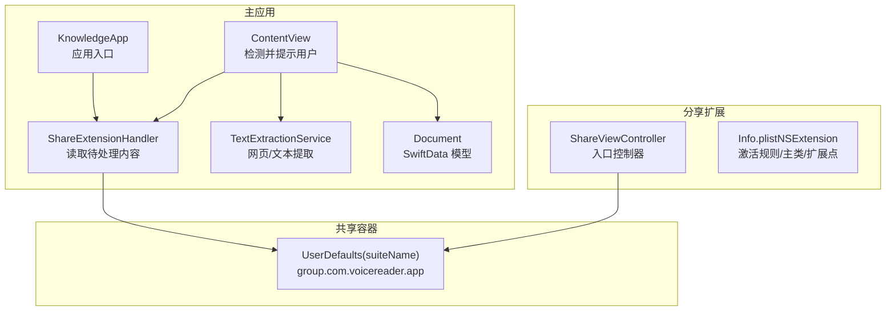
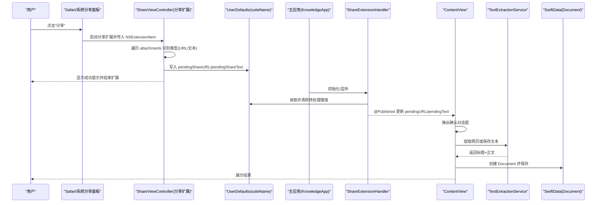
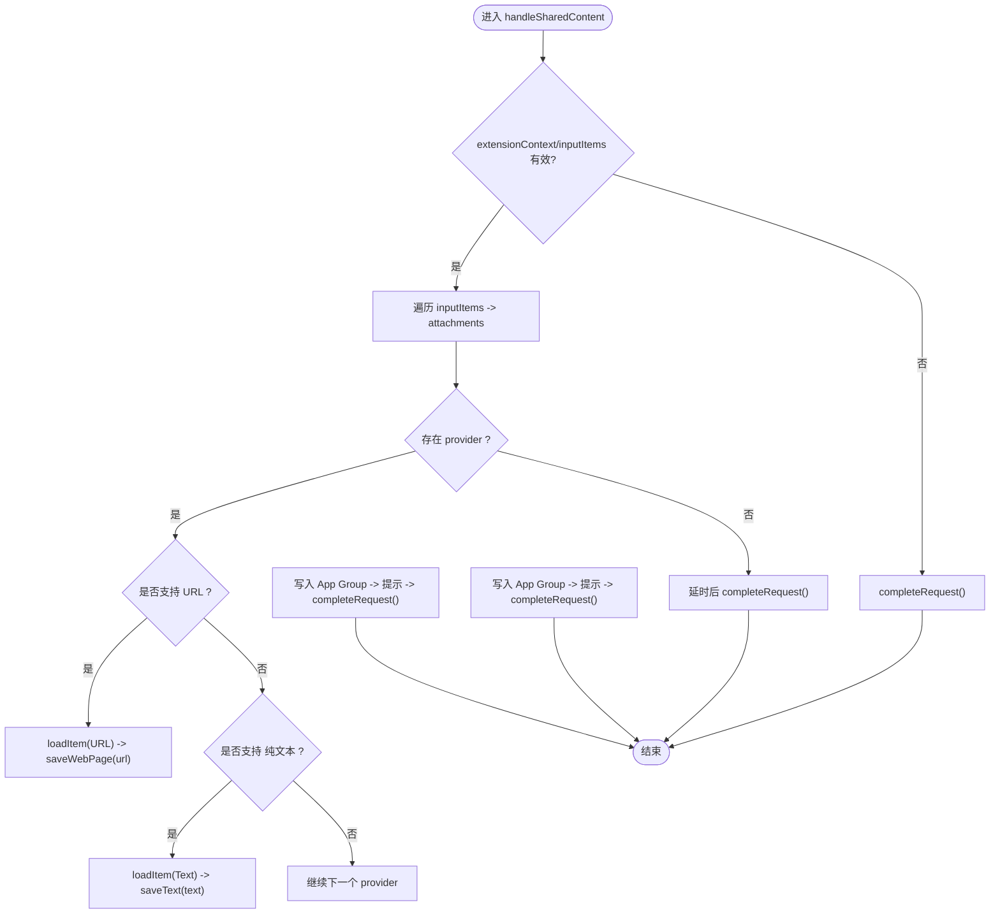
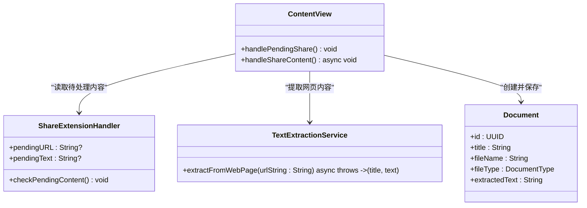
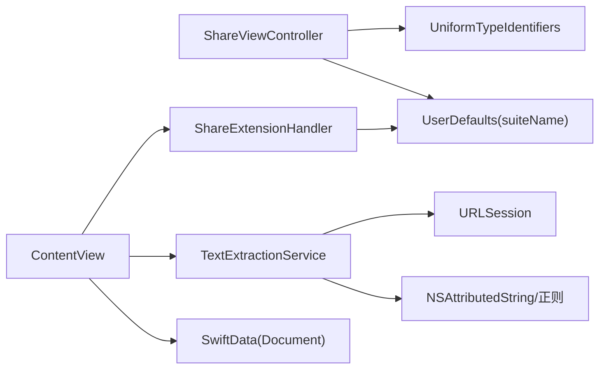

# 分享扩展

<cite>
**本文引用的文件**
- [ShareViewController.swift](file://ShareExtension/ShareViewController.swift)
- [Info.plist（分享扩展）](file://ShareExtension/Info.plist)
- [ShareExtensionHandler.swift](file://Services/ShareExtensionHandler.swift)
- [TextExtractionService.swift](file://Services/TextExtractionService.swift)
- [Document.swift](file://Models/Document.swift)
- [ContentView.swift](file://Views/ContentView.swift)
- [KnowledgeApp.swift](file://App/KnowledgeApp.swift)
- [AppDelegate.swift](file://App/AppDelegate.swift)
- [ErrorHandler.swift](file://Services/ErrorHandler.swift)
</cite>

## 目录
1. [简介](#简介)
2. [项目结构](#项目结构)
3. [核心组件](#核心组件)
4. [架构总览](#架构总览)
5. [详细组件分析](#详细组件分析)
6. [依赖关系分析](#依赖关系分析)
7. [性能与体验优化](#性能与体验优化)
8. [配置与权限设置](#配置与权限设置)
9. [调试与排错指南](#调试与排错指南)
10. [结论](#结论)

## 简介
本文件面向 Knowledge 应用的 iOS 分享扩展，系统性说明 ShareExtension 的实现机制、数据流转、Safari 网页链接与纯文本分享的具体实现、App Group 共享容器的数据传递策略，以及配置、权限、调试、错误处理与性能优化的最佳实践。目标是帮助开发者快速理解并稳定维护该功能。

## 项目结构
分享扩展位于独立的 Target 中，包含入口控制器和扩展配置；应用主进程通过 App Group 共享容器读取待处理内容，并在 UI 层进行后续处理与持久化。

图表来源
- [ShareViewController.swift:1-108](file://ShareExtension/ShareViewController.swift#L1-L108)
- [Info.plist（分享扩展）:23-39](file://ShareExtension/Info.plist#L23-L39)
- [ShareExtensionHandler.swift:1-34](file://Services/ShareExtensionHandler.swift#L1-L34)
- [ContentView.swift:47-97](file://Views/ContentView.swift#L47-L97)
- [TextExtractionService.swift:58-114](file://Services/TextExtractionService.swift#L58-L114)
- [Document.swift:54-115](file://Models/Document.swift#L54-L115)
- [KnowledgeApp.swift:1-28](file://App/KnowledgeApp.swift#L1-L28)

章节来源
- [ShareViewController.swift:1-108](file://ShareExtension/ShareViewController.swift#L1-L108)
- [Info.plist（分享扩展）:1-42](file://ShareExtension/Info.plist#L1-L42)
- [ShareExtensionHandler.swift:1-34](file://Services/ShareExtensionHandler.swift#L1-L34)
- [ContentView.swift:47-97](file://Views/ContentView.swift#L47-L97)
- [TextExtractionService.swift:58-114](file://Services/TextExtractionService.swift#L58-L114)
- [Document.swift:54-115](file://Models/Document.swift#L54-L115)
- [KnowledgeApp.swift:1-28](file://App/KnowledgeApp.swift#L1-L28)

## 核心组件
- 分享扩展入口：负责接收系统传入的 NSExtensionItem，识别附件类型（URL/纯文本），并通过 App Group 写入待处理数据。
- 共享容器处理器：在主应用中读取并消费 App Group 中的待处理数据，暴露给 SwiftUI 状态。
- 文本提取服务：对网页链接执行网络请求、HTML 解析、正文抽取与清洗，返回标题与正文。
- 文档模型：使用 SwiftData 持久化导入后的文档。
- 视图层：在 ContentView 中检查待处理内容，向用户确认并调用提取服务完成入库。

章节来源
- [ShareViewController.swift:15-58](file://ShareExtension/ShareViewController.swift#L15-L58)
- [ShareExtensionHandler.swift:15-33](file://Services/ShareExtensionHandler.swift#L15-L33)
- [TextExtractionService.swift:58-114](file://Services/TextExtractionService.swift#L58-L114)
- [Document.swift:54-115](file://Models/Document.swift#L54-L115)
- [ContentView.swift:47-97](file://Views/ContentView.swift#L47-L97)

## 架构总览
分享扩展与主应用通过 App Group 共享容器进行异步通信，避免跨进程直接调用。整体流程如下：

图表来源
- [ShareViewController.swift:15-58](file://ShareExtension/ShareViewController.swift#L15-L58)
- [ShareExtensionHandler.swift:15-33](file://Services/ShareExtensionHandler.swift#L15-L33)
- [ContentView.swift:47-97](file://Views/ContentView.swift#L47-L97)
- [TextExtractionService.swift:58-114](file://Services/TextExtractionService.swift#L58-L114)
- [Document.swift:54-115](file://Models/Document.swift#L54-L115)

## 详细组件分析

### 分享扩展入口：ShareViewController
- 生命周期与触发：在 viewDidLoad 中立即处理输入项，确保扩展尽快完成工作。
- 输入项处理：从 extensionContext.inputItems 获取 NSExtensionItem 数组，遍历其 attachments。
- 附件类型识别与加载：
  - 优先处理 URL：使用 UTType.url.identifier 判断并 loadItem，成功后保存网页链接。
  - 其次处理纯文本：使用 UTType.plainText.identifier 判断并 loadItem，成功后保存文本。
- 数据落盘：通过 UserDefaults(suiteName:) 将待处理数据写入 App Group 共享容器。
- 用户体验：写入成功后在主线程弹出提示，随后调用 completeRequest 结束扩展。
- 异常路径：当无匹配附件类型或无法获取共享容器时，延迟后直接完成请求，避免卡死。

图表来源
- [ShareViewController.swift:15-58](file://ShareExtension/ShareViewController.swift#L15-L58)
- [ShareViewController.swift:62-89](file://ShareExtension/ShareViewController.swift#L62-L89)
- [ShareViewController.swift:91-106](file://ShareExtension/ShareViewController.swift#L91-L106)

章节来源
- [ShareViewController.swift:10-13](file://ShareExtension/ShareViewController.swift#L10-L13)
- [ShareViewController.swift:15-58](file://ShareExtension/ShareViewController.swift#L15-L58)
- [ShareViewController.swift:62-89](file://ShareExtension/ShareViewController.swift#L62-L89)
- [ShareViewController.swift:91-106](file://ShareExtension/ShareViewController.swift#L91-L106)

### 分享扩展配置：Info.plist
- 扩展点标识：com.apple.share-services
- 主类：$(PRODUCT_MODULE_NAME).ShareViewController
- 激活规则：
  - 支持 Web URL，最大数量 1
  - 支持纯文本
- 这些配置决定了系统在哪些场景下会展示该分享目标。

章节来源
- [Info.plist（分享扩展）:23-39](file://ShareExtension/Info.plist#L23-L39)

### 共享容器与数据同步：UserDefaults(suiteName:)
- 共享容器名称：group.com.voicereader.app
- 写入键：
  - pendingShareURL：用于存储待处理的网页链接字符串
  - pendingShareText：用于存储待处理的纯文本
- 同步策略：
  - 写入后立即 synchronize()，确保主应用可及时读取
  - 主应用读取后删除对应键并再次 synchronize()，避免重复消费
- 注意：若 suiteName 无效，应走失败路径并结束扩展，避免阻塞。

章节来源
- [ShareViewController.swift:62-89](file://ShareExtension/ShareViewController.swift#L62-L89)
- [ShareExtensionHandler.swift:11-33](file://Services/ShareExtensionHandler.swift#L11-L33)

### 主应用侧处理：ShareExtensionHandler 与 ContentView
- ShareExtensionHandler：
  - 单例模式，持有共享容器实例
  - 提供 checkPendingContent() 方法，按优先级读取 URL 或文本，赋值到 @Published 属性，并从共享容器中移除已消费的数据
- ContentView：
  - 在合适时机调用 checkPendingContent()，根据 pendingURL/pendingText 弹出确认提示
  - 确认后调用 TextExtractionService 进行网页提取或直接保存文本
  - 将结果封装为 Document 并保存到 SwiftData

图表来源
- [ShareExtensionHandler.swift:5-33](file://Services/ShareExtensionHandler.swift#L5-L33)
- [ContentView.swift:47-97](file://Views/ContentView.swift#L47-L97)
- [TextExtractionService.swift:58-114](file://Services/TextExtractionService.swift#L58-L114)
- [Document.swift:54-115](file://Models/Document.swift#L54-L115)

章节来源
- [ShareExtensionHandler.swift:15-33](file://Services/ShareExtensionHandler.swift#L15-L33)
- [ContentView.swift:47-97](file://Views/ContentView.swift#L47-L97)
- [TextExtractionService.swift:58-114](file://Services/TextExtractionService.swift#L58-L114)
- [Document.swift:54-115](file://Models/Document.swift#L54-L115)

### Safari 网页链接分享实现要点
- 类型识别：UTType.url.identifier
- 数据加载：provider.loadItem(forTypeIdentifier: UTType.url.identifier, options: nil, completion:)
- 内容提取：
  - 发起网络请求获取 HTML
  - 解析 meta/title/body 区域，提取正文
  - 清洗噪声行、导航残留等
- 结果处理：生成 Document 并保存

章节来源
- [ShareViewController.swift:26-37](file://ShareExtension/ShareViewController.swift#L26-L37)
- [TextExtractionService.swift:58-114](file://Services/TextExtractionService.swift#L58-L114)
- [ContentView.swift:63-75](file://Views/ContentView.swift#L63-L75)

### 纯文本分享实现要点
- 类型识别：UTType.plainText.identifier
- 数据加载：provider.loadItem(forTypeIdentifier: UTType.plainText.identifier, options: nil, completion:)
- 内容处理：直接以文本形式创建 Document，文件名可为 shared.txt，标题带时间戳

章节来源
- [ShareViewController.swift:39-50](file://ShareExtension/ShareViewController.swift#L39-L50)
- [ContentView.swift:76-89](file://Views/ContentView.swift#L76-L89)

## 依赖关系分析
- 分享扩展依赖 UIKit、UniformTypeIdentifiers 进行类型识别与 UI 交互。
- 主应用依赖 Foundation、SwiftUI、SwiftData 进行状态管理与数据持久化。
- 文本提取服务依赖 URLSession、NSAttributedString、正则表达式等进行网页解析与清洗。
- 共享容器作为唯一的数据交换通道，解耦了扩展与主进程。

图表来源
- [ShareViewController.swift:1-108](file://ShareExtension/ShareViewController.swift#L1-L108)
- [ShareExtensionHandler.swift:1-34](file://Services/ShareExtensionHandler.swift#L1-L34)
- [ContentView.swift:47-97](file://Views/ContentView.swift#L47-L97)
- [TextExtractionService.swift:58-114](file://Services/TextExtractionService.swift#L58-L114)
- [Document.swift:54-115](file://Models/Document.swift#L54-L115)

章节来源
- [ShareViewController.swift:1-108](file://ShareExtension/ShareViewController.swift#L1-L108)
- [ShareExtensionHandler.swift:1-34](file://Services/ShareExtensionHandler.swift#L1-L34)
- [ContentView.swift:47-97](file://Views/ContentView.swift#L47-L97)
- [TextExtractionService.swift:58-114](file://Services/TextExtractionService.swift#L58-L114)
- [Document.swift:54-115](file://Models/Document.swift#L54-L115)

## 性能与体验优化
- 减少阻塞：
  - 扩展内仅做最小必要操作（类型识别、写入共享容器、提示），避免耗时任务。
  - 网页提取放在主应用侧异步执行，不阻塞扩展生命周期。
- 并发与线程：
  - 网络请求与解析在后台队列执行，UI 更新回到主线程。
- 内存与磁盘：
  - 共享容器只存字符串键值，避免大对象传输。
  - 提取完成后及时清理临时数据（如已消费的键）。
- 用户体验：
  - 明确的成功提示与错误提示，帮助用户理解当前状态。
  - 在 ContentView 中先预览前若干字符，提升确认效率。

[本节为通用建议，无需特定文件引用]

## 配置与权限设置
- 分享扩展配置（Info.plist）：
  - NSExtensionPointIdentifier：com.apple.share-services
  - NSExtensionPrincipalClass：$(PRODUCT_MODULE_NAME).ShareViewController
  - NSExtensionActivationRule：
    - NSExtensionActivationSupportsWebURLWithMaxCount：1
    - NSExtensionActivationSupportsText：true
- App Group 共享容器：
  - 需在 Xcode 中为应用与分享扩展启用相同的 App Group（例如 group.com.voicereader.app）
  - 代码中使用 UserDefaults(suiteName:) 访问共享容器
- 权限相关：
  - 网页提取需要网络访问权限（默认允许）
  - 如需访问受限资源（如安全作用域资源），需额外申请相应权限

章节来源
- [Info.plist（分享扩展）:23-39](file://ShareExtension/Info.plist#L23-L39)
- [ShareExtensionHandler.swift:11-17](file://Services/ShareExtensionHandler.swift#L11-L17)
- [ShareViewController.swift:62-89](file://ShareExtension/ShareViewController.swift#L62-L89)

## 调试与排错指南
- 常见问题定位：
  - 扩展未出现：检查 Info.plist 的 NSExtension 配置是否正确，Bundle ID 与模块名是否一致。
  - 无法读取共享容器：确认 App Group 已正确启用且 suiteName 一致。
  - 网页提取失败：检查网络连接、URL 有效性、编码解析与正文区域定位逻辑。
- 日志与错误：
  - 使用全局 ErrorHandler 记录错误上下文与消息，便于排查。
  - 在关键路径打印日志（如网络请求、解析步骤、写入/读取共享容器）。
- 断点与测试：
  - 在 handleSharedContent、saveWebPage/saveText、checkPendingContent、handleShareContent 处设置断点。
  - 构造不同附件类型（URL/文本）进行回归测试。

章节来源
- [ErrorHandler.swift:21-35](file://Services/ErrorHandler.swift#L21-L35)
- [ShareViewController.swift:15-58](file://ShareExtension/ShareViewController.swift#L15-L58)
- [ShareExtensionHandler.swift:15-33](file://Services/ShareExtensionHandler.swift#L15-L33)
- [ContentView.swift:63-97](file://Views/ContentView.swift#L63-L97)

## 结论
本分享扩展采用轻量化的扩展入口与 App Group 共享容器进行进程间通信，结合主应用侧的异步文本提取与 SwiftData 持久化，实现了 Safari 网页链接与纯文本的高效导入。通过合理的配置、清晰的错误处理与性能优化策略，可在保证用户体验的同时提升稳定性与可维护性。