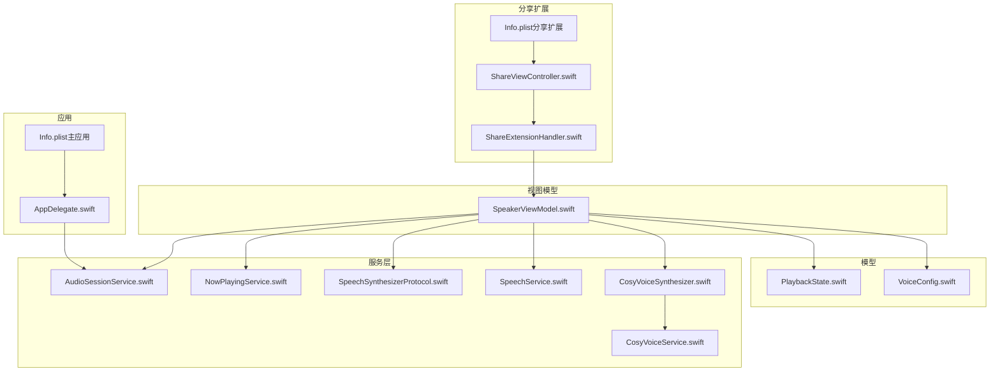
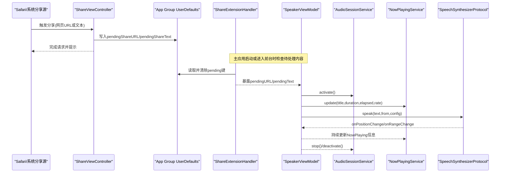
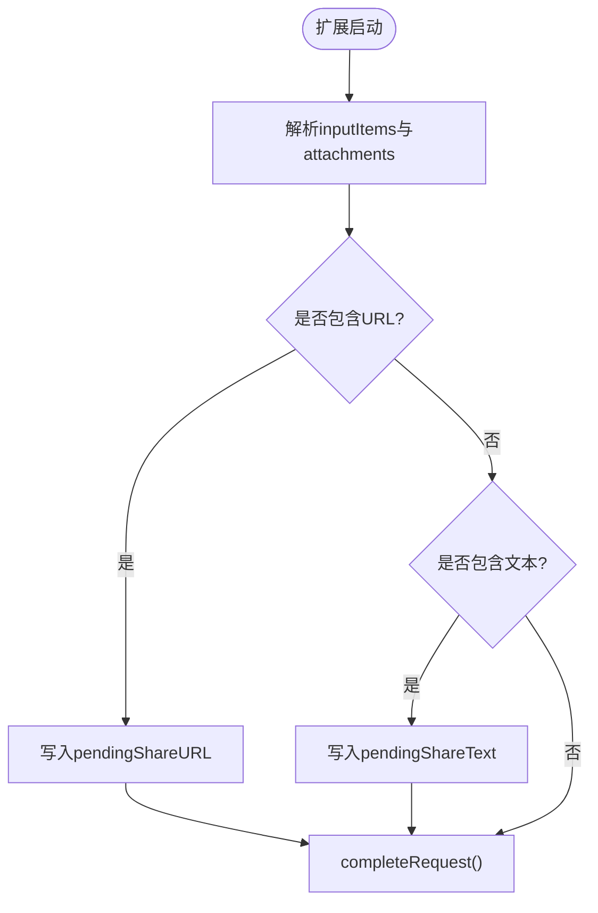
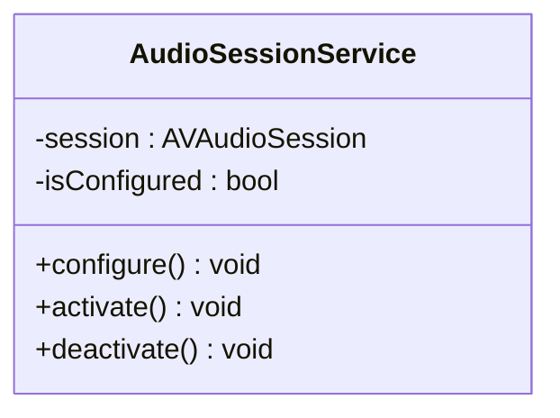
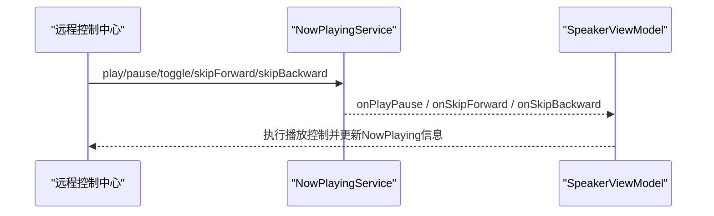
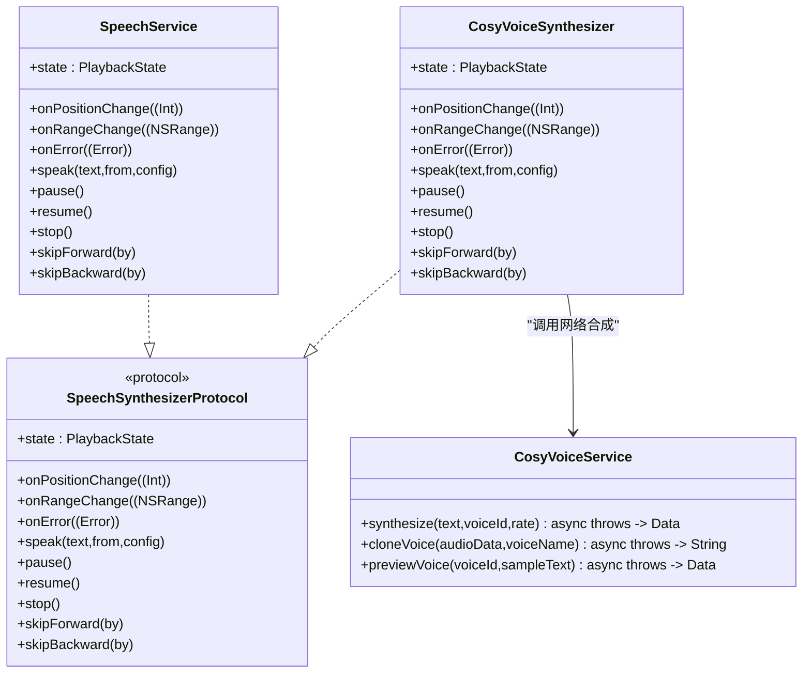
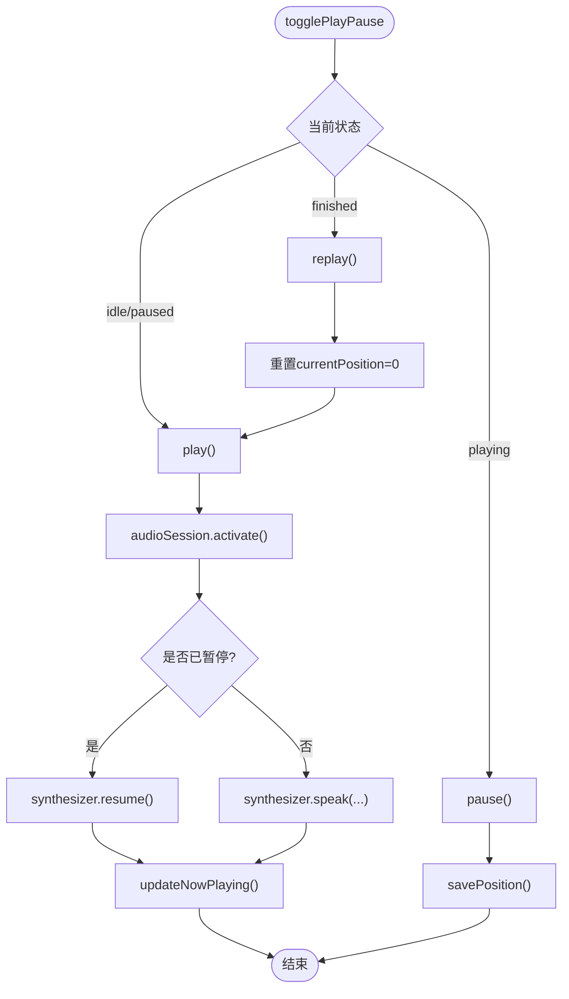
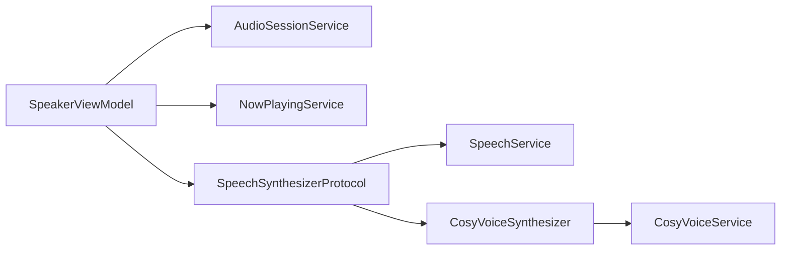

# 系统集成

<cite>
**本文引用的文件**
- [ShareViewController.swift](file://ShareExtension/ShareViewController.swift)
- [Info.plist（分享扩展）](file://ShareExtension/Info.plist)
- [ShareExtensionHandler.swift](file://Services/ShareExtensionHandler.swift)
- [AudioSessionService.swift](file://Services/AudioSessionService.swift)
- [NowPlayingService.swift](file://Services/NowPlayingService.swift)
- [SpeechSynthesizerProtocol.swift](file://Services/SpeechSynthesizerProtocol.swift)
- [SpeechService.swift](file://Services/SpeechService.swift)
- [CosyVoiceSynthesizer.swift](file://Services/CosyVoiceSynthesizer.swift)
- [CosyVoiceService.swift](file://Services/CosyVoiceService.swift)
- [SpeakerViewModel.swift](file://ViewModels/SpeakerViewModel.swift)
- [PlaybackState.swift](file://Models/PlaybackState.swift)
- [VoiceConfig.swift](file://Models/VoiceConfig.swift)
- [AppDelegate.swift](file://App/AppDelegate.swift)
- [Info.plist（主应用）](file://Resources/Info.plist)
</cite>

## 目录
1. [简介](#简介)
2. [项目结构](#项目结构)
3. [核心组件](#核心组件)
4. [架构总览](#架构总览)
5. [详细组件分析](#详细组件分析)
6. [依赖关系分析](#依赖关系分析)
7. [性能与资源管理](#性能与资源管理)
8. [权限管理与最佳实践](#权限管理与最佳实践)
9. [调试与排障指南](#调试与排障指南)
10. [结论](#结论)

## 简介
本文件聚焦 Knowledge 应用的系统集成功能，覆盖以下关键主题：
- iOS 分享扩展（Share Extension）的配置、数据传递与使用方式
- 音频会话的统一管理与后台播放支持
- Now Playing 服务集成与媒体控制事件处理
- 语音合成引擎抽象与双引擎实现（系统 TTS 与 CosyVoice）
- 权限管理与系统资源利用的最佳实践
- 调试技巧与性能优化建议

## 项目结构
围绕系统集成相关的关键目录与文件如下：
- ShareExtension：分享扩展入口与配置
- Services：音频会话、Now Playing、TTS 协议与实现、网络服务
- ViewModels：统一编排播放流程与状态同步
- Models：播放状态与语音配置
- App：应用生命周期中初始化音频会话
- Resources：主应用 Info.plist 声明后台音频模式

图表来源
- [Info.plist（分享扩展）:1-42](file://ShareExtension/Info.plist#L1-L42)
- [ShareViewController.swift:1-108](file://ShareExtension/ShareViewController.swift#L1-L108)
- [ShareExtensionHandler.swift:1-34](file://Services/ShareExtensionHandler.swift#L1-L34)
- [AudioSessionService.swift:1-46](file://Services/AudioSessionService.swift#L1-L46)
- [NowPlayingService.swift:1-57](file://Services/NowPlayingService.swift#L1-L57)
- [SpeechSynthesizerProtocol.swift:1-20](file://Services/SpeechSynthesizerProtocol.swift#L1-L20)
- [SpeechService.swift:1-155](file://Services/SpeechService.swift#L1-L155)
- [CosyVoiceSynthesizer.swift:1-258](file://Services/CosyVoiceSynthesizer.swift#L1-L258)
- [CosyVoiceService.swift:1-219](file://Services/CosyVoiceService.swift#L1-L219)
- [SpeakerViewModel.swift:1-314](file://ViewModels/SpeakerViewModel.swift#L1-L314)
- [PlaybackState.swift:1-9](file://Models/PlaybackState.swift#L1-L9)
- [VoiceConfig.swift:1-52](file://Models/VoiceConfig.swift#L1-L52)
- [AppDelegate.swift:1-14](file://App/AppDelegate.swift#L1-L14)
- [Info.plist（主应用）:1-44](file://Resources/Info.plist#L1-L44)

章节来源
- [ShareViewController.swift:1-108](file://ShareExtension/ShareViewController.swift#L1-L108)
- [Info.plist（分享扩展）:1-42](file://ShareExtension/Info.plist#L1-L42)
- [ShareExtensionHandler.swift:1-34](file://Services/ShareExtensionHandler.swift#L1-L34)
- [AudioSessionService.swift:1-46](file://Services/AudioSessionService.swift#L1-L46)
- [NowPlayingService.swift:1-57](file://Services/NowPlayingService.swift#L1-L57)
- [SpeechSynthesizerProtocol.swift:1-20](file://Services/SpeechSynthesizerProtocol.swift#L1-L20)
- [SpeechService.swift:1-155](file://Services/SpeechService.swift#L1-L155)
- [CosyVoiceSynthesizer.swift:1-258](file://Services/CosyVoiceSynthesizer.swift#L1-L258)
- [CosyVoiceService.swift:1-219](file://Services/CosyVoiceService.swift#L1-L219)
- [SpeakerViewModel.swift:1-314](file://ViewModels/SpeakerViewModel.swift#L1-L314)
- [PlaybackState.swift:1-9](file://Models/PlaybackState.swift#L1-L9)
- [VoiceConfig.swift:1-52](file://Models/VoiceConfig.swift#L1-L52)
- [AppDelegate.swift:1-14](file://App/AppDelegate.swift#L1-L14)
- [Info.plist（主应用）:1-44](file://Resources/Info.plist#L1-L44)

## 核心组件
- 分享扩展
  - 入口控制器负责解析 NSExtensionItem 附件，优先处理 URL，其次处理纯文本；通过 App Group 的 UserDefaults 写入待处理内容并提示完成。
  - 扩展 Info.plist 声明支持的类型与激活规则。
- 共享处理器
  - 在主应用中读取 App Group 中的 pendingURL/pendingText，并在消费后清理键值。
- 音频会话服务
  - 统一管理 AVAudioSession 的 category/mode/options 配置与 activate/deactivate 生命周期。
- Now Playing 服务
  - 更新锁屏/控制中心信息，注册远程控制命令（播放/暂停/快进/快退），并通过回调将事件转发到上层。
- 语音合成抽象与实现
  - SpeechSynthesizerProtocol 定义统一的播放接口与回调。
  - SpeechService 基于系统 TTS 实现，按自然断点分段朗读。
  - CosyVoiceSynthesizer 基于阿里云 CosyVoice 网络合成，分段请求、本地播放、自动续播，错误时降级到系统 TTS。
- 视图模型
  - SpeakerViewModel 作为门面，协调音频会话、Now Playing、TTS 引擎切换、进度同步、位置持久化等。

章节来源
- [ShareViewController.swift:1-108](file://ShareExtension/ShareViewController.swift#L1-L108)
- [Info.plist（分享扩展）:1-42](file://ShareExtension/Info.plist#L1-L42)
- [ShareExtensionHandler.swift:1-34](file://Services/ShareExtensionHandler.swift#L1-L34)
- [AudioSessionService.swift:1-46](file://Services/AudioSessionService.swift#L1-L46)
- [NowPlayingService.swift:1-57](file://Services/NowPlayingService.swift#L1-L57)
- [SpeechSynthesizerProtocol.swift:1-20](file://Services/SpeechSynthesizerProtocol.swift#L1-L20)
- [SpeechService.swift:1-155](file://Services/SpeechService.swift#L1-L155)
- [CosyVoiceSynthesizer.swift:1-258](file://Services/CosyVoiceSynthesizer.swift#L1-L258)
- [CosyVoiceService.swift:1-219](file://Services/CosyVoiceService.swift#L1-L219)
- [SpeakerViewModel.swift:1-314](file://ViewModels/SpeakerViewModel.swift#L1-L314)

## 架构总览
下图展示从分享扩展到播放控制的端到端流程，以及 Now Playing 与音频会话的协作关系。

图表来源
- [ShareViewController.swift:1-108](file://ShareExtension/ShareViewController.swift#L1-L108)
- [ShareExtensionHandler.swift:1-34](file://Services/ShareExtensionHandler.swift#L1-L34)
- [SpeakerViewModel.swift:1-314](file://ViewModels/SpeakerViewModel.swift#L1-L314)
- [AudioSessionService.swift:1-46](file://Services/AudioSessionService.swift#L1-L46)
- [NowPlayingService.swift:1-57](file://Services/NowPlayingService.swift#L1-L57)
- [SpeechSynthesizerProtocol.swift:1-20](file://Services/SpeechSynthesizerProtocol.swift#L1-L20)

## 详细组件分析

### 分享扩展（Share Extension）
- 配置要点
  - 在扩展 Info.plist 中声明 NSExtensionAttributes.NSExtensionActivationRule，启用 Web URL 与文本支持，并指定 NSExtensionPrincipalClass 为 ShareViewController。
- 运行流程
  - viewDidLoad 中解析 inputItems，遍历 attachments，优先加载 URL，其次加载纯文本。
  - 通过 group.com.voicereader.app 的 UserDefaults 写入 pendingShareURL 或 pendingShareText，随后 completeRequest。
- 主应用消费
  - ShareExtensionHandler 在合适时机读取并移除 pending 键，供 UI 消费。

图表来源
- [ShareViewController.swift:1-108](file://ShareExtension/ShareViewController.swift#L1-L108)
- [Info.plist（分享扩展）:1-42](file://ShareExtension/Info.plist#L1-L42)

章节来源
- [ShareViewController.swift:1-108](file://ShareExtension/ShareViewController.swift#L1-L108)
- [Info.plist（分享扩展）:1-42](file://ShareExtension/Info.plist#L1-L42)
- [ShareExtensionHandler.swift:1-34](file://Services/ShareExtensionHandler.swift#L1-L34)

### 音频会话统一管理
- 设计目标
  - 避免 AppDelegate 直接操作 AudioSession，提供集中式 configure/activate/deactivate 能力。
- 行为说明
  - configure 设置 playback/spokenAudio 并允许蓝牙与 AirPlay。
  - activate 确保已配置后激活 session。
  - deactivate 停用并通知其他应用。

图表来源
- [AudioSessionService.swift:1-46](file://Services/AudioSessionService.swift#L1-L46)

章节来源
- [AudioSessionService.swift:1-46](file://Services/AudioSessionService.swift#L1-L46)
- [AppDelegate.swift:1-14](file://App/AppDelegate.swift#L1-L14)

### Now Playing 服务与媒体控制
- 功能职责
  - 更新 MPNowPlayingInfoCenter 的标题、时长、已播放时间、速率等。
  - 注册 MPRemoteCommandCenter 的播放/暂停/切换/快进/快退命令，并将事件回调给上层。
- 集成方式
  - SpeakerViewModel 订阅 onPlayPause/onSkipForward/onSkipBackward，映射到自身播放控制方法。

图表来源
- [NowPlayingService.swift:1-57](file://Services/NowPlayingService.swift#L1-L57)
- [SpeakerViewModel.swift:1-314](file://ViewModels/SpeakerViewModel.swift#L1-L314)

章节来源
- [NowPlayingService.swift:1-57](file://Services/NowPlayingService.swift#L1-L57)
- [SpeakerViewModel.swift:1-314](file://ViewModels/SpeakerViewModel.swift#L1-L314)

### 语音合成抽象与双引擎实现
- 抽象协议
  - SpeechSynthesizerProtocol 定义 speak/pause/resume/stop/skipForward/skipBackward 及状态与回调。
- 系统 TTS（SpeechService）
  - 基于 AVSpeechSynthesizer，按自然断点切分段落，逐段朗读，回调位置与范围变化。
- 云端 TTS（CosyVoiceSynthesizer）
  - 将长文本分段，调用 CosyVoiceService 合成音频片段，使用 AVAudioPlayer 播放，定时估算字符位置，完成后自动播放下一段；出错时降级到系统 TTS。

图表来源
- [SpeechSynthesizerProtocol.swift:1-20](file://Services/SpeechSynthesizerProtocol.swift#L1-L20)
- [SpeechService.swift:1-155](file://Services/SpeechService.swift#L1-L155)
- [CosyVoiceSynthesizer.swift:1-258](file://Services/CosyVoiceSynthesizer.swift#L1-L258)
- [CosyVoiceService.swift:1-219](file://Services/CosyVoiceService.swift#L1-L219)

章节来源
- [SpeechSynthesizerProtocol.swift:1-20](file://Services/SpeechSynthesizerProtocol.swift#L1-L20)
- [SpeechService.swift:1-155](file://Services/SpeechService.swift#L1-L155)
- [CosyVoiceSynthesizer.swift:1-258](file://Services/CosyVoiceSynthesizer.swift#L1-L258)
- [CosyVoiceService.swift:1-219](file://Services/CosyVoiceService.swift#L1-L219)

### 播放编排与状态同步（SpeakerViewModel）
- 职责
  - 根据当前文档与配置选择引擎，管理音频会话激活/停用，同步 Now Playing 信息，维护当前位置与高亮范围，持久化进度。
- 远程控制
  - 订阅 NowPlaying 的播放/跳转事件，映射到 speak/pause/stop/skip 等方法。
- 错误降级
  - 当云端引擎报错时，自动切换到系统 TTS 并重新绑定回调。

图表来源
- [SpeakerViewModel.swift:1-314](file://ViewModels/SpeakerViewModel.swift#L1-L314)
- [AudioSessionService.swift:1-46](file://Services/AudioSessionService.swift#L1-L46)
- [NowPlayingService.swift:1-57](file://Services/NowPlayingService.swift#L1-L57)

章节来源
- [SpeakerViewModel.swift:1-314](file://ViewModels/SpeakerViewModel.swift#L1-L314)

## 依赖关系分析
- 组件耦合
  - SpeakerViewModel 对 AudioSessionService、NowPlayingService、SpeechSynthesizerProtocol 存在强依赖，但通过注入可替换实现，利于测试。
  - CosyVoiceSynthesizer 依赖 CosyVoiceService 进行网络合成，失败时回退到系统 TTS。
- 外部依赖
  - MediaPlayer（Now Playing）、AVFoundation（音频会话与播放器）、UniformTypeIdentifiers（分享扩展类型识别）。
- 潜在循环依赖
  - 当前未见循环引用；回调采用弱引用避免 retain cycle。

图表来源
- [SpeakerViewModel.swift:1-314](file://ViewModels/SpeakerViewModel.swift#L1-L314)
- [AudioSessionService.swift:1-46](file://Services/AudioSessionService.swift#L1-L46)
- [NowPlayingService.swift:1-57](file://Services/NowPlayingService.swift#L1-L57)
- [SpeechSynthesizerProtocol.swift:1-20](file://Services/SpeechSynthesizerProtocol.swift#L1-L20)
- [SpeechService.swift:1-155](file://Services/SpeechService.swift#L1-L155)
- [CosyVoiceSynthesizer.swift:1-258](file://Services/CosyVoiceSynthesizer.swift#L1-L258)
- [CosyVoiceService.swift:1-219](file://Services/CosyVoiceService.swift#L1-L219)

章节来源
- [SpeakerViewModel.swift:1-314](file://ViewModels/SpeakerViewModel.swift#L1-L314)
- [SpeechSynthesizerProtocol.swift:1-20](file://Services/SpeechSynthesizerProtocol.swift#L1-L20)

## 性能与资源管理
- 音频会话
  - 仅在需要播放时激活，停止时及时停用，避免长时间占用音频通道。
- 网络合成
  - 长文本分段合成，每段间加入短暂延迟，降低服务器压力与内存峰值。
  - 临时音频文件及时释放，避免磁盘膨胀。
- 位置估算
  - 云端引擎通过定时器估算字符位置，减少频繁计算开销。
- 状态同步
  - 使用 Combine 与 Timer 轮询最小化 UI 刷新频率，平衡实时性与性能。

[本节为通用指导，不直接分析具体文件]

## 权限管理与最佳实践
- 后台音频
  - 在主应用 Info.plist 中声明 UIBackgroundModes.audio，以支持后台播放。
- 麦克风权限（可选）
  - 若未来引入录音或语音克隆录制，需申请麦克风权限并在 UI 引导用户授权。
- 分享扩展
  - 通过 App Group 共享 UserDefaults 传递数据，注意键名一致与清理策略。
- 错误处理
  - 云端合成失败时自动降级到系统 TTS，保证用户体验连续性。

章节来源
- [Info.plist（主应用）:1-44](file://Resources/Info.plist#L1-L44)
- [ShareExtensionHandler.swift:1-34](file://Services/ShareExtensionHandler.swift#L1-L34)
- [CosyVoiceSynthesizer.swift:1-258](file://Services/CosyVoiceSynthesizer.swift#L1-L258)

## 调试与排障指南
- 分享扩展
  - 确认 NSExtensionActivationRule 正确启用 URL 与文本；检查 group.com.voicereader.app 的 UserDefaults 是否写入成功。
- 音频会话
  - 若无法后台播放，检查主应用 Info.plist 的 UIBackgroundModes 是否包含 audio；确认 AudioSessionService 的 activate/deactivate 调用时机。
- Now Playing
  - 若锁屏控件无响应，检查 MPRemoteCommandCenter 的命令是否注册成功，以及 onPlayPause 等回调是否正确转发。
- 云端合成
  - 若返回 401/403，检查 API Key 配置；若返回非 200，查看错误消息定位问题；必要时观察降级到系统 TTS 的行为。

章节来源
- [Info.plist（分享扩展）:1-42](file://ShareExtension/Info.plist#L1-L42)
- [ShareViewController.swift:1-108](file://ShareExtension/ShareViewController.swift#L1-L108)
- [AudioSessionService.swift:1-46](file://Services/AudioSessionService.swift#L1-L46)
- [NowPlayingService.swift:1-57](file://Services/NowPlayingService.swift#L1-L57)
- [CosyVoiceService.swift:1-219](file://Services/CosyVoiceService.swift#L1-L219)

## 结论
Knowledge 应用在系统集成方面实现了完整的分享扩展链路、统一的音频会话管理、完善的 Now Playing 集成与远程控制支持，并通过抽象协议将系统 TTS 与云端 CosyVoice 无缝衔接。配合合理的权限声明、错误降级与资源管理策略，整体具备较好的稳定性与可扩展性。后续可在录音权限、更多远控交互与更精细的位置同步等方面继续增强。