# 音频会话管理

<cite>
**本文引用的文件**
- [AudioSessionService.swift](file://Services/AudioSessionService.swift)
- [AudioRecorderService.swift](file://Services/AudioRecorderService.swift)
- [NowPlayingService.swift](file://Services/NowPlayingService.swift)
- [SpeakerViewModel.swift](file://ViewModels/SpeakerViewModel.swift)
- [SpeechService.swift](file://Services/SpeechService.swift)
- [VnoteRecorderView.swift](file://Views/VnoteRecorderView.swift)
- [VnoteEntry.swift](file://Models/VnoteEntry.swift)
- [AppDelegate.swift](file://App/AppDelegate.swift)
- [Info.plist](file://Resources/Info.plist)
- [PlaybackState.swift](file://Models/PlaybackState.swift)
</cite>

## 更新摘要
**所做更改**
- AudioRecorderService 获得重大增强：添加 @MainActor 注解确保线程安全
- Timer 调度修复：使用主线程 RunLoop 的 .common mode 避免调度问题
- 改进错误处理：对 recorder.record() 返回值进行验证和警告日志
- 新增 guard 条件：在定时器回调中检查 isRecording 状态防止竞态条件
- 委托方法标记为 nonisolated：符合 Swift 并发模型要求
- 完善录音与播放模式的智能切换机制

## 目录
1. [简介](#简介)
2. [项目结构](#项目结构)
3. [核心组件](#核心组件)
4. [架构总览](#架构总览)
5. [详细组件分析](#详细组件分析)
6. [依赖关系分析](#依赖关系分析)
7. [性能与最佳实践](#性能与最佳实践)
8. [故障排查指南](#故障排查指南)
9. [结论](#结论)

## 简介
本文件聚焦 Knowledge 应用的音频会话管理系统，围绕 AudioSessionService 的设计与实现展开，说明 AVAudioSession 的统一管理与配置策略、应用生命周期中的激活/停用时机、后台播放支持（系统媒体控制事件与锁屏界面集成），以及中断处理与恢复机制。同时给出面向实际工程的优化建议与常见问题解决方案，帮助读者快速理解并扩展该模块。

**更新** 新增了 Vnote 语音速记功能的音频录制支持，扩展了音频会话管理以支持录音场景，包括录音模式配置、麦克风权限管理和录音与播放模式的智能切换。**最新增强** 包括 AudioRecorderService 的线程安全改进、Timer 调度优化和错误处理增强。

## 项目结构
与音频会话相关的代码主要分布在 Services、ViewModels、Views、App 与 Resources 中：
- Services/AudioSessionService.swift：统一封装 AVAudioSession 的配置、激活与停用
- Services/AudioRecorderService.swift：**增强版** 录音服务，封装 AVAudioRecorder 并提供录音功能，现采用 @MainActor 确保线程安全
- Services/NowPlayingService.swift：封装 MPNowPlayingInfoCenter 与 MPRemoteCommandCenter，提供锁屏信息与远程控制回调
- ViewModels/SpeakerViewModel.swift：编排播放流程，协调 AudioSessionService 与 NowPlayingService
- Views/VnoteRecorderView.swift：Vnote 录音界面，集成录音、STT 转写和 AI 分类功能
- App/AppDelegate.swift：在应用启动时完成一次性的会话类别配置
- Resources/Info.plist：声明后台音频模式和麦克风权限
- Models/PlaybackState.swift：定义播放状态枚举，供 UI 与服务层同步
- Models/VnoteEntry.swift：Vnote 数据模型，包含录音文件和转写信息

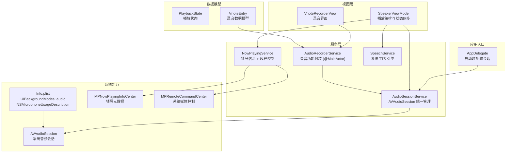

**图表来源**
- [AppDelegate.swift:1-14](file://App/AppDelegate.swift#L1-L14)
- [AudioSessionService.swift:1-46](file://Services/AudioSessionService.swift#L1-L46)
- [AudioRecorderService.swift:1-148](file://Services/AudioRecorderService.swift#L1-L148)
- [NowPlayingService.swift:1-57](file://Services/NowPlayingService.swift#L1-L57)
- [SpeakerViewModel.swift:100-130](file://ViewModels/SpeakerViewModel.swift#L100-L130)
- [VnoteRecorderView.swift:1-339](file://Views/VnoteRecorderView.swift#L1-L339)
- [Info.plist:1-48](file://Resources/Info.plist#L1-L48)

**章节来源**
- [AppDelegate.swift:1-14](file://App/AppDelegate.swift#L1-L14)
- [AudioSessionService.swift:1-46](file://Services/AudioSessionService.swift#L1-L46)
- [AudioRecorderService.swift:1-148](file://Services/AudioRecorderService.swift#L1-L148)
- [NowPlayingService.swift:1-57](file://Services/NowPlayingService.swift#L1-L57)
- [SpeakerViewModel.swift:1-500](file://ViewModels/SpeakerViewModel.swift#L1-L500)
- [VnoteRecorderView.swift:1-339](file://Views/VnoteRecorderView.swift#L1-L339)
- [Info.plist:1-48](file://Resources/Info.plist#L1-L48)

## 核心组件
- AudioSessionService：单例，集中管理 AVAudioSession 的 category/mode/options 设置、激活与停用，避免多处直接操作导致冲突。
- **AudioRecorderService**：**增强版** 录音服务，封装 AVAudioRecorder 提供完整的录音功能，包括权限请求、录音控制、音量监控和文件管理。**现已采用 @MainActor 确保线程安全**。
- NowPlayingService：维护锁屏元数据（标题、时长、已播时间、速率等）并注册系统远程控制命令（播放/暂停、快进/快退）。
- SpeakerViewModel：作为门面编排播放流程，负责在 play/pause/stop/replay 时调用 AudioSessionService 与 NowPlayingService，并将合成进度映射到 UI。
- **VnoteRecorderView**：Vnote 录音界面，集成录音、STT 转写、AI 分类和结果展示功能。
- SpeechService：基于系统 TTS 的朗读实现，暴露统一的播放接口与状态回调。
- PlaybackState：定义 idle/playing/paused/finished 四种状态，贯穿 ViewModel 与 UI。
- **VnoteEntry**：Vnote 数据模型，包含录音文件路径、转写文本、AI 分类结果和时间戳信息。

**章节来源**
- [AudioSessionService.swift:1-46](file://Services/AudioSessionService.swift#L1-L46)
- [AudioRecorderService.swift:1-148](file://Services/AudioRecorderService.swift#L1-L148)
- [NowPlayingService.swift:1-57](file://Services/NowPlayingService.swift#L1-L57)
- [SpeakerViewModel.swift:1-500](file://ViewModels/SpeakerViewModel.swift#L1-L500)
- [VnoteRecorderView.swift:1-339](file://Views/VnoteRecorderView.swift#L1-L339)
- [SpeechService.swift:1-155](file://Services/SpeechService.swift#L1-L155)
- [PlaybackState.swift:1-9](file://Models/PlaybackState.swift#L1-L9)
- [VnoteEntry.swift:1-113](file://Models/VnoteEntry.swift#L1-L113)

## 架构总览
下图展示了从用户交互到系统能力的完整链路：ViewModel 驱动播放，AudioSessionService 管理会话，NowPlayingService 更新锁屏与控制事件，最终由系统 TTS 输出音频。**Vnote 录音流程通过增强的 AudioRecorderService 管理录音会话，并在完成后自动切换回播放模式，所有操作均在主线程安全执行。**

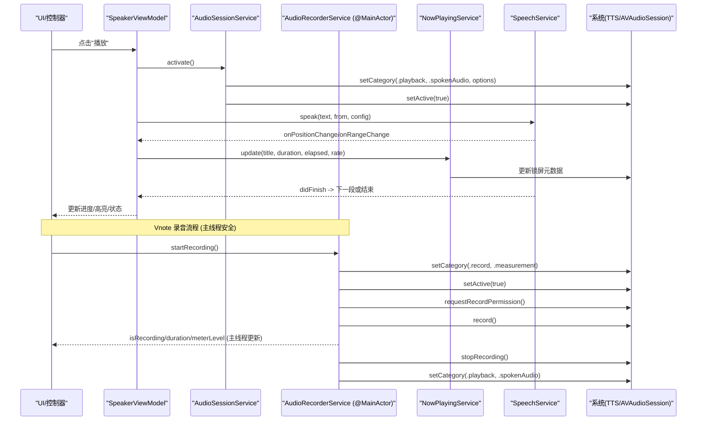

**图表来源**
- [SpeakerViewModel.swift:108-117](file://ViewModels/SpeakerViewModel.swift#L108-L117)
- [AudioSessionService.swift:15-36](file://Services/AudioSessionService.swift#L15-L36)
- [AudioRecorderService.swift:29-102](file://Services/AudioRecorderService.swift#L29-L102)
- [SpeechService.swift:30-72](file://Services/SpeechService.swift#L30-L72)
- [NowPlayingService.swift:18-27](file://Services/NowPlayingService.swift#L18-L27)

## 详细组件分析

### AudioSessionService：AVAudioSession 的统一管理
- 设计要点
  - 单例共享，避免多实例造成重复配置与冲突。
  - 将 configure/activate/deactivate 三阶段解耦：首次启动仅配置；按需激活；停止时停用并通知其他应用。
  - 使用 playback 类别与 spokenAudio 模式，开启蓝牙 HFP 与 AirPlay 选项，满足语音朗读场景。
- 关键行为
  - configure：设置 category/mode/options，内部缓存 isConfigured 防止重复设置。
  - activate：确保已配置后，激活会话。
  - deactivate：停用会话并通知其他应用，释放资源。
- 错误处理
  - 捕获异常并打印本地化描述，便于调试。

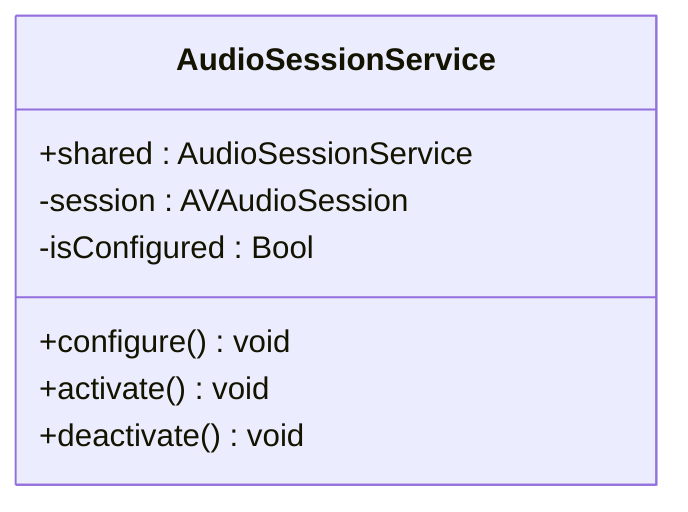

**图表来源**
- [AudioSessionService.swift:6-45](file://Services/AudioSessionService.swift#L6-L45)

**章节来源**
- [AudioSessionService.swift:1-46](file://Services/AudioSessionService.swift#L1-L46)

### AudioRecorderService：增强的录音功能封装
- **重大增强**
  - **线程安全保障**：整个类标注 @MainActor，确保所有操作在主线程执行，避免竞态条件
  - **Timer 调度优化**：使用主线程 RunLoop 的 .common mode 调度定时器，解决跨线程调度问题
  - **改进的错误处理**：对 recorder.record() 返回值进行验证，当返回 false 时记录警告日志
  - **状态验证增强**：在定时器回调中添加 isRecording 状态的 guard 条件，防止状态不一致
  - **Swift 并发兼容**：委托方法标记为 nonisolated，符合现代 Swift 并发模型要求
- 技术实现
  - 使用 AVAudioRecorder 进行 16kHz 单声道 PCM 录音
  - 通过 Timer 实时更新录音时长和音量电平，所有 UI 更新在主线程安全执行
  - 录音文件保存在 Documents/vnote_recordings 目录
  - 录音结束后自动切换回播放模式
- 错误处理
  - 麦克风权限拒绝的错误提示
  - 录音失败的处理和清理
  - 录音参数验证和警告日志

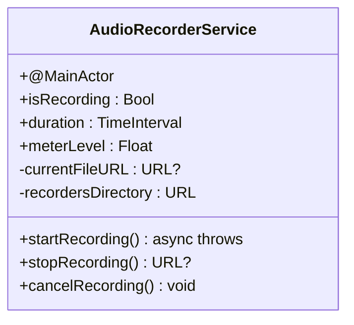

**图表来源**
- [AudioRecorderService.swift:7-112](file://Services/AudioRecorderService.swift#L7-L112)

**章节来源**
- [AudioRecorderService.swift:1-148](file://Services/AudioRecorderService.swift#L1-L148)

### VnoteRecorderView：录音界面集成
- 功能特性
  - 完整的录音界面：波形显示、时长计时、录音按钮
  - STT 转写集成：支持免费和 Premium 两种识别方式
  - AI 分类和内容生成：自动分类为会议、创意、待办或通用笔记
  - 结果展示和知识库沉淀：支持将录音内容保存到知识库
- 工作流程
  - 录音阶段：实时显示音量和时长
  - 处理阶段：并行执行 STT 转写和 AI 分类
  - 完成阶段：展示结构化内容和转写文本
- 用户体验
  - 流畅的状态转换和动画效果
  - 详细的错误提示和重试机制
  - 支持取消录音和保存草稿

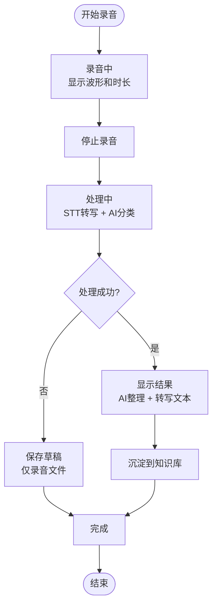

**图表来源**
- [VnoteRecorderView.swift:233-307](file://Views/VnoteRecorderView.swift#L233-L307)

**章节来源**
- [VnoteRecorderView.swift:1-339](file://Views/VnoteRecorderView.swift#L1-L339)

### NowPlayingService：锁屏信息与远程控制
- 功能范围
  - 更新锁屏元数据：标题、艺术家、总时长、已播时间、播放速率、媒体类型。
  - 注册远程控制命令：播放/暂停/切换、快进 30 秒、快退 15 秒，禁用不需要的命令。
- 回调机制
  - 通过闭包 onPlayPause/onSkipForward/onSkipBackward 将系统事件转发给上层（如 SpeakerViewModel）。
- 清理
  - clear 方法清空锁屏信息，避免残留。

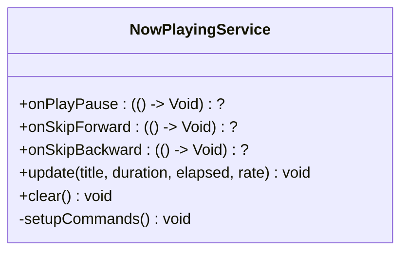

**图表来源**
- [NowPlayingService.swift:4-56](file://Services/NowPlayingService.swift#L4-L56)

**章节来源**
- [NowPlayingService.swift:1-57](file://Services/NowPlayingService.swift#L1-L57)

### SpeakerViewModel：播放编排与状态同步
- 职责
  - 对外暴露 play/pause/stop/replay/skipForward/skipBackward/seekTo 等接口。
  - 在 play 前激活 AudioSession，在 stop 时停用并清理锁屏信息。
  - 订阅合成器位置与范围变化，更新当前进度、文本高亮与锁屏元数据。
  - 监听引擎错误，必要时降级到系统 TTS。
- 远程控制绑定
  - 将 NowPlayingService 的回调映射到自身方法，实现锁屏/耳机按键控制。
- 状态持久化
  - 保存当前位置与最后打开时间，保证断点续读。

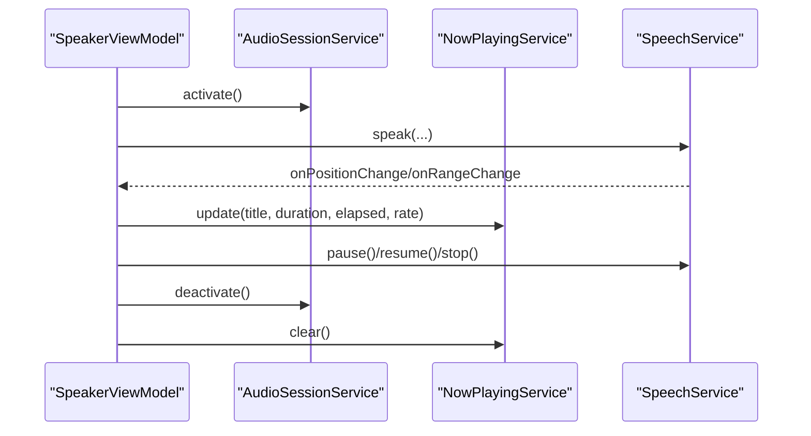

**图表来源**
- [SpeakerViewModel.swift:108-130](file://ViewModels/SpeakerViewModel.swift#L108-L130)
- [SpeakerViewModel.swift:215-266](file://ViewModels/SpeakerViewModel.swift#L215-L266)

**章节来源**
- [SpeakerViewModel.swift:1-500](file://ViewModels/SpeakerViewModel.swift#L1-L500)

### SpeechService：系统 TTS 朗读实现
- 分段朗读
  - 按字符数切分段落，优先在自然断点（句号、换行等）处截断，提升听感。
- 状态与回调
  - 通过 delegate 回调更新当前位置与高亮范围，并在完成时推进至下一段或结束。
- 跳转与回退
  - skipForward/skipBackward 基于字符速率估算目标位置，停止后立即重新合成。

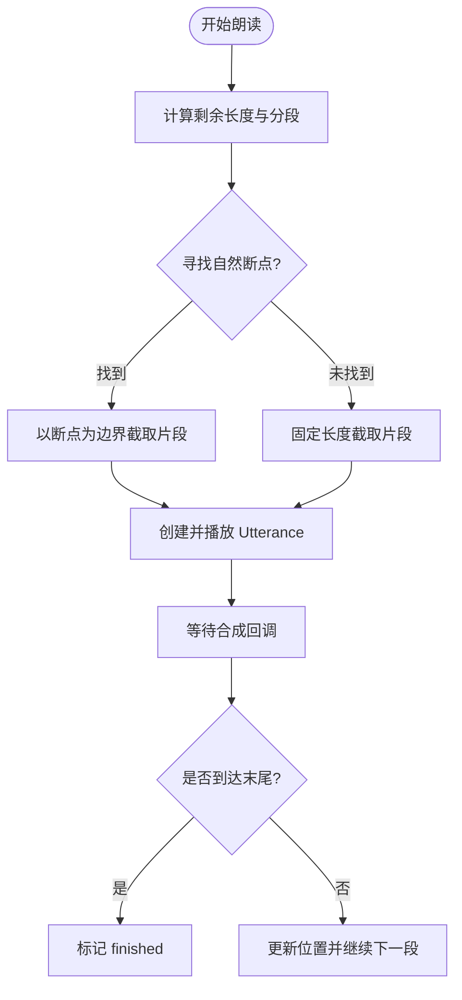

**图表来源**
- [SpeechService.swift:30-72](file://Services/SpeechService.swift#L30-L72)
- [SpeechService.swift:118-132](file://Services/SpeechService.swift#L118-L132)

**章节来源**
- [SpeechService.swift:1-155](file://Services/SpeechService.swift#L1-L155)

### VnoteEntry：录音数据模型
- 数据结构
  - 基础信息：标题、分类、创建时间
  - 录音数据：音频文件路径、时长、格式信息
  - 转写数据：完整文本、句子列表、时间戳
  - AI 处理：分类结果、结构化内容
  - 同步状态：是否已同步到知识库

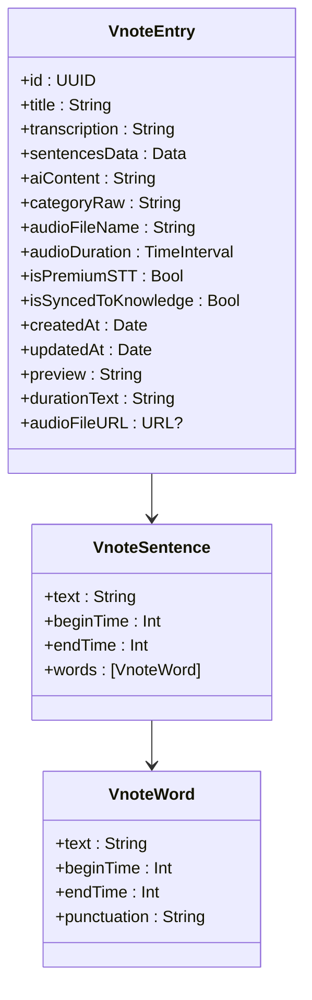

**图表来源**
- [VnoteEntry.swift:7-80](file://Models/VnoteEntry.swift#L7-L80)
- [VnoteEntry.swift:83-112](file://Models/VnoteEntry.swift#L83-L112)

**章节来源**
- [VnoteEntry.swift:1-113](file://Models/VnoteEntry.swift#L1-L113)

### 应用生命周期与会话状态管理
- 启动阶段
  - AppDelegate 在应用启动时调用 AudioSessionService.configure()，仅设置类别与模式，不立即激活，避免过早占用音频通道。
- 播放阶段
  - 用户触发播放时，SpeakerViewModel 调用 AudioSessionService.activate()，随后启动合成。
- 停止阶段
  - 停止播放时，SpeakerViewModel 调用 AudioSessionService.deactivate() 并清理锁屏信息。
- **录音阶段**
  - 用户开始录音时，AudioRecorderService 直接配置录音模式并激活会话
  - 录音结束时自动切换回播放模式，保持应用音频体验的一致性
  - **增强** 所有录音相关操作在主线程安全执行，避免线程竞争

```mermaid
stateDiagram-v2
[*] --> Idle
Idle --> Active : "activate()"
Active --> Playing : "speak(...)"
Playing --> Paused : "pause()"
Paused --> Playing : "resume()"
Playing --> Finished : "didFinish"
Finished --> Idle : "stop()/replay()"
Active --> Idle : "deactivate()"
Note over Idle,Active : 录音状态 (@MainActor)
Idle --> Recording : "startRecording()"
Recording --> Processing : "stopRecording()"
Processing --> Active : "切换到播放模式"
```

**图表来源**
- [AppDelegate.swift:9-11](file://App/AppDelegate.swift#L9-L11)
- [SpeakerViewModel.swift:108-130](file://ViewModels/SpeakerViewModel.swift#L108-L130)
- [AudioRecorderService.swift:29-102](file://Services/AudioRecorderService.swift#L29-L102)
- [PlaybackState.swift:3-8](file://Models/PlaybackState.swift#L3-L8)

**章节来源**
- [AppDelegate.swift:1-14](file://App/AppDelegate.swift#L1-L14)
- [SpeakerViewModel.swift:100-130](file://ViewModels/SpeakerViewModel.swift#L100-L130)
- [AudioRecorderService.swift:29-102](file://Services/AudioRecorderService.swift#L29-L102)
- [PlaybackState.swift:1-9](file://Models/PlaybackState.swift#L1-L9)

### 后台播放支持与系统集成
- 后台权限
  - Info.plist 声明 UIBackgroundModes: audio，允许应用在后台继续播放。
  - NSMicrophoneUsageDescription 声明麦克风使用目的，符合隐私要求。
  - NSSpeechRecognitionUsageDescription 声明语音识别用途。
- 锁屏界面
  - NowPlayingService 持续更新锁屏元数据，显示标题、进度与速率。
- 远程控制
  - 注册播放/暂停、快进/快退命令，并通过回调桥接到 SpeakerViewModel 的对应方法。

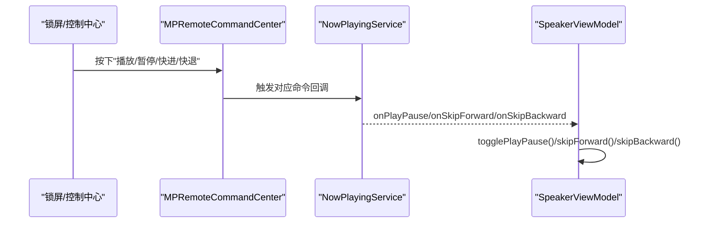

**图表来源**
- [NowPlayingService.swift:33-55](file://Services/NowPlayingService.swift#L33-L55)
- [SpeakerViewModel.swift:262-266](file://ViewModels/SpeakerViewModel.swift#L262-L266)
- [Info.plist:5-8](file://Resources/Info.plist#L5-L8)

**章节来源**
- [Info.plist:1-48](file://Resources/Info.plist#L1-L48)
- [NowPlayingService.swift:1-57](file://Services/NowPlayingService.swift#L1-L57)
- [SpeakerViewModel.swift:262-266](file://ViewModels/SpeakerViewModel.swift#L262-L266)

### 音频中断处理策略（来电、闹钟等）
- 现状
  - 当前代码未显式监听 AVAudioSession.interruptionNotification 或相关中断回调。
  - 录音模式下需要特别关注中断处理，避免录音丢失。
- 推荐策略
  - 监听中断开始：暂停播放、降低音量或静音，保持会话激活但让出通道。
  - 监听中断结束：根据中断类型决定是否恢复播放；若被其他应用抢占，则重新激活并恢复。
  - 结合 AVAudioSession.interruptionType 与 interruptionOptions 判断是暂时中断还是永久抢占。
  - 在恢复路径中检查当前状态，仅在非手动停止的情况下自动恢复。
  - 录音中断处理：暂停录音、保存临时文件、提示用户中断原因。
- 实施建议
  - 在 AudioSessionService 中增加中断监听与恢复逻辑，暴露 resumeAfterInterruption 等方法。
  - 在 SpeakerViewModel 中对接恢复回调，确保 UI 与锁屏信息一致。
  - 在 AudioRecorderService 中添加录音中断处理，确保录音数据安全。

[本节为通用指导，不涉及具体文件分析]

## 依赖关系分析
- 耦合与内聚
  - AudioSessionService 高度内聚，仅关注 AVAudioSession 的设置与生命周期。
  - AudioRecorderService 独立封装录音功能，与播放功能解耦，现采用 @MainActor 确保线程安全。
  - NowPlayingService 独立于业务逻辑，只负责系统与 UI 的桥接。
  - SpeakerViewModel 作为门面，聚合多个服务，承担编排职责。
  - VnoteRecorderView 专注于录音界面逻辑，通过服务层访问底层功能。
- 外部依赖
  - AVFoundation：音频会话与 TTS。
  - MediaPlayer：锁屏信息与远程控制。
  - UserDefaults：持久化语音配置与阅读进度。
  - Speech：语音识别框架支持。
  - SwiftData：Vnote 数据持久化。

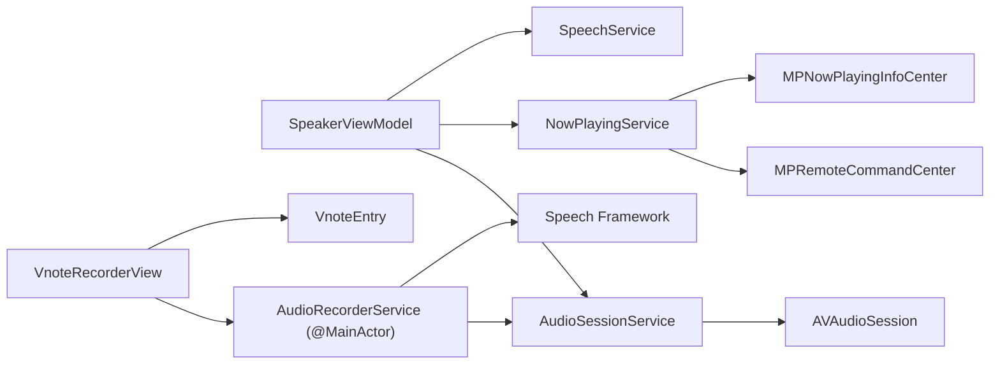

**图表来源**
- [SpeakerViewModel.swift:20-54](file://ViewModels/SpeakerViewModel.swift#L20-L54)
- [AudioSessionService.swift:9-10](file://Services/AudioSessionService.swift#L9-L10)
- [AudioRecorderService.swift:12-14](file://Services/AudioRecorderService.swift#L12-L14)
- [NowPlayingService.swift:11-12](file://Services/NowPlayingService.swift#L11-L12)
- [VnoteRecorderView.swift:9-15](file://Views/VnoteRecorderView.swift#L9-L15)

**章节来源**
- [SpeakerViewModel.swift:1-500](file://ViewModels/SpeakerViewModel.swift#L1-L500)
- [AudioSessionService.swift:1-46](file://Services/AudioSessionService.swift#L1-L46)
- [AudioRecorderService.swift:1-148](file://Services/AudioRecorderService.swift#L1-L148)
- [NowPlayingService.swift:1-57](file://Services/NowPlayingService.swift#L1-L57)
- [VnoteRecorderView.swift:1-339](file://Views/VnoteRecorderView.swift#L1-L339)

## 性能与最佳实践
- 会话配置
  - 仅在首次需要时配置，避免频繁变更 category/mode 导致的抖动。
  - 使用 spokenAudio 模式优化语音合成体验。
  - 录音时使用 measurement 模式以获得更准确的音频输入。
- 激活时机
  - 延迟激活，减少不必要的音频通道占用；在真正需要输出时再激活。
  - 录音会话应尽快激活，减少延迟。
- 中断与恢复
  - 实现中断监听与恢复逻辑，确保来电/闹钟等场景下用户体验连贯。
  - 录音中断时需要特别处理，确保录音数据不丢失。
- 锁屏信息更新频率
  - 合理控制 update 频率，避免频繁刷新造成额外开销。
- 错误降级
  - 当第三方引擎失败时，自动降级到系统 TTS，保障可用性。
  - STT 失败时仍保存录音文件，支持后续重试。
- 资源释放
  - 停止播放时及时停用会话并清理锁屏信息，避免资源泄漏。
  - 录音取消时及时删除临时文件，避免存储空间浪费。
- **录音优化**
  - 使用合适的采样率（16kHz）平衡音质和文件大小。
  - 实时监控音量电平，提供用户反馈。
  - 合理的文件命名和存储策略。
- **线程安全最佳实践**
  - **重要** 使用 @MainActor 确保所有录音相关操作在主线程执行
  - Timer 调度使用 RunLoop.main.add(t, forMode: .common) 避免跨线程问题
  - 在异步操作中注意状态同步，避免竞态条件

[本节为通用指导，不涉及具体文件分析]

## 故障排查指南
- 无法后台播放
  - 检查 Info.plist 是否包含 UIBackgroundModes: audio。
- 锁屏无信息或控制无效
  - 确认 NowPlayingService.update 被正常调用，且命令回调已绑定到 SpeakerViewModel。
- 播放无声或通道冲突
  - 检查 AudioSessionService.activate 是否成功；确认没有其他应用独占音频通道。
- 中断后不恢复
  - 添加中断监听与恢复逻辑，确保在适当时机重新激活并继续播放。
- 状态不同步
  - 核对 SpeakerViewModel 的状态机与合成器回调，确保 UI 与锁屏信息一致。
- **录音相关问题**
  - **麦克风权限问题**：检查 NSMicrophoneUsageDescription 是否正确配置，确认用户已授权。
  - **录音失败**：检查录音文件格式设置是否正确，确认存储空间充足。
  - **录音无声**：检查设备麦克风是否正常工作，确认没有硬件问题。
  - **录音文件过大**：调整采样率和编码格式，考虑压缩存储。
  - **录音中断丢失**：实现录音中断处理，保存临时文件并提示用户。
  - **线程安全问题**：确认 AudioRecorderService 使用 @MainActor，所有操作在主线程执行。
  - **Timer 调度问题**：检查 Timer 是否使用 RunLoop.main.add(t, forMode: .common) 正确调度。
  - **状态不一致**：检查定时器回调中的 isRecording guard 条件，防止状态竞态。

**章节来源**
- [Info.plist:5-8](file://Resources/Info.plist#L5-L8)
- [Info.plist:42-45](file://Resources/Info.plist#L42-L45)
- [NowPlayingService.swift:18-55](file://Services/NowPlayingService.swift#L18-L55)
- [AudioSessionService.swift:29-44](file://Services/AudioSessionService.swift#L29-L44)
- [AudioRecorderService.swift:29-112](file://Services/AudioRecorderService.swift#L29-L112)
- [SpeakerViewModel.swift:215-266](file://ViewModels/SpeakerViewModel.swift#L215-L266)

## 结论
Knowledge 应用的音频会话管理采用分层与门面模式，将 AVAudioSession 的管理集中在 AudioSessionService，通过 SpeakerViewModel 编排播放流程，并由 NowPlayingService 完成锁屏与远程控制集成。**最新的 AudioRecorderService 增强版本通过 @MainActor 注解确保了线程安全，Timer 调度优化解决了跨线程问题，改进的错误处理增强了系统的健壮性。**

当前实现了基础的后台播放与系统媒体控制，**并成功集成了增强的录音功能**。建议在后续版本中加入完整的音频中断监听与恢复机制，进一步提升鲁棒性与用户体验，特别是针对录音场景的中断处理和数据保护。

**更新** 随着 Vnote 功能的加入和 AudioRecorderService 的重大增强，音频会话管理现在需要同时支持播放和录音两种模式，这要求更加精细化的会话状态管理和模式切换逻辑。未来的改进方向包括：
- 统一会话管理模式，抽象出通用的会话配置接口
- 完善中断处理机制，特别是录音中断的保护
- 优化录音质量与存储效率的平衡
- 增强错误处理和用户反馈机制
- **继续保持线程安全最佳实践，确保所有音频操作在主线程安全执行**