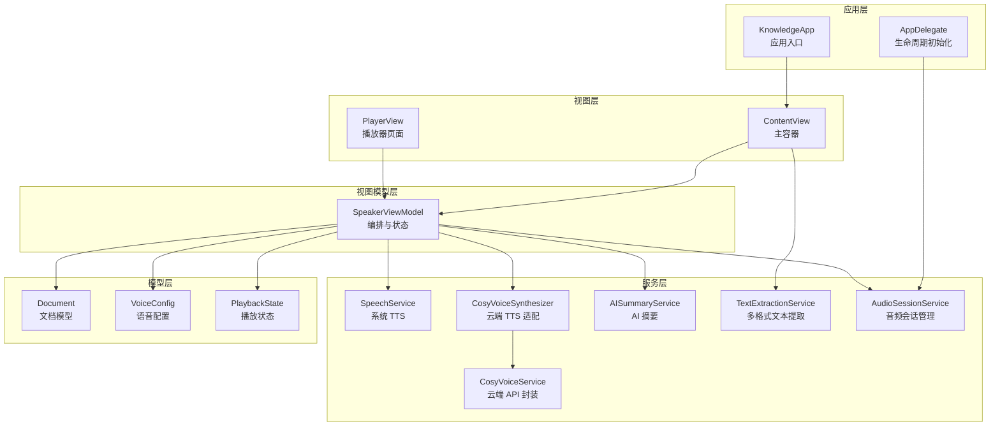
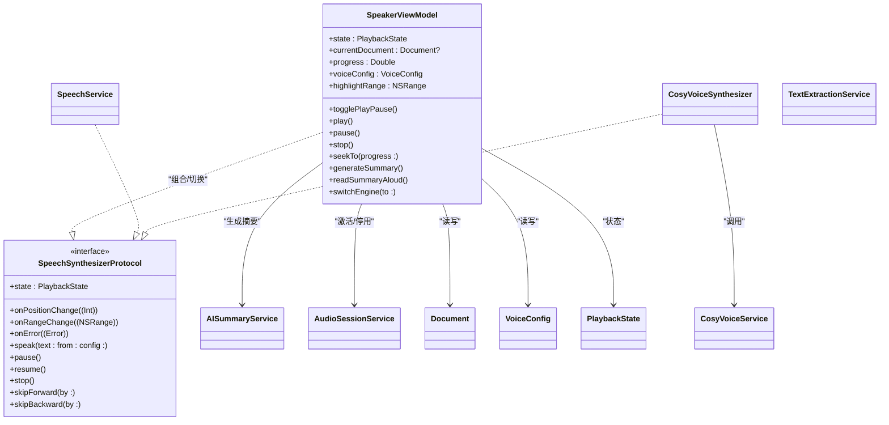
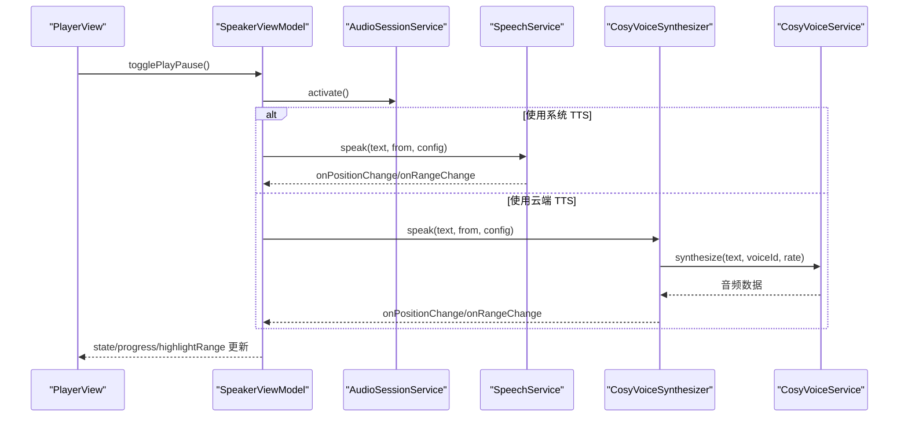
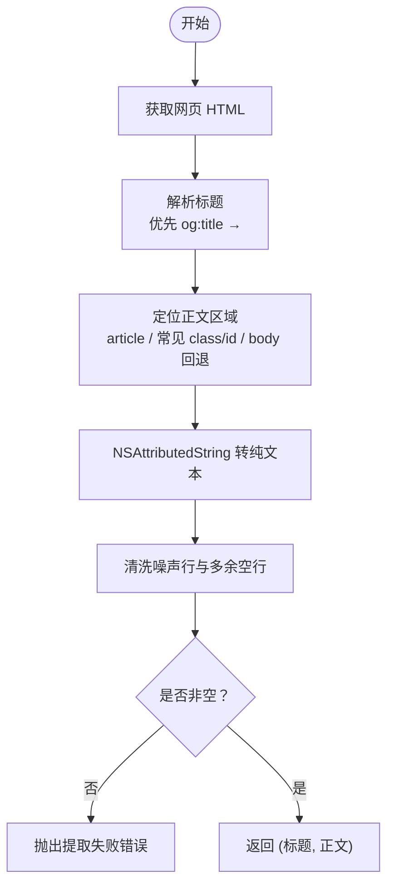
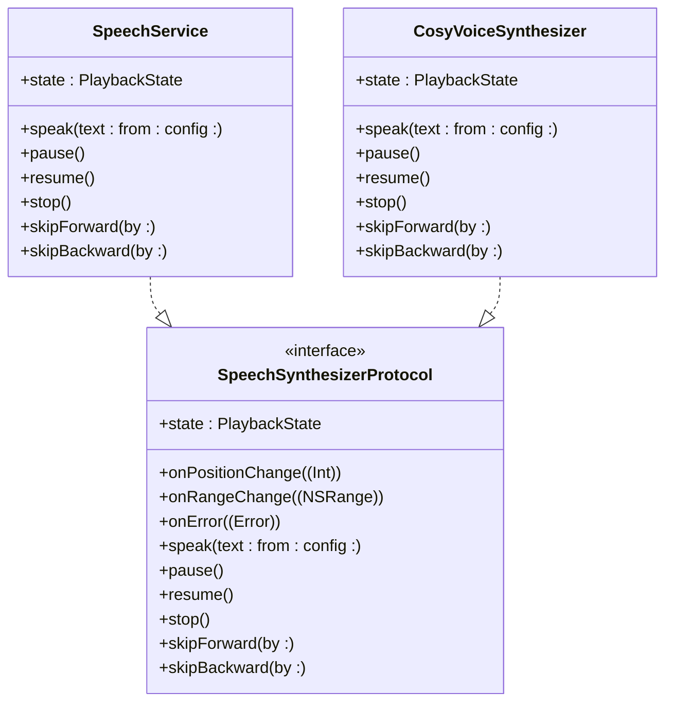
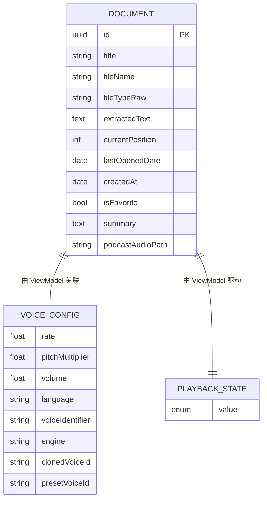
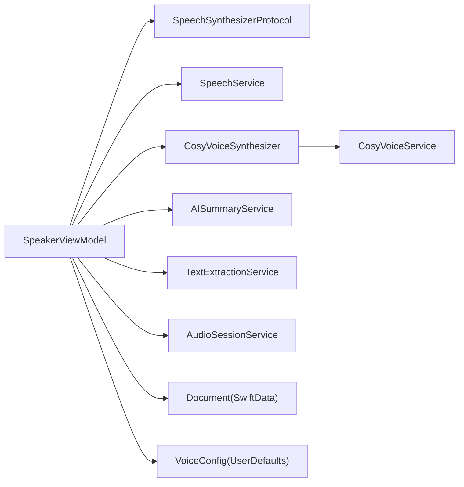

# 项目概述

<cite>
**本文引用的文件**
- [KnowledgeApp.swift](file://App/KnowledgeApp.swift)
- [AppDelegate.swift](file://App/AppDelegate.swift)
- [Document.swift](file://Models/Document.swift)
- [PlaybackState.swift](file://Models/PlaybackState.swift)
- [VoiceConfig.swift](file://Models/VoiceConfig.swift)
- [SpeechSynthesizerProtocol.swift](file://Services/SpeechSynthesizerProtocol.swift)
- [SpeechService.swift](file://Services/SpeechService.swift)
- [CosyVoiceSynthesizer.swift](file://Services/CosyVoiceSynthesizer.swift)
- [CosyVoiceService.swift](file://Services/CosyVoiceService.swift)
- [AISummaryService.swift](file://Services/AISummaryService.swift)
- [TextExtractionService.swift](file://Services/TextExtractionService.swift)
- [AudioSessionService.swift](file://Services/AudioSessionService.swift)
- [SpeakerViewModel.swift](file://ViewModels/SpeakerViewModel.swift)
- [ContentView.swift](file://Views/ContentView.swift)
- [PlayerView.swift](file://Views/PlayerView.swift)
</cite>

## 目录
1. [简介](#简介)
2. [项目结构](#项目结构)
3. [核心组件](#核心组件)
4. [架构总览](#架构总览)
5. [详细组件分析](#详细组件分析)
6. [依赖关系分析](#依赖关系分析)
7. [性能考量](#性能考量)
8. [故障排查指南](#故障排查指南)
9. [结论](#结论)
10. [附录：使用场景示例](#附录使用场景示例)

## 简介
Knowledge iOS 是一款基于 SwiftUI 的文档朗读应用，核心价值在于“让阅读更轻松、更高效”。它支持多格式文档导入与文本提取，提供系统 TTS 与云端 AI 语音合成（CosyVoice）双引擎朗读，并内置智能摘要生成能力。通过 SwiftData 持久化文档与播放进度，结合 MVVM 架构与清晰的组件分层，为初学者提供直观的使用体验，同时为有经验的开发者提供可扩展的技术细节。

典型用户痛点与解决方案：
- 长文阅读耗时：一键朗读，自动分段与高亮跟随，支持倍速与跳转。
- 信息过载：AI 摘要快速提炼要点，辅助决策与复习。
- 多格式不便：PDF、EPUB、Word、Excel、PPT、Markdown、网页等统一入库，自动清洗与 OCR 回退。
- 跨设备连贯：后台播放、锁屏控制、通知中心与控制中心联动。

## 项目结构
项目采用按职责分层的组织方式：
- App：应用入口与全局配置
- Models：数据模型与状态枚举
- Services：业务服务层（TTS、网络、音频会话、文本提取、AI 摘要等）
- ViewModels：MVVM 中的视图模型，协调 UI 与业务逻辑
- Views：SwiftUI 界面
- ShareExtension：分享扩展入口（用于从外部导入内容）
- UIKit：UIKit 桥接（如文档选择器）

图表来源
- [KnowledgeApp.swift:1-29](file://App/KnowledgeApp.swift#L1-L29)
- [AppDelegate.swift:1-14](file://App/AppDelegate.swift#L1-L14)
- [ContentView.swift:1-98](file://Views/ContentView.swift#L1-L98)
- [PlayerView.swift:1-174](file://Views/PlayerView.swift#L1-L174)
- [SpeakerViewModel.swift:1-314](file://ViewModels/SpeakerViewModel.swift#L1-L314)
- [SpeechService.swift:1-155](file://Services/SpeechService.swift#L1-L155)
- [CosyVoiceSynthesizer.swift:1-258](file://Services/CosyVoiceSynthesizer.swift#L1-L258)
- [CosyVoiceService.swift:1-219](file://Services/CosyVoiceService.swift#L1-L219)
- [AISummaryService.swift:1-180](file://Services/AISummaryService.swift#L1-L180)
- [TextExtractionService.swift:1-748](file://Services/TextExtractionService.swift#L1-L748)
- [AudioSessionService.swift:1-46](file://Services/AudioSessionService.swift#L1-L46)
- [Document.swift:1-115](file://Models/Document.swift#L1-L115)
- [VoiceConfig.swift:1-52](file://Models/VoiceConfig.swift#L1-L52)
- [PlaybackState.swift:1-9](file://Models/PlaybackState.swift#L1-L9)

章节来源
- [KnowledgeApp.swift:1-29](file://App/KnowledgeApp.swift#L1-L29)
- [AppDelegate.swift:1-14](file://App/AppDelegate.swift#L1-L14)

## 核心组件
- 数据模型
  - Document：文档实体，包含标题、文件名、类型、提取文本、当前位置、创建时间、收藏标记、AI 摘要缓存、播客音频路径等；并提供计算属性如总长度与阅读进度。
  - VoiceConfig：语音配置，包括语速、音高、音量、语言、音色标识、引擎选择、克隆/预设音色 ID 等。
  - PlaybackState：播放状态枚举（空闲、播放中、暂停、完成）。

- 语音合成抽象
  - SpeechSynthesizerProtocol：定义统一的 TTS 接口（播放、暂停、恢复、停止、快进/后退、位置与范围回调、错误回调），便于在系统 TTS 与云端 TTS 之间切换。

- 语音引擎实现
  - SpeechService：基于 AVSpeechSynthesizer 的系统 TTS 实现，负责切块朗读、断句优化、实时位置与范围回调。
  - CosyVoiceSynthesizer：云端 TTS 适配器，将 HTTP 流式合成结果转为协议一致的播放行为，支持分段合成、临时文件播放、自动续播与错误降级。

- 云端服务
  - CosyVoiceService：封装阿里云 DashScope CosyVoice 的 TTS 与语音克隆接口，处理鉴权、请求、响应解析与错误映射。
  - AISummaryService：调用通义千问生成文档摘要，返回结构化结果（摘要正文 + 关键要点），并做本地缓存。

- 文本提取
  - TextExtractionService：统一入口 extractText(from:)，根据扩展名分发到 PDF/EPUB/Office/Markdown/纯文本/网页等提取策略；网页提取具备正文定位与噪声过滤；PDF 支持 OCR 回退。

- 音频与会话
  - AudioSessionService：集中管理 AVAudioSession 的配置、激活与停用，避免过早占用音频资源。

- 视图与编排
  - SpeakerViewModel：MVVM 的核心编排者，暴露播放控制、配置更新、AI 摘要生成、远程播放控制绑定、位置同步与持久化。
  - ContentView：Tab 容器，集成分享扩展处理、错误提示、SwiftData 上下文注入。
  - PlayerView：播放器页面，展示文档头部、高亮文本、进度条与控制按钮，并集成 AI 摘要弹窗。

章节来源
- [Document.swift:1-115](file://Models/Document.swift#L1-L115)
- [VoiceConfig.swift:1-52](file://Models/VoiceConfig.swift#L1-L52)
- [PlaybackState.swift:1-9](file://Models/PlaybackState.swift#L1-L9)
- [SpeechSynthesizerProtocol.swift:1-20](file://Services/SpeechSynthesizerProtocol.swift#L1-L20)
- [SpeechService.swift:1-155](file://Services/SpeechService.swift#L1-L155)
- [CosyVoiceSynthesizer.swift:1-258](file://Services/CosyVoiceSynthesizer.swift#L1-L258)
- [CosyVoiceService.swift:1-219](file://Services/CosyVoiceService.swift#L1-L219)
- [AISummaryService.swift:1-180](file://Services/AISummaryService.swift#L1-L180)
- [TextExtractionService.swift:1-748](file://Services/TextExtractionService.swift#L1-L748)
- [AudioSessionService.swift:1-46](file://Services/AudioSessionService.swift#L1-L46)
- [SpeakerViewModel.swift:1-314](file://ViewModels/SpeakerViewModel.swift#L1-L314)
- [ContentView.swift:1-98](file://Views/ContentView.swift#L1-L98)
- [PlayerView.swift:1-174](file://Views/PlayerView.swift#L1-L174)

## 架构总览
整体采用 SwiftUI + SwiftData + MVVM 的分层架构：
- 视图层（SwiftUI）：声明式 UI，仅消费 ViewModel 的 @Published 状态。
- 视图模型层（@MainActor）：聚合服务、驱动状态变化、处理异步任务与错误。
- 服务层：解耦具体实现（系统/云端 TTS、网络请求、文本提取、音频会话）。
- 数据层：SwiftData 持久化 Document 模型，UserDefaults 存储语音配置。

图表来源
- [SpeakerViewModel.swift:1-314](file://ViewModels/SpeakerViewModel.swift#L1-L314)
- [SpeechSynthesizerProtocol.swift:1-20](file://Services/SpeechSynthesizerProtocol.swift#L1-L20)
- [SpeechService.swift:1-155](file://Services/SpeechService.swift#L1-L155)
- [CosyVoiceSynthesizer.swift:1-258](file://Services/CosyVoiceSynthesizer.swift#L1-L258)
- [CosyVoiceService.swift:1-219](file://Services/CosyVoiceService.swift#L1-L219)
- [AISummaryService.swift:1-180](file://Services/AISummaryService.swift#L1-L180)
- [TextExtractionService.swift:1-748](file://Services/TextExtractionService.swift#L1-L748)
- [AudioSessionService.swift:1-46](file://Services/AudioSessionService.swift#L1-L46)
- [Document.swift:1-115](file://Models/Document.swift#L1-L115)
- [VoiceConfig.swift:1-52](file://Models/VoiceConfig.swift#L1-L52)
- [PlaybackState.swift:1-9](file://Models/PlaybackState.swift#L1-L9)

## 详细组件分析

### 播放控制流程（序列图）
该流程展示了从用户点击播放到实际发声的关键步骤，以及云端 TTS 的合成与播放链路。

图表来源
- [PlayerView.swift:1-174](file://Views/PlayerView.swift#L1-L174)
- [SpeakerViewModel.swift:1-314](file://ViewModels/SpeakerViewModel.swift#L1-L314)
- [AudioSessionService.swift:1-46](file://Services/AudioSessionService.swift#L1-L46)
- [SpeechService.swift:1-155](file://Services/SpeechService.swift#L1-L155)
- [CosyVoiceSynthesizer.swift:1-258](file://Services/CosyVoiceSynthesizer.swift#L1-L258)
- [CosyVoiceService.swift:1-219](file://Services/CosyVoiceService.swift#L1-L219)

章节来源
- [SpeakerViewModel.swift:100-170](file://ViewModels/SpeakerViewModel.swift#L100-L170)
- [SpeechService.swift:30-90](file://Services/SpeechService.swift#L30-L90)
- [CosyVoiceSynthesizer.swift:28-90](file://Services/CosyVoiceSynthesizer.swift#L28-L90)
- [CosyVoiceService.swift:27-88](file://Services/CosyVoiceService.swift#L27-L88)

### 文本提取算法（流程图）
以网页提取为例，展示从抓取 HTML 到清洗正文的完整流程。

图表来源
- [TextExtractionService.swift:58-114](file://Services/TextExtractionService.swift#L58-L114)
- [TextExtractionService.swift:146-192](file://Services/TextExtractionService.swift#L146-L192)
- [TextExtractionService.swift:245-285](file://Services/TextExtractionService.swift#L245-L285)

章节来源
- [TextExtractionService.swift:58-114](file://Services/TextExtractionService.swift#L58-L114)
- [TextExtractionService.swift:146-192](file://Services/TextExtractionService.swift#L146-L192)
- [TextExtractionService.swift:245-285](file://Services/TextExtractionService.swift#L245-L285)

### 语音引擎类图
展示系统 TTS 与云端 TTS 的统一抽象与实现关系。

图表来源
- [SpeechSynthesizerProtocol.swift:1-20](file://Services/SpeechSynthesizerProtocol.swift#L1-L20)
- [SpeechService.swift:1-155](file://Services/SpeechService.swift#L1-L155)
- [CosyVoiceSynthesizer.swift:1-258](file://Services/CosyVoiceSynthesizer.swift#L1-L258)

章节来源
- [SpeechSynthesizerProtocol.swift:1-20](file://Services/SpeechSynthesizerProtocol.swift#L1-L20)
- [SpeechService.swift:1-155](file://Services/SpeechService.swift#L1-L155)
- [CosyVoiceSynthesizer.swift:1-258](file://Services/CosyVoiceSynthesizer.swift#L1-L258)

### 数据模型关系图

图表来源
- [Document.swift:54-115](file://Models/Document.swift#L54-L115)
- [VoiceConfig.swift:24-52](file://Models/VoiceConfig.swift#L24-L52)
- [PlaybackState.swift:1-9](file://Models/PlaybackState.swift#L1-L9)

章节来源
- [Document.swift:54-115](file://Models/Document.swift#L54-L115)
- [VoiceConfig.swift:24-52](file://Models/VoiceConfig.swift#L24-L52)
- [PlaybackState.swift:1-9](file://Models/PlaybackState.swift#L1-L9)

## 依赖关系分析
- 低耦合高内聚：
  - 通过 SpeechSynthesizerProtocol 隔离系统/云端 TTS 差异，SpeakerViewModel 无需关心具体实现。
  - 云端 TTS 进一步拆分为 CosyVoiceSynthesizer（适配层）与 CosyVoiceService（HTTP 封装），职责清晰。
- 外部依赖：
  - AVFoundation：系统 TTS 与音频播放。
  - URLSession：网络请求（AI 摘要、CosyVoice）。
  - PDFKit/Vision：PDF 文本提取与 OCR。
  - SwiftData：文档持久化。
- 潜在风险与缓解：
  - 云端服务不稳定：SpeakerViewModel 在 onError 时自动降级到系统 TTS，保障可用性。
  - 大文档内存压力：文本提取与 TTS 均进行分段处理，避免一次性加载过大文本或音频。

图表来源
- [SpeakerViewModel.swift:1-314](file://ViewModels/SpeakerViewModel.swift#L1-L314)
- [SpeechSynthesizerProtocol.swift:1-20](file://Services/SpeechSynthesizerProtocol.swift#L1-L20)
- [SpeechService.swift:1-155](file://Services/SpeechService.swift#L1-L155)
- [CosyVoiceSynthesizer.swift:1-258](file://Services/CosyVoiceSynthesizer.swift#L1-L258)
- [CosyVoiceService.swift:1-219](file://Services/CosyVoiceService.swift#L1-L219)
- [AISummaryService.swift:1-180](file://Services/AISummaryService.swift#L1-L180)
- [TextExtractionService.swift:1-748](file://Services/TextExtractionService.swift#L1-L748)
- [AudioSessionService.swift:1-46](file://Services/AudioSessionService.swift#L1-L46)
- [Document.swift:1-115](file://Models/Document.swift#L1-L115)
- [VoiceConfig.swift:1-52](file://Models/VoiceConfig.swift#L1-L52)

章节来源
- [SpeakerViewModel.swift:1-314](file://ViewModels/SpeakerViewModel.swift#L1-L314)

## 性能考量
- 文本分段与断句优化：
  - 系统 TTS 按自然断点（句号、换行等）切块，减少卡顿与不自然停顿。
  - 云端 TTS 每段上限约 500 字符，避免单次请求过长导致超时。
- 网络与并发：
  - 云端合成串行推进，段间加入短暂延迟，降低服务端压力。
  - 超时与错误码统一处理，失败即降级。
- 内存与磁盘：
  - 云端音频写入临时文件后播放，避免长时间驻留内存。
  - EPUB 解压使用临时目录，完成后清理。
- 渲染与滚动：
  - 高亮文本使用 AttributedString 局部着色，配合 ScrollViewReader 平滑滚动至当前段落。

[本节为通用指导，不直接分析具体文件]

## 故障排查指南
- 无法生成摘要
  - 检查是否在设置中配置了阿里云 API Key。
  - 若返回 401/403，说明 Key 无效或权限不足。
  - 网络异常或服务端错误会抛出对应错误，建议重试或检查网络。
- 云端 TTS 不可用
  - 当 onError 触发时，会自动降级到系统 TTS，可在设置中确认引擎切换。
  - 若仍失败，检查网络与语音 ID 是否正确。
- 音频无输出
  - 确认 AudioSession 已正确配置与激活。
  - 检查系统静音开关与蓝牙/AirPlay 设备连接。
- 网页提取为空
  - 目标站点可能未提供可识别正文区域，尝试其他链接或手动粘贴文本。
- PDF 无法识别文字
  - 图片型 PDF 会启用 OCR，若质量过低可能失败，建议提高扫描清晰度。

章节来源
- [AISummaryService.swift:158-180](file://Services/AISummaryService.swift#L158-L180)
- [CosyVoiceService.swift:191-219](file://Services/CosyVoiceService.swift#L191-L219)
- [SpeakerViewModel.swift:234-247](file://ViewModels/SpeakerViewModel.swift#L234-L247)
- [AudioSessionService.swift:15-45](file://Services/AudioSessionService.swift#L15-L45)
- [TextExtractionService.swift:58-114](file://Services/TextExtractionService.swift#L58-L114)
- [TextExtractionService.swift:373-426](file://Services/TextExtractionService.swift#L373-L426)

## 结论
Knowledge iOS 以 SwiftUI + SwiftData + MVVM 为核心，构建了“多格式文档导入—智能摘要—高质量朗读”的一体化体验。通过统一的语音合成协议与可插拔引擎设计，既保证了离线可用性与稳定性，又提供了云端高品质音色的扩展空间。完善的错误处理与降级机制，确保在不同网络与设备环境下都能稳定运行。

[本节为总结性内容，不直接分析具体文件]

## 附录：使用场景示例
- 通勤听书
  - 从系统文件导入 PDF/EPUB/Word，自动提取文本并朗读，支持倍速与跳过。
- 会议资料速读
  - 打开网页文章，一键入库并生成摘要，快速掌握要点。
- 学习复习
  - 对长文生成摘要与要点列表，边听边看高亮文本，提升记忆效率。
- 无障碍阅读
  - 借助系统 TTS 与云端 TTS，满足不同偏好与场景需求。

[本节为概念性内容，不直接分析具体文件]